# Bitcoin Scripts

OPNet provides utilities for working with Bitcoin scripts, addresses, and timelocks. This enables contracts to interact with Bitcoin's native scripting capabilities.

## Bitcoin Script Structure

```mermaid
flowchart TB
    subgraph OPNet["⚡ OPNet Bitcoin Script Architecture"]
        direction TB

        subgraph ScriptComponents["📜 Script Components"]
            OP["⚙️ Opcodes<br/>OP_DUP, OP_HASH160, etc."]
            DATA["📦 Data Pushes<br/>Public keys, hashes, etc."]
            CTRL["🔀 Control Flow<br/>OP_IF, OP_ELSE, OP_ENDIF"]
        end

        subgraph CommonTypes["🔑 Common Script Types"]
            P2PKH["P2PKH<br/>OP_DUP OP_HASH160 &lt;hash&gt;<br/>OP_EQUALVERIFY OP_CHECKSIG"]
            P2SH["P2SH<br/>OP_HASH160 &lt;hash&gt;<br/>OP_EQUAL"]
            P2WPKH["P2WPKH<br/>OP_0 &lt;20-byte hash&gt;"]
            P2WSH["P2WSH<br/>OP_0 &lt;32-byte hash&gt;"]
            P2TR["✨ P2TR (Taproot)<br/>OP_1 &lt;32-byte key&gt;"]
        end
    end

    OP --> P2PKH
    OP --> P2SH
    DATA --> P2PKH
    DATA --> P2WPKH
    DATA --> P2WSH
    DATA --> P2TR
```



## Overview

```typescript
import {
    Blockchain,
    BitcoinOpcodes,
    BitcoinScript,
    BitcoinAddresses,
    ScriptNumber,
    ScriptIO,
    Segwit,
    Networks,
    Network,
} from '@btc-vision/btc-runtime/runtime';
```

## Networks

OPNet supports three Bitcoin networks:

```typescript
import { Networks, Network } from '@btc-vision/btc-runtime/runtime';

// Network enum values
Networks.Mainnet  // 0
Networks.Testnet  // 1
Networks.Regtest  // 2

// Get human-readable prefix for addresses
const hrp = Network.hrp(Networks.Mainnet);  // "bc"
const hrpTestnet = Network.hrp(Networks.Testnet);  // "tb"
const hrpRegtest = Network.hrp(Networks.Regtest);  // "bcrt"

// Get chain ID (32-byte identifier)
const chainId = Network.getChainId(Networks.Mainnet);
```

## Address Derivation Flow


## Address Types

### P2TR (Pay to Taproot)

Create Taproot addresses using the `BitcoinAddresses` class:

```typescript
import { BitcoinAddresses, Networks, Network } from '@btc-vision/btc-runtime/runtime';

// P2TR address from 32-byte x-only public key
public createP2TRAddress(outputKeyX32: Uint8Array): string {
    const hrp = Network.hrp(Networks.Mainnet);
    return BitcoinAddresses.p2trKeyPathAddress(outputKeyX32, hrp);
}

// Verify a P2TR address
public verifyP2TRAddress(outputKeyX32: Uint8Array, address: string): bool {
    const hrp = Network.hrp(Networks.Mainnet);
    return BitcoinAddresses.verifyP2trAddress(outputKeyX32, address, hrp);
}
```

### P2WSH (Pay to Witness Script Hash)

For complex scripts requiring witness script hash:

```typescript
import { BitcoinAddresses, Segwit, sha256 } from '@btc-vision/btc-runtime/runtime';

// Create P2WSH from script
public createP2WSHAddress(script: Uint8Array, hrp: string): string {
    return Segwit.p2wsh(hrp, script);
}

// Create multisig P2WSH address
public createMultisigP2WSH(
    m: i32,
    pubkeys: Array<Uint8Array>,
    hrp: string
): MultisigP2wshResult {
    return BitcoinAddresses.multisigP2wshAddress(m, pubkeys, hrp);
}
```

### P2WPKH (Pay to Witness Public Key Hash)

For simple public key payments:

```typescript
import { BitcoinAddresses, Segwit } from '@btc-vision/btc-runtime/runtime';

// P2WPKH from compressed public key
public createP2WPKHAddress(pubkey: Uint8Array, hrp: string): string {
    return BitcoinAddresses.p2wpkh(pubkey, hrp);
}
```

## Bitcoin Opcodes

The `BitcoinOpcodes` class provides all standard Bitcoin opcodes:

```typescript
import { BitcoinOpcodes } from '@btc-vision/btc-runtime/runtime';

// Stack operations
BitcoinOpcodes.OP_DUP         // 118 - Duplicate top stack item
BitcoinOpcodes.OP_DROP        // 117 - Remove top stack item
BitcoinOpcodes.OP_SWAP        // 124 - Swap top two items

// Crypto operations
BitcoinOpcodes.OP_HASH160     // 169 - RIPEMD160(SHA256(x))
BitcoinOpcodes.OP_SHA256      // 168 - SHA256(x)
BitcoinOpcodes.OP_CHECKSIG    // 172 - Verify signature
BitcoinOpcodes.OP_CHECKMULTISIG // 174 - Verify multiple signatures

// Control flow
BitcoinOpcodes.OP_IF          // 99 - Conditional execution
BitcoinOpcodes.OP_ELSE        // 103
BitcoinOpcodes.OP_ENDIF       // 104
BitcoinOpcodes.OP_VERIFY      // 105 - Verify top is truthy
BitcoinOpcodes.OP_RETURN      // 106 - Mark output as unspendable

// Timelocks
BitcoinOpcodes.OP_CHECKLOCKTIMEVERIFY  // 177 - nLockTime check
BitcoinOpcodes.OP_CHECKSEQUENCEVERIFY  // 178 - Relative timelock

// Number opcodes (OP_0 through OP_16)
BitcoinOpcodes.OP_0           // 0 - Push empty/zero
BitcoinOpcodes.OP_1           // 81 - Push 1
BitcoinOpcodes.OP_2           // 82 - Push 2
BitcoinOpcodes.OP_3           // 83 - Push 3
// ... up to OP_16

// Get OP_N dynamically
BitcoinOpcodes.opN(5);        // Returns OP_5 (85)
```

## Script Building

### Building Scripts with BytesWriter

```typescript
import { BytesWriter, BitcoinOpcodes, ScriptIO, ScriptNumber } from '@btc-vision/btc-runtime/runtime';

// Build a simple P2PKH-style script
public buildP2PKHScript(pubkeyHash: Uint8Array): Uint8Array {
    const script = new BytesWriter(25);
    script.writeU8(BitcoinOpcodes.OP_DUP);
    script.writeU8(BitcoinOpcodes.OP_HASH160);
    script.writeU8(20);  // Push 20 bytes
    script.writeBytes(pubkeyHash);
    script.writeU8(BitcoinOpcodes.OP_EQUALVERIFY);
    script.writeU8(BitcoinOpcodes.OP_CHECKSIG);
    return script.getBuffer();
}
```

### Building Multisig Scripts

Use the built-in `BitcoinScript.multisig()` method:

```typescript
import { BitcoinScript } from '@btc-vision/btc-runtime/runtime';

// Build a 2-of-3 multisig script
public buildMultisigScript(
    pubkey1: Uint8Array,
    pubkey2: Uint8Array,
    pubkey3: Uint8Array
): Uint8Array {
    const pubkeys = new Array<Uint8Array>(3);
    pubkeys[0] = pubkey1;
    pubkeys[1] = pubkey2;
    pubkeys[2] = pubkey3;

    // m = 2 (required signatures), n = 3 (total keys)
    return BitcoinScript.multisig(2, pubkeys);
}
```

Manual multisig script building:

```typescript
public buildMultisigManual(
    pubkey1: Uint8Array,
    pubkey2: Uint8Array,
    pubkey3: Uint8Array
): Uint8Array {
    const script = new BytesWriter(105);

    // OP_2 - require 2 signatures
    script.writeU8(BitcoinOpcodes.OP_2);

    // Push pubkey1 (33 bytes compressed)
    script.writeU8(33);
    script.writeBytes(pubkey1);

    // Push pubkey2
    script.writeU8(33);
    script.writeBytes(pubkey2);

    // Push pubkey3
    script.writeU8(33);
    script.writeBytes(pubkey3);

    // OP_3 - 3 total pubkeys
    script.writeU8(BitcoinOpcodes.OP_3);

    // OP_CHECKMULTISIG
    script.writeU8(BitcoinOpcodes.OP_CHECKMULTISIG);

    return script.getBuffer();
}
```

## Timelock Script Flow

```mermaid
flowchart TB
    subgraph OPNet["📝 OPNet Bitcoin Timelock Scripts"]
        direction TB

        subgraph CSVFlow["⏱️ CSV (CheckSequenceVerify) - Relative Timelock"]
            CSV1["🔒 Transaction Input<br/>nSequence field"] --> CSV2{"Timelock Type?"}
            CSV2 -->|"Block-based"| CSV3["⏱️ Blocks since confirmation<br/>Value = block count"]
            CSV2 -->|"Time-based"| CSV4["⏰ Time since confirmation<br/>Value = 512-second units + FLAG"]

            CSV3 --> CSV5["⚡ OP_CSV verifies:<br/>nSequence >= CSV_VALUE"]
            CSV4 --> CSV5
            CSV5 --> CSV6{"🔐 Valid?"}
            CSV6 -->|"Yes"| CSV7["✅ Continue execution"]
            CSV6 -->|"No"| CSV8["❌ Transaction invalid"]
        end

        subgraph CLTVFlow["⏰ CLTV (CheckLockTimeVerify) - Absolute Timelock"]
            CLTV1["🔒 Transaction<br/>nLockTime field"] --> CLTV2{"Timelock Type?"}
            CLTV2 -->|"Block-based"| CLTV3["⏱️ Block height<br/>Value &lt; 500000000"]
            CLTV2 -->|"Time-based"| CLTV4["⏰ Unix timestamp<br/>Value >= 500000000"]

            CLTV3 --> CLTV5["⚡ OP_CLTV verifies:<br/>nLockTime >= CLTV_VALUE"]
            CLTV4 --> CLTV5
            CLTV5 --> CLTV6{"🔐 Valid?"}
            CLTV6 -->|"Yes"| CLTV7["✅ Continue execution"]
            CLTV6 -->|"No"| CLTV8["❌ Transaction invalid"]
        end
    end
```



## CSV Script Execution Stack

```mermaid
sequenceDiagram
    participant Script as 📝 Bitcoin Script
    participant Stack as ⚡ Execution Stack
    participant Blockchain as 🔐 Bitcoin Opcodes

    Note over Script,Blockchain: CSV Timelock Script Execution

    Script->>Stack: Push CSV value (144 blocks)
    Note over Stack: [144]

    Script->>Stack: OP_CHECKSEQUENCEVERIFY
    Stack->>Blockchain: Check nSequence >= 144
    Blockchain-->>Stack: ✅ Valid

    Script->>Stack: OP_DROP
    Note over Stack: []

    Script->>Stack: Push public key (33 bytes)
    Note over Stack: [pubkey]

    Script->>Stack: OP_CHECKSIG
    Stack->>Blockchain: 🔐 Verify signature
    Blockchain-->>Stack: ✅ Valid

    Note over Stack: [true]
    Stack-->>Script: ⚡ Script succeeds
```



## CSV Timelocks

CheckSequenceVerify (CSV) enables relative timelocks. OPNet provides a built-in method:

### Using BitcoinScript.csvTimelock

```typescript
import { BitcoinScript, BitcoinAddresses, Network, Networks } from '@btc-vision/btc-runtime/runtime';

// Create a CSV timelock script (144 blocks = ~1 day)
public createCSVScript(pubkey: Uint8Array, lockBlocks: i32): Uint8Array {
    // lockBlocks must be 0-65535
    return BitcoinScript.csvTimelock(pubkey, lockBlocks);
}

// Create a P2WSH address with CSV timelock
public createCSVAddress(pubkey: Uint8Array, lockBlocks: i32): CsvP2wshResult {
    const hrp = Network.hrp(Networks.Mainnet);
    return BitcoinAddresses.csvP2wshAddress(pubkey, lockBlocks, hrp);
}

// Verify a CSV P2WSH address
public verifyCSVAddress(
    pubkey: Uint8Array,
    lockBlocks: i32,
    address: string
): bool {
    const hrp = Network.hrp(Networks.Mainnet);
    return BitcoinAddresses.verifyCsvP2wshAddress(pubkey, lockBlocks, address, hrp);
}
```

### Manual CSV Script Building

```typescript
import { BytesWriter, BitcoinOpcodes, ScriptNumber, ScriptIO } from '@btc-vision/btc-runtime/runtime';

public buildCSVScriptManual(pubkey: Uint8Array, lockBlocks: i32): Uint8Array {
    const script = new BytesWriter(50);

    // Push lock value using proper encoding
    if (lockBlocks == 0) {
        script.writeU8(BitcoinOpcodes.OP_0);
    } else if (lockBlocks <= 16) {
        // Use OP_1 through OP_16
        script.writeU8(BitcoinOpcodes.opN(lockBlocks));
    } else {
        // Encode as script number and push
        const encoded = ScriptNumber.encode(lockBlocks);
        ScriptIO.writePush(script, encoded);
    }

    // CSV check
    script.writeU8(BitcoinOpcodes.OP_CHECKSEQUENCEVERIFY);
    script.writeU8(BitcoinOpcodes.OP_DROP);

    // Then normal sig check
    ScriptIO.writePush(script, pubkey);
    script.writeU8(BitcoinOpcodes.OP_CHECKSIG);

    return script.getBuffer();
}
```

### Time-Based Timelock

```typescript
// Lock for ~1 week (in 512-second units)
// Bit 22 set indicates time-based
const TIME_FLAG: u32 = 0x400000;
const SECONDS_PER_UNIT: u32 = 512;

public buildTimeCSV(pubkey: Uint8Array, seconds: u32): Uint8Array {
    const units = seconds / SECONDS_PER_UNIT;
    const csvValue = TIME_FLAG | units;

    const script = new BytesWriter(50);

    // Encode the time-based CSV value
    const encoded = ScriptNumber.encode(csvValue);
    ScriptIO.writePush(script, encoded);

    script.writeU8(BitcoinOpcodes.OP_CHECKSEQUENCEVERIFY);
    script.writeU8(BitcoinOpcodes.OP_DROP);
    ScriptIO.writePush(script, pubkey);
    script.writeU8(BitcoinOpcodes.OP_CHECKSIG);

    return script.getBuffer();
}
```

## Script Number Encoding

Bitcoin Script uses a unique number encoding format:

```typescript
import { ScriptNumber } from '@btc-vision/btc-runtime/runtime';

// Encode a number for script
const encoded: Uint8Array = ScriptNumber.encode(144);

// Get encoded length without encoding
const len: i32 = ScriptNumber.encodedLen(144);

// Decode a script number
const decoded: i64 = ScriptNumber.decode(encoded);

// Safe decoding with result type
const result = ScriptNumber.decodeResult(encoded, true);
if (result.success) {
    const value = result.value;
} else {
    const error = result.error;
}
```

## Script Recognition

OPNet can parse and recognize common script patterns:

### Recognize CSV Timelock

```typescript
import { BitcoinScript } from '@btc-vision/btc-runtime/runtime';

public parseCSVScript(script: Uint8Array): void {
    const result = BitcoinScript.recognizeCsvTimelock(script);

    if (result.ok) {
        const csvBlocks: i64 = result.csvBlocks;
        const pubkey: Uint8Array | null = result.pubkey;
        // Process recognized script
    }
}
```

### Recognize Multisig

```typescript
public parseMultisigScript(script: Uint8Array): void {
    const result = BitcoinScript.recognizeMultisig(script);

    if (result.ok) {
        const m: i32 = result.m;           // Required signatures
        const n: i32 = result.n;           // Total keys
        const keys: Array<Uint8Array> | null = result.pubkeys;
    }
}
```

## Transaction Parsing

### Reading Transaction Outputs

```typescript
// Access current transaction outputs
public analyzeOutputs(): void {
    const outputs = Blockchain.tx.outputs;

    for (let i = 0; i < outputs.length; i++) {
        const output = outputs[i];

        // Output value in satoshis
        const value: u64 = output.value;

        // Output script
        const script: Uint8Array = output.script;

        // Parse script type
        if (this.isP2TR(script)) {
            // Taproot output
        } else if (this.isP2WSH(script)) {
            // Witness script hash
        }
    }
}

private isP2TR(script: Uint8Array): bool {
    // P2TR: OP_1 <32-byte key>
    return script.length == 34 && script[0] == 0x51 && script[1] == 0x20;
}

private isP2WSH(script: Uint8Array): bool {
    // P2WSH: OP_0 <32-byte hash>
    return script.length == 34 && script[0] == 0x00 && script[1] == 0x20;
}

private isP2WPKH(script: Uint8Array): bool {
    // P2WPKH: OP_0 <20-byte hash>
    return script.length == 22 && script[0] == 0x00 && script[1] == 0x14;
}
```

### Parsing Inputs

```typescript
// Access transaction inputs
public analyzeInputs(): void {
    const inputs = Blockchain.tx.inputs;

    for (let i = 0; i < inputs.length; i++) {
        const input = inputs[i];

        // Previous transaction hash
        const txid: Uint8Array = input.txid;

        // Output index being spent
        const vout: u32 = input.vout;

        // Witness data
        const witness: Uint8Array[] = input.witness;
    }
}
```

## Common Patterns

### Escrow with CSV Timeout

```typescript
// Build escrow script: Either both parties agree, or timeout to sender
public buildEscrowScript(
    senderPubkey: Uint8Array,
    recipientPubkey: Uint8Array,
    timeoutBlocks: i32
): Uint8Array {
    const script = new BytesWriter(150);

    // Path 1: Both signatures
    script.writeU8(BitcoinOpcodes.OP_IF);
    script.writeU8(BitcoinOpcodes.OP_2);
    script.writeU8(33);
    script.writeBytes(senderPubkey);
    script.writeU8(33);
    script.writeBytes(recipientPubkey);
    script.writeU8(BitcoinOpcodes.OP_2);
    script.writeU8(BitcoinOpcodes.OP_CHECKMULTISIG);

    // Path 2: Timeout to sender
    script.writeU8(BitcoinOpcodes.OP_ELSE);

    // Push CSV blocks
    if (timeoutBlocks <= 16) {
        script.writeU8(BitcoinOpcodes.opN(timeoutBlocks));
    } else {
        const encoded = ScriptNumber.encode(timeoutBlocks);
        ScriptIO.writePush(script, encoded);
    }

    script.writeU8(BitcoinOpcodes.OP_CHECKSEQUENCEVERIFY);
    script.writeU8(BitcoinOpcodes.OP_DROP);
    script.writeU8(33);
    script.writeBytes(senderPubkey);
    script.writeU8(BitcoinOpcodes.OP_CHECKSIG);
    script.writeU8(BitcoinOpcodes.OP_ENDIF);

    return script.getBuffer();
}
```

### Verifying Output to Contract

```typescript
// Verify transaction sends to this contract
public verifyPaymentToContract(requiredAmount: u64): bool {
    const contractAddress = Blockchain.contract.address;
    const outputs = Blockchain.tx.outputs;

    for (let i = 0; i < outputs.length; i++) {
        const output = outputs[i];

        if (output.value >= requiredAmount) {
            // Check if output is to contract address
            if (this.outputMatchesAddress(output.script, contractAddress)) {
                return true;
            }
        }
    }

    return false;
}

private outputMatchesAddress(script: Uint8Array, address: Address): bool {
    // Implementation depends on script type
    // For P2TR, compare the 32-byte key in script[2..34] with address bytes
    if (script.length == 34 && script[0] == 0x51 && script[1] == 0x20) {
        for (let i: i32 = 0; i < 32; i++) {
            if (script[i + 2] != address[i]) return false;
        }
        return true;
    }
    return false;
}
```

### Create OP_RETURN Data

```typescript
// Embed data in an OP_RETURN output
public buildOpReturnScript(data: Uint8Array): Uint8Array {
    if (data.length > 80) {
        throw new Revert('OP_RETURN data too large');
    }

    const script = new BytesWriter(data.length + 2);
    script.writeU8(BitcoinOpcodes.OP_RETURN);
    script.writeU8(u8(data.length));
    script.writeBytes(data);

    return script.getBuffer();
}
```

## Best Practices

### 1. Validate All Script Inputs

```typescript
public processScript(script: Uint8Array): void {
    // Check minimum length
    if (script.length < 1) {
        throw new Revert('Empty script');
    }

    // Check maximum length
    if (script.length > 10000) {
        throw new Revert('Script too large');
    }

    // Validate script structure
    // ...
}
```

### 2. Use Named Opcode Constants

```typescript
// Good: Named constants from BitcoinOpcodes
if (script[0] == BitcoinOpcodes.OP_RETURN) { }

// Bad: Magic numbers
if (script[0] == 0x6a) { }
```

### 3. Use Networks Enum for Network Selection

```typescript
// Good: Use Networks enum
const hrp = Network.hrp(Networks.Mainnet);

// Bad: Hardcoded strings
const hrp = 'bc';
```

### 4. Use Built-in Script Builders

```typescript
// Good: Use BitcoinScript methods
const csvScript = BitcoinScript.csvTimelock(pubkey, 144);
const multisigScript = BitcoinScript.multisig(2, pubkeys);

// Only build manually when needed for custom scripts
```

---

**Navigation:**
- Previous: [Quantum Resistance](./quantum-resistance.md)
- Next: [Plugins](./plugins.md)
