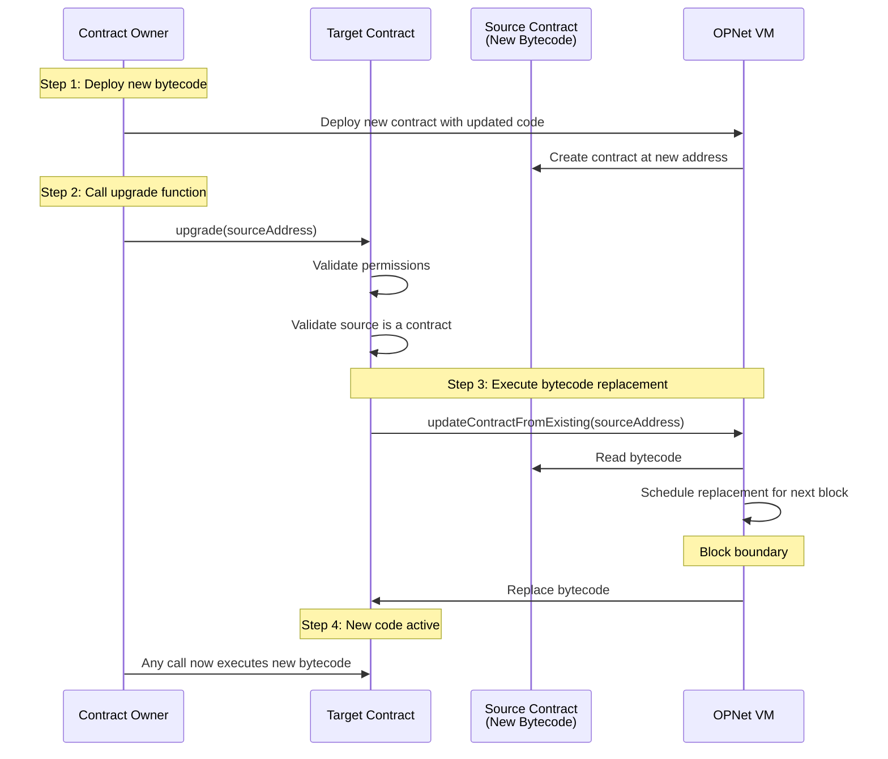
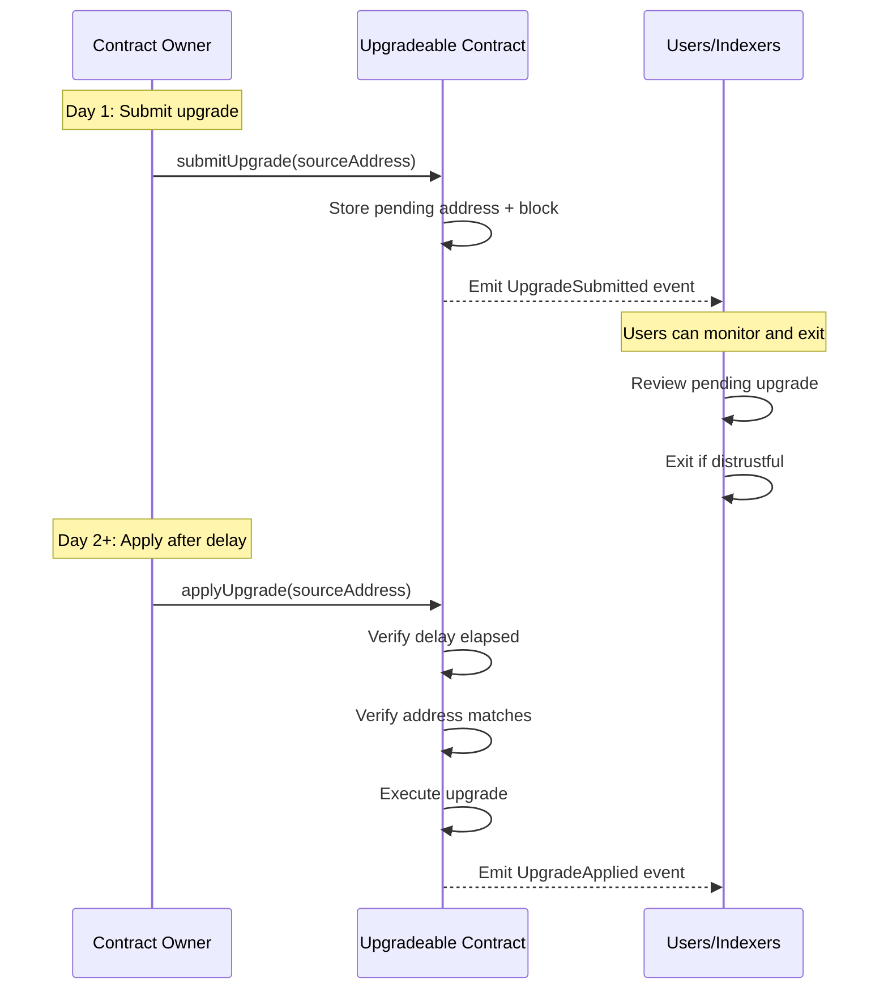

# Contract Upgrades

OPNet provides a native bytecode replacement mechanism that allows contracts to upgrade their execution logic while preserving their address and storage state. This guide covers the upgrade mechanism, security considerations, and the timelock pattern for safe upgrades.

## Overview

Unlike Ethereum's proxy patterns or Solana's upgrade authority model, OPNet enables contracts to replace their own bytecode through a VM opcode. The mechanism uses an address-based replacement model where new bytecode is deployed to a temporary contract, and the target contract references that address to perform the upgrade.

```typescript
import { Blockchain } from '@btc-vision/btc-runtime/runtime';

// Deploy new bytecode as a separate contract first
// Then update the current contract's bytecode
Blockchain.updateContractFromExisting(newBytecodeAddress);
// New bytecode takes effect at the next block
```

## How It Works



## Basic Usage

### The updateContractFromExisting Method

```typescript
/**
 * Updates this contract's bytecode from an existing deployed contract.
 * New bytecode takes effect at the next block.
 *
 * @param sourceAddress - Address of the contract containing the new bytecode
 * @param calldata - Optional calldata passed to the VM (default: empty)
 */
Blockchain.updateContractFromExisting(
    sourceAddress: Address,
    calldata?: BytesWriter | null
): void
```

### Simple Upgrade Function

```typescript
import {
    OP_NET,
    Blockchain,
    Address,
    Calldata,
    BytesWriter,
    encodeSelector,
    Revert,
} from '@btc-vision/btc-runtime/runtime';

@final
export class MyContract extends OP_NET {
    public override execute(method: Selector, calldata: Calldata): BytesWriter {
        switch (method) {
            case encodeSelector('upgrade(address)'):
                return this.upgrade(calldata);
            default:
                return super.execute(method, calldata);
        }
    }

    private upgrade(calldata: Calldata): BytesWriter {
        // Only deployer can upgrade
        this.onlyDeployer(Blockchain.tx.sender);

        const sourceAddress = calldata.readAddress();

        // Validate source is a deployed contract
        if (!Blockchain.isContract(sourceAddress)) {
            throw new Revert('Source must be a deployed contract');
        }

        // Perform upgrade - takes effect next block
        Blockchain.updateContractFromExisting(sourceAddress);

        return new BytesWriter(0);
    }
}
```

## The Timelock Pattern

Immediate upgrades are risky because users have no time to react to potentially malicious changes. The timelock pattern addresses this by requiring a delay between submitting and applying an upgrade.

### Why Use a Timelock?

1. **User Protection**: Users can monitor for pending upgrades and exit if they distrust changes
2. **Attack Prevention**: Prevents instant malicious upgrades
3. **Transparency**: All pending upgrades are visible on-chain

### Timelock Flow



### Using the Upgradeable Base Class

```typescript
import {
    Upgradeable,
    Calldata,
    BytesWriter,
    encodeSelector,
    Selector,
    ADDRESS_BYTE_LENGTH,
} from '@btc-vision/btc-runtime/runtime';

@final
export class MyUpgradeableContract extends Upgradeable {
    // Set upgrade delay: 144 blocks = ~24 hours
    protected readonly upgradeDelay: u64 = 144;

    public override execute(method: Selector, calldata: Calldata): BytesWriter {
        switch (method) {
            case encodeSelector('submitUpgrade'):
                return this.submitUpgrade(calldata.readAddress());
            case encodeSelector('applyUpgrade'): {
                const sourceAddress = calldata.readAddress();
                const remainingLength = calldata.byteLength - ADDRESS_BYTE_LENGTH;
                const updateCalldata = new BytesWriter(remainingLength);
                if (remainingLength > 0) {
                    updateCalldata.writeBytes(calldata.readBytes(remainingLength));
                }
                return this.applyUpgrade(sourceAddress, updateCalldata);
            }
            case encodeSelector('cancelUpgrade'):
                return this.cancelUpgrade();
            // ... other methods
            default:
                return super.execute(method, calldata);
        }
    }
}
```

### Using the UpgradeablePlugin

If you don't want to extend a base class (for example, if you're already extending `OP20` or `OP721`), use the `UpgradeablePlugin` instead. The plugin system is fully automatic - just register the plugin in your constructor:

```typescript
import {
    OP20,
    UpgradeablePlugin,
} from '@btc-vision/btc-runtime/runtime';

@final
export class MyToken extends OP20 {
    public constructor() {
        super();
        // Register the plugin - 144 blocks = ~24 hours (default)
        this.registerPlugin(new UpgradeablePlugin(144));
    }

    // No need to modify execute() - upgrade methods are handled automatically!
}
```

The plugin automatically handles these methods:
- `submitUpgrade(address)` - Submit upgrade for timelock
- `applyUpgrade(address)` - Apply upgrade after delay
- `cancelUpgrade()` - Cancel pending upgrade
- `pendingUpgrade()` - Get pending upgrade info
- `upgradeDelay()` - Get configured delay

**How it works:** When your contract's `execute()` falls through to `super.execute()`, the base `OP_NET` class automatically checks all registered plugins before throwing "Method not found".

### Common Delay Values

| Delay | Blocks | Use Case |
|-------|--------|----------|
| ~1 hour | 6 | Emergency patches (not recommended for production) |
| ~24 hours | 144 | Standard upgrades (default) |
| ~1 week | 1008 | Critical infrastructure |
| ~1 month | 4320 | Governance-controlled contracts |

### Upgrade Events

The `Upgradeable` contract emits events for monitoring:

```typescript
// Emitted when an upgrade is submitted
class UpgradeSubmittedEvent {
    sourceAddress: Address;   // New bytecode contract
    submitBlock: u64;         // Block when submitted
    effectiveBlock: u64;      // Block when upgrade can be applied
}

// Emitted when an upgrade is applied
class UpgradeAppliedEvent {
    sourceAddress: Address;   // New bytecode contract
    appliedAtBlock: u64;      // Block when applied
}

// Emitted when a pending upgrade is cancelled
class UpgradeCancelledEvent {
    sourceAddress: Address;   // Cancelled source contract
    cancelledAtBlock: u64;    // Block when cancelled
}
```

## Storage Compatibility

Storage layout compatibility across bytecode versions is the developer's responsibility. The VM does not validate or migrate storage between versions.

### What Persists

- Contract address (unchanged)
- All storage slots (unchanged)
- Contract deployer

### What Changes

- Execution logic (bytecode)

### Storage Layout Rules

```typescript
// Version 1
class MyContractV1 extends OP_NET {
    private balancePointer: u16 = Blockchain.nextPointer;      // Pointer 1
    private allowancePointer: u16 = Blockchain.nextPointer;    // Pointer 2
}

// Version 2 - CORRECT: Add new pointers at the end
class MyContractV2 extends OP_NET {
    private balancePointer: u16 = Blockchain.nextPointer;      // Pointer 1 (same)
    private allowancePointer: u16 = Blockchain.nextPointer;    // Pointer 2 (same)
    private newFeaturePointer: u16 = Blockchain.nextPointer;   // Pointer 3 (new)
}

// Version 2 - WRONG: Changing order breaks storage
class MyContractV2Bad extends OP_NET {
    private newFeaturePointer: u16 = Blockchain.nextPointer;   // Pointer 1 (was balance!)
    private balancePointer: u16 = Blockchain.nextPointer;      // Pointer 2 (was allowance!)
    private allowancePointer: u16 = Blockchain.nextPointer;    // Pointer 3 (new slot)
}
```

### Best Practices

1. **Never remove or reorder existing pointers**
2. **Always add new pointers at the end**
3. **Document pointer assignments**
4. **Test upgrades thoroughly on testnet**

## The onUpdate Lifecycle Hook

When a contract's bytecode is updated via `updateContractFromExisting`, the VM calls the `onUpdate` hook on the **new** bytecode. This allows the new contract version to perform migrations, initialize new storage, or validate the upgrade.

### Basic Usage

```typescript
@final
export class MyContractV2 extends OP_NET {
    // New storage pointer added in V2
    private newFeaturePointer: u16 = Blockchain.nextPointer;
    private _newFeature: StoredU256;

    public constructor() {
        super();
        this._newFeature = new StoredU256(this.newFeaturePointer, EMPTY_POINTER);
    }

    public override onUpdate(calldata: Calldata): void {
        super.onUpdate(calldata); // Call plugins first

        // Initialize new storage with default value
        if (this._newFeature.value === u256.Zero) {
            this._newFeature.value = u256.fromU64(100);
        }
    }
}
```

### Version-Based Migrations

For complex migrations, pass a version number in the calldata:

```typescript
public override onUpdate(calldata: Calldata): void {
    super.onUpdate(calldata);

    // Read migration version from calldata
    const fromVersion = calldata.readU64();

    if (fromVersion === 1) {
        this.migrateFromV1();
    } else if (fromVersion === 2) {
        this.migrateFromV2();
    }
}

private migrateFromV1(): void {
    // Migration logic from V1 to V3
}

private migrateFromV2(): void {
    // Migration logic from V2 to V3
}
```

Then pass the version when upgrading:

```typescript
// In the upgrade transaction
const migrationData = new BytesWriter(8);
migrationData.writeU64(1); // Migrating from version 1

Blockchain.updateContractFromExisting(newBytecodeAddress, migrationData);
```

### Plugin Support

Plugins can also implement `onUpdate` to perform their own migration logic:

```typescript
class MyPlugin extends Plugin {
    public override onUpdate(calldata: Calldata): void {
        // Plugin-specific migration logic
    }
}
```

### Important Notes

1. **onUpdate runs on new bytecode**: The hook executes using the new contract's code, not the old one
2. **Storage is shared**: The new code reads/writes to the same storage slots as the old code
3. **Call super.onUpdate()**: Always call `super.onUpdate(calldata)` to ensure plugins are notified
4. **Empty calldata**: If no calldata was passed to `updateContractFromExisting`, an empty reader is provided

## Security Considerations

### Source Contract Validation

Always validate that the source address is an existing deployed contract:

```typescript
if (!Blockchain.isContract(sourceAddress)) {
    throw new Revert('Source must be a deployed contract');
}
```

This prevents an attacker from:
1. Submitting a not-yet-deployed address
2. Deploying malicious bytecode just before applying
3. Front-running the upgrade

### Address Verification at Apply

The `applyUpgrade` function requires the address parameter to match the pending upgrade:

```typescript
if (!sourceAddress.equals(this.pendingUpgradeAddress)) {
    throw new Revert('Address does not match pending upgrade');
}
```

This prevents front-running attacks where an attacker tries to substitute a different contract.

### Permission Model

The VM does not enforce any specific permission model. Implement appropriate access control:

```typescript
// Simple: Deployer only
this.onlyDeployer(Blockchain.tx.sender);

// Advanced: Multisig or governance
if (!this.isAuthorizedUpgrader(Blockchain.tx.sender)) {
    throw new Revert('Not authorized');
}
```

### Activation Boundary

When `updateContractFromExisting` is called:
- Transactions in the **same block** execute against **old bytecode**
- Transactions in **subsequent blocks** execute against **new bytecode**

This provides a clean transition with no mid-block ambiguity.

## Comparison with Other Platforms

| Feature | OPNet | Ethereum | Solana |
|---------|-------|----------|--------|
| Mechanism | VM opcode | Proxy + delegatecall | Upgrade authority |
| Delay | Contract-level (recommended) | Contract-level only | None (instant) |
| Storage | Same address, slots persist | Proxy storage, collision risk | Account data persists |
| Permission | Contract-defined | Proxy admin | Single authority key |
| Complexity | Low (single opcode) | High (proxy patterns) | Low (simple authority) |

## Complete Example

```typescript
import {
    Upgradeable,
    Blockchain,
    Calldata,
    BytesWriter,
    encodeSelector,
    Selector,
    StoredU256,
    EMPTY_POINTER,
    ADDRESS_BYTE_LENGTH,
} from '@btc-vision/btc-runtime/runtime';

@final
export class UpgradeableVault extends Upgradeable {
    // 1-week upgrade delay for security
    protected readonly upgradeDelay: u64 = 1008;

    // Storage pointers - never reorder these
    private totalDepositedPointer: u16 = Blockchain.nextPointer;
    private totalDeposited: StoredU256;

    public constructor() {
        super();
        this.totalDeposited = new StoredU256(
            this.totalDepositedPointer,
            EMPTY_POINTER
        );
    }

    public override execute(method: Selector, calldata: Calldata): BytesWriter {
        switch (method) {
            // Upgrade methods
            case encodeSelector('submitUpgrade'):
                return this.submitUpgrade(calldata.readAddress());
            case encodeSelector('applyUpgrade'): {
                const sourceAddress = calldata.readAddress();
                const remainingLength = calldata.byteLength - ADDRESS_BYTE_LENGTH;
                const updateCalldata = new BytesWriter(remainingLength);
                if (remainingLength > 0) {
                    updateCalldata.writeBytes(calldata.readBytes(remainingLength));
                }
                return this.applyUpgrade(sourceAddress, updateCalldata);
            }
            case encodeSelector('cancelUpgrade'):
                return this.cancelUpgrade();

            // View methods for upgrade status
            case encodeSelector('pendingUpgrade'):
                return this.getPendingUpgrade();
            case encodeSelector('upgradeEffectiveBlock'):
                return this.getUpgradeEffectiveBlock();

            // Business logic
            case encodeSelector('deposit'):
                return this.deposit(calldata);

            default:
                return super.execute(method, calldata);
        }
    }

    private getPendingUpgrade(): BytesWriter {
        const response = new BytesWriter(40);
        response.writeAddress(this.pendingUpgradeAddress);
        response.writeU64(this.pendingUpgradeBlock);
        return response;
    }

    private getUpgradeEffectiveBlock(): BytesWriter {
        const response = new BytesWriter(8);
        response.writeU64(this.upgradeEffectiveBlock);
        return response;
    }

    private deposit(calldata: Calldata): BytesWriter {
        // Business logic...
        return new BytesWriter(0);
    }
}
```

## Upgrade Workflow

1. **Develop and test new version** on testnet
2. **Deploy new bytecode** as a separate contract
3. **Submit upgrade** with `submitUpgrade(newAddress)`
4. **Wait for delay** (users can exit during this period)
5. **Apply upgrade** with `applyUpgrade(newAddress)`
6. **Verify** new functionality works correctly

---

**Navigation:**
- Previous: [Bitcoin Scripts](./bitcoin-scripts.md)
- Next: [Plugins](./plugins.md)
