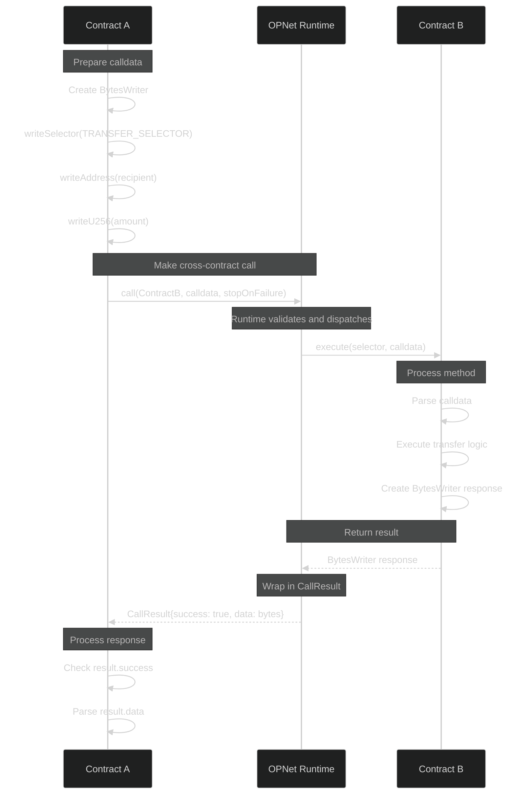
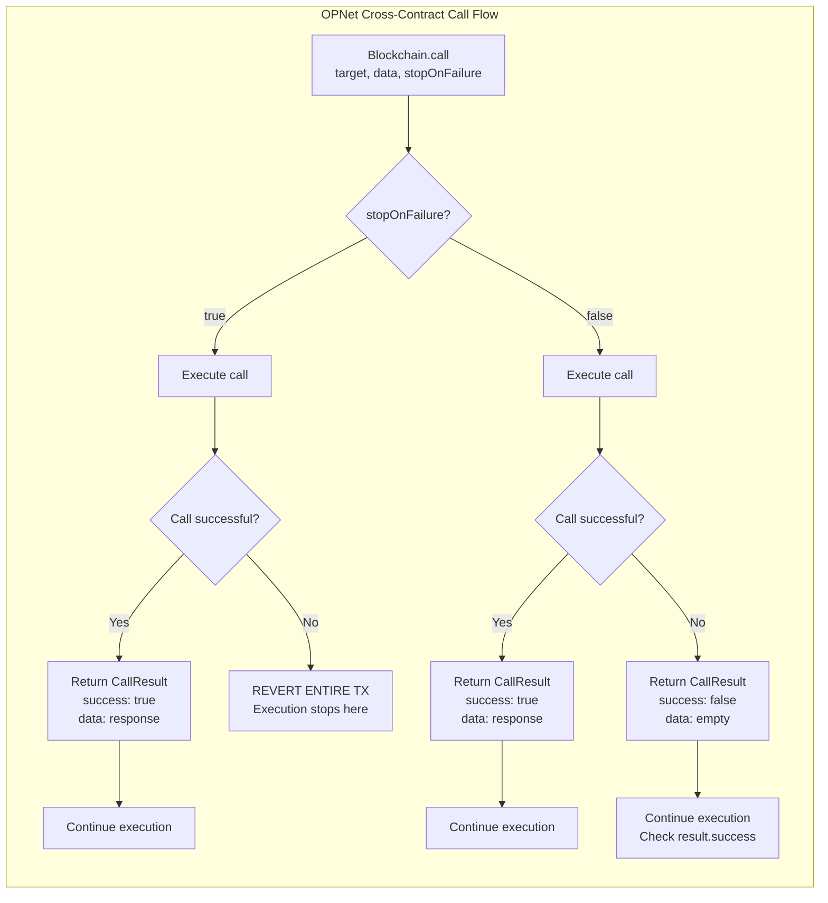

# Cross-Contract Calls

Cross-contract calls enable contracts to interact with each other, building composable protocols. This guide covers making calls, handling responses, and security considerations.

## Architecture Overview



## Overview

```typescript
import { Blockchain, Address, CallResult, BytesWriter, encodeSelector } from '@btc-vision/btc-runtime/runtime';

// Define method selectors (sha256 first 4 bytes of method signature)
const TRANSFER_SELECTOR: u32 = 0xa9059cbb;       // transfer(address,uint256)
const BALANCE_OF_SELECTOR: u32 = 0x70a08231;     // balanceOf(address)

// Make a call to another contract
const result: CallResult = Blockchain.call(
    targetContract,    // Address of contract to call
    calldata,          // BytesWriter with encoded function call
    stopOnFailure      // Revert entire tx on failure?
);

if (result.success) {
    // Process result.data
}
```

## Making Calls

### Basic Call

```typescript
// Define method selector
const TRANSFER_SELECTOR: u32 = 0xa9059cbb;  // transfer(address,uint256)

// Encode the call
const writer = new BytesWriter(68);
writer.writeSelector(TRANSFER_SELECTOR);
writer.writeAddress(recipient);
writer.writeU256(amount);

// Make the call
const result = Blockchain.call(tokenContract, writer, true);
```

### Call Parameters

| Parameter | Type | Description |
|-----------|------|-------------|
| `destinationContract` | `Address` | Contract address to call |
| `calldata` | `BytesWriter` | Encoded method + parameters |
| `stopExecutionOnFailure` | `boolean` | If true, revert on call failure (default: `true`) |

### stopOnFailure Behavior



```typescript
// stopOnFailure = true: Entire transaction reverts if call fails
const result = Blockchain.call(target, data, true);
// If call fails, we never reach this line

// stopOnFailure = false: Continue execution on failure
const result = Blockchain.call(target, data, false);
if (!result.success) {
    // Handle failure gracefully
    // Transaction continues
}
```

## Handling Results

### CallResult Structure

```typescript
class CallResult {
    public readonly success: boolean;   // Did the call succeed?
    public readonly data: BytesReader;  // Return data reader for parsing response
}
```

### Processing Return Data

```typescript
// Make call
const result = Blockchain.call(tokenContract, getBalanceCalldata, true);

// Parse return data (result.data is already a BytesReader)
const balance: u256 = result.data.readU256();
```

### Error Handling

```typescript
// Option 1: Strict (revert on failure)
const result = Blockchain.call(target, data, true);
// Execution only continues if successful

// Option 2: Graceful handling
const result = Blockchain.call(target, data, false);
if (!result.success) {
    // Log, emit event, try fallback, etc.
    Blockchain.emit(new CallFailedEvent(target));
    throw new Revert('External call failed');
}
```

## Common Patterns

### Calling Token Transfers

```typescript
// Define method selector at the top of your contract
const TRANSFER_SELECTOR: u32 = 0xa9059cbb;  // transfer(address,uint256)

@method(
    { name: 'token', type: ABIDataTypes.ADDRESS },
    { name: 'to', type: ABIDataTypes.ADDRESS },
    { name: 'amount', type: ABIDataTypes.UINT256 },
)
@returns({ name: 'success', type: ABIDataTypes.BOOL })
public transferToken(calldata: Calldata): BytesWriter {
    const token = calldata.readAddress();
    const to = calldata.readAddress();
    const amount = calldata.readU256();

    // Encode transfer(address,uint256)
    const writer = new BytesWriter(68);
    writer.writeSelector(TRANSFER_SELECTOR);
    writer.writeAddress(to);
    writer.writeU256(amount);

    // Make call
    const result = Blockchain.call(token, writer, true);

    // Parse result (transfer returns bool in many implementations)
    // result.data is already a BytesReader
    if (result.data.byteLength > 0) {
        const success = result.data.readBoolean();
        if (!success) {
            throw new Revert('Token transfer failed');
        }
    }

    const response = new BytesWriter(1);
    response.writeBoolean(true);
    return response;
}
```

### Calling TransferFrom

```typescript
// Define method selector at the top of your contract
const TRANSFER_FROM_SELECTOR: u32 = 0x23b872dd;  // transferFrom(address,address,uint256)

@method(
    { name: 'token', type: ABIDataTypes.ADDRESS },
    { name: 'from', type: ABIDataTypes.ADDRESS },
    { name: 'amount', type: ABIDataTypes.UINT256 },
)
@returns({ name: 'success', type: ABIDataTypes.BOOL })
public pullTokens(calldata: Calldata): BytesWriter {
    const token = calldata.readAddress();
    const from = calldata.readAddress();
    const amount = calldata.readU256();

    // Encode transferFrom(address,address,uint256)
    const writer = new BytesWriter(100);
    writer.writeSelector(TRANSFER_FROM_SELECTOR);
    writer.writeAddress(from);
    writer.writeAddress(Blockchain.contract.address);
    writer.writeU256(amount);

    const result = Blockchain.call(token, writer, true);

    // Verify success - result.data is already a BytesReader
    if (result.data.byteLength > 0) {
        if (!result.data.readBoolean()) {
            throw new Revert('TransferFrom failed');
        }
    }

    const response = new BytesWriter(1);
    response.writeBoolean(true);
    return response;
}
```

### Querying Another Contract

```typescript
// Define method selector at the top of your contract
const BALANCE_OF_SELECTOR: u32 = 0x70a08231;  // balanceOf(address)

@method(
    { name: 'token', type: ABIDataTypes.ADDRESS },
    { name: 'account', type: ABIDataTypes.ADDRESS },
)
@returns({ name: 'balance', type: ABIDataTypes.UINT256 })
public getExternalBalance(calldata: Calldata): BytesWriter {
    const token = calldata.readAddress();
    const account = calldata.readAddress();

    // Encode balanceOf(address)
    const writer = new BytesWriter(36);
    writer.writeSelector(BALANCE_OF_SELECTOR);
    writer.writeAddress(account);

    const result = Blockchain.call(token, writer, true);

    // result.data is already a BytesReader
    const balance = result.data.readU256();

    const response = new BytesWriter(32);
    response.writeU256(balance);
    return response;
}
```

### Multi-Call Pattern

```typescript
// Define method selector at the top of your contract
const TRANSFER_SELECTOR: u32 = 0xa9059cbb;  // transfer(address,uint256)

@method(
    { name: 'tokens', type: ABIDataTypes.ADDRESS_ARRAY },
    { name: 'recipients', type: ABIDataTypes.ADDRESS_ARRAY },
    { name: 'amounts', type: ABIDataTypes.UINT256_ARRAY },
)
@returns({ name: 'success', type: ABIDataTypes.BOOL })
public batchTransfer(calldata: Calldata): BytesWriter {
    const tokens = calldata.readAddressArray();
    const recipients = calldata.readAddressArray();
    const amounts = calldata.readU256Array();

    for (let i: i32 = 0; i < tokens.length; i++) {
        // Encode transfer(address,uint256)
        const writer = new BytesWriter(68);
        writer.writeSelector(TRANSFER_SELECTOR);
        writer.writeAddress(recipients[i]);
        writer.writeU256(amounts[i]);

        Blockchain.call(tokens[i], writer, true);
    }

    const response = new BytesWriter(1);
    response.writeBoolean(true);
    return response;
}
```

## Solidity Comparison

| Solidity | OPNet |
|----------|-------|
| `token.transfer(to, amount)` | `Blockchain.call(token, encodeTransfer(...), true)` |
| `(bool s, bytes memory d) = target.call(data)` | `Blockchain.call(target, data, false)` |
| `target.delegatecall(data)` | Not supported |
| `try/catch` | `stopOnFailure=false` + manual check |

### Example Comparison

```solidity
// Solidity
contract Router {
    function swap(address token, uint256 amount) external {
        IERC20(token).transferFrom(msg.sender, address(this), amount);
        // ... swap logic ...
        IERC20(outputToken).transfer(msg.sender, outputAmount);
    }
}
```

```typescript
// OPNet
import { OP_NET, Blockchain, Address, Calldata, BytesWriter, ABIDataTypes, method, returns } from '@btc-vision/btc-runtime/runtime';
import { u256 } from '@btc-vision/as-bignum/assembly';

// Selectors for calling OTHER contracts (cross-contract calls only)
const TRANSFER_SELECTOR: u32 = 0xa9059cbb;       // transfer(address,uint256)
const TRANSFER_FROM_SELECTOR: u32 = 0x23b872dd;  // transferFrom(address,address,uint256)

@final
export class Router extends OP_NET {
    public constructor() {
        super();
    }

    @method(
        { name: 'token', type: ABIDataTypes.ADDRESS },
        { name: 'amount', type: ABIDataTypes.UINT256 },
    )
    @returns({ name: 'success', type: ABIDataTypes.BOOL })
    public swap(calldata: Calldata): BytesWriter {
        const token = calldata.readAddress();
        const amount = calldata.readU256();

        // Pull tokens
        this.pullTokens(token, Blockchain.tx.sender, amount);

        // ... swap logic ...

        // Send output
        this.transferToken(outputToken, Blockchain.tx.sender, outputAmount);

        const response = new BytesWriter(1);
        response.writeBoolean(true);
        return response;
    }

    private pullTokens(token: Address, from: Address, amount: u256): void {
        const writer = new BytesWriter(100);
        writer.writeSelector(TRANSFER_FROM_SELECTOR);
        writer.writeAddress(from);
        writer.writeAddress(Blockchain.contract.address);
        writer.writeU256(amount);

        Blockchain.call(token, writer, true);
    }

    private transferToken(token: Address, to: Address, amount: u256): void {
        const writer = new BytesWriter(68);
        writer.writeSelector(TRANSFER_SELECTOR);
        writer.writeAddress(to);
        writer.writeU256(amount);

        Blockchain.call(token, writer, true);
    }
}
```

## Security Considerations

### 1. Reentrancy Risk

External calls can trigger callbacks:

```typescript
// Define method selector at the top
const TRANSFER_SELECTOR: u32 = 0xa9059cbb;  // transfer(address,uint256)

// VULNERABLE
@method()
@returns({ name: 'success', type: ABIDataTypes.BOOL })
public withdraw(_calldata: Calldata): BytesWriter {
    const sender = Blockchain.tx.sender;
    const amount = balances.get(sender);

    const writer = new BytesWriter(68);
    writer.writeSelector(TRANSFER_SELECTOR);
    writer.writeAddress(sender);
    writer.writeU256(amount);

    Blockchain.call(token, writer, true);
    // ^ Called contract could call back into this function
    balances.set(sender, u256.Zero);

    return new BytesWriter(0);
}

// SAFE: Update state before call
@method()
@returns({ name: 'success', type: ABIDataTypes.BOOL })
public withdraw(_calldata: Calldata): BytesWriter {
    const sender = Blockchain.tx.sender;
    const amount = balances.get(sender);
    balances.set(sender, u256.Zero);  // State update first

    const writer = new BytesWriter(68);
    writer.writeSelector(TRANSFER_SELECTOR);
    writer.writeAddress(sender);
    writer.writeU256(amount);

    Blockchain.call(token, writer, true);

    return new BytesWriter(0);
}

// Or use ReentrancyGuard
```

### 2. Return Value Validation

```typescript
// Always validate return data
const result = Blockchain.call(token, data, true);

// Don't assume success based only on not reverting
// result.data is a BytesReader with byteLength property
if (result.data.byteLength > 0) {
    const success = result.data.readBoolean();
    if (!success) {
        throw new Revert('Call returned false');
    }
}
```

### 3. Trust Assumptions

```typescript
@method({ name: 'target', type: ABIDataTypes.ADDRESS })
@returns({ name: 'success', type: ABIDataTypes.BOOL })
public callExternalContract(calldata: Calldata): BytesWriter {
    const target = calldata.readAddress();

    // Only call trusted contracts
    // Malicious contracts can:
    // - Consume excessive resources
    // - Return malicious data
    // - Re-enter your contract

    // Validate contract addresses
    if (!this.trustedContracts.has(target)) {
        throw new Revert('Untrusted contract');
    }

    // Make the call...
    return new BytesWriter(0);
}
```

## Advanced Patterns

### Interface Abstraction

```typescript
// Define method selectors at the top
const TRANSFER_SELECTOR: u32 = 0xa9059cbb;   // transfer(address,uint256)
const BALANCE_OF_SELECTOR: u32 = 0x70a08231; // balanceOf(address)

// Create helper class for common calls
class TokenInterface {
    constructor(private address: Address) {}

    public transfer(to: Address, amount: u256): void {
        const writer = new BytesWriter(68);
        writer.writeSelector(TRANSFER_SELECTOR);
        writer.writeAddress(to);
        writer.writeU256(amount);
        Blockchain.call(this.address, writer, true);
    }

    public balanceOf(account: Address): u256 {
        const writer = new BytesWriter(36);
        writer.writeSelector(BALANCE_OF_SELECTOR);
        writer.writeAddress(account);

        const result = Blockchain.call(this.address, writer, true);
        // result.data is already a BytesReader
        return result.data.readU256();
    }
}

// Usage
const token = new TokenInterface(tokenAddress);
token.transfer(recipient, amount);
const balance = token.balanceOf(user);
```

### Callback Pattern

```typescript
// Define method selector at the top
const ON_TOKEN_RECEIVED_SELECTOR: u32 = 0x150b7a02;  // onTokenReceived(address,uint256,bytes)

// Contract that accepts callbacks
@method(
    { name: 'from', type: ABIDataTypes.ADDRESS },
    { name: 'amount', type: ABIDataTypes.UINT256 },
    { name: 'data', type: ABIDataTypes.BYTES },
)
@returns({ name: 'success', type: ABIDataTypes.BOOL })
public onTokenReceived(calldata: Calldata): BytesWriter {
    const from = calldata.readAddress();
    const amount = calldata.readU256();
    const data = calldata.readBytesWithLength();

    // Process callback
    // ...

    return new BytesWriter(0);
}

// Calling contract notifies via callback
@method(
    { name: 'to', type: ABIDataTypes.ADDRESS },
    { name: 'tokenId', type: ABIDataTypes.UINT256 },
    { name: 'data', type: ABIDataTypes.BYTES },
)
@returns({ name: 'success', type: ABIDataTypes.BOOL })
public safeTransfer(calldata: Calldata): BytesWriter {
    const to = calldata.readAddress();
    const tokenId = calldata.readU256();
    const data = calldata.readBytesWithLength();
    const from = Blockchain.tx.sender;

    this._transfer(from, to, tokenId);

    // Check if receiver is a contract
    // If so, call onTokenReceived
    const writer = new BytesWriter(/* size */);
    writer.writeSelector(ON_TOKEN_RECEIVED_SELECTOR);
    writer.writeAddress(from);
    writer.writeU256(tokenId);
    writer.writeBytesWithLength(data);

    const result = Blockchain.call(to, writer, false);
    // Validate response...

    return new BytesWriter(0);
}
```

---

**Navigation:**
- Previous: [Memory Maps](../storage/memory-maps.md)
- Next: [Signature Verification](./signature-verification.md)
