# Plugins

Plugins extend contract functionality through lifecycle hooks. They allow modular features that can be shared across contracts.

## Plugin Lifecycle

```mermaid
sequenceDiagram
    participant Deployer as 👤 Deployer
    participant Contract as Contract
    participant Plugin as Plugin
    participant Blockchain as OPNet Runtime

    Note over Deployer,Blockchain: Contract Deployment
    Deployer->>Contract: constructor()
    Contract->>Plugin: new Plugin()
    Contract->>Blockchain: registerPlugin(plugin)

    Deployer->>Contract: deploy(calldata)
    Blockchain->>Plugin: onDeployment(calldata)
    Note over Plugin: Initialize plugin state
    Plugin-->>Blockchain: complete

    Blockchain->>Contract: onDeployment(calldata)
    Note over Contract: Initialize contract state
    Contract-->>Blockchain: complete

    Note over Deployer,Blockchain: Method Execution
    Deployer->>Contract: method(calldata)

    Blockchain->>Plugin: onExecutionStarted(selector, calldata)
    Note over Plugin: Pre-execution checks<br/>(access control, pausing, etc.)
    Plugin-->>Blockchain: continue

    Blockchain->>Contract: method executes
    Note over Contract: Core business logic
    Contract-->>Blockchain: result

    Blockchain->>Plugin: onExecutionCompleted(selector, calldata)
    Note over Plugin: Post-execution tasks<br/>(metrics, logging, etc.)
    Plugin-->>Blockchain: complete

    Blockchain-->>Deployer: return result
```



## Overview

```typescript
import { Plugin, Blockchain, Calldata, Selector } from '@btc-vision/btc-runtime/runtime';

// Create a plugin by extending Plugin class
class MyPlugin extends Plugin {
    public override onDeployment(calldata: Calldata): void {
        // Called during contract deployment
    }

    public override onExecutionStarted(selector: Selector, calldata: Calldata): void {
        // Called before each method execution
    }

    public override onExecutionCompleted(selector: Selector, calldata: Calldata): void {
        // Called after each successful method execution
    }
}

// Register with contract
Blockchain.registerPlugin(new MyPlugin());
```

## Plugin Class Diagram


## Plugin Interface

### Base Plugin Class

The `Plugin` class provides three lifecycle hooks:

```typescript
export class Plugin {
    // Called once during contract deployment, before contract's onDeployment
    public onDeployment(_calldata: Calldata): void {}

    // Called before each method execution
    public onExecutionStarted(_selector: Selector, _calldata: Calldata): void {}

    // Called after each successful method execution
    public onExecutionCompleted(_selector: Selector, _calldata: Calldata): void {}
}
```

### Implementing a Plugin

```typescript
import {
    Plugin,
    Calldata,
    Selector,
    Blockchain,
    Revert
} from '@btc-vision/btc-runtime/runtime';

class LoggingPlugin extends Plugin {
    public override onDeployment(calldata: Calldata): void {
        // Log deployment
    }

    public override onExecutionStarted(selector: Selector, calldata: Calldata): void {
        // Log method call before execution
    }

    public override onExecutionCompleted(selector: Selector, calldata: Calldata): void {
        // Log method completion
    }
}
```

## Registration

### In Contract Constructor

```typescript
import { OP_NET, Blockchain } from '@btc-vision/btc-runtime/runtime';

@final
export class MyContract extends OP_NET {
    private loggingPlugin: LoggingPlugin;

    public constructor() {
        super();

        // Create and register plugins
        this.loggingPlugin = new LoggingPlugin();
        Blockchain.registerPlugin(this.loggingPlugin);
    }
}
```

### Conditional Registration in onDeployment

```typescript
public override onDeployment(calldata: Calldata): void {
    const enableLogging = calldata.readBoolean();

    if (enableLogging) {
        Blockchain.registerPlugin(new LoggingPlugin());
    }

    // Continue with normal deployment
    super.onDeployment(calldata);
}
```

## Role-Based Access Control Flow

```mermaid
flowchart LR
    subgraph OPNet["OPNet Plugin-Based Access Control"]
        A["👤 User calls method"] --> B["onExecutionStarted"]
        B --> C{"Method requires role?"}

        C -->|"No"| D["Allow execution"]

        C -->|"Yes"| E["Get required role for selector"]
        E --> F["Load user's roles from storage"]
        F --> G{"User has role?<br/>Bitwise AND check"}

        G -->|"Yes"| H["Allow execution"]
        G -->|"No"| I["Revert: Missing required role"]

        D --> J["Method executes"]
        H --> J

        subgraph RoleBits["Role Enum (powers of 2)"]
            R1["Role.ADMIN = 1"]
            R2["Role.MINTER = 2"]
            R3["Role.PAUSER = 4"]
            R4["Role.OPERATOR = 8"]
        end

        subgraph BitwiseOps["Bitwise Operations"]
            B1["Grant: currentRoles OR role"]
            B2["Check: currentRoles AND role != 0"]
            B3["Revoke: currentRoles AND NOT role"]
        end
    end
```



## Use Cases

### Access Control Plugin

Use an enum with bit flags for role management (powers of 2):

```typescript
import { u256 } from '@btc-vision/as-bignum/assembly';
import {
    Plugin,
    Calldata,
    Selector,
    Blockchain,
    Address,
    Revert,
    SafeMath,
    StoredU256,
    AddressMemoryMap,
    encodeSelector
} from '@btc-vision/btc-runtime/runtime';

// Define method selectors (sha256 first 4 bytes of method signature)
const MINT_SELECTOR: u32 = 0x40c10f19;           // mint(address,uint256)
const PAUSE_SELECTOR: u32 = 0x8456cb59;          // pause()
const UNPAUSE_SELECTOR: u32 = 0x3f4ba83a;        // unpause()
const SET_OPERATOR_SELECTOR: u32 = 0xb3ab15fb;   // setOperator(address)

// Role enum (bit flags - must be powers of 2)
enum Role {
    ADMIN = 1,      // 2^0
    MINTER = 2,     // 2^1
    PAUSER = 4,     // 2^2
    OPERATOR = 8    // 2^3
}

class RoleBasedAccessPlugin extends Plugin {
    private rolesPointer: u16;
    private roles: AddressMemoryMap;

    public constructor(pointer: u16) {
        super();
        this.rolesPointer = pointer;
        this.roles = new AddressMemoryMap(this.rolesPointer);
    }

    public override onDeployment(calldata: Calldata): void {
        // Grant admin role to deployer
        const deployer = Blockchain.tx.origin;
        this.grantRole(deployer, u256.fromU64(Role.ADMIN));
    }

    public override onExecutionStarted(selector: Selector, calldata: Calldata): void {
        const requiredRole = this.getRequiredRole(selector);
        if (!requiredRole.isZero()) {
            const sender = Blockchain.tx.sender;
            if (!this.hasRole(sender, requiredRole)) {
                throw new Revert('Missing required role');
            }
        }
    }

    public override onExecutionCompleted(selector: Selector, calldata: Calldata): void {
        // No-op for this plugin
    }

    public hasRole(account: Address, role: u256): bool {
        const userRoles = this.roles.get(account);
        // Check if role bit is set using bitwise AND
        return !SafeMath.and(userRoles, role).isZero();
    }

    public grantRole(account: Address, role: u256): void {
        const currentRoles = this.roles.get(account);
        // Set role bit using bitwise OR
        this.roles.set(account, SafeMath.or(currentRoles, role));
    }

    public revokeRole(account: Address, role: u256): void {
        const currentRoles = this.roles.get(account);
        // Clear role bit using AND with inverted role
        const invertedRole = SafeMath.xor(role, u256.Max);
        this.roles.set(account, SafeMath.and(currentRoles, invertedRole));
    }

    private getRequiredRole(selector: Selector): u256 {
        // Map methods to required roles
        switch (selector) {
            case MINT_SELECTOR:
                return u256.fromU64(Role.MINTER);
            case PAUSE_SELECTOR:
            case UNPAUSE_SELECTOR:
                return u256.fromU64(Role.PAUSER);
            case SET_OPERATOR_SELECTOR:
                return u256.fromU64(Role.ADMIN);
            default:
                return u256.Zero;  // No role required
        }
    }
}
```

### Pausable Plugin

```typescript
import {
    Plugin,
    Calldata,
    Selector,
    Blockchain,
    Revert,
    StoredBoolean,
    encodeSelector
} from '@btc-vision/btc-runtime/runtime';

// Define method selectors (sha256 first 4 bytes of method signature)
const BALANCE_OF_SELECTOR: u32 = 0x70a08231;     // balanceOf(address)
const TOTAL_SUPPLY_SELECTOR: u32 = 0x18160ddd;   // totalSupply()
const NAME_SELECTOR: u32 = 0x06fdde03;           // name()
const SYMBOL_SELECTOR: u32 = 0x95d89b41;         // symbol()
const PAUSE_SELECTOR: u32 = 0x8456cb59;          // pause()
const UNPAUSE_SELECTOR: u32 = 0x3f4ba83a;        // unpause()

class PausablePlugin extends Plugin {
    private pausedPointer: u16;
    private _paused: StoredBoolean;

    public constructor(pointer: u16) {
        super();
        this.pausedPointer = pointer;
        this._paused = new StoredBoolean(this.pausedPointer, false);
    }

    public override onDeployment(calldata: Calldata): void {
        // Start unpaused by default
    }

    public override onExecutionStarted(selector: Selector, calldata: Calldata): void {
        // Skip pause check for view methods
        if (this.isViewMethod(selector)) return;

        // Skip pause check for admin methods
        if (this.isAdminMethod(selector)) return;

        if (this._paused.value) {
            throw new Revert('Contract is paused');
        }
    }

    public override onExecutionCompleted(selector: Selector, calldata: Calldata): void {
        // No-op for this plugin
    }

    public get paused(): bool {
        return this._paused.value;
    }

    public pause(): void {
        this._paused.value = true;
    }

    public unpause(): void {
        this._paused.value = false;
    }

    private isViewMethod(selector: Selector): bool {
        switch (selector) {
            case BALANCE_OF_SELECTOR:
            case TOTAL_SUPPLY_SELECTOR:
            case NAME_SELECTOR:
            case SYMBOL_SELECTOR:
                return true;
            default:
                return false;
        }
    }

    private isAdminMethod(selector: Selector): bool {
        switch (selector) {
            case PAUSE_SELECTOR:
            case UNPAUSE_SELECTOR:
                return true;
            default:
                return false;
        }
    }
}
```

### Fee Collector Plugin

```typescript
import { u256 } from '@btc-vision/as-bignum/assembly';
import {
    Plugin,
    Calldata,
    Selector,
    Address,
    SafeMath,
    StoredAddress,
    StoredU256
} from '@btc-vision/btc-runtime/runtime';

class FeeCollectorPlugin extends Plugin {
    private feeRecipientPointer: u16;
    private feePercentPointer: u16;
    private _feeRecipient: StoredAddress;
    private _feePercent: StoredU256;  // Basis points (100 = 1%)

    public constructor(recipientPointer: u16, percentPointer: u16) {
        super();
        this.feeRecipientPointer = recipientPointer;
        this.feePercentPointer = percentPointer;
        this._feeRecipient = new StoredAddress(this.feeRecipientPointer, Address.zero());
        this._feePercent = new StoredU256(this.feePercentPointer, EMPTY_POINTER);
    }

    public override onDeployment(calldata: Calldata): void {
        // Fee configuration set separately
    }

    public override onExecutionStarted(selector: Selector, calldata: Calldata): void {
        // No pre-execution logic needed
    }

    public override onExecutionCompleted(selector: Selector, calldata: Calldata): void {
        // Could track fees collected per method
    }

    public setFeeRecipient(recipient: Address): void {
        this._feeRecipient.value = recipient;
    }

    public setFeePercent(percent: u256): void {
        this._feePercent.value = percent;
    }

    public calculateFee(amount: u256): u256 {
        return SafeMath.div(
            SafeMath.mul(amount, this._feePercent.value),
            u256.fromU64(10000)  // Basis points denominator
        );
    }

    public get feeRecipient(): Address {
        return this._feeRecipient.value;
    }

    public get feePercent(): u256 {
        return this._feePercent.value;
    }
}
```

## Plugin Communication

### Between Plugin and Contract

```typescript
import { u256 } from '@btc-vision/as-bignum/assembly';
import {
    OP_NET,
    Blockchain,
    Calldata,
    BytesWriter,
    Address,
    SafeMath,
    ABIDataTypes
} from '@btc-vision/btc-runtime/runtime';

@final
export class MyContract extends OP_NET {
    private feePlugin: FeeCollectorPlugin;

    public constructor() {
        super();
        // Use nextPointer for storage allocation
        this.feePlugin = new FeeCollectorPlugin(
            Blockchain.nextPointer,
            Blockchain.nextPointer
        );
        Blockchain.registerPlugin(this.feePlugin);
    }

    @method(
        { name: 'to', type: ABIDataTypes.ADDRESS },
        { name: 'amount', type: ABIDataTypes.UINT256 },
    )
    public transfer(calldata: Calldata): BytesWriter {
        const to = calldata.readAddress();
        const amount = calldata.readU256();

        // Use plugin to calculate fee
        const fee = this.feePlugin.calculateFee(amount);
        const netAmount = SafeMath.sub(amount, fee);

        // Transfer net amount to recipient
        this._transfer(Blockchain.tx.sender, to, netAmount);

        // Transfer fee to collector
        if (!fee.isZero()) {
            this._transfer(Blockchain.tx.sender, this.feePlugin.feeRecipient, fee);
        }

        return new BytesWriter(0);
    }
}
```

## Lifecycle Hooks

### Execution Order

```
1. Plugin.onDeployment (for each registered plugin, in order)
2. Contract.onDeployment

Then for each method call:
1. Plugin.onExecutionStarted (for each registered plugin, in order)
2. Contract.onExecutionStarted
3. Contract method executes
4. Plugin.onExecutionCompleted (for each registered plugin, in order)
5. Contract.onExecutionCompleted
```

### Metrics Plugin Example

```typescript
import {
    Plugin,
    Calldata,
    Selector,
    StoredU256,
    SafeMath
} from '@btc-vision/btc-runtime/runtime';
import { u256 } from '@btc-vision/as-bignum/assembly';

class MetricsPlugin extends Plugin {
    private totalCallsPointer: u16;
    private _totalCalls: StoredU256;

    public constructor(pointer: u16) {
        super();
        this.totalCallsPointer = pointer;
        this._totalCalls = new StoredU256(this.totalCallsPointer, EMPTY_POINTER);
    }

    public override onDeployment(calldata: Calldata): void {
        // Initialize metrics
    }

    public override onExecutionStarted(selector: Selector, calldata: Calldata): void {
        // Increment call counter
        this._totalCalls.value = SafeMath.add(this._totalCalls.value, u256.One);
    }

    public override onExecutionCompleted(selector: Selector, calldata: Calldata): void {
        // Could track successful completions separately
    }

    public get totalCalls(): u256 {
        return this._totalCalls.value;
    }
}
```

## Best Practices

### 1. Single Responsibility

```typescript
// Good: Focused plugins
class PausablePlugin extends Plugin { }
class AccessControlPlugin extends Plugin { }
class FeeCollectorPlugin extends Plugin { }

// Bad: Monolithic plugin
class EverythingPlugin extends Plugin {
    // Handles pausing, access control, fees, logging...
}
```

### 2. Use `public override` for Hook Methods

```typescript
class MyPlugin extends Plugin {
    // Always use 'public override' when overriding Plugin methods
    public override onDeployment(calldata: Calldata): void {
        // Implementation
    }

    public override onExecutionStarted(selector: Selector, calldata: Calldata): void {
        // Implementation
    }

    public override onExecutionCompleted(selector: Selector, calldata: Calldata): void {
        // Implementation
    }
}
```

### 3. Use Proper Storage

```typescript
// Good: Use StoredU256, StoredBoolean, etc. for persistent state
class MyPlugin extends Plugin {
    private pointer: u16;
    private _value: StoredU256;

    public constructor(pointer: u16) {
        super();
        this.pointer = pointer;
        this._value = new StoredU256(this.pointer, EMPTY_POINTER);
    }
}

// Bad: Regular class fields don't persist across calls
class BadPlugin extends Plugin {
    private value: u256 = u256.Zero;  // This won't persist!
}
```

### 4. Use Role Enum with Bit Flags

```typescript
// Good: Use enum with bit flags for roles (powers of 2)
enum Role {
    ADMIN = 1,      // 2^0
    MINTER = 2,     // 2^1
    PAUSER = 4      // 2^2
}

// Convert enum to u256 for storage/comparison
const adminRole: u256 = u256.fromU64(Role.ADMIN);

// Check role with bitwise AND
const hasRole = !SafeMath.and(userRoles, u256.fromU64(Role.MINTER)).isZero();

// Bad: String-based roles
// const roles = new Map<string, Set<Address>>();  // Don't do this!
```

### 5. Handle Errors Gracefully

```typescript
public override onExecutionStarted(selector: Selector, calldata: Calldata): void {
    // Throw Revert for access control failures
    if (!this.hasPermission(Blockchain.tx.sender, selector)) {
        throw new Revert('Access denied');
    }
}
```

---

**Navigation:**
- Previous: [Bitcoin Scripts](./bitcoin-scripts.md)
- Next: [Basic Token Example](../examples/basic-token.md)
