# Plugins

Plugins extend contract functionality through lifecycle hooks. They allow modular features that can be shared across contracts.

## Overview

```typescript
import { Plugin, Blockchain, Calldata, Selector, BytesWriter } from '@btc-vision/btc-runtime/runtime';

// Create a plugin by extending Plugin class
class MyPlugin extends Plugin {
    public override onDeployment(calldata: Calldata): void {
        // Called during contract deployment
    }

    public override onUpdate(calldata: Calldata): void {
        // Called when contract bytecode is updated
    }

    public override onExecutionStarted(selector: Selector, calldata: Calldata): void {
        // Called before each method execution
    }

    public override onExecutionCompleted(selector: Selector, calldata: Calldata): void {
        // Called after each successful method execution
    }

    public override execute(method: Selector, calldata: Calldata): BytesWriter | null {
        // Handle method selectors - return BytesWriter if handled, null if not
        return null;
    }
}

// Register with contract
this.registerPlugin(new MyPlugin());
```

## Plugin Lifecycle

Plugins are initialized when the contract is deployed and can intercept method calls or handle them directly:


## Plugin Interface

The base Plugin class that all plugins extend:


### Base Plugin Class

The `Plugin` class provides lifecycle hooks and method handling:

```typescript
export class Plugin {
    // Called once during contract deployment, before contract's onDeployment
    public onDeployment(_calldata: Calldata): void {}

    // Called when contract bytecode is updated via updateContractFromExisting
    public onUpdate(_calldata: Calldata): void {}

    // Called before each method execution
    public onExecutionStarted(_selector: Selector, _calldata: Calldata): void {}

    // Called after each successful method execution
    public onExecutionCompleted(_selector: Selector, _calldata: Calldata): void {}

    // Handle method selectors - return BytesWriter if handled, null if not
    public execute(_method: Selector, _calldata: Calldata): BytesWriter | null {
        return null;
    }
}
```

### Implementing a Plugin

```typescript
import {
    Plugin,
    Calldata,
    Selector,
    Blockchain,
    BytesWriter,
    Revert,
    encodeSelector
} from '@btc-vision/btc-runtime/runtime';

// Simple logging plugin using lifecycle hooks
class LoggingPlugin extends Plugin {
    public override onDeployment(calldata: Calldata): void {
        // Log deployment
    }

    public override onUpdate(calldata: Calldata): void {
        // Handle contract upgrades
    }

    public override onExecutionStarted(selector: Selector, calldata: Calldata): void {
        // Log method call before execution
    }

    public override onExecutionCompleted(selector: Selector, calldata: Calldata): void {
        // Log method completion
    }
}

// Plugin that handles method selectors (like UpgradeablePlugin)
class MethodHandlerPlugin extends Plugin {
    public override execute(method: Selector, calldata: Calldata): BytesWriter | null {
        switch (method) {
            case encodeSelector('myPluginMethod()'):
                return this.myPluginMethod();
            default:
                return null; // Not handled by this plugin
        }
    }

    private myPluginMethod(): BytesWriter {
        // Method implementation
        return new BytesWriter(0);
    }
}
```

## Registration

### In Contract Constructor

```typescript
import { OP_NET, Blockchain } from '@btc-vision/btc-runtime/runtime';

@final
export class MyContract extends OP_NET {
    private loggingPlugin: LoggingPlugin;

    public constructor() {
        super();

        // Create and register plugins
        this.loggingPlugin = new LoggingPlugin();
        this.registerPlugin(this.loggingPlugin);
    }
}
```

### Conditional Registration in onDeployment

```typescript
public override onDeployment(calldata: Calldata): void {
    const enableLogging = calldata.readBoolean();

    if (enableLogging) {
        this.registerPlugin(new LoggingPlugin());
    }

    // Continue with normal deployment
    super.onDeployment(calldata);
}
```

## Role-Based Access Control

This diagram shows how the RBAC plugin intercepts calls and checks permissions:

```mermaid
---
config:
  theme: dark
---
flowchart LR
    subgraph OPNet["OPNet Plugin-Based Access Control"]
        A["👤 User calls method"] --> B["onExecutionStarted"]
        B --> C{"Method requires role?"}

        C -->|"No"| D["Allow execution"]

        C -->|"Yes"| E["Get required role for selector"]
        E --> F["Load user's roles from storage"]
        F --> G{"User has role?<br/>Bitwise AND check"}

        G -->|"Yes"| H["Allow execution"]
        G -->|"No"| I["Revert: Missing required role"]

        D --> J["Method executes"]
        H --> J

        subgraph RoleBits["Role Enum - Powers of 2"]
            R1["Role.ADMIN = 1"]
            R2["Role.MINTER = 2"]
            R3["Role.PAUSER = 4"]
            R4["Role.OPERATOR = 8"]
        end

        subgraph BitwiseOps["Bitwise Operations"]
            B1["Grant: currentRoles OR role"]
            B2["Check: currentRoles AND role != 0"]
            B3["Revoke: currentRoles AND NOT role"]
        end
    end
```



### Access Control Plugin Implementation

Use an enum with bit flags for role management (powers of 2):

```typescript
import { u256 } from '@btc-vision/as-bignum/assembly';
import {
    Plugin,
    Calldata,
    Selector,
    Blockchain,
    Address,
    Revert,
    SafeMath,
    StoredU256,
    AddressMemoryMap,
    encodeSelector
} from '@btc-vision/btc-runtime/runtime';

// Define method selectors (sha256 first 4 bytes of method signature)
const MINT_SELECTOR: u32 = 0x40c10f19;           // mint(address,uint256)
const PAUSE_SELECTOR: u32 = 0x8456cb59;          // pause()
const UNPAUSE_SELECTOR: u32 = 0x3f4ba83a;        // unpause()
const SET_OPERATOR_SELECTOR: u32 = 0xb3ab15fb;   // setOperator(address)

// Role enum (bit flags - must be powers of 2)
enum Role {
    ADMIN = 1,      // 2^0
    MINTER = 2,     // 2^1
    PAUSER = 4,     // 2^2
    OPERATOR = 8    // 2^3
}

class RoleBasedAccessPlugin extends Plugin {
    private rolesPointer: u16;
    private roles: AddressMemoryMap;

    public constructor(pointer: u16) {
        super();
        this.rolesPointer = pointer;
        this.roles = new AddressMemoryMap(this.rolesPointer);
    }

    public override onDeployment(calldata: Calldata): void {
        // Grant admin role to deployer
        const deployer = Blockchain.tx.origin;
        this.grantRole(deployer, u256.fromU64(Role.ADMIN));
    }

    public override onExecutionStarted(selector: Selector, calldata: Calldata): void {
        const requiredRole = this.getRequiredRole(selector);
        if (!requiredRole.isZero()) {
            const sender = Blockchain.tx.sender;
            if (!this.hasRole(sender, requiredRole)) {
                throw new Revert('Missing required role');
            }
        }
    }

    public override onExecutionCompleted(selector: Selector, calldata: Calldata): void {
        // No-op for this plugin
    }

    public hasRole(account: Address, role: u256): bool {
        const userRoles = this.roles.get(account);
        // Check if role bit is set using bitwise AND
        return !SafeMath.and(userRoles, role).isZero();
    }

    public grantRole(account: Address, role: u256): void {
        const currentRoles = this.roles.get(account);
        // Set role bit using bitwise OR
        this.roles.set(account, SafeMath.or(currentRoles, role));
    }

    public revokeRole(account: Address, role: u256): void {
        const currentRoles = this.roles.get(account);
        // Clear role bit using AND with inverted role
        const invertedRole = SafeMath.xor(role, u256.Max);
        this.roles.set(account, SafeMath.and(currentRoles, invertedRole));
    }

    private getRequiredRole(selector: Selector): u256 {
        // Map methods to required roles
        switch (selector) {
            case MINT_SELECTOR:
                return u256.fromU64(Role.MINTER);
            case PAUSE_SELECTOR:
            case UNPAUSE_SELECTOR:
                return u256.fromU64(Role.PAUSER);
            case SET_OPERATOR_SELECTOR:
                return u256.fromU64(Role.ADMIN);
            default:
                return u256.Zero;  // No role required
        }
    }
}
```

## Pausable Plugin

```typescript
import {
    Plugin,
    Calldata,
    Selector,
    Blockchain,
    Revert,
    StoredBoolean,
    encodeSelector
} from '@btc-vision/btc-runtime/runtime';

// Define method selectors (sha256 first 4 bytes of method signature)
const BALANCE_OF_SELECTOR: u32 = 0x70a08231;     // balanceOf(address)
const TOTAL_SUPPLY_SELECTOR: u32 = 0x18160ddd;   // totalSupply()
const NAME_SELECTOR: u32 = 0x06fdde03;           // name()
const SYMBOL_SELECTOR: u32 = 0x95d89b41;         // symbol()
const PAUSE_SELECTOR: u32 = 0x8456cb59;          // pause()
const UNPAUSE_SELECTOR: u32 = 0x3f4ba83a;        // unpause()

class PausablePlugin extends Plugin {
    private pausedPointer: u16;
    private _paused: StoredBoolean;

    public constructor(pointer: u16) {
        super();
        this.pausedPointer = pointer;
        this._paused = new StoredBoolean(this.pausedPointer, false);
    }

    public override onDeployment(calldata: Calldata): void {
        // Start unpaused by default
    }

    public override onExecutionStarted(selector: Selector, calldata: Calldata): void {
        // Skip pause check for view methods
        if (this.isViewMethod(selector)) return;

        // Skip pause check for admin methods
        if (this.isAdminMethod(selector)) return;

        if (this._paused.value) {
            throw new Revert('Contract is paused');
        }
    }

    public override onExecutionCompleted(selector: Selector, calldata: Calldata): void {
        // No-op for this plugin
    }

    public get paused(): bool {
        return this._paused.value;
    }

    public pause(): void {
        this._paused.value = true;
    }

    public unpause(): void {
        this._paused.value = false;
    }

    private isViewMethod(selector: Selector): bool {
        switch (selector) {
            case BALANCE_OF_SELECTOR:
            case TOTAL_SUPPLY_SELECTOR:
            case NAME_SELECTOR:
            case SYMBOL_SELECTOR:
                return true;
            default:
                return false;
        }
    }

    private isAdminMethod(selector: Selector): bool {
        switch (selector) {
            case PAUSE_SELECTOR:
            case UNPAUSE_SELECTOR:
                return true;
            default:
                return false;
        }
    }
}
```

## Fee Collector Plugin

```typescript
import { u256 } from '@btc-vision/as-bignum/assembly';
import {
    Plugin,
    Calldata,
    Selector,
    Address,
    SafeMath,
    StoredAddress,
    StoredU256,
    EMPTY_POINTER
} from '@btc-vision/btc-runtime/runtime';

class FeeCollectorPlugin extends Plugin {
    private feeRecipientPointer: u16;
    private feePercentPointer: u16;
    private _feeRecipient: StoredAddress;
    private _feePercent: StoredU256;  // Basis points (100 = 1%)

    public constructor(recipientPointer: u16, percentPointer: u16) {
        super();
        this.feeRecipientPointer = recipientPointer;
        this.feePercentPointer = percentPointer;
        this._feeRecipient = new StoredAddress(this.feeRecipientPointer, Address.zero());
        this._feePercent = new StoredU256(this.feePercentPointer, EMPTY_POINTER);
    }

    public override onDeployment(calldata: Calldata): void {
        // Fee configuration set separately
    }

    public override onExecutionStarted(selector: Selector, calldata: Calldata): void {
        // No pre-execution logic needed
    }

    public override onExecutionCompleted(selector: Selector, calldata: Calldata): void {
        // Could track fees collected per method
    }

    public setFeeRecipient(recipient: Address): void {
        this._feeRecipient.value = recipient;
    }

    public setFeePercent(percent: u256): void {
        this._feePercent.value = percent;
    }

    public calculateFee(amount: u256): u256 {
        return SafeMath.div(
            SafeMath.mul(amount, this._feePercent.value),
            u256.fromU64(10000)  // Basis points denominator
        );
    }

    public get feeRecipient(): Address {
        return this._feeRecipient.value;
    }

    public get feePercent(): u256 {
        return this._feePercent.value;
    }
}
```

## Plugin Communication

### Using Plugins in Contracts

```typescript
import { u256 } from '@btc-vision/as-bignum/assembly';
import {
    OP_NET,
    Blockchain,
    Calldata,
    BytesWriter,
    Address,
    SafeMath,
    ABIDataTypes
} from '@btc-vision/btc-runtime/runtime';

@final
export class MyContract extends OP_NET {
    private feePlugin: FeeCollectorPlugin;

    public constructor() {
        super();
        // Use nextPointer for storage allocation
        this.feePlugin = new FeeCollectorPlugin(
            Blockchain.nextPointer,
            Blockchain.nextPointer
        );
        this.registerPlugin(this.feePlugin);
    }

    @method(
        { name: 'to', type: ABIDataTypes.ADDRESS },
        { name: 'amount', type: ABIDataTypes.UINT256 },
    )
    public transfer(calldata: Calldata): BytesWriter {
        const to = calldata.readAddress();
        const amount = calldata.readU256();

        // Use plugin to calculate fee
        const fee = this.feePlugin.calculateFee(amount);
        const netAmount = SafeMath.sub(amount, fee);

        // Transfer net amount to recipient
        this._transfer(Blockchain.tx.sender, to, netAmount);

        // Transfer fee to collector
        if (!fee.isZero()) {
            this._transfer(Blockchain.tx.sender, this.feePlugin.feeRecipient, fee);
        }

        return new BytesWriter(0);
    }
}
```

## Lifecycle Hooks

### Execution Order

```
Deployment:
1. Plugin.onDeployment (for each registered plugin, in order)
2. Contract.onDeployment

Upgrade (when bytecode is updated):
1. Plugin.onUpdate (for each registered plugin, in order)
2. Contract.onUpdate

Method execution:
1. Plugin.onExecutionStarted (for each registered plugin, in order)
2. Contract.onExecutionStarted
3. Plugin.execute (check plugins first, return if handled)
4. Contract method executes (if no plugin handled it)
5. Plugin.onExecutionCompleted (for each registered plugin, in order)
6. Contract.onExecutionCompleted
```

### Metrics Plugin Example

```typescript
import {
    Plugin,
    Calldata,
    Selector,
    StoredU256,
    SafeMath,
    EMPTY_POINTER
} from '@btc-vision/btc-runtime/runtime';
import { u256 } from '@btc-vision/as-bignum/assembly';

class MetricsPlugin extends Plugin {
    private totalCallsPointer: u16;
    private _totalCalls: StoredU256;

    public constructor(pointer: u16) {
        super();
        this.totalCallsPointer = pointer;
        this._totalCalls = new StoredU256(this.totalCallsPointer, EMPTY_POINTER);
    }

    public override onDeployment(calldata: Calldata): void {
        // Initialize metrics
    }

    public override onExecutionStarted(selector: Selector, calldata: Calldata): void {
        // Increment call counter
        this._totalCalls.value = SafeMath.add(this._totalCalls.value, u256.One);
    }

    public override onExecutionCompleted(selector: Selector, calldata: Calldata): void {
        // Could track successful completions separately
    }

    public get totalCalls(): u256 {
        return this._totalCalls.value;
    }
}
```

## Solidity vs OPNet: Plugin System Comparison

OPNet plugins provide a more flexible and powerful alternative to Solidity's inheritance and modifier patterns. They enable cross-cutting concerns without tight coupling.

### Feature Comparison Table

| Feature | Solidity/EVM | OPNet | OPNet Advantage |
|---------|--------------|-------|-----------------|
| **Code Reuse Pattern** | Inheritance | Composition (Plugins) | Flexible, no diamond problem |
| **Pre-Execution Hooks** | Modifiers | `onExecutionStarted` | Centralized, selector-aware |
| **Post-Execution Hooks** | Limited (manual) | `onExecutionCompleted` | Automatic after success |
| **Deployment Hooks** | Constructor only | `onDeployment` per plugin | Modular initialization |
| **Method Interception** | Modifier per function | Selector-based routing | One plugin, all methods |
| **Multiple Behaviors** | Multiple inheritance | Multiple plugins | No conflicts |
| **Dynamic Registration** | Not possible | Runtime registration | Conditional features |
| **Execution Order** | Modifier stack | Plugin registration order | Explicit control |

### Pattern Mapping Table

| Solidity Pattern | OPNet Plugin Equivalent | Improvement |
|-----------------|------------------------|-------------|
| OpenZeppelin `Ownable` | `RoleBasedAccessPlugin` with ADMIN role | Multi-role support |
| OpenZeppelin `Pausable` | `PausablePlugin` | Selector-specific pausing |
| OpenZeppelin `AccessControl` | `RoleBasedAccessPlugin` | Bit-flag roles, efficient storage |
| `nonReentrant` modifier | Reentrancy guard in `onExecutionStarted` | Global protection |
| Function modifiers | `onExecutionStarted` hook | Centralized logic |
| `Initializable` | `onDeployment` hook | Per-plugin initialization |
| OpenZeppelin `ERC20Snapshot` | Metrics plugin pattern | Flexible tracking |

### Capability Matrix

| Capability | Solidity | OPNet |
|------------|:--------:|:-----:|
| Pre-execution hooks | Modifiers (per-function) | Plugins (centralized) |
| Post-execution hooks | Manual | Built-in |
| Deployment initialization | Constructor | Per-plugin onDeployment |
| Selector-based routing | Manual switch | Built-in selector parameter |
| Dynamic feature toggles | Storage + modifiers | Conditional plugin registration |
| Cross-cutting logging | Manual in each function | Single metrics plugin |
| Role-based access | Multiple modifiers | Single plugin, bitwise roles |
| Pausable with exceptions | Complex modifiers | Selector whitelist |

### Inheritance vs Composition


### Code Complexity Comparison

| Aspect | Solidity | OPNet |
|--------|----------|-------|
| Adding access control | Import + inherit + add modifiers | Register plugin |
| Adding pausable | Import + inherit + add modifiers | Register plugin |
| Combining both | Multiple inheritance + modifier stacking | Register both plugins |
| Method-specific rules | Separate modifier per method | Selector switch in plugin |
| Adding new role | Modify contract, redeploy | Update plugin role mapping |

### Access Control Comparison

#### Solidity: OpenZeppelin Inheritance

```solidity
// Solidity with OpenZeppelin - Inheritance-based
import "@openzeppelin/contracts/access/Ownable.sol";
import "@openzeppelin/contracts/access/AccessControl.sol";

contract MyContract is Ownable, AccessControl {
    bytes32 public constant MINTER_ROLE = keccak256("MINTER_ROLE");
    bytes32 public constant PAUSER_ROLE = keccak256("PAUSER_ROLE");

    constructor() {
        _grantRole(DEFAULT_ADMIN_ROLE, msg.sender);
    }

    // Must add modifier to EVERY protected function
    function mint(address to, uint256 amount) external onlyRole(MINTER_ROLE) {
        // ...
    }

    function pause() external onlyRole(PAUSER_ROLE) {
        // ...
    }

    function adminOnly() external onlyOwner {
        // ...
    }

    // Limitations:
    // - Must add modifier to each function
    // - Role checks scattered across contract
    // - String-based role hashes (inefficient)
    // - Complex inheritance hierarchy
}
```

#### OPNet: Plugin-Based Composition

```typescript
// OPNet with Plugin - Composition-based
@final
export class MyContract extends OP_NET {
    private accessPlugin: RoleBasedAccessPlugin;

    public constructor() {
        super();
        // Single plugin handles ALL access control
        this.accessPlugin = new RoleBasedAccessPlugin(Blockchain.nextPointer);
        this.registerPlugin(this.accessPlugin);
    }

    @method()
    public mint(_calldata: Calldata): BytesWriter {
        // Plugin automatically checks MINTER role
        // based on selector mapping - no modifier needed!
        return new BytesWriter(0);
    }

    @method()
    public pause(_calldata: Calldata): BytesWriter {
        // Plugin automatically checks PAUSER role
        return new BytesWriter(0);
    }

    @method()
    public adminOnly(_calldata: Calldata): BytesWriter {
        // Plugin automatically checks ADMIN role
        return new BytesWriter(0);
    }

    // Advantages:
    // - No modifiers on individual functions
    // - Centralized access control logic
    // - Bitwise roles (efficient storage)
    // - Role-to-selector mapping in one place
}
```

### Pausable Comparison

#### Solidity: Modifier Per Function

```solidity
// Solidity with OpenZeppelin
import "@openzeppelin/contracts/security/Pausable.sol";

contract MyContract is Pausable {
    // Must add whenNotPaused to EVERY pausable function
    function transfer(address to, uint256 amount) external whenNotPaused {
        // ...
    }

    function approve(address spender, uint256 amount) external whenNotPaused {
        // ...
    }

    // View functions don't need modifier (manual decision)
    function balanceOf(address owner) external view returns (uint256) {
        // ...
    }

    function pause() external onlyOwner {
        _pause();
    }

    function unpause() external onlyOwner {
        _unpause();
    }

    // Limitations:
    // - Must remember to add modifier to each function
    // - Easy to forget on new functions
    // - No automatic view function detection
}
```

#### OPNet: Automatic Selector-Based Pausing

```typescript
// OPNet with Plugin
@final
export class MyContract extends OP_NET {
    private pausablePlugin: PausablePlugin;

    public constructor() {
        super();
        this.pausablePlugin = new PausablePlugin(Blockchain.nextPointer);
        this.registerPlugin(this.pausablePlugin);
    }

    @method(ABIDataTypes.UINT256)
    public transfer(calldata: Calldata): BytesWriter {
        // Plugin automatically checks pause status
        // No modifier needed!
        const amount = calldata.readU256();
        return new BytesWriter(0);
    }

    @method(ABIDataTypes.ADDRESS)
    public balanceOf(calldata: Calldata): BytesWriter {
        // Plugin knows this is a view method (via selector)
        // Automatically skips pause check
        return new BytesWriter(32);
    }

    @method()
    public pause(_calldata: Calldata): BytesWriter {
        // Admin methods also whitelisted automatically
        this.pausablePlugin.pause();
        return new BytesWriter(0);
    }

    // Advantages:
    // - No modifiers needed on individual functions
    // - View methods automatically detected via selector
    // - Admin methods automatically whitelisted
    // - Cannot forget to protect a function
}
```

### Multiple Plugins Example

```typescript
// OPNet - Composing multiple plugins (no inheritance conflicts)
@final
export class CompleteContract extends OP_NET {
    private accessPlugin: RoleBasedAccessPlugin;
    private pausablePlugin: PausablePlugin;
    private feePlugin: FeeCollectorPlugin;
    private metricsPlugin: MetricsPlugin;

    public constructor() {
        super();

        // Order matters - security checks first!
        this.accessPlugin = new RoleBasedAccessPlugin(Blockchain.nextPointer);
        this.registerPlugin(this.accessPlugin);  // 1. Check permissions

        this.pausablePlugin = new PausablePlugin(Blockchain.nextPointer);
        this.registerPlugin(this.pausablePlugin);  // 2. Check pause status

        this.feePlugin = new FeeCollectorPlugin(
            Blockchain.nextPointer,
            Blockchain.nextPointer
        );
        this.registerPlugin(this.feePlugin);  // 3. Fee calculations

        this.metricsPlugin = new MetricsPlugin(Blockchain.nextPointer);
        this.registerPlugin(this.metricsPlugin);  // 4. Track metrics
    }

    // All plugins execute their hooks automatically
    // Execution order: access -> pausable -> fee -> metrics -> method
}
```

### Lifecycle Hook Comparison

| Lifecycle Event | Solidity | OPNet |
|-----------------|----------|-------|
| Contract deployment | Single constructor | `onDeployment` per plugin + contract |
| Contract upgrade | Proxy reinitialize | `onUpdate` per plugin + contract |
| Before method call | Modifiers (manual per function) | `onExecutionStarted` (automatic) |
| Method handling | Function dispatch | `execute` returns BytesWriter or null |
| After method call | No built-in hook | `onExecutionCompleted` (automatic) |
| Error handling | try/catch (limited) | Revert in any hook |

### Why OPNet Plugins?

| Solidity Limitation | OPNet Solution |
|---------------------|----------------|
| Modifier on every function | Centralized selector-based routing |
| Multiple inheritance complexity | Simple composition |
| Diamond problem risk | No inheritance conflicts |
| String-based role hashes | Efficient bitwise roles |
| Manual post-execution hooks | Built-in `onExecutionCompleted` |
| Constructor-only initialization | Per-plugin `onDeployment` |
| Static feature set | Dynamic plugin registration |
| Scattered access logic | Centralized in plugins |

## Best Practices

### 1. Single Responsibility

```typescript
// Good: Focused plugins
class PausablePlugin extends Plugin { }
class AccessControlPlugin extends Plugin { }
class FeeCollectorPlugin extends Plugin { }

// Bad: Monolithic plugin
class EverythingPlugin extends Plugin {
    // Handles pausing, access control, fees, logging...
}
```

### 2. Use `public override` for Hook Methods

```typescript
class MyPlugin extends Plugin {
    // Always use 'public override' when overriding Plugin methods
    public override onDeployment(calldata: Calldata): void {
        // Implementation
    }

    public override onUpdate(calldata: Calldata): void {
        // Implementation
    }

    public override onExecutionStarted(selector: Selector, calldata: Calldata): void {
        // Implementation
    }

    public override onExecutionCompleted(selector: Selector, calldata: Calldata): void {
        // Implementation
    }

    public override execute(method: Selector, calldata: Calldata): BytesWriter | null {
        // Return BytesWriter if handled, null if not
        return null;
    }
}
```

### 3. Use Proper Storage

```typescript
// Good: Use StoredU256, StoredBoolean, etc. for persistent state
class MyPlugin extends Plugin {
    private pointer: u16;
    private _value: StoredU256;

    public constructor(pointer: u16) {
        super();
        this.pointer = pointer;
        this._value = new StoredU256(this.pointer, EMPTY_POINTER);
    }
}

// Bad: Regular class fields don't persist across calls
class BadPlugin extends Plugin {
    private value: u256 = u256.Zero;  // This won't persist!
}
```

### 4. Use Role Enum with Bit Flags

```typescript
// Good: Use enum with bit flags for roles (powers of 2)
enum Role {
    ADMIN = 1,      // 2^0
    MINTER = 2,     // 2^1
    PAUSER = 4      // 2^2
}

// Convert enum to u256 for storage/comparison
const adminRole: u256 = u256.fromU64(Role.ADMIN);

// Check role with bitwise AND
const hasRole = !SafeMath.and(userRoles, u256.fromU64(Role.MINTER)).isZero();

// Bad: String-based roles
// const roles = new Map<string, Set<Address>>();  // Don't do this!
```

### 5. Handle Errors Gracefully

```typescript
public override onExecutionStarted(selector: Selector, calldata: Calldata): void {
    // Throw Revert for access control failures
    if (!this.hasPermission(Blockchain.tx.sender, selector)) {
        throw new Revert('Access denied');
    }
}
```

### 6. Order Plugins Correctly

```typescript
// Security checks should come first
this.registerPlugin(this.accessControl);  // Check permissions first
this.registerPlugin(this.pausable);       // Then pausable
this.registerPlugin(this.metrics);        // Metrics last
```

---

**Navigation:**
- Previous: [Bitcoin Scripts](./bitcoin-scripts.md)
- Next: [Basic Token Example](../examples/basic-token.md)
