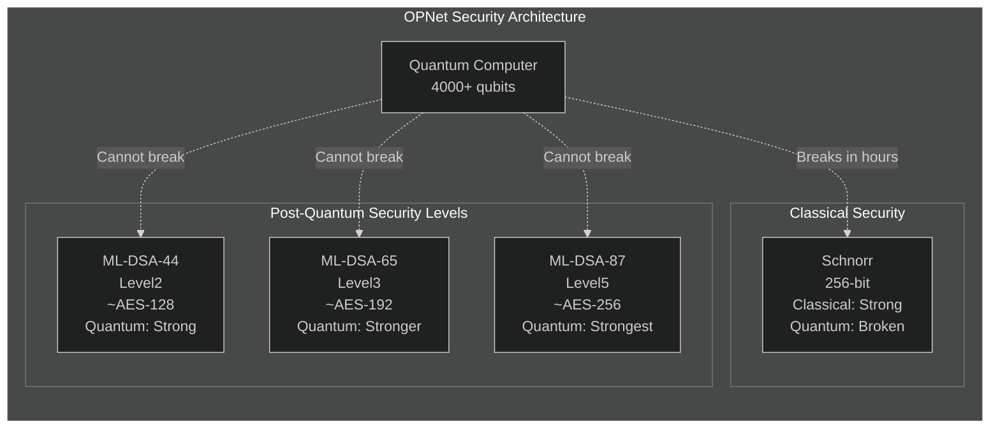
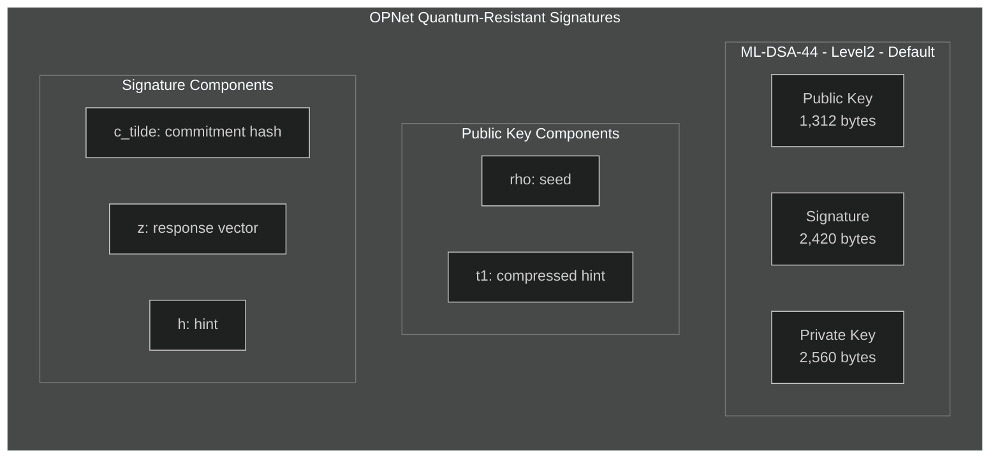
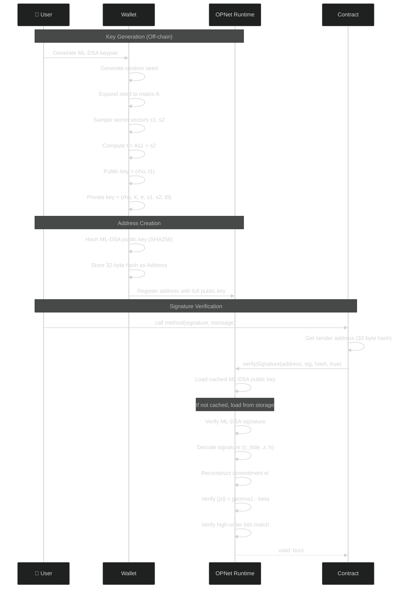
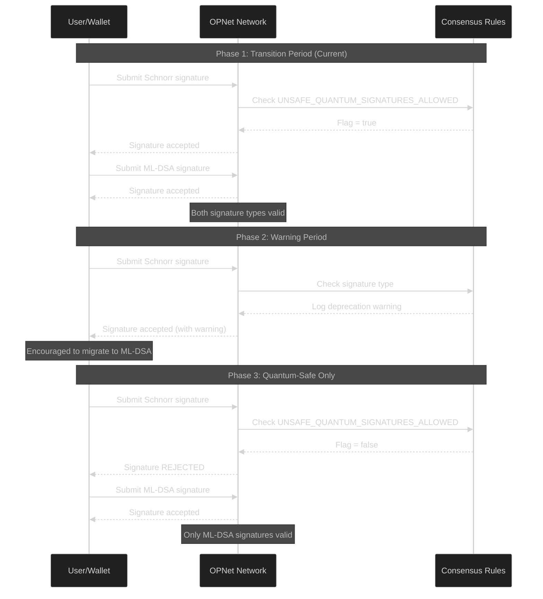
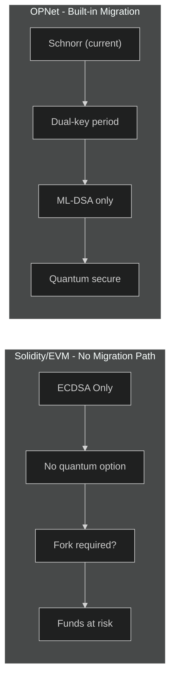

# Quantum Resistance

OPNet includes built-in quantum-resistant cryptography through ML-DSA (Module-Lattice Digital Signature Algorithm). The `Address` class provides automatic access to ML-DSA public keys without requiring any custom storage.

## Overview

Quantum computers pose a threat to traditional cryptographic schemes:

| Algorithm | Quantum Threat | OPNet Status |
|-----------|---------------|--------------|
| ECDSA | Vulnerable (Shor's algorithm) | Supported (deprecated), transition to ML-DSA |
| Schnorr | Vulnerable (Shor's algorithm) | Supported, with transition plan |
| ML-DSA | Quantum-resistant | **Fully supported** |

## Quick Start

```typescript
import { Blockchain, sha256 } from '@btc-vision/btc-runtime/runtime';

// Verify a signature with quantum resistance
const message = new BytesWriter(32);
message.writeString('Sign this message');
const messageHash = sha256(message.getBuffer());

// SignaturesMethods.MLDSA ensures quantum-resistant verification
const isValid = Blockchain.verifySignature(
    Blockchain.tx.origin,  // Signer's address
    signature,              // Signature bytes
    messageHash,            // Message hash
    SignaturesMethods.MLDSA // Force ML-DSA (quantum-resistant)
);
```

## Why Quantum Resistance?

### The Threat

- **Public keys are exposed** when addresses send transactions
- Quantum computers with ~4000 qubits could derive private keys
- Existing signatures remain safe (retroactive attack impossible)
- Future transactions from exposed addresses are at risk

### OPNet's Approach

1. **Dual signature support** - Both Schnorr and ML-DSA signatures
2. **Extended addresses** - Store both Schnorr (taproot) and ML-DSA key references
3. **Built-in key access** - `Address.mldsaPublicKey` property loads keys automatically
4. **Consensus-managed transition** - Automatic migration from Schnorr to ML-DSA

## ML-DSA Security Levels

OPNet supports three ML-DSA security levels, from classical Schnorr to quantum-resistant ML-DSA:



| Level | Name | Public Key | Signature | Private Key | NIST Category |
|-------|------|------------|-----------|-------------|---------------|
| Level2 | ML-DSA-44 | 1,312 bytes | 2,420 bytes | 2,560 bytes | Category 2 (~AES-128) |
| Level3 | ML-DSA-65 | 1,952 bytes | 3,309 bytes | 4,032 bytes | Category 3 (~AES-192) |
| Level5 | ML-DSA-87 | 2,592 bytes | 4,627 bytes | 4,896 bytes | Category 5 (~AES-256) |

**OPNet uses ML-DSA-44 (Level2) by default**, balancing security and performance.

### Level Constants

```typescript
import {
    MLDSASecurityLevel,
    MLDSA44_PUBLIC_KEY_LEN,   // 1312
    MLDSA44_SIGNATURE_LEN,     // 2420
    MLDSA65_PUBLIC_KEY_LEN,   // 1952
    MLDSA65_SIGNATURE_LEN,     // 3309
    MLDSA87_PUBLIC_KEY_LEN,   // 2592
    MLDSA87_SIGNATURE_LEN      // 4627
} from '@btc-vision/btc-runtime/runtime';
```

## ML-DSA Signature Structure

The ML-DSA signature format follows FIPS 204:



## The Address Class

### Automatic ML-DSA Key Access

Every `Address` in OPNet stores the SHA256 hash of an ML-DSA public key. The full public key is automatically loaded on demand:

```typescript
import { Address, Blockchain } from '@btc-vision/btc-runtime/runtime';

// Any address can access its ML-DSA public key
const sender: Address = Blockchain.tx.sender;

// Get the ML-DSA public key (loaded automatically from the blockchain)
const mldsaKey: Uint8Array = sender.mldsaPublicKey;

// The key is cached after first access for efficiency
const sameKey: Uint8Array = sender.mldsaPublicKey;  // Returns cached key
```

**Key points:**
- No custom storage needed - the runtime handles key storage
- Keys are lazily loaded on first access and cached
- The address itself is the SHA256 hash of the ML-DSA public key

### How It Works Internally

```typescript
// Address stores 32-byte SHA256 hash of ML-DSA public key
class Address extends Uint8Array {
    protected _mldsaPublicKey: Uint8Array | null = null;

    // Getter loads key from blockchain on demand
    public get mldsaPublicKey(): Uint8Array {
        if (!this._mldsaPublicKey) {
            this._mldsaPublicKey = loadMLDSAPublicKey(this, MLDSASecurityLevel.Level2);
        }
        return this._mldsaPublicKey;
    }
}
```

## Extended Address

`ExtendedAddress` supports dual-key addresses for the quantum transition:

```typescript
import { ExtendedAddress } from '@btc-vision/btc-runtime/runtime';

// Create from both key components
const extAddr = ExtendedAddress.fromStringPair(
    '0x' + 'aa'.repeat(32),  // Tweaked Schnorr key (taproot)
    '0x' + 'bb'.repeat(32)   // ML-DSA key hash
);

// Access the tweaked Schnorr key (for taproot/P2TR)
const schnorrKey: Uint8Array = extAddr.tweakedPublicKey;  // 32 bytes

// Access the ML-DSA public key (inherited from Address)
const mldsaKey: Uint8Array = extAddr.mldsaPublicKey;  // 1312 bytes (ML-DSA-44)

// Generate Bitcoin addresses
const p2trAddress: string = extAddr.p2tr();  // "bc1p..." or "tb1p..."
```

### Dual Key Structure

```
ExtendedAddress (64 bytes reference)
+-- tweakedPublicKey: Uint8Array[32]  --> Schnorr (taproot)
+-- Address bytes: Uint8Array[32]      --> SHA256(ML-DSA public key)
                                            +-> .mldsaPublicKey loads full key
```

## ML-DSA Key Generation and Verification Flow

The following diagram shows the complete lifecycle from key generation to signature verification:



## Signature Verification

### The Simple Way (Recommended)

Just use `Blockchain.verifySignature()` - it handles everything:

```typescript
import { Blockchain, sha256 } from '@btc-vision/btc-runtime/runtime';

@method(ABIDataTypes.BYTES)
@returns({ name: 'valid', type: ABIDataTypes.BOOL })
public verifySignature(calldata: Calldata): BytesWriter {
    const signature = calldata.readBytesWithLength();

    // Create message hash
    const message = new BytesWriter(55);
    message.writeString('Hello, world! This is a test message for MLDSA signing.');
    const messageHash = sha256(message.getBuffer());

    // Verify with quantum resistance (MLDSA)
    const isValid = Blockchain.verifySignature(
        Blockchain.tx.origin,
        signature,
        messageHash,
        SignaturesMethods.MLDSA  // Force ML-DSA
    );

    const writer = new BytesWriter(1);
    writer.writeBoolean(isValid);
    return writer;
}
```

### Consensus-Aware Verification

Let the consensus decide which algorithm to use:

```typescript
// During transition: uses Schnorr if allowed, ML-DSA otherwise
// After transition: always uses ML-DSA
const isValid = Blockchain.verifySignature(
    signer,
    signature,
    messageHash,
    SignaturesMethods.Schnorr  // Let consensus decide (falls back to ML-DSA if Schnorr not allowed)
);
```

### Direct ML-DSA Verification

For cases where you need explicit control:

```typescript
import { MLDSASecurityLevel } from '@btc-vision/btc-runtime/runtime';

const isValid = Blockchain.verifyMLDSASignature(
    MLDSASecurityLevel.Level2,  // Security level
    signer.mldsaPublicKey,       // Auto-loaded from address
    signature,                    // 2420-byte signature
    messageHash                   // 32-byte message hash
);
```

## Migration Path: Schnorr to ML-DSA

OPNet manages a phased transition from classical to quantum-resistant signatures:



The `UNSAFE_QUANTUM_SIGNATURES_ALLOWED` consensus flag controls whether Schnorr signatures are still permitted. When disabled, only ML-DSA signatures will be valid.

## Complete Contract Example

```typescript
import {
    OP_NET,
    Blockchain,
    Calldata,
    BytesWriter,
    Revert,
    sha256,
    ABIDataTypes
} from '@btc-vision/btc-runtime/runtime';

@final
class QuantumSecureContract extends OP_NET {

    @method(
        { name: 'message', type: ABIDataTypes.BYTES },
        { name: 'signature', type: ABIDataTypes.BYTES },
    )
    @returns({ name: 'valid', type: ABIDataTypes.BOOL })
    public verifyQuantum(calldata: Calldata): BytesWriter {
        const message = calldata.readBytesWithLength();
        const signature = calldata.readBytesWithLength();

        const messageHash = sha256(message);

        // Always use quantum-resistant verification
        const isValid = Blockchain.verifySignature(
            Blockchain.tx.origin,
            signature,
            messageHash,
            SignaturesMethods.MLDSA  // Force ML-DSA
        );

        const writer = new BytesWriter(1);
        writer.writeBoolean(isValid);
        return writer;
    }

    @method(
        { name: 'signer', type: ABIDataTypes.ADDRESS },
        { name: 'message', type: ABIDataTypes.BYTES },
        { name: 'signature', type: ABIDataTypes.BYTES },
    )
    @returns({ name: 'valid', type: ABIDataTypes.BOOL })
    public verifyForAddress(calldata: Calldata): BytesWriter {
        const signer = calldata.readAddress();
        const message = calldata.readBytesWithLength();
        const signature = calldata.readBytesWithLength();

        const messageHash = sha256(message);

        // Verify for a specific address
        const isValid = Blockchain.verifySignature(
            signer,
            signature,
            messageHash,
            SignaturesMethods.MLDSA
        );

        const writer = new BytesWriter(1);
        writer.writeBoolean(isValid);
        return writer;
    }

    @method({ name: 'owner', type: ABIDataTypes.ADDRESS })
    @returns({ name: 'keyLength', type: ABIDataTypes.UINT32 })
    public getMLDSAKeyLength(calldata: Calldata): BytesWriter {
        const owner = calldata.readAddress();

        // Access ML-DSA public key - automatically loaded
        const mldsaKey = owner.mldsaPublicKey;

        const writer = new BytesWriter(4);
        writer.writeU32(mldsaKey.length);  // 1312 for Level2
        return writer;
    }
}
```

## Solidity vs OPNet: Quantum Resistance Comparison

OPNet is the first smart contract platform with built-in quantum-resistant cryptography. Solidity and the EVM have no quantum resistance capabilities.

### Feature Comparison Table

| Feature | Solidity/EVM | OPNet | OPNet Advantage |
|---------|--------------|-------|-----------------|
| **Quantum-Safe Signatures** | Not supported | ML-DSA (FIPS 204) | Future-proof security |
| **Post-Quantum Algorithm** | None | ML-DSA-44/65/87 | NIST standardized |
| **Dual-Key Architecture** | Not available | Schnorr + ML-DSA | Smooth transition |
| **Key Loading** | Manual storage/derivation | Automatic via `Address` | Zero setup required |
| **Consensus Migration** | Not applicable | Built-in transition plan | Network-coordinated |
| **Security Levels** | ECDSA only | 3 ML-DSA levels | Flexible security |
| **Algorithm Selection** | Fixed (ECDSA) | Consensus-aware | Automatic switching |

### Quantum Threat Analysis

| Algorithm | Shor's Algorithm Impact | Grover's Algorithm Impact | Status in OPNet |
|-----------|------------------------|---------------------------|-----------------|
| ECDSA (Solidity) | **Broken** (polynomial time) | Weakened | N/A |
| ECDSA (OPNet) | **Broken** (polynomial time) | Weakened | Deprecated |
| Schnorr (OPNet) | **Broken** (polynomial time) | Weakened | Transition only |
| ML-DSA (OPNet) | **Secure** | Minimal impact | **Recommended** |

### Security Level Comparison

| Security Level | Solidity | OPNet ML-DSA | NIST Category | Quantum Security |
|----------------|----------|--------------|---------------|------------------|
| ~AES-128 equivalent | ECDSA (broken by quantum) | ML-DSA-44 (Level2) | Category 2 | **Secure** |
| ~AES-192 equivalent | Not available | ML-DSA-65 (Level3) | Category 3 | **Secure** |
| ~AES-256 equivalent | Not available | ML-DSA-87 (Level5) | Category 5 | **Secure** |

### Key and Signature Size Comparison

| Metric | Solidity (ECDSA) | OPNet (Schnorr) | OPNet (ML-DSA-44) | OPNet (ML-DSA-87) |
|--------|------------------|-----------------|-------------------|-------------------|
| Public Key Size | 33/65 bytes | 32 bytes | 1,312 bytes | 2,592 bytes |
| Signature Size | 65 bytes | 64 bytes | 2,420 bytes | 4,627 bytes |
| Private Key Size | 32 bytes | 32 bytes | 2,560 bytes | 4,896 bytes |
| Quantum Safe | **No** | **No** | **Yes** | **Yes** |

### Capability Matrix

| Capability | Solidity | OPNet |
|------------|:--------:|:-----:|
| ECDSA verification (Ethereum) | Yes | Yes (deprecated) |
| ECDSA verification (Bitcoin) | No | Yes (deprecated) |
| Schnorr verification | No | Yes |
| ML-DSA-44 verification | No | Yes |
| ML-DSA-65 verification | No | Yes |
| ML-DSA-87 verification | No | Yes |
| Automatic public key loading | No | Yes |
| Quantum-resistant addresses | No | Yes |
| Dual-key addresses | No | Yes |
| Consensus-aware algorithm | No | Yes |
| Phased migration support | No | Yes |

### Timeline: Quantum Threat vs Platform Readiness

| Timeframe | Quantum Computer Status | Solidity Status | OPNet Status |
|-----------|------------------------|-----------------|--------------|
| **2024-2025** | Early NISQ era (~1000 qubits) | Vulnerable (no plan) | ML-DSA ready |
| **2026-2030** | Scaling (~4000+ qubits possible) | **Critical risk** | Dual-key transition |
| **2030+** | Cryptographically relevant | **Funds at risk** | ML-DSA only (secure) |

### Migration Path Comparison



### Signature Verification Comparison

#### Solidity: No Quantum Protection

```solidity
// Solidity - Vulnerable to quantum attacks
// There is NO way to add quantum resistance to Solidity/EVM
function verify(bytes32 hash, uint8 v, bytes32 r, bytes32 s) external view returns (bool) {
    address recovered = ecrecover(hash, v, r, s);
    return recovered == expectedSigner;

    // CRITICAL VULNERABILITIES:
    // - ECDSA is broken by Shor's algorithm
    // - No upgrade path to quantum-safe algorithms
    // - All funds signed with exposed public keys at risk
    // - No way to add ML-DSA or other PQC algorithms
}

// Even with precompiles, no quantum-safe option exists
// EIP proposals for PQC have not been implemented
```

#### OPNet: Built-in Quantum Resistance

```typescript
// OPNet - Quantum-resistant
@method(
    { name: 'hash', type: ABIDataTypes.BYTES32 },
    { name: 'signature', type: ABIDataTypes.BYTES },
)
@returns({ name: 'valid', type: ABIDataTypes.BOOL })
public verify(calldata: Calldata): BytesWriter {
    const hash = calldata.readBytes(32);
    const signature = calldata.readBytesWithLength();

    // ML-DSA provides quantum resistance
    // FIPS 204 standardized algorithm
    // Public key loaded automatically from address
    const valid = Blockchain.verifySignature(
        this.expectedSigner.value,
        signature,
        hash,
        SignaturesMethods.MLDSA  // Force quantum-resistant ML-DSA
    );

    const writer = new BytesWriter(1);
    writer.writeBoolean(valid);
    return writer;
}

// Advantages:
// - ML-DSA is quantum-resistant (lattice-based)
// - NIST standardized (FIPS 204)
// - Automatic key loading from address
// - Consensus-managed transition
// - No code changes needed for migration
```

### Public Key Access Comparison

```solidity
// Solidity - Must store or derive public key
contract SolidityContract {
    // Must manually store public keys
    mapping(address => bytes) public publicKeys;

    function registerKey(bytes calldata pubkey) external {
        // Verify key matches address
        require(address(uint160(uint256(keccak256(pubkey)))) == msg.sender);
        publicKeys[msg.sender] = pubkey;
    }

    // No way to store/use ML-DSA keys (1,312+ bytes each!)
    // Storage costs would be prohibitive
}
```

```typescript
// OPNet - Automatic key access
@final
class OPNetContract extends OP_NET {

    public getPublicKey(calldata: Calldata): BytesWriter {
        const user = calldata.readAddress();

        // ML-DSA public key loaded automatically!
        // No storage needed - runtime handles it
        const mldsaKey = user.mldsaPublicKey;  // 1,312 bytes

        // Key is cached after first access
        const writer = new BytesWriter(4);
        writer.writeU32(mldsaKey.length);
        return writer;
    }
}
```

### Why OPNet for Quantum Security?

| Solidity Limitation | OPNet Solution |
|---------------------|----------------|
| ECDSA only (quantum vulnerable) | ML-DSA (quantum resistant) |
| No upgrade path | Built-in consensus migration |
| Must store large keys manually | Automatic key loading |
| No NIST PQC algorithms | FIPS 204 ML-DSA |
| Single key per address | Dual-key architecture |
| Fixed algorithm forever | Consensus-aware selection |
| Fork required for PQC | Smooth transition built-in |
| All funds at risk | Protected from day one |

### Cost Comparison

| Operation | Solidity | OPNet Cost | Notes |
|-----------|----------|------------|-------|
| Store ML-DSA public key | Not practical (1,312 bytes) | 0 | OPNet loads automatically |
| Store ML-DSA signature | Not practical (2,420 bytes) | N/A | Not stored, verified |
| Quantum-safe verification | Not possible | Standard | No additional cost |
| Key migration | Contract redeploy | Consensus-managed | No user action needed |

## Best Practices

1. **Use `Address.mldsaPublicKey`** - Don't store ML-DSA keys manually; the Address class handles key loading and caching automatically (see [The Address Class](#the-address-class))

2. **Force ML-DSA for high-security operations** - Pass `SignaturesMethods.MLDSA` to `Blockchain.verifySignature()` for critical operations (see [Signature Verification](#signature-verification))

3. **Use consensus-aware verification for general use** - Pass `SignaturesMethods.Schnorr` (the default) to let the network decide which algorithm to use during the transition period. When Schnorr is no longer allowed by consensus, it automatically falls back to ML-DSA

4. **Document security level** - When using quantum-resistant signatures, document the ML-DSA level in your contract comments:

```typescript
/**
 * Security Note: This contract uses ML-DSA-44 for quantum resistance.
 * ML-DSA-44 provides NIST Category 2 security (~AES-128 equivalent).
 * For higher security requirements, ML-DSA-65 or ML-DSA-87 may be used.
 */
```

---

**Navigation:**
- Previous: [Signature Verification](./signature-verification.md)
- Next: [Bitcoin Scripts](./bitcoin-scripts.md)
