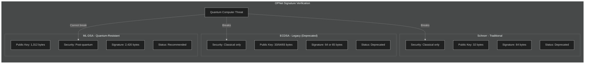
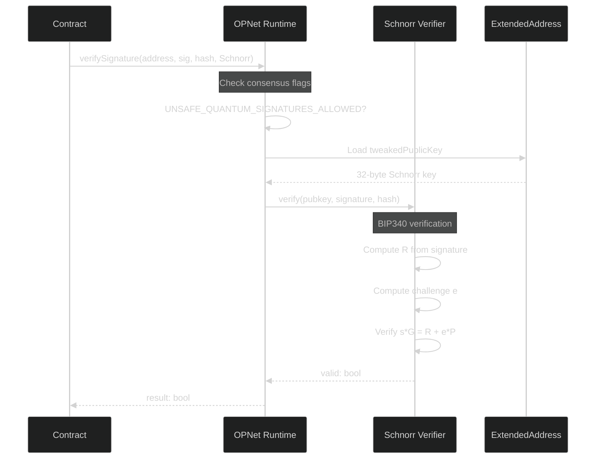
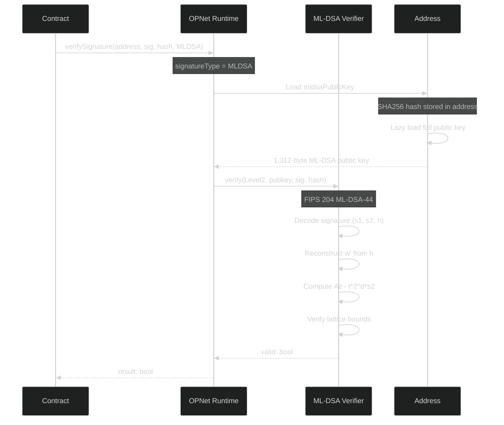
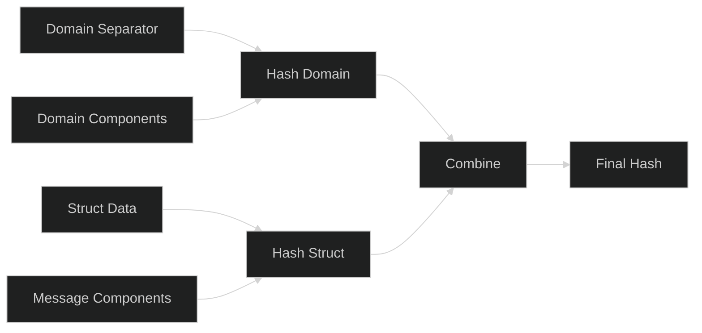

# Signature Verification

OPNet supports multiple signature schemes for authentication and authorization. This guide covers Schnorr signatures, ECDSA (secp256k1), quantum-resistant ML-DSA, and common verification patterns.

## Overview

```typescript
import { Blockchain, SignaturesMethods } from '@btc-vision/btc-runtime/runtime';

// Consensus-aware signature verification (recommended)
// Uses Schnorr during transition period, ML-DSA after quantum deadline
const isValid: bool = Blockchain.verifySignature(
    Blockchain.tx.origin,  // ExtendedAddress
    signature,              // Signature bytes
    messageHash,            // 32-byte message hash
    SignaturesMethods.Schnorr  // Signature type (default)
);

// Force quantum-resistant verification (always uses ML-DSA)
const isValidQuantum: bool = Blockchain.verifySignature(
    Blockchain.tx.origin,
    signature,
    messageHash,
    SignaturesMethods.MLDSA  // Force ML-DSA regardless of consensus flags
);

// ECDSA verification (deprecated, Ethereum ecrecover model)
const isValidECDSA: bool = Blockchain.verifyECDSASignature(
    publicKey,      // 33, 64, or 65-byte secp256k1 public key
    signature,      // 65-byte signature: r(32) || s(32) || v(1)
    messageHash,    // 32-byte message hash (typically keccak256)
);

// ECDSA verification (deprecated, Bitcoin direct verify model)
const isValidBTC: bool = Blockchain.verifyBitcoinECDSASignature(
    publicKey,      // 33, 64, or 65-byte secp256k1 public key
    signature,      // 64-byte compact signature: r(32) || s(32)
    messageHash,    // 32-byte message hash (typically SHA-256 double hash)
);
```

## Signature Scheme Comparison

OPNet supports Schnorr, ECDSA (secp256k1), and quantum-resistant ML-DSA signatures:



## The verifySignature Method

The recommended approach for all signature verification:

```typescript
import { SignaturesMethods } from '@btc-vision/btc-runtime/runtime';

Blockchain.verifySignature(
    address: ExtendedAddress,  // Signer's address (contains both key references)
    signature: Uint8Array,     // Signature bytes
    hash: Uint8Array,          // 32-byte message hash
    signatureType: SignaturesMethods = SignaturesMethods.Schnorr  // Signature type
): boolean
```

**Important:** The first parameter must be an `ExtendedAddress`, not a plain `Address`. Use `Blockchain.tx.origin` which returns `ExtendedAddress` for verifying the transaction originator's signature. The `ExtendedAddress` type contains both:
- `tweakedPublicKey` (32 bytes) - for Schnorr/Taproot signatures
- `mldsaPublicKey` (1,312 bytes for Level2) - for quantum-resistant ML-DSA signatures

**Behavior:**
- `SignaturesMethods.Schnorr` (default): Uses Schnorr verification if `UNSAFE_QUANTUM_SIGNATURES_ALLOWED` consensus flag is set, otherwise falls back to ML-DSA
- `SignaturesMethods.MLDSA`: Always uses ML-DSA (quantum-resistant) verification with ML-DSA-44 (Level2)
- `SignaturesMethods.ECDSA`: Emits a deprecation error recommending migration to ML-DSA. Use `verifyECDSASignature()` or `verifyBitcoinECDSASignature()` directly instead

The method automatically:
1. Loads the appropriate public key from the address
2. Selects the correct verification algorithm based on the `signatureType` parameter and consensus rules
3. Handles all internal key formatting
4. Throws a `Revert` if the signature type is not allowed under current consensus rules

## Schnorr Verification

When using Schnorr signatures (during transition period), the verification follows BIP340:



### Low-Level Schnorr Verification (Deprecated)

```typescript
// Deprecated - use Blockchain.verifySignature() instead
const isValid = Blockchain.verifySchnorrSignature(
    extendedAddress,   // ExtendedAddress (contains tweaked public key)
    signature,         // 64-byte Schnorr signature
    messageHash        // 32-byte message hash
);
```

## ML-DSA Verification

When using quantum-resistant ML-DSA signatures, the verification follows FIPS 204:



### Direct ML-DSA Verification

```typescript
import { MLDSASecurityLevel } from '@btc-vision/btc-runtime/runtime';

const isValid = Blockchain.verifyMLDSASignature(
    MLDSASecurityLevel.Level2,  // Security level
    signer.mldsaPublicKey,       // ML-DSA public key (auto-loaded from address)
    signature,                    // 2420-byte signature (for Level2)
    messageHash                   // 32-byte message hash
);
```

### ML-DSA Security Levels

| Level | Name | Public Key | Signature | NIST Category |
|-------|------|------------|-----------|---------------|
| Level2 | ML-DSA-44 | 1,312 bytes | 2,420 bytes | Category 2 (~AES-128) |
| Level3 | ML-DSA-65 | 1,952 bytes | 3,309 bytes | Category 3 (~AES-192) |
| Level5 | ML-DSA-87 | 2,592 bytes | 4,627 bytes | Category 5 (~AES-256) |

**OPNet uses ML-DSA-44 (Level2) by default.**

## ECDSA Verification (Deprecated)

OPNet now supports ECDSA (secp256k1) signatures for backward compatibility with Ethereum and Bitcoin ecosystems. These methods are **deprecated** and only available when `UNSAFE_QUANTUM_SIGNATURES_ALLOWED` consensus flag is set.

### Ethereum ECDSA (ecrecover model)

```typescript
// Verifies using Ethereum ecrecover: recovers signer from (hash, v, r, s)
const isValid: bool = Blockchain.verifyECDSASignature(
    publicKey,      // secp256k1 public key (33, 64, or 65 bytes)
    signature,      // 65-byte signature: r(32) || s(32) || v(1)
    messageHash     // 32-byte message hash (typically keccak256)
);
```

### Bitcoin ECDSA (direct verify model)

```typescript
// Verifies directly against public key, enforces BIP-0062 low-S normalization
const isValid: bool = Blockchain.verifyBitcoinECDSASignature(
    publicKey,      // secp256k1 public key (33, 64, or 65 bytes)
    signature,      // 64-byte compact signature: r(32) || s(32)
    messageHash     // 32-byte message hash (typically SHA-256 double hash)
);
```

### ECDSA Sub-Types

| Sub-Type | Model | Signature Size | Description |
|----------|-------|---------------|-------------|
| `ECDSASubType.Ethereum` | ecrecover | 65 bytes (r32 \|\| s32 \|\| v1) | Recovers signer public key from signature |
| `ECDSASubType.Bitcoin` | Direct verify | 64 bytes (r32 \|\| s32) | Verifies directly against provided public key |

### Accepted Public Key Formats

Both ECDSA methods accept secp256k1 public keys in these formats:

| Format | Size | Prefix | Description |
|--------|------|--------|-------------|
| Compressed | 33 bytes | `0x02` or `0x03` | Standard SEC1 compressed |
| Raw | 64 bytes | None | Raw X \|\| Y coordinates, no prefix |
| Uncompressed | 65 bytes | `0x04` | Standard SEC1 uncompressed |
| Hybrid | 65 bytes | `0x06` or `0x07` | SEC1 hybrid (rewritten to `0x04` on host) |

### ECDSA Deprecation Warning

Both ECDSA methods emit a runtime `WARNING` and are gated behind the `UNSAFE_QUANTUM_SIGNATURES_ALLOWED` consensus flag. They will throw a `Revert` if called when unsafe signatures are not allowed. Contracts should migrate to `verifySignature()` with ML-DSA for long-term quantum security.

## Keccak-256 Hashing

OPNet includes a built-in Keccak-256 implementation (Ethereum-compatible, pre-NIST). This is useful for ECDSA-related workflows, Ethereum-style function selectors, and EIP-712 typed data hashing.

```typescript
import { keccak256, keccak256Concat, functionSelector, ethAddressFromPubKey } from '@btc-vision/btc-runtime/runtime';

// Basic keccak256 hash
const hash: Uint8Array = keccak256(data);  // 32-byte digest

// Hash concatenated byte arrays (common for abi.encodePacked patterns)
const hash2: Uint8Array = keccak256Concat(a, b);

// Compute 4-byte Ethereum function selector
const sel: Uint8Array = functionSelector('transfer(address,uint256)');
// sel == 0xa9059cbb

// Derive Ethereum address from 64-byte uncompressed public key
const addr: Uint8Array = ethAddressFromPubKey(publicKey64);  // 20-byte address
```

**Important:** This is original Keccak-256 (as used by Ethereum), NOT NIST SHA-3-256. The difference is the domain separation padding byte: Keccak uses `0x01`, SHA-3 uses `0x06`.

## Message Hash Construction

When building message hashes for signature verification, use domain separation to prevent cross-contract signature reuse:



### Domain Separator

```typescript
function buildDomainSeparator(
    name: string,
    version: string,
    chainId: u256,
    contractAddress: Address
): Uint8Array {
    const writer = new BytesWriter(256);

    // EIP-712 domain typehash
    writer.writeBytes(sha256(
        encodeString('EIP712Domain(string name,string version,uint256 chainId,address verifyingContract)')
    ));

    // Domain values
    writer.writeBytes(sha256(encodeString(name)));
    writer.writeBytes(sha256(encodeString(version)));
    writer.writeU256(chainId);
    writer.writeAddress(contractAddress);

    return sha256(writer.getBuffer());
}
```

### Permit Message Hash

```typescript
function buildPermitHash(
    domainSeparator: Uint8Array,
    owner: Address,
    spender: Address,
    value: u256,
    nonce: u256,
    deadline: u64
): Uint8Array {
    const PERMIT_TYPEHASH = sha256(
        encodeString('Permit(address owner,address spender,uint256 value,uint256 nonce,uint256 deadline)')
    );

    // Build struct hash
    const structWriter = new BytesWriter(192);
    structWriter.writeBytes(PERMIT_TYPEHASH);
    structWriter.writeAddress(owner);
    structWriter.writeAddress(spender);
    structWriter.writeU256(value);
    structWriter.writeU256(nonce);
    structWriter.writeU64(deadline);
    const structHash = sha256(structWriter.getBuffer());

    // Final hash with domain separator
    const finalWriter = new BytesWriter(66);
    finalWriter.writeU8(0x19);
    finalWriter.writeU8(0x01);
    finalWriter.writeBytes(domainSeparator);
    finalWriter.writeBytes(structHash);

    return sha256(finalWriter.getBuffer());
}
```

## Complete Contract Example

```typescript
import { OP_NET, Blockchain, Calldata, BytesWriter, Revert, sha256, SignaturesMethods } from '@btc-vision/btc-runtime/runtime';

@final
class SignatureContract extends OP_NET {

    @method(ABIDataTypes.BYTES)
    @returns({ name: 'valid', type: ABIDataTypes.BOOL })
    public verifySignature(calldata: Calldata): BytesWriter {
        const signature = calldata.readBytesWithLength();

        // Create the message to verify
        const message = new BytesWriter(32);
        message.writeString('Hello, OPNet!');
        const messageHash = sha256(message.getBuffer());

        // Verify using consensus-aware method
        // Automatically uses the sender's public key
        const isValid = Blockchain.verifySignature(
            Blockchain.tx.origin,
            signature,
            messageHash,
            SignaturesMethods.MLDSA  // Force ML-DSA for quantum resistance
        );

        const writer = new BytesWriter(1);
        writer.writeBoolean(isValid);
        return writer;
    }

    @method(
        { name: 'signature', type: ABIDataTypes.BYTES },
        { name: 'message', type: ABIDataTypes.BYTES },
    )
    @returns({ name: 'valid', type: ABIDataTypes.BOOL })
    public verifyForOrigin(calldata: Calldata): BytesWriter {
        const signature = calldata.readBytesWithLength();
        const message = calldata.readBytesWithLength();

        const messageHash = sha256(message);

        // Verify signature for the transaction origin (ExtendedAddress)
        // Note: Blockchain.tx.origin returns ExtendedAddress which supports both
        // Schnorr (via tweakedPublicKey) and ML-DSA (via mldsaPublicKey) signatures
        const isValid = Blockchain.verifySignature(
            Blockchain.tx.origin,  // ExtendedAddress from transaction
            signature,
            messageHash,
            SignaturesMethods.Schnorr  // Use consensus-aware Schnorr verification
        );

        const writer = new BytesWriter(1);
        writer.writeBoolean(isValid);
        return writer;
    }
}
```

## Solidity vs OPNet: Signature Verification Comparison

OPNet provides significant advantages over Solidity for signature verification, including quantum-resistant signatures, native Schnorr support, and simplified APIs.

### Feature Comparison Table

| Feature | Solidity/EVM | OPNet | OPNet Advantage |
|---------|--------------|-------|-----------------|
| **Primary Signature Scheme** | ECDSA (secp256k1) | Schnorr + ML-DSA + ECDSA | Multiple schemes, quantum-resistant option |
| **Quantum Resistance** | Not supported | ML-DSA (FIPS 204) | Future-proof security |
| **ECDSA Support** | Only option | Supported (deprecated) | Backward compatibility with Ethereum/Bitcoin |
| **Signature Recovery** | `ecrecover()` returns address | Direct verification | Cleaner API |
| **Public Key Access** | Must be stored/derived | Automatic via `Address` | No custom storage needed |
| **Verification Function** | Multiple parameters (v, r, s) | Single signature bytes | Simpler interface |
| **EIP-712 Support** | Manual implementation | Built-in domain separation | Type-safe messages |
| **Keccak-256 Hashing** | Native opcode | Built-in runtime module | Ethereum-compatible hashing |
| **Batch Verification** | Not native | Supported | Better performance |
| **Key Sizes** | 33/65 bytes (secp256k1) | 32 bytes (Schnorr) / 33-65 bytes (ECDSA) / 1,312+ bytes (ML-DSA) | Flexible security |

### Signature Scheme Comparison

| Aspect | Solidity (ECDSA) | OPNet (ECDSA) | OPNet (Schnorr) | OPNet (ML-DSA) |
|--------|------------------|---------------|-----------------|----------------|
| Algorithm | secp256k1 ECDSA | secp256k1 ECDSA | BIP340 Schnorr | FIPS 204 Lattice |
| Public Key Size | 33 or 65 bytes | 33, 64, or 65 bytes | 32 bytes | 1,312+ bytes |
| Signature Size | 65 bytes (v, r, s) | 64 or 65 bytes | 64 bytes | 2,420+ bytes |
| Quantum Safe | No | No | No | **Yes** |
| Bitcoin Native | No | Yes (Bitcoin sub-type) | Yes | Yes |
| Batch Verification | No | No | Yes | Yes |
| Signature Malleability | Yes (fixable) | No (BIP-0062 low-S) | No | No |
| Status | Only option | Deprecated | Transition | **Recommended** |

### Capability Matrix

| Capability | Solidity | OPNet |
|------------|:--------:|:-----:|
| ECDSA verification (Ethereum ecrecover) | Yes | Yes (deprecated) |
| ECDSA verification (Bitcoin direct) | No | Yes (deprecated) |
| Schnorr verification | No | Yes |
| ML-DSA (quantum-safe) verification | No | Yes |
| Keccak-256 hashing | Yes (native) | Yes (runtime module) |
| Automatic public key loading | No | Yes |
| Consensus-aware algorithm selection | No | Yes |
| EIP-712 domain separation | Manual | Built-in pattern |
| Nonce management | Manual | Manual (with helpers) |
| Multi-signature verification | Custom | Built-in loop support |
| Signature deadline enforcement | Manual | `Blockchain.block.medianTime` |

### API Comparison

#### Solidity: ecrecover

```solidity
// Solidity - ecrecover (complex, error-prone)
function verifySignature(
    bytes32 hash,
    uint8 v,
    bytes32 r,
    bytes32 s,
    address expectedSigner
) public pure returns (bool) {
    // Must handle v value normalization
    if (v < 27) {
        v += 27;
    }

    // ecrecover returns address(0) on failure (no error thrown!)
    address recovered = ecrecover(hash, v, r, s);

    // Must explicitly check for zero address
    require(recovered != address(0), "Invalid signature");

    return recovered == expectedSigner;

    // Limitations:
    // - Returns address(0) on invalid signature (silent failure)
    // - v, r, s must be extracted from signature bytes
    // - No quantum resistance
    // - Signature malleability issues
}
```

#### OPNet: verifySignature

```typescript
// OPNet - verifySignature (simple, safe)
function verifySignature(
    signer: Address,
    signature: Uint8Array,
    hash: Uint8Array
): bool {
    // Single function call - handles everything
    const isValid = Blockchain.verifySignature(
        signer,                      // Address contains public key reference
        signature,                   // Full signature bytes
        hash,                        // Message hash
        SignaturesMethods.MLDSA      // Force quantum-resistant ML-DSA
    );

    // Returns false on invalid (never throws for invalid sig)
    return isValid;

    // Advantages:
    // - Single function call
    // - No signature parsing needed
    // - Automatic public key loading
    // - Quantum-resistant option
    // - No malleability issues
}
```

### EIP-712 / EIP-2612 Permit Comparison

```solidity
// Solidity (EIP-2612)
function permit(
    address owner,
    address spender,
    uint256 value,
    uint256 deadline,
    uint8 v,
    bytes32 r,
    bytes32 s
) external {
    require(deadline >= block.timestamp, "Permit expired");
    bytes32 digest = keccak256(abi.encodePacked(
        "\x19\x01",
        DOMAIN_SEPARATOR,
        keccak256(abi.encode(PERMIT_TYPEHASH, owner, spender, value, nonces[owner]++, deadline))
    ));
    address recovered = ecrecover(digest, v, r, s);
    require(recovered == owner, "Invalid signature");
    _approve(owner, spender, value);
}
```

```typescript
// OPNet
@method(
    { name: 'owner', type: ABIDataTypes.ADDRESS },
    { name: 'spender', type: ABIDataTypes.ADDRESS },
    { name: 'value', type: ABIDataTypes.UINT256 },
    { name: 'deadline', type: ABIDataTypes.UINT64 },
    { name: 'signature', type: ABIDataTypes.BYTES },
)
@emit('Approved')
public permit(calldata: Calldata): BytesWriter {
    const owner = calldata.readAddress();
    const spender = calldata.readAddress();
    const value = calldata.readU256();
    const deadline = calldata.readU64();
    const signature = calldata.readBytesWithLength();

    if (Blockchain.block.medianTime > deadline) {
        throw new Revert('Permit expired');
    }

    const nonce = this.nonces.get(owner);
    this.nonces.set(owner, SafeMath.add(nonce, u256.One));

    const digest = this.buildPermitHash(owner, spender, value, nonce, deadline);

    if (!Blockchain.verifySignature(owner, signature, digest, SignaturesMethods.Schnorr)) {
        throw new Revert('Invalid signature');
    }

    this._approve(owner, spender, value);
    return new BytesWriter(0);
}
```

### Security Comparison

| Security Aspect | Solidity | OPNet |
|-----------------|----------|-------|
| Signature Malleability | Vulnerable (requires OpenZeppelin) | Not vulnerable |
| Replay Attack Protection | Manual nonce tracking | Built-in patterns |
| Cross-Chain Replay | EIP-712 chain ID (manual) | Network-aware domain |
| Zero Address Recovery | Silent failure | Clean boolean return |
| Quantum Computer Attack | **Vulnerable** | **Protected (ML-DSA)** |
| Key Compromise Recovery | No built-in support | Dual-key architecture |

### Implementation Complexity

| Task | Solidity Lines of Code | OPNet Lines of Code |
|------|:----------------------:|:-------------------:|
| Basic signature verification | ~15 | ~5 |
| EIP-712 domain separator | ~20 | ~15 |
| Permit implementation | ~30 | ~20 |
| Multi-sig verification | ~50+ | ~15 |
| Quantum-safe verification | Not possible | ~5 (same as basic) |

### Error Handling Comparison

```solidity
// Solidity - Silent failure with ecrecover
function verify(bytes32 hash, uint8 v, bytes32 r, bytes32 s) public view returns (address) {
    address recovered = ecrecover(hash, v, r, s);
    // DANGER: recovered can be address(0) on failure!
    // DANGER: No error thrown, must check explicitly
    require(recovered != address(0), "Invalid signature");
    return recovered;
}
```

```typescript
// OPNet - Clear boolean result
function verify(hash: Uint8Array, signature: Uint8Array, signer: Address): bool {
    // Returns false on invalid signature - no silent failures
    // Returns false on malformed input - no exceptions
    return Blockchain.verifySignature(signer, signature, hash, SignaturesMethods.MLDSA);
}
```

### Why OPNet for Signature Verification?

| Solidity Limitation | OPNet Solution |
|---------------------|----------------|
| ECDSA only | ECDSA + Schnorr + ML-DSA support |
| No quantum resistance | Built-in ML-DSA (FIPS 204) |
| Complex v, r, s handling | Single signature bytes parameter |
| Must store/derive public keys | Automatic key loading from Address |
| Silent ecrecover failures | Clean boolean returns |
| Signature malleability | BIP340 Schnorr / BIP-0062 low-S ECDSA (no malleability) |
| No keccak256 in runtime | Built-in Ethereum-compatible keccak256 |
| Manual EIP-712 implementation | Built-in domain separation patterns |
| No consensus-aware selection | Automatic algorithm selection |

## Common Patterns

### Signature-Based Authorization

```typescript
@method(
    { name: 'action', type: ABIDataTypes.UINT256 },
    { name: 'deadline', type: ABIDataTypes.UINT64 },
    { name: 'signature', type: ABIDataTypes.BYTES },
)
public executeWithSignature(calldata: Calldata): BytesWriter {
    const action = calldata.readU256();
    const deadline = calldata.readU64();
    const signature = calldata.readBytesWithLength();

    // Check deadline
    if (Blockchain.block.medianTime > deadline) {
        throw new Revert('Signature expired');
    }

    // Build message hash (include action + deadline)
    const message = new BytesWriter(40);
    message.writeU256(action);
    message.writeU64(deadline);
    const messageHash = sha256(message.getBuffer());

    // Verify signature from sender
    if (!Blockchain.verifySignature(Blockchain.tx.origin, signature, messageHash, SignaturesMethods.MLDSA)) {
        throw new Revert('Invalid signature');
    }

    // Execute action
    this.executeAction(action);

    return new BytesWriter(0);
}
```

### Nonce-Based Replay Protection

```typescript
private noncesPointer: u16 = Blockchain.nextPointer;
private nonces: AddressMemoryMap;

@method(
    { name: 'owner', type: ABIDataTypes.ADDRESS },
    { name: 'spender', type: ABIDataTypes.ADDRESS },
    { name: 'value', type: ABIDataTypes.UINT256 },
    { name: 'deadline', type: ABIDataTypes.UINT64 },
    { name: 'signature', type: ABIDataTypes.BYTES },
)
@emit('Approved')
public permit(calldata: Calldata): BytesWriter {
    const owner = calldata.readAddress();
    const spender = calldata.readAddress();
    const value = calldata.readU256();
    const deadline = calldata.readU64();
    const signature = calldata.readBytesWithLength();

    // Check deadline
    if (Blockchain.block.medianTime > deadline) {
        throw new Revert('Permit expired');
    }

    // Get and increment nonce (prevents replay)
    const nonce = this.nonces.get(owner);
    this.nonces.set(owner, SafeMath.add(nonce, u256.One));

    // Build permit hash
    const messageHash = this.buildPermitHash(owner, spender, value, nonce, deadline);

    // Verify signature
    if (!Blockchain.verifySignature(owner, signature, messageHash, SignaturesMethods.Schnorr)) {
        throw new Revert('Invalid signature');
    }

    // Set approval
    this._approve(owner, spender, value);

    return new BytesWriter(0);
}
```

### Multi-Signature Verification

```typescript
@method(
    { name: 'action', type: ABIDataTypes.BYTES },
    { name: 'signers', type: ABIDataTypes.ADDRESS_ARRAY },
    { name: 'signatures', type: ABIDataTypes.BYTES_ARRAY },
)
public executeMultiSig(calldata: Calldata): BytesWriter {
    const action = calldata.readBytesWithLength();
    const signers = calldata.readAddressArray();
    const signatures = calldata.readBytesArray();

    // Build action hash
    const actionHash = sha256(action);

    // Verify required signatures
    let validCount: u32 = 0;
    for (let i = 0; i < signers.length; i++) {
        const signer = signers[i];
        const signature = signatures[i];

        if (this.isAuthorizedSigner(signer)) {
            if (Blockchain.verifySignature(signer, signature, actionHash, SignaturesMethods.MLDSA)) {
                validCount++;
            }
        }
    }

    // Check threshold
    if (validCount < this.threshold.value) {
        throw new Revert('Insufficient signatures');
    }

    // Execute
    this.executeAction(action);

    return new BytesWriter(0);
}
```

## Security Best Practices

### 1. Always Include Nonces

```typescript
// Prevent signature replay
const nonce = this.nonces.get(signer);
this.nonces.set(signer, SafeMath.add(nonce, u256.One));
// Include nonce in message hash
```

### 2. Include Deadlines

```typescript
// Limit signature validity
if (Blockchain.block.medianTime > deadline) {
    throw new Revert('Signature expired');
}
```

### 3. Use Domain Separation

```typescript
// Prevent cross-contract/cross-chain replay
const DOMAIN_SEPARATOR = buildDomainSeparator(
    'MyContract',
    '1',
    chainId,
    Blockchain.contract.address
);
```

### 4. Prefer Quantum-Resistant Verification

```typescript
// For high-security operations, force ML-DSA
Blockchain.verifySignature(signer, signature, hash, SignaturesMethods.MLDSA);
```

---

**Navigation:**
- Previous: [Cross-Contract Calls](./cross-contract-calls.md)
- Next: [Quantum Resistance](./quantum-resistance.md)
