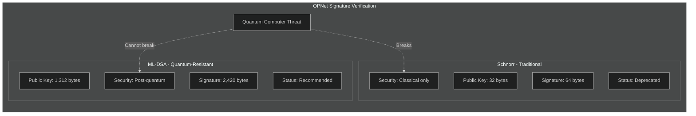
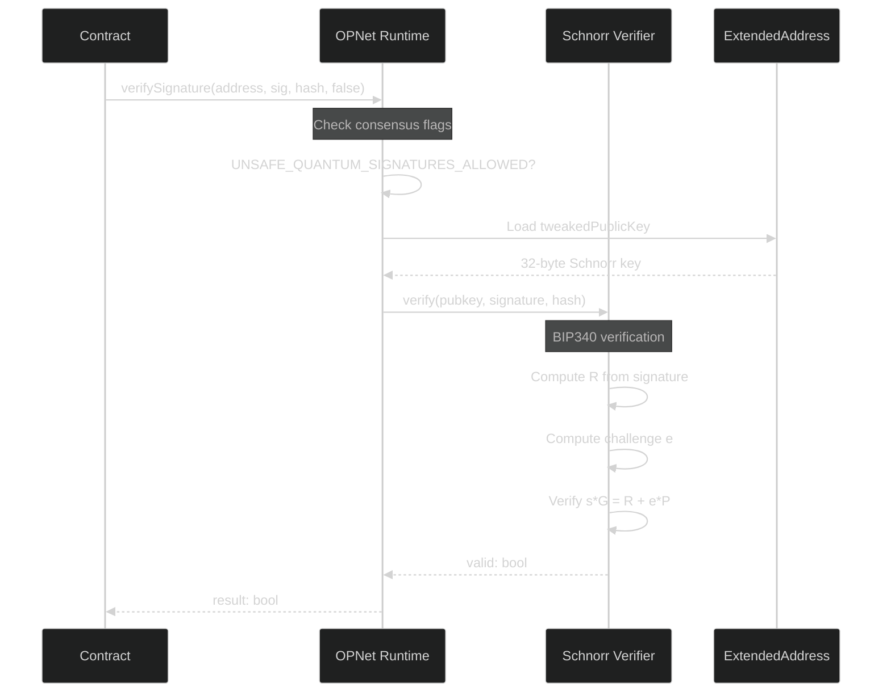
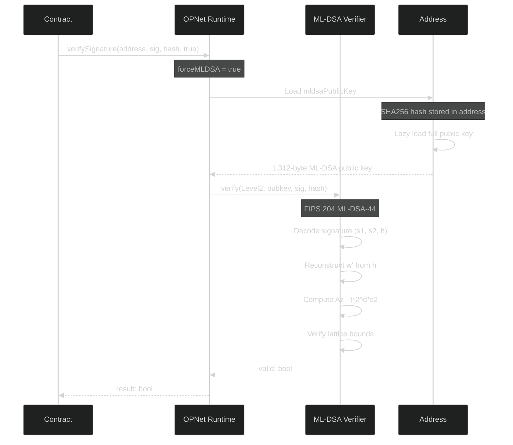
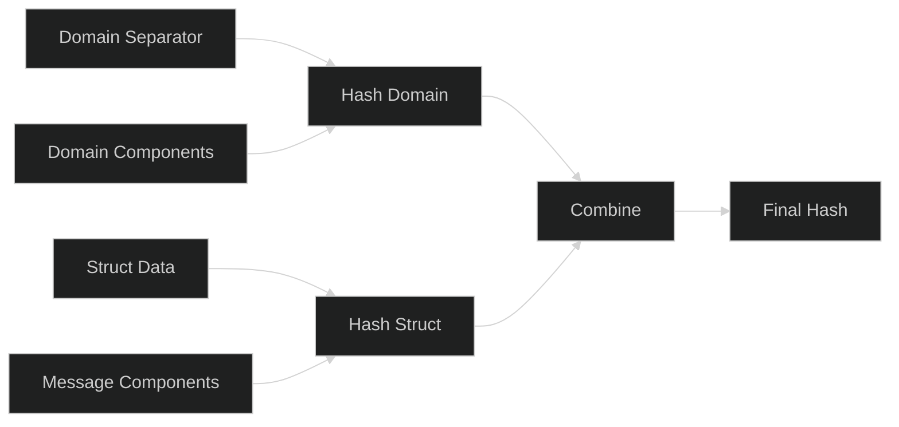

# Signature Verification

OPNet supports multiple signature schemes for authentication and authorization. This guide covers Schnorr signatures, quantum-resistant ML-DSA, and common verification patterns.

## Overview

```typescript
import { Blockchain } from '@btc-vision/btc-runtime/runtime';

// Consensus-aware signature verification (recommended)
// Uses Schnorr during transition period, ML-DSA after quantum deadline
const isValid: bool = Blockchain.verifySignature(
    Blockchain.tx.origin,  // Address or ExtendedAddress
    signature,              // Signature bytes
    messageHash,            // 32-byte message hash
    false                   // forceMLDSA: false = auto, true = require ML-DSA
);

// Force quantum-resistant verification (always uses ML-DSA)
const isValidQuantum: bool = Blockchain.verifySignature(
    Blockchain.tx.origin,
    signature,
    messageHash,
    true  // Force ML-DSA regardless of consensus flags
);
```

## Signature Scheme Comparison

OPNet supports both traditional Schnorr signatures and quantum-resistant ML-DSA:



## The verifySignature Method

The recommended approach for all signature verification:

```typescript
Blockchain.verifySignature(
    address: ExtendedAddress,  // Signer's address (contains both key references)
    signature: Uint8Array,     // Signature bytes
    hash: Uint8Array,          // 32-byte message hash
    forceMLDSA: boolean = false  // Force quantum-resistant verification
): boolean
```

**Behavior:**
- When `forceMLDSA = false`: Uses Schnorr if `UNSAFE_QUANTUM_SIGNATURES_ALLOWED` consensus flag is set, otherwise ML-DSA
- When `forceMLDSA = true`: Always uses ML-DSA (quantum-resistant)

The method automatically:
1. Loads the appropriate public key from the address
2. Selects the correct verification algorithm based on consensus rules
3. Handles all internal key formatting

## Schnorr Verification

When using Schnorr signatures (during transition period), the verification follows BIP340:



### Low-Level Schnorr Verification (Deprecated)

```typescript
// Deprecated - use Blockchain.verifySignature() instead
const isValid = Blockchain.verifySchnorrSignature(
    extendedAddress,   // ExtendedAddress (contains tweaked public key)
    signature,         // 64-byte Schnorr signature
    messageHash        // 32-byte message hash
);
```

## ML-DSA Verification

When using quantum-resistant ML-DSA signatures, the verification follows FIPS 204:



### Direct ML-DSA Verification

```typescript
import { MLDSASecurityLevel } from '@btc-vision/btc-runtime/runtime';

const isValid = Blockchain.verifyMLDSASignature(
    MLDSASecurityLevel.Level2,  // Security level
    signer.mldsaPublicKey,       // ML-DSA public key (auto-loaded from address)
    signature,                    // 2420-byte signature (for Level2)
    messageHash                   // 32-byte message hash
);
```

### ML-DSA Security Levels

| Level | Name | Public Key | Signature | NIST Category |
|-------|------|------------|-----------|---------------|
| Level2 | ML-DSA-44 | 1,312 bytes | 2,420 bytes | Category 2 (~AES-128) |
| Level3 | ML-DSA-65 | 1,952 bytes | 3,309 bytes | Category 3 (~AES-192) |
| Level5 | ML-DSA-87 | 2,592 bytes | 4,627 bytes | Category 5 (~AES-256) |

**OPNet uses ML-DSA-44 (Level2) by default.**

## Message Hash Construction

When building message hashes for signature verification, use domain separation to prevent cross-contract signature reuse:



### Domain Separator

```typescript
function buildDomainSeparator(
    name: string,
    version: string,
    chainId: u256,
    contractAddress: Address
): Uint8Array {
    const writer = new BytesWriter(256);

    // EIP-712 domain typehash
    writer.writeBytes(sha256(
        encodeString('EIP712Domain(string name,string version,uint256 chainId,address verifyingContract)')
    ));

    // Domain values
    writer.writeBytes(sha256(encodeString(name)));
    writer.writeBytes(sha256(encodeString(version)));
    writer.writeU256(chainId);
    writer.writeAddress(contractAddress);

    return sha256(writer.getBuffer());
}
```

### Permit Message Hash

```typescript
function buildPermitHash(
    domainSeparator: Uint8Array,
    owner: Address,
    spender: Address,
    value: u256,
    nonce: u256,
    deadline: u64
): Uint8Array {
    const PERMIT_TYPEHASH = sha256(
        encodeString('Permit(address owner,address spender,uint256 value,uint256 nonce,uint256 deadline)')
    );

    // Build struct hash
    const structWriter = new BytesWriter(192);
    structWriter.writeBytes(PERMIT_TYPEHASH);
    structWriter.writeAddress(owner);
    structWriter.writeAddress(spender);
    structWriter.writeU256(value);
    structWriter.writeU256(nonce);
    structWriter.writeU64(deadline);
    const structHash = sha256(structWriter.getBuffer());

    // Final hash with domain separator
    const finalWriter = new BytesWriter(66);
    finalWriter.writeU8(0x19);
    finalWriter.writeU8(0x01);
    finalWriter.writeBytes(domainSeparator);
    finalWriter.writeBytes(structHash);

    return sha256(finalWriter.getBuffer());
}
```

## Complete Contract Example

```typescript
import { OP_NET, Blockchain, Calldata, BytesWriter, Revert, sha256 } from '@btc-vision/btc-runtime/runtime';

@final
class SignatureContract extends OP_NET {

    @method(ABIDataTypes.BYTES)
    @returns({ name: 'valid', type: ABIDataTypes.BOOL })
    public verifySignature(calldata: Calldata): BytesWriter {
        const signature = calldata.readBytesWithLength();

        // Create the message to verify
        const message = new BytesWriter(32);
        message.writeString('Hello, OPNet!');
        const messageHash = sha256(message.getBuffer());

        // Verify using consensus-aware method
        // Automatically uses the sender's public key
        const isValid = Blockchain.verifySignature(
            Blockchain.tx.origin,
            signature,
            messageHash,
            true  // Force ML-DSA for quantum resistance
        );

        const writer = new BytesWriter(1);
        writer.writeBoolean(isValid);
        return writer;
    }

    @method(
        { name: 'signer', type: ABIDataTypes.ADDRESS },
        { name: 'signature', type: ABIDataTypes.BYTES },
        { name: 'message', type: ABIDataTypes.BYTES },
    )
    @returns({ name: 'valid', type: ABIDataTypes.BOOL })
    public verifyFor(calldata: Calldata): BytesWriter {
        const signer = calldata.readAddress();
        const signature = calldata.readBytesWithLength();
        const message = calldata.readBytesWithLength();

        const messageHash = sha256(message);

        // Verify signature for a specific signer
        const isValid = Blockchain.verifySignature(
            signer,
            signature,
            messageHash,
            false  // Use consensus-aware verification
        );

        const writer = new BytesWriter(1);
        writer.writeBoolean(isValid);
        return writer;
    }
}
```

## Solidity Comparison

| Solidity | OPNet |
|----------|-------|
| `ecrecover(hash, v, r, s)` | `Blockchain.verifySignature(addr, sig, hash)` |
| ECDSA signatures | Schnorr + ML-DSA signatures |
| OpenZeppelin ECDSA | Built-in verification |
| No quantum resistance | ML-DSA quantum-resistant option |

### EIP-2612 Permit Comparison

```solidity
// Solidity (EIP-2612)
function permit(
    address owner,
    address spender,
    uint256 value,
    uint256 deadline,
    uint8 v,
    bytes32 r,
    bytes32 s
) external {
    require(deadline >= block.timestamp, "Permit expired");
    bytes32 digest = keccak256(abi.encodePacked(
        "\x19\x01",
        DOMAIN_SEPARATOR,
        keccak256(abi.encode(PERMIT_TYPEHASH, owner, spender, value, nonces[owner]++, deadline))
    ));
    address recovered = ecrecover(digest, v, r, s);
    require(recovered == owner, "Invalid signature");
    _approve(owner, spender, value);
}
```

```typescript
// OPNet
@method(
    { name: 'owner', type: ABIDataTypes.ADDRESS },
    { name: 'spender', type: ABIDataTypes.ADDRESS },
    { name: 'value', type: ABIDataTypes.UINT256 },
    { name: 'deadline', type: ABIDataTypes.UINT64 },
    { name: 'signature', type: ABIDataTypes.BYTES },
)
@emit('Approved')
public permit(calldata: Calldata): BytesWriter {
    const owner = calldata.readAddress();
    const spender = calldata.readAddress();
    const value = calldata.readU256();
    const deadline = calldata.readU64();
    const signature = calldata.readBytesWithLength();

    if (Blockchain.block.medianTime > deadline) {
        throw new Revert('Permit expired');
    }

    const nonce = this.nonces.get(owner);
    this.nonces.set(owner, SafeMath.add(nonce, u256.One));

    const digest = this.buildPermitHash(owner, spender, value, nonce, deadline);

    if (!Blockchain.verifySignature(owner, signature, digest, false)) {
        throw new Revert('Invalid signature');
    }

    this._approve(owner, spender, value);
    return new BytesWriter(0);
}
```

## Common Patterns

### Signature-Based Authorization

```typescript
@method(
    { name: 'action', type: ABIDataTypes.UINT256 },
    { name: 'deadline', type: ABIDataTypes.UINT64 },
    { name: 'signature', type: ABIDataTypes.BYTES },
)
public executeWithSignature(calldata: Calldata): BytesWriter {
    const action = calldata.readU256();
    const deadline = calldata.readU64();
    const signature = calldata.readBytesWithLength();

    // Check deadline
    if (Blockchain.block.medianTime > deadline) {
        throw new Revert('Signature expired');
    }

    // Build message hash (include action + deadline)
    const message = new BytesWriter(40);
    message.writeU256(action);
    message.writeU64(deadline);
    const messageHash = sha256(message.getBuffer());

    // Verify signature from sender
    if (!Blockchain.verifySignature(Blockchain.tx.origin, signature, messageHash, true)) {
        throw new Revert('Invalid signature');
    }

    // Execute action
    this.executeAction(action);

    return new BytesWriter(0);
}
```

### Nonce-Based Replay Protection

```typescript
private noncesPointer: u16 = Blockchain.nextPointer;
private nonces: AddressMemoryMap;

@method(
    { name: 'owner', type: ABIDataTypes.ADDRESS },
    { name: 'spender', type: ABIDataTypes.ADDRESS },
    { name: 'value', type: ABIDataTypes.UINT256 },
    { name: 'deadline', type: ABIDataTypes.UINT64 },
    { name: 'signature', type: ABIDataTypes.BYTES },
)
@emit('Approved')
public permit(calldata: Calldata): BytesWriter {
    const owner = calldata.readAddress();
    const spender = calldata.readAddress();
    const value = calldata.readU256();
    const deadline = calldata.readU64();
    const signature = calldata.readBytesWithLength();

    // Check deadline
    if (Blockchain.block.medianTime > deadline) {
        throw new Revert('Permit expired');
    }

    // Get and increment nonce (prevents replay)
    const nonce = this.nonces.get(owner);
    this.nonces.set(owner, SafeMath.add(nonce, u256.One));

    // Build permit hash
    const messageHash = this.buildPermitHash(owner, spender, value, nonce, deadline);

    // Verify signature
    if (!Blockchain.verifySignature(owner, signature, messageHash, false)) {
        throw new Revert('Invalid signature');
    }

    // Set approval
    this._approve(owner, spender, value);

    return new BytesWriter(0);
}
```

### Multi-Signature Verification

```typescript
@method(
    { name: 'action', type: ABIDataTypes.BYTES },
    { name: 'signers', type: ABIDataTypes.ADDRESS_ARRAY },
    { name: 'signatures', type: ABIDataTypes.BYTES_ARRAY },
)
public executeMultiSig(calldata: Calldata): BytesWriter {
    const action = calldata.readBytesWithLength();
    const signers = calldata.readAddressArray();
    const signatures = calldata.readBytesArray();

    // Build action hash
    const actionHash = sha256(action);

    // Verify required signatures
    let validCount: u32 = 0;
    for (let i = 0; i < signers.length; i++) {
        const signer = signers[i];
        const signature = signatures[i];

        if (this.isAuthorizedSigner(signer)) {
            if (Blockchain.verifySignature(signer, signature, actionHash, true)) {
                validCount++;
            }
        }
    }

    // Check threshold
    if (validCount < this.threshold.value) {
        throw new Revert('Insufficient signatures');
    }

    // Execute
    this.executeAction(action);

    return new BytesWriter(0);
}
```

## Security Best Practices

### 1. Always Include Nonces

```typescript
// Prevent signature replay
const nonce = this.nonces.get(signer);
this.nonces.set(signer, SafeMath.add(nonce, u256.One));
// Include nonce in message hash
```

### 2. Include Deadlines

```typescript
// Limit signature validity
if (Blockchain.block.medianTime > deadline) {
    throw new Revert('Signature expired');
}
```

### 3. Use Domain Separation

```typescript
// Prevent cross-contract/cross-chain replay
const DOMAIN_SEPARATOR = buildDomainSeparator(
    'MyContract',
    '1',
    chainId,
    Blockchain.contract.address
);
```

### 4. Prefer Quantum-Resistant Verification

```typescript
// For high-security operations, force ML-DSA
Blockchain.verifySignature(signer, signature, hash, true);
```

---

**Navigation:**
- Previous: [Cross-Contract Calls](./cross-contract-calls.md)
- Next: [Quantum Resistance](./quantum-resistance.md)
