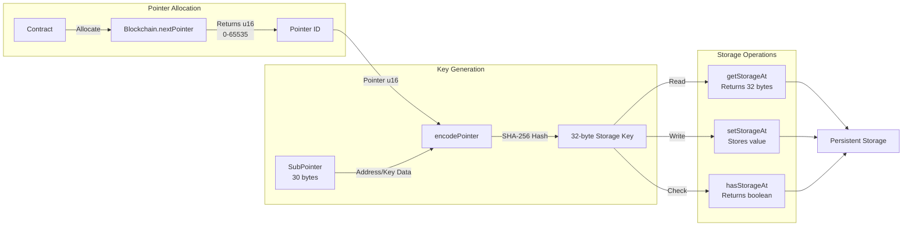
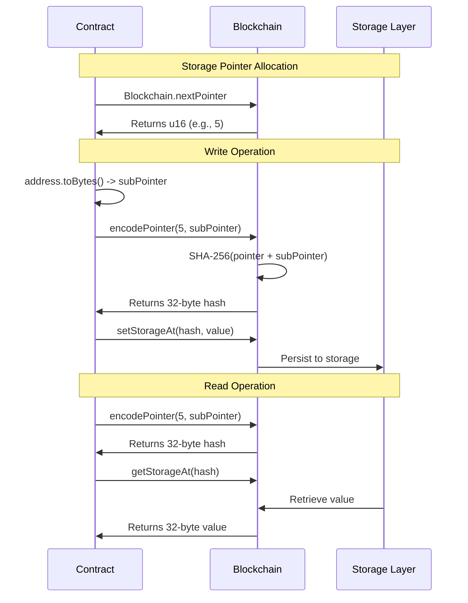
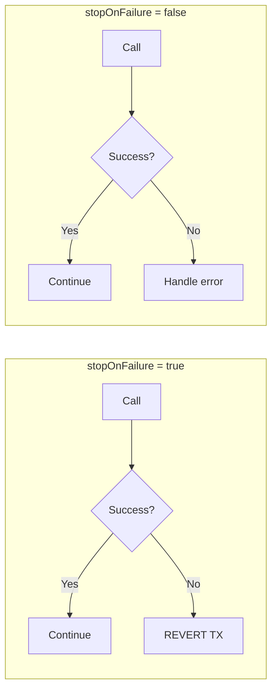
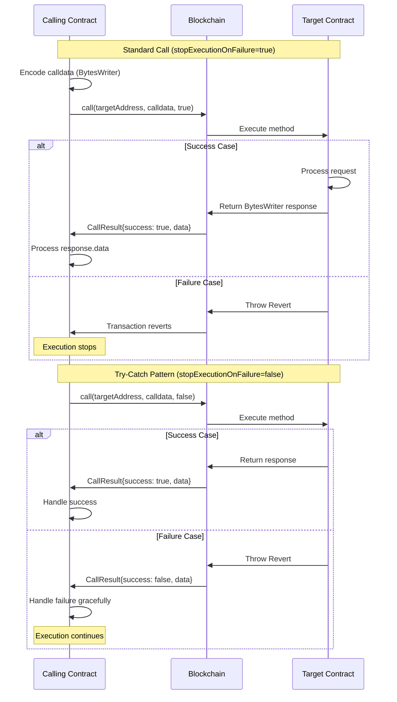
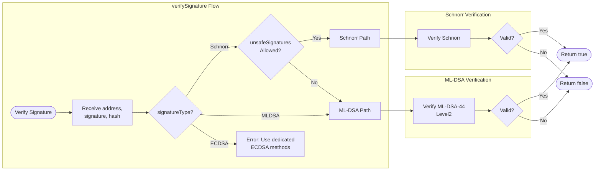
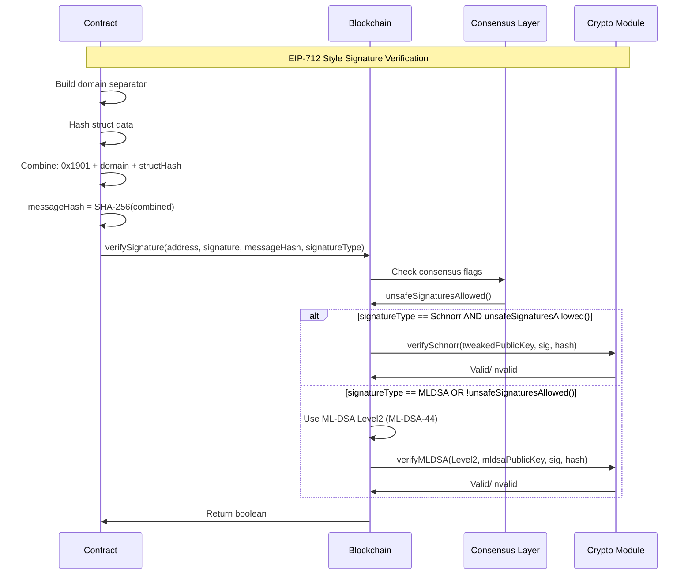

# Blockchain API Reference

The `Blockchain` singleton provides access to the runtime environment, storage, and blockchain operations.

## Import

```typescript
import { Blockchain } from '@btc-vision/btc-runtime/runtime';
```

## Properties

### Block Context

| Property | Type | Description |
|----------|------|-------------|
| `Blockchain.block` | `Block` | Current block information |
| `Blockchain.block.number` | `u64` | Block height |
| `Blockchain.block.numberU256` | `u256` | Block height as u256 |
| `Blockchain.block.hash` | `Uint8Array` | 32-byte block hash |
| `Blockchain.block.medianTimestamp` | `u64` | Median timestamp (seconds) |

```typescript
const blockNum = Blockchain.block.number;
const timestamp = Blockchain.block.medianTimestamp;
```

**Solidity Comparison:**
| Solidity | OPNet |
|----------|-------|
| `block.number` | `Blockchain.block.number` |
| `block.timestamp` | `Blockchain.block.medianTimestamp` |

### Transaction Context

| Property | Type | Description |
|----------|------|-------------|
| `Blockchain.tx` | `Transaction` | Current transaction info |
| `Blockchain.tx.sender` | `Address` | Immediate caller |
| `Blockchain.tx.origin` | `ExtendedAddress` | Original signer |
| `Blockchain.tx.txId` | `Uint8Array` | Transaction ID |
| `Blockchain.tx.hash` | `Uint8Array` | Transaction hash |
| `Blockchain.tx.inputs` | `TransactionInput[]` | Transaction inputs (UTXOs) |
| `Blockchain.tx.outputs` | `TransactionOutput[]` | Transaction outputs (UTXOs) |
| `Blockchain.tx.consensus` | `ConsensusRules` | Consensus rules |

```typescript
const caller = Blockchain.tx.sender;      // Immediate caller
const signer = Blockchain.tx.origin;      // Original signer
const unsafeAllowed = Blockchain.tx.consensus.unsafeSignaturesAllowed();
```

**Solidity Comparison:**
| Solidity | OPNet |
|----------|-------|
| `msg.sender` | `Blockchain.tx.sender` |
| `tx.origin` | `Blockchain.tx.origin` |

### Contract Context

| Property | Type | Description |
|----------|------|-------------|
| `Blockchain.contract` | `OP_NET` | Current contract instance |
| `Blockchain.contractAddress` | `Address` | This contract's address |
| `Blockchain.contractDeployer` | `Address` | Deployer's address |

```typescript
const self = Blockchain.contractAddress;
const deployer = Blockchain.contractDeployer;
```

**Solidity Comparison:**
| Solidity | OPNet |
|----------|-------|
| `address(this)` | `Blockchain.contractAddress` |

### Network Context

| Property | Type | Description |
|----------|------|-------------|
| `Blockchain.network` | `Networks` | Network identifier |
| `Blockchain.chainId` | `Uint8Array` | 32-byte chain ID |
| `Blockchain.protocolId` | `Uint8Array` | 32-byte protocol ID |
| `Blockchain.DEAD_ADDRESS` | `ExtendedAddress` | Burn address |

```typescript
if (Blockchain.network === Networks.Mainnet) {
    // Mainnet-specific logic
}
```

**Solidity Comparison:**
| Solidity | OPNet |
|----------|-------|
| `block.chainid` | `Blockchain.chainId` |

## Storage Architecture

### Storage Pointers

| Property | Type | Description |
|----------|------|-------------|
| `Blockchain.nextPointer` | `u16` | Get next storage pointer |

```typescript
private myPointer: u16 = Blockchain.nextPointer;
```

The storage system uses a pointer-based architecture where each storage slot is identified by a unique hash:



## Storage Methods

### encodePointer

Generates a storage key hash from a pointer and subPointer.

```typescript
encodePointer(pointer: u16, subPointer: Uint8Array): Uint8Array
```

| Parameter | Type | Description |
|-----------|------|-------------|
| `pointer` | `u16` | Storage slot identifier (0-65535) |
| `subPointer` | `Uint8Array` | Sub-index bytes (typically 30 bytes) |
| **Returns** | `Uint8Array` | 32-byte storage key hash |

```typescript
import { encodePointer } from '@btc-vision/btc-runtime/runtime';

const pointer: u16 = Blockchain.nextPointer;
const subPointer = address.toBytes(); // or u256.toUint8Array(true)

// Generate storage key
const pointerHash = encodePointer(pointer, subPointer);
```

### getStorageAt

Reads from persistent storage.

```typescript
getStorageAt(pointerHash: Uint8Array): Uint8Array
```

| Parameter | Type | Description |
|-----------|------|-------------|
| `pointerHash` | `Uint8Array` | 32-byte storage key (from encodePointer) |
| **Returns** | `Uint8Array` | 32-byte value (zeros if unset) |

```typescript
import { encodePointer } from '@btc-vision/btc-runtime/runtime';

// Create storage key
const pointerHash = encodePointer(pointer, subPointer);

// Read from storage
const stored = Blockchain.getStorageAt(pointerHash);
const value = u256.fromUint8ArrayBE(stored);
```

### setStorageAt

Writes to persistent storage.

```typescript
setStorageAt(pointerHash: Uint8Array, value: Uint8Array): void
```

| Parameter | Type | Description |
|-----------|------|-------------|
| `pointerHash` | `Uint8Array` | 32-byte storage key (from encodePointer) |
| `value` | `Uint8Array` | Value to store (auto-padded to 32 bytes) |

```typescript
import { encodePointer } from '@btc-vision/btc-runtime/runtime';

// Create storage key
const pointerHash = encodePointer(pointer, subPointer);

// Write to storage
Blockchain.setStorageAt(pointerHash, value.toUint8Array(true));
```

### hasStorageAt

Checks if storage slot has non-zero value.

```typescript
hasStorageAt(pointerHash: Uint8Array): bool
```

```typescript
const pointerHash = encodePointer(pointer, subPointer);
if (Blockchain.hasStorageAt(pointerHash)) {
    // Slot has a value
}
```

### Storage Flow

The following sequence diagram illustrates the complete flow of storage operations:



### Storage Pattern Example

Complete example showing the correct pattern:

```typescript
import { u256 } from '@btc-vision/as-bignum/assembly';
import {
    Blockchain,
    encodePointer,
    Address
} from '@btc-vision/btc-runtime/runtime';

// Allocate pointer
private balancesPointer: u16 = Blockchain.nextPointer;

// Write balance
public setBalance(address: Address, amount: u256): void {
    const pointerHash = encodePointer(this.balancesPointer, address.toBytes());
    Blockchain.setStorageAt(pointerHash, amount.toUint8Array(true));
}

// Read balance
public getBalance(address: Address): u256 {
    const pointerHash = encodePointer(this.balancesPointer, address.toBytes());
    const stored = Blockchain.getStorageAt(pointerHash);
    return u256.fromUint8ArrayBE(stored);
}
```

**Solidity Comparison:**
| Solidity | OPNet |
|----------|-------|
| `mapping(address => uint256) balances` | `AddressMemoryMap` with pointer |
| `balances[addr] = value` | `Blockchain.setStorageAt(pointerHash, value)` |
| `balances[addr]` | `Blockchain.getStorageAt(pointerHash)` |

### Transient Storage (Experimental)

> **Warning:** Transient storage is NOT enabled in production. Only available in testing.

```typescript
getTransientStorageAt(pointerHash: Uint8Array): Uint8Array
setTransientStorageAt(pointerHash: Uint8Array, value: Uint8Array): void
hasTransientStorageAt(pointerHash: Uint8Array): bool
```

## Cross-Contract Calls

### call

Calls another contract.

```typescript
call(
    destinationContract: Address,
    calldata: BytesWriter,
    stopExecutionOnFailure: boolean = true
): CallResult
```

| Parameter | Type | Description |
|-----------|------|-------------|
| `destinationContract` | `Address` | Target contract |
| `calldata` | `BytesWriter` | Encoded call data |
| `stopExecutionOnFailure` | `boolean` | Revert on failure (default: true) |
| **Returns** | `CallResult` | Success flag and response data |

The following diagram shows the two call patterns - standard calls that revert on failure, and try-catch style calls that handle failures gracefully:



```typescript
// Standard call - reverts on failure
const result = Blockchain.call(tokenAddress, calldata);
const balance = result.data.readU256();

// Try-catch pattern - handles failure gracefully
const result = Blockchain.call(tokenAddress, calldata, false);
if (result.success) {
    // Process response
} else {
    // Handle failure without reverting
}
```

The complete call flow with both success and failure scenarios:



**Solidity Comparison:**
| Solidity | OPNet |
|----------|-------|
| `target.call(data)` | `Blockchain.call(target, calldata, false)` |
| `target.functionCall(args)` | `Blockchain.call(target, calldata, true)` |
| `try target.call() { } catch { }` | `Blockchain.call(target, calldata, false)` + check `result.success` |

### CallResult

```typescript
class CallResult {
    readonly success: boolean;
    readonly data: BytesReader;
}
```

### deployContractFromExisting

Deploys a new contract from a template.

```typescript
deployContractFromExisting(
    existingAddress: Address,
    salt: u256,
    calldata: BytesWriter
): Address
```

| Parameter | Type | Description |
|-----------|------|-------------|
| `existingAddress` | `Address` | Template contract |
| `salt` | `u256` | Unique salt for address |
| `calldata` | `BytesWriter` | Constructor parameters |
| **Returns** | `Address` | New contract address |

```typescript
const salt = u256.fromBytes(Blockchain.sha256(uniqueData));
const newContract = Blockchain.deployContractFromExisting(
    templateAddress,
    salt,
    constructorData
);
```

### updateContractFromExisting

Updates the calling contract's bytecode from another deployed contract. The new bytecode takes effect at the next block.

```typescript
updateContractFromExisting(
    sourceAddress: Address,
    calldata?: BytesWriter | null
): void
```

| Parameter | Type | Description |
|-----------|------|-------------|
| `sourceAddress` | `Address` | Contract containing new bytecode |
| `calldata` | `BytesWriter \| null` | Optional calldata passed to VM (default: empty) |

```typescript
// Basic upgrade (not recommended without access control)
Blockchain.updateContractFromExisting(newBytecodeAddress);

// With calldata
const upgradeData = new BytesWriter(32);
upgradeData.writeU256(migrationVersion);
Blockchain.updateContractFromExisting(newBytecodeAddress, upgradeData);
```

> **Warning:** This is a privileged operation. Always implement access control (e.g., `onlyDeployer`) and consider using the `Upgradeable` base class or `UpgradeablePlugin` for timelock protection. See [Contract Upgrades](../advanced/contract-upgrades.md) for details.

## Cryptographic Operations

### sha256

Computes SHA-256 hash.

```typescript
sha256(buffer: Uint8Array): Uint8Array
```

```typescript
const hash = Blockchain.sha256(data);  // 32 bytes
```

### hash256

Computes double SHA-256 (Bitcoin standard).

```typescript
hash256(buffer: Uint8Array): Uint8Array
```

```typescript
const txHash = Blockchain.hash256(txData);  // 32 bytes
```

## Signature Verification

### verifySignature

Verifies signature based on current consensus rules.

```typescript
import { SignaturesMethods } from '@btc-vision/btc-runtime/runtime';

verifySignature(
    address: ExtendedAddress,
    signature: Uint8Array,
    hash: Uint8Array,
    signatureType: SignaturesMethods = SignaturesMethods.Schnorr
): boolean
```

| Parameter | Type | Description |
|-----------|------|-------------|
| `address` | `ExtendedAddress` | Signer's address |
| `signature` | `Uint8Array` | Signature bytes (64 for Schnorr, 2420+ for ML-DSA) |
| `hash` | `Uint8Array` | 32-byte message hash |
| `signatureType` | `SignaturesMethods` | Signature type: `Schnorr` (default), `MLDSA`, or `ECDSA` |
| **Returns** | `boolean` | True if valid |

The signature verification selects the appropriate algorithm based on the `signatureType` parameter and consensus rules:



```typescript
const isValid = Blockchain.verifySignature(
    signerAddress,
    signatureBytes,
    messageHash
);
if (!isValid) {
    throw new Revert('Invalid signature');
}
```

The complete EIP-712 style signature verification flow:



### verifyECDSASignature (Deprecated)

Verifies an ECDSA signature using the Ethereum ecrecover model (secp256k1).

```typescript
verifyECDSASignature(
    publicKey: Uint8Array,
    signature: Uint8Array,
    hash: Uint8Array
): boolean
```

| Parameter | Type | Description |
|-----------|------|-------------|
| `publicKey` | `Uint8Array` | secp256k1 public key (33, 64, or 65 bytes) |
| `signature` | `Uint8Array` | 65-byte signature: r(32) \|\| s(32) \|\| v(1) |
| `hash` | `Uint8Array` | 32-byte message hash (typically keccak256) |
| **Returns** | `boolean` | True if ecrecover produces matching key |

> **Warning:** Only available when `UNSAFE_QUANTUM_SIGNATURES_ALLOWED` consensus flag is set. Throws `Revert` otherwise.

### verifyBitcoinECDSASignature (Deprecated)

Verifies an ECDSA signature using the Bitcoin direct verification model (secp256k1).

```typescript
verifyBitcoinECDSASignature(
    publicKey: Uint8Array,
    signature: Uint8Array,
    hash: Uint8Array
): boolean
```

| Parameter | Type | Description |
|-----------|------|-------------|
| `publicKey` | `Uint8Array` | secp256k1 public key (33, 64, or 65 bytes) |
| `signature` | `Uint8Array` | 64-byte compact signature: r(32) \|\| s(32) |
| `hash` | `Uint8Array` | 32-byte message hash (typically SHA-256 double hash) |
| **Returns** | `boolean` | True if signature is valid |

> **Warning:** Only available when `UNSAFE_QUANTUM_SIGNATURES_ALLOWED` consensus flag is set. Throws `Revert` otherwise. Enforces BIP-0062 low-S normalization.

### verifyMLDSASignature

Verifies ML-DSA (quantum-resistant) signature.

```typescript
verifyMLDSASignature(
    level: MLDSASecurityLevel,
    publicKey: Uint8Array,
    signature: Uint8Array,
    hash: Uint8Array
): boolean
```

| Parameter | Type | Description |
|-----------|------|-------------|
| `level` | `MLDSASecurityLevel` | Security level (Level2, Level3, Level5) |
| `publicKey` | `Uint8Array` | ML-DSA public key |
| `signature` | `Uint8Array` | ML-DSA signature |
| `hash` | `Uint8Array` | 32-byte message hash |
| **Returns** | `boolean` | True if valid |

```typescript
import { MLDSASecurityLevel } from '@btc-vision/btc-runtime/runtime';

const isValid = Blockchain.verifyMLDSASignature(
    MLDSASecurityLevel.Level2,  // ML-DSA-44
    address.mldsaPublicKey,     // 1312 bytes
    signature,                   // 2420 bytes
    messageHash                  // 32 bytes
);
```

### verifySchnorrSignature (Deprecated)

```typescript
verifySchnorrSignature(
    publicKey: ExtendedAddress,
    signature: Uint8Array,
    hash: Uint8Array
): boolean
```

> **Note:** Use `verifySignature()` instead for automatic consensus migration.

## Keccak-256 Hashing

Ethereum-compatible Keccak-256 hash functions (original Keccak, not NIST SHA-3-256).

### keccak256

```typescript
import { keccak256 } from '@btc-vision/btc-runtime/runtime';
keccak256(data: Uint8Array): Uint8Array  // 32-byte digest
```

### keccak256Concat

Hash two concatenated byte arrays. Common for `abi.encodePacked` patterns.

```typescript
import { keccak256Concat } from '@btc-vision/btc-runtime/runtime';
keccak256Concat(a: Uint8Array, b: Uint8Array): Uint8Array  // 32-byte digest
```

### functionSelector

Compute Ethereum-style 4-byte function selector.

```typescript
import { functionSelector } from '@btc-vision/btc-runtime/runtime';
functionSelector(signature: string): Uint8Array  // 4 bytes
// e.g. functionSelector('transfer(address,uint256)') => 0xa9059cbb
```

### ethAddressFromPubKey

Derive Ethereum address from 64-byte uncompressed public key.

```typescript
import { ethAddressFromPubKey } from '@btc-vision/btc-runtime/runtime';
ethAddressFromPubKey(publicKey: Uint8Array): Uint8Array  // 20-byte Ethereum address
```

## Utility Methods

### validateBitcoinAddress

Validates a Bitcoin address string.

```typescript
validateBitcoinAddress(address: string): bool
```

```typescript
if (!Blockchain.validateBitcoinAddress(userAddress)) {
    throw new Revert('Invalid Bitcoin address');
}
```

### isContract

Checks if an address is a contract.

```typescript
isContract(address: Address): boolean
```

```typescript
if (Blockchain.isContract(targetAddress)) {
    // Is a contract, not EOA
}
```

**Solidity Comparison:**
| Solidity | OPNet |
|----------|-------|
| `address.code.length > 0` | `Blockchain.isContract(address)` |

### getAccountType

Gets account type code.

```typescript
getAccountType(address: Address): u32
```

| Return Value | Meaning |
|--------------|---------|
| `0` | EOA or uninitialized |
| `>0` | Contract (type code) |

### getBlockHash

Retrieves historical block hash.

```typescript
getBlockHash(blockNumber: u64): Uint8Array
```

```typescript
const hash = Blockchain.getBlockHash(Blockchain.block.number - 10);
```

> **Warning:** Only ~256 recent blocks available. Older blocks return zeros.

**Solidity Comparison:**
| Solidity | OPNet |
|----------|-------|
| `blockhash(blockNumber)` | `Blockchain.getBlockHash(blockNumber)` |

## Event Methods

### emit

Emits an event.

```typescript
emit(event: NetEvent): void
```

```typescript
Blockchain.emit(new TransferEvent(from, to, amount));
```

**Solidity Comparison:**
| Solidity | OPNet |
|----------|-------|
| `emit Transfer(from, to, amount)` | `Blockchain.emit(new TransferEvent(from, to, amount))` |

### log

Logs debug message (testing only).

```typescript
log(data: string): void
```

> **Warning:** Only available in unit testing framework.

```typescript
Blockchain.log('Debug: operation started');
```

## Lifecycle Hooks

These are called by the runtime:

| Method | When Called |
|--------|-------------|
| `onDeployment(calldata)` | Contract deployment |
| `onUpdate(calldata)` | Contract bytecode update (via `updateContractFromExisting`) |
| `onExecutionStarted(selector, calldata)` | Before method execution |
| `onExecutionCompleted(selector, calldata)` | After successful execution |

### onUpdate

Called when the contract's bytecode is updated via `updateContractFromExisting`. Use this hook to perform storage migrations or initialization logic when upgrading.

```typescript
public override onUpdate(calldata: Calldata): void {
    super.onUpdate(calldata); // Call plugins first

    // Perform migration logic
    const migrationVersion = calldata.readU64();
    if (migrationVersion === 2) {
        // Migrate from v1 to v2
        this.migrateToV2();
    }
}
```

> **Note:** The calldata is the same data passed to `Blockchain.updateContractFromExisting(sourceAddress, calldata)`. If no calldata was provided, an empty reader is passed.

---

**Navigation:**
- Previous: [Oracle Integration](../examples/oracle-integration.md)
- Next: [OP20 API](./op20.md)
