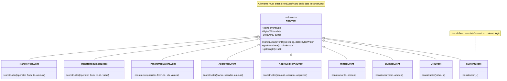
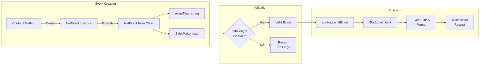
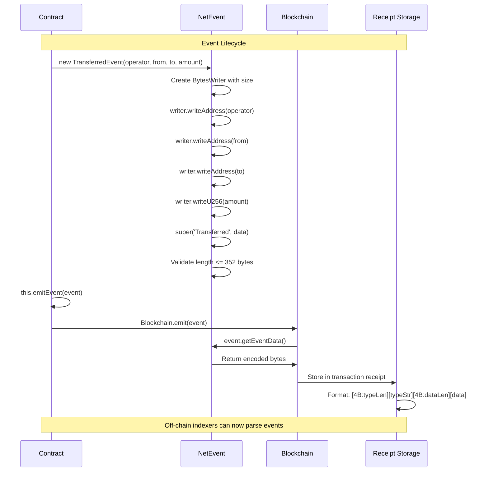
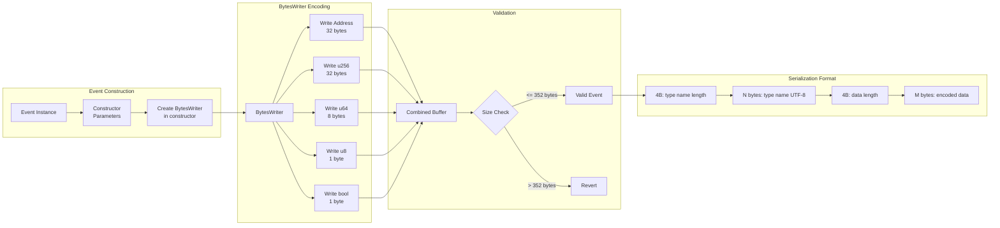

# Events API Reference

Events provide a way to emit state change notifications that off-chain applications can monitor.

## Import

```typescript
import {
    NetEvent,
    TransferredEvent,
    ApprovedEvent,
    MintedEvent,
    BurnedEvent,
    TransferredSingleEvent,
    TransferredBatchEvent,
    ApprovedForAllEvent,
    URIEvent,
    BytesWriter,
} from '@btc-vision/btc-runtime/runtime';
```

## NetEvent Base Class

All events extend the `NetEvent` base class.

```typescript
abstract class NetEvent {
    protected constructor(eventType: string, data: BytesWriter)
    public getEventData(): Uint8Array
    public get length(): u32
    public readonly eventType: string
}
```

## Event Class Hierarchy



## Creating Custom Events

### Basic Event

```typescript
@final
class MyEvent extends NetEvent {
    constructor(value: u256) {
        const data = new BytesWriter(32);
        data.writeU256(value);
        super('MyEvent', data);
    }
}

// Emit
this.emitEvent(new MyEvent(u256.fromU64(100)));
```

The following diagram shows the event system architecture:



### Multi-Field Event

```typescript
import { ADDRESS_BYTE_LENGTH, U256_BYTE_LENGTH } from '@btc-vision/btc-runtime/runtime';

@final
class TransferEvent extends NetEvent {
    constructor(from: Address, to: Address, amount: u256) {
        const data = new BytesWriter(ADDRESS_BYTE_LENGTH * 2 + U256_BYTE_LENGTH);
        data.writeAddress(from);
        data.writeAddress(to);
        data.writeU256(amount);
        super('Transfer', data);
    }
}
```

### Event with Data Constructor

```typescript
@final
class ComplexEvent extends NetEvent {
    constructor(user: Address, action: u8, timestamp: u64, value: u256) {
        const data = new BytesWriter(ADDRESS_BYTE_LENGTH + 1 + 8 + U256_BYTE_LENGTH);
        data.writeAddress(user);
        data.writeU8(action);
        data.writeU64(timestamp);
        data.writeU256(value);
        super('ComplexEvent', data);
    }
}
```

## Predefined Events

### TransferredEvent

Standard token transfer event. Event type: `'Transferred'`. Note: OP20 transfers include an operator field.

```typescript
class TransferredEvent extends NetEvent {
    constructor(
        operator: Address,  // The address initiating the transfer
        from: Address,      // The sender address
        to: Address,        // The recipient address
        amount: u256        // The amount transferred
    )
}
```

```typescript
this.emitEvent(new TransferredEvent(Blockchain.tx.sender, sender, recipient, amount));
```

### TransferredSingleEvent

Single token transfer event for ERC1155-style tokens. Event type: `'TransferredSingle'`.

```typescript
class TransferredSingleEvent extends NetEvent {
    constructor(
        operator: Address,  // The address initiating the transfer
        from: Address,      // The sender address
        to: Address,        // The recipient address
        id: u256,           // The token ID
        value: u256         // The amount transferred
    )
}
```

```typescript
this.emitEvent(new TransferredSingleEvent(Blockchain.tx.sender, from, to, tokenId, amount));
```

### TransferredBatchEvent

Batch token transfer event for ERC1155-style tokens. Event type: `'TransferredBatch'`. Limited to 3 items due to the 352-byte event size limit.

```typescript
class TransferredBatchEvent extends NetEvent {
    constructor(
        operator: Address,  // The address initiating the transfer
        from: Address,      // The sender address
        to: Address,        // The recipient address
        ids: u256[],        // The token IDs (max 3 items)
        values: u256[]      // The amounts transferred (max 3 items)
    )
}
```

```typescript
this.emitEvent(new TransferredBatchEvent(Blockchain.tx.sender, from, to, tokenIds, amounts));
```

### ApprovedEvent

Standard approval event. Event type: `'Approved'`.

```typescript
class ApprovedEvent extends NetEvent {
    constructor(
        owner: Address,     // The token owner
        spender: Address,   // The approved spender
        amount: u256        // The approved amount
    )
}
```

```typescript
this.emitEvent(new ApprovedEvent(owner, spender, allowance));
```

### ApprovedForAllEvent

Operator approval event for all tokens. Event type: `'ApprovedForAll'`.

```typescript
class ApprovedForAllEvent extends NetEvent {
    constructor(
        account: Address,   // The account granting approval
        operator: Address,  // The approved operator
        approved: boolean   // Whether approval is granted or revoked
    )
}
```

```typescript
this.emitEvent(new ApprovedForAllEvent(owner, operator, true));
```

### MintedEvent

Token minting event. Event type: `'Minted'`.

```typescript
class MintedEvent extends NetEvent {
    constructor(
        to: Address,        // The recipient of minted tokens
        amount: u256        // The amount minted
    )
}
```

```typescript
this.emitEvent(new MintedEvent(recipient, mintAmount));
```

### BurnedEvent

Token burning event. Event type: `'Burned'`.

```typescript
class BurnedEvent extends NetEvent {
    constructor(
        from: Address,      // The address tokens are burned from
        amount: u256        // The amount burned
    )
}
```

```typescript
this.emitEvent(new BurnedEvent(burner, burnAmount));
```

### URIEvent

URI update event for token metadata. Event type: `'URI'`. URI length is limited to 200 bytes.

```typescript
class URIEvent extends NetEvent {
    constructor(
        value: string,      // The URI string (max 200 bytes)
        id: u256            // The token ID
    )
}
```

```typescript
this.emitEvent(new URIEvent('https://example.com/token/1', tokenId));
```

## Event Lifecycle

The following sequence diagram shows the complete event lifecycle from creation to storage:



## Event Encoding Flow

The following diagram shows how events are encoded into binary format:



## Event Size Limits

Events have a maximum payload size of **352 bytes**.

| Component | Size |
|-----------|------|
| Event type name | Variable |
| Event data | Up to 352 bytes |

```typescript
// Calculate event data size
// Address: 32 bytes, u256: 32 bytes

@final
class LargeEvent extends NetEvent {
    constructor(
        addr1: Address,     // 32 bytes
        addr2: Address,     // 32 bytes
        value1: u256,       // 32 bytes
        value2: u256,       // 32 bytes
        value3: u256        // 32 bytes
    ) {                     // Total: 160 bytes - OK
        const data = new BytesWriter(ADDRESS_BYTE_LENGTH * 2 + U256_BYTE_LENGTH * 3);
        data.writeAddress(addr1);
        data.writeAddress(addr2);
        data.writeU256(value1);
        data.writeU256(value2);
        data.writeU256(value3);
        super('LargeEvent', data);
    }
}
```

## Emitting Events

Use `emitEvent` from the contract:

```typescript
// In contract method
@method(
    { name: 'to', type: ABIDataTypes.ADDRESS },
    { name: 'amount', type: ABIDataTypes.UINT256 },
)
@emit('Transferred')
public transfer(calldata: Calldata): BytesWriter {
    const to: Address = calldata.readAddress();
    const amount: u256 = calldata.readU256();
    const from: Address = Blockchain.tx.sender;

    // Perform transfer
    this._transfer(from, to, amount);

    // Emit event (OP_NET base class handles emitting via internal _transfer)
    // For custom events, use:
    // this.emitEvent(new TransferredEvent(Blockchain.tx.sender, from, to, amount));

    return new BytesWriter(0);
}
```

Or use `Blockchain.emit`:

```typescript
Blockchain.emit(new TransferredEvent(Blockchain.tx.sender, from, to, amount));
```

## Event Encoding Format

Events are encoded as:

```
[4 bytes: type name length]
[N bytes: type name (UTF-8)]
[4 bytes: data length]
[M bytes: event data]
```

## Common Event Patterns

### State Change Events

```typescript
@final
class OwnershipTransferred extends NetEvent {
    constructor(previousOwner: Address, newOwner: Address) {
        const data = new BytesWriter(ADDRESS_BYTE_LENGTH * 2);
        data.writeAddress(previousOwner);
        data.writeAddress(newOwner);
        super('OwnershipTransferred', data);
    }
}
```

### Action Events

```typescript
@final
class Paused extends NetEvent {
    constructor(account: Address) {
        const data = new BytesWriter(ADDRESS_BYTE_LENGTH);
        data.writeAddress(account);
        super('Paused', data);
    }
}

@final
class Unpaused extends NetEvent {
    constructor(account: Address) {
        const data = new BytesWriter(ADDRESS_BYTE_LENGTH);
        data.writeAddress(account);
        super('Unpaused', data);
    }
}
```

### Indexed-Style Events

While OPNet doesn't have Solidity's indexed parameters, you can structure events for efficient filtering:

```typescript
@final
class OrderFilled extends NetEvent {
    constructor(
        orderId: u256,
        maker: Address,
        taker: Address,
        amount: u256,
        price: u256
    ) {
        const data = new BytesWriter(U256_BYTE_LENGTH * 3 + ADDRESS_BYTE_LENGTH * 2);
        // Put "indexed" fields first for consistent offset
        data.writeU256(orderId);
        data.writeAddress(maker);
        data.writeAddress(taker);
        data.writeU256(amount);
        data.writeU256(price);
        super('OrderFilled', data);
    }
}
```

## Event Best Practices

### 1. Emit After State Changes

```typescript
// Good - emit after state is updated
this._balances.set(to, newBalance);
this.emitEvent(new TransferredEvent(Blockchain.tx.sender, from, to, amount));

// Bad - emit before state change
this.emitEvent(new TransferredEvent(Blockchain.tx.sender, from, to, amount));
this._balances.set(to, newBalance);  // Could fail
```

### 2. Use Descriptive Event Names

```typescript
// Good - clear event names
@final class TokensMinted extends NetEvent { ... }
@final class LiquidityAdded extends NetEvent { ... }
@final class StakeWithdrawn extends NetEvent { ... }

// Less clear
@final class Action1 extends NetEvent { ... }
@final class Update extends NetEvent { ... }
```

### 3. Include Relevant Context

```typescript
// Good - includes all relevant data
@final
class Swap extends NetEvent {
    constructor(
        user: Address,
        tokenIn: Address,
        tokenOut: Address,
        amountIn: u256,
        amountOut: u256
    ) {
        const data = new BytesWriter(ADDRESS_BYTE_LENGTH * 3 + U256_BYTE_LENGTH * 2);
        data.writeAddress(user);
        data.writeAddress(tokenIn);
        data.writeAddress(tokenOut);
        data.writeU256(amountIn);
        data.writeU256(amountOut);
        super('Swap', data);
    }
}

// Less useful - missing context
@final
class Swap extends NetEvent {
    constructor(amount: u256) {
        const data = new BytesWriter(U256_BYTE_LENGTH);
        data.writeU256(amount);
        super('Swap', data);
    }
}
```

### 4. Keep Events Consistent

```typescript
// Use consistent field ordering across similar events
@final
class Deposit extends NetEvent {
    constructor(user: Address, token: Address, amount: u256) {
        const data = new BytesWriter(ADDRESS_BYTE_LENGTH * 2 + U256_BYTE_LENGTH);
        data.writeAddress(user);
        data.writeAddress(token);
        data.writeU256(amount);
        super('Deposit', data);
    }
}

@final
class Withdraw extends NetEvent {
    constructor(user: Address, token: Address, amount: u256) {  // Same order
        const data = new BytesWriter(ADDRESS_BYTE_LENGTH * 2 + U256_BYTE_LENGTH);
        data.writeAddress(user);
        data.writeAddress(token);
        data.writeU256(amount);
        super('Withdraw', data);
    }
}
```

## Solidity Comparison

| Solidity | OPNet |
|----------|-------|
| `event Transfer(address indexed from, address indexed to, uint256 value)` | `class TransferredEvent extends NetEvent` |
| `emit Transfer(from, to, value)` | `emitEvent(new TransferredEvent(operator, from, to, value))` |
| Indexed parameters | Structure data with important fields first |
| Anonymous events | Not supported |

## Event Limitations

1. **No indexed parameters** - All parameters are in data payload
2. **352-byte limit** - Plan data structure carefully
3. **Not accessible on-chain** - Events are for off-chain consumption only
4. **No topics** - Single event type string instead of topic hashes

---

**Navigation:**
- Previous: [Storage API](./storage.md)
- [Back to Documentation Index](../README.md)
