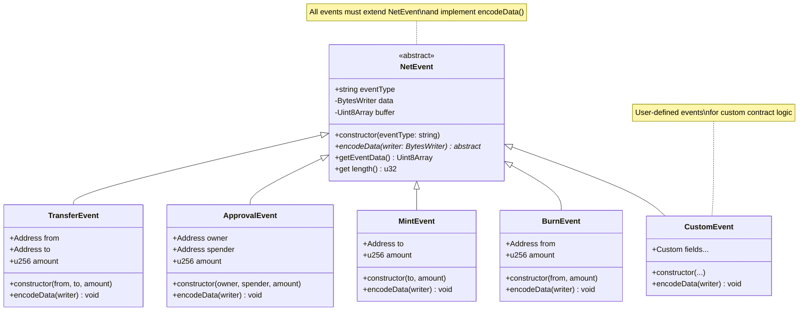
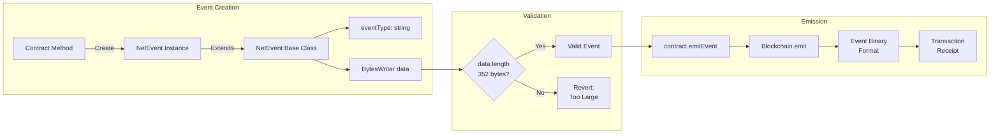
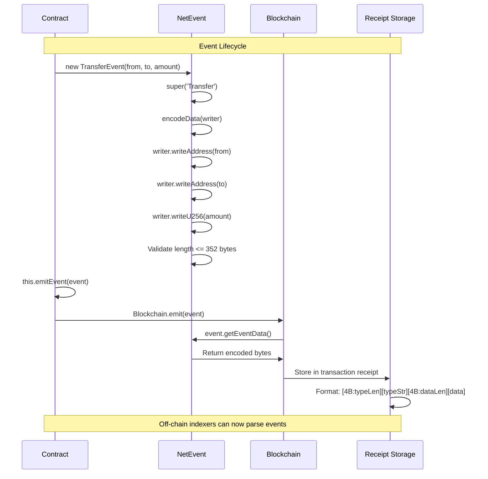
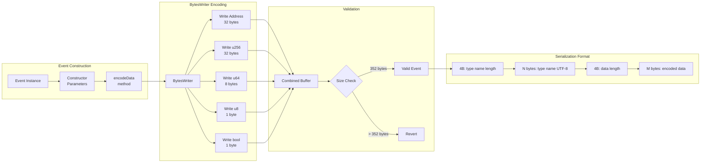

# Events API Reference

Events provide a way to emit state change notifications that off-chain applications can monitor.

## Import

```typescript
import {
    NetEvent,
    TransferEvent,
    ApprovalEvent,
    MintEvent,
    BurnEvent,
    BytesWriter,
} from '@btc-vision/btc-runtime/runtime';
```

## NetEvent Base Class

All events extend the `NetEvent` base class.

```typescript
abstract class NetEvent {
    constructor(eventType: string)
    protected abstract encodeData(writer: BytesWriter): void
    public getEventData(): Uint8Array
    public get eventType(): string
}
```

## Event Class Hierarchy



## Creating Custom Events

### Basic Event

```typescript
class MyEvent extends NetEvent {
    constructor(public readonly value: u256) {
        super('MyEvent');
    }

    protected override encodeData(writer: BytesWriter): void {
        writer.writeU256(this.value);
    }
}

// Emit
this.emitEvent(new MyEvent(u256.fromU64(100)));
```

The following diagram shows the event system architecture:



### Multi-Field Event

```typescript
class TransferEvent extends NetEvent {
    constructor(
        public readonly from: Address,
        public readonly to: Address,
        public readonly amount: u256
    ) {
        super('Transfer');
    }

    protected override encodeData(writer: BytesWriter): void {
        writer.writeAddress(this.from);
        writer.writeAddress(this.to);
        writer.writeU256(this.amount);
    }
}
```

### Event with Data Constructor

```typescript
class ComplexEvent extends NetEvent {
    constructor(
        public readonly user: Address,
        public readonly action: u8,
        public readonly timestamp: u64,
        public readonly data: u256
    ) {
        super('ComplexEvent');
    }

    protected override encodeData(writer: BytesWriter): void {
        writer.writeAddress(this.user);
        writer.writeU8(this.action);
        writer.writeU64(this.timestamp);
        writer.writeU256(this.data);
    }
}
```

## Predefined Events

### TransferEvent

Standard token transfer event.

```typescript
class TransferEvent extends NetEvent {
    constructor(
        from: Address,
        to: Address,
        amount: u256
    )
}
```

```typescript
this.emitEvent(new TransferEvent(sender, recipient, amount));
```

### ApprovalEvent

Standard approval event.

```typescript
class ApprovalEvent extends NetEvent {
    constructor(
        owner: Address,
        spender: Address,
        amount: u256
    )
}
```

```typescript
this.emitEvent(new ApprovalEvent(owner, spender, allowance));
```

### MintEvent

Token minting event.

```typescript
class MintEvent extends NetEvent {
    constructor(
        to: Address,
        amount: u256
    )
}
```

```typescript
this.emitEvent(new MintEvent(recipient, mintAmount));
```

### BurnEvent

Token burning event.

```typescript
class BurnEvent extends NetEvent {
    constructor(
        from: Address,
        amount: u256
    )
}
```

```typescript
this.emitEvent(new BurnEvent(burner, burnAmount));
```

## Event Lifecycle

The following sequence diagram shows the complete event lifecycle from creation to storage:



## Event Encoding Flow

The following diagram shows how events are encoded into binary format:



## Event Size Limits

Events have a maximum payload size of **352 bytes**.

| Component | Size |
|-----------|------|
| Event type name | Variable |
| Event data | Up to 352 bytes |

```typescript
// Calculate event data size
const ADDRESS_SIZE = 32;
const U256_SIZE = 32;

class LargeEvent extends NetEvent {
    constructor(
        public readonly addr1: Address,     // 32 bytes
        public readonly addr2: Address,     // 32 bytes
        public readonly value1: u256,       // 32 bytes
        public readonly value2: u256,       // 32 bytes
        public readonly value3: u256        // 32 bytes
    ) {                                      // Total: 160 bytes - OK
        super('LargeEvent');
    }
    // ...
}
```

## Emitting Events

Use `emitEvent` from the contract:

```typescript
// In contract method
public transfer(calldata: Calldata): BytesWriter {
    const to = calldata.readAddress();
    const amount = calldata.readU256();
    const from = Blockchain.tx.sender;

    // Perform transfer
    this._transfer(from, to, amount);

    // Emit event
    this.emitEvent(new TransferEvent(from, to, amount));

    return new BytesWriter(1);
}
```

Or use `Blockchain.emit`:

```typescript
Blockchain.emit(new TransferEvent(from, to, amount));
```

## Event Encoding Format

Events are encoded as:

```
[4 bytes: type name length]
[N bytes: type name (UTF-8)]
[4 bytes: data length]
[M bytes: event data]
```

## Common Event Patterns

### State Change Events

```typescript
class OwnershipTransferred extends NetEvent {
    constructor(
        public readonly previousOwner: Address,
        public readonly newOwner: Address
    ) {
        super('OwnershipTransferred');
    }

    protected override encodeData(writer: BytesWriter): void {
        writer.writeAddress(this.previousOwner);
        writer.writeAddress(this.newOwner);
    }
}
```

### Action Events

```typescript
class Paused extends NetEvent {
    constructor(public readonly account: Address) {
        super('Paused');
    }

    protected override encodeData(writer: BytesWriter): void {
        writer.writeAddress(this.account);
    }
}

class Unpaused extends NetEvent {
    constructor(public readonly account: Address) {
        super('Unpaused');
    }

    protected override encodeData(writer: BytesWriter): void {
        writer.writeAddress(this.account);
    }
}
```

### Indexed-Style Events

While OPNet doesn't have Solidity's indexed parameters, you can structure events for efficient filtering:

```typescript
class OrderFilled extends NetEvent {
    constructor(
        public readonly orderId: u256,
        public readonly maker: Address,
        public readonly taker: Address,
        public readonly amount: u256,
        public readonly price: u256
    ) {
        super('OrderFilled');
    }

    protected override encodeData(writer: BytesWriter): void {
        // Put "indexed" fields first for consistent offset
        writer.writeU256(this.orderId);
        writer.writeAddress(this.maker);
        writer.writeAddress(this.taker);
        writer.writeU256(this.amount);
        writer.writeU256(this.price);
    }
}
```

## Event Best Practices

### 1. Emit After State Changes

```typescript
// Good - emit after state is updated
this._balances.set(to, newBalance);
this.emitEvent(new TransferEvent(from, to, amount));

// Bad - emit before state change
this.emitEvent(new TransferEvent(from, to, amount));
this._balances.set(to, newBalance);  // Could fail
```

### 2. Use Descriptive Event Names

```typescript
// Good
class TokensMinted extends NetEvent { ... }
class LiquidityAdded extends NetEvent { ... }
class StakeWithdrawn extends NetEvent { ... }

// Less clear
class Action1 extends NetEvent { ... }
class Update extends NetEvent { ... }
```

### 3. Include Relevant Context

```typescript
// Good - includes all relevant data
class Swap extends NetEvent {
    constructor(
        public readonly user: Address,
        public readonly tokenIn: Address,
        public readonly tokenOut: Address,
        public readonly amountIn: u256,
        public readonly amountOut: u256
    ) { ... }
}

// Less useful - missing context
class Swap extends NetEvent {
    constructor(public readonly amount: u256) { ... }
}
```

### 4. Keep Events Consistent

```typescript
// Use consistent field ordering across similar events
class Deposit extends NetEvent {
    constructor(user: Address, token: Address, amount: u256) { ... }
}

class Withdraw extends NetEvent {
    constructor(user: Address, token: Address, amount: u256) { ... }  // Same order
}
```

## Solidity Comparison

| Solidity | OPNet |
|----------|-------|
| `event Transfer(address indexed from, address indexed to, uint256 value)` | `class TransferEvent extends NetEvent` |
| `emit Transfer(from, to, value)` | `emitEvent(new TransferEvent(from, to, value))` |
| Indexed parameters | Structure data with important fields first |
| Anonymous events | Not supported |

## Event Limitations

1. **No indexed parameters** - All parameters are in data payload
2. **352-byte limit** - Plan data structure carefully
3. **Not accessible on-chain** - Events are for off-chain consumption only
4. **No topics** - Single event type string instead of topic hashes

---

**Navigation:**
- Previous: [Storage API](./storage.md)
- [Back to Documentation Index](../README.md)
