# OP20 API Reference

The `OP20` class implements the fungible token standard, equivalent to ERC20 on Ethereum.

## Import

```typescript
import { OP20, OP20InitParameters } from '@btc-vision/btc-runtime/runtime';
```

## OP20 Architecture


## Class Definition

```typescript
@final
export class MyToken extends OP20 {
    public constructor() {
        super();
    }

    public override onDeployment(calldata: Calldata): void {
        this.instantiate(new OP20InitParameters(
            maxSupply,
            decimals,
            name,
            symbol,
            icon
        ));
    }
}
```

## Initialization

### OP20InitParameters

```typescript
class OP20InitParameters {
    constructor(
        maxSupply: u256,
        decimals: u8,
        name: string,
        symbol: string,
        icon: string = ''
    )
}
```

| Parameter | Type | Description |
|-----------|------|-------------|
| `maxSupply` | `u256` | Maximum token supply (use `u256.Max` for unlimited) |
| `decimals` | `u8` | Token decimals (max 32) |
| `name` | `string` | Token name |
| `symbol` | `string` | Token symbol |
| `icon` | `string` | Token icon URL (optional, default empty string) |

### instantiate

Initializes the OP20 token. Must be called in `onDeployment`.

```typescript
public instantiate(params: OP20InitParameters, skipDeployerVerification: boolean = false): void
```

```typescript
public override onDeployment(calldata: Calldata): void {
    this.instantiate(new OP20InitParameters(
        u256.fromU64(1000000),  // Max supply: 1M
        18,                     // 18 decimals
        'My Token',             // Name
        'MTK',                  // Symbol
        ''                      // Icon URL (optional)
    ));
}
```

**Solidity Comparison:**
| Solidity (ERC20) | OPNet (OP20) |
|------------------|--------------|
| `constructor(string name, string symbol)` | `onDeployment(calldata)` + `instantiate()` |

## View Methods

All view methods in OP20 take `Calldata` and return `BytesWriter`. The `@method` decorator handles ABI encoding/decoding.

### name

Returns the token name.

```typescript
@method()
@returns({ name: 'name', type: ABIDataTypes.STRING })
public name(calldata: Calldata): BytesWriter
```

### symbol

Returns the token symbol.

```typescript
@method()
@returns({ name: 'symbol', type: ABIDataTypes.STRING })
public symbol(calldata: Calldata): BytesWriter
```

### icon

Returns the token icon URL.

```typescript
@method()
@returns({ name: 'icon', type: ABIDataTypes.STRING })
public icon(calldata: Calldata): BytesWriter
```

### decimals

Returns the number of decimals.

```typescript
@method()
@returns({ name: 'decimals', type: ABIDataTypes.UINT8 })
public decimals(calldata: Calldata): BytesWriter
```

### nonceOf

Returns the current nonce for an address (used for signature verification).

```typescript
@method({ name: 'owner', type: ABIDataTypes.ADDRESS })
@returns({ name: 'nonce', type: ABIDataTypes.UINT256 })
public nonceOf(calldata: Calldata): BytesWriter
```

### domainSeparator

Returns the EIP-712 domain separator for signature verification.

```typescript
@method()
@returns({ name: 'domainSeparator', type: ABIDataTypes.BYTES32 })
public domainSeparator(calldata: Calldata): BytesWriter
```

### metadata

Returns all token metadata in a single call (name, symbol, icon, decimals, totalSupply, domainSeparator).

```typescript
@method()
@returns(
    { name: 'name', type: ABIDataTypes.STRING },
    { name: 'symbol', type: ABIDataTypes.STRING },
    { name: 'icon', type: ABIDataTypes.STRING },
    { name: 'decimals', type: ABIDataTypes.UINT8 },
    { name: 'totalSupply', type: ABIDataTypes.UINT256 },
    { name: 'domainSeparator', type: ABIDataTypes.BYTES32 },
)
public metadata(calldata: Calldata): BytesWriter
```

### totalSupply

Returns current total supply.

```typescript
@method()
@returns({ name: 'totalSupply', type: ABIDataTypes.UINT256 })
public totalSupply(calldata: Calldata): BytesWriter
```

### maximumSupply

Returns maximum possible supply.

```typescript
@method()
@returns({ name: 'maximumSupply', type: ABIDataTypes.UINT256 })
public maximumSupply(calldata: Calldata): BytesWriter
```

### balanceOf

Returns balance of an address.

```typescript
@method({ name: 'owner', type: ABIDataTypes.ADDRESS })
@returns({ name: 'balance', type: ABIDataTypes.UINT256 })
public balanceOf(calldata: Calldata): BytesWriter
```

Internal helper (for use within your contract):

```typescript
protected _balanceOf(owner: Address): u256
```

### allowance

Returns spending allowance.

```typescript
@method(
    { name: 'owner', type: ABIDataTypes.ADDRESS },
    { name: 'spender', type: ABIDataTypes.ADDRESS },
)
@returns({ name: 'remaining', type: ABIDataTypes.UINT256 })
public allowance(calldata: Calldata): BytesWriter
```

Internal helper (for use within your contract):

```typescript
protected _allowance(owner: Address, spender: Address): u256
```

**Solidity Comparison:**
| Solidity (ERC20) | OPNet (OP20) |
|------------------|--------------|
| `function name() view returns (string)` | `name(calldata): BytesWriter` |
| `function balanceOf(address) view returns (uint256)` | `balanceOf(calldata): BytesWriter` |
| `function allowance(address, address) view returns (uint256)` | `allowance(calldata): BytesWriter` |

## Transfer Methods

### transfer (Calldata)

Transfers tokens from caller to recipient.

```typescript
public transfer(calldata: Calldata): BytesWriter
```

**Calldata format:**
| Field | Type | Size |
|-------|------|------|
| to | Address | 32 bytes |
| amount | u256 | 32 bytes |

**Returns:** Boolean (success)

The following diagram shows the complete transfer validation and execution flow:


### transferFrom (Calldata)

Transfers tokens using allowance.

```typescript
public transferFrom(calldata: Calldata): BytesWriter
```

**Calldata format:**
| Field | Type | Size |
|-------|------|------|
| from | Address | 32 bytes |
| to | Address | 32 bytes |
| amount | u256 | 32 bytes |

**Returns:** Boolean (success)

The following sequence diagram illustrates both standard transfer and transferFrom with allowance:

```mermaid
sequenceDiagram
    participant User as 👤 User
    participant Contract as OP20 Contract
    participant BalMap as Balance Map
    participant Events as Event System

    Note over User,Events: Standard Transfer Flow

    User->>Contract: transfer(to, amount)
    Contract->>Contract: _transfer(tx.sender, to, amount)

    Contract->>Contract: Validate from != zero
    Contract->>Contract: Validate to != zero

    Contract->>BalMap: Get balance[from]
    BalMap->>Contract: Return balance

    Contract->>Contract: Check balance >= amount

    Contract->>BalMap: Set balance[from] -= amount
    Contract->>BalMap: Set balance[to] += amount

    Contract->>Events: Emit TransferredEvent(operator, from, to, amount)

    Contract->>User: Return success

    Note over User,Events: TransferFrom with Allowance

    User->>Contract: transferFrom(from, to, amount)
    Contract->>Contract: _spendAllowance(from, tx.sender, amount)

    alt Allowance is u256.Max
        Contract->>Contract: Skip allowance deduction
    else Normal allowance
        Contract->>Contract: Check allowance >= amount
        Contract->>Contract: Deduct from allowance
    end

    Contract->>Contract: _transfer(from, to, amount)
    Contract->>Events: Emit TransferredEvent
    Contract->>User: Return success
```



**Solidity Comparison:**
| Solidity (ERC20) | OPNet (OP20) |
|------------------|--------------|
| `function transfer(address to, uint256 amount) returns (bool)` | `transfer(calldata): BytesWriter` |
| `function transferFrom(address from, address to, uint256 amount) returns (bool)` | `transferFrom(calldata): BytesWriter` |

## Approval Methods

### increaseAllowance (Calldata)

Increases the allowance granted to a spender.

```typescript
public increaseAllowance(calldata: Calldata): BytesWriter
```

**Calldata format:**
| Field | Type | Size |
|-------|------|------|
| spender | Address | 32 bytes |
| amount | u256 | 32 bytes |

**Returns:** Empty BytesWriter (emits ApprovedEvent)

**Note:** If overflow would occur, sets allowance to u256.Max (unlimited).

### decreaseAllowance (Calldata)

Decreases the allowance granted to a spender.

```typescript
public decreaseAllowance(calldata: Calldata): BytesWriter
```

**Calldata format:**
| Field | Type | Size |
|-------|------|------|
| spender | Address | 32 bytes |
| amount | u256 | 32 bytes |

**Returns:** Empty BytesWriter (emits ApprovedEvent)

**Note:** If underflow would occur, sets allowance to zero.

### increaseAllowanceBySignature (Calldata)

Increases allowance using an EIP-712 typed signature (gasless approval).

```typescript
public increaseAllowanceBySignature(calldata: Calldata): BytesWriter
```

**Calldata format:**
| Field | Type | Size |
|-------|------|------|
| owner | bytes32 | 32 bytes |
| ownerTweakedPublicKey | bytes32 | 32 bytes |
| spender | Address | 32 bytes |
| amount | u256 | 32 bytes |
| deadline | u64 | 8 bytes |
| signature | bytes | variable |

### decreaseAllowanceBySignature (Calldata)

Decreases allowance using an EIP-712 typed signature.

```typescript
public decreaseAllowanceBySignature(calldata: Calldata): BytesWriter
```

**Calldata format:**
| Field | Type | Size |
|-------|------|------|
| owner | bytes32 | 32 bytes |
| ownerTweakedPublicKey | bytes32 | 32 bytes |
| spender | Address | 32 bytes |
| amount | u256 | 32 bytes |
| deadline | u64 | 8 bytes |
| signature | bytes | variable |

The following diagram shows the allowance management flow including both direct and signature-based methods:


The complete allowance lifecycle from approval to spending:


**Solidity Comparison:**
| Solidity (ERC20) | OPNet (OP20) |
|------------------|--------------|
| `function approve(address, uint256) returns (bool)` | N/A (use increaseAllowance/decreaseAllowance) |
| `function increaseAllowance(address, uint256) returns (bool)` | `increaseAllowance(calldata): BytesWriter` |
| `function decreaseAllowance(address, uint256) returns (bool)` | `decreaseAllowance(calldata): BytesWriter` |

## Protected Methods

For internal contract use:

### _mint

Mints new tokens.

```typescript
protected _mint(to: Address, amount: u256): void
```

```typescript
@method(
    { name: 'to', type: ABIDataTypes.ADDRESS },
    { name: 'amount', type: ABIDataTypes.UINT256 },
)
@returns({ name: 'success', type: ABIDataTypes.BOOL })
@emit('Mint')
public mint(calldata: Calldata): BytesWriter {
    this.onlyDeployer(Blockchain.tx.sender);
    const to: Address = calldata.readAddress();
    const amount: u256 = calldata.readU256();
    this._mint(to, amount);
    return new BytesWriter(0);
}
```

### _burn

Burns tokens.

```typescript
protected _burn(from: Address, amount: u256): void
```

```typescript
@method({ name: 'amount', type: ABIDataTypes.UINT256 })
@returns({ name: 'success', type: ABIDataTypes.BOOL })
@emit('Burn')
public burn(calldata: Calldata): BytesWriter {
    const amount: u256 = calldata.readU256();
    this._burn(Blockchain.tx.sender, amount);
    return new BytesWriter(0);
}
```

### _transfer

Internal transfer.

```typescript
protected _transfer(from: Address, to: Address, amount: u256): void
```

### _increaseAllowance

Internal method to increase allowance with overflow protection.

```typescript
protected _increaseAllowance(owner: Address, spender: Address, amount: u256): void
```

### _decreaseAllowance

Internal method to decrease allowance with underflow protection.

```typescript
protected _decreaseAllowance(owner: Address, spender: Address, amount: u256): void
```

### _spendAllowance

Decrements allowance.

```typescript
protected _spendAllowance(owner: Address, spender: Address, amount: u256): void
```

**Solidity Comparison:**
| Solidity (ERC20) | OPNet (OP20) |
|------------------|--------------|
| `function _mint(address, uint256) internal` | `_mint(Address, u256): void` |
| `function _burn(address, uint256) internal` | `_burn(Address, u256): void` |
| `function _transfer(address, address, uint256) internal` | `_transfer(Address, Address, u256): void` |

## Safe Transfer Methods

### safeTransfer

Transfer with recipient callback.

```typescript
public safeTransfer(calldata: Calldata): BytesWriter
```

**Calldata format:**
| Field | Type | Size |
|-------|------|------|
| to | Address | 32 bytes |
| amount | u256 | 32 bytes |
| data | bytes | variable (with length prefix) |

Calls `onOP20Received` on recipient if it's a contract.

### safeTransferFrom

TransferFrom with callback.

```typescript
public safeTransferFrom(calldata: Calldata): BytesWriter
```

**Calldata format:**
| Field | Type | Size |
|-------|------|------|
| from | Address | 32 bytes |
| to | Address | 32 bytes |
| amount | u256 | 32 bytes |
| data | bytes | variable (with length prefix) |

The following diagram shows the safe transfer flow with recipient callback verification:


## Events

### TransferredEvent

Emitted on transfers (transfer, transferFrom, safeTransfer, safeTransferFrom).

```typescript
class TransferredEvent extends NetEvent {
    constructor(
        operator: Address,  // Address that initiated the transfer
        from: Address,      // Address tokens transferred from
        to: Address,        // Address tokens transferred to
        amount: u256        // Amount transferred
    )
}
```

### ApprovedEvent

Emitted on allowance changes (increaseAllowance, decreaseAllowance).

```typescript
class ApprovedEvent extends NetEvent {
    constructor(
        owner: Address,
        spender: Address,
        amount: u256
    )
}
```

### MintedEvent

Emitted on minting.

```typescript
class MintedEvent extends NetEvent {
    constructor(
        to: Address,
        amount: u256
    )
}
```

### BurnedEvent

Emitted on burning.

```typescript
class BurnedEvent extends NetEvent {
    constructor(
        from: Address,
        amount: u256
    )
}
```

**Solidity Comparison:**
| Solidity (ERC20) | OPNet (OP20) |
|------------------|--------------|
| `event Transfer(address indexed from, address indexed to, uint256 value)` | `TransferredEvent(operator, from, to, amount)` |
| `event Approval(address indexed owner, address indexed spender, uint256 value)` | `ApprovedEvent(owner, spender, amount)` |
| `emit Transfer(from, to, amount)` | `emitEvent(new TransferredEvent(operator, from, to, amount))` |

## Storage Layout

OP20 uses 7 storage pointers:

| Pointer | Purpose |
|---------|---------|
| 0 | Nonce mapping (for signatures) |
| 1 | Max supply |
| 2 | Decimals |
| 3 | String pointer (shared for name/symbol/icon) |
| 4 | Total supply |
| 5 | Allowances mapping |
| 6 | Balances mapping |

## Method Selectors

| Selector | Method |
|----------|--------|
| `name` | Returns name |
| `symbol` | Returns symbol |
| `icon` | Returns icon URL |
| `decimals` | Returns decimals |
| `totalSupply` | Returns total supply |
| `maximumSupply` | Returns max supply |
| `balanceOf` | Returns balance |
| `allowance` | Returns allowance |
| `nonceOf` | Returns nonce for address |
| `domainSeparator` | Returns EIP-712 domain separator |
| `metadata` | Returns all metadata |
| `transfer` | Transfer tokens |
| `transferFrom` | Transfer with allowance |
| `safeTransfer` | Safe transfer with callback |
| `safeTransferFrom` | Safe transferFrom with callback |
| `increaseAllowance` | Increase spender allowance |
| `decreaseAllowance` | Decrease spender allowance |
| `increaseAllowanceBySignature` | Gasless allowance increase |
| `decreaseAllowanceBySignature` | Gasless allowance decrease |
| `burn` | Burn tokens from sender |

## Complete Example

```typescript
import { u256 } from '@btc-vision/as-bignum/assembly';
import {
    OP20,
    OP20InitParameters,
    Blockchain,
    Calldata,
    BytesWriter,
    ABIDataTypes,
} from '@btc-vision/btc-runtime/runtime';

@final
export class MyToken extends OP20 {
    public constructor() {
        super();
    }

    public override onDeployment(calldata: Calldata): void {
        const maxSupply = calldata.readU256();
        const decimals = calldata.readU8();
        const name = calldata.readString();
        const symbol = calldata.readString();
        const initialMint = calldata.readU256();

        this.instantiate(new OP20InitParameters(
            maxSupply,
            decimals,
            name,
            symbol,
            ''  // icon (optional)
        ));

        if (!initialMint.isZero()) {
            this._mint(Blockchain.tx.origin, initialMint);
        }
    }

    @method(
        { name: 'to', type: ABIDataTypes.ADDRESS },
        { name: 'amount', type: ABIDataTypes.UINT256 },
    )
    @returns({ name: 'success', type: ABIDataTypes.BOOL })
    @emit('Minted')
    public mint(calldata: Calldata): BytesWriter {
        this.onlyDeployer(Blockchain.tx.sender);

        const to = calldata.readAddress();
        const amount = calldata.readU256();

        this._mint(to, amount);
        // Note: _mint already emits MintedEvent internally

        return new BytesWriter(0);
    }
}
```

## Solidity Comparison Summary

| Solidity (ERC20) | OPNet (OP20) |
|------------------|--------------|
| `constructor(...)` | `onDeployment(calldata)` |
| `function name()` | `name(): string` |
| `function balanceOf(address)` | `balanceOf(Address): u256` |
| `_mint(address, uint256)` | `_mint(Address, u256)` |
| `emit Transfer(...)` | `emitEvent(new TransferredEvent(...))` |

---

**Navigation:**
- Previous: [Blockchain API](./blockchain.md)
- Next: [OP721 API](./op721.md)
