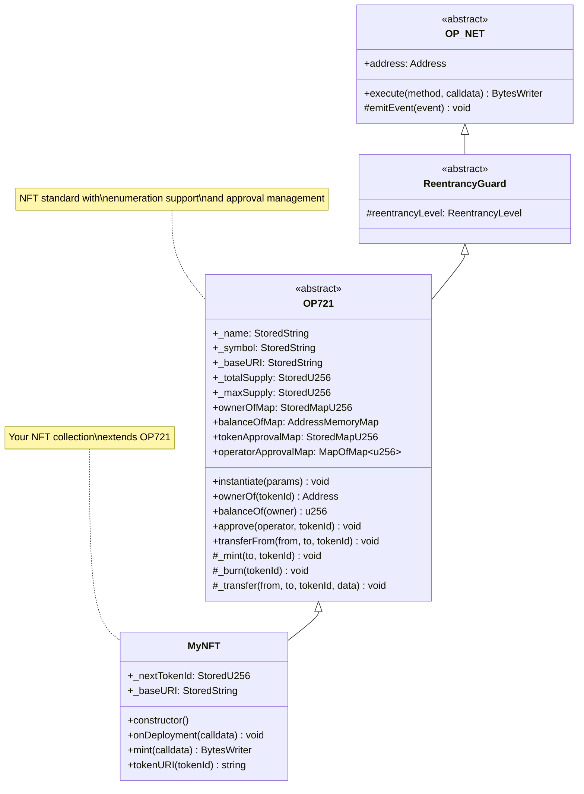
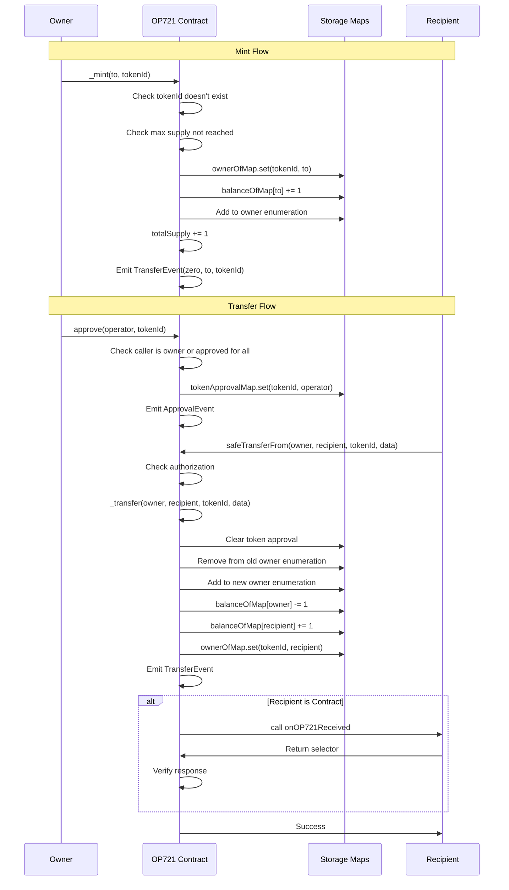
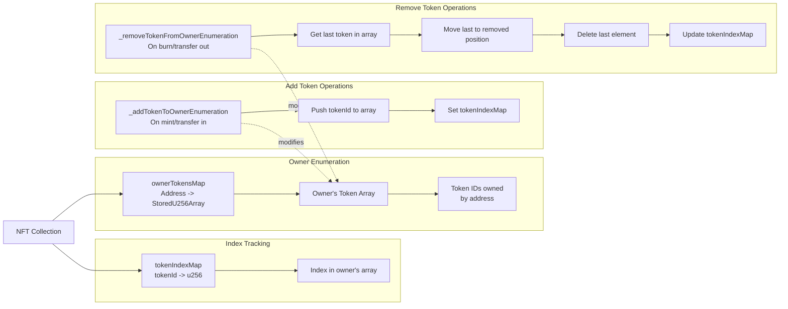
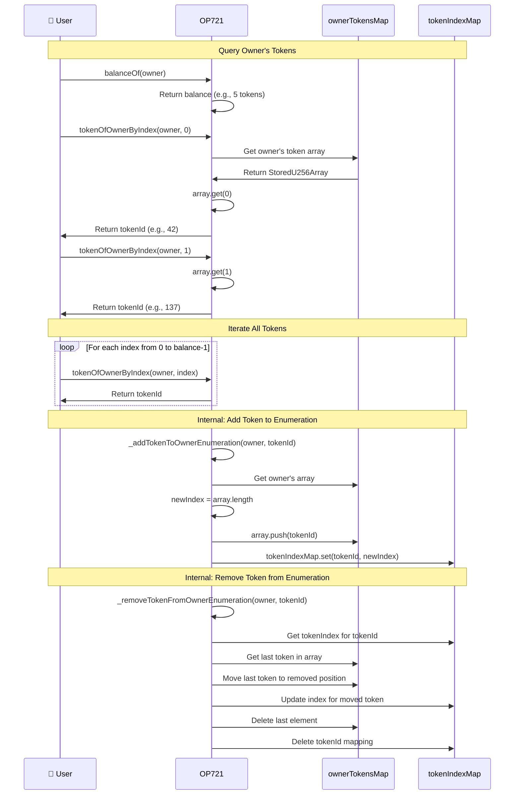

# OP721 API Reference

The `OP721` class implements the non-fungible token (NFT) standard, equivalent to ERC721 on Ethereum.

## Import

```typescript
import { OP721, OP721InitParameters } from '@btc-vision/btc-runtime/runtime';
```

## OP721 Architecture



## Class Definition

```typescript
@final
export class MyNFT extends OP721 {
    public constructor() {
        super();
    }

    public override onDeployment(calldata: Calldata): void {
        const name = calldata.readString();
        const symbol = calldata.readString();
        const baseURI = calldata.readString();
        const maxSupply = calldata.readU256();

        this.instantiate(new OP721InitParameters(
            name,
            symbol,
            baseURI,
            maxSupply
        ));
    }
}
```

## Initialization

### OP721InitParameters

```typescript
class OP721InitParameters {
    constructor(
        name: string,
        symbol: string,
        baseURI: string,
        maxSupply: u256,
        collectionBanner: string = '',
        collectionIcon: string = '',
        collectionWebsite: string = '',
        collectionDescription: string = ''
    )
}
```

| Parameter | Type | Description |
|-----------|------|-------------|
| `name` | `string` | Collection name |
| `symbol` | `string` | Collection symbol |
| `baseURI` | `string` | Base URI for token metadata |
| `maxSupply` | `u256` | Maximum number of tokens that can be minted |
| `collectionBanner` | `string` | Collection banner URL (optional) |
| `collectionIcon` | `string` | Collection icon URL (optional) |
| `collectionWebsite` | `string` | Collection website URL (optional) |
| `collectionDescription` | `string` | Collection description (optional) |

### instantiate

Initializes the OP721 NFT. Must be called in `onDeployment`.

```typescript
protected instantiate(params: OP721InitParameters): void
```

**Solidity Comparison:**
| Solidity (ERC721) | OPNet (OP721) |
|-------------------|---------------|
| `constructor(string name, string symbol)` | `onDeployment(calldata)` + `instantiate()` |

## View Methods

### name

Returns the collection name.

```typescript
public name(): string
```

### symbol

Returns the collection symbol.

```typescript
public symbol(): string
```

### totalSupply

Returns total minted tokens.

```typescript
public totalSupply(): u256
```

### balanceOf

Returns number of tokens owned by address.

```typescript
public balanceOf(owner: Address): u256
```

### ownerOf

Returns owner of a token.

```typescript
public ownerOf(tokenId: u256): Address
```

### tokenURI

Returns metadata URI for a token.

```typescript
public tokenURI(tokenId: u256): string
```

Override to customize metadata:

```typescript
public override tokenURI(tokenId: u256): string {
    return this._baseURI.value + tokenId.toString() + '.json';
}
```

### getApproved

Returns approved address for a token.

```typescript
public getApproved(tokenId: u256): Address
```

### isApprovedForAll

Checks if operator is approved for all tokens.

```typescript
public isApprovedForAll(owner: Address, operator: Address): bool
```

**Solidity Comparison:**
| Solidity (ERC721) | OPNet (OP721) |
|-------------------|---------------|
| `function ownerOf(uint256) view returns (address)` | `ownerOf(u256): Address` |
| `function balanceOf(address) view returns (uint256)` | `balanceOf(Address): u256` |
| `function tokenURI(uint256) view returns (string)` | `tokenURI(u256): string` |

## Transfer Methods

### transferFrom (Calldata)

Transfers an NFT.

```typescript
public transferFrom(calldata: Calldata): BytesWriter
```

**Calldata format:**
| Field | Type | Size |
|-------|------|------|
| from | Address | 32 bytes |
| to | Address | 32 bytes |
| tokenId | u256 | 32 bytes |

The following diagram shows the complete NFT transfer validation and execution flow:

```mermaid
flowchart LR
    subgraph "Validation"
        Start([NFT Transfer]) --> CheckOwner{Verify owner}
        CheckOwner -->|Invalid| Revert1[Revert: Wrong owner]
        CheckOwner -->|Valid| CheckTo{to != zero?}
        CheckTo -->|to == zero| Revert2[Revert: Invalid recipient]
        CheckTo -->|Valid| CheckAuth{Authorization}
    end

    subgraph "Authorization"
        CheckAuth -->|Not authorized| Revert3[Revert: Not authorized]
        CheckAuth -->|Owner| DoTransfer[Execute transfer]
        CheckAuth -->|Approved operator| DoTransfer
        CheckAuth -->|Token approved| DoTransfer
    end

    subgraph "Transfer Execution"
        DoTransfer --> ClearApproval[Clear approval]
        ClearApproval --> UpdateEnum[Update enumerations]
        UpdateEnum --> UpdateBal[Update balances]
        UpdateBal --> UpdateOwner[Set new owner]
        UpdateOwner --> EmitEvent[Emit TransferEvent]
    end

    subgraph "Callback Handling"
        EmitEvent --> IsContract{Recipient<br/>is contract?}
        IsContract -->|No| Success([Complete])
        IsContract -->|Yes| Callback[Call onOP721Received]
        Callback --> CheckResponse{Valid<br/>response?}
        CheckResponse -->|Yes| Success
        CheckResponse -->|No| Revert4[Revert: Rejected]
    end
```



### safeTransferFrom (Calldata)

Safe transfer with recipient callback.

```typescript
public safeTransferFrom(calldata: Calldata): BytesWriter
```

**Calldata format:**
| Field | Type | Size |
|-------|------|------|
| from | Address | 32 bytes |
| to | Address | 32 bytes |
| tokenId | u256 | 32 bytes |

Calls `onOP721Received` on recipient if it's a contract.

The following sequence diagram illustrates the complete mint and transfer flow:



**Solidity Comparison:**
| Solidity (ERC721) | OPNet (OP721) |
|-------------------|---------------|
| `function transferFrom(address, address, uint256)` | `transferFrom(calldata): BytesWriter` |
| `function safeTransferFrom(address, address, uint256)` | `safeTransferFrom(calldata): BytesWriter` |

## Approval Methods

### approve (Calldata)

Approves an address for a single token.

```typescript
public approve(calldata: Calldata): BytesWriter
```

**Calldata format:**
| Field | Type | Size |
|-------|------|------|
| to | Address | 32 bytes |
| tokenId | u256 | 32 bytes |

### setApprovalForAll (Calldata)

Sets operator approval for all tokens.

```typescript
public setApprovalForAll(calldata: Calldata): BytesWriter
```

**Calldata format:**
| Field | Type | Size |
|-------|------|------|
| operator | Address | 32 bytes |
| approved | bool | 1 byte |

**Solidity Comparison:**
| Solidity (ERC721) | OPNet (OP721) |
|-------------------|---------------|
| `function approve(address, uint256)` | `approve(calldata): BytesWriter` |
| `function setApprovalForAll(address, bool)` | `setApprovalForAll(calldata): BytesWriter` |

## Protected Methods

### _mint

Mints a new token.

```typescript
protected _mint(to: Address, tokenId: u256): void
```

```typescript
public mint(calldata: Calldata): BytesWriter {
    this.onlyDeployer(Blockchain.tx.sender);
    const to: Address = calldata.readAddress();
    const tokenId: u256 = calldata.readU256();
    this._mint(to, tokenId);
    return new BytesWriter(0);
}
```

### _burn

Burns a token.

```typescript
protected _burn(tokenId: u256): void
```

### _transfer

Internal transfer.

```typescript
protected _transfer(from: Address, to: Address, tokenId: u256): void
```

### _approve

Internal approval.

```typescript
protected _approve(to: Address, tokenId: u256): void
```

### _setApprovalForAll

Internal operator approval.

```typescript
protected _setApprovalForAll(owner: Address, operator: Address, approved: bool): void
```

**Solidity Comparison:**
| Solidity (ERC721) | OPNet (OP721) |
|-------------------|---------------|
| `function _mint(address, uint256) internal` | `_mint(Address, u256): void` |
| `function _burn(uint256) internal` | `_burn(u256): void` |
| `function _safeMint(address, uint256)` | `_mint()` + safe transfer check |

## Enumeration System

### tokenOfOwnerByIndex

Returns token ID at index for owner.

```typescript
public tokenOfOwnerByIndex(owner: Address, index: u256): u256
```

The enumeration system allows efficient iteration over tokens owned by an address:



The following sequence diagram shows how enumeration queries work:



```typescript
// Get all tokens owned by address
const balance = this.balanceOf(owner);
for (let i = u256.Zero; i < balance; i = SafeMath.add(i, u256.One)) {
    const tokenId = this.tokenOfOwnerByIndex(owner, i);
    // Process tokenId
}
```

### tokenByIndex

Returns token ID at global index.

```typescript
public tokenByIndex(index: u256): u256
```

## Events

### TransferEvent

Emitted on transfers.

```typescript
class TransferEvent extends NetEvent {
    constructor(
        from: Address,
        to: Address,
        tokenId: u256
    )
}
```

### ApprovalEvent

Emitted on approvals.

```typescript
class ApprovalEvent extends NetEvent {
    constructor(
        owner: Address,
        approved: Address,
        tokenId: u256
    )
}
```

### ApprovalForAllEvent

Emitted on operator approvals.

```typescript
class ApprovalForAllEvent extends NetEvent {
    constructor(
        owner: Address,
        operator: Address,
        approved: bool
    )
}
```

**Solidity Comparison:**
| Solidity (ERC721) | OPNet (OP721) |
|-------------------|---------------|
| `event Transfer(address indexed, address indexed, uint256 indexed)` | `TransferEvent(from, to, tokenId)` |
| `event Approval(address indexed, address indexed, uint256 indexed)` | `ApprovalEvent(owner, approved, tokenId)` |
| `emit Transfer(from, to, tokenId)` | `emitEvent(new TransferEvent(from, to, tokenId))` |

## Storage Layout

OP721 uses multiple storage pointers:

| Purpose | Description |
|---------|-------------|
| Token owners | Maps tokenId -> owner |
| Balances | Maps owner -> count |
| Approvals | Maps tokenId -> approved |
| Operator approvals | Maps owner+operator -> bool |
| Owned tokens | Maps owner+index -> tokenId |
| Owned token index | Maps tokenId -> index |
| All tokens | Maps index -> tokenId |
| All tokens index | Maps tokenId -> index |
| Name | Collection name |
| Symbol | Collection symbol |
| Total supply | Current count |

## Method Selectors

| Selector | Method |
|----------|--------|
| `name` | Returns name |
| `symbol` | Returns symbol |
| `totalSupply` | Returns total supply |
| `balanceOf` | Returns balance |
| `ownerOf` | Returns owner |
| `tokenURI` | Returns metadata URI |
| `approve` | Approve address |
| `getApproved` | Get approved address |
| `setApprovalForAll` | Set operator approval |
| `isApprovedForAll` | Check operator approval |
| `transferFrom` | Transfer token |
| `safeTransferFrom` | Safe transfer |
| `tokenOfOwnerByIndex` | Enumerable: owner token at index |
| `tokenByIndex` | Enumerable: global token at index |

## Complete Example

```typescript
import { u256 } from '@btc-vision/as-bignum/assembly';
import {
    OP721,
    OP721InitParameters,
    Blockchain,
    Calldata,
    BytesWriter,
    Selector,
    SafeMath,
    Address,
} from '@btc-vision/btc-runtime/runtime';

// Define method selectors (sha256 first 4 bytes of method signature)
const MINT_SELECTOR: u32 = 0x40c10f19;      // mint(address,uint256)

@final
export class MyNFT extends OP721 {
    public constructor() {
        super();
    }

    public override onDeployment(calldata: Calldata): void {
        const name = calldata.readString();
        const symbol = calldata.readString();
        const baseURI = calldata.readString();
        const maxSupply = calldata.readU256();

        this.instantiate(new OP721InitParameters(
            name,
            symbol,
            baseURI,
            maxSupply
        ));
    }

    public mint(calldata: Calldata): BytesWriter {
        this.onlyDeployer(Blockchain.tx.sender);

        const to: Address = calldata.readAddress();

        // Use internal _nextTokenId from OP721 base class
        const tokenId = this._nextTokenId.value;
        this._mint(to, tokenId);
        this._nextTokenId.value = SafeMath.add(tokenId, u256.One);

        const writer = new BytesWriter(32);
        writer.writeU256(tokenId);
        return writer;
    }

    public override execute(method: Selector, calldata: Calldata): BytesWriter {
        switch (method) {
            case MINT_SELECTOR:
                return this.mint(calldata);
            default:
                return super.execute(method, calldata);
        }
    }
}
```

## Solidity Comparison Summary

| Solidity (ERC721) | OPNet (OP721) |
|-------------------|---------------|
| `constructor(name, symbol)` | `instantiate(new OP721InitParameters(...))` |
| `function ownerOf(uint256)` | `ownerOf(u256): Address` |
| `_mint(address, uint256)` | `_mint(Address, u256)` |
| `_safeMint(address, uint256)` | `_mint()` + safe transfer check |
| `emit Transfer(...)` | `emitEvent(new TransferEvent(...))` |

---

**Navigation:**
- Previous: [OP20 API](./op20.md)
- Next: [SafeMath API](./safe-math.md)
