# SafeMath API Reference

The `SafeMath` class provides overflow-safe arithmetic operations for `u256` values.

## Import

```typescript
import { SafeMath } from '@btc-vision/btc-runtime/runtime';
import { u256 } from '@btc-vision/as-bignum/assembly';
```

## Basic Operations

### add

Adds two u256 values with overflow checking.

```typescript
static add(a: u256, b: u256): u256
```

```typescript
const sum = SafeMath.add(u256.fromU64(100), u256.fromU64(50));  // 150
```

**Throws:** `Revert` if result overflows

### sub

Subtracts b from a with underflow checking.

```typescript
static sub(a: u256, b: u256): u256
```

```typescript
const diff = SafeMath.sub(u256.fromU64(100), u256.fromU64(30));  // 70
```

**Throws:** `Revert` if b > a (underflow)

### mul

Multiplies two u256 values with overflow checking.

```typescript
static mul(a: u256, b: u256): u256
```

```typescript
const product = SafeMath.mul(u256.fromU64(100), u256.fromU64(5));  // 500
```

**Throws:** `Revert` if result overflows

### div

Divides a by b.

```typescript
static div(a: u256, b: u256): u256
```

```typescript
const quotient = SafeMath.div(u256.fromU64(100), u256.fromU64(4));  // 25
```

**Throws:** `Revert` if b is zero

### mod

Returns remainder of a divided by b.

```typescript
static mod(a: u256, b: u256): u256
```

```typescript
const remainder = SafeMath.mod(u256.fromU64(100), u256.fromU64(30));  // 10
```

**Throws:** `Revert` if b is zero

## Overflow Protection Flow


## Advanced Operations

### pow

Raises a to power b.

```typescript
static pow(a: u256, b: u256): u256
```

```typescript
const power = SafeMath.pow(u256.fromU64(2), u256.fromU64(10));  // 1024
```

**Throws:** `Revert` on overflow

### sqrt

Computes square root using Newton-Raphson method.

```typescript
static sqrt(a: u256): u256
```

```typescript
const root = SafeMath.sqrt(u256.fromU64(144));  // 12
```

### min

Returns smaller of two values.

```typescript
static min(a: u256, b: u256): u256
```

```typescript
const smaller = SafeMath.min(u256.fromU64(100), u256.fromU64(50));  // 50
```

### max

Returns larger of two values.

```typescript
static max(a: u256, b: u256): u256
```

```typescript
const larger = SafeMath.max(u256.fromU64(100), u256.fromU64(50));  // 100
```

## Cryptographic Operations

### mulmod

Computes (a * b) % modulus without intermediate overflow.

```typescript
static mulmod(a: u256, b: u256, modulus: u256): u256
```

```typescript
// For cryptographic operations where intermediate product would overflow
const result = SafeMath.mulmod(largeA, largeB, prime);
```

**Use case:** Elliptic curve operations, modular arithmetic

### modInverse

Computes modular multiplicative inverse.

```typescript
static modInverse(a: u256, modulus: u256): u256
```

```typescript
// Find x such that (a * x) % modulus = 1
const inverse = SafeMath.modInverse(value, prime);
```

**Throws:** If inverse doesn't exist

## Logarithm Operations

### log2

Returns floor of base-2 logarithm.

```typescript
static log2(x: u256): u256
```

```typescript
const log = SafeMath.log2(u256.fromU64(1024));  // 10
```

### log10

Returns floor of base-10 logarithm.

```typescript
static log10(x: u256): u256
```

```typescript
const log = SafeMath.log10(u256.fromU64(1000));  // 3
```

### logN

Returns floor of base-n logarithm.

```typescript
static logN(x: u256, base: u256): u256
```

```typescript
const log = SafeMath.logN(u256.fromU64(81), u256.fromU64(3));  // 4
```

## Bitwise Operations

### shl

Shifts left by specified bits.

```typescript
static shl(a: u256, bits: u32): u256
```

```typescript
const shifted = SafeMath.shl(u256.fromU64(1), 10);  // 1024
```

**Warning:** Overflowing bits are silently lost

### shr

Shifts right by specified bits.

```typescript
static shr(a: u256, bits: u32): u256
```

```typescript
const shifted = SafeMath.shr(u256.fromU64(1024), 5);  // 32
```

## Comparison Operations

### eq

Checks equality.

```typescript
static eq(a: u256, b: u256): bool
```

### gt

Checks if a > b.

```typescript
static gt(a: u256, b: u256): bool
```

### gte

Checks if a >= b.

```typescript
static gte(a: u256, b: u256): bool
```

### lt

Checks if a < b.

```typescript
static lt(a: u256, b: u256): bool
```

### lte

Checks if a <= b.

```typescript
static lte(a: u256, b: u256): bool
```

## SafeMathI128

For signed 128-bit operations:

```typescript
import { SafeMathI128 } from '@btc-vision/btc-runtime/runtime';
import { i128 } from '@btc-vision/as-bignum/assembly';
```

### Operations

| Method | Description |
|--------|-------------|
| `add(a, b)` | Addition with overflow check |
| `sub(a, b)` | Subtraction with underflow check |
| `mul(a, b)` | Multiplication with overflow check |
| `div(a, b)` | Division with zero check |
| `abs(a)` | Absolute value |
| `neg(a)` | Negation |

```typescript
const a = i128.from(-100);
const b = i128.from(50);
const sum = SafeMathI128.add(a, b);  // -50
const abs = SafeMathI128.abs(a);     // 100
```

## Cryptographic Operations Flow

```mermaid
flowchart LR
    subgraph "Modular Multiplication mulmod"
        A[mulmod a, b, modulus] --> B{modulus<br/>== 0?}
        B -->|Yes| C[Revert]
        B -->|No| D[Compute<br/>a * b mod modulus]
        D --> E[Avoid intermediate<br/>overflow]
        E --> F[Return result]
    end

    subgraph "Modular Inverse modInverse"
        G[modInverse a, modulus] --> H{gcd a, modulus<br/>== 1?}
        H -->|No| I[Revert:<br/>No inverse]
        H -->|Yes| J[Extended<br/>Euclidean Algorithm]
        J --> K[Find x:<br/>a * x ≡ 1 mod modulus]
        K --> L[Return x]
    end
```




## Common Patterns

### Percentage Calculation

```typescript
// Calculate 5% fee
const FEE_PERCENT = u256.fromU64(5);
const HUNDRED = u256.fromU64(100);

function calculateFee(amount: u256): u256 {
    return SafeMath.div(SafeMath.mul(amount, FEE_PERCENT), HUNDRED);
}
```

### Basis Points

```typescript
// 100 basis points = 1%
const BPS = u256.fromU64(10000);

function applyBps(amount: u256, bps: u256): u256 {
    return SafeMath.div(SafeMath.mul(amount, bps), BPS);
}
```

### Fixed-Point Multiplication

```typescript
const PRECISION = u256.fromU64(1_000_000);  // 6 decimals

function mulFixed(a: u256, b: u256): u256 {
    return SafeMath.div(SafeMath.mul(a, b), PRECISION);
}
```

### Average Without Overflow

```typescript
function average(a: u256, b: u256): u256 {
    // (a + b) / 2 without overflow
    return SafeMath.add(
        SafeMath.shr(a, 1),
        SafeMath.add(
            SafeMath.shr(b, 1),
            SafeMath.mul(
                SafeMath.mod(a, u256.fromU64(2)),
                SafeMath.mod(b, u256.fromU64(2))
            )
        )
    );
}
```

## Error Handling

All SafeMath operations throw `Revert` on error:

```typescript
try {
    const result = SafeMath.div(amount, u256.Zero);
} catch (e) {
    // Division by zero caught
}
```

## Solidity Comparison

| Solidity | SafeMath |
|----------|----------|
| `a + b` (checked) | `SafeMath.add(a, b)` |
| `a - b` (checked) | `SafeMath.sub(a, b)` |
| `a * b` (checked) | `SafeMath.mul(a, b)` |
| `a / b` | `SafeMath.div(a, b)` |
| `a % b` | `SafeMath.mod(a, b)` |
| `a ** b` | `SafeMath.pow(a, b)` |
| `Math.sqrt(a)` | `SafeMath.sqrt(a)` |

---

**Navigation:**
- Previous: [OP721 API](./op721.md)
- Next: [Storage API](./storage.md)
