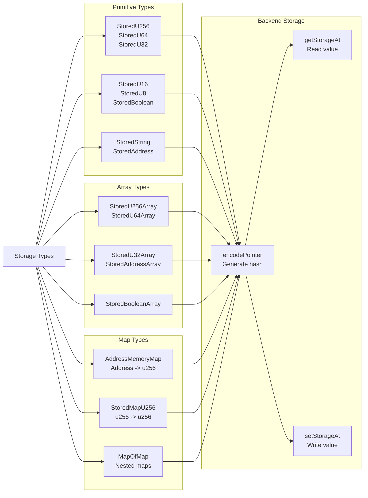
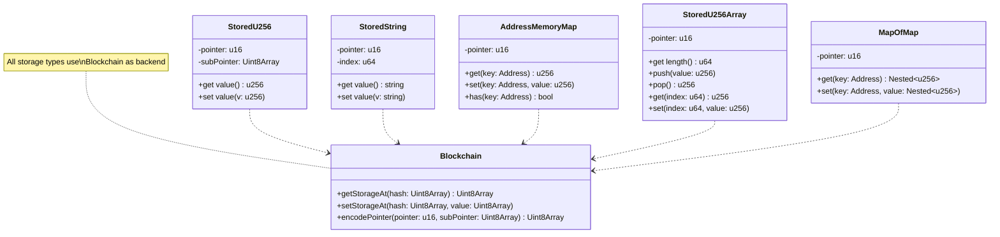
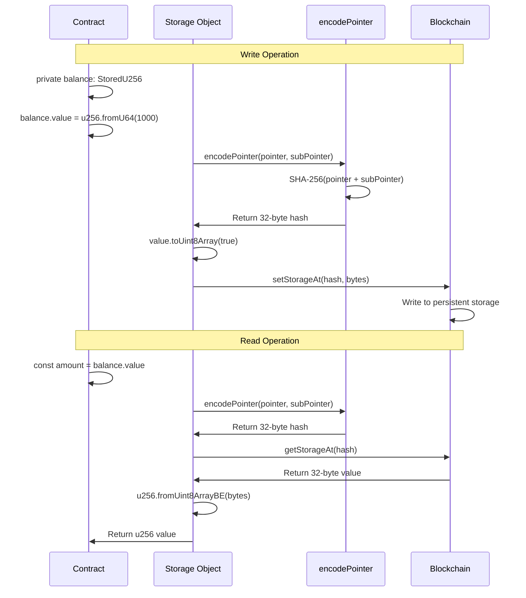
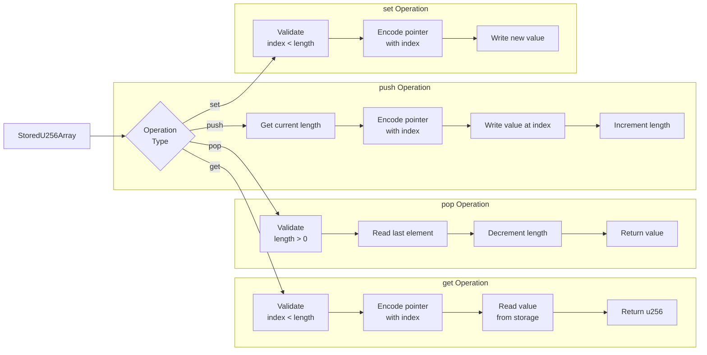
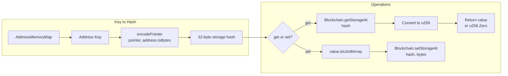
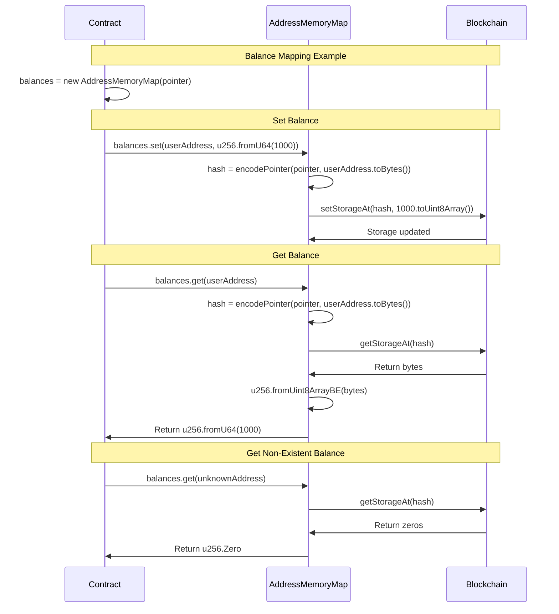
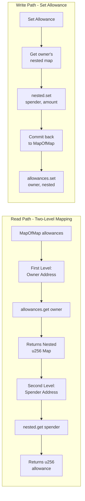
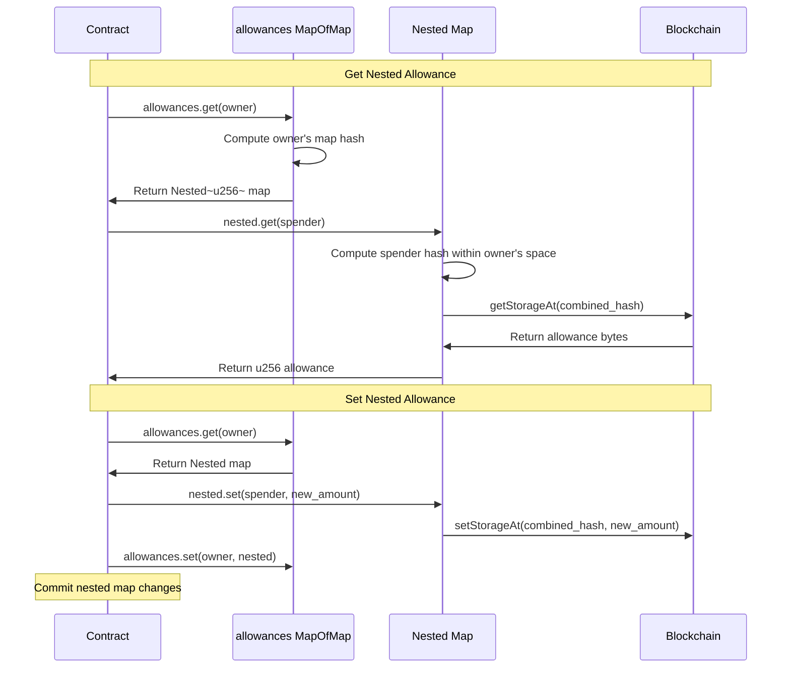

# Storage API Reference

Storage classes provide persistent state management for OPNet smart contracts.

## Import

```typescript
import {
    StoredU256,
    StoredU64,
    StoredU32,
    StoredU16,
    StoredU8,
    StoredBoolean,
    StoredString,
    StoredAddress,
    StoredU256Array,
    StoredAddressArray,
    AddressMemoryMap,
    StoredMapU256,
    Blockchain,
    EMPTY_POINTER,
} from '@btc-vision/btc-runtime/runtime';
```

## CRITICAL: Map Implementation Warning

> **DO NOT USE AssemblyScript's Built-in Map**
>
> When creating custom map implementations or extending map functionality, you **MUST** use the Map class from `@btc-vision/btc-runtime/runtime`, NOT the built-in AssemblyScript Map.
>
> **Why the AssemblyScript Map is broken for blockchain:**
> - NOT optimized for blockchain storage patterns
> - Does NOT handle Uint8Array buffers as keys correctly
> - Does NOT work properly with Address key comparisons
> - Will cause silent data corruption or key collisions
>
> **CORRECT:**
> ```typescript
> import { Map } from '@btc-vision/btc-runtime/runtime';
>
> export class MyCustomMap<V> extends Map<Address, V> {
>     // Your implementation
> }
> ```
>
> **WRONG:**
> ```typescript
> // DO NOT DO THIS - will break!
> const map = new Map<Uint8Array, u256>();  // AssemblyScript Map
> ```
>
> The btc-runtime Map is specifically designed to:
> - Handle Address and Uint8Array key comparisons correctly
> - Optimize for blockchain storage access patterns
> - Support proper serialization for persistent storage
> - Prevent key collisions with custom equality logic

## Storage Type Hierarchy

The following diagram shows the complete hierarchy of storage types available in the runtime:





## Primitive Storage

### StoredU256

Stores a 256-bit unsigned integer.

```typescript
class StoredU256 {
    constructor(pointer: u16, subPointer: Uint8Array)
    public get value(): u256
    public set value(v: u256)
}
```

```typescript
private balancePointer: u16 = Blockchain.nextPointer;
private _balance: StoredU256 = new StoredU256(this.balancePointer, EMPTY_POINTER);

// Usage
this._balance.value = u256.fromU64(1000);
const balance = this._balance.value;
```

The following sequence diagram shows how storage read and write operations work:



### StoredU64

Stores a 64-bit unsigned integer.

```typescript
class StoredU64 {
    constructor(pointer: u16, defaultValue: u64)
    public get value(): u64
    public set value(v: u64)
}
```

```typescript
private timestampPointer: u16 = Blockchain.nextPointer;
private _timestamp: StoredU64 = new StoredU64(this.timestampPointer, 0);
```

### StoredU32 / StoredU16 / StoredU8

Similar pattern for smaller integers:

```typescript
private countPointer: u16 = Blockchain.nextPointer;
private _count: StoredU32 = new StoredU32(this.countPointer, 0);

private flagPointer: u16 = Blockchain.nextPointer;
private _flag: StoredU8 = new StoredU8(this.flagPointer, 0);
```

### StoredBoolean

Stores a boolean value.

```typescript
class StoredBoolean {
    constructor(pointer: u16, defaultValue: bool)
    public get value(): bool
    public set value(v: bool)
}
```

```typescript
private pausedPointer: u16 = Blockchain.nextPointer;
private _paused: StoredBoolean = new StoredBoolean(this.pausedPointer, false);

// Usage
this._paused.value = true;
if (this._paused.value) {
    throw new Revert('Contract is paused');
}
```

### StoredString

Stores a string value.

```typescript
class StoredString {
    constructor(pointer: u16, index: u64 = 0)
    public get value(): string
    public set value(v: string)
}
```

```typescript
private namePointer: u16 = Blockchain.nextPointer;
private _name: StoredString = new StoredString(this.namePointer, 0);

// Usage
this._name.value = 'My Token';
const name = this._name.value;
```

### StoredAddress

Stores an Address value.

```typescript
class StoredAddress {
    constructor(pointer: u16, defaultValue: Address)
    public get value(): Address
    public set value(v: Address)
}
```

```typescript
private ownerPointer: u16 = Blockchain.nextPointer;
private _owner: StoredAddress = new StoredAddress(this.ownerPointer, Address.zero());

// Usage
this._owner.value = Blockchain.tx.origin;
const owner = this._owner.value;
```

## Array Storage

### StoredU256Array

Dynamic array of u256 values.

```typescript
class StoredU256Array {
    constructor(pointer: u16)
    public get length(): u64
    public push(value: u256): void
    public pop(): u256
    public get(index: u64): u256
    public set(index: u64, value: u256): void
}
```

```typescript
private tokenIdsPointer: u16 = Blockchain.nextPointer;
private tokenIds: StoredU256Array = new StoredU256Array(this.tokenIdsPointer);

// Usage
this.tokenIds.push(u256.fromU64(1));
this.tokenIds.push(u256.fromU64(2));
const first = this.tokenIds.get(0);  // u256.fromU64(1)
const len = this.tokenIds.length;    // 2
```

The following diagram shows the array operation flow:



### StoredAddressArray

Dynamic array of Address values.

```typescript
class StoredAddressArray {
    constructor(pointer: u16)
    public get length(): u64
    public push(value: Address): void
    public pop(): Address
    public get(index: u64): Address
    public set(index: u64, value: Address): void
}
```

```typescript
private oraclesPointer: u16 = Blockchain.nextPointer;
private oracles: StoredAddressArray = new StoredAddressArray(this.oraclesPointer);

// Add oracle
this.oracles.push(oracleAddress);

// Iterate
for (let i: u64 = 0; i < this.oracles.length; i++) {
    const oracle = this.oracles.get(i);
    // Process oracle
}
```

### Other Array Types

- `StoredU64Array`
- `StoredU32Array`
- `StoredU16Array`
- `StoredU8Array`
- `StoredBooleanArray`

## Map Storage

### AddressMemoryMap

Maps addresses to u256 values. Always returns u256.Zero for unset addresses.

```typescript
class AddressMemoryMap {
    constructor(pointer: u16)
    public get(key: Address): u256
    public set(key: Address, value: u256): void
    public has(key: Address): bool
}
```

The following diagram shows how map keys are converted to storage hashes:



#### Usage Example

```typescript
// mapping(address => uint256)
private balancesPointer: u16 = Blockchain.nextPointer;
private balances: AddressMemoryMap;

constructor() {
    super();
    this.balances = new AddressMemoryMap(this.balancesPointer);
}

// Usage
const balance = this.balances.get(userAddress);  // Returns u256
this.balances.set(userAddress, u256.fromU64(1000));
```

The following sequence diagram shows the complete balance mapping flow:



### StoredMapU256

Maps u256 keys to u256 values.

```typescript
class StoredMapU256 {
    constructor(pointer: u16)
    public get(key: u256): u256
    public set(key: u256, value: u256): void
    public has(key: u256): bool
}
```

```typescript
private dataPointer: u16 = Blockchain.nextPointer;
private data: StoredMapU256 = new StoredMapU256(this.dataPointer);

// Usage
const key = u256.fromU64(123);
this.data.set(key, u256.fromU64(456));
const value = this.data.get(key);
```

### Nested Maps (MapOfMap)

For allowances pattern (owner => spender => amount):

```typescript
import { MapOfMap, Nested } from '@btc-vision/btc-runtime/runtime';

// mapping(address => mapping(address => uint256))
private allowancesPointer: u16 = Blockchain.nextPointer;
private allowances: MapOfMap<u256>;

constructor() {
    super();
    this.allowances = new MapOfMap<u256>(this.allowancesPointer);
}

// Get nested value - two-step process
protected getAllowance(owner: Address, spender: Address): u256 {
    const ownerMap = this.allowances.get(owner);  // Returns Nested<u256>
    return ownerMap.get(spender);                  // Returns u256
}

// Set nested value - get, modify, commit back
protected setAllowance(owner: Address, spender: Address, amount: u256): void {
    const ownerMap = this.allowances.get(owner);  // Get the nested map
    ownerMap.set(spender, amount);                 // Modify it
    this.allowances.set(owner, ownerMap);          // Commit back
}
```

> **Important:** `MapOfMap.get(key)` returns a `Nested<T>` object, not the final value. You must call `.get()` on the nested object to retrieve the actual value.

The following diagram shows the two-level nested storage pattern:



The following sequence diagram shows the nested allowance operations:



## Storage Patterns

### Lazy Initialization

```typescript
private _data: StoredU256 | null = null;
private dataPointer: u16 = Blockchain.nextPointer;

private get data(): StoredU256 {
    if (!this._data) {
        this._data = new StoredU256(this.dataPointer, EMPTY_POINTER);
    }
    return this._data;
}
```

### Computed Storage Keys

```typescript
import { encodePointer } from '@btc-vision/btc-runtime/runtime';

private storagePointer: u16 = Blockchain.nextPointer;

private getKey(addr: Address, slot: u256): u256 {
    const combined = new Uint8Array(64);
    combined.set(addr.toBytes(), 0);
    combined.set(slot.toUint8Array(), 32);
    return u256.fromBytes(Blockchain.sha256(combined));
}

public getValue(addr: Address, slot: u256): u256 {
    const key = this.getKey(addr, slot);
    const pointerHash = encodePointer(this.storagePointer, key.toUint8Array(true));
    const stored = Blockchain.getStorageAt(pointerHash);
    return u256.fromUint8ArrayBE(stored);
}
```

### Counter Pattern

```typescript
private counterPointer: u16 = Blockchain.nextPointer;
private _counter: StoredU256 = new StoredU256(this.counterPointer, EMPTY_POINTER);

public getNextId(): u256 {
    const current = this._counter.value;
    this._counter.value = SafeMath.add(current, u256.One);
    return current;
}
```

## Low-Level Storage

Direct storage access via Blockchain:

```typescript
import { encodePointer } from '@btc-vision/btc-runtime/runtime';

// Generate storage key hash
public encodePointer(pointer: u16, subPointer: Uint8Array): Uint8Array

// Write to storage
public setStorageAt(pointerHash: Uint8Array, value: Uint8Array): void

// Read from storage
public getStorageAt(pointerHash: Uint8Array): Uint8Array

// Check existence
public hasStorageAt(pointerHash: Uint8Array): bool
```

```typescript
// Direct storage example
const pointer: u16 = Blockchain.nextPointer;
const subPointer = u256.fromU64(1).toUint8Array(true);

// Create storage key
const pointerHash = encodePointer(pointer, subPointer);

// Write value
Blockchain.setStorageAt(pointerHash, u256.fromU64(100).toUint8Array(true));

// Read value
const stored = Blockchain.getStorageAt(pointerHash);
const value = u256.fromUint8ArrayBE(stored);
```

## Storage Costs

| Operation | Approximate Gas |
|-----------|----------------|
| Write new slot | ~20,000 |
| Update existing | ~5,000 |
| Read (cold) | ~2,100 |
| Read (warm) | ~100 |

## Best Practices

### 1. Declare Pointers First

```typescript
class MyContract extends OP_NET {
    // Declare all pointers before any stored values
    private ptr1: u16 = Blockchain.nextPointer;
    private ptr2: u16 = Blockchain.nextPointer;
    private ptr3: u16 = Blockchain.nextPointer;

    // Then declare stored values
    private _value1: StoredU256;
    private _value2: StoredBoolean;

    constructor() {
        super();
        this._value1 = new StoredU256(this.ptr1, EMPTY_POINTER);
        this._value2 = new StoredBoolean(this.ptr2, false);
    }
}
```

### 2. Use Appropriate Types

```typescript
// Good - use smallest type that fits
private _count: StoredU32;  // If count < 4 billion

// Less efficient
private _count: StoredU256;  // Uses more storage
```

### 3. Batch Updates

```typescript
// Multiple related updates in one call
function updateBoth(a: u256, b: u256): void {
    this._valueA.value = a;
    this._valueB.value = b;
}
```

## Solidity Comparison

| Solidity | OPNet Storage |
|----------|---------------|
| `uint256 public value` | `StoredU256` |
| `mapping(address => uint256)` | `AddressMemoryMap` |
| `mapping(address => mapping(address => uint256))` | `MapOfMap<u256>` |
| `uint256[] public array` | `StoredU256Array` |
| `bool public paused` | `StoredBoolean` |
| `string public name` | `StoredString` |
| `address public owner` | `StoredAddress` |

---

**Navigation:**
- Previous: [SafeMath API](./safe-math.md)
- Next: [Events API](./events.md)
