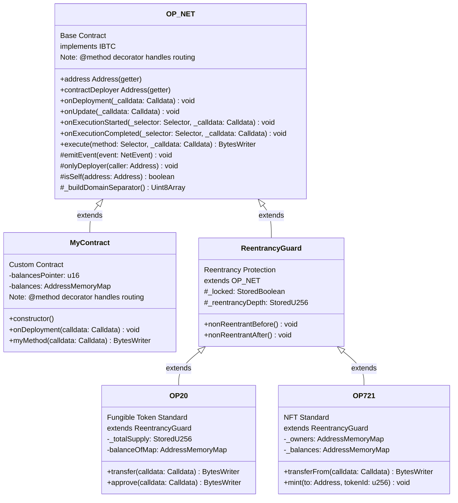
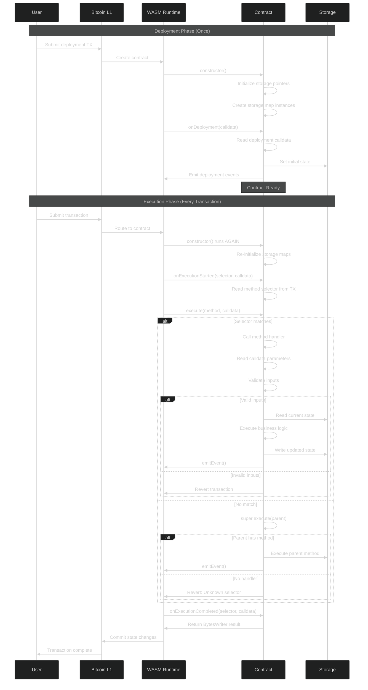

# OP_NET Base Contract

`OP_NET` is the base class for all OPNet smart contracts. It implements the `IBTC` interface and provides the foundational structure for contract lifecycle, method dispatching, event emission, and access control.

## Overview

```typescript
import { OP_NET, Calldata, BytesWriter, ABIDataTypes } from '@btc-vision/btc-runtime/runtime';

@final
export class MyContract extends OP_NET {
    public constructor() {
        super();
    }

    public override onDeployment(calldata: Calldata): void {
        // One-time initialization
    }

    @method({ name: 'param', type: ABIDataTypes.UINT256 })
    @returns({ name: 'result', type: ABIDataTypes.UINT256 })
    public myMethod(calldata: Calldata): BytesWriter {
        // Method implementation - routing is AUTOMATIC via @method decorator
        return new BytesWriter(0);
    }
}
```

**Note:** Method routing is handled AUTOMATICALLY by the runtime via `@method` decorators. You do NOT need to override the `execute` method - the decorator system handles selector generation and call routing.

**Solidity Comparison:**

```solidity
// Solidity: Automatic method routing via ABI
contract MyContract {
    constructor() {
        // Runs once at deployment
    }

    function myMethod() public returns (bytes memory) {
        // Method implementation
    }
}

// OPNet: AUTOMATIC method routing via @method decorators
// - Constructor runs on EVERY call
// - Routing is automatic via decorator system
// - One-time init in onDeployment()
```

## Contract Lifecycle

### Inheritance Hierarchy

OPNet contracts follow a clear inheritance pattern:



### Deployment and Execution Flow

The following diagram shows how contracts are deployed and executed on OPNet:



### 1. Construction

The constructor runs on **every** contract interaction:

```typescript
public constructor() {
    super();  // Always call parent constructor

    // Initialize storage maps (these run every time)
    this.balances = new AddressMemoryMap(this.balancesPointer);

    // DON'T do one-time initialization here!
}
```

**Key Difference from Solidity:**

| Solidity | OPNet |
|----------|-------|
| Constructor runs once at deployment | Constructor runs every call |
| Initialize state in constructor | Initialize state in `onDeployment` |

### 2. Deployment (onDeployment)

Runs exactly **once** when the contract is first deployed:

```typescript
public override onDeployment(calldata: Calldata): void {
    // Read deployment parameters
    const initialSupply = calldata.readU256();
    const tokenName = calldata.readString();

    // Set initial state
    this._totalSupply.value = initialSupply;
    this._name.value = tokenName;

    // Mint initial tokens
    this._mint(Blockchain.tx.origin, initialSupply);
}
```

**Solidity Comparison:**

```solidity
// Solidity: One-time init in constructor
constructor(uint256 initialSupply, string memory tokenName) {
    _totalSupply = initialSupply;
    _name = tokenName;
    _mint(msg.sender, initialSupply);
}

// OPNet: One-time init in onDeployment()
// Constructor runs every call, onDeployment runs once
```

### 2b. Update (onUpdate)

Runs when the contract's bytecode is updated via `updateContractFromExisting`:

```typescript
public override onUpdate(calldata: Calldata): void {
    super.onUpdate(calldata); // Notify plugins

    // Read migration parameters
    const fromVersion = calldata.readU64();

    // Perform migration based on version
    if (fromVersion === 1) {
        // Initialize new storage added in this version
        this._newFeature.value = u256.fromU64(100);
    }
}
```

> **Note:** This hook is called on the **new** bytecode, not the old one. See [Contract Upgrades](../advanced/contract-upgrades.md#the-onupdate-lifecycle-hook) for details.

### 3. Method Execution

Methods are automatically routed via `@method` decorators:

```typescript
@method(
    { name: 'to', type: ABIDataTypes.ADDRESS },
    { name: 'amount', type: ABIDataTypes.UINT256 },
)
@returns({ name: 'success', type: ABIDataTypes.BOOL })
public transfer(calldata: Calldata): BytesWriter {
    const to = calldata.readAddress();
    const amount = calldata.readU256();
    // ... implementation
    return new BytesWriter(1);
}

@method({ name: 'spender', type: ABIDataTypes.ADDRESS }, { name: 'amount', type: ABIDataTypes.UINT256 })
public approve(calldata: Calldata): BytesWriter {
    // ... implementation
    return new BytesWriter(0);
}

@method({ name: 'account', type: ABIDataTypes.ADDRESS })
@returns({ name: 'balance', type: ABIDataTypes.UINT256 })
public balanceOf(calldata: Calldata): BytesWriter {
    const account = calldata.readAddress();
    // ... implementation
    const writer = new BytesWriter(32);
    writer.writeU256(balance);
    return writer;
}
```

**Note:** The runtime automatically generates selectors and routes calls based on `@method` decorators. You do NOT need to override the `execute` method.

### Transaction Sequence

The following sequence diagram shows the complete flow of a transaction through the system:


## Method Selectors

Methods are identified by selectors (4-byte identifiers). The `@method` decorator automatically generates and registers selectors:

```typescript
// Selectors are generated AUTOMATICALLY from @method decorators
@method(
    { name: 'to', type: ABIDataTypes.ADDRESS },
    { name: 'amount', type: ABIDataTypes.UINT256 },
)
public transfer(calldata: Calldata): BytesWriter {
    // Runtime automatically routes calls to this method
    return new BytesWriter(0);
}
```

### Solidity Comparison

```solidity
// Solidity: Automatic selector generation
function transfer(address to, uint256 amount) public { }
// Selector: keccak256("transfer(address,uint256)")[:4]

// OPNet: ALSO automatic via @method decorator
// @method({ name: 'to', type: ABIDataTypes.ADDRESS }, ...)
// public transfer(calldata: Calldata): BytesWriter { }
```

**Note:** Both Solidity and OPNet handle selector generation automatically. In OPNet, use `@method` decorators and the runtime handles routing.

### Built-in Methods

The base `OP_NET` class provides a built-in `deployer()` method that returns the contract deployer address:

```typescript
// Built-in method handled by OP_NET.execute()
// Selector: encodeSelector('deployer()')
// Returns: Address (the contract deployer)
```

This method is automatically available on all contracts that extend `OP_NET`. When called, it returns the `contractDeployer` address.

## Access Control

### onlyDeployer

Restrict function access to the contract deployer:

```typescript
@method({ name: 'parameter', type: ABIDataTypes.UINT256 })
public adminFunction(calldata: Calldata): BytesWriter {
    this.onlyDeployer(Blockchain.tx.sender);

    // Only deployer reaches here
    return new BytesWriter(0);
}
```

**Solidity Comparison:**

```solidity
// Solidity: Using OpenZeppelin Ownable
import "@openzeppelin/contracts/access/Ownable.sol";

contract MyContract is Ownable {
    function adminFunction(uint256 parameter) public onlyOwner {
        // Only owner reaches here
    }
}

// OPNet: Built-in onlyDeployer check
// this.onlyDeployer(Blockchain.tx.sender);
```

### Custom Access Control

```typescript
private adminPointer: u16 = Blockchain.nextPointer;
private admin: StoredAddress = new StoredAddress(this.adminPointer, Address.zero());

private onlyAdmin(): void {
    if (!Blockchain.tx.sender.equals(this.admin.value)) {
        throw new Revert('Caller is not admin');
    }
}

@method({ name: 'value', type: ABIDataTypes.UINT256 })
@returns({ name: 'success', type: ABIDataTypes.BOOL })
public setParameter(calldata: Calldata): BytesWriter {
    this.onlyAdmin();
    // ...
}
```

**Solidity Comparison:**

```solidity
// Solidity: Custom access control
address private admin;

modifier onlyAdmin() {
    require(msg.sender == admin, "Caller is not admin");
    _;
}

function setParameter(uint256 value) public onlyAdmin {
    // ...
}

// OPNet: Similar pattern but with explicit method call
// this.onlyAdmin(); at start of method
```

## Event Emission

Emit events to notify off-chain systems:

```typescript
import { NetEvent, TransferEvent } from '@btc-vision/btc-runtime/runtime';

// Using built-in events
this.emitEvent(new TransferEvent(from, to, amount));

// Using custom events
this.emitEvent(new MyCustomEvent(data1, data2));
```

**Solidity Comparison:**

```solidity
// Solidity: Emit keyword
event Transfer(address indexed from, address indexed to, uint256 value);

emit Transfer(from, to, amount);

// OPNet: emitEvent method
this.emitEvent(new TransferEvent(from, to, amount));
```

## Protected Helper Methods

The `OP_NET` base class provides several protected helper methods:

### isSelf

Checks if a given address is the contract's own address:

```typescript
protected isSelf(address: Address): boolean {
    return this.address === address;
}

// Usage example
if (this.isSelf(targetAddress)) {
    // Handle self-call case
}
```

### _buildDomainSeparator

A method stub for building EIP-712 style domain separators. Must be overridden in derived classes that need signature verification:

```typescript
protected _buildDomainSeparator(): Uint8Array {
    // Override in derived class to provide domain separator
    throw new Error('Method not implemented.');
}
```

## Storage Patterns

### Pointer Allocation

```typescript
export class MyContract extends OP_NET {
    // Allocate storage pointers at class level
    private counterPointer: u16 = Blockchain.nextPointer;
    private ownerPointer: u16 = Blockchain.nextPointer;
    private dataPointer: u16 = Blockchain.nextPointer;

    // Create storage instances
    private counter: StoredU256 = new StoredU256(this.counterPointer, EMPTY_POINTER);
    private owner: StoredAddress = new StoredAddress(this.ownerPointer, Address.zero());
}
```

**Solidity Comparison:**

```solidity
// Solidity: Automatic storage slot allocation
contract MyContract {
    uint256 private counter;      // slot 0
    address private owner;        // slot 1
    bytes private data;           // slot 2
}

// OPNet: Explicit pointer allocation
// private counterPointer: u16 = Blockchain.nextPointer;
// private counter: StoredU256 = new StoredU256(this.counterPointer, EMPTY_POINTER);
```

### Storage Maps

```typescript
export class MyContract extends OP_NET {
    private balancesPointer: u16 = Blockchain.nextPointer;
    private balances: AddressMemoryMap;

    public constructor() {
        super();
        // Initialize maps in constructor (runs every time, but that's OK)
        this.balances = new AddressMemoryMap(this.balancesPointer);
    }
}
```

**Solidity Comparison:**

```solidity
// Solidity: mapping declaration
mapping(address => uint256) private balances;

// OPNet: AddressMemoryMap with pointer
// private balancesPointer: u16 = Blockchain.nextPointer;
// this.balances = new AddressMemoryMap(this.balancesPointer);
```

## Complete Example

```typescript
import { u256 } from '@btc-vision/as-bignum/assembly';
import {
    OP_NET,
    Blockchain,
    Address,
    Calldata,
    BytesWriter,
    StoredU256,
    AddressMemoryMap,
    SafeMath,
    Revert,
    ABIDataTypes,
} from '@btc-vision/btc-runtime/runtime';

@final
export class SimpleToken extends OP_NET {
    // Storage pointers
    private totalSupplyPointer: u16 = Blockchain.nextPointer;
    private balancesPointer: u16 = Blockchain.nextPointer;

    // Storage
    private _totalSupply: StoredU256 = new StoredU256(this.totalSupplyPointer, EMPTY_POINTER);
    private balances: AddressMemoryMap;

    public constructor() {
        super();
        this.balances = new AddressMemoryMap(this.balancesPointer);
    }

    public override onDeployment(calldata: Calldata): void {
        const initialSupply = calldata.readU256();

        this._totalSupply.value = initialSupply;
        this.balances.set(Blockchain.tx.origin, initialSupply);
    }

    @method(
        { name: 'to', type: ABIDataTypes.ADDRESS },
        { name: 'amount', type: ABIDataTypes.UINT256 },
    )
    @returns({ name: 'success', type: ABIDataTypes.BOOL })
    @emit('Transfer')
    public transfer(calldata: Calldata): BytesWriter {
        const to = calldata.readAddress();
        const amount = calldata.readU256();
        const from = Blockchain.tx.sender;

        // Validation
        if (to.equals(Address.zero())) {
            throw new Revert('Cannot transfer to zero address');
        }

        // Get balances
        const fromBalance = this.balances.get(from);
        if (fromBalance < amount) {
            throw new Revert('Insufficient balance');
        }

        // Update balances
        this.balances.set(from, SafeMath.sub(fromBalance, amount));
        this.balances.set(to, SafeMath.add(this.balances.get(to), amount));

        return new BytesWriter(0);
    }

    @method({ name: 'account', type: ABIDataTypes.ADDRESS })
    @returns({ name: 'balance', type: ABIDataTypes.UINT256 })
    public balanceOf(calldata: Calldata): BytesWriter {
        const address = calldata.readAddress();
        const balance = this.balances.get(address);

        const writer = new BytesWriter(32);
        writer.writeU256(balance);
        return writer;
    }

    @method()
    @returns({ name: 'supply', type: ABIDataTypes.UINT256 })
    public totalSupply(_calldata: Calldata): BytesWriter {
        const writer = new BytesWriter(32);
        writer.writeU256(this._totalSupply.value);
        return writer;
    }
}
```

**Note:** Method routing is handled AUTOMATICALLY via `@method` decorators. No `execute` override is needed.

## Inheritance

### Extending OP_NET

```typescript
// Direct extension
export class MyContract extends OP_NET { }

// Extend with reentrancy protection
export class MySecureContract extends ReentrancyGuard { }

// Extend with additional features (OP20/OP721 extend ReentrancyGuard which extends OP_NET)
export class MyToken extends OP20 { }  // OP20 extends ReentrancyGuard extends OP_NET
export class MyNFT extends OP721 { }   // OP721 extends ReentrancyGuard extends OP_NET
```

### Adding Functionality

```typescript
// Create a base class with shared functionality
export abstract class Pausable extends OP_NET {
    private pausedPointer: u16 = Blockchain.nextPointer;
    protected _paused: StoredBoolean = new StoredBoolean(this.pausedPointer, false);

    protected whenNotPaused(): void {
        if (this._paused.value) {
            throw new Revert('Contract is paused');
        }
    }
}

// Use in your contract
export class MyToken extends Pausable {
    @method(
        { name: 'to', type: ABIDataTypes.ADDRESS },
        { name: 'amount', type: ABIDataTypes.UINT256 },
    )
    @returns({ name: 'success', type: ABIDataTypes.BOOL })
    @emit('Transfer')
    public transfer(calldata: Calldata): BytesWriter {
        this.whenNotPaused();
        // ...
    }
}
```

**Solidity Comparison:**

```solidity
// Solidity: OpenZeppelin Pausable
import "@openzeppelin/contracts/security/Pausable.sol";

contract MyToken is ERC20, Pausable {
    function transfer(address to, uint256 amount) public whenNotPaused {
        // ...
    }
}

// OPNet: Custom Pausable base class
// export abstract class Pausable extends OP_NET { ... }
// this.whenNotPaused(); at start of method
```

## Best Practices

### 1. Always Use @final

```typescript
@final  // Prevents further inheritance, enables optimizations
export class MyContract extends OP_NET { }
```

### 2. Call super() in Constructor

```typescript
public constructor() {
    super();  // Always first!
    // Then your initialization...
}
```

### 3. Use @method Decorators for Public Methods

```typescript
// CORRECT: Use @method decorator for automatic routing
@method({ name: 'to', type: ABIDataTypes.ADDRESS }, { name: 'amount', type: ABIDataTypes.UINT256 })
@returns({ name: 'success', type: ABIDataTypes.BOOL })
@emit('Transfer')
public transfer(calldata: Calldata): BytesWriter {
    // Implementation...
}

// DO NOT manually override execute() - routing is automatic
```

### 4. Document Your Methods

```typescript
/**
 * Transfers tokens from sender to recipient.
 * @param calldata Contains: to (Address), amount (u256)
 * @returns Empty BytesWriter on success
 * @throws Revert if insufficient balance or zero address
 */
private transfer(calldata: Calldata): BytesWriter {
    // ...
}
```

---

**Navigation:**
- Previous: [Security](../core-concepts/security.md)
- Next: [OP20 Token](./op20-token.md)
