# OP_NET Base Contract

`OP_NET` is the abstract base class for all OPNet smart contracts. It provides the foundational structure for contract lifecycle, method dispatching, event emission, and access control.

## Overview

```typescript
import { OP_NET, Calldata, BytesWriter, Selector, ABIDataTypes, encodeSelector } from '@btc-vision/btc-runtime/runtime';

// Define method selectors (sha256 first 4 bytes of method signature)
const MY_METHOD_SELECTOR: u32 = encodeSelector('myMethod');

@final
export class MyContract extends OP_NET {
    public constructor() {
        super();
    }

    public override onDeployment(calldata: Calldata): void {
        // One-time initialization
    }

    public override execute(method: Selector, calldata: Calldata): BytesWriter {
        switch (method) {
            case MY_METHOD_SELECTOR:
                return this.myMethod(calldata);
            default:
                return super.execute(method, calldata);
        }
    }

    private myMethod(calldata: Calldata): BytesWriter {
        // Method implementation
        return new BytesWriter(0);
    }
}
```

## Contract Lifecycle

```mermaid
flowchart TD
    subgraph Bitcoin["Bitcoin L1"]
        A[👤 User submits deployment TX] --> B[Blockchain creates contract]
    end

    subgraph WASM1["WASM Runtime - Deployment Phase (Once)"]
        B --> C[Contract.constructor runs]
        C --> D[Initialize storage pointers]
        D --> E[🗺Create storage map instances]
        E --> F[onDeployment called]
        F --> G[Read deployment calldata]
        G --> H[Set initial state in Storage]
        H --> I[Emit deployment events]
        I --> J[Contract Ready]
    end

    subgraph Execution["Every Transaction - Runs Every Call"]
        J --> K[👤 User submits transaction]

        subgraph WASM2["WASM Runtime - Execution"]
            K --> L[Blockchain routes to contract]
            L --> M[Contract.constructor runs AGAIN]
            M --> N[🗺Re-initialize storage maps]
            N --> O[onExecutionStarted hook]
            O --> P[Read method selector from TX]
            P --> Q[execute method called]
            Q --> R{Selector matches?}

            R -->|Match| S[📞 Call method handler]
            R -->|No match| T[⬆super.execute parent]

            S --> U[Read calldata parameters]
            U --> V[✔Validate inputs]
            V --> W{Valid?}
            W -->|No| X[Revert transaction]
            W -->|Yes| Y[📚 Read from Storage]
            Y --> Z[Execute business logic]
            Z --> AA[Write to Storage]
            AA --> AB[emitEvent]

            T --> AC{Parent has method?}
            AC -->|Yes| AD[Execute parent method]
            AC -->|No| AE[Revert: Unknown selector]

            AD --> AB
            AB --> AF[🏁 onExecutionCompleted hook]
            AF --> AG[Return BytesWriter result]
            AG --> AH[Blockchain commits state]
            AH --> AI[Transaction complete]
        end
    end
```

```mermaid
classDiagram
    class OP_NET {
        <<abstract>>
        Base Contract
        +constructor()
        +onDeployment(calldata: Calldata) void
        +execute(method: Selector, calldata: Calldata) BytesWriter
        +onExecutionStarted(method: Selector) void
        +onExecutionCompleted(method: Selector) void
        +emitEvent(event: NetEvent) void
        +onlyDeployer(address: Address) void
        #isDeployer(address: Address) bool
    }

    class MyContract {
        Custom Contract
        -balancesPointer: u16
        -balances: AddressMemoryMap
        +constructor()
        +onDeployment(calldata: Calldata) void
        +execute(method: Selector, calldata: Calldata) BytesWriter
        -myMethod(calldata: Calldata) BytesWriter
    }

    class OP20 {
        🪙 Fungible Token Standard
        -_totalSupply: StoredU256
        -balanceOfMap: AddressMemoryMap
        +transfer(calldata: Calldata) BytesWriter
        +approve(calldata: Calldata) BytesWriter
    }

    class OP721 {
        🖼NFT Standard
        -_owners: AddressMemoryMap
        -_balances: AddressMemoryMap
        +transferFrom(calldata: Calldata) BytesWriter
        +mint(to: Address, tokenId: u256) void
    }

    OP_NET <|-- MyContract : extends
    OP_NET <|-- OP20 : extends
    OP_NET <|-- OP721 : extends
```

```mermaid
sequenceDiagram
    participant User as 👤 User Wallet
    participant Blockchain as Bitcoin L1
    participant TxPool as 📬 Transaction Pool
    participant VM as WASM Runtime
    participant Contract as OP_NET Contract
    participant Storage as Storage Pointers
    participant EventLog as Event Log

    User->>TxPool: Submit signed transaction
    Note over User,TxPool: Contains: contract address,<br/>method selector, calldata

    TxPool->>Blockchain: Transaction confirmed
    Blockchain->>VM: Route to contract address

    VM->>Contract: Instantiate contract instance
    activate Contract

    Contract->>Contract: constructor()
    Note over Contract: Runs EVERY call<br/>Initialize storage maps

    Contract->>Storage: Allocate storage pointers
    Storage-->>Contract: Pointer addresses

    VM->>Contract: onExecutionStarted(selector)
    Note over Contract: Pre-execution hook<br/>Can add logging/validation

    VM->>Contract: execute(selector, calldata)

    Contract->>Contract: switch(selector)
    Note over Contract: Method routing logic

    alt Known Method Selector
        Contract->>Contract: 📞 methodHandler(calldata)

        Contract->>Contract: calldata.readAddress()
        Contract->>Contract: calldata.readU256()
        Note over Contract: Parse parameters

        Contract->>Storage: 📚 Read current state
        Storage-->>Contract: Current values

        Contract->>Contract: Business logic
        Note over Contract: SafeMath operations,<br/>validations, state changes

        Contract->>Storage: Write updated state
        Note over Storage: Persistent storage<br/>committed on success

        Contract->>EventLog: emitEvent(TransferEvent)
        Note over EventLog: Events for indexing<br/>off-chain systems

    else Unknown Method
        Contract->>Contract: ⬆super.execute(selector, calldata)

        alt Parent Has Method
            Note over Contract: OP_NET parent<br/>or OP20/OP721 parent
            Contract->>Storage: Parent method logic
            Contract->>EventLog: Parent method events
        else No Handler
            Contract->>VM: throw Revert('Unknown method')
            VM->>User: Transaction reverted
            Note over User: No state changes,<br/>gas still consumed
        end
    end

    Contract->>Contract: 🏁 onExecutionCompleted(selector)
    Note over Contract: Post-execution hook<br/>Cleanup, final checks

    Contract->>VM: Return BytesWriter
    deactivate Contract

    VM->>Blockchain: Commit state changes
    Blockchain->>User: Transaction receipt
    Note over User: Success with events<br/>or revert with error
```







### 1. Construction

The constructor runs on **every** contract interaction:

```typescript
public constructor() {
    super();  // Always call parent constructor

    // Initialize storage maps (these run every time)
    this.balances = new AddressMemoryMap(this.balancesPointer);

    // DON'T do one-time initialization here!
}
```

**Key Difference from Solidity:**

| Solidity | OPNet |
|----------|-------|
| Constructor runs once at deployment | Constructor runs every call |
| Initialize state in constructor | Initialize state in `onDeployment` |

### 2. Deployment (onDeployment)

Runs exactly **once** when the contract is first deployed:

```typescript
public override onDeployment(calldata: Calldata): void {
    // Read deployment parameters
    const initialSupply = calldata.readU256();
    const tokenName = calldata.readString();

    // Set initial state
    this._totalSupply.value = initialSupply;
    this._name.value = tokenName;

    // Mint initial tokens
    this._mint(Blockchain.tx.origin, initialSupply);
}
```

### 3. Method Execution (execute)

Routes incoming calls to the appropriate method:

```typescript
// Define method selectors
const TRANSFER_SELECTOR: u32 = encodeSelector('transfer');
const APPROVE_SELECTOR: u32 = encodeSelector('approve');
const BALANCE_OF_SELECTOR: u32 = encodeSelector('balanceOf');

public override execute(method: Selector, calldata: Calldata): BytesWriter {
    switch (method) {
        case TRANSFER_SELECTOR:
            return this.transfer(calldata);
        case APPROVE_SELECTOR:
            return this.approve(calldata);
        case BALANCE_OF_SELECTOR:
            return this.balanceOf(calldata);
        default:
            // Let parent handle built-in methods or throw
            return super.execute(method, calldata);
    }
}
```

## Method Selectors

Methods are identified by selectors (4-byte identifiers):

```typescript
import { Selector, encodeSelector } from '@btc-vision/btc-runtime/runtime';

// Define selector constants (sha256 first 4 bytes of method signature)
const TRANSFER_SELECTOR: u32 = encodeSelector('transfer');

// Compare in execute()
if (method === TRANSFER_SELECTOR) {
    return this.transfer(calldata);
}
```

### Solidity Comparison

```solidity
// Solidity: Automatic selector generation
function transfer(address to, uint256 amount) public { }
// Selector: keccak256("transfer(address,uint256)")[:4]

// OPNet: Explicit selector routing
const TRANSFER_SELECTOR: u32 = encodeSelector('transfer');
case TRANSFER_SELECTOR:
    return this.transfer(calldata);
```

## Access Control

### onlyDeployer

Restrict function access to the contract deployer:

```typescript
@method({ name: 'parameter', type: ABIDataTypes.UINT256 })
public adminFunction(calldata: Calldata): BytesWriter {
    this.onlyDeployer(Blockchain.tx.sender);

    // Only deployer reaches here
    return new BytesWriter(0);
}
```

### Custom Access Control

```typescript
private adminPointer: u16 = Blockchain.nextPointer;
private admin: StoredAddress = new StoredAddress(this.adminPointer, Address.zero());

private onlyAdmin(): void {
    if (!Blockchain.tx.sender.equals(this.admin.value)) {
        throw new Revert('Caller is not admin');
    }
}

@method({ name: 'value', type: ABIDataTypes.UINT256 })
public setParameter(calldata: Calldata): BytesWriter {
    this.onlyAdmin();
    // ...
}
```

## Event Emission

Emit events to notify off-chain systems:

```typescript
import { NetEvent, TransferEvent } from '@btc-vision/btc-runtime/runtime';

// Using built-in events
this.emitEvent(new TransferEvent(from, to, amount));

// Using custom events
this.emitEvent(new MyCustomEvent(data1, data2));
```

## Storage Patterns

### Pointer Allocation

```typescript
export class MyContract extends OP_NET {
    // Allocate storage pointers at class level
    private counterPointer: u16 = Blockchain.nextPointer;
    private ownerPointer: u16 = Blockchain.nextPointer;
    private dataPointer: u16 = Blockchain.nextPointer;

    // Create storage instances
    private counter: StoredU256 = new StoredU256(this.counterPointer, EMPTY_POINTER);
    private owner: StoredAddress = new StoredAddress(this.ownerPointer, Address.zero());
}
```

### Storage Maps

```typescript
export class MyContract extends OP_NET {
    private balancesPointer: u16 = Blockchain.nextPointer;
    private balances: AddressMemoryMap;

    public constructor() {
        super();
        // Initialize maps in constructor (runs every time, but that's OK)
        this.balances = new AddressMemoryMap(this.balancesPointer);
    }
}
```

## Complete Example

```typescript
import { u256 } from '@btc-vision/as-bignum/assembly';
import {
    OP_NET,
    Blockchain,
    Address,
    Calldata,
    BytesWriter,
    Selector,
    StoredU256,
    StoredAddress,
    AddressMemoryMap,
    SafeMath,
    Revert,
    ABIDataTypes,
    encodeSelector,
} from '@btc-vision/btc-runtime/runtime';

// Define method selectors (sha256 first 4 bytes of method signature)
const TRANSFER_SELECTOR: u32 = encodeSelector('transfer');
const BALANCE_OF_SELECTOR: u32 = encodeSelector('balanceOf');
const TOTAL_SUPPLY_SELECTOR: u32 = encodeSelector('totalSupply');

@final
export class SimpleToken extends OP_NET {
    // Storage pointers
    private totalSupplyPointer: u16 = Blockchain.nextPointer;
    private balancesPointer: u16 = Blockchain.nextPointer;

    // Storage
    private _totalSupply: StoredU256 = new StoredU256(this.totalSupplyPointer, EMPTY_POINTER);
    private balances: AddressMemoryMap;

    public constructor() {
        super();
        this.balances = new AddressMemoryMap(this.balancesPointer);
    }

    public override onDeployment(calldata: Calldata): void {
        const initialSupply = calldata.readU256();

        this._totalSupply.value = initialSupply;
        this.balances.set(Blockchain.tx.origin, initialSupply);
    }

    public override execute(method: Selector, calldata: Calldata): BytesWriter {
        switch (method) {
            case TRANSFER_SELECTOR:
                return this.transfer(calldata);
            case BALANCE_OF_SELECTOR:
                return this.balanceOfMethod(calldata);
            case TOTAL_SUPPLY_SELECTOR:
                return this.totalSupplyMethod(calldata);
            default:
                return super.execute(method, calldata);
        }
    }

    private transfer(calldata: Calldata): BytesWriter {
        const to = calldata.readAddress();
        const amount = calldata.readU256();
        const from = Blockchain.tx.sender;

        // Validation
        if (to.equals(Address.zero())) {
            throw new Revert('Cannot transfer to zero address');
        }

        // Get balances
        const fromBalance = this.balances.get(from);
        if (fromBalance < amount) {
            throw new Revert('Insufficient balance');
        }

        // Update balances
        this.balances.set(from, SafeMath.sub(fromBalance, amount));
        this.balances.set(to, SafeMath.add(this.balances.get(to), amount));

        return new BytesWriter(0);
    }

    private balanceOfMethod(calldata: Calldata): BytesWriter {
        const address = calldata.readAddress();
        const balance = this.balances.get(address);

        const writer = new BytesWriter(32);
        writer.writeU256(balance);
        return writer;
    }

    private totalSupplyMethod(_calldata: Calldata): BytesWriter {
        const writer = new BytesWriter(32);
        writer.writeU256(this._totalSupply.value);
        return writer;
    }
}
```

## Inheritance

### Extending OP_NET

```typescript
// Direct extension
export class MyContract extends OP_NET { }

// Extend with additional features
export class MyToken extends OP20 { }  // OP20 extends OP_NET
export class MyNFT extends OP721 { }   // OP721 extends OP_NET
```

### Adding Functionality

```typescript
// Create a base class with shared functionality
export abstract class Pausable extends OP_NET {
    private pausedPointer: u16 = Blockchain.nextPointer;
    protected _paused: StoredBoolean = new StoredBoolean(this.pausedPointer, false);

    protected whenNotPaused(): void {
        if (this._paused.value) {
            throw new Revert('Contract is paused');
        }
    }
}

// Use in your contract
export class MyToken extends Pausable {
    @method(
        { name: 'to', type: ABIDataTypes.ADDRESS },
        { name: 'amount', type: ABIDataTypes.UINT256 },
    )
    @emit('Transfer')
    public transfer(calldata: Calldata): BytesWriter {
        this.whenNotPaused();
        // ...
    }
}
```

## Best Practices

### 1. Always Use @final

```typescript
@final  // Prevents further inheritance, enables optimizations
export class MyContract extends OP_NET { }
```

### 2. Call super() in Constructor

```typescript
public constructor() {
    super();  // Always first!
    // Then your initialization...
}
```

### 3. Handle Unknown Methods

```typescript
public override execute(method: Selector, calldata: Calldata): BytesWriter {
    switch (method) {
        // Your methods...
        default:
            return super.execute(method, calldata);  // Let parent handle or throw
    }
}
```

### 4. Document Your Methods

```typescript
/**
 * Transfers tokens from sender to recipient.
 * @param calldata Contains: to (Address), amount (u256)
 * @returns Empty BytesWriter on success
 * @throws Revert if insufficient balance or zero address
 */
private transfer(calldata: Calldata): BytesWriter {
    // ...
}
```

---

**Navigation:**
- Previous: [Security](../core-concepts/security.md)
- Next: [OP20 Token](./op20-token.md)
