# OP20 Token Standard

OP20 is OPNet's fungible token standard, equivalent to Ethereum's ERC20. It provides a complete implementation for creating tokens with transfer, approval, and balance tracking capabilities.

## Overview

```typescript
import { u256 } from '@btc-vision/as-bignum/assembly';
import {
    OP20,
    OP20InitParameters,
    Blockchain,
    Calldata,
    BytesWriter,
    ABIDataTypes,
} from '@btc-vision/btc-runtime/runtime';

@final
export class MyToken extends OP20 {
    public constructor() {
        super();
    }

    public override onDeployment(_calldata: Calldata): void {
        this.instantiate(new OP20InitParameters(
            u256.fromString('1000000000000000000000000'), // maxSupply: 1M tokens
            18,                                            // decimals
            'MyToken',                                     // name
            'MTK'                                          // symbol
        ));

        // Mint initial supply to deployer
        this._mint(Blockchain.tx.origin, this.maxSupply());
    }
}
```

## ERC20 vs OP20 Comparison

| Feature | ERC20 (Solidity) | OP20 (OPNet) |
|---------|------------------|--------------|
| Language | Solidity | AssemblyScript |
| Runtime | EVM | WASM |
| Integer Type | `uint256` | `u256` |
| Max Decimals | 18 (convention) | 32 (hard limit) |
| Max Supply | Unlimited | Enforced at instantiation |
| Approval Pattern | `approve()` + `transferFrom()` | Same + `increaseAllowance()`/`decreaseAllowance()` |
| Unlimited Approval | Decremented on transfer | Optimized - not decremented |
| Events | Solidity events | `emitEvent()` system |
| Inheritance | Multiple inheritance | Single inheritance |

## Initialization

### OP20InitParameters

| Parameter | Type | Description |
|-----------|------|-------------|
| `maxSupply` | `u256` | Maximum token supply (cannot be exceeded) |
| `decimals` | `u8` | Decimal places (max 32) |
| `name` | `string` | Token name |
| `symbol` | `string` | Token symbol |

```typescript
const params = new OP20InitParameters(
    u256.fromString('1000000000000000000000000000'), // 1 billion with 18 decimals
    18,
    'My Token',
    'MTK'
);

this.instantiate(params);
```

### Decimal Limit

**IMPORTANT:** Decimals cannot exceed 32.

```typescript
// Valid
const params = new OP20InitParameters(maxSupply, 18, name, symbol);

// Invalid - will throw
const params = new OP20InitParameters(maxSupply, 33, name, symbol);
```

## Transfer Flow

The following diagram illustrates how a token transfer is processed:

```mermaid
---
config:
  theme: dark
---
flowchart LR
    A[👤 User signs TX] --> B[Submit to blockchain]
    B --> C[Contract.transfer called]
    C --> D{Valid recipient?}
    D -->|No| E[Revert]
    D -->|Yes| F{Sufficient balance?}
    F -->|No| G[Revert]
    F -->|Yes| H[Subtract from sender]
    H --> I[Add to recipient]
    I --> J[Emit TransferEvent]
    J --> K[Return success]
```



### Detailed Transfer Sequence


## Token Lifecycle


## Built-in Methods

OP20 provides these methods automatically:

### Query Methods

| Method | Returns | Description |
|--------|---------|-------------|
| `name()` | `string` | Token name |
| `symbol()` | `string` | Token symbol |
| `decimals()` | `u8` | Decimal places |
| `totalSupply()` | `u256` | Current total supply |
| `maxSupply()` | `u256` | Maximum possible supply |
| `balanceOf(address)` | `u256` | Balance of address |
| `allowance(owner, spender)` | `u256` | Approved amount |

### Transfer Methods

| Method | Description |
|--------|-------------|
| `transfer(to, amount)` | Transfer tokens from sender |
| `transferFrom(from, to, amount)` | Transfer using approval |

### Approval Methods

| Method | Description |
|--------|-------------|
| `approve(spender, amount)` | Approve spender |
| `increaseAllowance(spender, amount)` | Increase approval |
| `decreaseAllowance(spender, amount)` | Decrease approval |

## Approval Flow

The following diagram shows how the approval and transferFrom pattern works:

```mermaid
---
config:
  theme: dark
---
flowchart LR
    A[👤 User approves spender] --> B[Set allowance in storage]
    B --> C[Emit ApprovalEvent]
    C --> D[Spender calls transferFrom]
    D --> E{Sufficient allowance?}
    E -->|No| F[Revert]
    E -->|Yes| G{Unlimited approval?}
    G -->|Yes| H[Skip allowance update]
    G -->|No| I[Decrease allowance]
    H --> J[Execute transfer]
    I --> J
    J --> K[Update balances]
    K --> L[Emit TransferEvent]
```



## Solidity Comparison

<table>
<tr>
<th>ERC20 (Solidity)</th>
<th>OP20 (OPNet)</th>
</tr>
<tr>
<td>

```solidity
contract MyToken is ERC20 {
    constructor()
        ERC20("MyToken", "MTK")
    {
        _mint(msg.sender, 1000000 * 10**18);
    }
}
```

</td>
<td>

```typescript
@final
export class MyToken extends OP20 {
    constructor() {
        super();
    }

    public override onDeployment(_: Calldata): void {
        this.instantiate(new OP20InitParameters(
            u256.fromString('1000000000000000000000000'),
            18, 'MyToken', 'MTK'
        ));
        this._mint(Blockchain.tx.origin, this.maxSupply());
    }
}
```

</td>
</tr>
</table>

## Storage Layout

OP20 uses the following storage pointers internally:

| Pointer | Storage | Description |
|---------|---------|-------------|
| 0 | `maxSupply` | Maximum token supply |
| 1 | `decimals` | Decimal places |
| 2 | `name` | Token name |
| 3 | `symbol` | Token symbol |
| 4 | `totalSupply` | Current total supply |
| 5 | `balanceOf` | Address -> balance mapping |
| 6 | `allowance` | Owner -> spender -> amount mapping |

**Note:** Your contract's pointers start after OP20's internal pointers.

## Extending OP20

### Adding Custom Methods

```typescript
@final
export class MyToken extends OP20 {
    public constructor() {
        super();
    }

    public override onDeployment(calldata: Calldata): void {
        this.instantiate(new OP20InitParameters(
            u256.fromString('1000000000000000000000000'),
            18, 'MyToken', 'MTK'
        ));
    }

    // Custom mint function
    @method(
        { name: 'to', type: ABIDataTypes.ADDRESS },
        { name: 'amount', type: ABIDataTypes.UINT256 },
    )
    @emit('Transfer')
    public mint(calldata: Calldata): BytesWriter {
        this.onlyDeployer(Blockchain.tx.sender);

        const to = calldata.readAddress();
        const amount = calldata.readU256();

        this._mint(to, amount);

        return new BytesWriter(0);
    }

    // Custom burn function
    @method({ name: 'amount', type: ABIDataTypes.UINT256 })
    @emit('Transfer')
    public burn(calldata: Calldata): BytesWriter {
        const amount = calldata.readU256();

        this._burn(Blockchain.tx.sender, amount);

        return new BytesWriter(0);
    }

    public override execute(method: Selector, calldata: Calldata): BytesWriter {
        // Define method selectors
        const MINT_SELECTOR: u32 = encodeSelector('mint');
        const BURN_SELECTOR: u32 = encodeSelector('burn');

        switch (method) {
            case MINT_SELECTOR:
                return this.mint(calldata);
            case BURN_SELECTOR:
                return this.burn(calldata);
            default:
                return super.execute(method, calldata);
        }
    }
}
```

### Internal Methods

OP20 provides protected methods for extending functionality:

| Method | Description |
|--------|-------------|
| `_mint(to, amount)` | Mint new tokens |
| `_burn(from, amount)` | Burn tokens |
| `_transfer(from, to, amount)` | Internal transfer |
| `_approve(owner, spender, amount)` | Internal approval |

```typescript
// Minting tokens
this._mint(recipient, amount);

// Burning tokens
this._burn(holder, amount);

// Internal transfer (no sender checks)
this._transfer(from, to, amount);
```

## Events

OP20 emits these events automatically:

### TransferEvent

```typescript
// Emitted on transfer(), transferFrom(), _mint(), _burn()
TransferEvent(from: Address, to: Address, amount: u256)

// For minting: from = Address.zero()
// For burning: to = Address.zero()
```

### ApprovalEvent

```typescript
// Emitted on approve(), increaseAllowance(), decreaseAllowance()
ApprovalEvent(owner: Address, spender: Address, amount: u256)
```

## Approval Patterns

The following state diagram shows how an allowance transitions between different states:


### Standard Approval

```typescript
// User approves spender for exact amount
approve(spender, 1000);

// Spender can transfer up to 1000 tokens
transferFrom(user, recipient, 500);  // Allowance now 500
transferFrom(user, recipient, 500);  // Allowance now 0
```

### Unlimited Approval

```typescript
// Approve maximum amount to avoid repeated approvals
approve(spender, u256.Max);

// Transfers don't reduce unlimited allowance
transferFrom(user, recipient, 1000);  // Allowance still u256.Max
```

**Note:** OP20 optimizes unlimited approvals - they're not decremented on transfer.

### Increase/Decrease Pattern

```typescript
// Safer than direct approve (prevents front-running)
increaseAllowance(spender, 100);  // Add 100 to current allowance
decreaseAllowance(spender, 50);   // Remove 50 from current allowance
```

## Edge Cases

The following state diagram shows how token balances transition for an individual address:


### Zero Address

```typescript
// Transfer to zero address reverts
transfer(Address.zero(), amount);  // Throws: "Cannot transfer to zero address"

// Minting to zero address reverts
_mint(Address.zero(), amount);  // Throws

// Burning from zero address reverts
_burn(Address.zero(), amount);  // Throws
```

### Overflow Protection

```typescript
// Minting beyond maxSupply reverts
_mint(to, amount);  // Throws if totalSupply + amount > maxSupply

// All arithmetic uses SafeMath
// Overflow/underflow automatically reverts
```

### Self-Approval

```typescript
// Approving yourself is valid but pointless
approve(Blockchain.tx.sender, amount);  // Works, but why?
```

## Complete Token Example

```typescript
import { u256 } from '@btc-vision/as-bignum/assembly';
import {
    OP20,
    OP20InitParameters,
    Blockchain,
    Address,
    Calldata,
    BytesWriter,
    Selector,
    SafeMath,
    Revert,
    StoredBoolean,
    AddressMemoryMap,
    ABIDataTypes,
    encodeSelector,
} from '@btc-vision/btc-runtime/runtime';

// Define method selectors (sha256 first 4 bytes of method signature)
const MINT_SELECTOR: u32 = encodeSelector('mint');
const PAUSE_SELECTOR: u32 = encodeSelector('pause');
const UNPAUSE_SELECTOR: u32 = encodeSelector('unpause');
const BLACKLIST_SELECTOR: u32 = encodeSelector('blacklist');

@final
export class AdvancedToken extends OP20 {
    // Additional storage
    private pausedPointer: u16 = Blockchain.nextPointer;
    private blacklistPointer: u16 = Blockchain.nextPointer;

    private _paused: StoredBoolean = new StoredBoolean(this.pausedPointer, false);
    private _blacklist: AddressMemoryMap;

    public constructor() {
        super();
        this._blacklist = new AddressMemoryMap(this.blacklistPointer);
    }

    public override onDeployment(calldata: Calldata): void {
        const maxSupply = calldata.readU256();
        const decimals = calldata.readU8();
        const name = calldata.readString();
        const symbol = calldata.readString();

        this.instantiate(new OP20InitParameters(maxSupply, decimals, name, symbol));
    }

    // Override transfer to add checks
    public override transfer(calldata: Calldata): BytesWriter {
        this.whenNotPaused();
        this.checkBlacklist(Blockchain.tx.sender);

        return super.transfer(calldata);
    }

    // Admin: Mint tokens
    @method(
        { name: 'to', type: ABIDataTypes.ADDRESS },
        { name: 'amount', type: ABIDataTypes.UINT256 },
    )
    @emit('Transfer')
    public mint(calldata: Calldata): BytesWriter {
        this.onlyDeployer(Blockchain.tx.sender);
        this._mint(calldata.readAddress(), calldata.readU256());
        return new BytesWriter(0);
    }

    // Admin: Pause/unpause
    @method()
    public pause(_calldata: Calldata): BytesWriter {
        this.onlyDeployer(Blockchain.tx.sender);
        this._paused.value = true;
        return new BytesWriter(0);
    }

    @method()
    public unpause(_calldata: Calldata): BytesWriter {
        this.onlyDeployer(Blockchain.tx.sender);
        this._paused.value = false;
        return new BytesWriter(0);
    }

    // Admin: Blacklist management
    @method({ name: 'address', type: ABIDataTypes.ADDRESS })
    public blacklist(calldata: Calldata): BytesWriter {
        this.onlyDeployer(Blockchain.tx.sender);
        this._blacklist.set(calldata.readAddress(), true);
        return new BytesWriter(0);
    }

    // Internal helpers
    private whenNotPaused(): void {
        if (this._paused.value) {
            throw new Revert('Token is paused');
        }
    }

    private checkBlacklist(address: Address): void {
        if (this._blacklist.get(address)) {
            throw new Revert('Address is blacklisted');
        }
    }

    public override execute(method: Selector, calldata: Calldata): BytesWriter {
        switch (method) {
            case MINT_SELECTOR:
                return this.mint(calldata);
            case PAUSE_SELECTOR:
                return this.pause(calldata);
            case UNPAUSE_SELECTOR:
                return this.unpause(calldata);
            case BLACKLIST_SELECTOR:
                return this.blacklist(calldata);
            default:
                return super.execute(method, calldata);
        }
    }
}
```

## Best Practices

1. **Always call `instantiate()` in `onDeployment`**
2. **Use SafeMath for any custom arithmetic**
3. **Emit events for custom state changes**
4. **Validate all inputs before processing**
5. **Use `_mint`/`_burn` for supply changes**
6. **Override `transfer` carefully (call `super`)**

---

**Navigation:**
- Previous: [OP_NET Base](./op-net-base.md)
- Next: [OP20S Signatures](./op20s-signatures.md)
