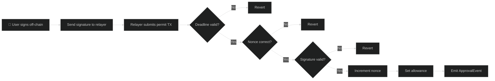
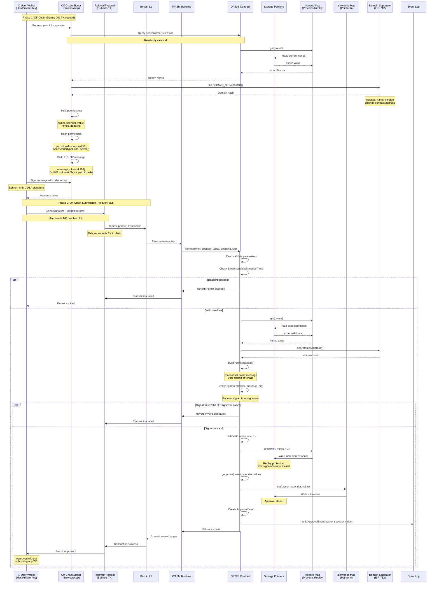
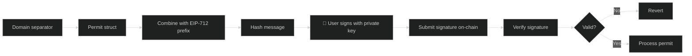
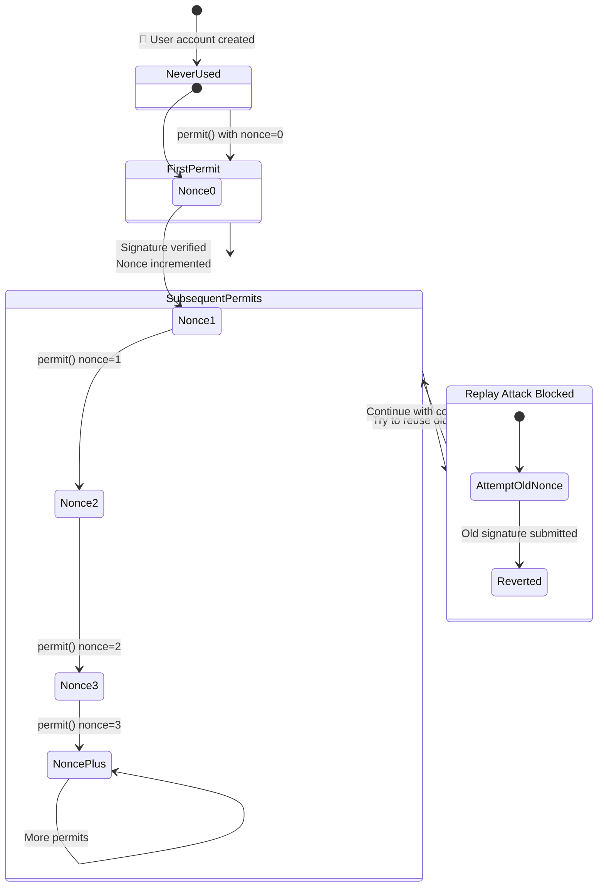

# OP20S - Signature-Based Approvals

OP20S extends OP20 with signature-based approval mechanisms, enabling off-chain approvals and enhanced security through cryptographic signatures.

## Overview

OP20S adds:
- **Permit-style approvals** - Approve via signature instead of transaction
- **Nonce management** - Replay attack protection
- **Deadline enforcement** - Time-limited signatures
- **ML-DSA support** - Quantum-resistant signatures

```typescript
import {
    OP20S,
    OP20InitParameters,
    Calldata,
    BytesWriter,
    ABIDataTypes,
} from '@btc-vision/btc-runtime/runtime';
import { u256 } from '@btc-vision/as-bignum/assembly';

@final
export class MyToken extends OP20S {
    public constructor() {
        super();
    }

    public override onDeployment(_calldata: Calldata): void {
        this.instantiate(new OP20InitParameters(
            u256.fromString('1000000000000000000000000'),
            18,
            'MyToken',
            'MTK'
        ));
    }
}
```

## ERC20Permit vs OP20S Comparison

| Feature | ERC20Permit (EIP-2612) | OP20S (OPNet) |
|---------|------------------------|---------------|
| Language | Solidity | AssemblyScript |
| Signature Type | ECDSA (v, r, s) | Schnorr, ECDSA (deprecated), or ML-DSA |
| Domain Separator | EIP-712 | EIP-712 style |
| Quantum Resistance | No | Yes (ML-DSA option) |
| Signature Parameter | Three params (v, r, s) | Single bytes param |
| Nonce Type | `uint256` | `u256` |

## Why Signature-Based Approvals?

### Traditional Approval Flow

```
1. User signs APPROVE transaction
2. User submits APPROVE TX to blockchain
3. Contract updates allowance
4. User signs TRANSFER_FROM transaction (or protocol does)
5. Transfer executes

Total: 2 transactions required from user
```

### Signature-Based Flow

```
1. User signs approval MESSAGE (off-chain, no TX needed)
2. Protocol submits signature with action
3. Contract verifies signature and executes

Total: 1 transaction, user signs off-chain only
```

## Permit Flow

The following diagram shows the high-level permit flow:



## Detailed Permit Sequence

The following sequence diagram shows the complete permit process from off-chain signing to on-chain execution:



## Message Construction

The following diagram shows how the permit message is constructed for signing:



## Nonce Management

Each address has a nonce that increments with each signature use to prevent replay attacks:



## Permit Method

### Usage

```typescript
// Off-chain: User signs permit data
const permitData = {
    owner: userAddress,
    spender: protocolAddress,
    value: amount,
    nonce: await contract.nonces(userAddress),
    deadline: Math.floor(Date.now() / 1000) + 3600  // 1 hour
};

const signature = signPermit(permitData, userPrivateKey);

// On-chain: Protocol submits permit
contract.permit(owner, spender, value, deadline, signature);
```

### Parameters

| Parameter | Type | Description |
|-----------|------|-------------|
| `owner` | `Address` | Token owner granting approval |
| `spender` | `Address` | Address being approved |
| `value` | `u256` | Amount to approve |
| `deadline` | `u64` | Signature expiration timestamp |
| `signature` | `bytes` | Cryptographic signature |

### Signature Verification

The permit verifies:
1. **Signature validity** - Matches owner's public key
2. **Deadline** - Current time <= deadline
3. **Nonce** - Matches expected nonce for owner
4. **Domain** - Correct contract and chain

## Nonces

```typescript
// Get current nonce for address
const nonce: u256 = contract.nonces(address);

// Nonce auto-increments after successful permit
// This prevents signature replay
```

### Replay Protection

```typescript
// Signature for nonce 0 used
contract.permit(..., nonce=0, signature0);  // Success, nonce now 1

// Same signature replayed
contract.permit(..., nonce=0, signature0);  // FAILS - nonce mismatch
```

## Solidity Comparison (EIP-2612)

<table>
<tr>
<th>ERC20Permit (Solidity)</th>
<th>OP20S (OPNet)</th>
</tr>
<tr>
<td>

```solidity
contract MyToken is ERC20Permit {
    constructor()
        ERC20("MyToken", "MTK")
        ERC20Permit("MyToken")
    { }
}

// Usage
token.permit(
    owner,
    spender,
    value,
    deadline,
    v, r, s  // ECDSA signature components
);
```

</td>
<td>

```typescript
@final
export class MyToken extends OP20S {
    constructor() {
        super();
    }

    public override onDeployment(_: Calldata): void {
        this.instantiate(new OP20InitParameters(
            maxSupply, 18, 'MyToken', 'MTK'
        ));
    }
}

// Usage
token.permit(
    owner,
    spender,
    value,
    deadline,
    signature  // Schnorr or ML-DSA
);
```

</td>
</tr>
</table>

## Domain Separator

OP20S uses EIP-712 style domain separation:

```typescript
// Domain includes:
// - Contract name
// - Contract version
// - Chain ID
// - Contract address

// This prevents cross-chain and cross-contract replay
```

## Quantum Resistance

OP20S supports ML-DSA (Dilithium) signatures for quantum resistance:

```typescript
// Traditional Schnorr signature
contract.permit(owner, spender, value, deadline, schnorrSignature);

// ML-DSA quantum-resistant signature
contract.permitQuantum(owner, spender, value, deadline, mldsaSignature);
```

### Extended Address

For quantum-safe operations, use `ExtendedAddress`:

```typescript
import { ExtendedAddress } from '@btc-vision/btc-runtime/runtime';

// Extended address with both key types
const extAddress = new ExtendedAddress(
    traditionalPubKey,    // Schnorr
    mldsaPubKey           // ML-DSA
);
```

See [Quantum Resistance](../advanced/quantum-resistance.md) for details.

## Implementation Details

### Permit Verification

```typescript
@method(
    { name: 'owner', type: ABIDataTypes.ADDRESS },
    { name: 'spender', type: ABIDataTypes.ADDRESS },
    { name: 'value', type: ABIDataTypes.UINT256 },
    { name: 'deadline', type: ABIDataTypes.UINT64 },
    { name: 'signature', type: ABIDataTypes.BYTES },
)
@returns({ name: 'success', type: ABIDataTypes.BOOL })
@emit('Approval')
public permit(calldata: Calldata): BytesWriter {
    const owner = calldata.readAddress();
    const spender = calldata.readAddress();
    const value = calldata.readU256();
    const deadline = calldata.readU64();
    const signature = calldata.readBytes();

    // Check deadline
    if (Blockchain.block.medianTime > deadline) {
        throw new Revert('Permit expired');
    }

    // Get and increment nonce
    const nonce = this.nonces.get(owner);
    this.nonces.set(owner, SafeMath.add(nonce, u256.One));

    // Verify signature
    const message = this.buildPermitMessage(owner, spender, value, nonce, deadline);
    if (!this.verifySignature(owner, message, signature)) {
        throw new Revert('Invalid signature');
    }

    // Set approval
    this._approve(owner, spender, value);

    return new BytesWriter(0);
}
```

### Message Format

```typescript
// Permit message structure
struct Permit {
    address owner;
    address spender;
    uint256 value;
    uint256 nonce;
    uint256 deadline;
}

// Hashed with domain separator
messageHash = SHA256(domainSeparator || SHA256(permitTypeHash || encode(permit)))
```

## Additional Methods

OP20S adds these methods to OP20:

| Method | Description |
|--------|-------------|
| `permit(...)` | Approve via signature |
| `nonces(address)` | Get nonce for address |
| `DOMAIN_SEPARATOR()` | Get domain separator |

## Use Cases

### 1. Off-Chain Approvals

```typescript
// User signs permit off-chain
const sig = await user.signPermit(spender, amount, deadline);

// Protocol submits on user's behalf
await contract.permit(user, spender, amount, deadline, sig);
await contract.transferFrom(user, recipient, amount);

// User submitted no on-chain TX!
```

### 2. Single-Transaction Approve+Transfer

```typescript
// Protocol contract
@method(
    { name: 'owner', type: ABIDataTypes.ADDRESS },
    { name: 'amount', type: ABIDataTypes.UINT256 },
    { name: 'deadline', type: ABIDataTypes.UINT64 },
    { name: 'signature', type: ABIDataTypes.BYTES },
)
@returns({ name: 'success', type: ABIDataTypes.BOOL })
@emit('Deposit')
public depositWithPermit(calldata: Calldata): BytesWriter {
    // Read permit params
    const owner = calldata.readAddress();
    const amount = calldata.readU256();
    const deadline = calldata.readU64();
    const signature = calldata.readBytes();

    // Execute permit
    token.permit(owner, this.address, amount, deadline, signature);

    // Now transfer in same transaction
    token.transferFrom(owner, this.address, amount);

    return new BytesWriter(0);
}
```

### 3. Meta-Transactions

```typescript
// Relayer submits on behalf of user
@method(
    { name: 'user', type: ABIDataTypes.ADDRESS },
    { name: 'permitSig', type: ABIDataTypes.BYTES },
    { name: 'actionSig', type: ABIDataTypes.BYTES },
)
@returns({ name: 'success', type: ABIDataTypes.BOOL })
public executeMetaTx(calldata: Calldata): BytesWriter {
    const user = calldata.readAddress();
    const permitSig = calldata.readBytes();
    const actionSig = calldata.readBytes();

    // Verify permit
    this.permit(user, ...permitSig);

    // Execute action
    this.executeAction(user, actionSig);

    return new BytesWriter(0);
}
```

## Security Considerations

### Deadline Selection

```typescript
// Too short: User might not complete in time
const deadline = now + 60;  // 1 minute - risky

// Reasonable: Enough time, limited exposure
const deadline = now + 3600;  // 1 hour - good

// Too long: Extended attack window
const deadline = now + 86400 * 365;  // 1 year - bad
```

### Signature Storage

```typescript
// NEVER store signatures on-chain unnecessarily
// They become public and could be analyzed

// DO process and discard
const sig = calldata.readBytes();
verifyAndProcess(sig);
// sig is gone after transaction
```

### Front-Running Protection

```typescript
// Permit followed by transfer in same tx = safe
permit(owner, spender, value, deadline, sig);
transferFrom(owner, recipient, value);  // Same tx

// Separate transactions = front-running risk
// Attacker could see permit and race to use allowance
```

## Best Practices

1. **Set reasonable deadlines** - Not too short, not too long
2. **Process permits atomically** - Permit + action in same transaction
3. **Monitor nonces** - Track expected nonces off-chain
4. **Verify domains** - Ensure signatures are for correct contract
5. **Consider quantum safety** - Use ML-DSA for high-value applications

---

**Navigation:**
- Previous: [OP20 Token](./op20-token.md)
- Next: [OP721 NFT](./op721-nft.md)
