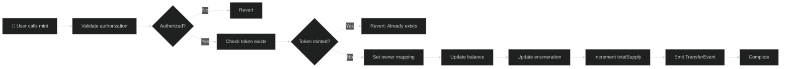
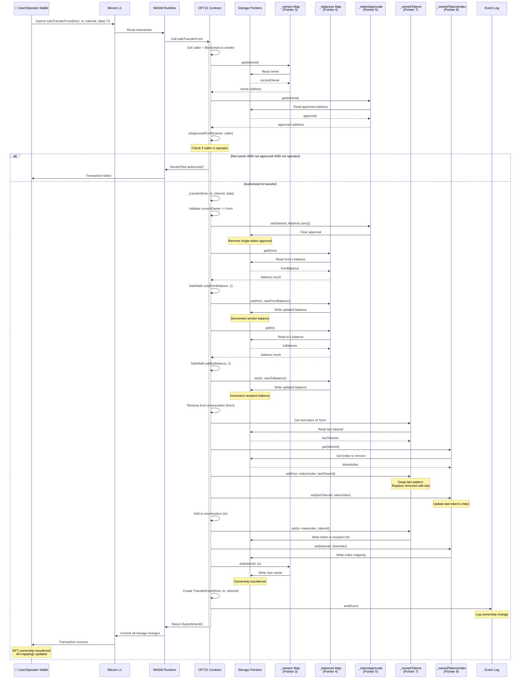
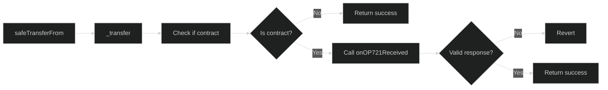
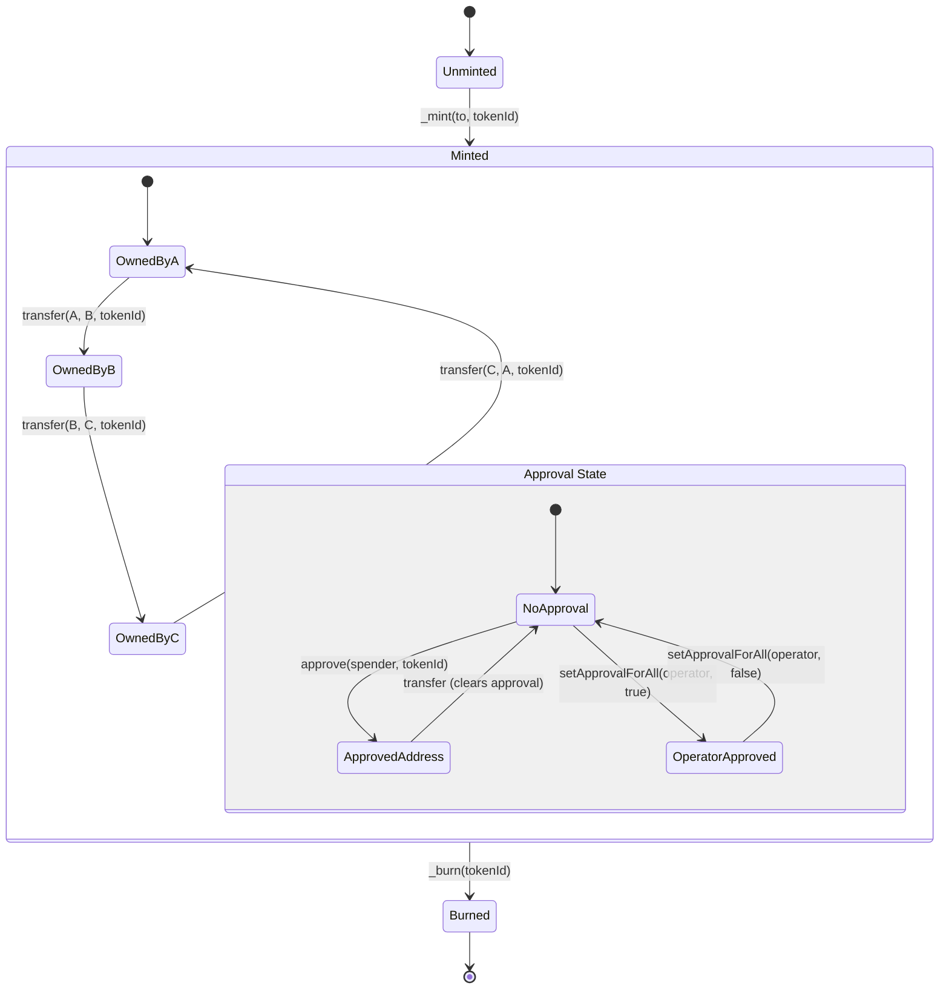
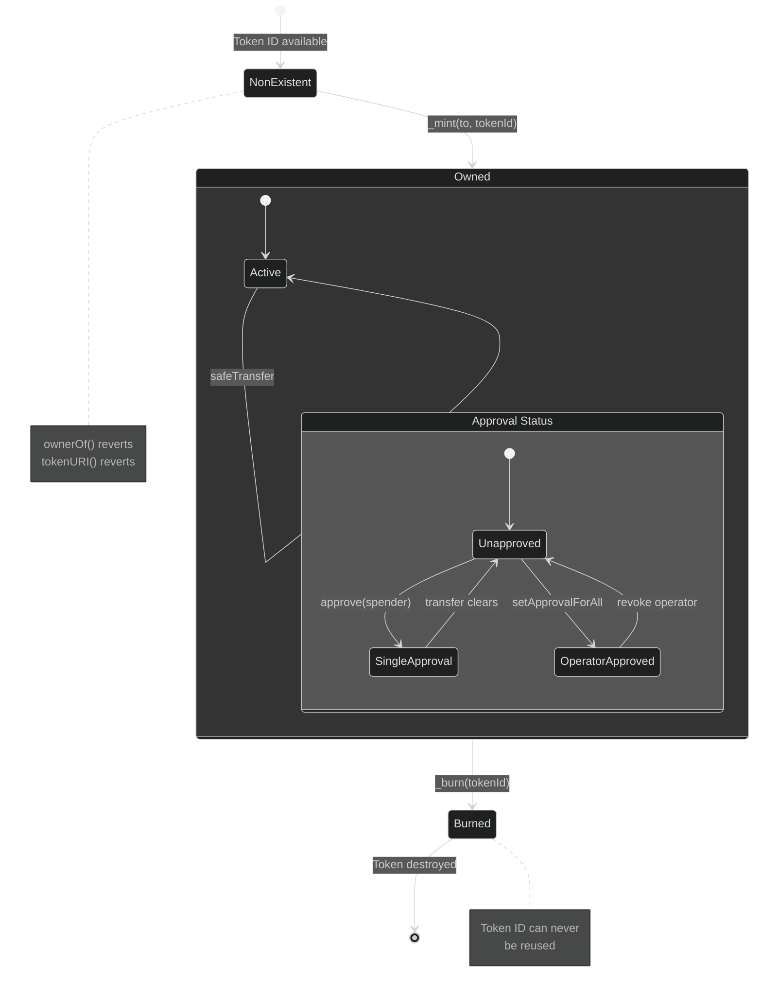
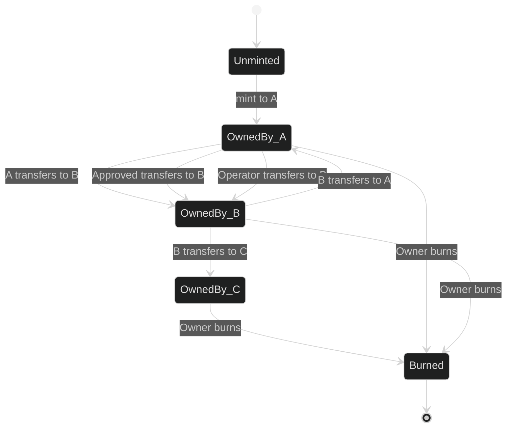

# OP721 NFT Standard

OP721 is OPNet's non-fungible token standard, equivalent to Ethereum's ERC721. It provides a complete implementation for creating NFTs with ownership tracking, transfers, approvals, and metadata management.

## Overview

```typescript
import { u256 } from '@btc-vision/as-bignum/assembly';
import {
    OP721,
    OP721InitParameters,
    Blockchain,
    Calldata,
    BytesWriter,
} from '@btc-vision/btc-runtime/runtime';

@final
export class MyNFT extends OP721 {
    public constructor() {
        super();
    }

    public override onDeployment(_calldata: Calldata): void {
        this.instantiate(new OP721InitParameters(
            'My NFT Collection',           // name
            'MNFT',                         // symbol
            'https://example.com/nft/',    // baseURI
            u256.fromU64(10000)             // maxSupply
        ));
    }
}
```

## ERC721 vs OP721 Comparison

| Feature | ERC721 (Solidity) | OP721 (OPNet) |
|---------|-------------------|---------------|
| Language | Solidity | AssemblyScript |
| Runtime | EVM | WASM |
| Token ID Type | `uint256` | `u256` |
| Enumeration | Optional (ERC721Enumerable) | Built-in |
| Safe Transfer | `safeTransferFrom` + receiver check | Same pattern |
| Operator Approval | `setApprovalForAll` | Same |
| Metadata | Optional (ERC721Metadata) | Built-in `tokenURI` |
| Address Storage | 20 bytes | 30 bytes (truncated internally) |

## Initialization

### OP721InitParameters

| Parameter | Type | Required | Description |
|-----------|------|----------|-------------|
| `name` | `string` | Yes | Collection name |
| `symbol` | `string` | Yes | Collection symbol |
| `baseURI` | `string` | Yes | Base URI for token metadata |
| `maxSupply` | `u256` | Yes | Maximum number of tokens that can be minted |
| `collectionBanner` | `string` | No | Collection banner URL (default: '') |
| `collectionIcon` | `string` | No | Collection icon URL (default: '') |
| `collectionWebsite` | `string` | No | Collection website URL (default: '') |
| `collectionDescription` | `string` | No | Collection description (default: '') |

```typescript
this.instantiate(new OP721InitParameters(
    'My NFT Collection',      // name
    'MNFT',                   // symbol
    'https://example.com/nft/', // baseURI
    u256.fromU64(10000),      // maxSupply
    'https://example.com/banner.png',  // collectionBanner (optional)
    'https://example.com/icon.png',    // collectionIcon (optional)
    'https://example.com',             // collectionWebsite (optional)
    'My awesome NFT collection'        // collectionDescription (optional)
));
```

## Minting Flow

The following diagram shows how NFT minting works:



## Transfer Sequence

The following sequence diagram shows the detailed transfer process including all storage updates:



## Safe Transfer Pattern

Safe transfers check if the recipient is a contract and call `onOP721Received`:



## NFT Lifecycle



## Token Existence States

The following state diagram shows the complete lifecycle of an NFT token:



## Built-in Methods

### Query Methods

| Method | Returns | Description |
|--------|---------|-------------|
| `name()` | `string` | Collection name |
| `symbol()` | `string` | Collection symbol |
| `totalSupply()` | `u256` | Total minted NFTs |
| `maxSupply()` | `u256` | Maximum supply limit |
| `balanceOf(owner)` | `u256` | NFT count for address |
| `ownerOf(tokenId)` | `Address` | Owner of token |
| `tokenURI(tokenId)` | `string` | Metadata URI |
| `tokenOfOwnerByIndex(owner, index)` | `u256` | Token ID at index |
| `collectionInfo()` | `(icon, banner, description, website)` | Collection metadata |
| `metadata()` | `(name, symbol, icon, banner, description, website, totalSupply, domainSeparator)` | Full collection metadata |
| `domainSeparator()` | `bytes32` | EIP-712 domain separator |
| `getApproveNonce(owner)` | `u256` | Signature nonce for owner |

### Transfer Methods

| Method | Description |
|--------|-------------|
| `safeTransfer(to, tokenId, data)` | Transfer NFT from sender to recipient |
| `safeTransferFrom(from, to, tokenId, data)` | Safe transfer with callback |
| `burn(tokenId)` | Burn token (owner or approved only) |

### Approval Methods

| Method | Description |
|--------|-------------|
| `approve(operator, tokenId)` | Approve address for token |
| `setApprovalForAll(operator, approved)` | Approve operator for all tokens |
| `getApproved(tokenId)` | Get approved address |
| `isApprovedForAll(owner, operator)` | Check operator approval |
| `approveBySignature(...)` | Approve via EIP-712 signature |
| `setApprovalForAllBySignature(...)` | Set operator approval via signature |

### Admin Methods

| Method | Description |
|--------|-------------|
| `setBaseURI(baseURI)` | Update base URI (deployer only) |
| `changeMetadata(icon, banner, description, website)` | Update collection metadata (deployer only) |

## Solidity Comparison

<table>
<tr>
<th>ERC721 (Solidity)</th>
<th>OP721 (OPNet)</th>
</tr>
<tr>
<td>

```solidity
contract MyNFT is ERC721 {
    uint256 private _tokenIds;

    constructor()
        ERC721("MyNFT", "MNFT")
    { }

    function mint(address to)
        public returns (uint256)
    {
        _tokenIds++;
        _mint(to, _tokenIds);
        return _tokenIds;
    }
}
```

</td>
<td>

```typescript
// OP721 base class already manages _nextTokenId internally

@final
export class MyNFT extends OP721 {
    public constructor() {
        super();
    }

    public override onDeployment(_: Calldata): void {
        // Base class sets _nextTokenId to 1 automatically
        this.instantiate(new OP721InitParameters(
            'MyNFT',                    // name
            'MNFT',                     // symbol
            'https://example.com/nft/', // baseURI
            u256.fromU64(10000)         // maxSupply
        ));
    }

    @method({ name: 'to', type: ABIDataTypes.ADDRESS })
    @returns({ name: 'tokenId', type: ABIDataTypes.UINT256 })
    @emit('Transferred')
    public mint(calldata: Calldata): BytesWriter {
        const to = calldata.readAddress();
        // Use base class _nextTokenId
        const tokenId = this._nextTokenId.value;

        this._mint(to, tokenId);
        this._nextTokenId.value = SafeMath.add(tokenId, u256.One);

        const writer = new BytesWriter(32);
        writer.writeU256(tokenId);
        return writer;
    }
}
```

</td>
</tr>
</table>

## Storage Layout

OP721 uses these storage pointers internally (allocated via `Blockchain.nextPointer`):

| Storage Variable | Type | Description |
|------------------|------|-------------|
| `stringPointer` | StoredString | Stores name, symbol, baseURI, banner, icon, description, website |
| `totalSupplyPointer` | StoredU256 | Total minted count |
| `maxSupplyPointer` | StoredU256 | Maximum supply limit |
| `ownerOfMapPointer` | StoredMapU256 | tokenId -> owner mapping |
| `tokenApprovalMapPointer` | StoredMapU256 | tokenId -> approved address |
| `operatorApprovalMapPointer` | MapOfMap | owner -> operator -> bool |
| `balanceOfMapPointer` | AddressMemoryMap | address -> balance mapping |
| `tokenURIMapPointer` | StoredMapU256 | tokenId -> URI index mapping |
| `nextTokenIdPointer` | StoredU256 | Next token ID to mint |
| `ownerTokensMapPointer` | StoredU256Array | owner -> array of token IDs |
| `tokenIndexMapPointer` | StoredMapU256 | tokenId -> index in owner's list |
| `initializedPointer` | StoredU256 | Initialization flag |
| `tokenURICounterPointer` | StoredU256 | Counter for custom URIs |
| `approveNonceMapPointer` | AddressMemoryMap | address -> signature nonce |

## Extending OP721

### Adding Minting

```typescript
import { u256 } from '@btc-vision/as-bignum/assembly';
import {
    OP721,
    OP721InitParameters,
    Blockchain,
    Calldata,
    BytesWriter,
    SafeMath,
    ABIDataTypes,
} from '@btc-vision/btc-runtime/runtime';

@final
export class MyNFT extends OP721 {
    public constructor() {
        super();
    }

    public override onDeployment(_calldata: Calldata): void {
        // Base class sets _nextTokenId to 1 automatically
        this.instantiate(new OP721InitParameters(
            'MyNFT',                    // name
            'MNFT',                     // symbol
            'https://example.com/nft/', // baseURI
            u256.fromU64(10000)         // maxSupply
        ));
    }

    @method({ name: 'to', type: ABIDataTypes.ADDRESS })
    @returns({ name: 'tokenId', type: ABIDataTypes.UINT256 })
    @emit('Transferred')
    public mint(calldata: Calldata): BytesWriter {
        const to = calldata.readAddress();

        // Use base class _nextTokenId (already initialized to 1)
        const tokenId = this._nextTokenId.value;
        this._mint(to, tokenId);
        this._nextTokenId.value = SafeMath.add(tokenId, u256.One);

        const writer = new BytesWriter(32);
        writer.writeU256(tokenId);
        return writer;
    }
}
```

### Setting Custom Token URIs

The OP721 base class already includes `baseURI` support and a `setBaseURI` method. You can also set custom URIs per token:

```typescript
@final
export class MyNFT extends OP721 {
    public constructor() {
        super();
    }

    public override onDeployment(_calldata: Calldata): void {
        this.instantiate(new OP721InitParameters(
            'MyNFT',
            'MNFT',
            'https://example.com/nft/',  // Default baseURI
            u256.fromU64(10000)
        ));
    }

    // Set custom URI for a specific token
    @method(
        { name: 'tokenId', type: ABIDataTypes.UINT256 },
        { name: 'uri', type: ABIDataTypes.STRING },
    )
    public setTokenURI(calldata: Calldata): BytesWriter {
        this.onlyDeployer(Blockchain.tx.sender);
        const tokenId = calldata.readU256();
        const uri = calldata.readStringWithLength();

        // Uses internal _setTokenURI from OP721 base class
        this._setTokenURI(tokenId, uri);

        return new BytesWriter(0);
    }
}
```

Note: The base class automatically handles token URI resolution - if a custom URI is set for a token, it returns that; otherwise, it returns `baseURI + tokenId`.

### Collection Metadata

The OP721 base class includes built-in collection metadata support. You can set it during initialization:

```typescript
@final
export class MyNFT extends OP721 {
    public constructor() {
        super();
    }

    public override onDeployment(_calldata: Calldata): void {
        this.instantiate(new OP721InitParameters(
            'MyNFT',                              // name
            'MNFT',                               // symbol
            'https://example.com/nft/',           // baseURI
            u256.fromU64(10000),                  // maxSupply
            'https://example.com/banner.png',    // collectionBanner
            'https://example.com/icon.png',      // collectionIcon
            'https://example.com',                // collectionWebsite
            'An awesome NFT collection'           // collectionDescription
        ));
    }
}
```

The built-in `collectionInfo()` method returns the icon, banner, description, and website. The `metadata()` method returns all collection data including name, symbol, and totalSupply.

Use `changeMetadata(icon, banner, description, website)` to update collection metadata after deployment (deployer only).

## Internal Methods

| Method | Description |
|--------|-------------|
| `_mint(to, tokenId)` | Mint new token |
| `_burn(tokenId)` | Burn token |
| `_transfer(from, to, tokenId, data)` | Internal transfer with data |
| `_approve(operator, tokenId)` | Internal approval |
| `_setApprovalForAll(owner, operator, approved)` | Internal operator approval |
| `_setTokenURI(tokenId, uri)` | Set custom token URI |
| `_setBaseURI(baseURI)` | Set base URI |
| `_exists(tokenId)` | Check if token exists |
| `_ownerOf(tokenId)` | Get owner (throws if not exists) |
| `_balanceOf(owner)` | Get balance (throws if zero address) |
| `_isApprovedForAll(owner, operator)` | Check operator approval |

## Enumeration

OP721 includes enumeration support (like ERC721Enumerable):

```typescript
// Get all tokens owned by address
const balance = nft.balanceOf(owner);
for (let i: u256 = u256.Zero; i < balance; i = SafeMath.add(i, u256.One)) {
    const tokenId = nft.tokenOfOwnerByIndex(owner, i);
    // Process token...
}
```

### Swap-Last Removal Pattern

When transferring, OP721 uses the "swap last" pattern for efficient enumeration:

```
Owner's tokens: [A, B, C, D]  (indices 0, 1, 2, 3)

Transfer B:
1. Swap B with last element (D): [A, D, C, B]
2. Remove last: [A, D, C]
3. Update indices: A=0, D=1, C=2

This is O(1) instead of O(n) shifting
```

## Events

OP721 emits:

```typescript
// On transfer, mint, burn
TransferredEvent(operator: Address, from: Address, to: Address, tokenId: u256)
// operator = Blockchain.tx.sender
// For mint: from = Address.zero()
// For burn: to = Address.zero()

// On approval
ApprovedEvent(owner: Address, spender: Address, tokenId: u256)

// On operator approval
ApprovedForAllEvent(owner: Address, operator: Address, approved: bool)

// On URI change
URIEvent(value: string, id: u256)
```

## Edge Cases

The following state diagram shows how ownership transitions work for a specific token:



### Token ID Uniqueness

```typescript
// Token IDs must be unique
_mint(owner1, u256.fromU64(1));  // OK
_mint(owner2, u256.fromU64(1));  // FAILS - token exists

// Use incrementing IDs to ensure uniqueness
private nextTokenId: StoredU256 = new StoredU256(ptr, EMPTY_POINTER);
// Set initial value in onDeployment:
// this.nextTokenId.value = u256.One;
```

### Zero Token ID

```typescript
// Token ID 0 is valid
_mint(owner, u256.Zero);  // OK

// But be careful with uninitialized checks
if (tokenId.isZero()) {
    // This doesn't mean "no token" - 0 could be valid!
}
```

### Owner Truncation

**IMPORTANT:** In OP721's enumeration, addresses are truncated to 30 bytes internally for storage efficiency:

```typescript
// 32-byte address -> 30-byte storage key
// This is handled internally, but be aware of it
```

## Complete NFT Example

```typescript
import { u256 } from '@btc-vision/as-bignum/assembly';
import {
    OP721,
    OP721InitParameters,
    Blockchain,
    Address,
    Calldata,
    BytesWriter,
    StoredU256,
    StoredBoolean,
    SafeMath,
    Revert,
    ABIDataTypes,
    EMPTY_POINTER,
} from '@btc-vision/btc-runtime/runtime';

@final
export class MyNFTCollection extends OP721 {
    // Configuration - additional storage beyond base class
    private pricePointer: u16 = Blockchain.nextPointer;
    private mintingOpenPointer: u16 = Blockchain.nextPointer;

    private _price: StoredU256;
    private _mintingOpen: StoredBoolean;

    public constructor() {
        super();
        this._price = new StoredU256(this.pricePointer, EMPTY_POINTER);
        this._mintingOpen = new StoredBoolean(this.mintingOpenPointer, false);
    }

    public override onDeployment(calldata: Calldata): void {
        const name = calldata.readStringWithLength();
        const symbol = calldata.readStringWithLength();
        const baseURI = calldata.readStringWithLength();
        const maxSupply = calldata.readU256();
        const price = calldata.readU256();

        // Initialize OP721 base class with all required parameters
        this.instantiate(new OP721InitParameters(
            name,
            symbol,
            baseURI,
            maxSupply
        ));

        this._price.value = price;
    }

    // Public mint - uses internal _nextTokenId from base class
    @method({ name: 'quantity', type: ABIDataTypes.UINT256 })
    @returns({ name: 'success', type: ABIDataTypes.BOOL })
    @emit('Transferred')
    public mint(calldata: Calldata): BytesWriter {
        if (!this._mintingOpen.value) {
            throw new Revert('Minting not open');
        }

        const quantity = calldata.readU256();
        const currentSupply = this.totalSupply;
        const max = this.maxSupply;

        // Check supply
        if (SafeMath.add(currentSupply, quantity) > max) {
            throw new Revert('Exceeds max supply');
        }

        // Mint tokens using base class _nextTokenId
        const to = Blockchain.tx.sender;
        for (let i: u256 = u256.Zero; i < quantity; i = SafeMath.add(i, u256.One)) {
            const tokenId = this._nextTokenId.value;
            this._mint(to, tokenId);
            this._nextTokenId.value = SafeMath.add(tokenId, u256.One);
        }

        return new BytesWriter(0);
    }

    // Admin: Open minting
    @method()
    @returns({ name: 'success', type: ABIDataTypes.BOOL })
    public openMinting(_calldata: Calldata): BytesWriter {
        this.onlyDeployer(Blockchain.tx.sender);
        this._mintingOpen.value = true;
        return new BytesWriter(0);
    }
}
```

Note: The base class handles `tokenURI()`, `maxSupply`, `totalSupply`, and `_nextTokenId` - you don't need to redefine these unless you want custom behavior.

## Best Practices

1. **Use the built-in `_nextTokenId`** for automatic token ID management
2. **Use the built-in `tokenURI`** or set custom URIs via `_setTokenURI` for marketplace compatibility
3. **Set collection metadata** via `OP721InitParameters` for discoverability
4. **Use `safeTransferFrom`** when receiver might be a contract (calls `onOP721Received`)
5. **Events are emitted automatically** by internal methods like `_mint`, `_burn`, `_transfer`, `_approve`
6. **Use `_exists(tokenId)`** to validate token existence before operations

---

**Navigation:**
- Previous: [OP20S Signatures](./op20s-signatures.md)
- Next: [ReentrancyGuard](./reentrancy-guard.md)
