# OP721 NFT Standard

OP721 is OPNet's non-fungible token standard, equivalent to Ethereum's ERC721. It provides a complete implementation for creating NFTs with ownership tracking, transfers, approvals, and metadata management.

## Overview

```typescript
import { u256 } from '@btc-vision/as-bignum/assembly';
import {
    OP721,
    OP721InitParameters,
    Blockchain,
    Calldata,
    BytesWriter,
} from '@btc-vision/btc-runtime/runtime';

@final
export class MyNFT extends OP721 {
    public constructor() {
        super();
    }

    public override onDeployment(_calldata: Calldata): void {
        this.instantiate(new OP721InitParameters(
            'My NFT Collection',
            'MNFT'
        ));
    }
}
```

## ERC721 vs OP721 Comparison

| Feature | ERC721 (Solidity) | OP721 (OPNet) |
|---------|-------------------|---------------|
| Language | Solidity | AssemblyScript |
| Runtime | EVM | WASM |
| Token ID Type | `uint256` | `u256` |
| Enumeration | Optional (ERC721Enumerable) | Built-in |
| Safe Transfer | `safeTransferFrom` + receiver check | Same pattern |
| Operator Approval | `setApprovalForAll` | Same |
| Metadata | Optional (ERC721Metadata) | Built-in `tokenURI` |
| Address Storage | 20 bytes | 30 bytes (truncated internally) |

## Initialization

### OP721InitParameters

| Parameter | Type | Description |
|-----------|------|-------------|
| `name` | `string` | Collection name |
| `symbol` | `string` | Collection symbol |

```typescript
this.instantiate(new OP721InitParameters(
    'My NFT Collection',
    'MNFT'
));
```

## Minting Flow

The following diagram shows how NFT minting works:

```mermaid
---
config:
  theme: dark
---
flowchart LR
    A[👤 User calls mint] --> B[Validate authorization]
    B --> C{Authorized?}
    C -->|No| D[Revert]
    C -->|Yes| E[Check token exists]
    E --> F{Token minted?}
    F -->|Yes| G[Revert: Already exists]
    F -->|No| H[Set owner mapping]
    H --> I[Update balance]
    I --> J[Update enumeration]
    J --> K[Increment totalSupply]
    K --> L[Emit TransferEvent]
    L --> M[Complete]
```



## Transfer Sequence

The following sequence diagram shows the detailed transfer process including all storage updates:

```mermaid
sequenceDiagram
    participant User as 👤 User/Operator Wallet
    participant Blockchain as Bitcoin L1
    participant VM as WASM Runtime
    participant OP721 as OP721 Contract
    participant Storage as Storage Pointers
    participant OwnersMap as _owners Map<br/>(Pointer 3)
    participant BalancesMap as _balances Map<br/>(Pointer 4)
    participant ApprovalsMap as _tokenApprovals<br/>(Pointer 5)
    participant OwnedTokens as _ownedTokens<br/>(Pointer 7)
    participant TokenIndex as _ownedTokensIndex<br/>(Pointer 8)
    participant EventLog as Event Log

    User->>Blockchain: Submit transferFrom(from, to, tokenId) TX
    Blockchain->>VM: Route transaction
    VM->>OP721: Call transferFrom

    activate OP721

    OP721->>OP721: Get caller = Blockchain.tx.sender

    OP721->>OwnersMap: get(tokenId)
    OwnersMap->>Storage: Read owner
    Storage-->>OwnersMap: currentOwner
    OwnersMap-->>OP721: owner address

    OP721->>ApprovalsMap: get(tokenId)
    ApprovalsMap->>Storage: Read approved address
    Storage-->>ApprovalsMap: approved
    ApprovalsMap-->>OP721: approved address

    OP721->>OP721: isApprovedForAll(owner, caller)
    Note over OP721: Check if caller is operator

    alt Not owner AND not approved AND not operator
        OP721->>VM: Revert('Not authorized')
        VM->>User: Transaction failed
    else Authorized to transfer
        OP721->>OP721: _transfer(from, to, tokenId)

        OP721->>OP721: Validate currentOwner == from

        OP721->>ApprovalsMap: set(tokenId, Address.zero())
        ApprovalsMap->>Storage: Clear approval
        Note over Storage: Remove single-token approval

        OP721->>BalancesMap: get(from)
        BalancesMap->>Storage: Read from's balance
        Storage-->>BalancesMap: fromBalance
        BalancesMap-->>OP721: balance count

        OP721->>OP721: SafeMath.sub(fromBalance, 1)
        OP721->>BalancesMap: set(from, newFromBalance)
        BalancesMap->>Storage: Write updated balance
        Note over Storage: Decrement sender balance

        OP721->>BalancesMap: get(to)
        BalancesMap->>Storage: Read to's balance
        Storage-->>BalancesMap: toBalance
        BalancesMap-->>OP721: balance count

        OP721->>OP721: SafeMath.add(toBalance, 1)
        OP721->>BalancesMap: set(to, newToBalance)
        BalancesMap->>Storage: Write updated balance
        Note over Storage: Increment recipient balance

        OP721->>OP721: Remove from enumeration (from)
        OP721->>OwnedTokens: Get last token of 'from'
        OwnedTokens->>Storage: Read last tokenId
        Storage-->>OwnedTokens: lastTokenId
        OP721->>TokenIndex: get(tokenId)
        TokenIndex->>Storage: Get index to remove
        Storage-->>TokenIndex: tokenIndex
        OP721->>OwnedTokens: set(from->tokenIndex, lastTokenId)
        Note over OwnedTokens: Swap-last pattern:<br/>Replace removed with last
        OP721->>TokenIndex: set(lastTokenId, tokenIndex)
        Note over TokenIndex: Update last token's index

        OP721->>OP721: Add to enumeration (to)
        OP721->>OwnedTokens: set(to->newIndex, tokenId)
        OwnedTokens->>Storage: Write token to recipient list
        OP721->>TokenIndex: set(tokenId, newIndex)
        TokenIndex->>Storage: Write index mapping

        OP721->>OwnersMap: set(tokenId, to)
        OwnersMap->>Storage: Write new owner
        Note over Storage: Ownership transferred

        OP721->>OP721: Create TransferEvent(from, to, tokenId)
        OP721->>EventLog: emitEvent
        Note over EventLog: Log ownership change

        OP721->>VM: Return BytesWriter(0)
        deactivate OP721

        VM->>Blockchain: Commit all storage changes
        Blockchain->>User: Transaction success
        Note over User: NFT ownership transferred<br/>All mappings updated
    end
```



## Safe Transfer Pattern

Safe transfers check if the recipient is a contract and call `onOP721Received`:


## NFT Lifecycle


## Token Existence States

The following state diagram shows the complete lifecycle of an NFT token:


## Built-in Methods

### Query Methods

| Method | Returns | Description |
|--------|---------|-------------|
| `name()` | `string` | Collection name |
| `symbol()` | `string` | Collection symbol |
| `totalSupply()` | `u256` | Total minted NFTs |
| `balanceOf(address)` | `u256` | NFT count for address |
| `ownerOf(tokenId)` | `Address` | Owner of token |
| `tokenURI(tokenId)` | `string` | Metadata URI |
| `tokenOfOwnerByIndex(owner, index)` | `u256` | Token ID at index |

### Transfer Methods

| Method | Description |
|--------|-------------|
| `transferFrom(from, to, tokenId)` | Transfer NFT |
| `safeTransferFrom(from, to, tokenId)` | Safe transfer with callback |
| `safeTransferFrom(from, to, tokenId, data)` | Safe transfer with data |

### Approval Methods

| Method | Description |
|--------|-------------|
| `approve(to, tokenId)` | Approve address for token |
| `setApprovalForAll(operator, approved)` | Approve operator for all tokens |
| `getApproved(tokenId)` | Get approved address |
| `isApprovedForAll(owner, operator)` | Check operator approval |

## Solidity Comparison

<table>
<tr>
<th>ERC721 (Solidity)</th>
<th>OP721 (OPNet)</th>
</tr>
<tr>
<td>

```solidity
contract MyNFT is ERC721 {
    uint256 private _tokenIds;

    constructor()
        ERC721("MyNFT", "MNFT")
    { }

    function mint(address to)
        public returns (uint256)
    {
        _tokenIds++;
        _mint(to, _tokenIds);
        return _tokenIds;
    }
}
```

</td>
<td>

```typescript
import { EMPTY_POINTER } from '@btc-vision/btc-runtime/runtime';

@final
export class MyNFT extends OP721 {
    private nextTokenIdPointer: u16 = Blockchain.nextPointer;
    private _nextTokenId: StoredU256;

    public constructor() {
        super();
        this._nextTokenId = new StoredU256(
            this.nextTokenIdPointer, EMPTY_POINTER
        );
    }

    public override onDeployment(_: Calldata): void {
        this.instantiate(new OP721InitParameters(
            'MyNFT', 'MNFT'
        ));
        this._nextTokenId.value = u256.One;  // Set initial token ID
    }

    public mint(calldata: Calldata): BytesWriter {
        const to = calldata.readAddress();
        const tokenId = this._nextTokenId.value;

        this._mint(to, tokenId);
        this._nextTokenId.value = SafeMath.add(tokenId, u256.One);

        const writer = new BytesWriter(32);
        writer.writeU256(tokenId);
        return writer;
    }
}
```

</td>
</tr>
</table>

## Storage Layout

OP721 uses these storage pointers internally:

| Pointer | Storage | Description |
|---------|---------|-------------|
| 0 | `name` | Collection name |
| 1 | `symbol` | Collection symbol |
| 2 | `totalSupply` | Total minted count |
| 3 | `owners` | tokenId -> owner mapping |
| 4 | `balances` | address -> balance mapping |
| 5 | `tokenApprovals` | tokenId -> approved address |
| 6 | `operatorApprovals` | owner -> operator -> bool |
| 7 | `ownedTokens` | owner -> index -> tokenId |
| 8 | `ownedTokensIndex` | tokenId -> index in owner's list |
| 9 | `tokenURIs` | tokenId -> URI mapping |

## Extending OP721

### Adding Minting

```typescript
import { method, returns, ABIDataTypes } from '@btc-vision/btc-runtime/runtime';

@final
export class MyNFT extends OP721 {
    private nextTokenIdPointer: u16 = Blockchain.nextPointer;
    private _nextTokenId: StoredU256 = new StoredU256(
        this.nextTokenIdPointer,
        EMPTY_POINTER
    );

    public constructor() {
        super();
    }

    public override onDeployment(_calldata: Calldata): void {
        this.instantiate(new OP721InitParameters('MyNFT', 'MNFT'));
        this._nextTokenId.value = u256.One;  // Set initial token ID
    }

    @method()
    @returns({ name: 'tokenId', type: ABIDataTypes.UINT256 })
    public mint(calldata: Calldata): BytesWriter {
        const to = calldata.readAddress();

        const tokenId = this._nextTokenId.value;
        this._mint(to, tokenId);
        this._nextTokenId.value = SafeMath.add(tokenId, u256.One);

        const writer = new BytesWriter(32);
        writer.writeU256(tokenId);
        return writer;
    }

    public override execute(method: Selector, calldata: Calldata): BytesWriter {
        // Define method selectors
        const MINT_SELECTOR: u32 = encodeSelector('mint');

        switch (method) {
            case MINT_SELECTOR:
                return this.mint(calldata);
            default:
                return super.execute(method, calldata);
        }
    }
}
```

### Adding Token URIs

```typescript
@final
export class MyNFT extends OP721 {
    private baseURIPointer: u16 = Blockchain.nextPointer;
    private _baseURI: StoredString = new StoredString(
        this.baseURIPointer,
        0
    );

    @method()
    public setBaseURI(calldata: Calldata): BytesWriter {
        this.onlyDeployer(Blockchain.tx.sender);
        this._baseURI.value = calldata.readString();
        return new BytesWriter(0);
    }

    // Override tokenURI to use base URI
    public override tokenURI(tokenId: u256): string {
        // Check token exists
        if (this._owners.get(tokenId).equals(Address.zero())) {
            throw new Revert('Token does not exist');
        }

        const base = this._baseURI.value;
        return base + tokenId.toString();
    }
}
```

### Collection Metadata

```typescript
@final
export class MyNFT extends OP721 {
    private descriptionPointer: u16 = Blockchain.nextPointer;
    private imagePointer: u16 = Blockchain.nextPointer;

    private _description: StoredString;
    private _collectionImage: StoredString;

    public constructor() {
        super();
        this._description = new StoredString(this.descriptionPointer, 0);
        this._collectionImage = new StoredString(this.imagePointer, 1);
    }

    @method()
    public setCollectionMetadata(calldata: Calldata): BytesWriter {
        this.onlyDeployer(Blockchain.tx.sender);

        this._description.value = calldata.readString();
        this._collectionImage.value = calldata.readString();

        return new BytesWriter(0);
    }

    @method()
    @returns({ name: 'metadata', type: ABIDataTypes.STRING })
    public collectionMetadata(_calldata: Calldata): BytesWriter {
        const writer = new BytesWriter(1024);
        writer.writeString(this._description.value);
        writer.writeString(this._collectionImage.value);
        return writer;
    }
}
```

## Internal Methods

| Method | Description |
|--------|-------------|
| `_mint(to, tokenId)` | Mint new token |
| `_burn(tokenId)` | Burn token |
| `_transfer(from, to, tokenId)` | Internal transfer |
| `_approve(to, tokenId)` | Internal approval |
| `_setApprovalForAll(owner, operator, approved)` | Internal operator approval |

## Enumeration

OP721 includes enumeration support (like ERC721Enumerable):

```typescript
// Get all tokens owned by address
const balance = nft.balanceOf(owner);
for (let i: u256 = u256.Zero; i < balance; i = SafeMath.add(i, u256.One)) {
    const tokenId = nft.tokenOfOwnerByIndex(owner, i);
    // Process token...
}
```

### Swap-Last Removal Pattern

When transferring, OP721 uses the "swap last" pattern for efficient enumeration:

```
Owner's tokens: [A, B, C, D]  (indices 0, 1, 2, 3)

Transfer B:
1. Swap B with last element (D): [A, D, C, B]
2. Remove last: [A, D, C]
3. Update indices: A=0, D=1, C=2

This is O(1) instead of O(n) shifting
```

## Events

OP721 emits:

```typescript
// On transfer, mint, burn
TransferEvent(from: Address, to: Address, tokenId: u256)
// For mint: from = Address.zero()
// For burn: to = Address.zero()

// On approval
ApprovalEvent(owner: Address, approved: Address, tokenId: u256)

// On operator approval
ApprovalForAllEvent(owner: Address, operator: Address, approved: bool)
```

## Edge Cases

The following state diagram shows how ownership transitions work for a specific token:


### Token ID Uniqueness

```typescript
// Token IDs must be unique
_mint(owner1, u256.fromU64(1));  // OK
_mint(owner2, u256.fromU64(1));  // FAILS - token exists

// Use incrementing IDs to ensure uniqueness
private nextTokenId: StoredU256 = new StoredU256(ptr, EMPTY_POINTER);
// Set initial value in onDeployment:
// this.nextTokenId.value = u256.One;
```

### Zero Token ID

```typescript
// Token ID 0 is valid
_mint(owner, u256.Zero);  // OK

// But be careful with uninitialized checks
if (tokenId.isZero()) {
    // This doesn't mean "no token" - 0 could be valid!
}
```

### Owner Truncation

**IMPORTANT:** In OP721's enumeration, addresses are truncated to 30 bytes internally for storage efficiency:

```typescript
// 32-byte address -> 30-byte storage key
// This is handled internally, but be aware of it
```

## Complete NFT Example

```typescript
import { u256 } from '@btc-vision/as-bignum/assembly';
import {
    OP721,
    OP721InitParameters,
    Blockchain,
    Address,
    Calldata,
    BytesWriter,
    Selector,
    StoredU256,
    StoredString,
    StoredBoolean,
    SafeMath,
    Revert,
    method,
    returns,
    ABIDataTypes,
    encodeSelector,
    EMPTY_POINTER,
} from '@btc-vision/btc-runtime/runtime';

// Define method selectors (sha256 first 4 bytes of method signature)
const MINT_SELECTOR: u32 = encodeSelector('mint');
const OPEN_MINTING_SELECTOR: u32 = encodeSelector('openMinting');

@final
export class MyNFTCollection extends OP721 {
    // Configuration
    private maxSupplyPointer: u16 = Blockchain.nextPointer;
    private pricePointer: u16 = Blockchain.nextPointer;
    private nextTokenIdPointer: u16 = Blockchain.nextPointer;
    private baseURIPointer: u16 = Blockchain.nextPointer;
    private mintingOpenPointer: u16 = Blockchain.nextPointer;

    private _maxSupply: StoredU256;
    private _price: StoredU256;
    private _nextTokenId: StoredU256;
    private _baseURI: StoredString;
    private _mintingOpen: StoredBoolean;

    public constructor() {
        super();
        this._maxSupply = new StoredU256(this.maxSupplyPointer, EMPTY_POINTER);
        this._price = new StoredU256(this.pricePointer, EMPTY_POINTER);
        this._nextTokenId = new StoredU256(this.nextTokenIdPointer, EMPTY_POINTER);
        this._baseURI = new StoredString(this.baseURIPointer, 0);
        this._mintingOpen = new StoredBoolean(this.mintingOpenPointer, false);
    }

    public override onDeployment(calldata: Calldata): void {
        const name = calldata.readString();
        const symbol = calldata.readString();
        const maxSupply = calldata.readU256();
        const price = calldata.readU256();
        const baseURI = calldata.readString();

        this.instantiate(new OP721InitParameters(name, symbol));

        this._maxSupply.value = maxSupply;
        this._price.value = price;
        this._baseURI.value = baseURI;
        this._nextTokenId.value = u256.One;  // Set initial token ID
    }

    // Public mint
    @method()
    public mint(calldata: Calldata): BytesWriter {
        if (!this._mintingOpen.value) {
            throw new Revert('Minting not open');
        }

        const quantity = calldata.readU256();
        const currentSupply = this.totalSupply();
        const maxSupply = this._maxSupply.value;

        // Check supply
        if (SafeMath.add(currentSupply, quantity) > maxSupply) {
            throw new Revert('Exceeds max supply');
        }

        // Mint tokens
        const to = Blockchain.tx.sender;
        for (let i: u256 = u256.Zero; i < quantity; i = SafeMath.add(i, u256.One)) {
            const tokenId = this._nextTokenId.value;
            this._mint(to, tokenId);
            this._nextTokenId.value = SafeMath.add(tokenId, u256.One);
        }

        return new BytesWriter(0);
    }

    // Admin: Open minting
    @method()
    public openMinting(_calldata: Calldata): BytesWriter {
        this.onlyDeployer(Blockchain.tx.sender);
        this._mintingOpen.value = true;
        return new BytesWriter(0);
    }

    // Token URI
    public override tokenURI(tokenId: u256): string {
        return this._baseURI.value + tokenId.toString() + '.json';
    }

    public override execute(method: Selector, calldata: Calldata): BytesWriter {
        switch (method) {
            case MINT_SELECTOR:
                return this.mint(calldata);
            case OPEN_MINTING_SELECTOR:
                return this.openMinting(calldata);
            default:
                return super.execute(method, calldata);
        }
    }
}
```

## Best Practices

1. **Use incrementing token IDs** for simplicity
2. **Implement `tokenURI`** for marketplace compatibility
3. **Add collection metadata** for discoverability
4. **Use `_safeMint`** when receiver might be a contract
5. **Emit events** for all state changes
6. **Validate token existence** before operations

---

**Navigation:**
- Previous: [OP20S Signatures](./op20s-signatures.md)
- Next: [ReentrancyGuard](./reentrancy-guard.md)
