# ReentrancyGuard

ReentrancyGuard protects your contracts from reentrancy attacks, one of the most common smart contract vulnerabilities. It prevents a contract from being called back into itself before the first call completes.

## Overview

```typescript
import {
    ReentrancyGuard,
    ReentrancyLevel,
} from '@btc-vision/btc-runtime/runtime';

@final
export class MyContract extends ReentrancyGuard {
    protected readonly reentrancyLevel: ReentrancyLevel = ReentrancyLevel.STANDARD;

    public constructor() {
        super();
    }

    @method()
    @returns({ name: 'success', type: ABIDataTypes.BOOL })
    public withdraw(calldata: Calldata): BytesWriter {
        // Protected automatically by ReentrancyGuard
        const amount = this.balances.get(Blockchain.tx.sender);
        this.balances.set(Blockchain.tx.sender, u256.Zero);
        this.sendFunds(Blockchain.tx.sender, amount);

        return new BytesWriter(0);
    }
}
```

## OpenZeppelin vs OPNet ReentrancyGuard

| Feature | OpenZeppelin (Solidity) | OPNet ReentrancyGuard |
|---------|-------------------------|----------------------|
| Protection Scope | Per-function (`nonReentrant` modifier) | All methods by default |
| Opt-in/Opt-out | Opt-in per function | Opt-out via `isSelectorExcluded` |
| Lock Type | Boolean lock | Boolean lock (STANDARD) / Depth counter (CALLBACK) |
| Callback Support | No (always blocks) | No (both modes block reentry) |
| Storage | Persistent storage | Persistent storage |

## What is Reentrancy?

### The Attack

```typescript
// Vulnerable contract
public withdraw(): void {
    const balance = balances.get(sender);

    // 1. External call BEFORE state update
    sendFunds(sender, balance);
    // Attacker's receive function calls withdraw() again
    // balance is still the original amount!

    // 2. State update happens too late
    balances.set(sender, u256.Zero);
}
```

Attack flow:
```
1. Attacker calls withdraw()
2. Contract sends funds to attacker
3. Attacker's receive function calls withdraw() again
4. Balance hasn't been updated yet, so attacker withdraws again
5. Repeat until contract is drained
```

### The Defense

ReentrancyGuard prevents this by locking the contract during execution:

```typescript
// Protected contract
public withdraw(): void {
    // ReentrancyGuard: Check and set lock
    // If already locked, transaction reverts

    const balance = balances.get(sender);
    balances.set(sender, u256.Zero);  // State update
    sendFunds(sender, balance);       // External call

    // ReentrancyGuard: Release lock
}
```

## Guard Mechanism

The following diagram shows how the guard checks and manages reentrancy depth:

```mermaid
---
config:
  theme: dark
---
flowchart LR
    A[👤 User submits TX] --> B[onExecutionStarted]
    B --> C{Check lock/depth}
    C -->|STANDARD: locked| D[Revert]
    C -->|CALLBACK: depth >= 1| E[Revert]
    C -->|Valid| F[Set lock/Increment depth]
    F --> G[Execute method]
    G --> H{External call?}
    H -->|Yes| I{Callback attempt?}
    I -->|Yes| C
    I -->|No| J[Complete]
    H -->|No| J
    J --> K[onExecutionCompleted]
    K --> L[Decrement depth]
```



## Vulnerable Contract Attack

The following sequence diagram shows how a reentrancy attack works against an unprotected contract:


## Protected Contract Defense

The following sequence diagram shows how ReentrancyGuard blocks the same attack:


## Choosing a Guard Mode

Use this decision diagram to select the appropriate reentrancy level:


Note: Both modes block reentrancy. STANDARD uses a boolean lock; CALLBACK uses a depth counter.

## Guard Modes

The following state diagram shows how the reentrancy lock transitions between states:


### STANDARD Mode

Strict mutual exclusion - no re-entry allowed at all.

```typescript
@final
export class SecureVault extends ReentrancyGuard {
    protected readonly reentrancyLevel: ReentrancyLevel = ReentrancyLevel.STANDARD;

    public constructor() {
        super();
    }

    @method({ name: 'amount', type: ABIDataTypes.UINT256 })
    @returns({ name: 'success', type: ABIDataTypes.BOOL })
    public deposit(calldata: Calldata): BytesWriter {
        // Cannot be re-entered
        // ...
    }

    @method()
    @returns({ name: 'success', type: ABIDataTypes.BOOL })
    public withdraw(calldata: Calldata): BytesWriter {
        // Cannot be re-entered
        // deposit() also blocked while this runs
        // ...
    }
}
```

**Use STANDARD when:**
- Handling funds/assets
- Complex multi-step operations
- Any operation where re-entry could cause issues

### CALLBACK Mode

Uses depth tracking instead of a simple boolean lock. Currently configured to reject any reentry (depth >= 1 triggers revert).

```typescript
@final
export class TokenWithCallbacks extends ReentrancyGuard {
    protected readonly reentrancyLevel: ReentrancyLevel = ReentrancyLevel.CALLBACK;

    public constructor() {
        super();
    }

    @method(
        { name: 'from', type: ABIDataTypes.ADDRESS },
        { name: 'to', type: ABIDataTypes.ADDRESS },
        { name: 'tokenId', type: ABIDataTypes.UINT256 },
    )
    @returns({ name: 'success', type: ABIDataTypes.BOOL })
    @emit('Transfer')
    public safeTransfer(calldata: Calldata): BytesWriter {
        // Transfer token
        this._transfer(from, to, tokenId);

        // Notify receiver (might call back)
        this.onTokenReceived(to, from, tokenId);
        // Note: With current implementation, any reentry is rejected

        return new BytesWriter(0);
    }
}
```

**Use CALLBACK when:**
- You need depth-based tracking instead of a simple boolean lock
- You want differentiated error messages (Max depth exceeded vs LOCKED)
- Note: Current implementation rejects any reentry at depth >= 1

## How It Works

### Internal State

The reentrancy guard uses a boolean lock and depth counter stored in storage:


```typescript
// ReentrancyGuard uses storage for the lock state
// _locked: StoredBoolean - tracks if guard is engaged
// _reentrancyDepth: StoredU256 - tracks call depth in CALLBACK mode

// The ReentrancyLevel enum (defined in ReentrancyGuard.ts):
enum ReentrancyLevel {
    STANDARD = 0,  // Strict single entry, uses boolean lock
    CALLBACK = 1   // Uses depth counter (still blocks reentrancy at depth >= 1)
}
```

### STANDARD Mode Logic

```typescript
// On method entry (nonReentrantBefore):
if (this._locked.value) {
    throw new Revert('ReentrancyGuard: LOCKED');
}
this._locked.value = true;

// ... execute method ...

// On method exit (nonReentrantAfter):
this._locked.value = false;
```

### CALLBACK Mode Logic

```typescript
// On method entry (nonReentrantBefore):
const currentDepth = this._reentrancyDepth.value;

// Maximum depth of 1 (original call only, rejects any callback reentry)
if (currentDepth >= u256.One) {
    throw new Revert('ReentrancyGuard: Max depth exceeded');
}

this._reentrancyDepth.value = SafeMath.add(currentDepth, u256.One);

// Use locked flag for first entry
if (currentDepth.isZero()) {
    this._locked.value = true;
}

// On method exit (nonReentrantAfter):
const currentDepth = this._reentrancyDepth.value;
if (currentDepth.isZero()) {
    throw new Revert('ReentrancyGuard: Depth underflow');
}

const newDepth = SafeMath.sub(currentDepth, u256.One);
this._reentrancyDepth.value = newDepth;

// Clear locked flag when fully exited
if (newDepth.isZero()) {
    this._locked.value = false;
}
```

## Usage Patterns

### Basic Protection

```typescript
@final
export class ProtectedContract extends ReentrancyGuard {
    protected readonly reentrancyLevel: ReentrancyLevel = ReentrancyLevel.STANDARD;

    public constructor() {
        super();
    }

    @method()
    @returns({ name: 'success', type: ABIDataTypes.BOOL })
    public sensitiveOperation(calldata: Calldata): BytesWriter {
        // All public methods are automatically protected
        // No additional code needed
        return new BytesWriter(0);
    }
}
```

### Combined with Other Bases

```typescript
// ReentrancyGuard with OP20
@final
export class SecureToken extends OP20 {
    // OP20 doesn't extend ReentrancyGuard
    // You need to implement protection manually

    private locked: bool = false;

    private nonReentrant(): void {
        if (this.locked) {
            throw new Revert('Reentrant call');
        }
        this.locked = true;
    }

    private releaseGuard(): void {
        this.locked = false;
    }

    @method()
    @returns({ name: 'success', type: ABIDataTypes.BOOL })
    public customWithdraw(calldata: Calldata): BytesWriter {
        this.nonReentrant();
        try {
            // ... operation ...
            return new BytesWriter(0);
        } finally {
            this.releaseGuard();
        }
    }
}
```

### Excluded Methods

The base `ReentrancyGuard` automatically excludes standard token receiver callbacks from reentrancy checks:

```typescript
// Built-in exclusions in ReentrancyGuard base class:
// - ON_OP20_RECEIVED_SELECTOR
// - ON_OP721_RECEIVED_SELECTOR
// - ON_OP1155_RECEIVED_MAGIC
// - ON_OP1155_BATCH_RECEIVED_MAGIC
```

You can override `isSelectorExcluded` to add custom exclusions:

```typescript
@final
export class MyContract extends ReentrancyGuard {
    protected readonly reentrancyLevel: ReentrancyLevel = ReentrancyLevel.STANDARD;

    public constructor() {
        super();
    }

    // Override to exclude specific selectors
    protected override isSelectorExcluded(selector: Selector): boolean {
        // Define selectors for view functions
        const BALANCE_OF_SELECTOR: u32 = encodeSelector('balanceOf');
        const TOTAL_SUPPLY_SELECTOR: u32 = encodeSelector('totalSupply');

        // View functions don't need protection
        if (selector === BALANCE_OF_SELECTOR) return true;
        if (selector === TOTAL_SUPPLY_SELECTOR) return true;

        return super.isSelectorExcluded(selector);
    }
}
```

## Solidity Comparison

<table>
<tr>
<th>OpenZeppelin ReentrancyGuard</th>
<th>OPNet ReentrancyGuard</th>
</tr>
<tr>
<td>

```solidity
import "@openzeppelin/contracts/security/ReentrancyGuard.sol";

contract MyContract is ReentrancyGuard {
    function withdraw() external nonReentrant {
        // Protected
    }

    function deposit() external {
        // NOT protected (no modifier)
    }
}
```

</td>
<td>

```typescript
@final
export class MyContract extends ReentrancyGuard {
    protected readonly reentrancyLevel: ReentrancyLevel = ReentrancyLevel.STANDARD;

    public constructor() {
        super();
    }

    @method()
    @returns({ name: 'success', type: ABIDataTypes.BOOL })
    public withdraw(calldata: Calldata): BytesWriter {
        // Protected automatically
    }

    @method({ name: 'amount', type: ABIDataTypes.UINT256 })
    @returns({ name: 'success', type: ABIDataTypes.BOOL })
    public deposit(calldata: Calldata): BytesWriter {
        // Also protected automatically
    }
}
```

</td>
</tr>
</table>

Key differences:
- Solidity: Explicit `nonReentrant` modifier per function
- OPNet: All methods protected by default (opt-out via `isSelectorExcluded`)

## Best Practices

### 1. Use STANDARD Mode by Default

```typescript
// Default to strictest protection
protected readonly reentrancyLevel: ReentrancyLevel = ReentrancyLevel.STANDARD;

// Only use CALLBACK when specifically needed
protected readonly reentrancyLevel: ReentrancyLevel = ReentrancyLevel.CALLBACK;
```

### 2. Follow Checks-Effects-Interactions Pattern

Even with ReentrancyGuard, use this pattern:

```typescript
@method({ name: 'amount', type: ABIDataTypes.UINT256 })
@returns({ name: 'success', type: ABIDataTypes.BOOL })
public withdraw(calldata: Calldata): BytesWriter {
    const amount = calldata.readU256();

    // 1. CHECKS - Validate inputs
    if (amount.isZero()) {
        throw new Revert('Amount is zero');
    }

    const balance = this.balances.get(Blockchain.tx.sender);
    if (balance < amount) {
        throw new Revert('Insufficient balance');
    }

    // 2. EFFECTS - Update state
    this.balances.set(Blockchain.tx.sender, SafeMath.sub(balance, amount));

    // 3. INTERACTIONS - External calls last
    this.sendFunds(Blockchain.tx.sender, amount);

    return new BytesWriter(0);
}
```

### 3. Protect All State-Changing Functions

```typescript
// View functions can be excluded
protected override isSelectorExcluded(selector: Selector): boolean {
    // Define selectors for read-only functions
    const BALANCE_OF_SELECTOR: u32 = encodeSelector('balanceOf');
    const NAME_SELECTOR: u32 = encodeSelector('name');
    const SYMBOL_SELECTOR: u32 = encodeSelector('symbol');

    // Only exclude read-only functions
    if (selector === BALANCE_OF_SELECTOR) return true;
    if (selector === NAME_SELECTOR) return true;
    if (selector === SYMBOL_SELECTOR) return true;

    // All state-changing functions stay protected
    return false;
}
```

### 4. Be Careful with External Calls

```typescript
// Both STANDARD and CALLBACK modes block reentrancy
// Always update state before making external calls

@method(
    { name: 'from', type: ABIDataTypes.ADDRESS },
    { name: 'to', type: ABIDataTypes.ADDRESS },
    { name: 'tokenId', type: ABIDataTypes.UINT256 },
)
@returns({ name: 'success', type: ABIDataTypes.BOOL })
@emit('Transfer')
public safeTransfer(calldata: Calldata): BytesWriter {
    // Update state BEFORE external call
    this._transfer(from, to, tokenId);

    // External call - if it tries to re-enter, ReentrancyGuard blocks it
    this.notifyReceiver(to, from, tokenId);

    return new BytesWriter(0);
}
```

## Common Mistakes

### 1. Forgetting External Calls

```typescript
// WRONG: Hidden external call
public process(): void {
    oracle.updatePrice();  // This could call back!
    // ...
}

// CORRECT: Aware of all external interactions
public process(): void {
    // ReentrancyGuard protects this
    oracle.updatePrice();
    // Even if oracle calls back, it will revert
}
```

### 2. State Before Guard

```typescript
// WRONG: State read before protection takes effect
public getValue(): u256 {
    const value = storage.get(key);  // Reads before guard
    return value;
}

// In OPNet, the guard is checked at method entry,
// so this isn't an issue - just be aware of it
```

### 3. Over-Exclusion

```typescript
// WRONG: Excluding too many functions
protected override isSelectorExcluded(selector: Selector): boolean {
    const TRANSFER_SELECTOR: u32 = encodeSelector('transfer');

    // DON'T exclude state-changing functions!
    if (selector === TRANSFER_SELECTOR) return true;  // DANGEROUS
    return false;
}
```

## Testing Reentrancy

```typescript
// Test contract that attempts reentrancy
@final
export class AttackerContract extends OP_NET {
    private targetContract: Address;
    private attackCount: u32 = 0;

    @method({ name: 'target', type: ABIDataTypes.ADDRESS })
    @returns({ name: 'success', type: ABIDataTypes.BOOL })
    public attack(calldata: Calldata): BytesWriter {
        this.targetContract = calldata.readAddress();

        // Call target
        Blockchain.call(this.targetContract, encodeWithdraw(), true);

        return new BytesWriter(0);
    }

    // Called when receiving funds
    public onReceive(): void {
        if (this.attackCount < 10) {
            this.attackCount++;
            // Try to re-enter
            Blockchain.call(this.targetContract, encodeWithdraw(), false);
            // With ReentrancyGuard, this will fail
        }
    }
}
```

---

**Navigation:**
- Previous: [OP721 NFT](./op721-nft.md)
- Next: [Address Type](../types/address.md)
