# ReentrancyGuard

ReentrancyGuard protects your contracts from reentrancy attacks, one of the most common smart contract vulnerabilities. It prevents a contract from being called back into itself before the first call completes.

## Overview

```typescript
import {
    ReentrancyGuard,
    ReentrancyLevel,
} from '@btc-vision/btc-runtime/runtime';

@final
export class MyContract extends ReentrancyGuard {
    protected readonly reentrancyLevel: ReentrancyLevel = ReentrancyLevel.STANDARD;

    public constructor() {
        super();
    }

    public withdraw(calldata: Calldata): BytesWriter {
        // Protected automatically by ReentrancyGuard
        const amount = this.balances.get(Blockchain.tx.sender);
        this.balances.set(Blockchain.tx.sender, u256.Zero);
        this.sendFunds(Blockchain.tx.sender, amount);

        return new BytesWriter(0);
    }
}
```

## OpenZeppelin vs OPNet ReentrancyGuard

| Feature | OpenZeppelin (Solidity) | OPNet ReentrancyGuard |
|---------|-------------------------|----------------------|
| Protection Scope | Per-function (`nonReentrant` modifier) | All methods by default |
| Opt-in/Opt-out | Opt-in per function | Opt-out via `isExcludedFromReentrancy` |
| Lock Type | Boolean lock | Depth counter |
| Callback Support | No (always blocks) | Yes (`CALLBACK` mode) |
| Storage | Persistent storage | Transient storage |

## What is Reentrancy?

### The Attack

```typescript
// Vulnerable contract
public withdraw(): void {
    const balance = balances.get(sender);

    // 1. External call BEFORE state update
    sendFunds(sender, balance);
    // Attacker's receive function calls withdraw() again
    // balance is still the original amount!

    // 2. State update happens too late
    balances.set(sender, u256.Zero);
}
```

Attack flow:
```
1. Attacker calls withdraw()
2. Contract sends funds to attacker
3. Attacker's receive function calls withdraw() again
4. Balance hasn't been updated yet, so attacker withdraws again
5. Repeat until contract is drained
```

### The Defense

ReentrancyGuard prevents this by locking the contract during execution:

```typescript
// Protected contract
public withdraw(): void {
    // ReentrancyGuard: Check and set lock
    // If already locked, transaction reverts

    const balance = balances.get(sender);
    balances.set(sender, u256.Zero);  // State update
    sendFunds(sender, balance);       // External call

    // ReentrancyGuard: Release lock
}
```

## Guard Mechanism

The following diagram shows how the guard checks and manages reentrancy depth:

```mermaid
---
config:
  theme: dark
---
flowchart LR
    A[👤 User submits TX] --> B[onExecutionStarted]
    B --> C{Check depth}
    C -->|STANDARD: depth > 0| D[Revert]
    C -->|CALLBACK: depth >= 2| E[Revert]
    C -->|Valid| F[Increment depth]
    F --> G[Execute method]
    G --> H{External call?}
    H -->|Yes| I{Callback attempt?}
    I -->|Yes| C
    I -->|No| J[Complete]
    H -->|No| J
    J --> K[onExecutionCompleted]
    K --> L[Decrement depth]
```



## Vulnerable Contract Attack

The following sequence diagram shows how a reentrancy attack works against an unprotected contract:


## Protected Contract Defense

The following sequence diagram shows how ReentrancyGuard blocks the same attack:


## Choosing a Guard Mode

Use this decision diagram to select the appropriate reentrancy level:


## Guard Modes

### STANDARD Mode

Strict mutual exclusion - no re-entry allowed at all.

```typescript
@final
export class SecureVault extends ReentrancyGuard {
    protected readonly reentrancyLevel: ReentrancyLevel = ReentrancyLevel.STANDARD;

    public constructor() {
        super();
    }

    public deposit(calldata: Calldata): BytesWriter {
        // Cannot be re-entered
        // ...
    }

    public withdraw(calldata: Calldata): BytesWriter {
        // Cannot be re-entered
        // deposit() also blocked while this runs
        // ...
    }
}
```

**Use STANDARD when:**
- Handling funds/assets
- Complex multi-step operations
- Any operation where re-entry could cause issues

### CALLBACK Mode

Allows one level of controlled re-entry for safe patterns.

```typescript
@final
export class TokenWithCallbacks extends ReentrancyGuard {
    protected readonly reentrancyLevel: ReentrancyLevel = ReentrancyLevel.CALLBACK;

    public constructor() {
        super();
    }

    public safeTransfer(calldata: Calldata): BytesWriter {
        // Transfer token
        this._transfer(from, to, tokenId);

        // Notify receiver (might call back)
        this.onTokenReceived(to, from, tokenId);
        // Callback can re-enter ONE level
        // But that callback cannot trigger another

        return new BytesWriter(0);
    }
}
```

**Use CALLBACK when:**
- Implementing safe transfer callbacks
- Known, controlled re-entry patterns
- ERC721/ERC1155 style receiver notifications

## How It Works

### Internal State

```typescript
// ReentrancyGuard uses transient storage for the lock
// Transient storage is cleared after each transaction

enum LockState {
    UNLOCKED = 0,
    LOCKED = 1,
    CALLBACK = 2
}
```

### STANDARD Mode Logic

```typescript
// On method entry:
if (lock !== UNLOCKED) {
    throw new Revert('ReentrancyGuard: reentrant call');
}
lock = LOCKED;

// ... execute method ...

// On method exit:
lock = UNLOCKED;
```

### CALLBACK Mode Logic

```typescript
// On method entry:
const currentDepth = this._reentrancyDepth.value;

// Maximum depth of 2 (original call + one callback reentry)
if (currentDepth >= u256.One) {
    throw new Revert('ReentrancyGuard: Max depth exceeded');
}

this._reentrancyDepth.value = SafeMath.add(currentDepth, u256.One);

// On method exit:
const depth = this._reentrancyDepth.value;
this._reentrancyDepth.value = SafeMath.sub(depth, u256.One);
```

## Usage Patterns

### Basic Protection

```typescript
@final
export class ProtectedContract extends ReentrancyGuard {
    protected readonly reentrancyLevel: ReentrancyLevel = ReentrancyLevel.STANDARD;

    public constructor() {
        super();
    }

    public sensitiveOperation(calldata: Calldata): BytesWriter {
        // All public methods are automatically protected
        // No additional code needed
        return new BytesWriter(0);
    }
}
```

### Combined with Other Bases

```typescript
// ReentrancyGuard with OP20
@final
export class SecureToken extends OP20 {
    // OP20 doesn't extend ReentrancyGuard
    // You need to implement protection manually

    private locked: bool = false;

    private nonReentrant(): void {
        if (this.locked) {
            throw new Revert('Reentrant call');
        }
        this.locked = true;
    }

    private releaseGuard(): void {
        this.locked = false;
    }

    public customWithdraw(calldata: Calldata): BytesWriter {
        this.nonReentrant();
        try {
            // ... operation ...
            return new BytesWriter(0);
        } finally {
            this.releaseGuard();
        }
    }
}
```

### Excluded Methods

Some methods can be excluded from reentrancy protection:

```typescript
@final
export class MyContract extends ReentrancyGuard {
    protected readonly reentrancyLevel: ReentrancyLevel = ReentrancyLevel.STANDARD;

    public constructor() {
        super();
    }

    // Override to exclude specific selectors
    protected override isExcludedFromReentrancy(selector: Selector): bool {
        // Define selectors for view functions
        const BALANCE_OF_SELECTOR: u32 = encodeSelector('balanceOf');
        const TOTAL_SUPPLY_SELECTOR: u32 = encodeSelector('totalSupply');

        // View functions don't need protection
        if (selector === BALANCE_OF_SELECTOR) return true;
        if (selector === TOTAL_SUPPLY_SELECTOR) return true;

        return super.isExcludedFromReentrancy(selector);
    }
}
```

## Solidity Comparison

<table>
<tr>
<th>OpenZeppelin ReentrancyGuard</th>
<th>OPNet ReentrancyGuard</th>
</tr>
<tr>
<td>

```solidity
import "@openzeppelin/contracts/security/ReentrancyGuard.sol";

contract MyContract is ReentrancyGuard {
    function withdraw() external nonReentrant {
        // Protected
    }

    function deposit() external {
        // NOT protected (no modifier)
    }
}
```

</td>
<td>

```typescript
@final
export class MyContract extends ReentrancyGuard {
    protected readonly reentrancyLevel: ReentrancyLevel = ReentrancyLevel.STANDARD;

    public constructor() {
        super();
    }

    public withdraw(calldata: Calldata): BytesWriter {
        // Protected automatically
    }

    public deposit(calldata: Calldata): BytesWriter {
        // Also protected automatically
    }
}
```

</td>
</tr>
</table>

Key differences:
- Solidity: Explicit `nonReentrant` modifier per function
- OPNet: All methods protected by default (opt-out via `isExcludedFromReentrancy`)

## Best Practices

### 1. Use STANDARD Mode by Default

```typescript
// Default to strictest protection
protected readonly reentrancyLevel: ReentrancyLevel = ReentrancyLevel.STANDARD;

// Only use CALLBACK when specifically needed
protected readonly reentrancyLevel: ReentrancyLevel = ReentrancyLevel.CALLBACK;
```

### 2. Follow Checks-Effects-Interactions Pattern

Even with ReentrancyGuard, use this pattern:

```typescript
public withdraw(calldata: Calldata): BytesWriter {
    const amount = calldata.readU256();

    // 1. CHECKS - Validate inputs
    if (amount.isZero()) {
        throw new Revert('Amount is zero');
    }

    const balance = this.balances.get(Blockchain.tx.sender);
    if (balance < amount) {
        throw new Revert('Insufficient balance');
    }

    // 2. EFFECTS - Update state
    this.balances.set(Blockchain.tx.sender, SafeMath.sub(balance, amount));

    // 3. INTERACTIONS - External calls last
    this.sendFunds(Blockchain.tx.sender, amount);

    return new BytesWriter(0);
}
```

### 3. Protect All State-Changing Functions

```typescript
// View functions can be excluded
protected override isExcludedFromReentrancy(selector: Selector): bool {
    // Define selectors for read-only functions
    const BALANCE_OF_SELECTOR: u32 = encodeSelector('balanceOf');
    const NAME_SELECTOR: u32 = encodeSelector('name');
    const SYMBOL_SELECTOR: u32 = encodeSelector('symbol');

    // Only exclude read-only functions
    if (selector === BALANCE_OF_SELECTOR) return true;
    if (selector === NAME_SELECTOR) return true;
    if (selector === SYMBOL_SELECTOR) return true;

    // All state-changing functions stay protected
    return false;
}
```

### 4. Be Careful with Callbacks

```typescript
// CALLBACK mode allows controlled re-entry
// Make sure the callback pattern is safe

public safeTransfer(calldata: Calldata): BytesWriter {
    // Update state BEFORE callback
    this._transfer(from, to, tokenId);

    // Callback happens after state is consistent
    this.notifyReceiver(to, from, tokenId);

    return new BytesWriter(0);
}
```

## Common Mistakes

### 1. Forgetting External Calls

```typescript
// WRONG: Hidden external call
public process(): void {
    oracle.updatePrice();  // This could call back!
    // ...
}

// CORRECT: Aware of all external interactions
public process(): void {
    // ReentrancyGuard protects this
    oracle.updatePrice();
    // Even if oracle calls back, it will revert
}
```

### 2. State Before Guard

```typescript
// WRONG: State read before protection takes effect
public getValue(): u256 {
    const value = storage.get(key);  // Reads before guard
    return value;
}

// In OPNet, the guard is checked at method entry,
// so this isn't an issue - just be aware of it
```

### 3. Over-Exclusion

```typescript
// WRONG: Excluding too many functions
protected override isExcludedFromReentrancy(selector: Selector): bool {
    const TRANSFER_SELECTOR: u32 = encodeSelector('transfer');

    // DON'T exclude state-changing functions!
    if (selector === TRANSFER_SELECTOR) return true;  // DANGEROUS
    return false;
}
```

## Testing Reentrancy

```typescript
// Test contract that attempts reentrancy
@final
export class AttackerContract extends OP_NET {
    private targetContract: Address;
    private attackCount: u32 = 0;

    public attack(calldata: Calldata): BytesWriter {
        this.targetContract = calldata.readAddress();

        // Call target
        Blockchain.call(this.targetContract, encodeWithdraw(), true);

        return new BytesWriter(0);
    }

    // Called when receiving funds
    public onReceive(): void {
        if (this.attackCount < 10) {
            this.attackCount++;
            // Try to re-enter
            Blockchain.call(this.targetContract, encodeWithdraw(), false);
            // With ReentrancyGuard, this will fail
        }
    }
}
```

---

**Navigation:**
- Previous: [OP721 NFT](./op721-nft.md)
- Next: [Address Type](../types/address.md)
