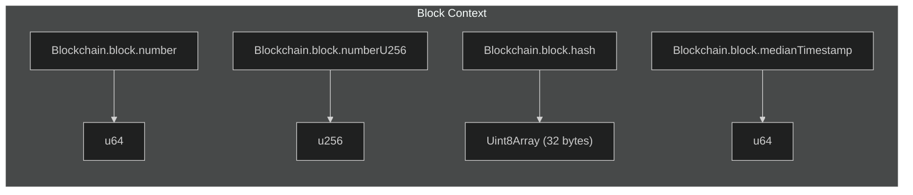
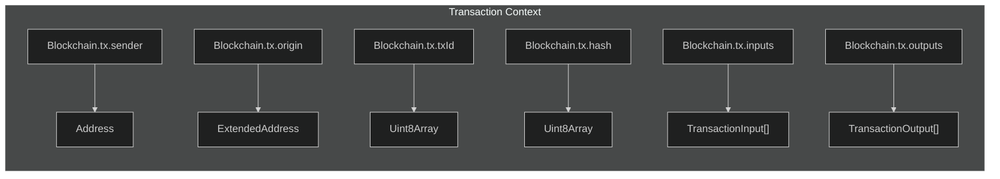
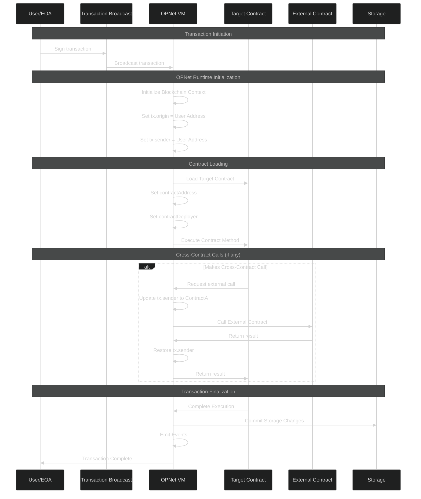
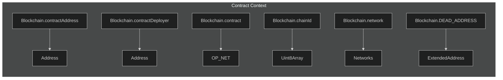
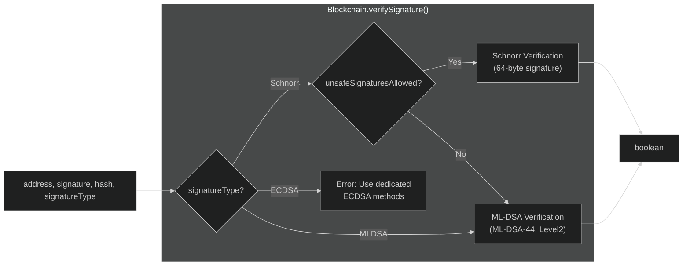
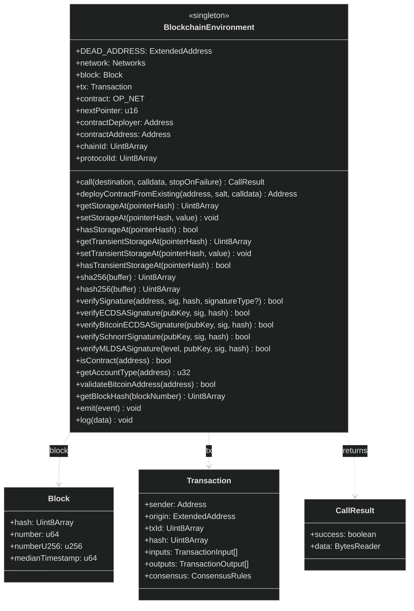

# Blockchain Environment

The `Blockchain` object is the primary interface for interacting with the OPNet runtime. It provides access to block information, transaction context, storage operations, cryptographic functions, and cross-contract calls.

## Overview

```typescript
import { Blockchain } from '@btc-vision/btc-runtime/runtime';
```

The `Blockchain` object is globally available in all contracts and provides:

| Category | Description |
|----------|-------------|
| **Block Context** | Current block information (height, hash, timestamp) |
| **Transaction Context** | Sender, origin, inputs, outputs |
| **Contract Context** | Contract address, deployer, identity |
| **Storage** | Read/write persistent and transient storage |
| **Pointers** | Allocate storage slots |
| **Cross-Contract Calls** | Call other contracts |
| **Cryptography** | Hashing and signature verification |
| **Events** | Emit events |

## Block Context

Access information about the current block:

```typescript
// Current block number (height)
const blockNumber: u64 = Blockchain.block.number;

// Block number as u256
const blockNumberU256: u256 = Blockchain.block.numberU256;

// Block hash
const blockHash: Uint8Array = Blockchain.block.hash;

// Median time past (consensus timestamp)
const timestamp: u64 = Blockchain.block.medianTimestamp;
```



### Solidity Comparison

| Solidity | OPNet | Notes |
|----------|-------|-------|
| `block.number` | `Blockchain.block.number` | Current block height |
| `block.timestamp` | `Blockchain.block.medianTimestamp` | OPNet uses Median Time Past |
| `blockhash(n)` | `Blockchain.getBlockHash(n)` | Historical block hash |

### Median Time Past

OPNet uses **Median Time Past (MTP)** instead of raw block timestamps. MTP is the median of the last 11 block timestamps, providing more reliable time measurements that are resistant to miner manipulation.

```typescript
// Get current timestamp (median time past)
const currentTime: u64 = Blockchain.block.medianTimestamp;

// Time-based logic
const ONE_HOUR: u64 = 3600;
if (currentTime > this.deadline.value) {
    throw new Revert('Deadline passed');
}
```

## Transaction Context

Access information about the current transaction:

```typescript
// Immediate caller (the address that called this contract)
const sender: Address = Blockchain.tx.sender;

// Original transaction signer (EOA that initiated the transaction)
// Note: origin is ExtendedAddress for quantum-resistant key support
const origin: ExtendedAddress = Blockchain.tx.origin;

// Transaction ID and hash
const txId: Uint8Array = Blockchain.tx.txId;
const txHash: Uint8Array = Blockchain.tx.hash;

// Transaction inputs and outputs (UTXOs)
const inputs: TransactionInput[] = Blockchain.tx.inputs;
const outputs: TransactionOutput[] = Blockchain.tx.outputs;

// Consensus rules for current transaction
const consensus: ConsensusRules = Blockchain.tx.consensus;
```



### sender vs origin

This distinction is critical for security:

```
👤 User (EOA) --> Contract A --> Contract B
                 origin=User     origin=User
                 sender=User     sender=ContractA
```

```typescript
// sender: The immediate caller (Address type)
// - Use for most authorization checks
// - Changes with each contract call

// origin: The original transaction signer (ExtendedAddress type)
// - Always the EOA that signed the transaction
// - Stays constant through the call chain
// - Supports quantum-resistant keys (ML-DSA)
// - Be careful: using origin can enable phishing attacks!
```

### Solidity Comparison

| Solidity | OPNet | Notes |
|----------|-------|-------|
| `msg.sender` | `Blockchain.tx.sender` | Immediate caller |
| `tx.origin` | `Blockchain.tx.origin` | Original signer (ExtendedAddress) |
| `address(this)` | `Blockchain.contractAddress` | This contract's address |
| N/A | `Blockchain.contractDeployer` | Who deployed the contract |

### Contract Execution Context Flow



### Security Warning

```typescript
// DANGEROUS: Using origin for authorization
@method()
public withdraw(calldata: Calldata): BytesWriter {
    // BAD: Allows phishing attacks through malicious contracts
    if (Blockchain.tx.origin.equals(this.owner)) {
        // ...
    }
}

// SAFE: Using sender for authorization
@method()
public withdraw(calldata: Calldata): BytesWriter {
    // GOOD: Only direct caller can access
    if (Blockchain.tx.sender.equals(this.owner)) {
        // ...
    }
}
```

## Contract Context

Access contract metadata:

```typescript
// This contract's address
const address: Address = Blockchain.contractAddress;

// Contract deployer address
const deployer: Address = Blockchain.contractDeployer;

// Current contract instance
const contract: OP_NET = Blockchain.contract;

// Chain ID (for replay protection)
const chainId: Uint8Array = Blockchain.chainId;

// Protocol ID
const protocolId: Uint8Array = Blockchain.protocolId;

// Current network
const network: Networks = Blockchain.network;

// Dead address for burns
const deadAddress: ExtendedAddress = Blockchain.DEAD_ADDRESS;
```



## Storage Operations

### Persistent Storage

Direct storage access (low-level):

```typescript
import { encodePointer } from '@btc-vision/btc-runtime/runtime';

// Create storage key from pointer and subPointer
const pointerHash = encodePointer(pointer, subPointer);

// Write to storage
Blockchain.setStorageAt(pointerHash, value.toUint8Array(true));

// Read from storage
const stored = Blockchain.getStorageAt(pointerHash);
const value = u256.fromUint8ArrayBE(stored);

// Check if storage slot has value
const hasValue: bool = Blockchain.hasStorageAt(pointerHash);
```

### Transient Storage

Transient storage is cleared after each transaction (useful for reentrancy guards):

```typescript
// Write to transient storage
Blockchain.setTransientStorageAt(pointerHash, value);

// Read from transient storage
const transientValue = Blockchain.getTransientStorageAt(pointerHash);

// Check if transient storage slot has value
const hasTransient: bool = Blockchain.hasTransientStorageAt(pointerHash);
```

**Warning:** Transient storage is NOT CURRENTLY ENABLED IN PRODUCTION. It is experimental and only available in the testing framework.

**Note:** For most use cases, use the typed storage classes like `StoredU256`, `StoredString`, etc. Direct storage access is for advanced scenarios.

See [Storage System](./storage-system.md) for detailed information.

## Pointer Allocation

Allocate storage pointers for your contract:

```typescript
// Get the next available pointer
const myPointer: u16 = Blockchain.nextPointer;

// Use it for storage
private balancePointer: u16 = Blockchain.nextPointer;
private allowancePointer: u16 = Blockchain.nextPointer;
```

Each `nextPointer` call returns a unique `u16` value. Pointers are allocated sequentially starting from 1. Limited to 65,535 storage slots per contract.

See [Pointers](./pointers.md) for more details.

## Cross-Contract Calls

Call other contracts:

```typescript
import { Blockchain, Address, BytesWriter, CallResult } from '@btc-vision/btc-runtime/runtime';

// Prepare the call
const targetContract: Address = /* ... */;
const calldata: BytesWriter = /* encoded call data */;
const stopOnFailure: bool = true;

// Make the call
const result: CallResult = Blockchain.call(targetContract, calldata, stopOnFailure);

// Handle the result
if (result.success) {
    const returnData = result.data; // BytesReader
    // Process return data...
} else {
    throw new Revert('External call failed');
}
```

### Call Parameters

| Parameter | Type | Description |
|-----------|------|-------------|
| `destinationContract` | `Address` | Contract to call |
| `calldata` | `BytesWriter` | Encoded function call |
| `stopExecutionOnFailure` | `boolean` | If true (default), revert entire transaction on failure |

### Cross-Contract Call Sequence


### Solidity Comparison

```solidity
// Solidity
(bool success, bytes memory data) = target.call(calldata);

// OPNet
const result = Blockchain.call(target, calldata, true);
// result.success: boolean
// result.data: BytesReader
```

See [Cross-Contract Calls](../advanced/cross-contract-calls.md) for advanced usage.

## Contract Deployment

Deploy new contracts from existing templates:

```typescript
// Deploy a new contract using an existing contract as template
const newContractAddress: Address = Blockchain.deployContractFromExisting(
    templateAddress,  // Address of existing contract to clone
    salt,             // u256 salt for deterministic address
    constructorData   // BytesWriter with constructor parameters
);
```

This uses CREATE2-style deterministic addressing: same salt + template = same address.

## Cryptographic Operations

### SHA256 Hashing

```typescript
// Single SHA256
const hash: Uint8Array = Blockchain.sha256(data);

// Double SHA256 (hash256 - common in Bitcoin)
const doubleHash: Uint8Array = Blockchain.hash256(data);
```

### Signature Verification

OPNet supports Schnorr, ECDSA (secp256k1), and quantum-resistant ML-DSA signatures:

```typescript
import { SignaturesMethods } from '@btc-vision/btc-runtime/runtime';

// Recommended: Use consensus-aware verification
// Automatically selects Schnorr or ML-DSA based on consensus rules
const isValid: bool = Blockchain.verifySignature(
    address,    // ExtendedAddress
    signature,  // Uint8Array
    hash        // Uint8Array (32 bytes)
);

// Force ML-DSA verification
const isValidMLDSA: bool = Blockchain.verifySignature(
    address,
    signature,
    hash,
    SignaturesMethods.MLDSA  // Force quantum-resistant ML-DSA
);
```



#### ECDSA Verification (Deprecated)

```typescript
// Ethereum ecrecover model (65-byte signature: r32 || s32 || v1)
const isValid: bool = Blockchain.verifyECDSASignature(
    publicKey,   // secp256k1 key (33, 64, or 65 bytes)
    signature,   // 65-byte Ethereum ECDSA signature
    hash         // 32-byte message hash
);

// Bitcoin direct verify model (64-byte compact signature: r32 || s32)
const isValid: bool = Blockchain.verifyBitcoinECDSASignature(
    publicKey,   // secp256k1 key (33, 64, or 65 bytes)
    signature,   // 64-byte compact ECDSA signature
    hash         // 32-byte message hash
);
```

> **Warning:** ECDSA methods are deprecated and only available when `UNSAFE_QUANTUM_SIGNATURES_ALLOWED` consensus flag is set. Migrate to ML-DSA for quantum security.

#### Legacy Methods (Deprecated)

```typescript
// Verify Schnorr signature directly (deprecated)
const isValid: bool = Blockchain.verifySchnorrSignature(
    publicKey,   // ExtendedAddress
    signature,   // Uint8Array (64 bytes)
    hash         // Uint8Array (32 bytes)
);

// Verify ML-DSA signature with specific security level
const isValidQuantum: bool = Blockchain.verifyMLDSASignature(
    MLDSASecurityLevel.Level2,  // Level2, Level3, or Level5
    publicKey,   // Uint8Array (size depends on level)
    signature,   // Uint8Array (size depends on level)
    hash         // Uint8Array (32 bytes)
);
```

ML-DSA Security Levels:
- **Level2 (ML-DSA-44)**: 1312-byte public key, 2420-byte signature
- **Level3 (ML-DSA-65)**: 1952-byte public key, 3309-byte signature
- **Level5 (ML-DSA-87)**: 2592-byte public key, 4627-byte signature

### Keccak-256 Hashing

OPNet includes an Ethereum-compatible Keccak-256 implementation (original Keccak, not NIST SHA-3):

```typescript
import { keccak256, keccak256Concat, functionSelector, ethAddressFromPubKey } from '@btc-vision/btc-runtime/runtime';

// Basic keccak256 hash
const hash: Uint8Array = keccak256(data);  // 32 bytes

// Hash concatenated byte arrays
const hash2: Uint8Array = keccak256Concat(a, b);

// Ethereum function selector (4 bytes)
const sel: Uint8Array = functionSelector('transfer(address,uint256)');

// Derive Ethereum address from 64-byte uncompressed public key
const addr: Uint8Array = ethAddressFromPubKey(pubkey64);  // 20 bytes
```

See [Signature Verification](../advanced/signature-verification.md) for details.

## Utility Methods

### Account Type Check

```typescript
// Check if an address is a contract
const isContract: bool = Blockchain.isContract(address);

// Get account type code (0 = EOA, >0 = contract type)
const accountType: u32 = Blockchain.getAccountType(address);
```

### Bitcoin Address Validation

```typescript
// Validate a Bitcoin address for the current network
const isValid: bool = Blockchain.validateBitcoinAddress(addressString);
```

### Block Hash Lookup

```typescript
// Get historical block hash (limited to ~256 recent blocks)
const oldBlockHash: Uint8Array = Blockchain.getBlockHash(blockNumber);
```

### Logging (Testing Only)

```typescript
// Log debug messages (only works in unit testing framework)
Blockchain.log("Debug message");
```

**Warning:** `log()` is ONLY available in the unit testing framework. It will fail in production or testnet environments.

## Event Emission

Emit events for off-chain indexing:

```typescript
import { NetEvent } from '@btc-vision/btc-runtime/runtime';

// Emit an event
Blockchain.emit(new TransferEvent(from, to, amount));
```

See [Events](./events.md) for complete event documentation.

## Blockchain Singleton Architecture



## Example: Using Blockchain in a Contract

```typescript
import { u256 } from '@btc-vision/as-bignum/assembly';
import {
    OP_NET,
    Blockchain,
    Calldata,
    BytesWriter,
    StoredU256,
    Revert,
    EMPTY_POINTER,
    ABIDataTypes,
} from '@btc-vision/btc-runtime/runtime';

@final
export class MyContract extends OP_NET {
    // Storage pointer declaration
    private readonly lastUpdatePointer: u16 = Blockchain.nextPointer;
    private readonly lastUpdate: StoredU256 = new StoredU256(
        this.lastUpdatePointer,
        EMPTY_POINTER
    );

    public constructor() {
        super();
    }

    public override onDeployment(_calldata: Calldata): void {
        // Store deployment block
        this.lastUpdate.value = u256.fromU64(Blockchain.block.number);
    }

    @method()
    public doSomething(calldata: Calldata): BytesWriter {
        // Access control
        this.onlyDeployer(Blockchain.tx.sender);

        // Time check
        const now = Blockchain.block.medianTimestamp;
        const lastBlock = this.lastUpdate.value.toU64();
        const currentBlock = Blockchain.block.number;

        // Must wait at least 10 blocks
        if (currentBlock - lastBlock < 10) {
            throw new Revert('Must wait 10 blocks');
        }

        // Update timestamp
        this.lastUpdate.value = u256.fromU64(currentBlock);

        return new BytesWriter(0);
    }
}
```

## Summary

| Property/Method | Returns | Description |
|-----------------|---------|-------------|
| `Blockchain.block.number` | `u64` | Current block height |
| `Blockchain.block.numberU256` | `u256` | Current block height as u256 |
| `Blockchain.block.hash` | `Uint8Array` | Current block hash |
| `Blockchain.block.medianTimestamp` | `u64` | Median time past |
| `Blockchain.tx.sender` | `Address` | Immediate caller |
| `Blockchain.tx.origin` | `ExtendedAddress` | Original signer |
| `Blockchain.tx.txId` | `Uint8Array` | Transaction ID |
| `Blockchain.tx.hash` | `Uint8Array` | Transaction hash |
| `Blockchain.tx.inputs` | `TransactionInput[]` | Transaction inputs |
| `Blockchain.tx.outputs` | `TransactionOutput[]` | Transaction outputs |
| `Blockchain.tx.consensus` | `ConsensusRules` | Consensus rules |
| `Blockchain.contract` | `OP_NET` | Current contract instance |
| `Blockchain.contractAddress` | `Address` | This contract's address |
| `Blockchain.contractDeployer` | `Address` | Contract deployer |
| `Blockchain.chainId` | `Uint8Array` | Chain identifier |
| `Blockchain.protocolId` | `Uint8Array` | Protocol identifier |
| `Blockchain.network` | `Networks` | Current network |
| `Blockchain.DEAD_ADDRESS` | `ExtendedAddress` | Burn address |
| `Blockchain.nextPointer` | `u16` | Next storage pointer |
| `Blockchain.call()` | `CallResult` | Cross-contract call |
| `Blockchain.deployContractFromExisting()` | `Address` | Deploy new contract |
| `Blockchain.getStorageAt()` | `Uint8Array` | Read persistent storage |
| `Blockchain.setStorageAt()` | `void` | Write persistent storage |
| `Blockchain.hasStorageAt()` | `bool` | Check storage existence |
| `Blockchain.getTransientStorageAt()` | `Uint8Array` | Read transient storage |
| `Blockchain.setTransientStorageAt()` | `void` | Write transient storage |
| `Blockchain.hasTransientStorageAt()` | `bool` | Check transient storage existence |
| `Blockchain.sha256()` | `Uint8Array` | SHA256 hash |
| `Blockchain.hash256()` | `Uint8Array` | Double SHA256 |
| `Blockchain.verifySignature()` | `bool` | Consensus-aware signature verification |
| `Blockchain.verifyECDSASignature()` | `bool` | ECDSA Ethereum ecrecover verification (deprecated) |
| `Blockchain.verifyBitcoinECDSASignature()` | `bool` | ECDSA Bitcoin direct verification (deprecated) |
| `Blockchain.verifySchnorrSignature()` | `bool` | Schnorr verification (deprecated) |
| `Blockchain.verifyMLDSASignature()` | `bool` | ML-DSA verification |
| `Blockchain.isContract()` | `bool` | Check if address is contract |
| `Blockchain.getAccountType()` | `u32` | Get account type code |
| `Blockchain.validateBitcoinAddress()` | `bool` | Validate Bitcoin address |
| `Blockchain.getBlockHash()` | `Uint8Array` | Historical block hash |
| `Blockchain.emit()` | `void` | Emit event |
| `Blockchain.log()` | `void` | Debug logging (testing only) |

---

**Navigation:**
- Previous: [Project Structure](../getting-started/project-structure.md)
- Next: [Storage System](./storage-system.md)
