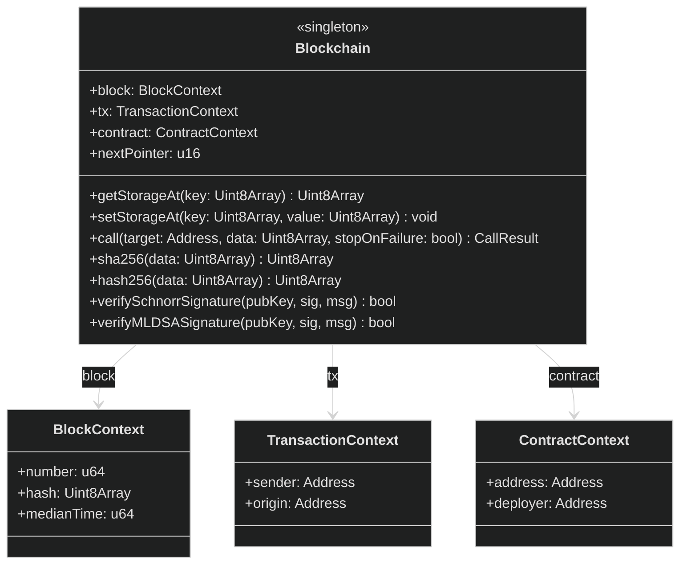
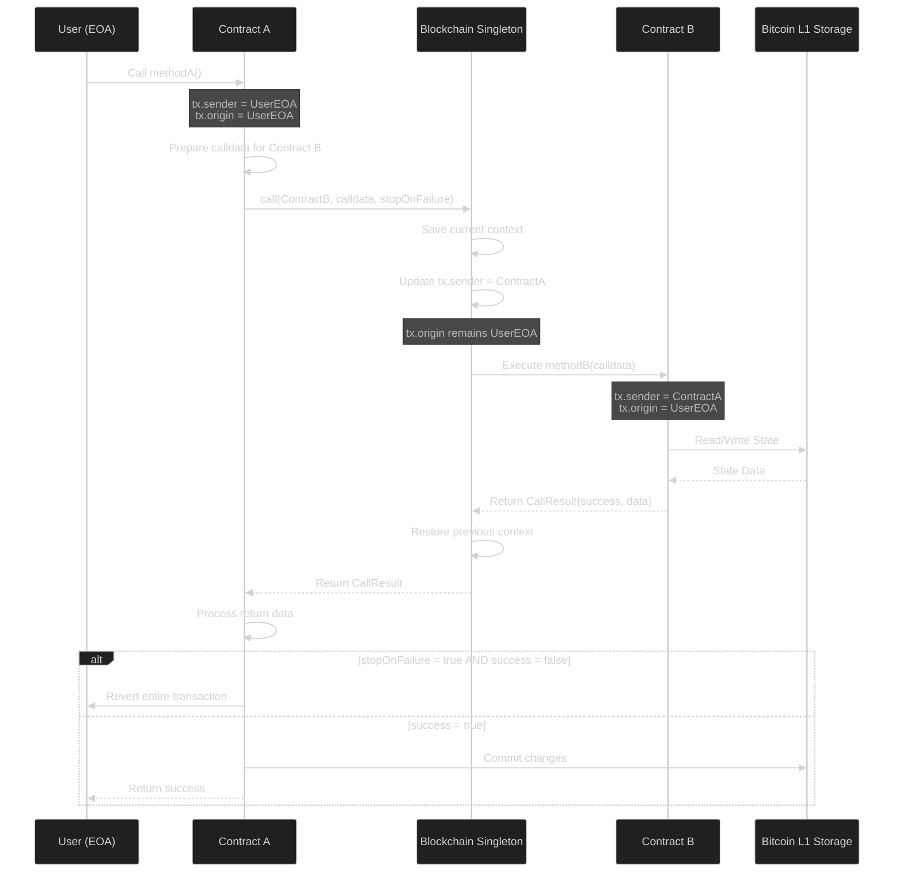

# Blockchain Environment

The `Blockchain` object is the primary interface for interacting with the OPNet runtime. It provides access to block information, transaction context, storage operations, cryptographic functions, and cross-contract calls.

## Overview

```typescript
import { Blockchain } from '@btc-vision/btc-runtime/runtime';
```

The `Blockchain` object is globally available in all contracts and provides:

| Category | Description |
|----------|-------------|
| **Block Context** | Current block information (height, hash, timestamp) |
| **Transaction Context** | Sender, origin, contract address |
| **Storage** | Read/write persistent storage |
| **Pointers** | Allocate storage slots |
| **Cross-Contract Calls** | Call other contracts |
| **Cryptography** | Hashing and signature verification |
| **Events** | Emit events |

### Blockchain Singleton Architecture



## Block Context

Access information about the current block:

```typescript
// Current block number (height)
const blockNumber: u64 = Blockchain.block.number;

// Block hash
const blockHash: Uint8Array = Blockchain.block.hash;

// Median time past (consensus timestamp)
const timestamp: u64 = Blockchain.block.medianTime;
```

### Solidity Comparison

| Solidity | OPNet |
|----------|-------|
| `block.number` | `Blockchain.block.number` |
| `block.timestamp` | `Blockchain.block.medianTime` |
| `blockhash(n)` | `Blockchain.block.hash` (current only) |

### Median Time Past

OPNet uses **Median Time Past (MTP)** instead of raw block timestamps. MTP is the median of the last 11 block timestamps, providing more reliable time measurements that are resistant to miner manipulation.

```typescript
// Get current timestamp (median time past)
const currentTime: u64 = Blockchain.block.medianTime;

// Time-based logic
const ONE_HOUR: u64 = 3600;
if (currentTime > this.deadline.value) {
    throw new Revert('Deadline passed');
}
```

## Transaction Context

Access information about the current transaction:

```typescript
// Immediate caller (the address that called this contract)
const sender: Address = Blockchain.tx.sender;

// Original transaction signer (EOA that initiated the transaction)
const origin: Address = Blockchain.tx.origin;

// This contract's address
const self: Address = Blockchain.contract.address;

// Contract deployer
const deployer: Address = Blockchain.contract.deployer;
```

### sender vs origin

This distinction is critical for security:

```
User (EOA) --> Contract A --> Contract B
              origin=User     origin=User
              sender=User     sender=ContractA
```

```typescript
// sender: The immediate caller
// - Use for most authorization checks
// - Changes with each contract call

// origin: The original transaction signer
// - Always the EOA that signed the transaction
// - Stays constant through the call chain
// - Be careful: using origin can enable phishing attacks!
```

### Contract Execution Context Flow

```mermaid
---
config:
  theme: dark
---
flowchart LR
    subgraph Transaction["Transaction Initiation"]
        User["User/EOA<br/>Signs Transaction"]
        TX["Transaction Broadcast"]
        User --> TX
    end

    subgraph Runtime["OPNet Runtime"]
        VM["OPNet VM"]
        Init["Initialize Blockchain Context"]
        SetOrigin["Set tx.origin = User Address"]
        SetSender["Set tx.sender = User Address"]
        VM --> Init
        Init --> SetOrigin
        SetOrigin --> SetSender
    end

    subgraph Contract["Contract Loading"]
        LoadContract["Load Target Contract"]
        SetContractAddr["Set contract.address"]
        SetDeployer["Set contract.deployer"]
        Execute["Execute Contract Method"]
        LoadContract --> SetContractAddr
        SetContractAddr --> SetDeployer
        SetDeployer --> Execute
    end

    subgraph CrossCall["Cross-Contract Calls"]
        CheckCrossCall{"Makes Cross-<br/>Contract Call?"}
        UpdateSender["Update tx.sender<br/>to current contract"]
        CallExternal["Call External Contract"]
        RestoreSender["Restore tx.sender"]
        CheckCrossCall -->|Yes| UpdateSender
        UpdateSender --> CallExternal
        CallExternal --> RestoreSender
    end

    subgraph Finalization["Transaction Finalization"]
        Complete["Complete Execution"]
        Commit["Commit Storage Changes"]
        EmitEvents["Emit Events"]
        End["Transaction Complete"]
        Complete --> Commit
        Commit --> EmitEvents
        EmitEvents --> End
    end

    TX --> VM
    SetSender --> LoadContract
    Execute --> CheckCrossCall
    CheckCrossCall -->|No| Complete
    RestoreSender --> Complete
```



### Solidity Comparison

| Solidity | OPNet |
|----------|-------|
| `msg.sender` | `Blockchain.tx.sender` |
| `tx.origin` | `Blockchain.tx.origin` |
| `address(this)` | `Blockchain.contract.address` |

### Security Warning

```typescript
// DANGEROUS: Using origin for authorization
@method()
public withdraw(calldata: Calldata): BytesWriter {
    // BAD: Allows phishing attacks through malicious contracts
    if (Blockchain.tx.origin.equals(this.owner)) {
        // ...
    }
}

// SAFE: Using sender for authorization
@method()
public withdraw(calldata: Calldata): BytesWriter {
    // GOOD: Only direct caller can access
    if (Blockchain.tx.sender.equals(this.owner)) {
        // ...
    }
}
```

## Storage Operations

Direct storage access (low-level):

```typescript
import { encodePointer } from '@btc-vision/btc-runtime/runtime';

// Create storage key from pointer and subPointer
const pointerHash = encodePointer(pointer, subPointer);

// Write to storage
Blockchain.setStorageAt(pointerHash, value.toUint8Array(true));

// Read from storage
const stored = Blockchain.getStorageAt(pointerHash);
const value = u256.fromUint8ArrayBE(stored);
```

**Note:** For most use cases, use the typed storage classes like `StoredU256`, `StoredString`, etc. Direct storage access is for advanced scenarios.

See [Storage System](./storage-system.md) for detailed information.

## Pointer Allocation

Allocate storage pointers for your contract:

```typescript
// Get the next available pointer
const myPointer: u16 = Blockchain.nextPointer;

// Use it for storage
private balancePointer: u16 = Blockchain.nextPointer;
private allowancePointer: u16 = Blockchain.nextPointer;
```

Each `nextPointer` call returns a unique `u16` value. Pointers are allocated sequentially starting from a base value.

See [Pointers](./pointers.md) for more details.

## Cross-Contract Calls

Call other contracts:

```typescript
import { Blockchain, Address, Calldata, CallResult } from '@btc-vision/btc-runtime/runtime';

// Prepare the call
const targetContract: Address = /* ... */;
const calldata: Uint8Array = /* encoded call data */;
const stopOnFailure: bool = true;

// Make the call
const result: CallResult = Blockchain.call(targetContract, calldata, stopOnFailure);

// Handle the result
if (result.success) {
    const returnData = result.data;
    // Process return data...
} else {
    throw new Revert('External call failed');
}
```

### Call Parameters

| Parameter | Type | Description |
|-----------|------|-------------|
| `target` | `Address` | Contract to call |
| `calldata` | `Uint8Array` | Encoded function call |
| `stopOnFailure` | `bool` | If true, revert entire transaction on failure |

### Cross-Contract Call Sequence



### Solidity Comparison

```solidity
// Solidity
(bool success, bytes memory data) = target.call(calldata);

// OPNet
const result = Blockchain.call(target, calldata, true);
```

See [Cross-Contract Calls](../advanced/cross-contract-calls.md) for advanced usage.

## Cryptographic Operations

### SHA256 Hashing

```typescript
// Single SHA256
const hash: Uint8Array = Blockchain.sha256(data);

// Double SHA256 (hash256 - common in Bitcoin)
const doubleHash: Uint8Array = Blockchain.hash256(data);
```

### Signature Verification

```typescript
// Verify Schnorr signature
const isValid: bool = Blockchain.verifySchnorrSignature(
    publicKey,
    signature,
    message
);

// Verify ML-DSA signature (quantum-resistant)
const isValidQuantum: bool = Blockchain.verifyMLDSASignature(
    publicKey,
    signature,
    message
);
```

See [Signature Verification](../advanced/signature-verification.md) for details.

## Event Emission

Emit events for off-chain indexing:

```typescript
import { NetEvent } from '@btc-vision/btc-runtime/runtime';

// In your contract
this.emitEvent(new TransferEvent(from, to, amount));
```

See [Events](./events.md) for complete event documentation.

## Contract Identity

Access contract metadata:

```typescript
// This contract's address
const address: Address = Blockchain.contract.address;

// Contract deployer address
const deployer: Address = Blockchain.contract.deployer;

// Check if sender is deployer
this.onlyDeployer(Blockchain.tx.sender);
```

## Example: Using Blockchain in a Contract

```typescript
import { u256 } from '@btc-vision/as-bignum/assembly';
import {
    ABIDataTypes,
    OP_NET,
    Blockchain,
    Address,
    Calldata,
    BytesWriter,
    SafeMath,
    encodeSelector,
    StoredU256,
    Revert,
} from '@btc-vision/btc-runtime/runtime';

// Define method selectors (sha256 first 4 bytes of method signature)
const DO_SOMETHING_SELECTOR: u32 = 0x6b9f96ea;  // doSomething()

@final
export class MyContract extends OP_NET {
    // Storage
    private lastUpdatePointer: u16 = Blockchain.nextPointer;
    private lastUpdate: StoredU256 = new StoredU256(
        this.lastUpdatePointer,
        EMPTY_POINTER
    );

    public constructor() {
        super();
    }

    public override onDeployment(_calldata: Calldata): void {
        // Store deployment block
        this.lastUpdate.value = u256.fromU64(Blockchain.block.number);
    }

    @method()
    public doSomething(calldata: Calldata): BytesWriter {
        // Access control
        this.onlyDeployer(Blockchain.tx.sender);

        // Time check
        const now = Blockchain.block.medianTime;
        const lastBlock = this.lastUpdate.value.toU64();
        const currentBlock = Blockchain.block.number;

        // Must wait at least 10 blocks
        if (currentBlock - lastBlock < 10) {
            throw new Revert('Must wait 10 blocks');
        }

        // Update timestamp
        this.lastUpdate.value = u256.fromU64(currentBlock);

        return new BytesWriter(0);
    }

    public override execute(method: u32, calldata: Calldata): BytesWriter {
        switch (method) {
            case DO_SOMETHING_SELECTOR:
                return this.doSomething(calldata);
            default:
                return super.execute(method, calldata);
        }
    }
}
```

## Summary

| Property/Method | Returns | Description |
|-----------------|---------|-------------|
| `Blockchain.block.number` | `u64` | Current block height |
| `Blockchain.block.hash` | `Uint8Array` | Current block hash |
| `Blockchain.block.medianTime` | `u64` | Median time past |
| `Blockchain.tx.sender` | `Address` | Immediate caller |
| `Blockchain.tx.origin` | `Address` | Original signer |
| `Blockchain.contract.address` | `Address` | This contract |
| `Blockchain.contract.deployer` | `Address` | Contract deployer |
| `Blockchain.nextPointer` | `u16` | Next storage pointer |
| `Blockchain.call()` | `CallResult` | Cross-contract call |
| `Blockchain.sha256()` | `Uint8Array` | SHA256 hash |
| `Blockchain.hash256()` | `Uint8Array` | Double SHA256 |

---

**Navigation:**
- Previous: [Project Structure](../getting-started/project-structure.md)
- Next: [Storage System](./storage-system.md)
