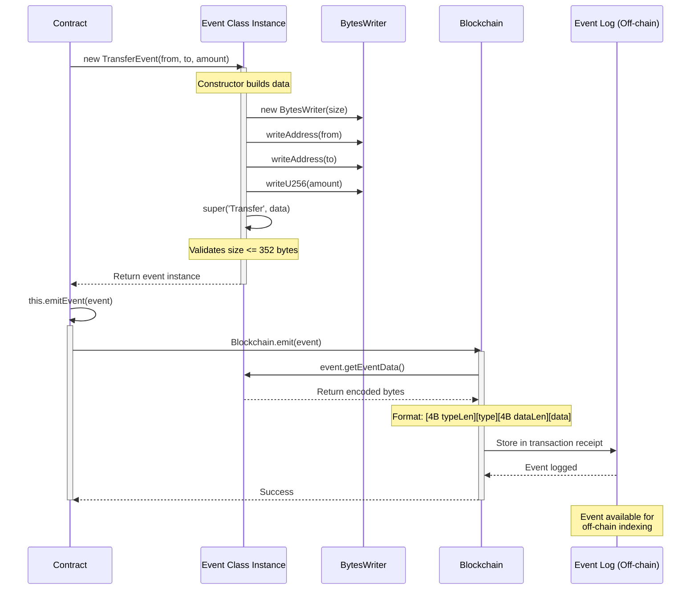
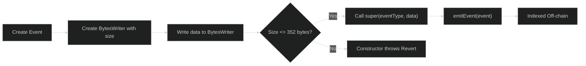

# Events

Events in OPNet allow contracts to emit signals that can be observed by off-chain systems. They're essential for tracking state changes, building user interfaces, and indexing blockchain data.

## Overview

Events are:
- **Write-only** - Contracts can emit but not read events
- **Indexed** - Off-chain systems can filter and search events
- **Size-limited** - Maximum 352 bytes per event
- **Lightweight** - Less overhead than storage writes

## Creating Events

### Event Class Hierarchy

```mermaid
classDiagram
    class NetEvent {
        <<abstract>>
        +eventType: string
        #data: BytesWriter
        +length: u32
        +getEventData() Uint8Array
    }

    class TransferredEvent {
        +constructor(operator, from, to, amount)
        eventType = 'Transferred'
    }

    class TransferredSingleEvent {
        +constructor(operator, from, to, id, value)
        eventType = 'TransferredSingle'
    }

    class TransferredBatchEvent {
        +constructor(operator, from, to, ids, values)
        eventType = 'TransferredBatch'
    }

    class ApprovedEvent {
        +constructor(owner, spender, amount)
        eventType = 'Approved'
    }

    class ApprovedForAllEvent {
        +constructor(account, operator, approved)
        eventType = 'ApprovedForAll'
    }

    class MintedEvent {
        +constructor(to, amount)
        eventType = 'Minted'
    }

    class BurnedEvent {
        +constructor(from, amount)
        eventType = 'Burned'
    }

    class URIEvent {
        +constructor(value, id)
        eventType = 'URI'
    }

    class CustomEvent {
        +constructor(...)
    }

    NetEvent <|-- TransferredEvent
    NetEvent <|-- TransferredSingleEvent
    NetEvent <|-- TransferredBatchEvent
    NetEvent <|-- ApprovedEvent
    NetEvent <|-- ApprovedForAllEvent
    NetEvent <|-- MintedEvent
    NetEvent <|-- BurnedEvent
    NetEvent <|-- URIEvent
    NetEvent <|-- CustomEvent
```



### Using Predefined Events

OPNet provides common events out of the box:

```typescript
import {
    TransferredEvent,
    TransferredSingleEvent,
    TransferredBatchEvent,
    ApprovedEvent,
    ApprovedForAllEvent,
    MintedEvent,
    BurnedEvent,
    URIEvent,
} from '@btc-vision/btc-runtime/runtime';

// Emit a transfer event (operator is the caller initiating the transfer)
// Event type: 'Transferred'
this.emitEvent(new TransferredEvent(operator, from, to, amount));

// Emit a single token transfer (ERC1155-style)
// Event type: 'TransferredSingle'
this.emitEvent(new TransferredSingleEvent(operator, from, to, tokenId, amount));

// Emit a batch token transfer (ERC1155-style, max 3 items)
// Event type: 'TransferredBatch'
this.emitEvent(new TransferredBatchEvent(operator, from, to, tokenIds, amounts));

// Emit an approval event
// Event type: 'Approved'
this.emitEvent(new ApprovedEvent(owner, spender, amount));

// Emit an operator approval event
// Event type: 'ApprovedForAll'
this.emitEvent(new ApprovedForAllEvent(account, operator, true));

// Emit a mint event
// Event type: 'Minted'
this.emitEvent(new MintedEvent(to, amount));

// Emit a burn event
// Event type: 'Burned'
this.emitEvent(new BurnedEvent(from, amount));

// Emit a URI event (max 200 bytes for URI)
// Event type: 'URI'
this.emitEvent(new URIEvent('https://example.com/token/1', tokenId));
```

### Custom Events

Create custom events by extending `NetEvent`:

```typescript
import { NetEvent, BytesWriter, Address, ADDRESS_BYTE_LENGTH, U256_BYTE_LENGTH } from '@btc-vision/btc-runtime/runtime';
import { u256 } from '@btc-vision/as-bignum/assembly';

@final
export class StakeEvent extends NetEvent {
    public constructor(
        staker: Address,
        amount: u256,
        duration: u64
    ) {
        // Create BytesWriter with appropriate size
        const data: BytesWriter = new BytesWriter(ADDRESS_BYTE_LENGTH + U256_BYTE_LENGTH + 8);
        data.writeAddress(staker);
        data.writeU256(amount);
        data.writeU64(duration);

        super('Stake', data);
    }
}
```

**Solidity Comparison:**

```solidity
// Solidity
event Stake(address indexed staker, uint256 amount, uint64 duration);
```

```typescript
// OPNet
@final
export class StakeEvent extends NetEvent {
    public constructor(staker: Address, amount: u256, duration: u64) {
        const data: BytesWriter = new BytesWriter(ADDRESS_BYTE_LENGTH + U256_BYTE_LENGTH + 8);
        data.writeAddress(staker);
        data.writeU256(amount);
        data.writeU64(duration);
        super('Stake', data);
    }
}
```

### Emitting Events

```typescript
// In your contract method
@method()
public stake(calldata: Calldata): BytesWriter {
    const amount = calldata.readU256();
    const duration = calldata.readU64();

    // ... staking logic ...

    // Emit event
    this.emitEvent(new StakeEvent(
        Blockchain.tx.sender,
        amount,
        duration
    ));

    return new BytesWriter(0);
}
```

### Event Emission Flow



## Event Structure

Every event has:

| Component | Description |
|-----------|-------------|
| **Event Type** | String identifier (e.g., "Transferred", "Approved", "Minted", "Burned") |
| **Data** | Encoded event parameters |
| **Contract** | Address of emitting contract (automatic) |

### Encoding

Events are encoded using `BytesWriter`:

```typescript
@final
export class MyEvent extends NetEvent {
    public constructor(
        value1: u256,
        value2: Address,
        value3: bool
    ) {
        // Calculate size: 32 (u256) + 32 (Address) + 1 (bool) = 65 bytes
        const data: BytesWriter = new BytesWriter(65);
        data.writeU256(value1);     // 32 bytes
        data.writeAddress(value2);  // 32 bytes
        data.writeBoolean(value3);  // 1 byte

        super('MyEvent', data);  // Event type name and data
    }
}
```

### Event Creation Flow



## Size Limit (352 Bytes)

**CRITICAL:** Events cannot exceed 352 bytes of encoded data.

```typescript
// Calculate your event size
// Address: 32 bytes
// u256: 32 bytes
// u64: 8 bytes
// bool: 1 byte
// string: length + content

@final
export class LargeEvent extends NetEvent {
    public constructor(
        addr1: Address, addr2: Address, addr3: Address,
        amount1: u256, amount2: u256, amount3: u256,
        amount4: u256, amount5: u256, amount6: u256,
        timestamp: u64
    ) {
        // Calculate: 3 addresses (96) + 6 u256 (192) + 1 u64 (8) = 296 bytes - OK!
        const data: BytesWriter = new BytesWriter(296);
        data.writeAddress(addr1);    // 32 bytes
        data.writeAddress(addr2);    // 32 bytes
        data.writeAddress(addr3);    // 32 bytes
        data.writeU256(amount1);     // 32 bytes
        data.writeU256(amount2);     // 32 bytes
        data.writeU256(amount3);     // 32 bytes
        data.writeU256(amount4);     // 32 bytes
        data.writeU256(amount5);     // 32 bytes
        data.writeU256(amount6);     // 32 bytes
        data.writeU64(timestamp);    // 8 bytes
        super('LargeEvent', data);
    }
}
```

### What If You Exceed the Limit?

```typescript
// This will fail at runtime with "Event data length exceeds maximum length."
@final
export class TooLargeEvent extends NetEvent {
    public constructor(values: u256[]) {
        // Writing 11 x u256 = 352 bytes
        // This is the absolute maximum!
        const data: BytesWriter = new BytesWriter(352);
        for (let i = 0; i < 11; i++) {
            data.writeU256(values[i]);
        }
        super('TooLarge', data);  // Will throw if data exceeds 352 bytes
    }
}
```

**Solutions:**
1. Split into multiple events
2. Only include essential data
3. Use shorter encodings where possible

## Predefined Events

### TransferredEvent

```typescript
// Emitted on token transfers
// Event type: 'Transferred'
new TransferredEvent(operator: Address, from: Address, to: Address, amount: u256)

// Fields:
// - operator: address initiating the transfer
// - from: sender address
// - to: recipient address
// - amount: tokens transferred
```

### TransferredSingleEvent

```typescript
// Emitted on single token transfers (ERC1155-style)
// Event type: 'TransferredSingle'
new TransferredSingleEvent(operator: Address, from: Address, to: Address, id: u256, value: u256)

// Fields:
// - operator: address initiating the transfer
// - from: sender address
// - to: recipient address
// - id: token ID
// - value: amount transferred
```

### TransferredBatchEvent

```typescript
// Emitted on batch token transfers (ERC1155-style)
// Event type: 'TransferredBatch'
// Limited to 3 items due to 352-byte event size limit
new TransferredBatchEvent(operator: Address, from: Address, to: Address, ids: u256[], values: u256[])

// Fields:
// - operator: address initiating the transfer
// - from: sender address
// - to: recipient address
// - ids: array of token IDs (max 3)
// - values: array of amounts (max 3)
```

### ApprovedEvent

```typescript
// Emitted on approval changes
// Event type: 'Approved'
new ApprovedEvent(owner: Address, spender: Address, amount: u256)

// Fields:
// - owner: token owner
// - spender: approved spender
// - amount: approved amount
```

### ApprovedForAllEvent

```typescript
// Emitted on operator approval changes
// Event type: 'ApprovedForAll'
new ApprovedForAllEvent(account: Address, operator: Address, approved: boolean)

// Fields:
// - account: token owner granting approval
// - operator: address being approved/revoked
// - approved: true if approved, false if revoked
```

### MintedEvent

```typescript
// Emitted when tokens are minted
// Event type: 'Minted'
new MintedEvent(to: Address, amount: u256)

// Fields:
// - to: recipient of minted tokens
// - amount: tokens minted
```

### BurnedEvent

```typescript
// Emitted when tokens are burned
// Event type: 'Burned'
new BurnedEvent(from: Address, amount: u256)

// Fields:
// - from: address tokens burned from
// - amount: tokens burned
```

### URIEvent

```typescript
// Emitted when token URI is updated
// Event type: 'URI'
// URI length is limited to 200 bytes
new URIEvent(value: string, id: u256)

// Fields:
// - value: URI string (max 200 bytes)
// - id: token ID
```

## Solidity Comparison

### Event Declaration

```solidity
// Solidity
event Transfer(address indexed from, address indexed to, uint256 value);
```

```typescript
// OPNet - uses predefined TransferredEvent with operator field
// Event type: 'Transferred'
import { TransferredEvent } from '@btc-vision/btc-runtime/runtime';

// Or create a custom transfer event without operator:
@final
export class TransferEvent extends NetEvent {
    public constructor(from: Address, to: Address, value: u256) {
        const data: BytesWriter = new BytesWriter(ADDRESS_BYTE_LENGTH * 2 + U256_BYTE_LENGTH);
        data.writeAddress(from);
        data.writeAddress(to);
        data.writeU256(value);
        super('Transfer', data);
    }
}
```

### Emitting Events

```solidity
// Solidity
emit Transfer(from, to, amount);
```

```typescript
// OPNet - using predefined TransferredEvent (includes operator)
this.emitEvent(new TransferredEvent(Blockchain.tx.sender, from, to, amount));

// Or using custom TransferEvent (without operator)
this.emitEvent(new TransferEvent(from, to, amount));
```

### Indexed Parameters

```solidity
// Solidity: indexed parameters for filtering
event Transfer(address indexed from, address indexed to, uint256 value);

// OPNet: All parameters can be filtered by off-chain indexers
// (no explicit "indexed" keyword needed)
```

## Best Practices

### 1. Event for Every State Change

```typescript
@method()
@emit('Transferred')  // Decorator documents which event this method emits
public transfer(calldata: Calldata): BytesWriter {
    const to = calldata.readAddress();
    const amount = calldata.readU256();
    const from = Blockchain.tx.sender;

    // _transfer internally emits TransferredEvent via createTransferredEvent
    this._transfer(from, to, amount);

    return new BytesWriter(0);
}

// For custom events in your own methods:
@method()
@emit('Staked')
public stake(calldata: Calldata): BytesWriter {
    const amount = calldata.readU256();

    // Update state first
    this._stakes.set(Blockchain.tx.sender, amount);

    // Then emit event
    this.emitEvent(new StakedEvent(Blockchain.tx.sender, amount));

    return new BytesWriter(0);
}
```

### 2. Meaningful Event Names

```typescript
// Good: Descriptive names
@final class TokenStaked extends NetEvent { /* ... */ }
@final class RewardsClaimed extends NetEvent { /* ... */ }
@final class PoolCreated extends NetEvent { /* ... */ }

// Bad: Generic names
@final class Event1 extends NetEvent { /* ... */ }
@final class DataChanged extends NetEvent { /* ... */ }
```

### 3. Include Context

```typescript
// Good: Include relevant context
@final
class SwapExecuted extends NetEvent {
    public constructor(
        user: Address,
        tokenIn: Address,
        tokenOut: Address,
        amountIn: u256,
        amountOut: u256,
        timestamp: u64
    ) {
        const data: BytesWriter = new BytesWriter(ADDRESS_BYTE_LENGTH * 3 + U256_BYTE_LENGTH * 2 + 8);
        data.writeAddress(user);
        data.writeAddress(tokenIn);
        data.writeAddress(tokenOut);
        data.writeU256(amountIn);
        data.writeU256(amountOut);
        data.writeU64(timestamp);
        super('SwapExecuted', data);
    }
}

// Bad: Missing context
@final
class Swap extends NetEvent {
    public constructor(amount: u256) {
        const data: BytesWriter = new BytesWriter(U256_BYTE_LENGTH);
        data.writeU256(amount);
        super('Swap', data);
    }
}
```

### 4. Check Size Before Deployment

```typescript
// Test your event sizes - event.length returns the data size
function testEventSize(): void {
    const event = new MyEvent(/* max size parameters */);

    // The event validates size in the constructor
    // If it exceeds 352 bytes, it will throw a Revert error
    assert(event.length <= 352, 'Event exceeds size limit');
}
```

## Multiple Events

You can emit multiple events in a single transaction:

```typescript
@method()
@emit('Burned')
@emit('Minted')
@emit('FeeCollected')
public complexOperation(calldata: Calldata): BytesWriter {
    // ... logic ...

    // Emit multiple events using predefined events
    this.emitEvent(new BurnedEvent(from, burnAmount));
    this.emitEvent(new MintedEvent(to, mintAmount));
    this.emitEvent(new FeeCollectedEvent(feeRecipient, feeAmount));

    return new BytesWriter(0);
}
```

## Listening to Events (Off-chain)

Events are indexed and can be queried:

```typescript
// Off-chain code (not AssemblyScript)
const events = await indexer.getEvents({
    contract: tokenAddress,
    eventType: 'Transferred',  // Use the event type string from the event class
    fromBlock: 100000,
    toBlock: 'latest',
    filter: {
        from: userAddress
    }
});
```

---

**Navigation:**
- Previous: [Pointers](./pointers.md)
- Next: [Security](./security.md)
