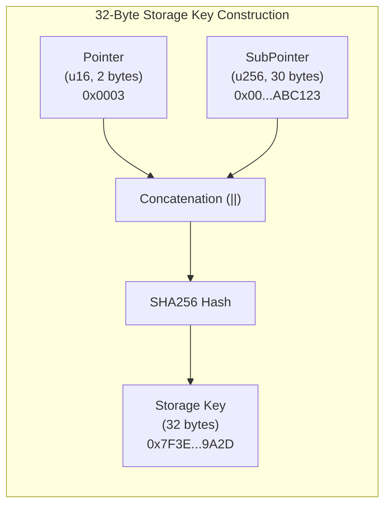
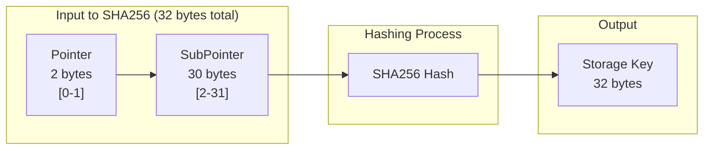
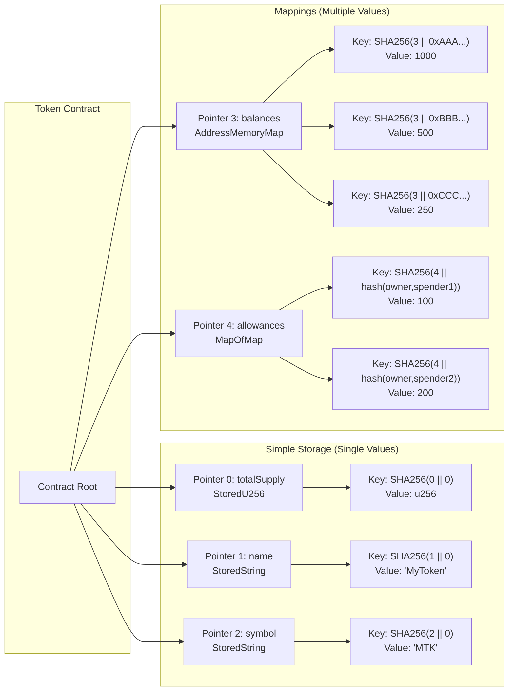
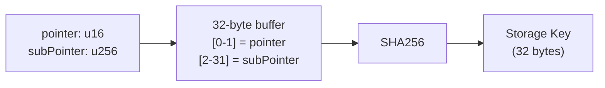

# Pointers

Pointers are the foundation of OPNet's storage system. Understanding how they work is essential for building efficient and secure smart contracts.

## What Are Pointers?

A pointer is a `u16` value (0-65535) that identifies a storage slot in your contract. Combined with an optional `u256` sub-pointer, it creates a unique storage key through SHA256 hashing.

```
Storage Key = SHA256(pointer || subPointer)
```

### Pointer Structure Visualization



### Pointer Byte Layout



## Why Pointers?

OPNet's pointer system provides:

| Benefit | Description |
|---------|-------------|
| **Determinism** | Same inputs always produce same storage keys |
| **Collision Resistance** | SHA256 ensures unique keys |
| **Verifiability** | Storage proofs can be validated off-chain |
| **Explicitness** | Storage layout is explicit and auditable |

## Solidity Comparison

In Solidity, storage slots are assigned implicitly by the compiler. In OPNet, you explicitly allocate pointers at runtime:

```solidity
// Solidity - Implicit slot assignment
contract Token {
    uint256 public totalSupply;              // slot 0 (assigned by compiler)
    string public name;                       // slot 1 (assigned by compiler)
    mapping(address => uint256) balances;    // slot 2 (assigned by compiler)
}
```

```typescript
// OPNet - Explicit pointer allocation
export class Token extends OP_NET {
    private totalSupplyPointer: u16 = Blockchain.nextPointer;  // ~0 (allocated at runtime)
    private namePointer: u16 = Blockchain.nextPointer;          // ~1 (allocated at runtime)
    private balancesPointer: u16 = Blockchain.nextPointer;      // ~2 (allocated at runtime)
}
```

### Storage Key Hashing Comparison

| Solidity | OPNet |
|----------|-------|
| Automatic slot assignment | Explicit pointer allocation |
| Slot 0, 1, 2, ... | `Blockchain.nextPointer` |
| `keccak256(key . slot)` | `SHA256(pointer \|\| subPointer)` |

## Allocating Pointers

### Basic Allocation

Use `Blockchain.nextPointer` to get unique pointers:

```typescript
import { Blockchain } from '@btc-vision/btc-runtime/runtime';

@final
export class MyContract extends OP_NET {
    // Each call returns a unique, sequential u16
    private counterPointer: u16 = Blockchain.nextPointer;     // e.g., 0
    private ownerPointer: u16 = Blockchain.nextPointer;       // e.g., 1
    private balancesPointer: u16 = Blockchain.nextPointer;    // e.g., 2
}
```

### Pointer Range

```
u16 range: 0 to 65,535

Your contract can have up to 65,536 unique pointer slots.
```

### Important Rules

1. **Call `nextPointer` once per storage slot** - Don't reuse pointers
2. **Allocate at class level** - Pointers should be class properties
3. **Order matters** - Pointers are assigned sequentially
4. **Never hardcode** - Always use `Blockchain.nextPointer`

## Pointer vs Sub-Pointer

### Primary Pointer (u16)

The primary pointer identifies the **type** of storage:

```typescript
private balancesPointer: u16 = Blockchain.nextPointer;  // "balances mapping"
private allowancesPointer: u16 = Blockchain.nextPointer; // "allowances mapping"
```

### Sub-Pointer (u256)

The sub-pointer identifies a **specific entry** within that storage type:

```typescript
// balances[address] = amount
// pointer = balancesPointer
// subPointer = address (converted to u256)

const key = SHA256(balancesPointer || addressAsU256);
```

### Visual Example

```
Contract Storage
|
+-- Pointer 0 (totalSupply)
|   +-- SubPointer 0 -> u256 value
|
+-- Pointer 1 (name)
|   +-- SubPointer 0 -> string value
|
+-- Pointer 2 (balances mapping)
|   +-- SubPointer 0xAAA... -> balance of 0xAAA
|   +-- SubPointer 0xBBB... -> balance of 0xBBB
|   +-- SubPointer 0xCCC... -> balance of 0xCCC
|
+-- Pointer 3 (allowances nested mapping)
    +-- SubPointer hash(0xAAA, 0xBBB) -> allowance[AAA][BBB]
    +-- SubPointer hash(0xAAA, 0xCCC) -> allowance[AAA][CCC]
```

### Multiple Storage Variables Example



## Pointer Patterns

### Simple Value

```typescript
import { EMPTY_POINTER } from '@btc-vision/btc-runtime/runtime';

// Single value storage
private totalSupplyPointer: u16 = Blockchain.nextPointer;
private _totalSupply: StoredU256 = new StoredU256(
    this.totalSupplyPointer,
    EMPTY_POINTER
);

// Storage key: SHA256(totalSupplyPointer || 0)
```

### Mapping

```typescript
// mapping(address => uint256)
private balancesPointer: u16 = Blockchain.nextPointer;
private balances: AddressMemoryMap = new AddressMemoryMap(this.balancesPointer);

// For balances[0xABC]:
// Storage key: SHA256(balancesPointer || 0xABC)
```

### Nested Mapping

```typescript
// mapping(address => mapping(address => uint256))
private allowancesPointer: u16 = Blockchain.nextPointer;

// For allowances[owner][spender]:
// SubPointer = SHA256(owner || spender)
// Storage key: SHA256(allowancesPointer || SubPointer)
```

### Array

```typescript
// uint256[] holders
private holdersPointer: u16 = Blockchain.nextPointer;
private holders: StoredU256Array = new StoredU256Array(this.holdersPointer);

// For holders[i]:
// Storage key: SHA256(holdersPointer || i)

// For holders.length:
// Storage key: SHA256(holdersPointer || MAX_U256)  // Special length slot
```

## Advanced: Manual Key Calculation

For advanced use cases, you can calculate storage keys manually:

```typescript
import { Blockchain, encodePointer } from '@btc-vision/btc-runtime/runtime';

// Generate storage key (32-byte hash)
const pointerHash = encodePointer(pointer, subPointer);

// Direct storage access
const stored = Blockchain.getStorageAt(pointerHash);
const value = u256.fromUint8ArrayBE(stored);

// Write to storage
Blockchain.setStorageAt(pointerHash, value.toUint8Array(true));
```

### encodePointer() Function Flow



## Collision Prevention

The SHA256 hashing ensures collision resistance:

```typescript
// Different pointers = different keys
SHA256(0 || 0xABC) != SHA256(1 || 0xABC)

// Different sub-pointers = different keys
SHA256(0 || 0xABC) != SHA256(0 || 0xDEF)

// Even with same total bits
SHA256(0x0001 || 0x00...00) != SHA256(0x0000 || 0x00...01)
```

## Best Practices

### 1. Document Your Pointer Layout

```typescript
/**
 * Storage Layout:
 * Pointer 0: totalSupply (u256)
 * Pointer 1: name (string)
 * Pointer 2: symbol (string)
 * Pointer 3: decimals (u8)
 * Pointer 4: balances (address => u256)
 * Pointer 5: allowances (address => address => u256)
 * Pointer 6: paused (bool)
 */
export class MyToken extends OP20 {
    // ... pointers allocated in this order
}
```

### 2. Group Related Pointers

```typescript
// Token metadata pointers
private namePointer: u16 = Blockchain.nextPointer;
private symbolPointer: u16 = Blockchain.nextPointer;
private decimalsPointer: u16 = Blockchain.nextPointer;

// Balance pointers
private balancesPointer: u16 = Blockchain.nextPointer;
private totalSupplyPointer: u16 = Blockchain.nextPointer;

// Approval pointers
private allowancesPointer: u16 = Blockchain.nextPointer;
```

### 3. Never Reuse Pointers

```typescript
// WRONG: Reusing pointer for different data
private myPointer: u16 = Blockchain.nextPointer;
private valueA: StoredU256 = new StoredU256(this.myPointer, EMPTY_POINTER);
private valueB: StoredU256 = new StoredU256(this.myPointer, EMPTY_POINTER);  // BUG!

// CORRECT: Unique pointer for each
private pointerA: u16 = Blockchain.nextPointer;
private pointerB: u16 = Blockchain.nextPointer;
private valueA: StoredU256 = new StoredU256(this.pointerA, EMPTY_POINTER);
private valueB: StoredU256 = new StoredU256(this.pointerB, EMPTY_POINTER);
```

### 4. Understand Inheritance

When extending contracts, parent pointers are allocated first:

```typescript
// OP20 allocates pointers 0-6 internally
export class MyToken extends OP20 {
    // Your pointers start after OP20's
    private customPointer: u16 = Blockchain.nextPointer;  // ~7
}
```

## Debugging Pointers

To debug storage issues:

```typescript
// Log pointer values during development
console.log(`Balance pointer: ${this.balancesPointer}`);
console.log(`Expected key: ${encodePointer(this.balancesPointer, addressAsU256)}`);
```

---

**Navigation:**
- Previous: [Storage System](./storage-system.md)
- Next: [Events](./events.md)
