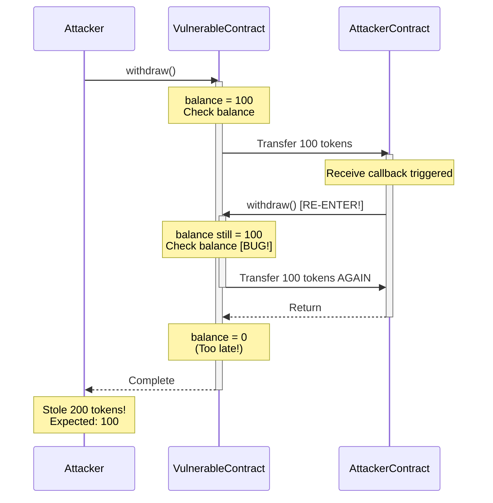
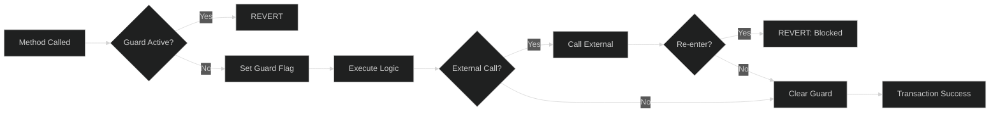
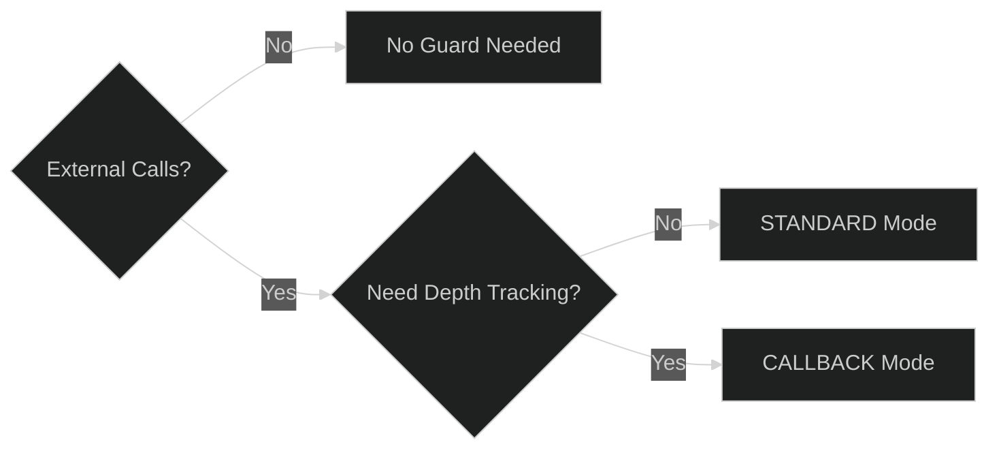

# Security

Security is paramount in smart contract development. This guide covers OPNet's security mechanisms and best practices for writing secure contracts.

## Security Mechanisms

OPNet provides several built-in security features:

| Feature | Description |
|---------|-------------|
| **SafeMath** | Overflow/underflow protection |
| **ReentrancyGuard** | Reentrancy attack prevention |
| **Access Control** | Role-based authorization |
| **Input Validation** | Calldata parsing with bounds checks |
| **Storage Safety** | SHA256-hashed storage keys |

## SafeMath

### The Problem

Integer overflow/underflow can cause critical bugs:

```typescript
// DANGEROUS: Native arithmetic can overflow silently
const a: u256 = u256.Max;
const b: u256 = u256.One;
const result = a + b;  // Wraps to 0!
```

### The Solution

Always use SafeMath for arithmetic:

```typescript
import { SafeMath } from '@btc-vision/btc-runtime/runtime';
import { u256 } from '@btc-vision/as-bignum/assembly';

const a = u256.fromU64(100);
const b = u256.fromU64(50);

// Safe operations
const sum = SafeMath.add(a, b);       // Reverts on overflow
const diff = SafeMath.sub(a, b);      // Reverts on underflow
const product = SafeMath.mul(a, b);   // Reverts on overflow
const quotient = SafeMath.div(a, b);  // Reverts on division by zero
const remainder = SafeMath.mod(a, b); // Reverts on division by zero
```

### Solidity Comparison

In Solidity 0.8+, arithmetic operations revert on overflow/underflow by default. OPNet achieves the same behavior through SafeMath:

```solidity
// Solidity 0.8+ - automatic overflow protection
uint256 result = a + b;  // Reverts on overflow
```

```typescript
// OPNet - explicit SafeMath usage
const result = SafeMath.add(a, b);  // Reverts on overflow
```

### SafeMath Operations

| Operation | Method | Behavior |
|-----------|--------|----------|
| Addition | `SafeMath.add(a, b)` | Reverts on overflow |
| Subtraction | `SafeMath.sub(a, b)` | Reverts on underflow |
| Multiplication | `SafeMath.mul(a, b)` | Reverts on overflow |
| Division | `SafeMath.div(a, b)` | Reverts on zero divisor |
| Modulo | `SafeMath.mod(a, b)` | Reverts on zero divisor |
| Power | `SafeMath.pow(base, exp)` | Reverts on overflow |
| Square Root | `SafeMath.sqrt(a)` | Newton-Raphson method |

See [SafeMath API](../api-reference/safe-math.md) for complete reference.

## Reentrancy Protection

### The Problem

Reentrancy attacks occur when a contract calls back into itself before completing:

```
1. User calls withdraw()
2. Contract sends funds to User
3. User's receive function calls withdraw() again
4. Contract sends funds again (before updating balance)
5. Repeat until drained
```

### Reentrancy Attack Sequence



### The Solution: ReentrancyGuard

```typescript
import { ReentrancyGuard, ReentrancyLevel } from '@btc-vision/btc-runtime/runtime';

@final
export class MyContract extends ReentrancyGuard {
    // Override the reentrancy level (STANDARD is the default)
    protected override readonly reentrancyLevel: ReentrancyLevel = ReentrancyLevel.STANDARD;

    public constructor() {
        super();
    }

    @method()
    public withdraw(calldata: Calldata): BytesWriter {
        // ReentrancyGuard automatically protects this method
        const amount = this.balances.get(Blockchain.tx.sender);

        // Even if external call tries to re-enter, it will fail
        this.balances.set(Blockchain.tx.sender, u256.Zero);
        // ... transfer funds ...

        return new BytesWriter(0);
    }
}
```

### ReentrancyGuard Mechanism Flow



### Guard Modes

| Mode | Description | Use Case |
|------|-------------|----------|
| `ReentrancyLevel.STANDARD` | Uses boolean lock, strict mutual exclusion | Default for most contracts |
| `ReentrancyLevel.CALLBACK` | Uses depth counter, still blocks reentrancy | Depth tracking use cases |

```typescript
// STANDARD: No re-entry allowed, uses boolean lock (default)
protected override readonly reentrancyLevel: ReentrancyLevel = ReentrancyLevel.STANDARD;

// CALLBACK: No re-entry allowed, uses depth counter for tracking
protected override readonly reentrancyLevel: ReentrancyLevel = ReentrancyLevel.CALLBACK;
```

### Guard Mode Decision Tree



Note: Both modes block reentrancy. STANDARD uses a boolean lock; CALLBACK uses a depth counter.

See [ReentrancyGuard](../contracts/reentrancy-guard.md) for detailed usage.

## Access Control

### onlyDeployer Pattern

```typescript
@final
export class MyContract extends OP_NET {
    public constructor() {
        super();
    }

    @method()
    public adminFunction(calldata: Calldata): BytesWriter {
        // Only deployer can call
        this.onlyDeployer(Blockchain.tx.sender);

        // Admin logic...
        return new BytesWriter(0);
    }
}
```

### Solidity Comparison

```solidity
// Solidity
modifier onlyOwner() {
    require(msg.sender == owner, "Not owner");
    _;
}
```

```typescript
// OPNet
protected onlyOwner(): void {
    if (!Blockchain.tx.sender.equals(this.owner.value)) {
        throw new Revert('Not owner');
    }
}
```

### Custom Roles

```typescript
@final
export class MyContract extends OP_NET {
    private readonly adminPointer: u16 = Blockchain.nextPointer;
    private readonly admin: StoredAddress = new StoredAddress(this.adminPointer, Address.zero());

    private readonly mintersPointer: u16 = Blockchain.nextPointer;
    private readonly minters: AddressMemoryMap;

    public constructor() {
        super();
        this.minters = new AddressMemoryMap(this.mintersPointer);
    }

    protected onlyAdmin(): void {
        if (!Blockchain.tx.sender.equals(this.admin.value)) {
            throw new Revert('Not admin');
        }
    }

    protected onlyMinter(): void {
        if (this.minters.get(Blockchain.tx.sender).isZero()) {
            throw new Revert('Not minter');
        }
    }

    @method()
    public mint(calldata: Calldata): BytesWriter {
        this.onlyMinter();
        // ...
        return new BytesWriter(0);
    }

    @method()
    public setMinter(calldata: Calldata): BytesWriter {
        this.onlyAdmin();
        const minter = calldata.readAddress();
        this.minters.set(minter, u256.One);
        return new BytesWriter(0);
    }
}
```

## Input Validation

### Validate All Inputs

```typescript
@method()
public transfer(calldata: Calldata): BytesWriter {
    const to = calldata.readAddress();
    const amount = calldata.readU256();

    // Validate recipient
    if (to.equals(Address.zero())) {
        throw new Revert('Cannot transfer to zero address');
    }

    // Validate amount
    if (amount.isZero()) {
        throw new Revert('Amount must be greater than zero');
    }

    // Validate balance
    const balance = this.balances.get(Blockchain.tx.sender);
    if (balance < amount) {
        throw new Revert('Insufficient balance');
    }

    // ... proceed with transfer
}
```

### Common Validations

```typescript
// Zero address check
if (address.equals(Address.zero())) {
    throw new Revert('Invalid address');
}

// Self-transfer check
if (from.equals(to)) {
    throw new Revert('Cannot transfer to self');
}

// Amount checks
if (amount.isZero()) {
    throw new Revert('Amount is zero');
}
if (amount > maxAmount) {
    throw new Revert('Amount exceeds maximum');
}

// Array bounds
if (index >= array.length) {
    throw new Revert('Index out of bounds');
}
```

## Common Vulnerabilities

### 1. Integer Overflow/Underflow

```typescript
// VULNERABLE
const newBalance = balance + amount;  // Can overflow!

// SAFE
const newBalance = SafeMath.add(balance, amount);
```

### 2. Reentrancy

```typescript
// VULNERABLE
@method()
public withdraw(): void {
    const amount = balances.get(sender);
    externalCall(sender, amount);  // Can re-enter!
    balances.set(sender, u256.Zero);
}

// SAFE (Checks-Effects-Interactions pattern)
@method()
public withdraw(): void {
    const amount = balances.get(sender);
    balances.set(sender, u256.Zero);  // Update state first
    externalCall(sender, amount);      // Then make external call
}
```

### 3. Access Control Bypass

```typescript
// VULNERABLE
@method()
public mint(calldata: Calldata): void {
    // No access control!
    this._mint(calldata.readAddress(), calldata.readU256());
}

// SAFE
@method()
public mint(calldata: Calldata): void {
    this.onlyDeployer(Blockchain.tx.sender);
    this._mint(calldata.readAddress(), calldata.readU256());
}
```

### 4. tx.origin Authentication

```typescript
// VULNERABLE (phishing attack possible)
@method()
public withdraw(): void {
    if (Blockchain.tx.origin.equals(owner)) {  // WRONG!
        // ...
    }
}

// SAFE
@method()
public withdraw(): void {
    if (Blockchain.tx.sender.equals(owner)) {  // Correct
        // ...
    }
}
```

### 5. Floating Point

```typescript
// VULNERABLE (non-deterministic)
const price: f64 = 1.5;  // NEVER use floats!

// SAFE (fixed-point)
const PRECISION: u256 = u256.fromU64(1_000_000);
const price: u256 = SafeMath.mul(u256.fromU64(15), SafeMath.div(PRECISION, u256.fromU64(10)));
```

## Security Checklist

Before deploying, verify:

- [ ] All arithmetic uses SafeMath
- [ ] ReentrancyGuard on sensitive functions
- [ ] Access control on admin functions
- [ ] Input validation on all public methods
- [ ] No floating-point arithmetic
- [ ] No tx.origin for authentication
- [ ] Events emitted for state changes
- [ ] Tests cover edge cases
- [ ] No hardcoded secrets

## Audit Information

btc-runtime has been audited by [Verichains](https://verichains.io). The audit covered:

- Contract standards (OP20, OP721)
- Storage system security
- Cryptographic implementations
- SafeMath operations
- ReentrancyGuard mechanisms

See [SECURITY.md](../../SECURITY.md) for full audit details.

## Reporting Vulnerabilities

If you discover a security issue:

1. **DO NOT** open a public GitHub issue
2. Report via [GitHub Security Advisories](https://github.com/btc-vision/btc-runtime/security/advisories)
3. Allow time for fix before disclosure

---

**Navigation:**
- Previous: [Events](./events.md)
- Next: [OP_NET Base Contract](../contracts/op-net-base.md)
