# Storage System

OPNet uses a pointer-based storage system that provides deterministic, secure, and efficient data persistence on Bitcoin L1. This guide explains how storage works and how to use it effectively.

## Overview

Unlike Solidity where storage is implicitly managed, OPNet requires explicit pointer allocation for all persistent data. This design provides:

- **Deterministic storage locations** via SHA256 hashing
- **Collision-free addressing** through unique pointer combinations
- **Efficient access** with optimized read/write patterns
- **Verifiable state proofs** for cross-chain validation

## How Storage Works

### Storage Keys

Every storage location is identified by a unique key generated from:

```
StorageKey = SHA256(pointer || subPointer)
```

Where:
- `pointer` is a `u16` (0-65535) identifying the storage slot type
- `subPointer` is a `u256` for sub-indexing (e.g., addresses in a mapping)

```typescript
// Example: Balance storage for address 0xABC...
pointer = 3              // balances mapping pointer
subPointer = 0xABC...    // the address
storageKey = SHA256(3 || 0xABC...)
```

### Storage Key Derivation Flow


### Storage Layout


## Solidity vs OPNet Storage Model

In Solidity, storage slots are assigned implicitly by the compiler. In OPNet, you explicitly allocate pointers at runtime.

### Quick Reference Table

| Feature | Solidity | OPNet |
|---------|----------|-------|
| Storage slot assignment | Implicit (compiler) | Explicit (`Blockchain.nextPointer`) |
| Hash function | keccak256 | SHA256 |
| Mapping type | `mapping(K => V)` | `StoredMapU256`, `AddressMemoryMap`, `MapOfMap<T>` |
| Array type | `T[]` | `StoredU256Array`, `StoredAddressArray`, etc. |
| Simple value | `uint256 public x;` | `StoredU256` |
| String storage | `string public s;` | `StoredString` |
| Boolean storage | `bool public b;` | `StoredBoolean` |
| Address storage | `address public a;` | `StoredAddress` |
| Nested mapping | `mapping(a => mapping(b => c))` | `MapOfMap<T>` |
| Default uint value | `0` | `u256.Zero` |
| Maximum slots/pointers | ~2^256 | 65,535 (`u16`) |

### Type Mapping Reference

| Solidity Type | OPNet Equivalent | Notes |
|---------------|------------------|-------|
| `uint256` | `StoredU256` | 32 bytes |
| `uint64` (packed) | `StoredU64` | Stores up to 4 u64 values in one slot |
| `uint32` (packed) | `StoredU32` | Stores up to 8 u32 values in one slot |
| `bool` | `StoredBoolean` | 1 byte |
| `string` | `StoredString` | Variable length |
| `address` | `StoredAddress` | 32 bytes |
| `uint256[]` | `StoredU256Array` | Dynamic array |
| `address[]` | `StoredAddressArray` | Dynamic array |
| `mapping(address => uint256)` | `AddressMemoryMap` | Address-keyed |
| `mapping(uint256 => uint256)` | `StoredMapU256` | u256-keyed |
| `mapping(address => mapping(address => uint256))` | `MapOfMap<u256>` | Two-level nesting |

### Side-by-Side Code Comparison

```solidity
// Solidity - Implicit slot assignment
contract Token {
    uint256 public totalSupply;              // slot 0 (assigned by compiler)
    string public name;                       // slot 1 (assigned by compiler)
    mapping(address => uint256) balances;    // slot 2 (assigned by compiler)
}
```

```typescript
// OPNet - Explicit pointer allocation
export class Token extends OP_NET {
    private readonly totalSupplyPointer: u16 = Blockchain.nextPointer;  // ~0 (allocated at runtime)
    private readonly namePointer: u16 = Blockchain.nextPointer;          // ~1 (allocated at runtime)
    private readonly balancesPointer: u16 = Blockchain.nextPointer;      // ~2 (allocated at runtime)
}
```


> **Important:** Do NOT use AssemblyScript's built-in Map for blockchain storage. See [CRITICAL: Map Implementation Warning](../storage/stored-maps.md#critical-map-implementation-warning) for details.

## Pointer Allocation

### Allocating Pointers

Use `Blockchain.nextPointer` to allocate unique pointers:

```typescript
import { Blockchain } from '@btc-vision/btc-runtime/runtime';

@final
export class MyContract extends OP_NET {
    // Each call to nextPointer returns a unique u16
    private readonly totalSupplyPointer: u16 = Blockchain.nextPointer;
    private readonly namePointer: u16 = Blockchain.nextPointer;
    private readonly balancesPointer: u16 = Blockchain.nextPointer;
    private readonly allowancesPointer: u16 = Blockchain.nextPointer;

    // ...
}
```


## System Architecture

The following diagram shows how storage fits into the overall OPNet architecture:

```mermaid
---
config:
  theme: dark
---
flowchart TD
    subgraph UserLayer["User Layer"]
        USER[("👤 User")]
    end

    subgraph BitcoinL1["Bitcoin L1"]
        BTC_TX["Bitcoin Transaction"]
        BTC_BLOCK["Bitcoin Block"]
        UTXO["UTXOs"]
    end

    subgraph OPNetConsensus["OPNet Consensus Layer"]
        INDEXER["OPNet Nodes"]
        WASM["WASM Runtime"]
        EPOCH["Epoch Mining<br/>SHA1 PoW"]
        CHECKPOINT["State Checksum<br/>Root Hash"]
    end

    subgraph Contract["Smart Contract"]
        ENTRY["Contract Entry Point"]
        LOGIC["Business Logic"]
        VERIFY["Output Verification<br/>blockchain.tx.outputs"]
        PTR_ALLOC["Pointer Allocation<br/>Blockchain.nextPointer"]
    end

    subgraph StorageSystem["Storage System"]
        PTR["Pointer (u16)<br/>0-65535 slots"]
        SUBPTR["SubPointer (u256)<br/>mapping keys"]
        HASH["SHA256(ptr || subPtr)"]
        STORAGE[("Persistent State<br/>Key-Value Store")]

        PTR --> HASH
        SUBPTR --> HASH
        HASH --> STORAGE
    end

    USER -->|"Signs & Broadcasts"| BTC_TX
    BTC_TX -->|"Included in"| BTC_BLOCK
    BTC_BLOCK -->|"Parsed by"| INDEXER
    INDEXER -->|"Executes in"| WASM
    WASM -->|"Runs"| ENTRY
    ENTRY --> LOGIC
    LOGIC -->|"Non-custodial verify"| VERIFY
    LOGIC -->|"Allocates"| PTR_ALLOC
    PTR_ALLOC -->|"Returns u16"| PTR
    LOGIC -->|"Read/Write"| STORAGE

    INDEXER -->|"Every 20 blocks"| EPOCH
    EPOCH -->|"Produces"| CHECKPOINT
    CHECKPOINT -->|"Anchors to"| BTC_BLOCK

    VERIFY -->|"Validates"| UTXO
    BTC_TX -->|"Creates/Spends"| UTXO
```



## Storage Types

OPNet provides typed storage classes for common data types:

### Primitive Storage

```typescript
import {
    StoredU256,
    StoredU64,
    StoredU32,
    StoredBoolean,
    StoredString,
    StoredAddress,
    EMPTY_POINTER,
} from '@btc-vision/btc-runtime/runtime';

// Usage
private readonly totalSupplyPointer: u16 = Blockchain.nextPointer;
private readonly _totalSupply: StoredU256 = new StoredU256(
    this.totalSupplyPointer,
    EMPTY_POINTER
);

// Read value
const supply = this._totalSupply.value;

// Write value
this._totalSupply.value = newSupply;
```

### Array Storage

```typescript
import {
    ABIDataTypes,
    BytesWriter,
    Calldata,
    StoredU256Array,
    StoredU128Array,
    StoredAddressArray,
    StoredBooleanArray,
} from '@btc-vision/btc-runtime/runtime';

// Usage
private readonly holdersPointer: u16 = Blockchain.nextPointer;
private readonly holders: StoredAddressArray = new StoredAddressArray(this.holdersPointer, EMPTY_POINTER);

// Operations
@method({ name: 'holder', type: ABIDataTypes.ADDRESS })
public addHolder(calldata: Calldata): BytesWriter {
    const newHolder = calldata.readAddress();
    this.holders.push(newHolder);
    this.holders.save();  // Commit changes
    return new BytesWriter(0);
}

const holder = this.holders.get(index);
const length = this.holders.getLength();
this.holders.deleteLast();
this.holders.save();
```

### Map Storage

```typescript
import { u256 } from '@btc-vision/as-bignum/assembly';
import {
    Address,
    StoredMapU256,
    AddressMemoryMap,
} from '@btc-vision/btc-runtime/runtime';

// Simple mapping
private readonly balancesPointer: u16 = Blockchain.nextPointer;
private readonly balances: StoredMapU256 = new StoredMapU256(this.balancesPointer);

// Address-keyed mapping (default value is u256.Zero)
private readonly balanceMap: AddressMemoryMap;

public constructor() {
    super();
    this.balanceMap = new AddressMemoryMap(this.balancesPointer);
}
```

## Storage Patterns

### Common Patterns Comparison

| Pattern | Solidity | OPNet |
|---------|----------|-------|
| Increment counter | `counter++;` | `counter.value = SafeMath.add(counter.value, u256.One);` |
| Read balance | `balances[addr]` | `balanceOf.get(addr)` |
| Write balance | `balances[addr] = x` | `balanceOf.set(addr, x)` |
| Check approval | `allowances[owner][spender]` | `allowances.get(owner).get(spender)` |
| Set approval | `allowances[owner][spender] = x` | `ownerMap = allowances.get(owner); ownerMap.set(spender, x); allowances.set(owner, ownerMap);` |
| Array push | `arr.push(x)` | `arr.push(x); arr.save()` |
| Array length | `arr.length` | `arr.getLength()` |
| Array access | `arr[i]` | `arr.get(i)` |
| Require/revert | `require(cond, "msg")` | `if (!cond) throw new Revert("msg")` |
| Get sender | `msg.sender` | `Blockchain.tx.sender` |
| Get origin | `tx.origin` | `Blockchain.tx.origin` |
| Block number | `block.number` | `Blockchain.block.number` |
| Block timestamp | `block.timestamp` | `Blockchain.block.medianTime` |

### Simple Value

```typescript
import { u256 } from '@btc-vision/as-bignum/assembly';
import {
    Blockchain,
    SafeMath,
    StoredU256,
} from '@btc-vision/btc-runtime/runtime';

// Solidity: uint256 public counter;
private readonly counterPointer: u16 = Blockchain.nextPointer;
private readonly counter: StoredU256 = new StoredU256(this.counterPointer, EMPTY_POINTER);

// Increment
this.counter.value = SafeMath.add(this.counter.value, u256.One);
```

### Mapping (address => uint256)

```typescript
import { u256 } from '@btc-vision/as-bignum/assembly';
import {
    ABIDataTypes,
    Address,
    AddressMemoryMap,
    SafeMath,
} from '@btc-vision/btc-runtime/runtime';

// Solidity: mapping(address => uint256) public balances;
private readonly balancesPointer: u16 = Blockchain.nextPointer;
private readonly balanceOf: AddressMemoryMap;

public constructor() {
    super();
    this.balanceOf = new AddressMemoryMap(this.balancesPointer);
}

// Get balance
@method({ name: 'address', type: ABIDataTypes.ADDRESS })
@returns({ name: 'balance', type: ABIDataTypes.UINT256 })
public getBalance(address: Address): u256 {
    return this.balanceOf.get(address);
}

// Set balance (using SafeMath for operations)
@method(
    { name: 'address', type: ABIDataTypes.ADDRESS },
    { name: 'amount', type: ABIDataTypes.UINT256 }
)
public setBalance(address: Address, amount: u256): void {
    this.balanceOf.set(address, amount);
}
```

### Nested Mapping (address => address => uint256)

For nested mappings like allowances, use `MapOfMap<T>` which provides a two-step get/set pattern:

```typescript
import { u256 } from '@btc-vision/as-bignum/assembly';
import {
    ABIDataTypes,
    Address,
    MapOfMap,
    Nested,
} from '@btc-vision/btc-runtime/runtime';

// Solidity: mapping(address => mapping(address => uint256)) public allowances;
private readonly allowancesPointer: u16 = Blockchain.nextPointer;
private readonly allowances: MapOfMap<u256>;

public constructor() {
    super();
    this.allowances = new MapOfMap<u256>(this.allowancesPointer);
}

// Getting nested value - two-step process
@method(
    { name: 'owner', type: ABIDataTypes.ADDRESS },
    { name: 'spender', type: ABIDataTypes.ADDRESS }
)
@returns({ name: 'allowance', type: ABIDataTypes.UINT256 })
public getAllowance(owner: Address, spender: Address): u256 {
    const ownerMap = this.allowances.get(owner);  // Returns Nested<u256>
    return ownerMap.get(spender);                  // Returns u256
}

// Setting nested value - get, modify, commit back
protected setAllowance(owner: Address, spender: Address, amount: u256): void {
    const ownerMap = this.allowances.get(owner);
    ownerMap.set(spender, amount);
    this.allowances.set(owner, ownerMap);  // Commit back
}
```

### Struct-like Storage

```typescript
// Solidity:
// struct User { address addr; uint256 balance; bool active; }
// mapping(uint256 => User) public users;

// OPNet: Use multiple pointers or encode into u256
private readonly userAddressPointer: u16 = Blockchain.nextPointer;
private readonly userBalancePointer: u16 = Blockchain.nextPointer;
private readonly userActivePointer: u16 = Blockchain.nextPointer;

private readonly userAddresses: StoredMapU256 = new StoredMapU256(this.userAddressPointer);
private readonly userBalances: StoredMapU256 = new StoredMapU256(this.userBalancePointer);
private readonly userActives: StoredMapU256 = new StoredMapU256(this.userActivePointer);
```

### Complete ERC-20 Style Comparison

Here's a side-by-side comparison of a complete token contract:

**Solidity:**
```solidity
// SPDX-License-Identifier: MIT
pragma solidity ^0.8.0;

contract SimpleToken {
    string public name;
    string public symbol;
    uint8 public decimals = 18;
    uint256 public totalSupply;

    mapping(address => uint256) public balanceOf;
    mapping(address => mapping(address => uint256)) public allowance;

    event Transfer(address indexed from, address indexed to, uint256 value);
    event Approval(address indexed owner, address indexed spender, uint256 value);

    constructor(string memory _name, string memory _symbol, uint256 _initialSupply) {
        name = _name;
        symbol = _symbol;
        totalSupply = _initialSupply;
        balanceOf[msg.sender] = _initialSupply;
    }

    function transfer(address to, uint256 amount) external returns (bool) {
        require(balanceOf[msg.sender] >= amount, "Insufficient balance");
        balanceOf[msg.sender] -= amount;
        balanceOf[to] += amount;
        emit Transfer(msg.sender, to, amount);
        return true;
    }

    function approve(address spender, uint256 amount) external returns (bool) {
        allowance[msg.sender][spender] = amount;
        emit Approval(msg.sender, spender, amount);
        return true;
    }

    function transferFrom(address from, address to, uint256 amount) external returns (bool) {
        require(allowance[from][msg.sender] >= amount, "Insufficient allowance");
        require(balanceOf[from] >= amount, "Insufficient balance");
        allowance[from][msg.sender] -= amount;
        balanceOf[from] -= amount;
        balanceOf[to] += amount;
        emit Transfer(from, to, amount);
        return true;
    }
}
```

**OPNet:**
```typescript
import { u256 } from '@btc-vision/as-bignum/assembly';
import {
    Address,
    AddressMemoryMap,
    Blockchain,
    BytesWriter,
    Calldata,
    MapOfMap,
    OP_NET,
    Revert,
    SafeMath,
    StoredString,
    StoredU256,
    EMPTY_POINTER,
} from '@btc-vision/btc-runtime/runtime';

@final
export class SimpleToken extends OP_NET {
    // Pointer allocation (equivalent to slot assignment)
    private readonly namePointer: u16 = Blockchain.nextPointer;
    private readonly symbolPointer: u16 = Blockchain.nextPointer;
    private readonly totalSupplyPointer: u16 = Blockchain.nextPointer;
    private readonly balancesPointer: u16 = Blockchain.nextPointer;
    private readonly allowancesPointer: u16 = Blockchain.nextPointer;

    // Storage variables
    private readonly _name: StoredString = new StoredString(this.namePointer, 0);
    private readonly _symbol: StoredString = new StoredString(this.symbolPointer, 0);
    private readonly _decimals: u8 = 18; // Constant value, no storage needed
    private readonly _totalSupply: StoredU256 = new StoredU256(this.totalSupplyPointer, EMPTY_POINTER);
    private readonly _balanceOf: AddressMemoryMap;
    private readonly _allowance: MapOfMap<u256>;

    public constructor() {
        super();
        this._balanceOf = new AddressMemoryMap(this.balancesPointer);
        this._allowance = new MapOfMap<u256>(this.allowancesPointer);
    }

    // Equivalent to Solidity constructor
    public override onDeployment(calldata: Calldata): void {
        this._name.value = calldata.readString();
        this._symbol.value = calldata.readString();
        const initialSupply = calldata.readU256();
        this._totalSupply.value = initialSupply;
        this._balanceOf.set(Blockchain.tx.origin, initialSupply);
    }

    // function transfer(address to, uint256 amount) external returns (bool)
    public transfer(calldata: Calldata): BytesWriter {
        const to = calldata.readAddress();
        const amount = calldata.readU256();
        const sender = Blockchain.tx.sender;

        const senderBalance = this._balanceOf.get(sender);
        if (senderBalance < amount) {
            throw new Revert('Insufficient balance');
        }

        this._balanceOf.set(sender, SafeMath.sub(senderBalance, amount));
        this._balanceOf.set(to, SafeMath.add(this._balanceOf.get(to), amount));

        // Emit Transfer event (implementation depends on event system)

        const writer = new BytesWriter(1);
        writer.writeBoolean(true);
        return writer;
    }

    // function approve(address spender, uint256 amount) external returns (bool)
    public approve(calldata: Calldata): BytesWriter {
        const spender = calldata.readAddress();
        const amount = calldata.readU256();
        const sender = Blockchain.tx.sender;

        // MapOfMap pattern: get nested, modify, commit back
        const senderAllowances = this._allowance.get(sender);
        senderAllowances.set(spender, amount);
        this._allowance.set(sender, senderAllowances);

        const writer = new BytesWriter(1);
        writer.writeBoolean(true);
        return writer;
    }

    // function transferFrom(address from, address to, uint256 amount) external returns (bool)
    public transferFrom(calldata: Calldata): BytesWriter {
        const from = calldata.readAddress();
        const to = calldata.readAddress();
        const amount = calldata.readU256();
        const sender = Blockchain.tx.sender;

        // Check allowance
        const fromAllowances = this._allowance.get(from);
        const currentAllowance = fromAllowances.get(sender);
        if (currentAllowance < amount) {
            throw new Revert('Insufficient allowance');
        }

        // Check balance
        const fromBalance = this._balanceOf.get(from);
        if (fromBalance < amount) {
            throw new Revert('Insufficient balance');
        }

        // Update allowance
        fromAllowances.set(sender, SafeMath.sub(currentAllowance, amount));
        this._allowance.set(from, fromAllowances);

        // Update balances
        this._balanceOf.set(from, SafeMath.sub(fromBalance, amount));
        this._balanceOf.set(to, SafeMath.add(this._balanceOf.get(to), amount));

        const writer = new BytesWriter(1);
        writer.writeBoolean(true);
        return writer;
    }
}
```

## Reading and Writing


### Read Operations

```typescript
// Read primitive
const value = this._totalSupply.value;

// Read from map
const balance = this.balanceOf.get(address);

// Read from array
const holder = this.holders.get(index);
const length = this.holders.getLength();
```

### Write Operations

```typescript
// Write primitive
this._totalSupply.value = newValue;

// Write to map
this.balanceOf.set(address, newBalance);

// Write to array
this.holders.push(newAddress);
this.holders.set(index, address);
this.holders.save();  // Commit changes
```

### Commit Optimization

For complex operations, delay commits until necessary:

```typescript
import { SafeMath } from '@btc-vision/btc-runtime/runtime';

// Multiple operations without intermediate commits
const currentBalance = this.balanceOf.get(from);
const newBalance = SafeMath.sub(currentBalance, amount);
this.balanceOf.set(from, newBalance);  // Value is buffered

// Changes are committed when transaction completes
```

## Default Values

Always provide sensible defaults:

```typescript
// u256 with EMPTY_POINTER
private balance: StoredU256 = new StoredU256(pointer, EMPTY_POINTER);

// String with index 0
private name: StoredString = new StoredString(pointer, 0);

// Boolean with false default
private paused: StoredBoolean = new StoredBoolean(pointer, false);
```

## Storage Limits

| Limit | Value | Notes |
|-------|-------|-------|
| Pointers per contract | 65,535 | `u16` range |
| Array length | ~4 billion | `u32` range (default maxLength configurable) |
| String length | 65,535 bytes | Encoded in storage |
| Sub-pointers | `u256` range | Effectively unlimited |

## Best Practices

### 1. Allocate Pointers in Order

```typescript
// Good: Sequential allocation
private ptr1: u16 = Blockchain.nextPointer;
private ptr2: u16 = Blockchain.nextPointer;
private ptr3: u16 = Blockchain.nextPointer;

// Bad: Gaps or manual assignment
private ptr1: u16 = 0;
private ptr2: u16 = 5;  // Gap!
```

### 2. Use Typed Storage

```typescript
// Good: Type-safe storage
private balance: StoredU256 = new StoredU256(ptr, EMPTY_POINTER);

// Avoid: Raw storage access (only for special cases)
import { encodePointer } from '@btc-vision/btc-runtime/runtime';
const pointerHash = encodePointer(ptr, subPtr);
Blockchain.setStorageAt(pointerHash, value);
```

### 3. Initialize in Constructor or onDeployment

```typescript
import { u256 } from '@btc-vision/as-bignum/assembly';
import {
    Address,
    AddressMemoryMap,
    Blockchain,
    Calldata,
    OP_NET,
} from '@btc-vision/btc-runtime/runtime';

export class MyContract extends OP_NET {
    private readonly balancesPointer: u16 = Blockchain.nextPointer;
    private readonly balanceOf: AddressMemoryMap;

    public constructor() {
        super();
        // Initialize storage maps in constructor
        this.balanceOf = new AddressMemoryMap(this.balancesPointer);
    }

    public override onDeployment(calldata: Calldata): void {
        // Set initial values here
        this._totalSupply.value = initialSupply;
    }
}
```

### 4. Optimize Storage Access


```typescript
import { SafeMath } from '@btc-vision/btc-runtime/runtime';

// Inefficient: Reading same value multiple times
for (let i = 0; i < 100; i++) {
    const balance = this.balanceOf.get(address);  // Storage read each time
    // ...
}

// Better: Cache the value
const balance = this.balanceOf.get(address);  // One storage read
for (let i = 0; i < 100; i++) {
    // Use cached balance
    // When modifying, use SafeMath
    const updated = SafeMath.add(balance, u256.One);
}
```

## Transient Storage

For temporary data that doesn't persist between transactions:

```typescript
// Transient storage is cleared after each transaction
// Useful for reentrancy guards, temporary calculations, etc.
```

See [Advanced Storage](../storage/stored-primitives.md) for transient storage details.

---

**Navigation:**
- Previous: [Blockchain Environment](./blockchain-environment.md)
- Next: [Pointers](./pointers.md)
