# Storage System

OPNet uses a pointer-based storage system that provides deterministic, secure, and efficient data persistence on Bitcoin L1. This guide explains how storage works and how to use it effectively.

## Overview

Unlike Solidity where storage is implicitly managed, OPNet requires explicit pointer allocation for all persistent data. This design provides:

- **Deterministic storage locations** via SHA256 hashing
- **Collision-free addressing** through unique pointer combinations
- **Gas-efficient access** with optimized read/write patterns
- **Verifiable state proofs** for cross-chain validation

## System Architecture

```mermaid
flowchart TB
    subgraph UserLayer["User Layer"]
        USER[("👤 User")]
    end

    subgraph BitcoinL1["Bitcoin L1"]
        BTC_TX["Bitcoin Transaction"]
        BTC_BLOCK["Bitcoin Block"]
        UTXO["UTXOs"]
    end

    subgraph OPNetConsensus["OPNet Consensus Layer"]
        INDEXER["OPNet Nodes"]
        WASM["WASM Runtime"]
        EPOCH["Epoch Mining<br/>SHA1 PoW"]
        CHECKPOINT["State Checksum<br/>Root Hash"]
    end

    subgraph Contract["Smart Contract"]
        ENTRY["Contract Entry Point"]
        LOGIC["Business Logic"]
        VERIFY["Output Verification<br/>blockchain.tx.outputs"]
        PTR_ALLOC["Pointer Allocation<br/>Blockchain.nextPointer"]
    end

    subgraph StorageSystem["Storage System"]
        direction TB
        PTR["Pointer (u16)<br/>0-65535 slots"]
        SUBPTR["SubPointer (u256)<br/>mapping keys"]
        HASH["SHA256(ptr || subPtr)"]
        STORAGE[("Persistent State<br/>Key-Value Store")]
        
        PTR --> HASH
        SUBPTR --> HASH
        HASH --> STORAGE
    end

    USER -->|"Signs & Broadcasts"| BTC_TX
    BTC_TX -->|"Included in"| BTC_BLOCK
    BTC_BLOCK -->|"Parsed by"| INDEXER
    INDEXER -->|"Executes in"| WASM
    WASM -->|"Runs"| ENTRY
    ENTRY --> LOGIC
    LOGIC -->|"Non-custodial verify"| VERIFY
    LOGIC -->|"Allocates"| PTR_ALLOC
    PTR_ALLOC -->|"Returns u16"| PTR
    LOGIC -->|"Read/Write"| STORAGE
    
    INDEXER -->|"Every 20 blocks"| EPOCH
    EPOCH -->|"Produces"| CHECKPOINT
    CHECKPOINT -->|"Anchors to"| BTC_BLOCK
    
    VERIFY -->|"Validates"| UTXO
    BTC_TX -->|"Creates/Spends"| UTXO
```



## Solidity vs OPNet Storage Model

```mermaid
flowchart TB
    subgraph SolidityFlow["Solidity (Ethereum)"]
        direction TB
        S_USER[("👤 User")] -->|"Sends ETH + calldata"| S_TX["Ethereum Transaction"]
        S_TX -->|"EVM executes"| S_CONTRACT["Smart Contract"]
        
        subgraph S_Storage["Storage (Implicit)"]
            S_COMPILER["Compiler assigns slots<br/>at compile time"]
            S_SLOT0["Slot 0: totalSupply"]
            S_SLOT1["Slot 1: balances"]
            S_SLOT2["Slot 2: allowances"]
            S_COMPILER -.->|"Hidden from dev"| S_SLOT0
            S_COMPILER -.->|"Hidden from dev"| S_SLOT1
            S_COMPILER -.->|"Hidden from dev"| S_SLOT2
        end
        
        S_CONTRACT -->|"keccak256(slot.key)"| S_Storage
        S_CONTRACT -->|"CAN hold ETH"| S_CUSTODY["Contract Custody<br/>address(this).balance"]
    end

    subgraph OPNetFlow["OPNet (Bitcoin L1)"]
        direction TB
        O_USER[("👤 User")] -->|"Signs Bitcoin TX"| O_TX["Bitcoin Transaction"]
        O_TX -->|"WASM executes"| O_CONTRACT["Smart Contract"]
        
        subgraph O_Storage["Storage (Explicit)"]
            O_RUNTIME["Runtime allocates ptrs<br/>at execution time"]
            O_PTR0["Pointer 0: totalSupplyPointer"]
            O_PTR1["Pointer 1: balancesPointer"]
            O_PTR2["Pointer 2: allowancesPointer"]
            O_RUNTIME -->|"Dev controls"| O_PTR0
            O_RUNTIME -->|"Dev controls"| O_PTR1
            O_RUNTIME -->|"Dev controls"| O_PTR2
        end
        
        O_CONTRACT -->|"SHA256(ptr || subPtr)"| O_Storage
        O_CONTRACT -->|"CANNOT hold BTC"| O_VERIFY["Verify-Only Pattern<br/>blockchain.tx.outputs"]
        O_VERIFY -->|"Validates"| O_TX
    end

    subgraph KeyDiff["Critical Differences"]
        DIFF1["Custody: Solidity holds funds,<br/>OPNet verifies outputs"]
        DIFF2["Storage: Solidity implicit slots,<br/>OPNet explicit pointers"]
        DIFF3["Hash: Solidity keccak256,<br/>OPNet SHA256"]
        DIFF4["Execution: Solidity EVM,<br/>OPNet WASM"]
    end
```



## How Storage Works

### Storage Keys

Every storage location is identified by a unique key generated from:

```
StorageKey = SHA256(pointer || subPointer)
```

Where:
- `pointer` is a `u16` (0-65535) identifying the storage slot type
- `subPointer` is a `u256` for sub-indexing (e.g., addresses in a mapping)

### Storage Key Structure


```typescript
// Example: Balance storage for address 0xABC...
pointer = 3              // balances mapping pointer
subPointer = 0xABC...    // the address
storageKey = SHA256(3 || 0xABC...)
```

### Pointer Encoding Process


### Storage Key Derivation Flow


### Storage Layout

```
Contract Storage
├── Pointer 0: totalSupply
├── Pointer 1: name
├── Pointer 2: symbol
├── Pointer 3: balances[address] → u256
│   ├── subPointer 0xAAA... → balance of 0xAAA
│   ├── subPointer 0xBBB... → balance of 0xBBB
│   └── ...
├── Pointer 4: allowances[owner][spender] → u256
│   └── ...
└── ...
```


## CRITICAL: Map Implementation Warning

> **DO NOT USE AssemblyScript's Built-in Map**
>
> When creating custom map implementations or extending map functionality, you **MUST** use the Map class from `@btc-vision/btc-runtime/runtime`, NOT the built-in AssemblyScript Map.
>
> **Why the AssemblyScript Map is broken for blockchain:**
> - NOT optimized for blockchain storage patterns
> - Does NOT handle Uint8Array buffers as keys correctly
> - Does NOT work properly with Address key comparisons
> - Will cause silent data corruption or key collisions
>
> **CORRECT:**
> ```typescript
> import { Map } from '@btc-vision/btc-runtime/runtime';
>
> export class MyCustomMap<V> extends Map<Address, V> {
>     // Your implementation
> }
> ```
>
> **WRONG:**
> ```typescript
> // DO NOT DO THIS - will break!
> const map = new Map<Uint8Array, u256>();  // AssemblyScript Map
> ```
>
> The btc-runtime Map is specifically designed to:
> - Handle Address and Uint8Array key comparisons correctly
> - Optimize for blockchain storage access patterns
> - Support proper serialization for persistent storage
> - Prevent key collisions with custom equality logic

## Pointer Allocation

### Allocating Pointers

Use `Blockchain.nextPointer` to allocate unique pointers:

```typescript
import { Blockchain } from '@btc-vision/btc-runtime/runtime';

@final
export class MyContract extends OP_NET {
    // Each call to nextPointer returns a unique u16
    private totalSupplyPointer: u16 = Blockchain.nextPointer;
    private namePointer: u16 = Blockchain.nextPointer;
    private balancesPointer: u16 = Blockchain.nextPointer;
    private allowancesPointer: u16 = Blockchain.nextPointer;

    // ...
}
```


### Solidity Comparison

| Solidity | OPNet |
|----------|-------|
| Implicit slot numbers | Explicit pointer allocation |
| `uint256 public totalSupply;` (slot 0) | `totalSupplyPointer: u16 = Blockchain.nextPointer;` |
| `mapping(address => uint256) balances;` (slot 1) | `balancesPointer: u16 = Blockchain.nextPointer;` |

## Storage Types

OPNet provides typed storage classes for common data types:

### Primitive Storage

```typescript
import {
    StoredU256,
    StoredU128,
    StoredU64,
    StoredU32,
    StoredU16,
    StoredU8,
    StoredBoolean,
    StoredString,
    StoredAddress,
    EMPTY_POINTER,
} from '@btc-vision/btc-runtime/runtime';

// Usage
private totalSupplyPointer: u16 = Blockchain.nextPointer;
private _totalSupply: StoredU256 = new StoredU256(
    this.totalSupplyPointer,
    EMPTY_POINTER
);

// Read value
const supply = this._totalSupply.value;

// Write value
this._totalSupply.value = newSupply;
```

### Array Storage

```typescript
import {
    ABIDataTypes,
    BytesWriter,
    Calldata,
    StoredU256Array,
    StoredU128Array,
    StoredAddressArray,
    StoredBooleanArray,
} from '@btc-vision/btc-runtime/runtime';

// Usage
private holdersPointer: u16 = Blockchain.nextPointer;
private holders: StoredAddressArray = new StoredAddressArray(this.holdersPointer);

// Operations
@method({ name: 'holder', type: ABIDataTypes.ADDRESS })
public addHolder(calldata: Calldata): BytesWriter {
    const newHolder = calldata.readAddress();
    this.holders.push(newHolder);
    return new BytesWriter(0);
}

const holder = this.holders.get(index);
const length = this.holders.length;
this.holders.pop();
```

### Map Storage

```typescript
import { u256 } from '@btc-vision/as-bignum/assembly';
import {
    Address,
    StoredMapU256,
    AddressMemoryMap,
} from '@btc-vision/btc-runtime/runtime';

// Simple mapping
private balancesPointer: u16 = Blockchain.nextPointer;
private balances: StoredMapU256 = new StoredMapU256(this.balancesPointer);

// Address-keyed mapping (default value is u256.Zero)
private balanceMap: AddressMemoryMap;

public constructor() {
    super();
    this.balanceMap = new AddressMemoryMap(this.balancesPointer);
}
```

## Storage Patterns

### Simple Value

```typescript
import { u256 } from '@btc-vision/as-bignum/assembly';
import {
    Blockchain,
    SafeMath,
    StoredU256,
} from '@btc-vision/btc-runtime/runtime';

// Solidity: uint256 public counter;
private counterPointer: u16 = Blockchain.nextPointer;
private counter: StoredU256 = new StoredU256(this.counterPointer, EMPTY_POINTER);

// Increment
this.counter.value = SafeMath.add(this.counter.value, u256.One);
```

### Mapping (address => uint256)

```typescript
import { u256 } from '@btc-vision/as-bignum/assembly';
import {
    ABIDataTypes,
    Address,
    AddressMemoryMap,
    SafeMath,
} from '@btc-vision/btc-runtime/runtime';

// Solidity: mapping(address => uint256) public balances;
private balancesPointer: u16 = Blockchain.nextPointer;
private balanceOf: AddressMemoryMap;

public constructor() {
    super();
    this.balanceOf = new AddressMemoryMap(this.balancesPointer);
}

// Get balance
@method({ name: 'address', type: ABIDataTypes.ADDRESS })
@returns({ name: 'balance', type: ABIDataTypes.UINT256 })
public getBalance(address: Address): u256 {
    return this.balanceOf.get(address);
}

// Set balance (using SafeMath for operations)
@method(
    { name: 'address', type: ABIDataTypes.ADDRESS },
    { name: 'amount', type: ABIDataTypes.UINT256 }
)
public setBalance(address: Address, amount: u256): void {
    this.balanceOf.set(address, amount);
}
```

### Nested Mapping (address => address => uint256)

```typescript
import { u256 } from '@btc-vision/as-bignum/assembly';
import {
    ABIDataTypes,
    Address,
    MapOfMap,
    Nested,
} from '@btc-vision/btc-runtime/runtime';

// Solidity: mapping(address => mapping(address => uint256)) public allowances;
private allowancesPointer: u16 = Blockchain.nextPointer;
private allowances: MapOfMap<u256>;

constructor() {
    super();
    this.allowances = new MapOfMap<u256>(this.allowancesPointer);
}

// Getting nested value - two-step process
@method(
    { name: 'owner', type: ABIDataTypes.ADDRESS },
    { name: 'spender', type: ABIDataTypes.ADDRESS }
)
@returns({ name: 'allowance', type: ABIDataTypes.UINT256 })
public getAllowance(owner: Address, spender: Address): u256 {
    const ownerMap = this.allowances.get(owner);  // Returns Nested<u256>
    return ownerMap.get(spender);                  // Returns u256
}

// Setting nested value - get, modify, commit back
protected setAllowance(owner: Address, spender: Address, amount: u256): void {
    const ownerMap = this.allowances.get(owner);
    ownerMap.set(spender, amount);
    this.allowances.set(owner, ownerMap);  // Commit back
}
```

### Struct-like Storage

```typescript
// Solidity:
// struct User { address addr; uint256 balance; bool active; }
// mapping(uint256 => User) public users;

// OPNet: Use multiple pointers or encode into u256
private userAddressPointer: u16 = Blockchain.nextPointer;
private userBalancePointer: u16 = Blockchain.nextPointer;
private userActivePointer: u16 = Blockchain.nextPointer;

private userAddresses: StoredMapU256 = new StoredMapU256(this.userAddressPointer);
private userBalances: StoredMapU256 = new StoredMapU256(this.userBalancePointer);
private userActives: StoredMapU256 = new StoredMapU256(this.userActivePointer);
```

## Reading and Writing

### Read/Write Operation Sequence


### Read/Write Flow Diagram


### Read Operations

```typescript
// Read primitive
const value = this._totalSupply.value;

// Read from map
const balance = this.balanceOf.get(address);

// Read from array
const holder = this.holders.get(index);
const length = this.holders.length;
```

### Write Operations

```typescript
// Write primitive
this._totalSupply.value = newValue;

// Write to map
this.balanceOf.set(address, newBalance);

// Write to array
this.holders.push(newAddress);
this.holders.set(index, address);
```

### Commit Optimization

For complex operations, delay commits until necessary:

```typescript
import { SafeMath } from '@btc-vision/btc-runtime/runtime';

// Multiple operations without intermediate commits
const currentBalance = this.balanceOf.get(from);
const newBalance = SafeMath.sub(currentBalance, amount);
this.balanceOf.set(from, newBalance);  // Value is buffered

// Changes are committed when transaction completes
```

## Default Values

Always provide sensible defaults:

```typescript
// u256 with EMPTY_POINTER
private balance: StoredU256 = new StoredU256(pointer, EMPTY_POINTER);

// String with index 0
private name: StoredString = new StoredString(pointer, 0);

// Boolean with false default
private paused: StoredBoolean = new StoredBoolean(pointer, false);
```

## Storage Limits

| Limit | Value | Notes |
|-------|-------|-------|
| Pointers per contract | 65,535 | `u16` range |
| Array length | 65,535 | Hard limit per array |
| String length | Variable | Encoded in storage |
| Sub-pointers | `u256` range | Effectively unlimited |

## Best Practices

### 1. Allocate Pointers in Order

```typescript
// Good: Sequential allocation
private ptr1: u16 = Blockchain.nextPointer;
private ptr2: u16 = Blockchain.nextPointer;
private ptr3: u16 = Blockchain.nextPointer;

// Bad: Gaps or manual assignment
private ptr1: u16 = 0;
private ptr2: u16 = 5;  // Gap!
```

### 2. Use Typed Storage

```typescript
// Good: Type-safe storage
private balance: StoredU256 = new StoredU256(ptr, EMPTY_POINTER);

// Avoid: Raw storage access (only for special cases)
import { encodePointer } from '@btc-vision/btc-runtime/runtime';
const pointerHash = encodePointer(ptr, subPtr);
Blockchain.setStorageAt(pointerHash, value);
```

### 3. Initialize in Constructor or onDeployment

```typescript
import { u256 } from '@btc-vision/as-bignum/assembly';
import {
    Address,
    AddressMemoryMap,
    Blockchain,
    Calldata,
    OP_NET,
} from '@btc-vision/btc-runtime/runtime';

export class MyContract extends OP_NET {
    private balancesPointer: u16 = Blockchain.nextPointer;
    private balanceOf: AddressMemoryMap;

    public constructor() {
        super();
        // Initialize storage maps in constructor
        this.balanceOf = new AddressMemoryMap(this.balancesPointer);
    }

    public override onDeployment(calldata: Calldata): void {
        // Set initial values here
        this._totalSupply.value = initialSupply;
    }
}
```

### 4. Consider Gas Costs


```typescript
import { SafeMath } from '@btc-vision/btc-runtime/runtime';

// Expensive: Reading same value multiple times
for (let i = 0; i < 100; i++) {
    const balance = this.balanceOf.get(address);  // Storage read each time
    // ...
}

// Better: Cache the value
const balance = this.balanceOf.get(address);  // One storage read
for (let i = 0; i < 100; i++) {
    // Use cached balance
    // When modifying, use SafeMath
    const updated = SafeMath.add(balance, u256.One);
}
```

## Transient Storage

For temporary data that doesn't persist between transactions:

```typescript
// Transient storage is cleared after each transaction
// Useful for reentrancy guards, temporary calculations, etc.
```

See [Advanced Storage](../storage/stored-primitives.md) for transient storage details.

## State Finality and Security


---

**Navigation:**
- Previous: [Blockchain Environment](./blockchain-environment.md)
- Next: [Pointers](./pointers.md)
