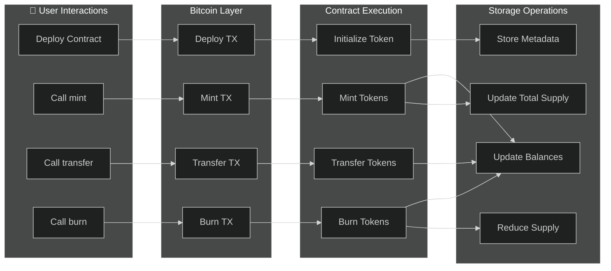
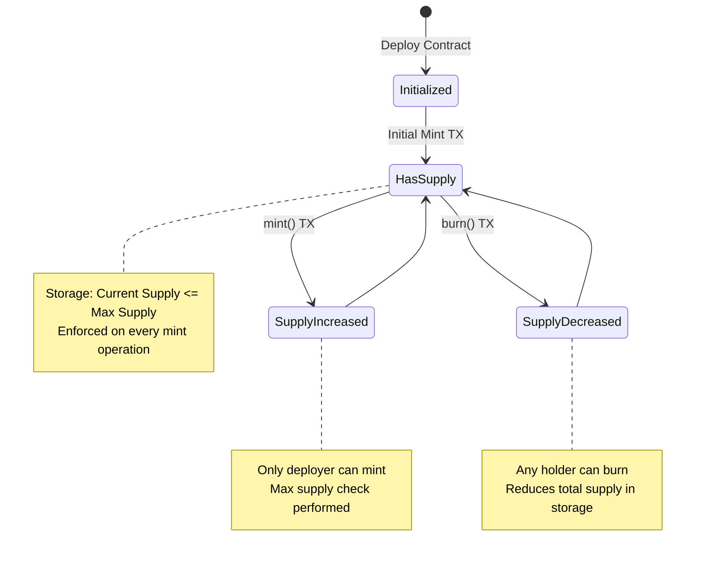
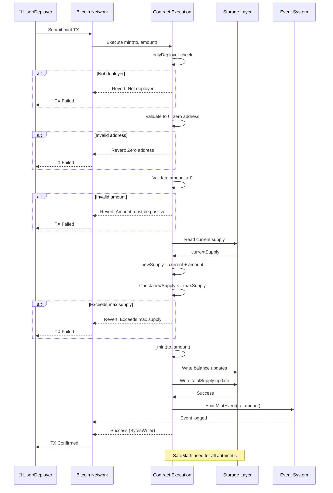

# Basic Token Example

A complete, production-ready OP20 token implementation with minting, burning, and administrative controls.

## Overview

This example demonstrates:
- OP20 token initialization
- Decorators (`@method`, `@returns`, `@emit`)
- Custom minting function
- Burn functionality
- Access control
- Event emission

## Token Lifecycle

The token follows a standard lifecycle from deployment through minting, transfers, and burning:



## Complete Implementation

```typescript
import { u256 } from '@btc-vision/as-bignum/assembly';
import {
    OP20,
    OP20InitParameters,
    Blockchain,
    Address,
    Calldata,
    BytesWriter,
    SafeMath,
    Revert,
    MintEvent,
    BurnEvent,
    ABIDataTypes,
} from '@btc-vision/btc-runtime/runtime';

@final
export class BasicToken extends OP20 {
    public constructor() {
        super();
    }

    /**
     * Initialize the token on deployment.
     * This is equivalent to Solidity's constructor.
     */
    public override onDeployment(calldata: Calldata): void {
        // Read initialization parameters
        const maxSupply = calldata.readU256();
        const decimals = calldata.readU8();
        const name = calldata.readString();
        const symbol = calldata.readString();
        const initialMintTo = calldata.readAddress();
        const initialMintAmount = calldata.readU256();

        // Validate decimals
        if (decimals > 32) {
            throw new Revert('Decimals cannot exceed 32');
        }

        // Validate initial mint doesn't exceed max supply
        if (initialMintAmount > maxSupply) {
            throw new Revert('Initial mint exceeds max supply');
        }

        // Initialize OP20
        this.instantiate(new OP20InitParameters(maxSupply, decimals, name, symbol));

        // Mint initial supply if specified
        if (!initialMintAmount.isZero() && !initialMintTo.equals(Address.zero())) {
            this._mint(initialMintTo, initialMintAmount);
        }
    }

    /**
     * Mint new tokens to an address.
     * Only callable by the contract deployer.
     */
    @method(
        { name: 'to', type: ABIDataTypes.ADDRESS },
        { name: 'amount', type: ABIDataTypes.UINT256 },
    )
    @returns({ name: 'success', type: ABIDataTypes.BOOL })
    @emit('Minted')
    public mint(calldata: Calldata): BytesWriter {
        // Access control
        this.onlyDeployer(Blockchain.tx.sender);

        // Read parameters
        const to = calldata.readAddress();
        const amount = calldata.readU256();

        // Validate
        if (to.equals(Address.zero())) {
            throw new Revert('Cannot mint to zero address');
        }

        if (amount.isZero()) {
            throw new Revert('Mint amount must be positive');
        }

        // Check max supply
        const currentSupply = this.totalSupply();
        const newSupply = SafeMath.add(currentSupply, amount);
        if (newSupply > this.maxSupply()) {
            throw new Revert('Mint would exceed max supply');
        }

        // Mint tokens
        this._mint(to, amount);

        // Emit event
        this.emitEvent(new MintEvent(to, amount));

        return new BytesWriter(0);
    }

    /**
     * Burn tokens from the caller's balance.
     */
    @method({ name: 'amount', type: ABIDataTypes.UINT256 })
    @returns({ name: 'success', type: ABIDataTypes.BOOL })
    @emit('Burned')
    public burn(calldata: Calldata): BytesWriter {
        const amount = calldata.readU256();

        // Validate
        if (amount.isZero()) {
            throw new Revert('Burn amount must be positive');
        }

        const sender = Blockchain.tx.sender;
        const balance = this.balanceOf(sender);

        if (balance < amount) {
            throw new Revert('Burn amount exceeds balance');
        }

        // Burn tokens
        this._burn(sender, amount);

        // Emit event
        this.emitEvent(new BurnEvent(sender, amount));

        return new BytesWriter(0);
    }

    /**
     * Burn tokens from another account using allowance.
     */
    @method(
        { name: 'from', type: ABIDataTypes.ADDRESS },
        { name: 'amount', type: ABIDataTypes.UINT256 },
    )
    @returns({ name: 'success', type: ABIDataTypes.BOOL })
    @emit('Burned')
    public burnFrom(calldata: Calldata): BytesWriter {
        const from = calldata.readAddress();
        const amount = calldata.readU256();
        const sender = Blockchain.tx.sender;

        // Check allowance
        const currentAllowance = this.allowance(from, sender);
        if (currentAllowance < amount) {
            throw new Revert('Burn amount exceeds allowance');
        }

        // Check balance
        const balance = this.balanceOf(from);
        if (balance < amount) {
            throw new Revert('Burn amount exceeds balance');
        }

        // Update allowance (unless unlimited)
        if (!currentAllowance.equals(u256.Max)) {
            this._approve(from, sender, SafeMath.sub(currentAllowance, amount));
        }

        // Burn tokens
        this._burn(from, amount);

        // Emit event
        this.emitEvent(new BurnEvent(from, amount));

        return new BytesWriter(0);
    }

    /**
     * Get token metadata in a single call.
     */
    @method()
    @returns(
        { name: 'name', type: ABIDataTypes.STRING },
        { name: 'symbol', type: ABIDataTypes.STRING },
        { name: 'decimals', type: ABIDataTypes.UINT8 },
        { name: 'totalSupply', type: ABIDataTypes.UINT256 },
        { name: 'maxSupply', type: ABIDataTypes.UINT256 },
    )
    public tokenInfo(_: Calldata): BytesWriter {
        const name = this._name.value;
        const symbol = this._symbol.value;

        const writer = new BytesWriter(256);
        writer.writeString(name);
        writer.writeString(symbol);
        writer.writeU8(this._decimals.value);
        writer.writeU256(this.totalSupply());
        writer.writeU256(this.maxSupply());
        return writer;
    }
}
```

## Token Supply States

The token supply transitions through different states based on mint and burn operations:



## Mint Operation Flow

The mint operation includes multiple validation checks before updating storage:



## Decorator Breakdown

### Mint Method

The `@method` decorator defines the ABI parameters, `@returns` defines the return type, and `@emit` declares the event:

```typescript
@method(
    { name: 'to', type: ABIDataTypes.ADDRESS },     // First parameter
    { name: 'amount', type: ABIDataTypes.UINT256 }, // Second parameter
)
@returns({ name: 'success', type: ABIDataTypes.BOOL })  // Return type
@emit('Minted')  // Emits Minted event
public mint(calldata: Calldata): BytesWriter {
    const to = calldata.readAddress();       // Read first param
    const amount = calldata.readU256();      // Read second param
    // ...
}
```

**Solidity Comparison:**

```solidity
// Solidity
function mint(address to, uint256 amount) external onlyOwner {
    // ...
    emit Minted(to, amount);
}

// OPNet
@method(
    { name: 'to', type: ABIDataTypes.ADDRESS },
    { name: 'amount', type: ABIDataTypes.UINT256 },
)
@returns({ name: 'success', type: ABIDataTypes.BOOL })
@emit('Minted')
public mint(calldata: Calldata): BytesWriter {
    // ...
}
```

### Burn Method

Single parameter methods use a simplified decorator syntax:

```typescript
@method({ name: 'amount', type: ABIDataTypes.UINT256 })  // Single parameter
@returns({ name: 'success', type: ABIDataTypes.BOOL })   // Return type
@emit('Burned')
public burn(calldata: Calldata): BytesWriter {
    const amount = calldata.readU256();
    // ...
}
```

### Getter with Multiple Returns

View functions use `@returns` to define output types:

```typescript
@method()  // No input parameters
@returns(
    { name: 'name', type: ABIDataTypes.STRING },
    { name: 'symbol', type: ABIDataTypes.STRING },
    { name: 'decimals', type: ABIDataTypes.UINT8 },
    { name: 'totalSupply', type: ABIDataTypes.UINT256 },
    { name: 'maxSupply', type: ABIDataTypes.UINT256 },
)
public tokenInfo(_: Calldata): BytesWriter {
    // ...
}
```

## Usage

### Deployment

```typescript
// Prepare deployment calldata
const writer = new BytesWriter(256);

// Parameters
writer.writeU256(u256.fromString('1000000000000000000000000'));  // 1M max supply
writer.writeU8(18);                                               // 18 decimals
writer.writeString('My Basic Token');                             // name
writer.writeString('MBT');                                        // symbol
writer.writeAddress(deployerAddress);                             // initial mint to
writer.writeU256(u256.fromString('500000000000000000000000'));   // 500k initial mint

const deployCalldata = writer.getBuffer();
```

### Minting

```typescript
import { encodeSelector } from '@btc-vision/btc-runtime/runtime';

// Define selector (or use pre-computed u32)
const MINT_SELECTOR: u32 = 0x40c10f19;  // mint(address,uint256)

// Prepare mint calldata
const writer = new BytesWriter(64);
writer.writeSelector(MINT_SELECTOR);
writer.writeAddress(recipientAddress);
writer.writeU256(u256.fromString('1000000000000000000000'));  // 1000 tokens

const mintCalldata = writer.getBuffer();
```

### Burning

```typescript
// Define selector (or use pre-computed u32)
const BURN_SELECTOR: u32 = 0x42966c68;  // burn(uint256)

// Prepare burn calldata
const writer = new BytesWriter(36);
writer.writeSelector(BURN_SELECTOR);
writer.writeU256(u256.fromString('500000000000000000000'));  // 500 tokens

const burnCalldata = writer.getBuffer();
```

## Key Concepts Demonstrated

### 1. Decorators

Always use decorators for public methods to define the ABI:

```typescript
// With decorators - proper ABI generation
@method({ name: 'to', type: ABIDataTypes.ADDRESS })
@returns({ name: 'success', type: ABIDataTypes.BOOL })
@emit('Transfer')
public transfer(calldata: Calldata): BytesWriter

// Without decorators - no ABI, hard for callers to use
public transfer(calldata: Calldata): BytesWriter
```

### 2. Access Control

```typescript
public mint(calldata: Calldata): BytesWriter {
    // Only deployer can call
    this.onlyDeployer(Blockchain.tx.sender);
    // ...
}
```

**Solidity Comparison:**

```solidity
// Solidity uses modifiers
modifier onlyOwner() {
    require(msg.sender == owner, "Not owner");
    _;
}

function mint(address to, uint256 amount) external onlyOwner { }

// OPNet uses inline checks
public mint(calldata: Calldata): BytesWriter {
    this.onlyDeployer(Blockchain.tx.sender);  // Throws if not deployer
    // ...
}
```

### 3. Input Validation

```typescript
// Zero address check
if (to.equals(Address.zero())) {
    throw new Revert('Cannot mint to zero address');
}

// Zero amount check
if (amount.isZero()) {
    throw new Revert('Mint amount must be positive');
}

// Supply cap check
if (newSupply > this.maxSupply()) {
    throw new Revert('Mint would exceed max supply');
}
```

### 4. Event Emission

```typescript
// Mint event
this.emitEvent(new MintEvent(to, amount));

// Burn event
this.emitEvent(new BurnEvent(from, amount));
```

### 5. Method Routing

Method routing is handled **AUTOMATICALLY** via `@method` decorators. You do NOT need to override the `execute` method:

```typescript
// CORRECT: Use @method decorator - routing is automatic
@method(
    { name: 'to', type: ABIDataTypes.ADDRESS },
    { name: 'amount', type: ABIDataTypes.UINT256 },
)
@returns({ name: 'success', type: ABIDataTypes.BOOL })
@emit('Minted')
public mint(calldata: Calldata): BytesWriter {
    // Implementation - runtime routes calls automatically
    return new BytesWriter(0);
}

// DO NOT manually override execute() - decorators handle this
```

## Solidity Equivalent

For developers familiar with Solidity, here is the equivalent ERC20 implementation using OpenZeppelin:

```solidity
// SPDX-License-Identifier: MIT
pragma solidity ^0.8.20;

import "@openzeppelin/contracts/token/ERC20/ERC20.sol";
import "@openzeppelin/contracts/access/Ownable.sol";

contract BasicToken is ERC20, Ownable {
    uint256 public maxSupply;

    event Minted(address indexed to, uint256 amount);
    event Burned(address indexed from, uint256 amount);

    constructor(
        string memory name,
        string memory symbol,
        uint256 _maxSupply,
        address initialMintTo,
        uint256 initialMintAmount
    ) ERC20(name, symbol) Ownable(msg.sender) {
        maxSupply = _maxSupply;
        if (initialMintAmount > 0 && initialMintTo != address(0)) {
            require(initialMintAmount <= _maxSupply, "Initial mint exceeds max supply");
            _mint(initialMintTo, initialMintAmount);
        }
    }

    function mint(address to, uint256 amount) external onlyOwner {
        require(to != address(0), "Cannot mint to zero address");
        require(amount > 0, "Mint amount must be positive");
        require(totalSupply() + amount <= maxSupply, "Mint would exceed max supply");
        _mint(to, amount);
        emit Minted(to, amount);
    }

    function burn(uint256 amount) external {
        require(amount > 0, "Burn amount must be positive");
        _burn(msg.sender, amount);
        emit Burned(msg.sender, amount);
    }

    function burnFrom(address from, uint256 amount) external {
        _spendAllowance(from, msg.sender, amount);
        _burn(from, amount);
        emit Burned(from, amount);
    }

    function tokenInfo() external view returns (
        string memory name_,
        string memory symbol_,
        uint8 decimals_,
        uint256 totalSupply_,
        uint256 maxSupply_
    ) {
        return (name(), symbol(), decimals(), totalSupply(), maxSupply);
    }
}
```

## Solidity vs OPNet Comparison

### Key Differences Table

| Aspect | Solidity (ERC20) | OPNet (OP20) |
|--------|------------------|--------------|
| **Inheritance** | `contract MyToken is ERC20, Ownable` | `class MyToken extends OP20` |
| **Constructor** | `constructor() ERC20("Name", "SYM")` | `onDeployment()` + `this.instantiate(new OP20InitParameters(...))` |
| **Mint** | `_mint(to, amount)` | `this._mint(to, amount)` |
| **Burn** | `_burn(from, amount)` | `this._burn(from, amount)` |
| **Access Control** | `modifier onlyOwner()` | `this.onlyDeployer(Blockchain.tx.sender)` |
| **Events** | `event Minted(...); emit Minted(...)` | `@emit('Minted')` + `this.emitEvent(new MintEvent(...))` |
| **Function Declaration** | `function mint(address to, uint256 amount) external` | `@method({ name: 'to', type: ABIDataTypes.ADDRESS }, ...)` |
| **Return Values** | `returns (uint256)` | `@returns({ name: 'value', type: ABIDataTypes.UINT256 })` |
| **Msg.sender** | `msg.sender` | `Blockchain.tx.sender` |
| **Revert** | `require(condition, "message")` or `revert("message")` | `throw new Revert('message')` |
| **Safe Math** | Built-in (Solidity 0.8+) | `SafeMath.add()`, `SafeMath.sub()`, etc. |
| **Method Routing** | Automatic via function selectors | Automatic via `@method` decorators |

### Structural Differences

**Solidity:**
```solidity
// Function with modifier
function mint(address to, uint256 amount) external onlyOwner {
    require(to != address(0), "Cannot mint to zero address");
    _mint(to, amount);
    emit Minted(to, amount);
}
```

**OPNet:**
```typescript
// Method with decorators
@method(
    { name: 'to', type: ABIDataTypes.ADDRESS },
    { name: 'amount', type: ABIDataTypes.UINT256 },
)
@returns({ name: 'success', type: ABIDataTypes.BOOL })
@emit('Minted')
public mint(calldata: Calldata): BytesWriter {
    this.onlyDeployer(Blockchain.tx.sender);
    const to = calldata.readAddress();
    const amount = calldata.readU256();

    if (to.equals(Address.zero())) {
        throw new Revert('Cannot mint to zero address');
    }

    this._mint(to, amount);
    this.emitEvent(new MintEvent(to, amount));
    return new BytesWriter(0);
}
```

### Advantages of OPNet Approach

| Feature | Benefit |
|---------|---------|
| **TypeScript/AssemblyScript** | Familiar syntax for web developers, strong typing |
| **Explicit ABI via Decorators** | Self-documenting code, automatic ABI generation |
| **u256 Native Support** | First-class 256-bit integer support via `@btc-vision/as-bignum` |
| **Bitcoin Native** | Direct integration with Bitcoin's security model |
| **Unified Storage Pointers** | Consistent storage access pattern with `Blockchain.nextPointer` |
| **Predictable Execution** | Bitcoin transaction model provides predictable execution |
| **Automatic Method Routing** | `@method` decorators handle selector generation and routing |

### Initialization Pattern Comparison

**Solidity (constructor runs once at deployment):**
```solidity
constructor(string memory name, string memory symbol) ERC20(name, symbol) {
    // Initialize state
}
```

**OPNet (onDeployment called during contract deployment):**
```typescript
public override onDeployment(calldata: Calldata): void {
    const name = calldata.readString();
    const symbol = calldata.readString();
    this.instantiate(new OP20InitParameters(maxSupply, decimals, name, symbol));
}
```

### Event Emission Comparison

**Solidity:**
```solidity
event Minted(address indexed to, uint256 amount);
// Later in code:
emit Minted(to, amount);
```

**OPNet:**
```typescript
// Event class definition
class MintEvent extends NetEvent {
    constructor(public to: Address, public amount: u256) {
        super('Minted');
    }
    protected override encodeData(writer: BytesWriter): void {
        writer.writeAddress(this.to);
        writer.writeU256(this.amount);
    }
}

// Later in code:
this.emitEvent(new MintEvent(to, amount));
```

---

**Navigation:**
- Previous: [Plugins](../advanced/plugins.md)
- Next: [NFT with Reservations](./nft-with-reservations.md)
