# NFT with Reservations Example

An advanced OP721 NFT collection with time-based reservations, whitelist minting, and reveal mechanics.

## Overview

This example demonstrates:
- OP721 NFT implementation
- Time-based reservation system
- Whitelist/allowlist minting
- Reveal mechanism
- Multiple sale phases
- Collection metadata
- Decorators for ABI generation

## Sale Phase States

The NFT collection progresses through multiple sale phases:


## Reservation Flow

Each token slot in the collection progresses through distinct states during the reservation lifecycle:


The reservation system allows users to reserve NFTs before minting begins:

```mermaid
sequenceDiagram
    participant Admin as 👤 Admin
    participant BTC as Bitcoin Network
    participant Contract as Contract Execution
    participant User1 as 👤 User1
    participant User2 as 👤 User2
    participant Storage as Storage Layer

    Admin->>BTC: Submit startReservation(86400) TX
    BTC->>Contract: Execute startReservation
    Contract->>Storage: Write reservationEnd = now + 86400s
    Contract-->>BTC: Success
    BTC-->>Admin: TX Confirmed

    Note over User1,Storage: Reservation Period Active

    User1->>BTC: Submit reserve(quantity=2) TX
    BTC->>Contract: Execute reserve
    Contract->>Contract: Check now < reservationEnd
    Contract->>Storage: Read current reservation for User1
    Contract->>Contract: newTotal = current + 2
    Contract->>Contract: Check newTotal <= maxPerWallet
    Contract->>Storage: Write User1 reserved = 2
    Contract-->>BTC: Success
    BTC-->>User1: TX Confirmed

    User2->>BTC: Submit reserve(quantity=5) TX
    BTC->>Contract: Execute reserve
    Contract->>Contract: Check now < reservationEnd
    Contract->>Storage: Read current reservation for User2
    Contract->>Contract: newTotal = 0 + 5
    alt Exceeds max per wallet
        Contract-->>BTC: Revert: Exceeds max per wallet
        BTC-->>User2: TX Failed
    else Within limit
        Contract->>Storage: Write User2 reserved = 5
        Contract-->>BTC: Success
        BTC-->>User2: TX Confirmed
    end

    Note over Contract: Time passes... Reservation period ends

    User1->>BTC: Submit claimReserved() TX
    BTC->>Contract: Execute claimReserved
    Contract->>Contract: Check now >= reservationEnd
    Contract->>Storage: Read User1 reservation = 2
    Contract->>Storage: Write User1 reservation = 0
    Contract->>Contract: Mint token #1 to User1
    Contract->>Contract: Mint token #2 to User1
    Contract->>Storage: Write nextTokenId = 3
    Contract->>Storage: Write NFT ownership
    Contract-->>BTC: Success
    BTC-->>User1: TX Confirmed (2 NFTs minted)

    User1->>BTC: Submit claimReserved() TX again
    BTC->>Contract: Execute claimReserved
    Contract->>Storage: Read User1 reservation = 0
    Contract-->>BTC: Revert: No reservations
    BTC-->>User1: TX Failed
```



### Reservation Implementation

```typescript
@method({ name: 'quantity', type: ABIDataTypes.UINT256 })
@returns({ name: 'success', type: ABIDataTypes.BOOL })
@emit('Reserved')
public reserve(calldata: Calldata): BytesWriter {
    const quantity = calldata.readU256();
    const sender = Blockchain.tx.sender;

    // Check reservation is active
    const now = u256.fromU64(Blockchain.block.medianTime);
    if (now >= this._reservationEnd.value) {
        throw new Revert('Reservation period ended');
    }

    // Check quantity limits
    const currentReserved = this._reservedBy.get(sender);
    const newTotal = SafeMath.add(currentReserved, quantity);

    if (newTotal > this._maxPerWallet.value) {
        throw new Revert('Exceeds max per wallet');
    }

    // Update reservation
    this._reservedBy.set(sender, newTotal);

    return new BytesWriter(0);
}
```

## Whitelist Verification

Whitelist minting validates that users are on the allowlist:


### Whitelist Implementation

```typescript
@method({ name: 'quantity', type: ABIDataTypes.UINT256 })
@returns({ name: 'success', type: ABIDataTypes.BOOL })
@emit('Minted')
public whitelistMint(calldata: Calldata): BytesWriter {
    const quantity = calldata.readU256();
    const sender = Blockchain.tx.sender;

    // Check phase
    if (this._salePhase.value != PHASE_WHITELIST) {
        throw new Revert('Whitelist sale not active');
    }

    // Check whitelist (AddressMemoryMap returns u256; non-zero = whitelisted)
    if (this._whitelist.get(sender).isZero()) {
        throw new Revert('Not whitelisted');
    }

    this._mintInternal(sender, quantity);

    return new BytesWriter(0);
}
```

**Solidity Comparison:**

```solidity
// Solidity - Using Merkle proof for whitelist
function whitelistMint(uint256 quantity, bytes32[] calldata proof) external {
    require(salePhase == Phase.WHITELIST, "Whitelist sale not active");
    require(MerkleProof.verify(proof, merkleRoot, keccak256(abi.encodePacked(msg.sender))), "Not whitelisted");
    _mintInternal(msg.sender, quantity);
}

// OPNet - Using on-chain mapping (simpler approach)
@method({ name: 'quantity', type: ABIDataTypes.UINT256 })
@returns({ name: 'success', type: ABIDataTypes.BOOL })
@emit('Minted')
public whitelistMint(calldata: Calldata): BytesWriter {
    // AddressMemoryMap returns u256; non-zero = whitelisted
    if (this._whitelist.get(sender).isZero()) {
        throw new Revert('Not whitelisted');
    }
    // ...
}
```

## Reservation Cancellation

Users can cancel their reservations during the reservation period:


## Token URI Reveal Mechanism

The reveal mechanism hides metadata until the collection is revealed:


### Reveal Implementation

```typescript
public override tokenURI(tokenId: u256): string {
    // Check token exists
    if (this.ownerOf(tokenId).equals(Address.zero())) {
        throw new Revert('Token does not exist');
    }

    if (!this._revealed.value) {
        return this._hiddenURI.value;
    }

    return this._baseURI.value + tokenId.toString() + '.json';
}
```

## Sale Timeline

The complete sale lifecycle follows a typical NFT launch pattern:


## Complete Implementation

```typescript
import { u256 } from '@btc-vision/as-bignum/assembly';
import {
    OP721,
    OP721InitParameters,
    Blockchain,
    Address,
    Calldata,
    BytesWriter,
    SafeMath,
    Revert,
    StoredU256,
    StoredString,
    StoredBoolean,
    StoredU8,
    AddressMemoryMap,
    ABIDataTypes,
    EMPTY_POINTER,
} from '@btc-vision/btc-runtime/runtime';

// Sale phases
const PHASE_INACTIVE: u8 = 0;
const PHASE_WHITELIST: u8 = 1;
const PHASE_PUBLIC: u8 = 2;

@final
export class NFTWithReservations extends OP721 {
    // Configuration storage
    private maxSupplyPointer: u16 = Blockchain.nextPointer;
    private pricePointer: u16 = Blockchain.nextPointer;
    private maxPerWalletPointer: u16 = Blockchain.nextPointer;
    private baseURIPointer: u16 = Blockchain.nextPointer;
    private hiddenURIPointer: u16 = Blockchain.nextPointer;
    private revealedPointer: u16 = Blockchain.nextPointer;
    private salePhasePointer: u16 = Blockchain.nextPointer;
    private nextTokenIdPointer: u16 = Blockchain.nextPointer;

    // Reservation storage
    private reservationEndPointer: u16 = Blockchain.nextPointer;
    private reservedByPointer: u16 = Blockchain.nextPointer;
    private reservationPricePointer: u16 = Blockchain.nextPointer;

    // Whitelist storage
    private whitelistPointer: u16 = Blockchain.nextPointer;
    private mintedCountPointer: u16 = Blockchain.nextPointer;

    // Stored values
    private _maxSupply: StoredU256;
    private _price: StoredU256;
    private _maxPerWallet: StoredU256;
    private _baseURI: StoredString;
    private _hiddenURI: StoredString;
    private _revealed: StoredBoolean;
    private _salePhase: StoredU8;
    private _nextTokenId: StoredU256;

    private _reservationEnd: StoredU256;
    private _reservedBy: AddressMemoryMap;
    private _reservationPrice: StoredU256;

    private _whitelist: AddressMemoryMap;
    private _mintedCount: AddressMemoryMap;

    public constructor() {
        super();

        // Initialize storage
        this._maxSupply = new StoredU256(this.maxSupplyPointer, EMPTY_POINTER);
        this._price = new StoredU256(this.pricePointer, EMPTY_POINTER);
        this._maxPerWallet = new StoredU256(this.maxPerWalletPointer, EMPTY_POINTER);
        this._baseURI = new StoredString(this.baseURIPointer, 0);
        this._hiddenURI = new StoredString(this.hiddenURIPointer, 1);
        this._revealed = new StoredBoolean(this.revealedPointer, false);
        this._salePhase = new StoredU8(this.salePhasePointer, PHASE_INACTIVE);
        this._nextTokenId = new StoredU256(this.nextTokenIdPointer, EMPTY_POINTER);

        this._reservationEnd = new StoredU256(this.reservationEndPointer, EMPTY_POINTER);
        this._reservedBy = new AddressMemoryMap(this.reservedByPointer);
        this._reservationPrice = new StoredU256(this.reservationPricePointer, EMPTY_POINTER);

        this._whitelist = new AddressMemoryMap(this.whitelistPointer);
        this._mintedCount = new AddressMemoryMap(this.mintedCountPointer);
    }

    public override onDeployment(calldata: Calldata): void {
        const name = calldata.readString();
        const symbol = calldata.readString();
        const maxSupply = calldata.readU256();
        const price = calldata.readU256();
        const maxPerWallet = calldata.readU256();
        const hiddenURI = calldata.readString();

        // OP721InitParameters requires: name, symbol, baseURI, maxSupply
        // baseURI is empty initially since we use hiddenURI before reveal
        this.instantiate(new OP721InitParameters(name, symbol, '', maxSupply));

        this._maxSupply.value = maxSupply;
        this._price.value = price;
        this._maxPerWallet.value = maxPerWallet;
        this._hiddenURI.value = hiddenURI;
        this._nextTokenId.value = u256.One;  // Set initial token ID
    }

    // ============ RESERVATION SYSTEM ============

    /**
     * Reserve tokens during reservation phase.
     * Tokens are held until reservation period ends.
     */
    @method({ name: 'quantity', type: ABIDataTypes.UINT256 })
    @returns({ name: 'success', type: ABIDataTypes.BOOL })
    @emit('Reserved')
    public reserve(calldata: Calldata): BytesWriter {
        const quantity = calldata.readU256();
        const sender = Blockchain.tx.sender;

        // Check reservation is active
        const now = u256.fromU64(Blockchain.block.medianTime);
        if (now >= this._reservationEnd.value) {
            throw new Revert('Reservation period ended');
        }

        // Check quantity limits
        const currentReserved = this._reservedBy.get(sender);
        const newTotal = SafeMath.add(currentReserved, quantity);

        if (newTotal > this._maxPerWallet.value) {
            throw new Revert('Exceeds max per wallet');
        }

        // Update reservation
        this._reservedBy.set(sender, newTotal);

        return new BytesWriter(0);
    }

    /**
     * Claim reserved tokens after reservation period.
     */
    @method()
    @returns({ name: 'success', type: ABIDataTypes.BOOL })
    @emit('ReservationClaimed')
    public claimReserved(_calldata: Calldata): BytesWriter {
        const sender = Blockchain.tx.sender;

        // Check reservation period ended
        const now = u256.fromU64(Blockchain.block.medianTime);
        if (now < this._reservationEnd.value) {
            throw new Revert('Reservation period not ended');
        }

        // Get reserved quantity
        const reserved = this._reservedBy.get(sender);
        if (reserved.isZero()) {
            throw new Revert('No reservations');
        }

        // Clear reservation
        this._reservedBy.set(sender, u256.Zero);

        // Mint reserved tokens
        let count = reserved;
        while (!count.isZero()) {
            const tokenId = this._nextTokenId.value;
            this._mint(sender, tokenId);
            this._nextTokenId.value = SafeMath.add(tokenId, u256.One);
            count = SafeMath.sub(count, u256.One);
        }

        return new BytesWriter(0);
    }

    /**
     * Cancel reservation and get refund.
     */
    @method()
    @returns({ name: 'success', type: ABIDataTypes.BOOL })
    @emit('ReservationCancelled')
    public cancelReservation(_calldata: Calldata): BytesWriter {
        const sender = Blockchain.tx.sender;

        // Must be during reservation period
        const now = u256.fromU64(Blockchain.block.medianTime);
        if (now >= this._reservationEnd.value) {
            throw new Revert('Reservation period ended');
        }

        // Clear reservation
        const reserved = this._reservedBy.get(sender);
        if (reserved.isZero()) {
            throw new Revert('No reservations');
        }

        this._reservedBy.set(sender, u256.Zero);

        // Refund logic would go here

        return new BytesWriter(0);
    }

    // ============ MINTING ============

    /**
     * Whitelist mint during whitelist phase.
     */
    @method({ name: 'quantity', type: ABIDataTypes.UINT256 })
    @returns({ name: 'success', type: ABIDataTypes.BOOL })
    @emit('Minted')
    public whitelistMint(calldata: Calldata): BytesWriter {
        const quantity = calldata.readU256();
        const sender = Blockchain.tx.sender;

        // Check phase
        if (this._salePhase.value != PHASE_WHITELIST) {
            throw new Revert('Whitelist sale not active');
        }

        // Check whitelist (AddressMemoryMap returns u256; non-zero = whitelisted)
        if (this._whitelist.get(sender).isZero()) {
            throw new Revert('Not whitelisted');
        }

        this._mintInternal(sender, quantity);

        return new BytesWriter(0);
    }

    /**
     * Public mint during public phase.
     */
    @method({ name: 'quantity', type: ABIDataTypes.UINT256 })
    @returns({ name: 'success', type: ABIDataTypes.BOOL })
    @emit('Minted')
    public publicMint(calldata: Calldata): BytesWriter {
        const quantity = calldata.readU256();
        const sender = Blockchain.tx.sender;

        // Check phase
        if (this._salePhase.value != PHASE_PUBLIC) {
            throw new Revert('Public sale not active');
        }

        this._mintInternal(sender, quantity);

        return new BytesWriter(0);
    }

    private _mintInternal(to: Address, quantity: u256): void {
        // Check supply
        const currentSupply = this.totalSupply();
        const newSupply = SafeMath.add(currentSupply, quantity);

        if (newSupply > this._maxSupply.value) {
            throw new Revert('Exceeds max supply');
        }

        // Check per-wallet limit
        const minted = this._mintedCount.get(to);
        const newMinted = SafeMath.add(minted, quantity);

        if (newMinted > this._maxPerWallet.value) {
            throw new Revert('Exceeds max per wallet');
        }

        // Update minted count
        this._mintedCount.set(to, newMinted);

        // Mint tokens
        let count = quantity;
        while (!count.isZero()) {
            const tokenId = this._nextTokenId.value;
            this._mint(to, tokenId);
            this._nextTokenId.value = SafeMath.add(tokenId, u256.One);
            count = SafeMath.sub(count, u256.One);
        }
    }

    // ============ REVEAL ============

    public override tokenURI(tokenId: u256): string {
        // Check token exists
        if (this.ownerOf(tokenId).equals(Address.zero())) {
            throw new Revert('Token does not exist');
        }

        if (!this._revealed.value) {
            return this._hiddenURI.value;
        }

        return this._baseURI.value + tokenId.toString() + '.json';
    }

    // ============ ADMIN FUNCTIONS ============

    @method({ name: 'duration', type: ABIDataTypes.UINT64 })
    @returns({ name: 'success', type: ABIDataTypes.BOOL })
    @emit('ReservationStarted')
    public startReservation(calldata: Calldata): BytesWriter {
        this.onlyDeployer(Blockchain.tx.sender);

        const duration = calldata.readU64();
        const endTime = Blockchain.block.medianTime + duration;

        this._reservationEnd.value = u256.fromU64(endTime);

        return new BytesWriter(0);
    }

    @method({ name: 'phase', type: ABIDataTypes.UINT8 })
    @returns({ name: 'success', type: ABIDataTypes.BOOL })
    @emit('SalePhaseChanged')
    public setSalePhase(calldata: Calldata): BytesWriter {
        this.onlyDeployer(Blockchain.tx.sender);

        const phase = calldata.readU8();
        if (phase > PHASE_PUBLIC) {
            throw new Revert('Invalid phase');
        }

        this._salePhase.value = phase;

        return new BytesWriter(0);
    }

    @method(
        { name: 'addresses', type: ABIDataTypes.ADDRESS_ARRAY },
        { name: 'status', type: ABIDataTypes.BOOL },
    )
    @returns({ name: 'success', type: ABIDataTypes.BOOL })
    @emit('WhitelistUpdated')
    public setWhitelist(calldata: Calldata): BytesWriter {
        this.onlyDeployer(Blockchain.tx.sender);

        const addresses = calldata.readAddressArray();
        const status = calldata.readBoolean();
        // AddressMemoryMap stores u256; convert boolean to u256.One/Zero
        const statusValue = status ? u256.One : u256.Zero;

        for (let i = 0; i < addresses.length; i++) {
            this._whitelist.set(addresses[i], statusValue);
        }

        return new BytesWriter(0);
    }

    @method({ name: 'baseURI', type: ABIDataTypes.STRING })
    @returns({ name: 'success', type: ABIDataTypes.BOOL })
    @emit('Revealed')
    public reveal(calldata: Calldata): BytesWriter {
        this.onlyDeployer(Blockchain.tx.sender);

        const baseURI = calldata.readString();

        this._baseURI.value = baseURI;
        this._revealed.value = true;

        return new BytesWriter(0);
    }

    @method({ name: 'price', type: ABIDataTypes.UINT256 })
    @returns({ name: 'success', type: ABIDataTypes.BOOL })
    @emit('PriceChanged')
    public setPrice(calldata: Calldata): BytesWriter {
        this.onlyDeployer(Blockchain.tx.sender);
        this._price.value = calldata.readU256();
        return new BytesWriter(0);
    }

    // ============ VIEW FUNCTIONS ============

    @method({ name: 'addr', type: ABIDataTypes.ADDRESS })
    @returns({ name: 'reserved', type: ABIDataTypes.UINT256 })
    public getReservation(calldata: Calldata): BytesWriter {
        const addr = calldata.readAddress();
        const reserved = this._reservedBy.get(addr);

        const writer = new BytesWriter(32);
        writer.writeU256(reserved);
        return writer;
    }

    @method({ name: 'addr', type: ABIDataTypes.ADDRESS })
    @returns({ name: 'whitelisted', type: ABIDataTypes.BOOL })
    public isWhitelisted(calldata: Calldata): BytesWriter {
        const addr = calldata.readAddress();
        // AddressMemoryMap.get() returns u256; convert to boolean
        const status = !this._whitelist.get(addr).isZero();

        const writer = new BytesWriter(1);
        writer.writeBoolean(status);
        return writer;
    }

    @method()
    @returns(
        { name: 'phase', type: ABIDataTypes.UINT8 },
        { name: 'price', type: ABIDataTypes.UINT256 },
        { name: 'maxSupply', type: ABIDataTypes.UINT256 },
        { name: 'totalSupply', type: ABIDataTypes.UINT256 },
        { name: 'revealed', type: ABIDataTypes.BOOL },
    )
    public getSaleInfo(_calldata: Calldata): BytesWriter {
        const writer = new BytesWriter(128);

        writer.writeU8(this._salePhase.value);
        writer.writeU256(this._price.value);
        writer.writeU256(this._maxSupply.value);
        writer.writeU256(this.totalSupply());
        writer.writeBoolean(this._revealed.value);

        return writer;
    }

    @method({ name: 'addr', type: ABIDataTypes.ADDRESS })
    @returns({ name: 'count', type: ABIDataTypes.UINT256 })
    public getMintedCount(calldata: Calldata): BytesWriter {
        const addr = calldata.readAddress();
        const count = this._mintedCount.get(addr);

        const writer = new BytesWriter(32);
        writer.writeU256(count);
        return writer;
    }
}
```

## Key Features

### Reservation System

```
Timeline:
1. Admin starts reservation period (e.g., 24 hours)
2. Users reserve tokens during period
3. Period ends
4. Users claim reserved tokens
```

### Sale Phases

```
PHASE_INACTIVE (0) -> PHASE_WHITELIST (1) -> PHASE_PUBLIC (2)
```

### Reveal Mechanism

Before reveal: All tokens show `hiddenURI`
After reveal: Tokens show `baseURI + tokenId + .json`

## Usage Timeline

```
1. Deploy contract with hidden URI
2. Set whitelist addresses
3. Start reservation period
4. Users reserve tokens
5. Reservation ends -> users claim
6. Set phase to WHITELIST
7. Whitelisted users mint
8. Set phase to PUBLIC
9. Anyone can mint
10. Reveal metadata
```

## Best Practices

### Use StoredU8 for Small Enum Values

```typescript
// Good: Use StoredU8 for phase constants
const PHASE_INACTIVE: u8 = 0;
const PHASE_WHITELIST: u8 = 1;
const PHASE_PUBLIC: u8 = 2;

private _salePhase: StoredU8;

// Compare using same types
if (this._salePhase.value != PHASE_WHITELIST) { }
```

### Use u256 for Timestamps When Comparing

```typescript
// Good: Convert timestamps to u256 for comparison with u256 values
const now = u256.fromU64(Blockchain.block.medianTime);
if (now >= this._reservationEnd.value) { }
```

### Add Decorators for ABI Generation

```typescript
@method({ name: 'quantity', type: ABIDataTypes.UINT256 })
@returns({ name: 'success', type: ABIDataTypes.BOOL })
@emit('Reserved')
public reserve(calldata: Calldata): BytesWriter { }

@method()
@returns(
    { name: 'phase', type: ABIDataTypes.UINT8 },
    { name: 'price', type: ABIDataTypes.UINT256 },
)
public getSaleInfo(_calldata: Calldata): BytesWriter { }
```

## Solidity Comparison

| Aspect | Solidity (ERC721) | OPNet (OP721) |
|--------|-------------------|---------------|
| Inheritance | `contract NFT is ERC721, Ownable` | `class NFT extends OP721` |
| Constructor | `constructor() ERC721("Name", "SYM")` | `onDeployment()` + `this.instantiate(...)` |
| Mint | `_safeMint(to, tokenId)` | `this._mint(to, tokenId)` |
| Timestamp | `block.timestamp` | `Blockchain.block.medianTime` |
| Whitelist Storage | `mapping(address => bool)` | `AddressMemoryMap` |

For detailed OP721 API documentation, see [OP721 Contract](../contracts/op721-nft.md).

### Whitelist Implementation Comparison

**Solidity (Using Merkle Proofs):**
```solidity
import "@openzeppelin/contracts/utils/cryptography/MerkleProof.sol";

bytes32 public merkleRoot;

function whitelistMint(uint256 quantity, bytes32[] calldata proof) external payable {
    require(salePhase == SalePhase.WHITELIST, "Whitelist sale not active");

    bytes32 leaf = keccak256(abi.encodePacked(msg.sender));
    require(MerkleProof.verify(proof, merkleRoot, leaf), "Not whitelisted");

    _mintInternal(msg.sender, quantity);
}
```

**OPNet (On-chain mapping):**
```typescript
private _whitelist: AddressMemoryMap;

@method({ name: 'quantity', type: ABIDataTypes.UINT256 })
@returns({ name: 'success', type: ABIDataTypes.BOOL })
@emit('Minted')
public whitelistMint(calldata: Calldata): BytesWriter {
    const quantity = calldata.readU256();
    const sender = Blockchain.tx.sender;

    if (this._salePhase.value != PHASE_WHITELIST) {
        throw new Revert('Whitelist sale not active');
    }

    // AddressMemoryMap returns u256; non-zero = whitelisted
    if (this._whitelist.get(sender).isZero()) {
        throw new Revert('Not whitelisted');
    }

    this._mintInternal(sender, quantity);
    return new BytesWriter(0);
}
```

### Reveal Mechanism Comparison

**Solidity:**
```solidity
string private baseURI_;
string private hiddenURI;
bool public revealed;

function tokenURI(uint256 tokenId) public view override returns (string memory) {
    require(_ownerOf(tokenId) != address(0), "Token does not exist");

    if (!revealed) {
        return hiddenURI;
    }

    return string(abi.encodePacked(baseURI_, tokenId.toString(), ".json"));
}

function reveal(string calldata _baseURI) external onlyOwner {
    baseURI_ = _baseURI;
    revealed = true;
}
```

**OPNet:**
```typescript
private _baseURI: StoredString;
private _hiddenURI: StoredString;
private _revealed: StoredBoolean;

public override tokenURI(tokenId: u256): string {
    if (this.ownerOf(tokenId).equals(Address.zero())) {
        throw new Revert('Token does not exist');
    }

    if (!this._revealed.value) {
        return this._hiddenURI.value;
    }

    return this._baseURI.value + tokenId.toString() + '.json';
}

@method({ name: 'baseURI', type: ABIDataTypes.STRING })
@returns({ name: 'success', type: ABIDataTypes.BOOL })
@emit('Revealed')
public reveal(calldata: Calldata): BytesWriter {
    this.onlyDeployer(Blockchain.tx.sender);
    const baseURI = calldata.readString();

    this._baseURI.value = baseURI;
    this._revealed.value = true;

    return new BytesWriter(0);
}
```

### Sale Phase Management Comparison

**Solidity:**
```solidity
enum SalePhase { INACTIVE, WHITELIST, PUBLIC }
SalePhase public salePhase;

function setSalePhase(SalePhase phase) external onlyOwner {
    salePhase = phase;
}

// Usage
require(salePhase == SalePhase.WHITELIST, "Whitelist sale not active");
```

**OPNet:**
```typescript
const PHASE_INACTIVE: u8 = 0;
const PHASE_WHITELIST: u8 = 1;
const PHASE_PUBLIC: u8 = 2;

private _salePhase: StoredU8;

@method({ name: 'phase', type: ABIDataTypes.UINT8 })
@returns({ name: 'success', type: ABIDataTypes.BOOL })
@emit('SalePhaseChanged')
public setSalePhase(calldata: Calldata): BytesWriter {
    this.onlyDeployer(Blockchain.tx.sender);

    const phase = calldata.readU8();
    if (phase > PHASE_PUBLIC) {
        throw new Revert('Invalid phase');
    }

    this._salePhase.value = phase;
    return new BytesWriter(0);
}

// Usage
if (this._salePhase.value != PHASE_WHITELIST) {
    throw new Revert('Whitelist sale not active');
}
```

### Advantages of OPNet Approach

| Feature | Benefit |
|---------|---------|
| **Bitcoin Timestamps** | Uses `medianTime` for manipulation-resistant timing |
| **Native u256** | First-class 256-bit integer support |
| **Explicit Storage** | Direct control over storage layout with pointers |
| **Single Inheritance** | Avoids ERC721's multiple inheritance complexity |
| **No payable Complexity** | Bitcoin UTXO model handles value transfers differently |
| **Typed Storage** | `StoredU8`, `StoredU256`, `StoredBoolean` for type safety |

### Minting Loop Comparison

**Solidity:**
```solidity
function _mintInternal(address to, uint256 quantity) internal {
    require(nextTokenId + quantity - 1 <= maxSupply, "Exceeds max supply");
    require(mintedCount[to] + quantity <= maxPerWallet, "Exceeds max per wallet");

    mintedCount[to] += quantity;

    for (uint256 i = 0; i < quantity; i++) {
        _safeMint(to, nextTokenId++);
    }
}
```

**OPNet:**
```typescript
private _mintInternal(to: Address, quantity: u256): void {
    const currentSupply = this.totalSupply();
    const newSupply = SafeMath.add(currentSupply, quantity);

    if (newSupply > this._maxSupply.value) {
        throw new Revert('Exceeds max supply');
    }

    const minted = this._mintedCount.get(to);
    const newMinted = SafeMath.add(minted, quantity);

    if (newMinted > this._maxPerWallet.value) {
        throw new Revert('Exceeds max per wallet');
    }

    this._mintedCount.set(to, newMinted);

    let count = quantity;
    while (!count.isZero()) {
        const tokenId = this._nextTokenId.value;
        this._mint(to, tokenId);
        this._nextTokenId.value = SafeMath.add(tokenId, u256.One);
        count = SafeMath.sub(count, u256.One);
    }
}
```

### Payment and Refund Handling

**Solidity (ETH-based):**
```solidity
function reserve(uint256 quantity) external payable {
    require(msg.value >= price * quantity, "Insufficient payment");
    reservations[msg.sender] += quantity;
}

function cancelReservation() external {
    uint256 quantity = reservations[msg.sender];
    reservations[msg.sender] = 0;

    // Refund ETH
    uint256 refundAmount = price * quantity;
    (bool success, ) = msg.sender.call{value: refundAmount}("");
    require(success, "Refund failed");
}
```

**OPNet (Bitcoin UTXO model):**
```typescript
// Payment handled at Bitcoin transaction level
// Refund logic would involve different mechanisms

@method()
@returns({ name: 'success', type: ABIDataTypes.BOOL })
@emit('ReservationCancelled')
public cancelReservation(_calldata: Calldata): BytesWriter {
    const sender = Blockchain.tx.sender;

    const now = u256.fromU64(Blockchain.block.medianTime);
    if (now >= this._reservationEnd.value) {
        throw new Revert('Reservation period ended');
    }

    const reserved = this._reservedBy.get(sender);
    if (reserved.isZero()) {
        throw new Revert('No reservations');
    }

    this._reservedBy.set(sender, u256.Zero);

    // Refund logic handled at protocol level
    return new BytesWriter(0);
}
```

### View Functions Comparison

**Solidity:**
```solidity
function getSaleInfo() external view returns (
    SalePhase phase,
    uint256 currentPrice,
    uint256 maxSupply_,
    uint256 totalSupply_,
    bool isRevealed
) {
    return (salePhase, price, maxSupply, totalSupply(), revealed);
}
```

**OPNet:**
```typescript
@method()
@returns(
    { name: 'phase', type: ABIDataTypes.UINT8 },
    { name: 'price', type: ABIDataTypes.UINT256 },
    { name: 'maxSupply', type: ABIDataTypes.UINT256 },
    { name: 'totalSupply', type: ABIDataTypes.UINT256 },
    { name: 'revealed', type: ABIDataTypes.BOOL },
)
public getSaleInfo(_calldata: Calldata): BytesWriter {
    const writer = new BytesWriter(128);

    writer.writeU8(this._salePhase.value);
    writer.writeU256(this._price.value);
    writer.writeU256(this._maxSupply.value);
    writer.writeU256(this.totalSupply());
    writer.writeBoolean(this._revealed.value);

    return writer;
}
```

---

**Navigation:**
- Previous: [Basic Token](./basic-token.md)
- Next: [Stablecoin](./stablecoin.md)
