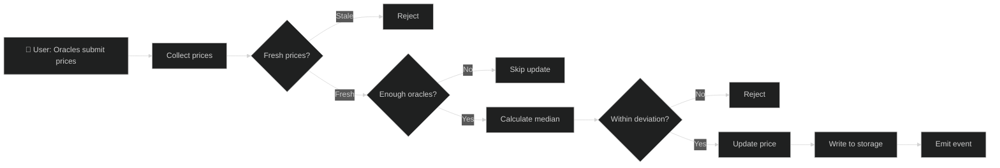
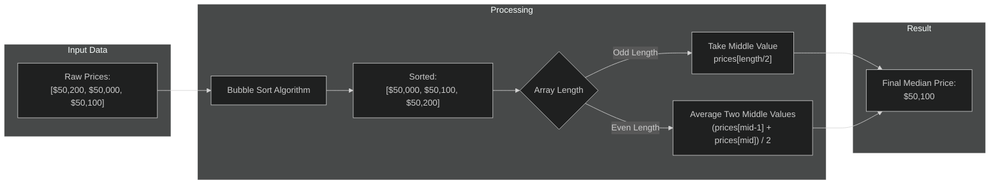
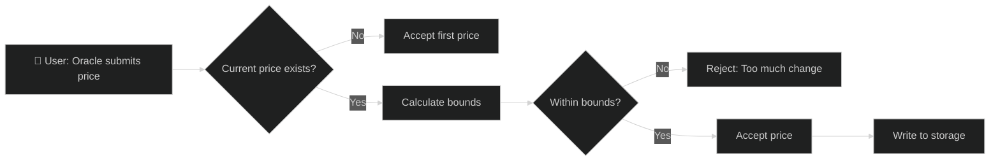
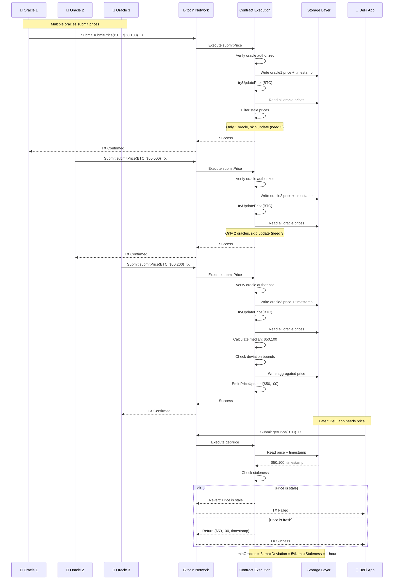
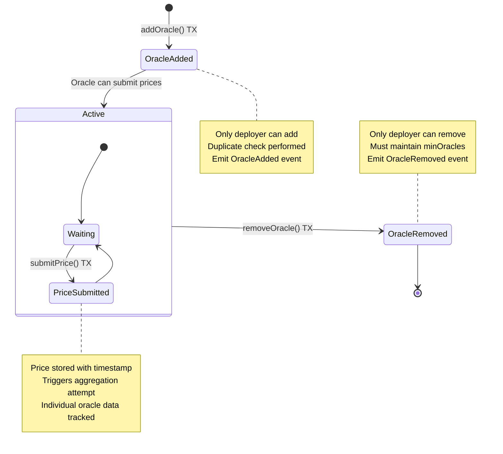

# Oracle Integration Example

A multi-oracle price aggregation system that demonstrates how to build reliable price feeds for DeFi applications.

## Overview

This example demonstrates:
- Multiple oracle sources
- Price aggregation strategies
- Stale data protection
- Deviation thresholds
- Admin controls for oracle management
- Decorators for ABI generation

## Multi-Oracle Price Aggregation

The oracle system collects prices from multiple sources and aggregates them using a median calculation:



## Median Calculation Process

The median is calculated by sorting all submitted prices and taking the middle value:



### Median Implementation

```typescript
private calculateMedian(prices: u256[]): u256 {
    const len = prices.length;

    // Simple bubble sort for small arrays
    for (let i = 0; i < len; i++) {
        for (let j = i + 1; j < len; j++) {
            if (prices[j] < prices[i]) {
                const temp = prices[i];
                prices[i] = prices[j];
                prices[j] = temp;
            }
        }
    }

    const mid = len / 2;
    if (len % 2 == 0) {
        // Average of two middle values
        return SafeMath.div(
            SafeMath.add(prices[mid - 1], prices[mid]),
            u256.fromU64(2)
        );
    } else {
        return prices[mid];
    }
}
```

**Solidity Comparison:**

```solidity
// Solidity - Chainlink-style aggregator
function latestRoundData() external view returns (
    uint80 roundId,
    int256 answer,
    uint256 startedAt,
    uint256 updatedAt,
    uint80 answeredInRound
);

// OPNet - Custom multi-oracle aggregation
@method({ name: 'asset', type: ABIDataTypes.ADDRESS })
@returns(
    { name: 'price', type: ABIDataTypes.UINT256 },
    { name: 'timestamp', type: ABIDataTypes.UINT64 },
)
public getPrice(calldata: Calldata): BytesWriter { }
```

## Deviation Check

Price updates are validated against deviation thresholds to prevent manipulation:



### Deviation Implementation

```typescript
private withinDeviation(oldPrice: u256, newPrice: u256): bool {
    const maxDev = this._maxDeviation.value;
    const basisPoints = u256.fromU64(10000);

    // Calculate allowed deviation
    const maxChange = SafeMath.div(SafeMath.mul(oldPrice, maxDev), basisPoints);

    // Check if new price is within range
    const lowerBound = SafeMath.sub(oldPrice, maxChange);
    const upperBound = SafeMath.add(oldPrice, maxChange);

    return newPrice >= lowerBound && newPrice <= upperBound;
}
```

## Price Submission and Retrieval

The complete flow shows how multiple oracles submit prices and how consumers retrieve the aggregated price:



## Oracle Management

Oracles can be added and removed by the contract deployer:



## Complete Implementation

```typescript
import { u256 } from '@btc-vision/as-bignum/assembly';
import {
    OP_NET,
    Blockchain,
    Address,
    Calldata,
    BytesWriter,
    SafeMath,
    Revert,
    NetEvent,
    StoredU256,
    StoredU64,
    StoredU8,
    StoredAddressArray,
    AddressMemoryMap,
    ABIDataTypes,
    sha256,
    encodePointer,
} from '@btc-vision/btc-runtime/runtime';

// Events
class PriceUpdated extends NetEvent {
    public constructor(
        public readonly asset: Address,
        public readonly price: u256,
        public readonly timestamp: u64
    ) {
        super('PriceUpdated');
    }

    protected override encodeData(writer: BytesWriter): void {
        writer.writeAddress(this.asset);
        writer.writeU256(this.price);
        writer.writeU64(this.timestamp);
    }
}

class OracleAdded extends NetEvent {
    public constructor(public readonly oracle: Address) {
        super('OracleAdded');
    }

    protected override encodeData(writer: BytesWriter): void {
        writer.writeAddress(this.oracle);
    }
}

class OracleRemoved extends NetEvent {
    public constructor(public readonly oracle: Address) {
        super('OracleRemoved');
    }

    protected override encodeData(writer: BytesWriter): void {
        writer.writeAddress(this.oracle);
    }
}

@final
export class MultiOracle extends OP_NET {
    // Oracle list
    private oraclesPointer: u16 = Blockchain.nextPointer;
    private oracles: StoredAddressArray;

    // Configuration
    private minOraclesPointer: u16 = Blockchain.nextPointer;
    private maxDeviationPointer: u16 = Blockchain.nextPointer;
    private maxStalenessPointer: u16 = Blockchain.nextPointer;

    private _minOracles: StoredU8;
    private _maxDeviation: StoredU256;  // In basis points (100 = 1%)
    private _maxStaleness: StoredU64;   // In seconds

    // Price data per asset
    private pricesPointer: u16 = Blockchain.nextPointer;
    private timestampsPointer: u16 = Blockchain.nextPointer;

    private _prices: AddressMemoryMap;
    private _timestamps: AddressMemoryMap;

    // Individual oracle submissions
    private oraclePricesPointer: u16 = Blockchain.nextPointer;
    private oracleTimestampsPointer: u16 = Blockchain.nextPointer;

    public constructor() {
        super();

        this.oracles = new StoredAddressArray(this.oraclesPointer);
        this._minOracles = new StoredU8(this.minOraclesPointer, 1);
        this._maxDeviation = new StoredU256(this.maxDeviationPointer, EMPTY_POINTER);
        this._maxStaleness = new StoredU64(this.maxStalenessPointer, 3600); // 1 hour

        this._prices = new AddressMemoryMap(this.pricesPointer);
        this._timestamps = new AddressMemoryMap(this.timestampsPointer);
    }

    public override onDeployment(calldata: Calldata): void {
        const minOracles = calldata.readU8();
        const maxDeviation = calldata.readU256();
        const maxStaleness = calldata.readU64();
        const initialOracles = calldata.readAddressArray();

        this._minOracles.value = minOracles;
        this._maxDeviation.value = maxDeviation;
        this._maxStaleness.value = maxStaleness;

        // Add initial oracles
        for (let i = 0; i < initialOracles.length; i++) {
            this.oracles.push(initialOracles[i]);
            this.emitEvent(new OracleAdded(initialOracles[i]));
        }
    }

    // ============ ORACLE MANAGEMENT ============

    @method({ name: 'oracle', type: ABIDataTypes.ADDRESS })
    @returns({ name: 'success', type: ABIDataTypes.BOOL })
    @emit('OracleAdded')
    public addOracle(calldata: Calldata): BytesWriter {
        this.onlyDeployer(Blockchain.tx.sender);

        const oracle = calldata.readAddress();

        // Check not already added
        const length = this.oracles.length;
        for (let i: u64 = 0; i < length; i++) {
            if (this.oracles.get(i).equals(oracle)) {
                throw new Revert('Oracle already exists');
            }
        }

        this.oracles.push(oracle);
        this.emitEvent(new OracleAdded(oracle));

        return new BytesWriter(0);
    }

    @method({ name: 'oracle', type: ABIDataTypes.ADDRESS })
    @returns({ name: 'success', type: ABIDataTypes.BOOL })
    @emit('OracleRemoved')
    public removeOracle(calldata: Calldata): BytesWriter {
        this.onlyDeployer(Blockchain.tx.sender);

        const oracle = calldata.readAddress();

        // Find and remove
        let found = false;
        const length = this.oracles.length;

        for (let i: u64 = 0; i < length; i++) {
            if (this.oracles.get(i).equals(oracle)) {
                // Swap with last and pop
                if (i < length - 1) {
                    this.oracles.set(i, this.oracles.get(length - 1));
                }
                this.oracles.pop();
                found = true;
                break;
            }
        }

        if (!found) {
            throw new Revert('Oracle not found');
        }

        // Ensure minimum oracles remain
        if (this.oracles.length < u64(this._minOracles.value)) {
            throw new Revert('Would go below minimum oracles');
        }

        this.emitEvent(new OracleRemoved(oracle));

        return new BytesWriter(0);
    }

    // ============ PRICE SUBMISSION ============

    /**
     * Submit price update from authorized oracle.
     */
    @method(
        { name: 'asset', type: ABIDataTypes.ADDRESS },
        { name: 'price', type: ABIDataTypes.UINT256 },
    )
    @returns({ name: 'success', type: ABIDataTypes.BOOL })
    @emit('PriceUpdated')
    public submitPrice(calldata: Calldata): BytesWriter {
        const oracle = Blockchain.tx.sender;

        // Verify sender is authorized oracle
        if (!this.isOracle(oracle)) {
            throw new Revert('Not authorized oracle');
        }

        const asset = calldata.readAddress();
        const price = calldata.readU256();

        // Store individual oracle submission
        const key = this.oracleAssetKey(oracle, asset);
        this.setOraclePrice(key, price);
        this.setOracleTimestamp(key, Blockchain.block.medianTime);

        // Try to update aggregated price
        this.tryUpdatePrice(asset);

        return new BytesWriter(0);
    }

    /**
     * Attempt to aggregate and update the asset price.
     */
    private tryUpdatePrice(asset: Address): void {
        const prices: u256[] = [];
        const now = Blockchain.block.medianTime;
        const maxStale = this._maxStaleness.value;

        // Collect valid prices from all oracles
        const oracleCount = this.oracles.length;
        for (let i: u64 = 0; i < oracleCount; i++) {
            const oracle = this.oracles.get(i);
            const key = this.oracleAssetKey(oracle, asset);

            const price = this.getOraclePrice(key);
            const timestamp = this.getOracleTimestamp(key);

            // Skip stale or unset prices
            if (price.isZero()) continue;
            if (now - timestamp > maxStale) continue;

            prices.push(price);
        }

        // Check minimum oracles
        if (u32(prices.length) < u32(this._minOracles.value)) {
            return;  // Not enough fresh prices
        }

        // Calculate median price
        const medianPrice = this.calculateMedian(prices);

        // Check deviation from current price
        const currentPrice = this._prices.get(asset);
        if (!currentPrice.isZero()) {
            if (!this.withinDeviation(currentPrice, medianPrice)) {
                // Price moved too much - might be manipulation
                // In production, you might want different handling
                return;
            }
        }

        // Update price
        this._prices.set(asset, medianPrice);
        // AddressMemoryMap stores u256; convert timestamp to u256
        this._timestamps.set(asset, u256.fromU64(now));

        this.emitEvent(new PriceUpdated(asset, medianPrice, now));
    }

    // ============ PRICE READING ============

    /**
     * Get the latest price for an asset.
     */
    @method({ name: 'asset', type: ABIDataTypes.ADDRESS })
    @returns(
        { name: 'price', type: ABIDataTypes.UINT256 },
        { name: 'timestamp', type: ABIDataTypes.UINT64 },
    )
    public getPrice(calldata: Calldata): BytesWriter {
        const asset = calldata.readAddress();

        const price = this._prices.get(asset);
        // AddressMemoryMap returns u256; convert to u64 for timestamp
        const timestamp: u64 = this._timestamps.get(asset).toU64();

        // Check for stale price
        const now = Blockchain.block.medianTime;
        if (now - timestamp > this._maxStaleness.value) {
            throw new Revert('Price is stale');
        }

        if (price.isZero()) {
            throw new Revert('Price not available');
        }

        const writer = new BytesWriter(40);
        writer.writeU256(price);
        writer.writeU64(timestamp);
        return writer;
    }

    /**
     * Get price without staleness check (for reference).
     */
    @method({ name: 'asset', type: ABIDataTypes.ADDRESS })
    @returns(
        { name: 'price', type: ABIDataTypes.UINT256 },
        { name: 'timestamp', type: ABIDataTypes.UINT64 },
    )
    public getLatestPrice(calldata: Calldata): BytesWriter {
        const asset = calldata.readAddress();

        const writer = new BytesWriter(40);
        writer.writeU256(this._prices.get(asset));
        // AddressMemoryMap returns u256; convert to u64 for timestamp
        writer.writeU64(this._timestamps.get(asset).toU64());
        return writer;
    }

    // ============ HELPERS ============

    private isOracle(addr: Address): bool {
        const length = this.oracles.length;
        for (let i: u64 = 0; i < length; i++) {
            if (this.oracles.get(i).equals(addr)) {
                return true;
            }
        }
        return false;
    }

    private oracleAssetKey(oracle: Address, asset: Address): u256 {
        const combined = new Uint8Array(64);
        combined.set(oracle, 0);
        combined.set(asset, 32);
        return u256.fromBytes(sha256(combined));
    }

    private calculateMedian(prices: u256[]): u256 {
        const len = prices.length;

        // Simple bubble sort for small arrays
        for (let i = 0; i < len; i++) {
            for (let j = i + 1; j < len; j++) {
                if (prices[j] < prices[i]) {
                    const temp = prices[i];
                    prices[i] = prices[j];
                    prices[j] = temp;
                }
            }
        }

        const mid = len / 2;
        if (len % 2 == 0) {
            // Average of two middle values
            return SafeMath.div(
                SafeMath.add(prices[mid - 1], prices[mid]),
                u256.fromU64(2)
            );
        } else {
            return prices[mid];
        }
    }

    private withinDeviation(oldPrice: u256, newPrice: u256): bool {
        const maxDev = this._maxDeviation.value;
        const basisPoints = u256.fromU64(10000);

        // Calculate allowed deviation
        const maxChange = SafeMath.div(SafeMath.mul(oldPrice, maxDev), basisPoints);

        // Check if new price is within range
        const lowerBound = SafeMath.sub(oldPrice, maxChange);
        const upperBound = SafeMath.add(oldPrice, maxChange);

        return newPrice >= lowerBound && newPrice <= upperBound;
    }

    // Storage helpers using encodePointer for proper storage keys
    private setOraclePrice(key: u256, price: u256): void {
        const keyBytes = key.toUint8Array(true).subarray(2, 32);  // Use 30 bytes
        const pointerHash = encodePointer(this.oraclePricesPointer, keyBytes);
        Blockchain.setStorageAt(pointerHash, price.toUint8Array(true));
    }

    private getOraclePrice(key: u256): u256 {
        const keyBytes = key.toUint8Array(true).subarray(2, 32);  // Use 30 bytes
        const pointerHash = encodePointer(this.oraclePricesPointer, keyBytes);
        const stored = Blockchain.getStorageAt(pointerHash);
        return u256.fromBytes(stored, true);
    }

    private setOracleTimestamp(key: u256, timestamp: u64): void {
        const keyBytes = key.toUint8Array(true).subarray(2, 32);  // Use 30 bytes
        const pointerHash = encodePointer(this.oracleTimestampsPointer, keyBytes);
        Blockchain.setStorageAt(pointerHash, u256.fromU64(timestamp).toUint8Array(true));
    }

    private getOracleTimestamp(key: u256): u64 {
        const keyBytes = key.toUint8Array(true).subarray(2, 32);  // Use 30 bytes
        const pointerHash = encodePointer(this.oracleTimestampsPointer, keyBytes);
        const stored = Blockchain.getStorageAt(pointerHash);
        return u256.fromBytes(stored, true).toU64();
    }

    // ============ VIEW FUNCTIONS ============

    @method()
    @returns({ name: 'oracles', type: ABIDataTypes.ADDRESS_ARRAY })
    public getOracles(_calldata: Calldata): BytesWriter {
        const count = this.oracles.length;
        // Use u32 cast for length - arrays in AssemblyScript are i32 indexed
        const countU32 = u32(count);
        const writer = new BytesWriter(4 + 32 * i32(count));

        writer.writeU32(countU32);
        for (let i: u64 = 0; i < count; i++) {
            writer.writeAddress(this.oracles.get(i));
        }

        return writer;
    }

    @method()
    @returns(
        { name: 'minOracles', type: ABIDataTypes.UINT8 },
        { name: 'maxDeviation', type: ABIDataTypes.UINT256 },
        { name: 'maxStaleness', type: ABIDataTypes.UINT64 },
    )
    public getConfig(_calldata: Calldata): BytesWriter {
        const writer = new BytesWriter(48);

        writer.writeU8(this._minOracles.value);
        writer.writeU256(this._maxDeviation.value);
        writer.writeU64(this._maxStaleness.value);

        return writer;
    }

    @method({ name: 'oracle', type: ABIDataTypes.ADDRESS })
    @returns({ name: 'isOracle', type: ABIDataTypes.BOOL })
    public checkIsOracle(calldata: Calldata): BytesWriter {
        const oracle = calldata.readAddress();

        const writer = new BytesWriter(1);
        writer.writeBoolean(this.isOracle(oracle));
        return writer;
    }
}
```

## Key Concepts

### Multi-Oracle Aggregation

```
Oracle 1 -> Price: 100.5
Oracle 2 -> Price: 100.3     ->  Median: 100.4  ->  Aggregated Price
Oracle 3 -> Price: 100.4
```

### Staleness Protection

```typescript
// Check for stale price
const now = Blockchain.block.medianTime;
if (now - timestamp > this._maxStaleness.value) {
    throw new Revert('Price is stale');
}
```

### Timestamp Storage

AddressMemoryMap stores and returns u256 values. Convert timestamps as needed:

```typescript
// AddressMemoryMap stores u256 values
private _timestamps: AddressMemoryMap;
this._timestamps = new AddressMemoryMap(this.timestampsPointer);

// Store timestamp as u256
this._timestamps.set(asset, u256.fromU64(Blockchain.block.medianTime));

// Retrieve timestamp and convert to u64
const timestamp: u64 = this._timestamps.get(asset).toU64();
```

## Usage

### Deploy

```typescript
const writer = new BytesWriter(128);
writer.writeU8(3);                              // minOracles
writer.writeU256(u256.fromU64(500));            // maxDeviation (5%)
writer.writeU64(3600);                          // maxStaleness (1 hour)
writer.writeAddressArray([oracle1, oracle2, oracle3]);
```

### Submit Price (Oracle)

```typescript
const SUBMIT_PRICE_SELECTOR: u32 = 0x8d6cc56d;  // submitPrice(address,uint256)

const writer = new BytesWriter(68);
writer.writeSelector(SUBMIT_PRICE_SELECTOR);
writer.writeAddress(btcAsset);
writer.writeU256(u256.fromU64(50000_000000));  // $50,000 with 6 decimals
```

### Read Price

```typescript
const GET_PRICE_SELECTOR: u32 = 0x41976e09;  // getPrice(address)

const writer = new BytesWriter(36);
writer.writeSelector(GET_PRICE_SELECTOR);
writer.writeAddress(btcAsset);

const result = contract.call(oracle, writer.getBuffer(), true);
// Returns: price (u256), timestamp (u64)
```

## Best Practices

### 1. Use Proper Type Casts

```typescript
// Converting u64 array length to u32 for BytesWriter
const count = this.oracles.length;  // u64
const countU32 = u32(count);
const writer = new BytesWriter(4 + 32 * i32(countU32));
```

### 2. Handle Timestamps Properly

```typescript
// AddressMemoryMap stores u256 values
private _maxStaleness: StoredU64;
private _timestamps: AddressMemoryMap;

// Store timestamp as u256
this._timestamps.set(asset, u256.fromU64(Blockchain.block.medianTime));

// Retrieve and convert to u64
const timestamp: u64 = this._timestamps.get(asset).toU64();
```

### 3. Add Decorators for ABI Generation

```typescript
@method({ name: 'asset', type: ABIDataTypes.ADDRESS })
@returns(
    { name: 'price', type: ABIDataTypes.UINT256 },
    { name: 'timestamp', type: ABIDataTypes.UINT64 },
)
public getPrice(calldata: Calldata): BytesWriter { }
```

## Solidity Equivalent

For developers familiar with Solidity, here is an equivalent Chainlink-style oracle aggregator implementation:

```solidity
// SPDX-License-Identifier: MIT
pragma solidity ^0.8.20;

import "@openzeppelin/contracts/access/Ownable.sol";

interface AggregatorV3Interface {
    function latestRoundData() external view returns (
        uint80 roundId,
        int256 answer,
        uint256 startedAt,
        uint256 updatedAt,
        uint80 answeredInRound
    );
}

contract MultiOracle is Ownable {
    struct PriceData {
        uint256 price;
        uint64 timestamp;
    }

    address[] public oracles;
    mapping(address => bool) public isOracle;

    uint8 public minOracles;
    uint256 public maxDeviation; // In basis points (100 = 1%)
    uint64 public maxStaleness;  // In seconds

    // Aggregated prices per asset
    mapping(address => PriceData) public prices;

    // Individual oracle submissions
    mapping(bytes32 => PriceData) private oracleSubmissions;

    event PriceUpdated(address indexed asset, uint256 price, uint64 timestamp);
    event OracleAdded(address indexed oracle);
    event OracleRemoved(address indexed oracle);

    constructor(
        uint8 _minOracles,
        uint256 _maxDeviation,
        uint64 _maxStaleness,
        address[] memory _initialOracles
    ) Ownable(msg.sender) {
        minOracles = _minOracles;
        maxDeviation = _maxDeviation;
        maxStaleness = _maxStaleness;

        for (uint i = 0; i < _initialOracles.length; i++) {
            oracles.push(_initialOracles[i]);
            isOracle[_initialOracles[i]] = true;
            emit OracleAdded(_initialOracles[i]);
        }
    }

    function addOracle(address oracle) external onlyOwner {
        require(!isOracle[oracle], "Oracle already exists");
        oracles.push(oracle);
        isOracle[oracle] = true;
        emit OracleAdded(oracle);
    }

    function removeOracle(address oracle) external onlyOwner {
        require(isOracle[oracle], "Oracle not found");
        require(oracles.length > minOracles, "Would go below minimum oracles");

        // Find and remove
        for (uint i = 0; i < oracles.length; i++) {
            if (oracles[i] == oracle) {
                oracles[i] = oracles[oracles.length - 1];
                oracles.pop();
                break;
            }
        }
        isOracle[oracle] = false;
        emit OracleRemoved(oracle);
    }

    function submitPrice(address asset, uint256 price) external {
        require(isOracle[msg.sender], "Not authorized oracle");

        bytes32 key = keccak256(abi.encodePacked(msg.sender, asset));
        oracleSubmissions[key] = PriceData(price, uint64(block.timestamp));

        _tryUpdatePrice(asset);
    }

    function _tryUpdatePrice(address asset) internal {
        uint256[] memory validPrices = new uint256[](oracles.length);
        uint256 validCount = 0;

        for (uint i = 0; i < oracles.length; i++) {
            bytes32 key = keccak256(abi.encodePacked(oracles[i], asset));
            PriceData memory data = oracleSubmissions[key];

            // Skip stale or unset prices
            if (data.price == 0) continue;
            if (block.timestamp - data.timestamp > maxStaleness) continue;

            validPrices[validCount] = data.price;
            validCount++;
        }

        if (validCount < minOracles) return;

        uint256 medianPrice = _calculateMedian(validPrices, validCount);

        // Check deviation
        PriceData memory current = prices[asset];
        if (current.price != 0 && !_withinDeviation(current.price, medianPrice)) {
            return;
        }

        prices[asset] = PriceData(medianPrice, uint64(block.timestamp));
        emit PriceUpdated(asset, medianPrice, uint64(block.timestamp));
    }

    function _calculateMedian(uint256[] memory arr, uint256 len) internal pure returns (uint256) {
        // Simple bubble sort
        for (uint i = 0; i < len; i++) {
            for (uint j = i + 1; j < len; j++) {
                if (arr[j] < arr[i]) {
                    (arr[i], arr[j]) = (arr[j], arr[i]);
                }
            }
        }

        uint256 mid = len / 2;
        if (len % 2 == 0) {
            return (arr[mid - 1] + arr[mid]) / 2;
        }
        return arr[mid];
    }

    function _withinDeviation(uint256 oldPrice, uint256 newPrice) internal view returns (bool) {
        uint256 maxChange = (oldPrice * maxDeviation) / 10000;
        uint256 lowerBound = oldPrice - maxChange;
        uint256 upperBound = oldPrice + maxChange;
        return newPrice >= lowerBound && newPrice <= upperBound;
    }

    function getPrice(address asset) external view returns (uint256 price, uint64 timestamp) {
        PriceData memory data = prices[asset];
        require(data.price != 0, "Price not available");
        require(block.timestamp - data.timestamp <= maxStaleness, "Price is stale");
        return (data.price, data.timestamp);
    }

    function getLatestPrice(address asset) external view returns (uint256 price, uint64 timestamp) {
        PriceData memory data = prices[asset];
        return (data.price, data.timestamp);
    }

    function getOracles() external view returns (address[] memory) {
        return oracles;
    }
}
```

## Solidity vs OPNet Comparison

### Key Differences Table

| Aspect | Solidity (Chainlink-style) | OPNet |
|--------|---------------------------|-------|
| **Oracle Interface** | `AggregatorV3Interface` with rounds | Custom multi-oracle aggregation |
| **Price Storage** | `mapping(address => PriceData)` | `AddressMemoryMap` |
| **Timestamp Source** | `block.timestamp` | `Blockchain.block.medianTime` |
| **Key Generation** | `keccak256(abi.encodePacked(...))` | `sha256(combined)` |
| **Array Handling** | Dynamic arrays with `.push()/.pop()` | `StoredAddressArray` |
| **Sorting** | In-memory array manipulation | Same pattern, u256 comparisons |
| **Staleness Check** | `block.timestamp - data.timestamp` | `now - timestamp > maxStaleness` |
| **Return Format** | Multiple return values | `BytesWriter` serialization |

### Chainlink vs OPNet Oracle Pattern

**Chainlink (Solidity) - Consumer Pattern:**
```solidity
import "@chainlink/contracts/src/v0.8/interfaces/AggregatorV3Interface.sol";

contract PriceConsumer {
    AggregatorV3Interface internal priceFeed;

    constructor() {
        // ETH/USD on Ethereum mainnet
        priceFeed = AggregatorV3Interface(0x5f4eC3Df9cbd43714FE2740f5E3616155c5b8419);
    }

    function getLatestPrice() public view returns (int256) {
        (
            uint80 roundId,
            int256 answer,
            uint256 startedAt,
            uint256 updatedAt,
            uint80 answeredInRound
        ) = priceFeed.latestRoundData();

        require(updatedAt > block.timestamp - 3600, "Stale price");
        return answer;
    }
}
```

**OPNet - Self-Contained Oracle:**
```typescript
@method({ name: 'asset', type: ABIDataTypes.ADDRESS })
@returns(
    { name: 'price', type: ABIDataTypes.UINT256 },
    { name: 'timestamp', type: ABIDataTypes.UINT64 },
)
public getPrice(calldata: Calldata): BytesWriter {
    const asset = calldata.readAddress();
    const price = this._prices.get(asset);
    // AddressMemoryMap returns u256; convert to u64 for timestamp
    const timestamp: u64 = this._timestamps.get(asset).toU64();

    const now = Blockchain.block.medianTime;
    if (now - timestamp > this._maxStaleness.value) {
        throw new Revert('Price is stale');
    }

    const writer = new BytesWriter(40);
    writer.writeU256(price);
    writer.writeU64(timestamp);
    return writer;
}
```

### Price Aggregation Comparison

**Solidity:**
```solidity
function _calculateMedian(uint256[] memory arr, uint256 len) internal pure returns (uint256) {
    // Bubble sort
    for (uint i = 0; i < len; i++) {
        for (uint j = i + 1; j < len; j++) {
            if (arr[j] < arr[i]) {
                (arr[i], arr[j]) = (arr[j], arr[i]);
            }
        }
    }

    uint256 mid = len / 2;
    if (len % 2 == 0) {
        return (arr[mid - 1] + arr[mid]) / 2;
    }
    return arr[mid];
}
```

**OPNet:**
```typescript
private calculateMedian(prices: u256[]): u256 {
    const len = prices.length;

    // Bubble sort for small arrays
    for (let i = 0; i < len; i++) {
        for (let j = i + 1; j < len; j++) {
            if (prices[j] < prices[i]) {
                const temp = prices[i];
                prices[i] = prices[j];
                prices[j] = temp;
            }
        }
    }

    const mid = len / 2;
    if (len % 2 == 0) {
        return SafeMath.div(
            SafeMath.add(prices[mid - 1], prices[mid]),
            u256.fromU64(2)
        );
    }
    return prices[mid];
}
```

### Storage Key Generation Comparison

**Solidity:**
```solidity
// Uses keccak256 for storage key
bytes32 key = keccak256(abi.encodePacked(oracle, asset));
oracleSubmissions[key] = PriceData(price, timestamp);
```

**OPNet:**
```typescript
// Uses sha256 for storage key
private oracleAssetKey(oracle: Address, asset: Address): u256 {
    const combined = new Uint8Array(64);
    combined.set(oracle, 0);
    combined.set(asset, 32);
    return u256.fromBytes(sha256(combined));
}

// Uses encodePointer for proper storage addressing
private setOraclePrice(key: u256, price: u256): void {
    const keyBytes = key.toUint8Array(true).subarray(2, 32);
    const pointerHash = encodePointer(this.oraclePricesPointer, keyBytes);
    Blockchain.setStorageAt(pointerHash, price.toUint8Array(true));
}
```

### Advantages of OPNet Approach

| Feature | Benefit |
|---------|---------|
| **Self-Contained Oracle** | No external dependencies like Chainlink feeds |
| **Multi-Oracle Aggregation** | Built-in median calculation from multiple sources |
| **Bitcoin Timestamp** | Uses `medianTime` for manipulation resistance |
| **Flexible Configuration** | Runtime-configurable min oracles, deviation, staleness |
| **Native u256 Math** | First-class 256-bit integer support |
| **Explicit Storage** | Direct control over storage layout with pointers |
| **No External Calls** | All oracle logic contained within single contract |

### Deviation Check Comparison

**Solidity:**
```solidity
function _withinDeviation(uint256 oldPrice, uint256 newPrice) internal view returns (bool) {
    uint256 maxChange = (oldPrice * maxDeviation) / 10000;
    uint256 lowerBound = oldPrice - maxChange;
    uint256 upperBound = oldPrice + maxChange;
    return newPrice >= lowerBound && newPrice <= upperBound;
}
```

**OPNet:**
```typescript
private withinDeviation(oldPrice: u256, newPrice: u256): bool {
    const maxDev = this._maxDeviation.value;
    const basisPoints = u256.fromU64(10000);

    const maxChange = SafeMath.div(SafeMath.mul(oldPrice, maxDev), basisPoints);
    const lowerBound = SafeMath.sub(oldPrice, maxChange);
    const upperBound = SafeMath.add(oldPrice, maxChange);

    return newPrice >= lowerBound && newPrice <= upperBound;
}
```

### Oracle Authorization Comparison

**Solidity:**
```solidity
address[] public oracles;
mapping(address => bool) public isOracle;

function submitPrice(address asset, uint256 price) external {
    require(isOracle[msg.sender], "Not authorized oracle");
    // ...
}
```

**OPNet:**
```typescript
private oracles: StoredAddressArray;

private isOracle(addr: Address): bool {
    const length = this.oracles.length;
    for (let i: u64 = 0; i < length; i++) {
        if (this.oracles.get(i).equals(addr)) {
            return true;
        }
    }
    return false;
}

public submitPrice(calldata: Calldata): BytesWriter {
    if (!this.isOracle(Blockchain.tx.sender)) {
        throw new Revert('Not authorized oracle');
    }
    // ...
}
```

### When to Choose Each Approach

| Use Case | Recommended Approach |
|----------|---------------------|
| **Need Chainlink feeds** | Solidity with AggregatorV3Interface |
| **Custom oracle network** | OPNet multi-oracle aggregation |
| **Bitcoin-native DeFi** | OPNet with Bitcoin timestamp |
| **Existing EVM infrastructure** | Solidity |
| **New protocol on Bitcoin** | OPNet |

---

**Navigation:**
- Previous: [Stablecoin](./stablecoin.md)
- Next: [API Reference - Blockchain](../api-reference/blockchain.md)
