# Stablecoin Example

A production-ready stablecoin implementation with role-based access control, pausability, blacklist functionality, and minter allowances.

## Overview

This example demonstrates:
- Role-based access control (Admin, Minter, Pauser, Blacklister)
- Pausable transfers
- Address blacklisting
- Minter allowances with supply caps
- Decorators for ABI generation
- Detailed event logging

## Role-Based Access Control

Roles use bit flags (powers of 2) for efficient storage and checking:


### Role Implementation

```typescript
// Define roles as enum with bit flags
enum Role {
    ADMIN = 1,        // 2^0
    MINTER = 2,       // 2^1
    PAUSER = 4,       // 2^2
    BLACKLISTER = 8   // 2^3
}

// Check role before action
private onlyRole(role: u256): void {
    if (!this.hasRole(Blockchain.tx.sender, role)) {
        throw new Revert('AccessControl: missing role');
    }
}

public hasRole(account: Address, role: u256): bool {
    const roles = this._roles.get(account);
    return !SafeMath.and(roles, role).isZero();
}
```

**Solidity Comparison:**

```solidity
// Solidity - OpenZeppelin AccessControl
bytes32 public constant MINTER_ROLE = keccak256("MINTER_ROLE");

function hasRole(bytes32 role, address account) public view returns (bool) {
    return _roles[role].members[account];
}

modifier onlyRole(bytes32 role) {
    require(hasRole(role, msg.sender), "AccessControl: missing role");
    _;
}

// OPNet - Bit flags for efficiency
enum Role { ADMIN = 1, MINTER = 2, PAUSER = 4, BLACKLISTER = 8 }

public hasRole(account: Address, role: u256): bool {
    const roles = this._roles.get(account);
    return !SafeMath.and(roles, role).isZero();
}
```

### Grant/Revoke Flow

```mermaid
---
config:
  theme: dark
---
flowchart LR
    A["👤 User submits grantRole TX"] --> B{Has ADMIN role?}
    B -->|No| C[Revert: Missing role]
    B -->|Yes| D[Read current roles]
    D --> E[OR roles together]
    E --> F[Write to storage]
    F --> G[Emit event]
    G --> H[TX Success]
```



### Role Hierarchy

```
Admin (Role.ADMIN = 1)
- Can grant/revoke all roles
- Can update master minter
- Has emergency powers

Master Minter
- Configure minter allowances
- Add new minters
- Remove minters

Minter (Role.MINTER = 2)
- Mint up to allowance
- Burn own tokens

Pauser (Role.PAUSER = 4)
- Pause all transfers
- Unpause

Blacklister (Role.BLACKLISTER = 8)
- Add addresses to blacklist
- Remove from blacklist
```

## Pausable Functionality

The contract can be paused to block all transfers:


### Pausable Implementation

```typescript
private whenNotPaused(): void {
    if (this._paused.value) {
        throw new Revert('Pausable: paused');
    }
}

@method()
@emit('Paused')
public pause(_calldata: Calldata): BytesWriter {
    this.onlyRole(u256.fromU64(Role.PAUSER));
    this._paused.value = true;
    this.emitEvent(new Paused(Blockchain.tx.sender));
    return new BytesWriter(0);
}
```

**Solidity Comparison:**

```solidity
// Solidity - OpenZeppelin Pausable
modifier whenNotPaused() {
    require(!paused(), "Pausable: paused");
    _;
}

function pause() external onlyRole(PAUSER_ROLE) {
    _pause();
}

// OPNet
private whenNotPaused(): void {
    if (this._paused.value) {
        throw new Revert('Pausable: paused');
    }
}
```

## Blacklist System

Addresses can be blacklisted to prevent transfers. Each address exists in one of two states:

```mermaid
---
config:
  theme: dark
---
flowchart LR
    A["👤 User submits transfer TX"] --> B{Contract paused?}
    B -->|Yes| C[Revert: Paused]
    B -->|No| D{Blacklisted?}
    D -->|Yes| E[Revert: Blacklisted]
    D -->|No| F{Sufficient balance?}
    F -->|No| G[Revert: Insufficient balance]
    F -->|Yes| H[Update balances]
    H --> I[Emit event]
    I --> J[TX Success]
```




### Blacklist Implementation

```typescript
private notBlacklisted(account: Address): void {
    // AddressMemoryMap.get() returns u256; non-zero means blacklisted
    if (!this._blacklist.get(account).isZero()) {
        throw new Revert('Blacklisted');
    }
}

public override transfer(calldata: Calldata): BytesWriter {
    this.whenNotPaused();
    this.notBlacklisted(Blockchain.tx.sender);

    const to = calldata.readAddress();
    this.notBlacklisted(to);

    // Continue with transfer...
}
```

## Minter Allowance System

Each minter has a limited supply they can mint. The master minter configures allowances for each minter:

```mermaid
sequenceDiagram
    participant MasterMinter as 👤 Master Minter
    participant BTC as Bitcoin Network
    participant Contract as Contract Execution
    participant Minter as 👤 Minter
    participant Storage as Storage Layer

    MasterMinter->>BTC: Submit configureMinter(minter, allowance) TX
    BTC->>Contract: Execute configureMinter
    Contract->>Contract: Check caller is master minter
    Contract->>Storage: Write Role.MINTER if needed
    Contract->>Storage: Write minter allowance
    Storage-->>Contract: Success
    Contract-->>BTC: Success
    BTC-->>MasterMinter: TX Confirmed

    Note over Minter,Storage: Later: Minter wants to mint

    Minter->>BTC: Submit mint(to, amount) TX
    BTC->>Contract: Execute mint
    Contract->>Contract: Check Role.MINTER
    Contract->>Contract: Check not paused
    Contract->>Contract: Check blacklist (to + minter)
    Contract->>Storage: Read minter allowance
    Storage-->>Contract: currentAllowance

    alt amount > allowance
        Contract-->>BTC: Revert: Allowance exceeded
        BTC-->>Minter: TX Failed
    else amount <= allowance
        Contract->>Storage: Write allowance -= amount
        Contract->>Storage: Write _mint(to, amount)
        Contract->>Contract: Emit Mint event
        Contract-->>BTC: Success
        BTC-->>Minter: TX Confirmed
    end

    Note over Contract,Storage: Allowance tracks remaining mint capacity
```



### Minter Allowance Implementation

```typescript
@method(
    { name: 'minter', type: ABIDataTypes.ADDRESS },
    { name: 'allowance', type: ABIDataTypes.UINT256 },
)
public configureMinter(calldata: Calldata): BytesWriter {
    this.onlyMasterMinter();
    const minter = calldata.readAddress();
    const allowance = calldata.readU256();  // Max they can mint
    // ...
}
```

## Complete Implementation

```typescript
import { u256 } from '@btc-vision/as-bignum/assembly';
import {
    OP20,
    OP20InitParameters,
    Blockchain,
    Address,
    Calldata,
    BytesWriter,
    SafeMath,
    Revert,
    NetEvent,
    StoredBoolean,
    StoredAddress,
    AddressMemoryMap,
    ABIDataTypes,
} from '@btc-vision/btc-runtime/runtime';

// Role enum - MUST be powers of 2 for bitwise operations
enum Role {
    ADMIN = 1,        // 2^0
    MINTER = 2,       // 2^1
    PAUSER = 4,       // 2^2
    BLACKLISTER = 8   // 2^3
}

// Custom events
class RoleGranted extends NetEvent {
    public constructor(
        public readonly role: u256,
        public readonly account: Address,
        public readonly sender: Address
    ) {
        super('RoleGranted');
    }

    protected override encodeData(writer: BytesWriter): void {
        writer.writeU256(this.role);
        writer.writeAddress(this.account);
        writer.writeAddress(this.sender);
    }
}

class RoleRevoked extends NetEvent {
    public constructor(
        public readonly role: u256,
        public readonly account: Address,
        public readonly sender: Address
    ) {
        super('RoleRevoked');
    }

    protected override encodeData(writer: BytesWriter): void {
        writer.writeU256(this.role);
        writer.writeAddress(this.account);
        writer.writeAddress(this.sender);
    }
}

class Blacklisted extends NetEvent {
    public constructor(public readonly account: Address) {
        super('Blacklisted');
    }

    protected override encodeData(writer: BytesWriter): void {
        writer.writeAddress(this.account);
    }
}

class UnBlacklisted extends NetEvent {
    public constructor(public readonly account: Address) {
        super('UnBlacklisted');
    }

    protected override encodeData(writer: BytesWriter): void {
        writer.writeAddress(this.account);
    }
}

class Paused extends NetEvent {
    public constructor(public readonly account: Address) {
        super('Paused');
    }

    protected override encodeData(writer: BytesWriter): void {
        writer.writeAddress(this.account);
    }
}

class Unpaused extends NetEvent {
    public constructor(public readonly account: Address) {
        super('Unpaused');
    }

    protected override encodeData(writer: BytesWriter): void {
        writer.writeAddress(this.account);
    }
}

@final
export class Stablecoin extends OP20 {
    // Access control storage
    private rolesPointer: u16 = Blockchain.nextPointer;
    private masterMinterPointer: u16 = Blockchain.nextPointer;

    // Pausable storage
    private pausedPointer: u16 = Blockchain.nextPointer;

    // Blacklist storage
    private blacklistPointer: u16 = Blockchain.nextPointer;

    // Minter allowances
    private minterAllowancePointer: u16 = Blockchain.nextPointer;

    // Stored values
    private _roles: AddressMemoryMap;
    private _masterMinter: StoredAddress;
    private _paused: StoredBoolean;
    private _blacklist: AddressMemoryMap;
    private _minterAllowance: AddressMemoryMap;

    public constructor() {
        super();

        this._roles = new AddressMemoryMap(this.rolesPointer);
        this._masterMinter = new StoredAddress(this.masterMinterPointer, Address.zero());
        this._paused = new StoredBoolean(this.pausedPointer, false);
        this._blacklist = new AddressMemoryMap(this.blacklistPointer);
        this._minterAllowance = new AddressMemoryMap(this.minterAllowancePointer);
    }

    public override onDeployment(calldata: Calldata): void {
        const name = calldata.readString();
        const symbol = calldata.readString();
        const admin = calldata.readAddress();
        const masterMinter = calldata.readAddress();

        // Initialize as stablecoin (no max supply, 6 decimals typical for USD)
        this.instantiate(new OP20InitParameters(
            u256.Max,  // No max supply
            6,         // USDC-style decimals
            name,
            symbol
        ));

        // Set up initial roles
        this._grantRole(admin, u256.fromU64(Role.ADMIN));
        this._grantRole(admin, u256.fromU64(Role.PAUSER));
        this._grantRole(admin, u256.fromU64(Role.BLACKLISTER));
        this._masterMinter.value = masterMinter;
    }

    // ============ MODIFIERS ============

    private onlyRole(role: u256): void {
        if (!this.hasRole(Blockchain.tx.sender, role)) {
            throw new Revert('AccessControl: missing role');
        }
    }

    private whenNotPaused(): void {
        if (this._paused.value) {
            throw new Revert('Pausable: paused');
        }
    }

    private notBlacklisted(account: Address): void {
        // AddressMemoryMap.get() returns u256; non-zero means blacklisted
        if (!this._blacklist.get(account).isZero()) {
            throw new Revert('Blacklisted');
        }
    }

    private onlyMasterMinter(): void {
        if (!Blockchain.tx.sender.equals(this._masterMinter.value)) {
            throw new Revert('Caller is not master minter');
        }
    }

    // ============ ROLE MANAGEMENT ============

    private _grantRole(account: Address, role: u256): void {
        const currentRoles = this._roles.get(account);
        // Use SafeMath.or for bitwise OR on u256
        const newRoles = SafeMath.or(currentRoles, role);
        this._roles.set(account, newRoles);

        this.emitEvent(new RoleGranted(role, account, Blockchain.tx.sender));
    }

    private _revokeRole(account: Address, role: u256): void {
        const currentRoles = this._roles.get(account);
        // Use SafeMath.xor to invert, then SafeMath.and to clear bits
        const invertedRole = SafeMath.xor(role, u256.Max);
        const newRoles = SafeMath.and(currentRoles, invertedRole);
        this._roles.set(account, newRoles);

        this.emitEvent(new RoleRevoked(role, account, Blockchain.tx.sender));
    }

    public hasRole(account: Address, role: u256): bool {
        const roles = this._roles.get(account);
        // Use SafeMath.and for bitwise AND on u256
        return !SafeMath.and(roles, role).isZero();
    }

    @method(
        { name: 'account', type: ABIDataTypes.ADDRESS },
        { name: 'role', type: ABIDataTypes.UINT256 },
    )
    @returns({ name: 'success', type: ABIDataTypes.BOOL })
    @emit('RoleGranted')
    public grantRole(calldata: Calldata): BytesWriter {
        this.onlyRole(u256.fromU64(Role.ADMIN));

        const account = calldata.readAddress();
        const role = calldata.readU256();

        this._grantRole(account, role);

        return new BytesWriter(0);
    }

    @method(
        { name: 'account', type: ABIDataTypes.ADDRESS },
        { name: 'role', type: ABIDataTypes.UINT256 },
    )
    @returns({ name: 'success', type: ABIDataTypes.BOOL })
    @emit('RoleRevoked')
    public revokeRole(calldata: Calldata): BytesWriter {
        this.onlyRole(u256.fromU64(Role.ADMIN));

        const account = calldata.readAddress();
        const role = calldata.readU256();

        this._revokeRole(account, role);

        return new BytesWriter(0);
    }

    // ============ MINTING ============

    @method(
        { name: 'minter', type: ABIDataTypes.ADDRESS },
        { name: 'allowance', type: ABIDataTypes.UINT256 },
    )
    @returns({ name: 'success', type: ABIDataTypes.BOOL })
    @emit('MinterConfigured')
    public configureMinter(calldata: Calldata): BytesWriter {
        this.onlyMasterMinter();

        const minter = calldata.readAddress();
        const allowance = calldata.readU256();

        // Grant minter role if new
        if (!this.hasRole(minter, u256.fromU64(Role.MINTER))) {
            this._grantRole(minter, u256.fromU64(Role.MINTER));
        }

        // Set allowance
        this._minterAllowance.set(minter, allowance);

        return new BytesWriter(0);
    }

    @method({ name: 'minter', type: ABIDataTypes.ADDRESS })
    @returns({ name: 'success', type: ABIDataTypes.BOOL })
    @emit('MinterRemoved')
    public removeMinter(calldata: Calldata): BytesWriter {
        this.onlyMasterMinter();

        const minter = calldata.readAddress();

        this._revokeRole(minter, u256.fromU64(Role.MINTER));
        this._minterAllowance.set(minter, u256.Zero);

        return new BytesWriter(0);
    }

    @method(
        { name: 'to', type: ABIDataTypes.ADDRESS },
        { name: 'amount', type: ABIDataTypes.UINT256 },
    )
    @returns({ name: 'success', type: ABIDataTypes.BOOL })
    @emit('Mint')
    public mint(calldata: Calldata): BytesWriter {
        this.onlyRole(u256.fromU64(Role.MINTER));
        this.whenNotPaused();

        const to = calldata.readAddress();
        const amount = calldata.readU256();
        const minter = Blockchain.tx.sender;

        // Check blacklist
        this.notBlacklisted(to);
        this.notBlacklisted(minter);

        // Check and update allowance
        const allowance = this._minterAllowance.get(minter);
        if (allowance < amount) {
            throw new Revert('Minter allowance exceeded');
        }
        this._minterAllowance.set(minter, SafeMath.sub(allowance, amount));

        // Mint
        this._mint(to, amount);

        return new BytesWriter(0);
    }

    @method({ name: 'amount', type: ABIDataTypes.UINT256 })
    @returns({ name: 'success', type: ABIDataTypes.BOOL })
    @emit('Burn')
    public burn(calldata: Calldata): BytesWriter {
        this.onlyRole(u256.fromU64(Role.MINTER));
        this.whenNotPaused();

        const amount = calldata.readU256();
        const burner = Blockchain.tx.sender;

        this.notBlacklisted(burner);

        this._burn(burner, amount);

        return new BytesWriter(0);
    }

    // ============ PAUSABLE ============

    @method()
    @returns({ name: 'success', type: ABIDataTypes.BOOL })
    @emit('Paused')
    public pause(_calldata: Calldata): BytesWriter {
        this.onlyRole(u256.fromU64(Role.PAUSER));

        this._paused.value = true;
        this.emitEvent(new Paused(Blockchain.tx.sender));

        return new BytesWriter(0);
    }

    @method()
    @returns({ name: 'success', type: ABIDataTypes.BOOL })
    @emit('Unpaused')
    public unpause(_calldata: Calldata): BytesWriter {
        this.onlyRole(u256.fromU64(Role.PAUSER));

        this._paused.value = false;
        this.emitEvent(new Unpaused(Blockchain.tx.sender));

        return new BytesWriter(0);
    }

    // ============ BLACKLIST ============

    @method({ name: 'account', type: ABIDataTypes.ADDRESS })
    @returns({ name: 'success', type: ABIDataTypes.BOOL })
    @emit('Blacklisted')
    public blacklist(calldata: Calldata): BytesWriter {
        this.onlyRole(u256.fromU64(Role.BLACKLISTER));

        const account = calldata.readAddress();
        // AddressMemoryMap stores u256; use u256.One for true
        this._blacklist.set(account, u256.One);

        this.emitEvent(new Blacklisted(account));

        return new BytesWriter(0);
    }

    @method({ name: 'account', type: ABIDataTypes.ADDRESS })
    @returns({ name: 'success', type: ABIDataTypes.BOOL })
    @emit('UnBlacklisted')
    public unBlacklist(calldata: Calldata): BytesWriter {
        this.onlyRole(u256.fromU64(Role.BLACKLISTER));

        const account = calldata.readAddress();
        // AddressMemoryMap stores u256; use u256.Zero for false
        this._blacklist.set(account, u256.Zero);

        this.emitEvent(new UnBlacklisted(account));

        return new BytesWriter(0);
    }

    // ============ OVERRIDE TRANSFERS ============

    @method(
        { name: 'to', type: ABIDataTypes.ADDRESS },
        { name: 'amount', type: ABIDataTypes.UINT256 },
    )
    @returns({ name: 'success', type: ABIDataTypes.BOOL })
    @emit('Transfer')
    public override transfer(calldata: Calldata): BytesWriter {
        this.whenNotPaused();
        this.notBlacklisted(Blockchain.tx.sender);

        const to = calldata.readAddress();
        this.notBlacklisted(to);

        // Re-read to pass to parent
        const fullCalldata = new Calldata(calldata.buffer);
        return super.transfer(fullCalldata);
    }

    @method(
        { name: 'from', type: ABIDataTypes.ADDRESS },
        { name: 'to', type: ABIDataTypes.ADDRESS },
        { name: 'amount', type: ABIDataTypes.UINT256 },
    )
    @returns({ name: 'success', type: ABIDataTypes.BOOL })
    @emit('Transfer')
    public override transferFrom(calldata: Calldata): BytesWriter {
        this.whenNotPaused();

        const from = calldata.readAddress();
        const to = calldata.readAddress();

        this.notBlacklisted(Blockchain.tx.sender);
        this.notBlacklisted(from);
        this.notBlacklisted(to);

        // Re-read to pass to parent
        const fullCalldata = new Calldata(calldata.buffer);
        return super.transferFrom(fullCalldata);
    }

    // ============ VIEW FUNCTIONS ============

    @method()
    @returns({ name: 'paused', type: ABIDataTypes.BOOL })
    public isPaused(_calldata: Calldata): BytesWriter {
        const writer = new BytesWriter(1);
        writer.writeBoolean(this._paused.value);
        return writer;
    }

    @method({ name: 'account', type: ABIDataTypes.ADDRESS })
    @returns({ name: 'blacklisted', type: ABIDataTypes.BOOL })
    public isBlacklisted(calldata: Calldata): BytesWriter {
        const account = calldata.readAddress();

        const writer = new BytesWriter(1);
        // AddressMemoryMap.get() returns u256; convert to boolean
        writer.writeBoolean(!this._blacklist.get(account).isZero());
        return writer;
    }

    @method(
        { name: 'account', type: ABIDataTypes.ADDRESS },
        { name: 'role', type: ABIDataTypes.UINT256 },
    )
    @returns({ name: 'hasRole', type: ABIDataTypes.BOOL })
    public checkHasRole(calldata: Calldata): BytesWriter {
        const account = calldata.readAddress();
        const role = calldata.readU256();

        const writer = new BytesWriter(1);
        writer.writeBoolean(this.hasRole(account, role));
        return writer;
    }

    @method({ name: 'minter', type: ABIDataTypes.ADDRESS })
    @returns({ name: 'allowance', type: ABIDataTypes.UINT256 })
    public minterAllowance(calldata: Calldata): BytesWriter {
        const minter = calldata.readAddress();

        const writer = new BytesWriter(32);
        writer.writeU256(this._minterAllowance.get(minter));
        return writer;
    }

    @method()
    @returns({ name: 'masterMinter', type: ABIDataTypes.ADDRESS })
    public getMasterMinter(_calldata: Calldata): BytesWriter {
        const writer = new BytesWriter(32);
        writer.writeAddress(this._masterMinter.value);
        return writer;
    }
}
```

## Key Patterns Summary

### Bitwise Operations on u256

Use `SafeMath` methods for bitwise operations:

```typescript
// Grant role (OR)
const newRoles = SafeMath.or(currentRoles, role);

// Revoke role (AND with inverted mask)
const invertedRole = SafeMath.xor(role, u256.Max);
const newRoles = SafeMath.and(currentRoles, invertedRole);

// Check role (AND)
const hasRole = !SafeMath.and(roles, role).isZero();
```

## Solidity Equivalent

For developers familiar with Solidity, here is the equivalent implementation using OpenZeppelin's ERC20Pausable and AccessControl:

```solidity
// SPDX-License-Identifier: MIT
pragma solidity ^0.8.20;

import "@openzeppelin/contracts/token/ERC20/ERC20.sol";
import "@openzeppelin/contracts/token/ERC20/extensions/ERC20Pausable.sol";
import "@openzeppelin/contracts/access/AccessControl.sol";

contract Stablecoin is ERC20, ERC20Pausable, AccessControl {
    bytes32 public constant MINTER_ROLE = keccak256("MINTER_ROLE");
    bytes32 public constant PAUSER_ROLE = keccak256("PAUSER_ROLE");
    bytes32 public constant BLACKLISTER_ROLE = keccak256("BLACKLISTER_ROLE");

    address public masterMinter;
    mapping(address => bool) public blacklisted;
    mapping(address => uint256) public minterAllowance;

    event Blacklisted(address indexed account);
    event UnBlacklisted(address indexed account);
    event MinterConfigured(address indexed minter, uint256 allowance);
    event MinterRemoved(address indexed minter);

    modifier notBlacklisted(address account) {
        require(!blacklisted[account], "Blacklisted");
        _;
    }

    constructor(
        string memory name,
        string memory symbol,
        address admin,
        address _masterMinter
    ) ERC20(name, symbol) {
        _grantRole(DEFAULT_ADMIN_ROLE, admin);
        _grantRole(PAUSER_ROLE, admin);
        _grantRole(BLACKLISTER_ROLE, admin);
        masterMinter = _masterMinter;
    }

    function decimals() public pure override returns (uint8) {
        return 6; // USDC-style
    }

    // ============ MINTING ============

    function configureMinter(address minter, uint256 allowance) external {
        require(msg.sender == masterMinter, "Caller is not master minter");
        if (!hasRole(MINTER_ROLE, minter)) {
            _grantRole(MINTER_ROLE, minter);
        }
        minterAllowance[minter] = allowance;
        emit MinterConfigured(minter, allowance);
    }

    function removeMinter(address minter) external {
        require(msg.sender == masterMinter, "Caller is not master minter");
        _revokeRole(MINTER_ROLE, minter);
        minterAllowance[minter] = 0;
        emit MinterRemoved(minter);
    }

    function mint(address to, uint256 amount)
        external
        onlyRole(MINTER_ROLE)
        whenNotPaused
        notBlacklisted(msg.sender)
        notBlacklisted(to)
    {
        require(minterAllowance[msg.sender] >= amount, "Minter allowance exceeded");
        minterAllowance[msg.sender] -= amount;
        _mint(to, amount);
    }

    function burn(uint256 amount)
        external
        onlyRole(MINTER_ROLE)
        whenNotPaused
        notBlacklisted(msg.sender)
    {
        _burn(msg.sender, amount);
    }

    // ============ PAUSABLE ============

    function pause() external onlyRole(PAUSER_ROLE) {
        _pause();
    }

    function unpause() external onlyRole(PAUSER_ROLE) {
        _unpause();
    }

    // ============ BLACKLIST ============

    function blacklist(address account) external onlyRole(BLACKLISTER_ROLE) {
        blacklisted[account] = true;
        emit Blacklisted(account);
    }

    function unBlacklist(address account) external onlyRole(BLACKLISTER_ROLE) {
        blacklisted[account] = false;
        emit UnBlacklisted(account);
    }

    // ============ TRANSFER OVERRIDES ============

    function _update(address from, address to, uint256 value)
        internal
        override(ERC20, ERC20Pausable)
        notBlacklisted(from)
        notBlacklisted(to)
    {
        super._update(from, to, value);
    }
}
```

## Solidity vs OPNet Comparison

### Key Differences Table

| Aspect | Solidity (OpenZeppelin) | OPNet |
|--------|------------------------|-------|
| **Access Control** | `AccessControl` with `bytes32` role hashes | Bit flags in `u256` with enum |
| **Role Definition** | `keccak256("MINTER_ROLE")` | `enum Role { MINTER = 2 }` (powers of 2) |
| **Role Check** | `hasRole(MINTER_ROLE, account)` | `!SafeMath.and(roles, role).isZero()` |
| **Role Grant** | `_grantRole(role, account)` | `SafeMath.or(currentRoles, role)` |
| **Pausable** | `ERC20Pausable` extension | Manual `_paused: StoredBoolean` |
| **Modifiers** | `whenNotPaused`, `onlyRole()` | Inline function calls |
| **Blacklist** | `mapping(address => bool)` | `AddressMemoryMap` |
| **Multiple Inheritance** | `is ERC20, ERC20Pausable, AccessControl` | Single `extends OP20` |
| **Decimals** | Override `decimals()` function | Set in `OP20InitParameters` |

### Role System Comparison

**Solidity (OpenZeppelin AccessControl):**
```solidity
// Roles as keccak256 hashes
bytes32 public constant MINTER_ROLE = keccak256("MINTER_ROLE");
bytes32 public constant PAUSER_ROLE = keccak256("PAUSER_ROLE");

// Each role is a separate mapping
mapping(bytes32 role => mapping(address account => bool)) private _roles;

// Check role
function hasRole(bytes32 role, address account) public view returns (bool) {
    return _roles[role][account];
}

// Grant role
function grantRole(bytes32 role, address account) public onlyRole(getRoleAdmin(role)) {
    _grantRole(role, account);
}
```

**OPNet (Bit Flag System):**
```typescript
// Roles as bit flags (powers of 2)
enum Role {
    ADMIN = 1,       // 0001
    MINTER = 2,      // 0010
    PAUSER = 4,      // 0100
    BLACKLISTER = 8  // 1000
}

// All roles stored in single u256 per address
private _roles: AddressMemoryMap;  // address -> u256 (combined roles)

// Check role using bitwise AND
public hasRole(account: Address, role: u256): bool {
    const roles = this._roles.get(account);
    return !SafeMath.and(roles, role).isZero();
}

// Grant role using bitwise OR
private _grantRole(account: Address, role: u256): void {
    const currentRoles = this._roles.get(account);
    const newRoles = SafeMath.or(currentRoles, role);
    this._roles.set(account, newRoles);
}
```

### Pausable Pattern Comparison

**Solidity (OpenZeppelin ERC20Pausable):**
```solidity
import "@openzeppelin/contracts/token/ERC20/extensions/ERC20Pausable.sol";

contract MyToken is ERC20Pausable {
    function pause() external onlyRole(PAUSER_ROLE) {
        _pause();  // Built-in from Pausable
    }

    function unpause() external onlyRole(PAUSER_ROLE) {
        _unpause();  // Built-in from Pausable
    }

    // Transfers automatically checked via _update override
}
```

**OPNet (Manual Implementation):**
```typescript
private _paused: StoredBoolean;

private whenNotPaused(): void {
    if (this._paused.value) {
        throw new Revert('Pausable: paused');
    }
}

@method()
@emit('Paused')
public pause(_calldata: Calldata): BytesWriter {
    this.onlyRole(u256.fromU64(Role.PAUSER));
    this._paused.value = true;
    this.emitEvent(new Paused(Blockchain.tx.sender));
    return new BytesWriter(0);
}

// Must manually call whenNotPaused() in each method
public override transfer(calldata: Calldata): BytesWriter {
    this.whenNotPaused();
    // ... rest of transfer logic
}
```

### Blacklist Pattern Comparison

**Solidity:**
```solidity
mapping(address => bool) public blacklisted;

modifier notBlacklisted(address account) {
    require(!blacklisted[account], "Blacklisted");
    _;
}

function blacklist(address account) external onlyRole(BLACKLISTER_ROLE) {
    blacklisted[account] = true;
    emit Blacklisted(account);
}
```

**OPNet:**
```typescript
private _blacklist: AddressMemoryMap;

private notBlacklisted(account: Address): void {
    // AddressMemoryMap.get() returns u256; non-zero means blacklisted
    if (!this._blacklist.get(account).isZero()) {
        throw new Revert('Blacklisted');
    }
}

@method({ name: 'account', type: ABIDataTypes.ADDRESS })
@emit('Blacklisted')
public blacklist(calldata: Calldata): BytesWriter {
    this.onlyRole(u256.fromU64(Role.BLACKLISTER));
    const account = calldata.readAddress();
    // AddressMemoryMap stores u256; use u256.One for true
    this._blacklist.set(account, u256.One);
    this.emitEvent(new Blacklisted(account));
    return new BytesWriter(0);
}
```

### Advantages of OPNet Approach

| Feature | Benefit |
|---------|---------|
| **Efficient Role Storage** | Single u256 per address stores all roles efficiently |
| **No Role Admin Complexity** | Simpler role hierarchy without OpenZeppelin's role admin system |
| **Explicit Control Flow** | Manual checks make security-critical code paths visible |
| **Bitcoin Security** | Inherits Bitcoin's proven consensus and security model |
| **No Diamond Problem** | Single inheritance avoids Solidity's multiple inheritance issues |
| **Custom Minter Allowance** | Built-in per-minter supply caps (like USDC) |

### Minter Allowance Pattern (USDC-style)

Both implementations support minter allowances, but OPNet makes this a first-class feature:

**Solidity:**
```solidity
mapping(address => uint256) public minterAllowance;

function mint(address to, uint256 amount) external onlyRole(MINTER_ROLE) {
    require(minterAllowance[msg.sender] >= amount, "Minter allowance exceeded");
    minterAllowance[msg.sender] -= amount;
    _mint(to, amount);
}
```

**OPNet:**
```typescript
private _minterAllowance: AddressMemoryMap;

@method(...)
public mint(calldata: Calldata): BytesWriter {
    this.onlyRole(u256.fromU64(Role.MINTER));
    // ... validation
    const allowance = this._minterAllowance.get(minter);
    if (allowance < amount) {
        throw new Revert('Minter allowance exceeded');
    }
    this._minterAllowance.set(minter, SafeMath.sub(allowance, amount));
    this._mint(to, amount);
    return new BytesWriter(0);
}
```

---

**Navigation:**
- Previous: [NFT with Reservations](./nft-with-reservations.md)
- Next: [Oracle Integration](./oracle-integration.md)
