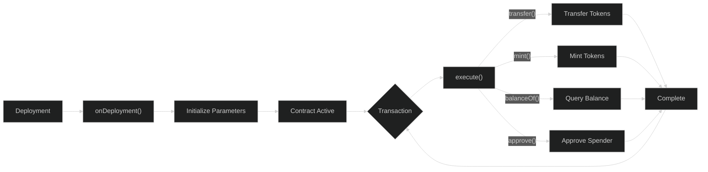
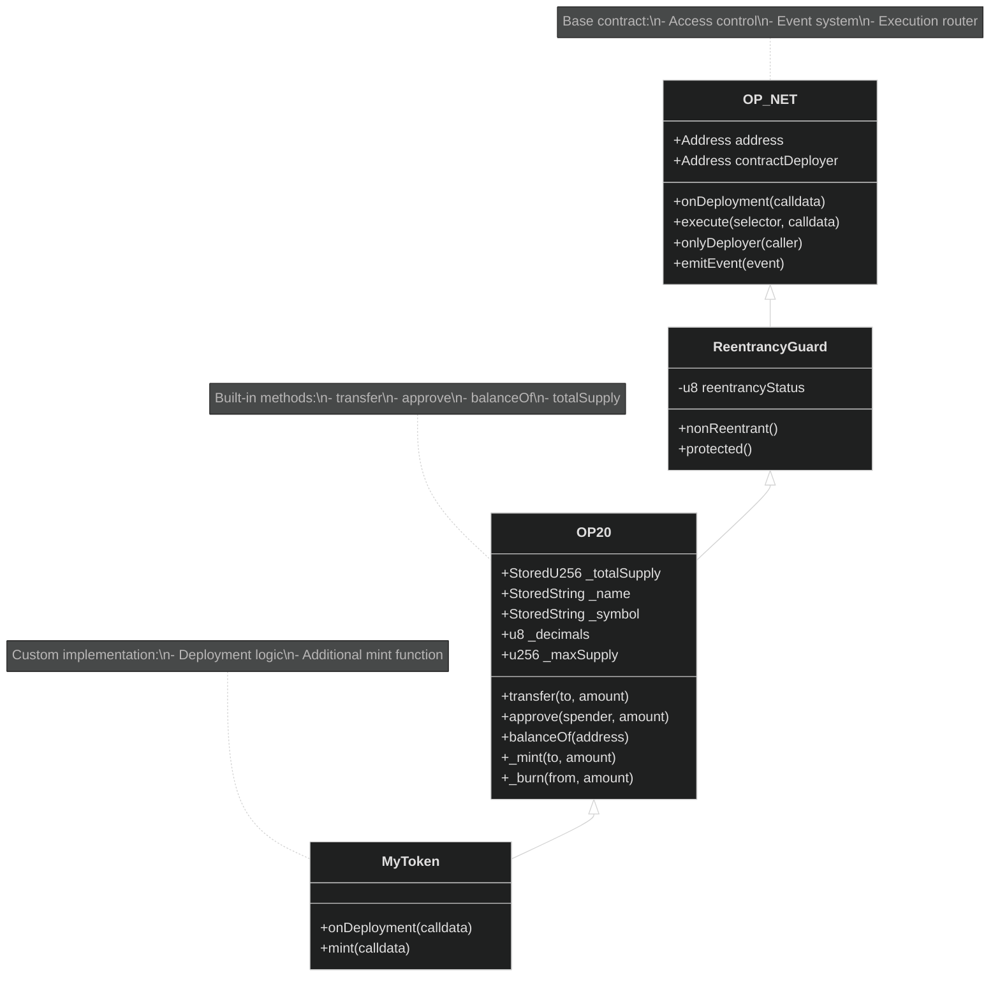
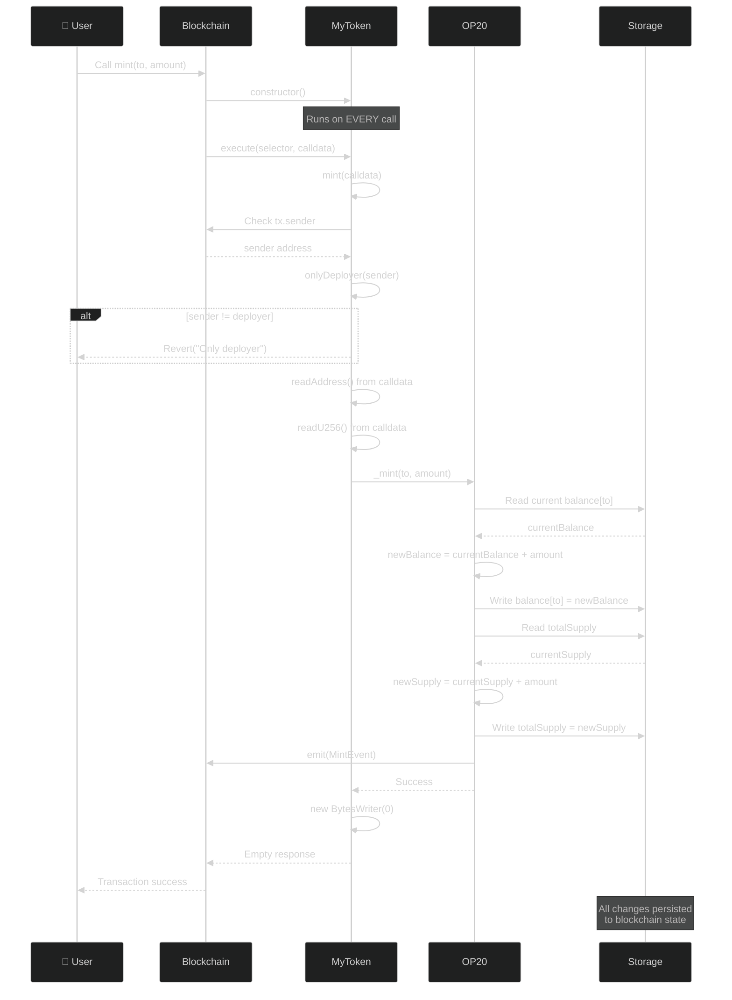

# Your First Contract

This tutorial guides you through creating a complete OP20 token contract from scratch. By the end, you'll understand the core concepts of OPNet smart contract development.

## What We're Building

A simple fungible token (like an ERC20 on Ethereum) with:
- Fixed maximum supply
- Minting capability (deployer only)
- Transfer functionality
- Balance queries

## Step 1: Create the Contract File

Create `src/token/MyToken.ts`:

```typescript
import { u256 } from '@btc-vision/as-bignum/assembly';
import {
    Blockchain,
    BytesWriter,
    Calldata,
    OP20,
    OP20InitParameters,
} from '@btc-vision/btc-runtime/runtime';

@final
export class MyToken extends OP20 {
    public constructor() {
        super();
    }

    public override onDeployment(_calldata: Calldata): void {
        const maxSupply: u256 = u256.fromString('1000000000000000000000000');
        const decimals: u8 = 18;
        const name: string = 'MyToken';
        const symbol: string = 'MTK';

        this.instantiate(new OP20InitParameters(maxSupply, decimals, name, symbol));
        this._mint(Blockchain.tx.origin, maxSupply);
    }

    @method(
        { name: 'address', type: ABIDataTypes.ADDRESS },
        { name: 'amount', type: ABIDataTypes.UINT256 }
    )
    @emit('Minted')
    public mint(calldata: Calldata): BytesWriter {
        this.onlyDeployer(Blockchain.tx.sender);

        this._mint(calldata.readAddress(), calldata.readU256());

        return new BytesWriter(0);
    }
}
```

Let's break this down piece by piece.

## Contract Lifecycle Overview

This diagram illustrates the complete lifecycle of an OPNet smart contract from deployment to execution:



## Step 2: Understanding the Code

### Token Contract Architecture

This diagram shows how your MyToken contract inherits functionality from the OP20 base class:



### The Class Declaration

```typescript
@final
export class MyToken extends OP20 {
```

| Component | Meaning |
|-----------|---------|
| `@final` | AssemblyScript decorator - prevents inheritance |
| `export` | Makes the class accessible outside the file |
| `extends OP20` | Inherits from the fungible token standard |

**Solidity equivalent:**
```solidity
contract MyToken is ERC20 {
```

### The Constructor

```typescript
public constructor() {
    super();
}
```

**IMPORTANT:** In OPNet, the constructor runs on **every** contract interaction, not just deployment. This is different from Solidity!

```typescript
// OPNet                           // Solidity
public constructor() {             // constructor() {
    super();                       //     // Runs ONCE at deployment
    // Runs EVERY time!            // }
}
```

Never put initialization logic in the constructor. Use `onDeployment` instead.

### The Deployment Hook

```typescript
public override onDeployment(_calldata: Calldata): void {
    const maxSupply: u256 = u256.fromString('1000000000000000000000000');
    const decimals: u8 = 18;
    const name: string = 'MyToken';
    const symbol: string = 'MTK';

    this.instantiate(new OP20InitParameters(maxSupply, decimals, name, symbol));
    this._mint(Blockchain.tx.origin, maxSupply);
}
```

This method runs **once** when the contract is first deployed. It's the equivalent of Solidity's `constructor()`.

| Parameter | Value | Meaning |
|-----------|-------|---------|
| `maxSupply` | 1,000,000 (with 18 decimals) | Maximum tokens that can ever exist |
| `decimals` | 18 | Decimal places (like ETH/wei) |
| `name` | "MyToken" | Human-readable name |
| `symbol` | "MTK" | Ticker symbol |

**Solidity equivalent:**
```solidity
constructor() ERC20("MyToken", "MTK") {
    _mint(msg.sender, 1000000 * 10**18);
}
```

### The Mint Function

```typescript
@method(
    { name: 'address', type: ABIDataTypes.ADDRESS },
    { name: 'amount', type: ABIDataTypes.UINT256 }
)
@emit('Minted')
public mint(calldata: Calldata): BytesWriter {
    this.onlyDeployer(Blockchain.tx.sender);

    this._mint(calldata.readAddress(), calldata.readU256());

    return new BytesWriter(0);
}
```

### Mint Operation Data Flow

This sequence diagram shows what happens when the mint function is called:



Breaking this down:

| Line | Purpose |
|------|---------|
| `@method(...)` | Declares method parameters for ABI generation |
| `@emit('Minted')` | Declares event emission for ABI documentation |
| `onlyDeployer(...)` | Access control - only the deployer can call |
| `calldata.readAddress()` | Parse the recipient address from input |
| `calldata.readU256()` | Parse the amount from input |
| `_mint(to, amount)` | Internal mint function from OP20 |
| `return new BytesWriter(0)` | Return empty response |

**Solidity equivalent:**
```solidity
function mint(address to, uint256 amount) external onlyOwner {
    _mint(to, amount);
}
```

## Step 3: Understanding Types

### u256 - Big Numbers

OPNet uses `u256` for large numbers (like balances):

```typescript
import { u256 } from '@btc-vision/as-bignum/assembly';

// Creating u256 values
const a = u256.fromU64(100);                 // From small number
const b = u256.fromU64(1_000_000);           // From u64
const c = u256.fromString('99999999999999'); // From string (large numbers)

// NEVER use floating point!
// const bad = u256.fromU64(1.5);  // WRONG! - No floating point!
```

**Why not native numbers?**

| JavaScript/TypeScript | AssemblyScript/OPNet |
|----------------------|----------------------|
| `number` (64-bit float) | Non-deterministic! |
| `BigInt` | Not supported in WASM |
| N/A | `u256` (deterministic) |

### Address

Addresses are 32 bytes in OPNet:

```typescript
import { Address, Blockchain } from '@btc-vision/btc-runtime/runtime';

// Get the current sender
const sender: Address = Blockchain.tx.sender;

// Zero address (like address(0) in Solidity)
const zero = Address.zero();

// Compare addresses
if (sender.equals(zero)) {
    throw new Revert('Cannot be zero address');
}
```

### Calldata

Input parsing uses `Calldata`:

```typescript
public myMethod(calldata: Calldata): BytesWriter {
    // Read parameters in order
    const address = calldata.readAddress();    // 32 bytes
    const amount = calldata.readU256();        // 32 bytes
    const flag = calldata.readBoolean();       // 1 byte
    const data = calldata.readBytes();         // Variable length

    // ...
}
```

## Step 4: Inherited OP20 Methods

By extending `OP20`, your token automatically gets these methods:

| Method | Description | Selector |
|--------|-------------|----------|
| `transfer(to, amount)` | Transfer tokens | Built-in |
| `transferFrom(from, to, amount)` | Transfer with approval | Built-in |
| `approve(spender, amount)` | Approve spender | Built-in |
| `balanceOf(address)` | Get balance | Built-in |
| `allowance(owner, spender)` | Get allowance | Built-in |
| `totalSupply()` | Total supply | Built-in |
| `name()` | Token name | Built-in |
| `symbol()` | Token symbol | Built-in |
| `decimals()` | Decimal places | Built-in |

## Step 5: Building the Contract

Add to your `package.json`:

```json
{
  "scripts": {
    "build:token": "asc src/token/index.ts --target token --measure --uncheckedBehavior never"
  }
}
```

Create `src/token/index.ts`:

```typescript
import { Blockchain } from '@btc-vision/btc-runtime/runtime';
import { revertOnError } from '@btc-vision/btc-runtime/runtime/abort/abort';
import { MyToken } from './MyToken';

// DO NOT TOUCH TO THIS.
Blockchain.contract = () => {
    // ONLY CHANGE THE CONTRACT CLASS NAME.
    // DO NOT ADD CUSTOM LOGIC HERE.

    return new MyToken();
};

// VERY IMPORTANT
export * from '@btc-vision/btc-runtime/runtime/exports';

// VERY IMPORTANT
export function abort(message: string, fileName: string, line: u32, column: u32): void {
    revertOnError(message, fileName, line, column);
}
```

Build:

```bash
npm run build:token
```

## Solidity Comparison

Here's a side-by-side comparison of the complete contract:

<table>
<tr>
<th>OPNet (AssemblyScript)</th>
<th>Solidity</th>
</tr>
<tr>
<td>

```typescript
import { u256 } from '@btc-vision/as-bignum/assembly';
import {
    Blockchain,
    BytesWriter,
    Calldata,
    OP20,
    OP20InitParameters,
} from '@btc-vision/btc-runtime/runtime';

@final
export class MyToken extends OP20 {
    public constructor() {
        super();
    }

    public override onDeployment(_: Calldata): void {
        const maxSupply = u256.fromString('1000000000000000000000000');
        this.instantiate(new OP20InitParameters(
            maxSupply,
            18,
            'MyToken',
            'MTK'
        ));
        this._mint(Blockchain.tx.origin, maxSupply);
    }

    @method(
        { name: 'address', type: ABIDataTypes.ADDRESS },
        { name: 'amount', type: ABIDataTypes.UINT256 }
    )
    @emit('Minted')
    public mint(calldata: Calldata): BytesWriter {
        this.onlyDeployer(Blockchain.tx.sender);
        this._mint(
            calldata.readAddress(),
            calldata.readU256()
        );
        return new BytesWriter(0);
    }
}
```

</td>
<td>

```solidity
// SPDX-License-Identifier: MIT
pragma solidity ^0.8.0;

import "@openzeppelin/contracts/token/ERC20/ERC20.sol";
import "@openzeppelin/contracts/access/Ownable.sol";

contract MyToken is ERC20, Ownable {
    uint256 public constant MAX_SUPPLY =
        1000000 * 10**18;

    constructor()
        ERC20("MyToken", "MTK")
        Ownable(msg.sender)
    {
        _mint(msg.sender, MAX_SUPPLY);
    }

    function mint(
        address to,
        uint256 amount
    ) external onlyOwner {
        _mint(to, amount);
    }
}
```

</td>
</tr>
</table>

## Common Patterns

### Access Control

```typescript
// Only deployer can call
@method({ name: 'param', type: ABIDataTypes.UINT256 })
@returns({ name: 'result', type: ABIDataTypes.UINT256 })
public adminFunction(calldata: Calldata): BytesWriter {
    this.onlyDeployer(Blockchain.tx.sender);
    const param = calldata.readU256();
    // ... perform admin logic
    const result = new BytesWriter(32);
    result.writeU256(param);
    return result;
}
```

### Error Handling

```typescript
import { Revert, Address, BytesWriter, Calldata } from '@btc-vision/btc-runtime/runtime';

@method(
    { name: 'to', type: ABIDataTypes.ADDRESS },
    { name: 'amount', type: ABIDataTypes.UINT256 }
)
@emit('Transferred')
public transfer(calldata: Calldata): BytesWriter {
    const to = calldata.readAddress();
    const amount = calldata.readU256();

    if (to.equals(Address.zero())) {
        throw new Revert('Cannot transfer to zero address');
    }
    // ...
    return new BytesWriter(0);
}
```

### Reading Storage

```typescript
import { SafeMath } from '@btc-vision/btc-runtime/runtime';

// In OP20, balances are managed automatically
const balance: u256 = this.balanceOf(address);

// When performing u256 operations, always use SafeMath
const newBalance = SafeMath.add(balance, amount);
const result = SafeMath.sub(balance, amount);
```

## Next Steps

Now that you've created your first contract:

1. [Understand the project structure](./project-structure.md)
2. [Learn about the blockchain environment](../core-concepts/blockchain-environment.md)
3. [Explore storage in depth](../core-concepts/storage-system.md)
4. [See more examples](../examples/basic-token.md)

---

**Navigation:**
- Previous: [Installation](./installation.md)
- Next: [Project Structure](./project-structure.md)
