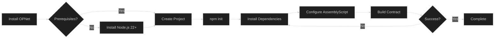
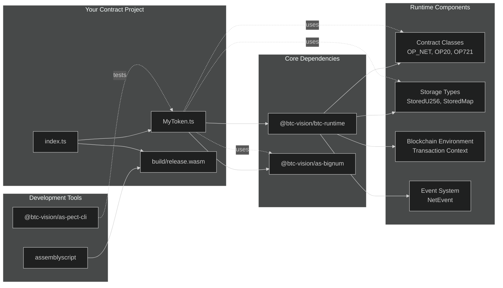
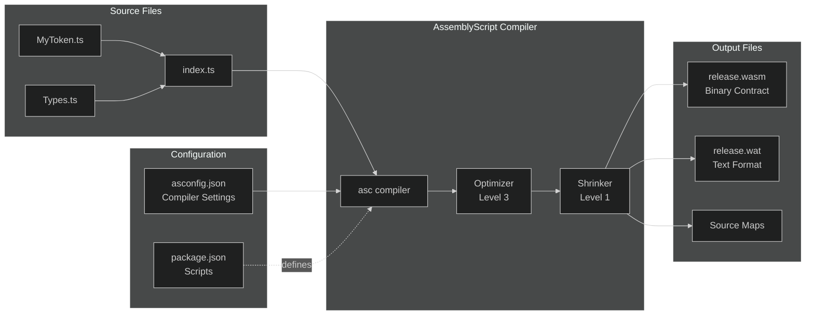

# Installation

This guide walks you through setting up your development environment for building OPNet smart contracts.

## Prerequisites

Before you begin, ensure you have:

- **Node.js 22+** - [Download Node.js](https://nodejs.org/)
- **npm** or **yarn** - Comes with Node.js
- **Git** - [Download Git](https://git-scm.com/)

Verify your installation:

```bash
node --version  # Should be v22.0.0 or higher
npm --version   # Should be v9.0.0 or higher
```

## Quick Start

### Installation Process Flow

The following diagram shows the complete installation and setup workflow for OPNet smart contract development:



### Dependency Architecture

This diagram illustrates how the different packages work together in your OPNet project:



### 1. Create a New Project

```bash
mkdir my-opnet-contract
cd my-opnet-contract
npm init -y
```

### 2. Install Dependencies

```bash
npm install @btc-vision/btc-runtime @btc-vision/as-bignum
npm install --save-dev assemblyscript @btc-vision/as-pect-cli
```

### 3. Initialize AssemblyScript

```bash
npx asinit .
```

This creates the basic AssemblyScript project structure.

### 4. Configure AssemblyScript

Update your `asconfig.json`:

```json
{
  "targets": {
    "debug": {
      "outFile": "build/debug.wasm",
      "textFile": "build/debug.wat",
      "sourceMap": true,
      "debug": true
    },
    "release": {
      "outFile": "build/release.wasm",
      "textFile": "build/release.wat",
      "sourceMap": true,
      "optimizeLevel": 3,
      "shrinkLevel": 1
    }
  },
  "options": {
    "bindings": "esm",
    "runtime": "stub"
  }
}
```

## Package Dependencies

Here's what each package provides:

| Package | Purpose |
|---------|---------|
| `@btc-vision/btc-runtime` | Core runtime - contracts, storage, events |
| `@btc-vision/as-bignum` | 128-bit and 256-bit integer types |
| `assemblyscript` | AssemblyScript compiler |
| `@btc-vision/as-pect-cli` | Testing framework for AssemblyScript |

## Project Structure

After setup, your project should look like:

```
my-opnet-contract/
├── assembly/
│   ├── contracts/        # Your smart contracts
│   │   └── MyToken.ts
│   └── index.ts          # Entry point
├── build/                # Compiled WASM output
├── tests/                # Test files
├── asconfig.json         # AssemblyScript configuration
├── package.json
└── tsconfig.json
```

## Build Process Architecture

This diagram shows how AssemblyScript compiles your contract into WebAssembly:



## Verification

Create a simple test contract to verify everything works:

```typescript
// assembly/contracts/TestContract.ts
import { OP_NET, Calldata, BytesWriter } from '@btc-vision/btc-runtime/runtime';
import { u256 } from '@btc-vision/as-bignum/assembly';

@final
export class TestContract extends OP_NET {
    public constructor() {
        super();
    }

    public override onDeployment(_calldata: Calldata): void {
        // Contract deployed successfully
    }

    public override execute(method: Selector, calldata: Calldata): BytesWriter {
        return super.execute(method, calldata);
    }
}
```

Build the contract:

```bash
npm run build
```

If successful, you'll see `build/release.wasm` generated.

## Troubleshooting

### "Module not found" Errors

Ensure your imports use the correct paths:

```typescript
// Correct
import { OP_NET } from '@btc-vision/btc-runtime/runtime';
import { u256 } from '@btc-vision/as-bignum/assembly';

// Wrong
import { OP_NET } from 'btc-runtime';  // Missing @btc-vision scope
```

### Node.js Version Issues

OPNet requires Node.js 22+. If you have an older version:

```bash
# Using nvm (recommended)
nvm install 22
nvm use 22
```

### AssemblyScript Compilation Errors

Ensure you're using compatible versions:

```bash
npm ls assemblyscript
# Should show ^0.28.9 or compatible
```

## IDE Setup

### VS Code

Install these extensions for the best experience:

1. **AssemblyScript** - Syntax highlighting
2. **ESLint** - Code linting
3. **Prettier** - Code formatting

Create `.vscode/settings.json`:

```json
{
  "editor.formatOnSave": true,
  "typescript.tsdk": "node_modules/typescript/lib",
  "[typescript]": {
    "editor.defaultFormatter": "esbenp.prettier-vscode"
  }
}
```

## Next Steps

Now that your environment is set up:

1. [Create your first contract](./first-contract.md)
2. [Understand the project structure](./project-structure.md)
3. [Learn about the blockchain environment](../core-concepts/blockchain-environment.md)

---

**Navigation:**
- Previous: [Documentation Index](../README.md)
- Next: [First Contract](./first-contract.md)
