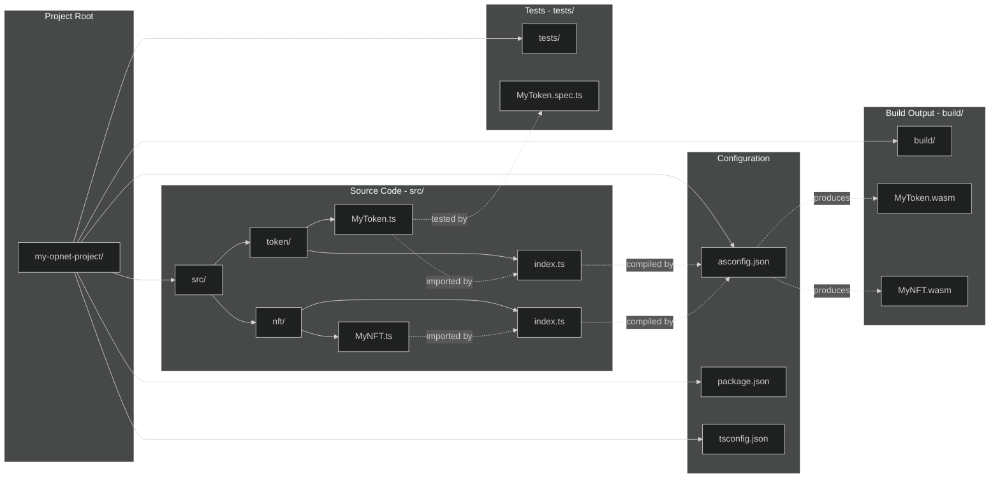
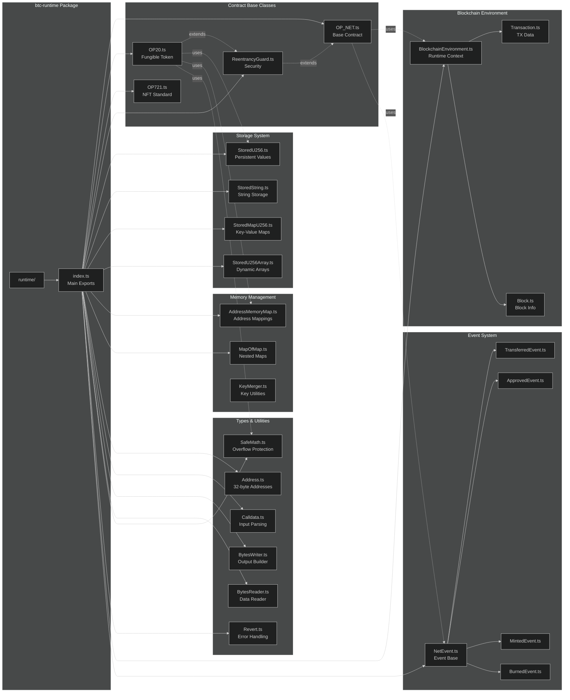
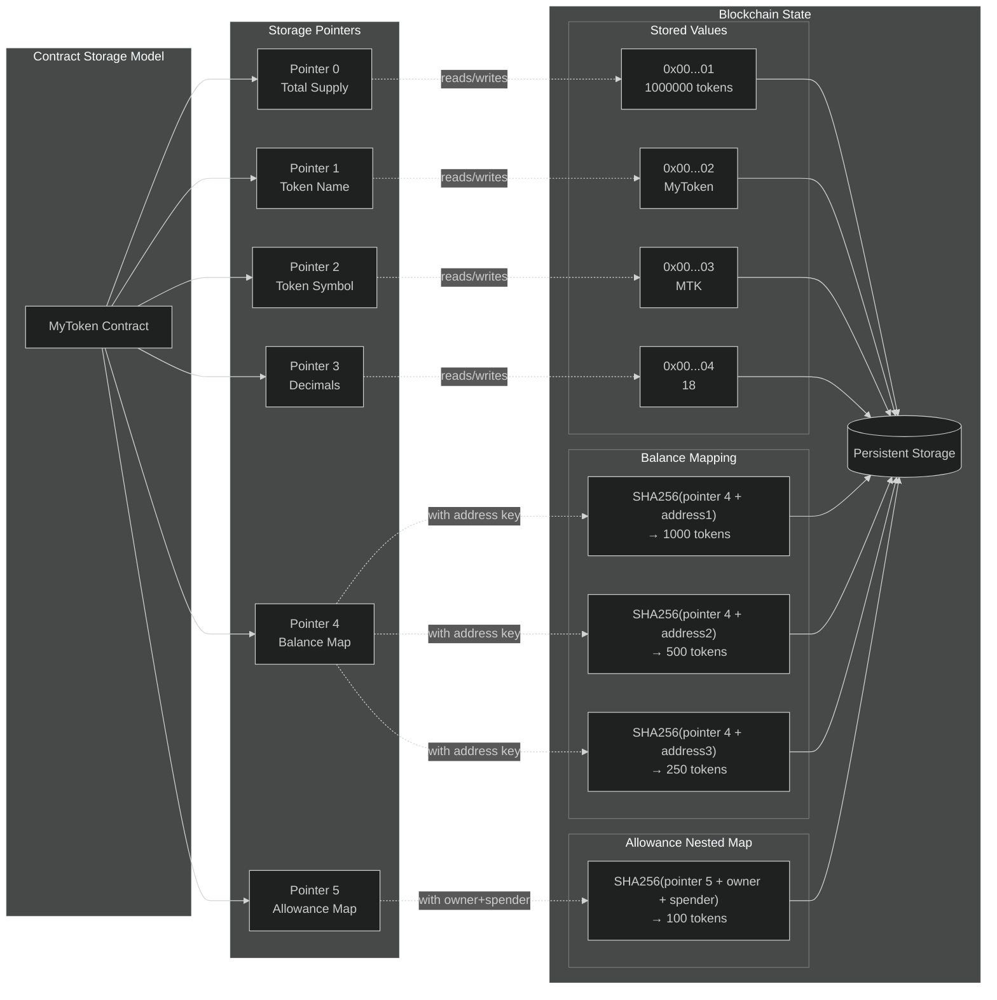

# Project Structure

This guide explains the standard project structure for OPNet smart contract development and how the btc-runtime library is organized.

## Your Project Structure

### Project Directory Layout

This diagram visualizes the complete project structure and file relationships:



A typical OPNet contract project looks like this:

```
my-opnet-project/
├── src/                        # AssemblyScript source code
│   ├── token/                  # Token contract
│   │   ├── MyToken.ts          # Contract implementation
│   │   └── index.ts            # Entry point with Blockchain.contract
│   ├── nft/                    # NFT contract (optional)
│   │   ├── MyNFT.ts
│   │   └── index.ts
│   └── tsconfig.json           # AssemblyScript config for src/
├── build/                      # Compiled output
│   ├── MyToken.wasm            # Token contract build
│   └── MyNFT.wasm              # NFT contract build
├── tests/                      # Test files
│   └── MyToken.spec.ts
├── asconfig.json               # AssemblyScript configuration
├── package.json                # Node.js configuration
└── tsconfig.json               # TypeScript configuration
```

## Key Files

### src/token/index.ts

The entry point for each contract that sets up the contract instance:

```typescript
import { Blockchain } from '@btc-vision/btc-runtime/runtime';
import { revertOnError } from '@btc-vision/btc-runtime/runtime/abort/abort';
import { MyToken } from './MyToken';

// DO NOT TOUCH TO THIS.
Blockchain.contract = () => {
    // ONLY CHANGE THE CONTRACT CLASS NAME.
    // DO NOT ADD CUSTOM LOGIC HERE.

    return new MyToken();
};

// VERY IMPORTANT
export * from '@btc-vision/btc-runtime/runtime/exports';

// VERY IMPORTANT
export function abort(message: string, fileName: string, line: u32, column: u32): void {
    revertOnError(message, fileName, line, column);
}
```

### asconfig.json

AssemblyScript compiler configuration with per-contract targets:

```json
{
    "targets": {
        "token": {
            "outFile": "build/MyToken.wasm",
            "use": ["abort=src/token/index/abort"]
        },
        "nft": {
            "outFile": "build/MyNFT.wasm",
            "use": ["abort=src/nft/index/abort"]
        }
    },
    "options": {
        "sourceMap": false,
        "optimizeLevel": 3,
        "shrinkLevel": 1,
        "converge": true,
        "noAssert": false,
        "enable": [
            "sign-extension",
            "mutable-globals",
            "nontrapping-f2i",
            "bulk-memory",
            "simd",
            "reference-types",
            "multi-value"
        ],
        "runtime": "stub",
        "memoryBase": 0,
        "initialMemory": 1,
        "exportStart": "start",
        "transform": "@btc-vision/opnet-transform"
    }
}
```

| Option | Description |
|--------|-------------|
| `targets` | Per-contract build targets with output paths |
| `use` | Links custom abort function for error handling |
| `optimizeLevel` | Optimization level (0-3), higher = faster but larger |
| `shrinkLevel` | Code size reduction (0-2) |
| `transform` | OPNet transform for decorator processing |
| `runtime: "stub"` | Minimal runtime (OPNet provides its own) |

### package.json Scripts

Recommended scripts for your `package.json`:

```json
{
  "scripts": {
    "build:token": "asc src/token/index.ts --target token --measure --uncheckedBehavior never",
    "build:nft": "asc src/nft/index.ts --target nft --measure --uncheckedBehavior never"
  }
}
```

## btc-runtime Library Structure

### Runtime Library Architecture

This diagram shows the internal organization of the @btc-vision/btc-runtime package:



Understanding the btc-runtime structure helps you find the right imports:

```
@btc-vision/btc-runtime/
├── runtime/                    # Main runtime directory
│   ├── index.ts                # Main exports
│   ├── contracts/              # Contract base classes
│   │   ├── OP_NET.ts           # Base contract class
│   │   ├── OP20.ts             # Fungible token standard
│   │   ├── OP20S.ts            # Token with signatures
│   │   ├── OP721.ts            # NFT standard
│   │   └── ReentrancyGuard.ts  # Reentrancy protection
│   ├── storage/                # Storage types
│   │   ├── StoredU256.ts
│   │   ├── StoredString.ts
│   │   ├── StoredArray.ts
│   │   ├── StoredMap.ts
│   │   └── ...
│   ├── math/                   # Math utilities
│   │   ├── SafeMath.ts
│   │   └── SafeMathI128.ts
│   ├── types/                  # Core types
│   │   ├── Address.ts
│   │   ├── Calldata.ts
│   │   ├── BytesWriter.ts
│   │   ├── BytesReader.ts
│   │   └── Selector.ts
│   ├── events/                 # Event system
│   │   ├── NetEvent.ts
│   │   ├── predefined/
│   │   └── ...
│   ├── env/                    # Blockchain environment
│   │   └── BlockchainEnvironment.ts
│   └── interfaces/             # TypeScript interfaces
```

## Import Patterns

### Basic Imports

```typescript
// Core runtime - contracts and utilities
import {
    OP_NET,
    OP20,
    OP721,
    Blockchain,
    Address,
    Calldata,
    BytesWriter,
    BytesReader,
    SafeMath,
    Revert,
} from '@btc-vision/btc-runtime/runtime';

// Big numbers
import { u128, u256 } from '@btc-vision/as-bignum/assembly';
```

### Storage Types

```typescript
import {
    StoredU256,
    StoredString,
    StoredBoolean,
    StoredAddress,
    StoredU256Array,
    StoredAddressArray,
    StoredMapU256,
    AddressMemoryMap,
} from '@btc-vision/btc-runtime/runtime';
```

### Events

```typescript
import {
    NetEvent,
    TransferEvent,
    ApprovalEvent,
    MintEvent,
    BurnEvent,
} from '@btc-vision/btc-runtime/runtime';
```

### Contract Initialization

```typescript
import {
    OP20InitParameters,
    OP721InitParameters,
} from '@btc-vision/btc-runtime/runtime';
```

### Storage Pointer System

This diagram illustrates how OPNet manages persistent storage using pointers:



## Contract Organization

### Single Contract Project

For simple projects with one contract:

```
src/
├── token/
│   ├── MyToken.ts
│   └── index.ts
└── tsconfig.json
```

### Multi-Contract Project

For larger projects with multiple contracts:

```
src/
├── token/
│   ├── MyToken.ts
│   └── index.ts
├── stablecoin/
│   ├── MyStablecoin.ts
│   └── index.ts
├── nft/
│   ├── MyNFT.ts
│   └── index.ts
├── shared/
│   ├── CustomTypes.ts
│   └── Helpers.ts
└── tsconfig.json
```

### Shared Logic

For contracts sharing common functionality:

```typescript
// src/shared/Pausable.ts
import { Blockchain, OP_NET, Revert, StoredBoolean } from '@btc-vision/btc-runtime/runtime';

const pausedPointer: u16 = Blockchain.nextPointer;

export abstract class Pausable extends OP_NET {
    private _paused: StoredBoolean = new StoredBoolean(pausedPointer, false);

    protected whenNotPaused(): void {
        if (this._paused.value) {
            throw new Revert('Contract is paused');
        }
    }

    protected pause(): void {
        this.onlyDeployer(Blockchain.tx.sender);
        this._paused.value = true;
    }

    protected unpause(): void {
        this.onlyDeployer(Blockchain.tx.sender);
        this._paused.value = false;
    }
}

// src/token/MyToken.ts
import { Pausable } from '../shared/Pausable';

export class MyToken extends Pausable {
    // Now has pause functionality
}
```

## Comparison with Solidity Projects

| Solidity | OPNet | Notes |
|----------|-------|-------|
| `contracts/` | `src/token/`, `src/nft/` | Contract source files (one folder per contract) |
| `interfaces/` | `src/shared/` | Type definitions and shared logic |
| `libraries/` | `src/shared/` | Shared utilities |
| `test/` | `tests/` | Test files |
| `artifacts/` | `build/` | Compiled output |
| `hardhat.config.js` | `asconfig.json` | Build configuration |

## Best Practices

### 1. Organize by Feature

```
src/
├── token/            # Token contract
├── stablecoin/       # Stablecoin contract
├── nft/              # NFT contract
├── governance/       # Governance contract
└── shared/           # Shared utilities and types
```

### 2. Use Consistent Naming

```typescript
// Contract files: PascalCase.ts
MyToken.ts
MyStablecoin.ts

// Type files: PascalCase.ts
CustomTypes.ts

// Utility files: camelCase.ts
mathHelpers.ts
```

### 3. Entry Point Pattern

Each contract should have its own index.ts with the proper pattern:

```typescript
// src/token/index.ts
import { Blockchain } from '@btc-vision/btc-runtime/runtime';
import { revertOnError } from '@btc-vision/btc-runtime/runtime/abort/abort';
import { MyToken } from './MyToken';

Blockchain.contract = () => {
    return new MyToken();
};

export * from '@btc-vision/btc-runtime/runtime/exports';

export function abort(message: string, fileName: string, line: u32, column: u32): void {
    revertOnError(message, fileName, line, column);
}
```

### 4. Separate Concerns

```typescript
// Good: Each contract has a single responsibility
export class TokenContract extends OP20 { /* token logic */ }
export class GovernanceContract extends OP_NET { /* governance logic */ }

// Bad: One contract doing too much
export class EverythingContract extends OP_NET {
    // token logic
    // governance logic
    // oracle logic
    // etc.
}
```

## Testing Structure

```
tests/
├── unit/                    # Unit tests
│   ├── MyToken.spec.ts
│   └── SafeMath.spec.ts
├── integration/             # Integration tests
│   └── TokenTransfer.spec.ts
└── fixtures/                # Test fixtures
    └── testData.ts
```

## Next Steps

Now that you understand the project structure:

1. [Learn about the blockchain environment](../core-concepts/blockchain-environment.md)
2. [Understand the storage system](../core-concepts/storage-system.md)
3. [See complete examples](../examples/basic-token.md)

---

**Navigation:**
- Previous: [First Contract](./first-contract.md)
- Next: [Blockchain Environment](../core-concepts/blockchain-environment.md)
