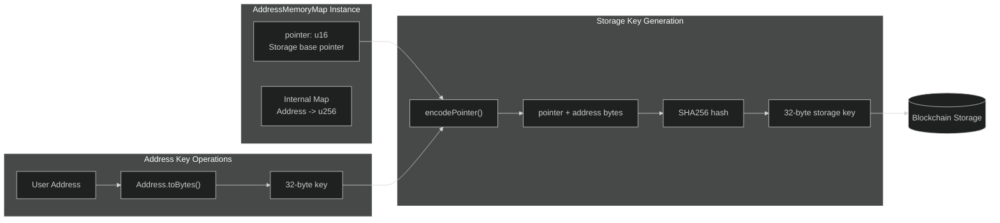
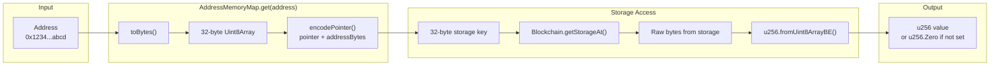
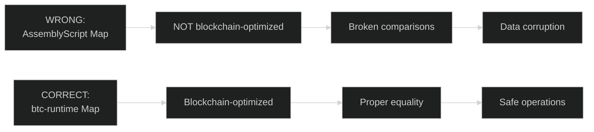

# Memory Maps

Memory maps provide a convenient interface for address-keyed storage with automatic type handling. They're the recommended way to implement Solidity-style `mapping(address => T)` patterns.

## Overview

```typescript
import {
    AddressMemoryMap,
    Blockchain,
    Address,
} from '@btc-vision/btc-runtime/runtime';
import { u256 } from '@btc-vision/as-bignum/assembly';

// Allocate storage pointer
private balancesPointer: u16 = Blockchain.nextPointer;

// Create memory map
private balances: AddressMemoryMap;

constructor() {
    super();
    this.balances = new AddressMemoryMap(this.balancesPointer);
}

// Usage
const balance = this.balances.get(userAddress);
this.balances.set(userAddress, newBalance);
```

## AddressMemoryMap

The primary memory map type for address-keyed storage. It stores and returns u256 values directly.

```typescript
class AddressMemoryMap
```

### Constructor Pattern

```typescript
private balancesPointer: u16 = Blockchain.nextPointer;
private balances: AddressMemoryMap;

constructor() {
    super();
    this.balances = new AddressMemoryMap(this.balancesPointer);
}
```

### Methods

```typescript
// Get value for address
public get(key: Address): u256

// Set value for address (returns this for chaining)
public set(key: Address, value: u256): this

// Get raw bytes
public getAsUint8Array(key: Address): Uint8Array

// Set raw bytes
public setAsUint8Array(key: Address, value: Uint8Array): this

// Check if key has non-default value
public has(key: Address): bool

// Delete (set to default, returns true if key existed)
public delete(key: Address): bool
```

## Storage Flow

When you access an AddressMemoryMap, the address is converted to a storage key via SHA256:



### Address to Storage Key

The complete flow from address to storage access:



## Solidity vs OPNet Comparison

### Quick Reference Table

| Solidity | OPNet AddressMemoryMap |
|----------|------------------------|
| `mapping(address => uint256)` | `AddressMemoryMap` |
| `balances[addr]` | `balances.get(addr)` |
| `balances[addr] = val` | `balances.set(addr, val)` |
| Default value: `0` | Default value: `u256.Zero` |
| Implicit initialization | Explicit constructor initialization |
| No existence check | `balances.has(addr)` available |
| `delete balances[addr]` | `balances.delete(addr)` |

### Operations Comparison

| Operation | Solidity | OPNet |
|-----------|----------|-------|
| Declare | `mapping(address => uint256) public balances;` | `private balances: AddressMemoryMap;` |
| Initialize | Automatic | `this.balances = new AddressMemoryMap(this.balancesPointer);` |
| Read | `balances[addr]` | `balances.get(addr)` |
| Write | `balances[addr] = amount;` | `balances.set(addr, amount)` |
| Add to value | `balances[addr] += amount;` | `balances.set(addr, SafeMath.add(balances.get(addr), amount))` |
| Subtract | `balances[addr] -= amount;` | `balances.set(addr, SafeMath.sub(balances.get(addr), amount))` |
| Check non-zero | `balances[addr] > 0` | `!balances.get(addr).isZero()` |
| Delete/reset | `delete balances[addr];` | `balances.delete(addr)` or `balances.set(addr, u256.Zero)` |
| Check exists | N/A (always 0 default) | `balances.has(addr)` |

### Common Patterns

| Pattern | Solidity | OPNet |
|---------|----------|-------|
| Transfer balance | `balances[from] -= amt; balances[to] += amt;` | `balances.set(from, SafeMath.sub(balances.get(from), amt)); balances.set(to, SafeMath.add(balances.get(to), amt));` |
| Check sufficient | `require(balances[addr] >= amount);` | `if (balances.get(addr) < amount) throw new Revert("Insufficient");` |
| Mint tokens | `balances[to] += amount;` | `balances.set(to, SafeMath.add(balances.get(to), amount));` |
| Burn tokens | `balances[from] -= amount;` | `balances.set(from, SafeMath.sub(balances.get(from), amount));` |
| Zero balance check | `balances[addr] == 0` | `balances.get(addr).isZero()` |
| Get sender balance | `balances[msg.sender]` | `balances.get(Blockchain.tx.sender)` |

### Key Differences from Solidity

| Aspect | Solidity | OPNet |
|--------|----------|-------|
| Key type | `address` (20 bytes) | `Address` (32 bytes) |
| Value type | Any | `u256` only |
| Storage slot | `keccak256(key . slot)` | `SHA256(pointer + address)` |
| Reentrancy safe | Developer responsibility | Developer responsibility |
| Arithmetic | Native operators | `SafeMath` required |

### ERC-20 Style Comparison

| ERC-20 Function | Solidity | OPNet |
|-----------------|----------|-------|
| `balanceOf(address)` | `return balances[owner];` | `return this.balances.get(owner);` |
| `transfer(to, amount)` | `balances[msg.sender] -= amount; balances[to] += amount;` | `this.balances.set(sender, SafeMath.sub(...)); this.balances.set(to, SafeMath.add(...));` |
| `approve(spender, amount)` | `allowances[msg.sender][spender] = amount;` | Use `MapOfMap<u256>` for nested mapping |

For a complete token implementation using AddressMemoryMap, see [Basic Token Example](../examples/basic-token.md).

## Side-by-Side Code Examples

### Basic Token Balance Tracking

**Solidity:**
```solidity
contract TokenBalances {
    mapping(address => uint256) public balances;
    uint256 public totalSupply;

    function mint(address to, uint256 amount) external {
        balances[to] += amount;
        totalSupply += amount;
    }

    function burn(address from, uint256 amount) external {
        require(balances[from] >= amount, "Insufficient balance");
        balances[from] -= amount;
        totalSupply -= amount;
    }

    function transfer(address from, address to, uint256 amount) external {
        require(balances[from] >= amount, "Insufficient balance");
        balances[from] -= amount;
        balances[to] += amount;
    }

    function balanceOf(address account) external view returns (uint256) {
        return balances[account];
    }
}
```

**OPNet:**
```typescript
@final
export class TokenBalances extends OP_NET {
    private balancesPointer: u16 = Blockchain.nextPointer;
    private totalSupplyPointer: u16 = Blockchain.nextPointer;

    private balances: AddressMemoryMap;
    private _totalSupply: StoredU256 = new StoredU256(this.totalSupplyPointer, EMPTY_POINTER);

    constructor() {
        super();
        this.balances = new AddressMemoryMap(this.balancesPointer);
    }

    public mint(calldata: Calldata): BytesWriter {
        const to = calldata.readAddress();
        const amount = calldata.readU256();

        this.balances.set(to, SafeMath.add(this.balances.get(to), amount));
        this._totalSupply.value = SafeMath.add(this._totalSupply.value, amount);

        return new BytesWriter(0);
    }

    public burn(calldata: Calldata): BytesWriter {
        const from = calldata.readAddress();
        const amount = calldata.readU256();

        const balance = this.balances.get(from);
        if (balance < amount) {
            throw new Revert('Insufficient balance');
        }

        this.balances.set(from, SafeMath.sub(balance, amount));
        this._totalSupply.value = SafeMath.sub(this._totalSupply.value, amount);

        return new BytesWriter(0);
    }

    public transfer(calldata: Calldata): BytesWriter {
        const from = calldata.readAddress();
        const to = calldata.readAddress();
        const amount = calldata.readU256();

        const fromBalance = this.balances.get(from);
        if (fromBalance < amount) {
            throw new Revert('Insufficient balance');
        }

        this.balances.set(from, SafeMath.sub(fromBalance, amount));
        this.balances.set(to, SafeMath.add(this.balances.get(to), amount));

        return new BytesWriter(0);
    }

    public balanceOf(calldata: Calldata): BytesWriter {
        const account = calldata.readAddress();
        const writer = new BytesWriter(32);
        writer.writeU256(this.balances.get(account));
        return writer;
    }

    public totalSupply(_calldata: Calldata): BytesWriter {
        const writer = new BytesWriter(32);
        writer.writeU256(this._totalSupply.value);
        return writer;
    }
}
```

### Staking Contract

**Solidity:**
```solidity
contract Staking {
    mapping(address => uint256) public stakedAmount;
    mapping(address => uint256) public stakedTimestamp;
    mapping(address => uint256) public rewards;

    function stake(uint256 amount) external {
        stakedAmount[msg.sender] += amount;
        stakedTimestamp[msg.sender] = block.timestamp;
    }

    function unstake(uint256 amount) external {
        require(stakedAmount[msg.sender] >= amount, "Not enough staked");
        stakedAmount[msg.sender] -= amount;
    }

    function claimRewards() external {
        uint256 reward = calculateReward(msg.sender);
        rewards[msg.sender] = 0;
        // Transfer reward...
    }

    function calculateReward(address user) public view returns (uint256) {
        uint256 duration = block.timestamp - stakedTimestamp[user];
        return stakedAmount[user] * duration / 365 days;
    }

    function getStakeInfo(address user) external view returns (uint256, uint256, uint256) {
        return (stakedAmount[user], stakedTimestamp[user], rewards[user]);
    }
}
```

**OPNet:**
```typescript
@final
export class Staking extends OP_NET {
    private stakedAmountPointer: u16 = Blockchain.nextPointer;
    private stakedTimestampPointer: u16 = Blockchain.nextPointer;
    private rewardsPointer: u16 = Blockchain.nextPointer;

    private stakedAmount: AddressMemoryMap;
    private stakedTimestamp: AddressMemoryMap;
    private rewards: AddressMemoryMap;

    constructor() {
        super();
        this.stakedAmount = new AddressMemoryMap(this.stakedAmountPointer);
        this.stakedTimestamp = new AddressMemoryMap(this.stakedTimestampPointer);
        this.rewards = new AddressMemoryMap(this.rewardsPointer);
    }

    public stake(calldata: Calldata): BytesWriter {
        const amount = calldata.readU256();
        const sender = Blockchain.tx.sender;

        this.stakedAmount.set(sender, SafeMath.add(this.stakedAmount.get(sender), amount));
        this.stakedTimestamp.set(sender, u256.fromU64(Blockchain.block.medianTime));

        return new BytesWriter(0);
    }

    public unstake(calldata: Calldata): BytesWriter {
        const amount = calldata.readU256();
        const sender = Blockchain.tx.sender;

        const staked = this.stakedAmount.get(sender);
        if (staked < amount) {
            throw new Revert('Not enough staked');
        }

        this.stakedAmount.set(sender, SafeMath.sub(staked, amount));

        return new BytesWriter(0);
    }

    public claimRewards(_calldata: Calldata): BytesWriter {
        const sender = Blockchain.tx.sender;
        const reward = this.calculateReward(sender);

        this.rewards.set(sender, u256.Zero);
        // Transfer reward...

        const writer = new BytesWriter(32);
        writer.writeU256(reward);
        return writer;
    }

    private calculateReward(user: Address): u256 {
        const timestamp = this.stakedTimestamp.get(user);
        const currentTime = u256.fromU64(Blockchain.block.medianTime);
        const duration = SafeMath.sub(currentTime, timestamp);
        const staked = this.stakedAmount.get(user);

        // Simplified: staked * duration / YEAR_IN_SECONDS
        const YEAR_SECONDS = u256.fromU64(31536000);
        return SafeMath.div(SafeMath.mul(staked, duration), YEAR_SECONDS);
    }

    public getStakeInfo(calldata: Calldata): BytesWriter {
        const user = calldata.readAddress();

        const writer = new BytesWriter(96);
        writer.writeU256(this.stakedAmount.get(user));
        writer.writeU256(this.stakedTimestamp.get(user));
        writer.writeU256(this.rewards.get(user));
        return writer;
    }
}
```

## Usage Examples

### Basic Balance Tracking

```typescript
@final
export class Token extends OP_NET {
    private balancesPointer: u16 = Blockchain.nextPointer;
    private balances: AddressMemoryMap;

    constructor() {
        super();
        this.balances = new AddressMemoryMap(this.balancesPointer);
    }

    public balanceOf(calldata: Calldata): BytesWriter {
        const account = calldata.readAddress();
        const balance = this.balances.get(account);

        const writer = new BytesWriter(32);
        writer.writeU256(balance);
        return writer;
    }

    public _transfer(from: Address, to: Address, amount: u256): void {
        const fromBalance = this.balances.get(from);
        if (fromBalance < amount) {
            throw new Revert('Insufficient balance');
        }

        this.balances.set(from, SafeMath.sub(fromBalance, amount));
        this.balances.set(to, SafeMath.add(this.balances.get(to), amount));
    }
}
```

### Approval Tracking

```typescript
import { encodePointer } from '@btc-vision/btc-runtime/runtime';

// Nested mapping: owner => (spender => amount)
// Using composite storage

private allowancesPointer: u16 = Blockchain.nextPointer;

// For nested maps, create helper methods
private getAllowance(owner: Address, spender: Address): u256 {
    const subPointer = this.computeAllowanceKey(owner, spender);
    const pointerHash = encodePointer(this.allowancesPointer, subPointer.toUint8Array(true));
    const stored = Blockchain.getStorageAt(pointerHash);
    return u256.fromUint8ArrayBE(stored);
}

private setAllowance(owner: Address, spender: Address, amount: u256): void {
    const subPointer = this.computeAllowanceKey(owner, spender);
    const pointerHash = encodePointer(this.allowancesPointer, subPointer.toUint8Array(true));
    Blockchain.setStorageAt(pointerHash, amount.toUint8Array(true));
}

private computeAllowanceKey(owner: Address, spender: Address): u256 {
    const combined = new Uint8Array(64);
    combined.set(owner.toBytes(), 0);
    combined.set(spender.toBytes(), 32);
    return u256.fromBytes(Blockchain.sha256(combined));
}
```

### Staking with Multiple Values

```typescript
// Track staked amount and timestamp per user
private stakedAmountPointer: u16 = Blockchain.nextPointer;
private stakedTimePointer: u16 = Blockchain.nextPointer;

private stakedAmount: AddressMemoryMap;
private stakedTime: AddressMemoryMap;

constructor() {
    super();
    this.stakedAmount = new AddressMemoryMap(this.stakedAmountPointer);
    this.stakedTime = new AddressMemoryMap(this.stakedTimePointer);
}

public stake(calldata: Calldata): BytesWriter {
    const amount = calldata.readU256();
    const sender = Blockchain.tx.sender;

    // Update staked amount
    const current = this.stakedAmount.get(sender);
    this.stakedAmount.set(sender, SafeMath.add(current, amount));

    // Update stake time
    this.stakedTime.set(sender, u256.fromU64(Blockchain.block.medianTime));

    return new BytesWriter(0);
}

public getStakeInfo(calldata: Calldata): BytesWriter {
    const user = calldata.readAddress();

    const writer = new BytesWriter(64);
    writer.writeU256(this.stakedAmount.get(user));
    writer.writeU256(this.stakedTime.get(user));
    return writer;
}
```

## Storage vs Memory

### Storage (Persistent)

```typescript
// AddressMemoryMap wraps persistent storage
// Changes persist across transactions

public deposit(calldata: Calldata): BytesWriter {
    const amount = calldata.readU256();
    const sender = Blockchain.tx.sender;

    const current = this.deposits.get(sender);  // Reads from storage
    this.deposits.set(sender, SafeMath.add(current, amount));  // Writes to storage

    return new BytesWriter(0);
}
```

### In-Memory Collections

```typescript
// For temporary collections within a single call
// Use standard AssemblyScript Map

public processAddresses(calldata: Calldata): BytesWriter {
    const addresses = calldata.readAddressArray();

    // Temporary map for deduplication
    const seen = new Map<string, bool>();

    for (let i = 0; i < addresses.length; i++) {
        const addrStr = addresses[i].toBytes().toString();
        if (seen.has(addrStr)) {
            continue;  // Skip duplicate
        }
        seen.set(addrStr, true);

        // Process unique address...
    }

    return new BytesWriter(0);
}
```

## Warning: AssemblyScript Map vs btc-runtime Map

When working with persistent storage, always use the btc-runtime Map:



## Patterns

### Enumerable Map

To track all keys in a map:

```typescript
// Combine map with array for enumeration
private balancesPointer: u16 = Blockchain.nextPointer;
private holdersPointer: u16 = Blockchain.nextPointer;

private balances: AddressMemoryMap;
private holders: StoredAddressArray;

constructor() {
    super();
    this.balances = new AddressMemoryMap(this.balancesPointer);
    this.holders = new StoredAddressArray(this.holdersPointer);
}

public _mint(to: Address, amount: u256): void {
    // Track new holder
    if (this.balances.get(to).isZero()) {
        this.holders.push(to);
    }

    // Update balance
    this.balances.set(to, SafeMath.add(this.balances.get(to), amount));
}

public getHolders(_calldata: Calldata): BytesWriter {
    const count = this.holders.length;
    const writer = new BytesWriter(32 * i32(count) + 4);

    writer.writeU32(u32(count));
    for (let i: u64 = 0; i < count; i++) {
        writer.writeAddress(this.holders.get(i));
    }

    return writer;
}
```

### Lazy Initialization

```typescript
// Values initialize to default when first accessed
public ensureAccount(addr: Address): void {
    // get() returns default (u256.Zero) if not set
    // No explicit initialization needed
    const balance = this.balances.get(addr);

    // First set creates the storage entry
    if (balance.isZero()) {
        // Optional: Initialize with some value
        this.balances.set(addr, u256.One);  // e.g., welcome bonus
    }
}
```

### Read-Modify-Write Pattern

```typescript
public addToBalance(addr: Address, amount: u256): void {
    // Read current
    const current = this.balances.get(addr);

    // Modify
    const newBalance = SafeMath.add(current, amount);

    // Write back
    this.balances.set(addr, newBalance);
}
```

## Best Practices

### 1. Initialize in Constructor

```typescript
constructor() {
    super();
    // Always initialize maps in constructor
    this.balances = new AddressMemoryMap(this.balancesPointer);
    this.stakes = new AddressMemoryMap(this.stakesPointer);
}
```

### 2. Default Values

```typescript
// AddressMemoryMap always uses u256.Zero as the default value
// Unset addresses will return u256.Zero when queried
new AddressMemoryMap(ptr);
```

### 3. Validate Addresses

```typescript
public transfer(calldata: Calldata): BytesWriter {
    const to = calldata.readAddress();

    // Validate before map operations
    if (to.equals(Address.zero())) {
        throw new Revert('Invalid recipient');
    }

    // Then use map
    this.balances.set(to, amount);
}
```

### 4. Consider Overflow

```typescript
// Always use SafeMath when updating values
const current = this.balances.get(addr);
const newValue = SafeMath.add(current, amount);  // Checks overflow
this.balances.set(addr, newValue);
```

---

**Navigation:**
- Previous: [Stored Maps](./stored-maps.md)
- Next: [Cross-Contract Calls](../advanced/cross-contract-calls.md)
