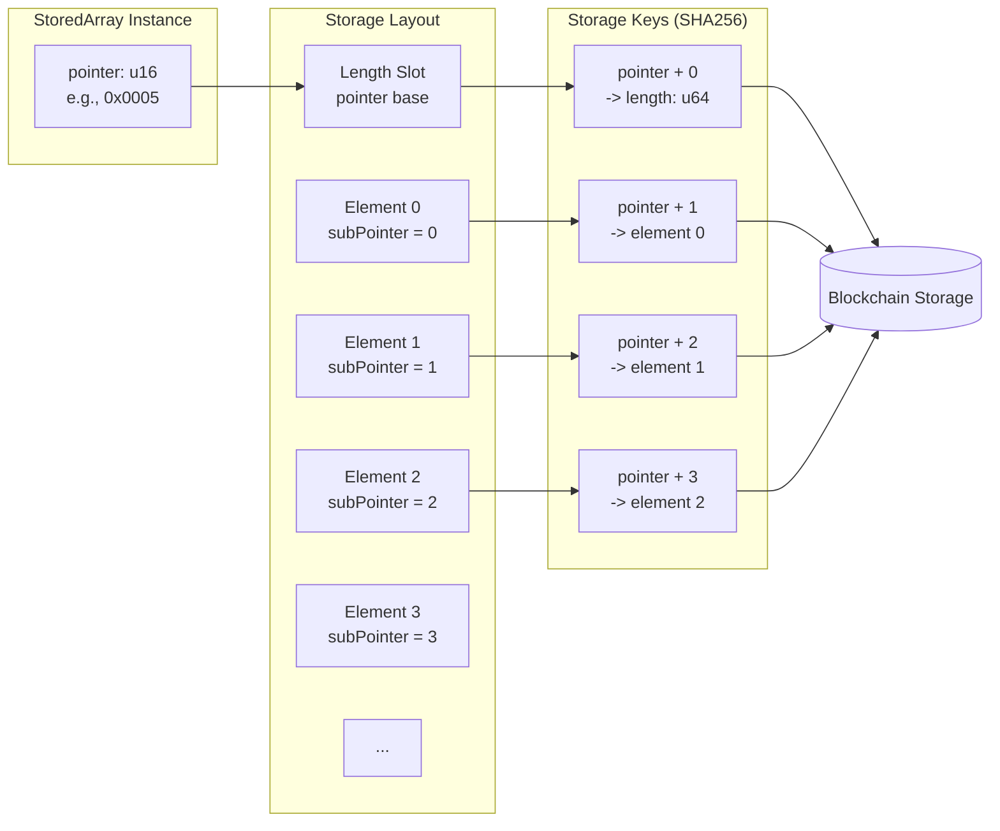
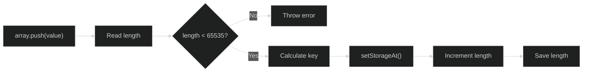
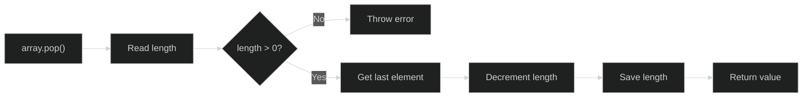

# Stored Arrays

Stored arrays persist ordered collections of values on-chain. They support push, pop, get, set, and length operations with automatic bounds checking.

## Overview

```typescript
import {
    StoredU256Array,
    StoredU128Array,
    StoredU64Array,
    StoredAddressArray,
    StoredBooleanArray,
    Blockchain,
} from '@btc-vision/btc-runtime/runtime';
import { u256 } from '@btc-vision/as-bignum/assembly';

// Allocate storage pointer
private holdersPointer: u16 = Blockchain.nextPointer;

// Create stored array
private holders: StoredAddressArray;

constructor() {
    super();
    this.holders = new StoredAddressArray(this.holdersPointer);
}

// Operations
this.holders.push(newAddress);
const first = this.holders.get(0);
const length = this.holders.length;
this.holders.pop();
```

## Available Types

| Type | Element Type | Description |
|------|-------------|-------------|
| `StoredU256Array` | `u256` | Array of 256-bit unsigned |
| `StoredU128Array` | `u128` | Array of 128-bit unsigned |
| `StoredU64Array` | `u64` | Array of 64-bit unsigned |
| `StoredU32Array` | `u32` | Array of 32-bit unsigned |
| `StoredU16Array` | `u16` | Array of 16-bit unsigned |
| `StoredU8Array` | `u8` | Array of bytes |
| `StoredAddressArray` | `Address` | Array of addresses |
| `StoredBooleanArray` | `bool` | Array of booleans |

## Storage Structure

Arrays use multiple storage slots with sequential subPointers for each element:



### Size Limits

Maximum array length: **65,535 elements**

```typescript
// Check before adding
if (this.holders.length >= 65535) {
    throw new Revert('Array full');
}
this.holders.push(newHolder);
```

## Operations

### Push

Add element to end. The push operation follows this flow:



```typescript
// Add new element
this.holders.push(newHolder);

// Length increases by 1
const newLength = this.holders.length;
```

### Pop

Remove and return last element. The pop operation follows this flow:



```typescript
// Remove last element
const removed: Address = this.holders.pop();

// Length decreases by 1
// Reverts if array is empty
```

### Get

Read element at index:

```typescript
// Get element at index
const holder: Address = this.holders.get(index);

// Reverts if index >= length
```

### Set

Write element at index:

```typescript
// Set element at index
this.holders.set(index, newValue);

// Reverts if index >= length
// Cannot set beyond current length - use push instead
```

### Length

Get current array length:

```typescript
// Get length
const count: u64 = this.holders.length;

// Check if empty
if (this.holders.length === 0) {
    throw new Revert('No holders');
}
```

## Solidity vs OPNet Comparison

### Quick Reference Table

| Solidity Array Type | OPNet Equivalent | Max Elements |
|---------------------|------------------|--------------|
| `uint256[]` | `StoredU256Array` | 65,535 |
| `uint128[]` | `StoredU128Array` | 65,535 |
| `uint64[]` | `StoredU64Array` | 65,535 |
| `uint32[]` | `StoredU32Array` | 65,535 |
| `uint16[]` | `StoredU16Array` | 65,535 |
| `uint8[]` / `bytes` | `StoredU8Array` | 65,535 |
| `address[]` | `StoredAddressArray` | 65,535 |
| `bool[]` | `StoredBooleanArray` | 65,535 |

### Operations Comparison

| Operation | Solidity | OPNet |
|-----------|----------|-------|
| Declare array | `address[] public holders;` | `private holders: StoredAddressArray;` |
| Initialize | Automatic | `this.holders = new StoredAddressArray(this.holdersPointer);` |
| Push element | `holders.push(addr);` | `holders.push(addr);` |
| Pop element | `holders.pop();` | `holders.pop();` |
| Get element | `holders[i]` | `holders.get(i)` |
| Set element | `holders[i] = addr;` | `holders.set(i, addr);` |
| Get length | `holders.length` | `holders.length` |
| Delete at index | `delete holders[i];` | N/A (use swap-and-pop) |
| Check bounds | Runtime revert | Runtime revert |
| Clear array | `delete holders;` | Pop all elements |

### Common Patterns

| Pattern | Solidity | OPNet |
|---------|----------|-------|
| Loop through array | `for (uint i = 0; i < arr.length; i++)` | `for (let i: u64 = 0; i < arr.length; i++)` |
| Remove at index (swap) | `arr[i] = arr[arr.length-1]; arr.pop();` | `arr.set(i, arr.get(arr.length-1)); arr.pop();` |
| Check if empty | `arr.length == 0` | `arr.length === 0` |
| Get last element | `arr[arr.length - 1]` | `arr.get(arr.length - 1)` |
| Initialize with values | `arr = [1, 2, 3];` | Multiple `arr.push()` calls in `onDeployment` |

### Full Example Comparison

```solidity
// Solidity
contract Registry {
    address[] public members;

    function addMember(address member) external {
        members.push(member);
    }

    function removeMember(uint256 index) external {
        members[index] = members[members.length - 1];
        members.pop();
    }

    function getMemberCount() external view returns (uint256) {
        return members.length;
    }
}
```

```typescript
// OPNet
@final
export class Registry extends OP_NET {
    private membersPointer: u16 = Blockchain.nextPointer;
    private members: StoredAddressArray;

    constructor() {
        super();
        this.members = new StoredAddressArray(this.membersPointer);
    }

    public addMember(calldata: Calldata): BytesWriter {
        const member = calldata.readAddress();
        this.members.push(member);
        return new BytesWriter(0);
    }

    public removeMember(calldata: Calldata): BytesWriter {
        const index = calldata.readU64();
        const length = this.members.length;

        if (index >= length) {
            throw new Revert('Index out of bounds');
        }

        if (index < length - 1) {
            this.members.set(index, this.members.get(length - 1));
        }
        this.members.pop();

        return new BytesWriter(0);
    }

    public getMemberCount(_calldata: Calldata): BytesWriter {
        const writer = new BytesWriter(8);
        writer.writeU64(this.members.length);
        return writer;
    }
}
```

## Side-by-Side Code Examples

### Simple Address List

**Solidity:**
```solidity
contract AddressList {
    address[] public addresses;

    function add(address addr) external {
        addresses.push(addr);
    }

    function remove(uint256 index) external {
        require(index < addresses.length, "Out of bounds");
        addresses[index] = addresses[addresses.length - 1];
        addresses.pop();
    }

    function get(uint256 index) external view returns (address) {
        return addresses[index];
    }

    function count() external view returns (uint256) {
        return addresses.length;
    }

    function contains(address addr) external view returns (bool) {
        for (uint i = 0; i < addresses.length; i++) {
            if (addresses[i] == addr) return true;
        }
        return false;
    }
}
```

**OPNet:**
```typescript
@final
export class AddressList extends OP_NET {
    private addressesPointer: u16 = Blockchain.nextPointer;
    private addresses: StoredAddressArray;

    constructor() {
        super();
        this.addresses = new StoredAddressArray(this.addressesPointer);
    }

    public add(calldata: Calldata): BytesWriter {
        const addr = calldata.readAddress();
        this.addresses.push(addr);
        return new BytesWriter(0);
    }

    public remove(calldata: Calldata): BytesWriter {
        const index = calldata.readU64();
        const length = this.addresses.length;
        if (index >= length) {
            throw new Revert('Out of bounds');
        }
        if (index < length - 1) {
            this.addresses.set(index, this.addresses.get(length - 1));
        }
        this.addresses.pop();
        return new BytesWriter(0);
    }

    public get(calldata: Calldata): BytesWriter {
        const index = calldata.readU64();
        const writer = new BytesWriter(32);
        writer.writeAddress(this.addresses.get(index));
        return writer;
    }

    public count(_calldata: Calldata): BytesWriter {
        const writer = new BytesWriter(8);
        writer.writeU64(this.addresses.length);
        return writer;
    }

    public contains(calldata: Calldata): BytesWriter {
        const addr = calldata.readAddress();
        let found = false;
        const length = this.addresses.length;
        for (let i: u64 = 0; i < length; i++) {
            if (this.addresses.get(i).equals(addr)) {
                found = true;
                break;
            }
        }
        const writer = new BytesWriter(1);
        writer.writeBoolean(found);
        return writer;
    }
}
```

### Value Queue (FIFO-like with array)

**Solidity:**
```solidity
contract ValueQueue {
    uint256[] public values;

    function enqueue(uint256 value) external {
        values.push(value);
    }

    // Note: This is O(n) - not efficient for large queues
    function dequeue() external returns (uint256) {
        require(values.length > 0, "Empty queue");
        uint256 first = values[0];
        for (uint i = 0; i < values.length - 1; i++) {
            values[i] = values[i + 1];
        }
        values.pop();
        return first;
    }

    function peek() external view returns (uint256) {
        require(values.length > 0, "Empty queue");
        return values[0];
    }

    function size() external view returns (uint256) {
        return values.length;
    }
}
```

**OPNet:**
```typescript
@final
export class ValueQueue extends OP_NET {
    private valuesPointer: u16 = Blockchain.nextPointer;
    private values: StoredU256Array;

    constructor() {
        super();
        this.values = new StoredU256Array(this.valuesPointer);
    }

    public enqueue(calldata: Calldata): BytesWriter {
        const value = calldata.readU256();
        this.values.push(value);
        return new BytesWriter(0);
    }

    // Note: This is O(n) - not efficient for large queues
    public dequeue(_calldata: Calldata): BytesWriter {
        const length = this.values.length;
        if (length === 0) {
            throw new Revert('Empty queue');
        }
        const first = this.values.get(0);
        for (let i: u64 = 0; i < length - 1; i++) {
            this.values.set(i, this.values.get(i + 1));
        }
        this.values.pop();

        const writer = new BytesWriter(32);
        writer.writeU256(first);
        return writer;
    }

    public peek(_calldata: Calldata): BytesWriter {
        if (this.values.length === 0) {
            throw new Revert('Empty queue');
        }
        const writer = new BytesWriter(32);
        writer.writeU256(this.values.get(0));
        return writer;
    }

    public size(_calldata: Calldata): BytesWriter {
        const writer = new BytesWriter(8);
        writer.writeU64(this.values.length);
        return writer;
    }
}
```

## Common Patterns

### Iterating

```typescript
// Forward iteration
const length = this.holders.length;
for (let i: u64 = 0; i < length; i++) {
    const holder = this.holders.get(i);
    // Process holder...
}

// With u256 index
for (let i: u256 = u256.Zero; i < u256.fromU64(length); i = SafeMath.add(i, u256.One)) {
    const value = this.values.get(i.toU64());
    // Process value...
}
```

### Finding Elements

```typescript
// Find index of element
private indexOf(array: StoredAddressArray, target: Address): i64 {
    const length = array.length;
    for (let i: u64 = 0; i < length; i++) {
        if (array.get(i).equals(target)) {
            return i64(i);
        }
    }
    return -1;  // Not found
}

// Check if element exists
private contains(array: StoredAddressArray, target: Address): bool {
    return indexOf(array, target) >= 0;
}
```

### Removing Elements

```typescript
// Remove at index (swap with last, then pop)
private removeAt(array: StoredAddressArray, index: u64): void {
    const length = array.length;

    if (index >= length) {
        throw new Revert('Index out of bounds');
    }

    // If not last element, swap with last
    if (index < length - 1) {
        const last = array.get(length - 1);
        array.set(index, last);
    }

    // Remove last element
    array.pop();
}

// Remove by value
private removeValue(array: StoredAddressArray, value: Address): bool {
    const idx = indexOf(array, value);
    if (idx < 0) {
        return false;
    }
    removeAt(array, u64(idx));
    return true;
}
```

### Unique Elements Set

```typescript
// Add only if not present
private addUnique(array: StoredAddressArray, value: Address): bool {
    if (contains(array, value)) {
        return false;  // Already exists
    }

    if (array.length >= 65535) {
        throw new Revert('Array full');
    }

    array.push(value);
    return true;
}
```

## Use Cases

### Token Holder Tracking

```typescript
@final
export class Token extends OP20 {
    private holdersPointer: u16 = Blockchain.nextPointer;
    private holders: StoredAddressArray;

    constructor() {
        super();
        this.holders = new StoredAddressArray(this.holdersPointer);
    }

    public override _transfer(from: Address, to: Address, amount: u256): void {
        // Track new holders
        if (this.balanceOf(to).isZero() && !amount.isZero()) {
            this.holders.push(to);
        }

        super._transfer(from, to, amount);

        // Note: Removing holders when balance becomes zero
        // requires additional logic (holder index mapping)
    }

    public getHolderCount(_calldata: Calldata): BytesWriter {
        const writer = new BytesWriter(8);
        writer.writeU64(this.holders.length);
        return writer;
    }
}
```

### Order Queue

```typescript
@final
export class OrderBook extends OP_NET {
    private ordersPointer: u16 = Blockchain.nextPointer;
    private orders: StoredU256Array;

    constructor() {
        super();
        this.orders = new StoredU256Array(this.ordersPointer);
    }

    public addOrder(calldata: Calldata): BytesWriter {
        const orderId = calldata.readU256();
        this.orders.push(orderId);
        return new BytesWriter(0);
    }

    public processNextOrder(_calldata: Calldata): BytesWriter {
        if (this.orders.length === 0) {
            throw new Revert('No orders');
        }

        // Get first order (FIFO requires different approach)
        // For simple LIFO (last in, first out):
        const orderId = this.orders.pop();

        // Process order...

        const writer = new BytesWriter(32);
        writer.writeU256(orderId);
        return writer;
    }
}
```

### Whitelist Management

```typescript
@final
export class Whitelist extends OP_NET {
    private addressesPointer: u16 = Blockchain.nextPointer;
    private addresses: StoredAddressArray;

    constructor() {
        super();
        this.addresses = new StoredAddressArray(this.addressesPointer);
    }

    public add(calldata: Calldata): BytesWriter {
        this.onlyDeployer(Blockchain.tx.sender);

        const addr = calldata.readAddress();

        // Check not already in list
        for (let i: u64 = 0; i < this.addresses.length; i++) {
            if (this.addresses.get(i).equals(addr)) {
                throw new Revert('Already whitelisted');
            }
        }

        this.addresses.push(addr);
        return new BytesWriter(0);
    }

    public isWhitelisted(calldata: Calldata): BytesWriter {
        const addr = calldata.readAddress();

        let found = false;
        for (let i: u64 = 0; i < this.addresses.length; i++) {
            if (this.addresses.get(i).equals(addr)) {
                found = true;
                break;
            }
        }

        const writer = new BytesWriter(1);
        writer.writeBoolean(found);
        return writer;
    }
}
```

## Best Practices

### 1. Limit Array Size

```typescript
const MAX_ARRAY_SIZE: u64 = 1000;

public addItem(calldata: Calldata): BytesWriter {
    if (this.items.length >= MAX_ARRAY_SIZE) {
        throw new Revert('Array size limit reached');
    }
    this.items.push(calldata.readU256());
    return new BytesWriter(0);
}
```

### 2. Cache Length in Loops

```typescript
// Good: Cache length
const length = this.items.length;
for (let i: u64 = 0; i < length; i++) {
    // ...
}

// Avoid: Reading length each iteration
for (let i: u64 = 0; i < this.items.length; i++) {
    // Might be OK, but caching is safer
}
```

### 3. Use Maps for Lookup-Heavy Cases

If you frequently check "is X in array?", consider using a map alongside the array:

```typescript
private itemsPointer: u16 = Blockchain.nextPointer;
private itemExistsPointer: u16 = Blockchain.nextPointer;

private items: StoredU256Array;
private itemExists: StoredMapU256;

constructor() {
    super();
    this.items = new StoredU256Array(this.itemsPointer);
    this.itemExists = new StoredMapU256(this.itemExistsPointer);
}

public addItem(item: u256): void {
    if (!this.itemExists.get(item).isZero()) {
        throw new Revert('Already exists');
    }
    this.items.push(item);
    this.itemExists.set(item, u256.One);
}
```

---

**Navigation:**
- Previous: [Stored Primitives](./stored-primitives.md)
- Next: [Stored Maps](./stored-maps.md)
