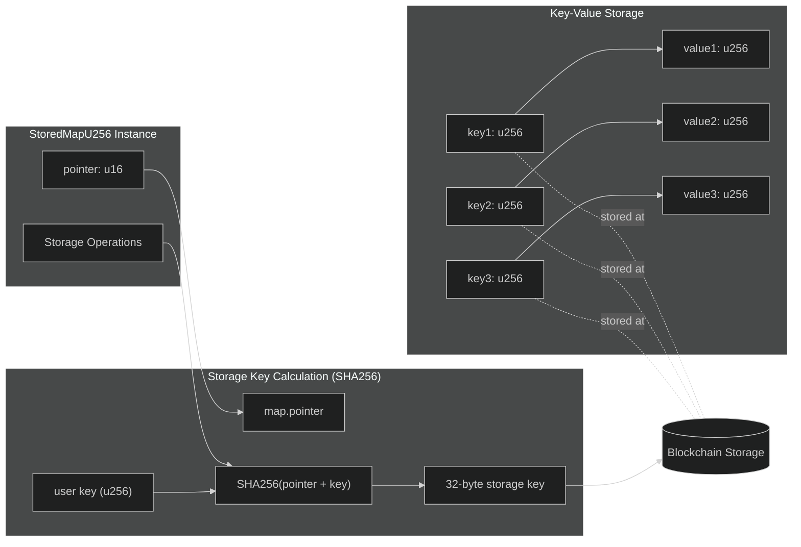
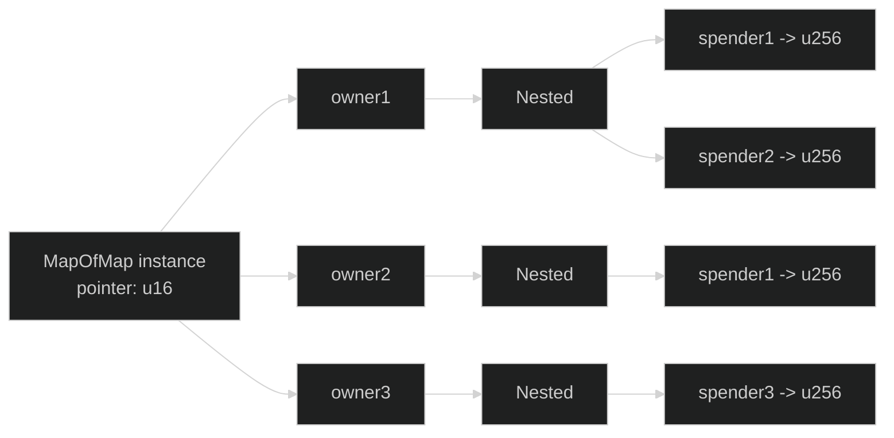
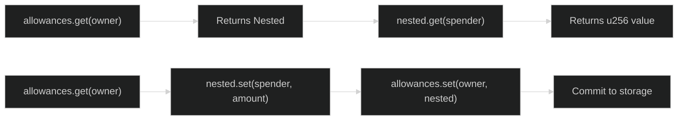

# Stored Maps

Stored maps provide key-value storage on-chain, similar to Solidity's mappings. They support various key and value types with efficient storage access.

## Overview

```typescript
import {
    StoredMapU256,
    Blockchain,
} from '@btc-vision/btc-runtime/runtime';
import { u256 } from '@btc-vision/as-bignum/assembly';

// Allocate storage pointer
private dataPointer: u16 = Blockchain.nextPointer;

// Create stored map
private data: StoredMapU256;

constructor() {
    super();
    this.data = new StoredMapU256(this.dataPointer);
}

// Operations
this.data.set(key, value);
const value = this.data.get(key);
const exists = this.data.has(key);
```

## CRITICAL: Map Implementation Warning

> **DO NOT USE AssemblyScript's Built-in Map**
>
> When creating custom map implementations or extending map functionality, you **MUST** use the Map class from `@btc-vision/btc-runtime/runtime`, NOT the built-in AssemblyScript Map.
>
> **Why the AssemblyScript Map is broken for blockchain:**
> - NOT optimized for blockchain storage patterns
> - Does NOT handle Uint8Array buffers as keys correctly
> - Does NOT work properly with Address key comparisons
> - Will cause silent data corruption or key collisions
>
> **CORRECT:**
> ```typescript
> import { Map } from '@btc-vision/btc-runtime/runtime';
>
> export class MyCustomMap<V> extends Map<Address, V> {
>     // Your implementation
> }
> ```
>
> **WRONG:**
> ```typescript
> // DO NOT DO THIS - will break!
> const map = new Map<Uint8Array, u256>();  // AssemblyScript Map
> ```
>
> The btc-runtime Map is specifically designed to:
> - Handle Address and Uint8Array key comparisons correctly
> - Optimize for blockchain storage access patterns
> - Support proper serialization for persistent storage
> - Prevent key collisions with custom equality logic

## StoredMapU256

Basic key-value map with `u256` keys and values. Each key-value pair is stored at a unique storage slot computed via SHA256:



```typescript
private balancesPointer: u16 = Blockchain.nextPointer;
private balances: StoredMapU256;

constructor() {
    super();
    this.balances = new StoredMapU256(this.balancesPointer);
}

// Set value
this.balances.set(userId, balance);

// Get value (returns u256.Zero if not set)
const balance: u256 = this.balances.get(userId);

// Check existence (StoredMapU256 doesn't have has() - compare with zero)
const exists: bool = !this.balances.get(userId).isZero();

// Delete (set to zero)
this.balances.set(userId, u256.Zero);
```

### Storage Layout

```
Map Pointer + SHA256(key) -> value

For key=5, pointer=3:
Storage key = SHA256(3 || 5)
```

## Using Address Keys

For address-keyed mappings, convert address to `u256`:

```typescript
// Address to u256 conversion
private addressToKey(addr: Address): u256 {
    const bytes = addr.toBytes();
    return u256.fromBytes(bytes);
}

// Get balance for address
public getBalance(addr: Address): u256 {
    const key = this.addressToKey(addr);
    return this.balances.get(key);
}

// Set balance for address
public setBalance(addr: Address, amount: u256): void {
    const key = this.addressToKey(addr);
    this.balances.set(key, amount);
}
```

## Nested Maps

For `mapping(key1 => mapping(key2 => value))`:

```typescript
private allowancesPointer: u16 = Blockchain.nextPointer;
private allowances: StoredMapU256;

constructor() {
    super();
    this.allowances = new StoredMapU256(this.allowancesPointer);
}

// Create composite key
private allowanceKey(owner: Address, spender: Address): u256 {
    const ownerBytes = owner.toBytes();
    const spenderBytes = spender.toBytes();

    // Combine and hash
    const combined = new Uint8Array(64);
    combined.set(ownerBytes, 0);
    combined.set(spenderBytes, 32);

    return u256.fromBytes(Blockchain.sha256(combined));
}

// Get allowance
public getAllowance(owner: Address, spender: Address): u256 {
    const key = this.allowanceKey(owner, spender);
    return this.allowances.get(key);
}

// Set allowance
public setAllowance(owner: Address, spender: Address, amount: u256): void {
    const key = this.allowanceKey(owner, spender);
    this.allowances.set(key, amount);
}
```

## MapOfMap

For complex nested mappings, use `MapOfMap`. This provides a two-level structure:



```typescript
import { MapOfMap, Nested } from '@btc-vision/btc-runtime/runtime';

// mapping(address => mapping(address => uint256))
private allowancesPointer: u16 = Blockchain.nextPointer;
private allowances: MapOfMap<u256>;

constructor() {
    super();
    this.allowances = new MapOfMap<u256>(this.allowancesPointer);
}

// Get nested value - two-step process
public getAllowance(owner: Address, spender: Address): u256 {
    const ownerMap = this.allowances.get(owner);  // Returns Nested<u256>
    return ownerMap.get(spender);                  // Returns u256
}

// Set nested value - get, modify, commit back
public setAllowance(owner: Address, spender: Address, amount: u256): void {
    const ownerMap = this.allowances.get(owner);  // Get the nested map
    ownerMap.set(spender, amount);                 // Modify it
    this.allowances.set(owner, ownerMap);          // Commit back
}
```

### MapOfMap Get/Set Pattern

> **Important:** `MapOfMap.get(key)` returns a `Nested<T>` object, not the final value. You must call `.get()` on the nested object to retrieve the actual value. Similarly, when setting values, you must retrieve the nested map, modify it, then commit it back to the parent map.



## Solidity vs OPNet Comparison

### Quick Reference Table

| Solidity Mapping Type | OPNet Equivalent | Notes |
|-----------------------|------------------|-------|
| `mapping(uint256 => uint256)` | `StoredMapU256` | u256 keys and values |
| `mapping(address => uint256)` | `AddressMemoryMap` | Recommended for address keys |
| `mapping(address => uint256)` | `StoredMapU256` with `addressToKey()` | Alternative approach |
| `mapping(K => mapping(K2 => V))` | `MapOfMap<V>` | Two-level nesting |
| `mapping(K => mapping(K2 => V))` | `StoredMapU256` with composite key | Hash-based approach |

### Operations Comparison

| Operation | Solidity | OPNet (StoredMapU256) |
|-----------|----------|----------------------|
| Declare | `mapping(uint256 => uint256) data;` | `private data: StoredMapU256;` |
| Initialize | Automatic | `this.data = new StoredMapU256(this.dataPointer);` |
| Read value | `data[key]` | `data.get(key)` |
| Write value | `data[key] = value;` | `data.set(key, value)` |
| Check exists | `data[key] != 0` | `!data.get(key).isZero()` |
| Delete entry | `delete data[key];` | `data.set(key, u256.Zero)` |
| Default value | `0` | `u256.Zero` |

### Nested Mapping Comparison

| Operation | Solidity | OPNet (MapOfMap) |
|-----------|----------|------------------|
| Declare | `mapping(address => mapping(address => uint256)) allowances;` | `private allowances: MapOfMap<u256>;` |
| Read nested | `allowances[owner][spender]` | `allowances.get(owner).get(spender)` |
| Write nested | `allowances[owner][spender] = amount;` | `const m = allowances.get(owner); m.set(spender, amount); allowances.set(owner, m);` |

### Address Key Patterns

| Solidity Pattern | OPNet Equivalent |
|------------------|------------------|
| `mapping(address => uint256) balances;` | `private balances: AddressMemoryMap;` (preferred) |
| `balances[msg.sender]` | `balances.get(Blockchain.tx.sender)` |
| `balances[addr] = x;` | `balances.set(addr, x)` |
| `balances[addr] += amount;` | `balances.set(addr, SafeMath.add(balances.get(addr), amount))` |

### Common Use Cases

| Use Case | Solidity | OPNet |
|----------|----------|-------|
| Token balances | `mapping(address => uint256) balances;` | `AddressMemoryMap` |
| Approvals | `mapping(address => mapping(address => uint256))` | `MapOfMap<u256>` |
| Nonces | `mapping(address => uint256) nonces;` | `AddressMemoryMap` or `StoredMapU256` |
| Roles/permissions | `mapping(bytes32 => mapping(address => bool))` | `MapOfMap<u256>` with role hash |
| Token metadata | `mapping(uint256 => string)` | `StoredMapU256` with encoded strings |
| Checkpoints | `mapping(address => mapping(uint256 => uint256))` | `MapOfMap<u256>` or composite keys |

For a complete token implementation using these map types, see [Basic Token Example](../examples/basic-token.md).

## Side-by-Side Code Examples

### Simple Key-Value Store

**Solidity:**
```solidity
contract KeyValueStore {
    mapping(uint256 => uint256) public data;

    function set(uint256 key, uint256 value) external {
        data[key] = value;
    }

    function get(uint256 key) external view returns (uint256) {
        return data[key];
    }

    function remove(uint256 key) external {
        delete data[key];
    }

    function increment(uint256 key) external {
        data[key]++;
    }
}
```

**OPNet:**
```typescript
@final
export class KeyValueStore extends OP_NET {
    private dataPointer: u16 = Blockchain.nextPointer;
    private data: StoredMapU256;

    constructor() {
        super();
        this.data = new StoredMapU256(this.dataPointer);
    }

    public set(calldata: Calldata): BytesWriter {
        const key = calldata.readU256();
        const value = calldata.readU256();
        this.data.set(key, value);
        return new BytesWriter(0);
    }

    public get(calldata: Calldata): BytesWriter {
        const key = calldata.readU256();
        const writer = new BytesWriter(32);
        writer.writeU256(this.data.get(key));
        return writer;
    }

    public remove(calldata: Calldata): BytesWriter {
        const key = calldata.readU256();
        this.data.set(key, u256.Zero);
        return new BytesWriter(0);
    }

    public increment(calldata: Calldata): BytesWriter {
        const key = calldata.readU256();
        this.data.set(key, SafeMath.add(this.data.get(key), u256.One));
        return new BytesWriter(0);
    }
}
```

### Approval System with Nested Mapping

**Solidity:**
```solidity
contract ApprovalSystem {
    mapping(address => mapping(address => uint256)) public allowances;

    function approve(address spender, uint256 amount) external {
        allowances[msg.sender][spender] = amount;
    }

    function allowance(address owner, address spender) external view returns (uint256) {
        return allowances[owner][spender];
    }

    function increaseAllowance(address spender, uint256 addedValue) external {
        allowances[msg.sender][spender] += addedValue;
    }

    function decreaseAllowance(address spender, uint256 subtractedValue) external {
        uint256 currentAllowance = allowances[msg.sender][spender];
        require(currentAllowance >= subtractedValue, "Decreased below zero");
        allowances[msg.sender][spender] = currentAllowance - subtractedValue;
    }

    function spend(address owner, uint256 amount) external {
        uint256 currentAllowance = allowances[owner][msg.sender];
        require(currentAllowance >= amount, "Insufficient allowance");
        allowances[owner][msg.sender] = currentAllowance - amount;
    }
}
```

**OPNet:**
```typescript
@final
export class ApprovalSystem extends OP_NET {
    private allowancesPointer: u16 = Blockchain.nextPointer;
    private allowances: MapOfMap<u256>;

    constructor() {
        super();
        this.allowances = new MapOfMap<u256>(this.allowancesPointer);
    }

    public approve(calldata: Calldata): BytesWriter {
        const spender = calldata.readAddress();
        const amount = calldata.readU256();
        const sender = Blockchain.tx.sender;

        const senderAllowances = this.allowances.get(sender);
        senderAllowances.set(spender, amount);
        this.allowances.set(sender, senderAllowances);

        return new BytesWriter(0);
    }

    public allowance(calldata: Calldata): BytesWriter {
        const owner = calldata.readAddress();
        const spender = calldata.readAddress();

        const ownerAllowances = this.allowances.get(owner);
        const writer = new BytesWriter(32);
        writer.writeU256(ownerAllowances.get(spender));
        return writer;
    }

    public increaseAllowance(calldata: Calldata): BytesWriter {
        const spender = calldata.readAddress();
        const addedValue = calldata.readU256();
        const sender = Blockchain.tx.sender;

        const senderAllowances = this.allowances.get(sender);
        const current = senderAllowances.get(spender);
        senderAllowances.set(spender, SafeMath.add(current, addedValue));
        this.allowances.set(sender, senderAllowances);

        return new BytesWriter(0);
    }

    public decreaseAllowance(calldata: Calldata): BytesWriter {
        const spender = calldata.readAddress();
        const subtractedValue = calldata.readU256();
        const sender = Blockchain.tx.sender;

        const senderAllowances = this.allowances.get(sender);
        const currentAllowance = senderAllowances.get(spender);

        if (currentAllowance < subtractedValue) {
            throw new Revert('Decreased below zero');
        }

        senderAllowances.set(spender, SafeMath.sub(currentAllowance, subtractedValue));
        this.allowances.set(sender, senderAllowances);

        return new BytesWriter(0);
    }

    public spend(calldata: Calldata): BytesWriter {
        const owner = calldata.readAddress();
        const amount = calldata.readU256();
        const sender = Blockchain.tx.sender;

        const ownerAllowances = this.allowances.get(owner);
        const currentAllowance = ownerAllowances.get(sender);

        if (currentAllowance < amount) {
            throw new Revert('Insufficient allowance');
        }

        ownerAllowances.set(sender, SafeMath.sub(currentAllowance, amount));
        this.allowances.set(owner, ownerAllowances);

        return new BytesWriter(0);
    }
}
```

## Common Patterns

### Counter/Nonce Tracking

```typescript
private noncesPointer: u16 = Blockchain.nextPointer;
private nonces: StoredMapU256;

constructor() {
    super();
    this.nonces = new StoredMapU256(this.noncesPointer);
}

public getNonce(addr: Address): u256 {
    return this.nonces.get(this.addressKey(addr));
}

public incrementNonce(addr: Address): u256 {
    const key = this.addressKey(addr);
    const current = this.nonces.get(key);
    const next = SafeMath.add(current, u256.One);
    this.nonces.set(key, next);
    return current;  // Return old nonce
}

private addressKey(addr: Address): u256 {
    return u256.fromBytes(addr.toBytes());
}
```

### Role Management

```typescript
private rolesPointer: u16 = Blockchain.nextPointer;
private roles: StoredMapU256;

constructor() {
    super();
    this.roles = new StoredMapU256(this.rolesPointer);
}

private readonly ADMIN_ROLE: u256 = u256.One;
private readonly MINTER_ROLE: u256 = u256.fromU64(2);

public hasRole(addr: Address, role: u256): bool {
    const key = this.roleKey(addr, role);
    return !this.roles.get(key).isZero();
}

public grantRole(calldata: Calldata): BytesWriter {
    this.onlyDeployer(Blockchain.tx.sender);

    const addr = calldata.readAddress();
    const role = calldata.readU256();

    const key = this.roleKey(addr, role);
    this.roles.set(key, u256.One);

    return new BytesWriter(0);
}

private roleKey(addr: Address, role: u256): u256 {
    // Combine address and role into unique key
    const bytes = new Uint8Array(64);
    bytes.set(addr.toBytes(), 0);
    bytes.set(role.toBytes(), 32);
    return u256.fromBytes(Blockchain.sha256(bytes));
}
```

### Token Metadata Storage

```typescript
// Store arbitrary metadata per token ID
private metadataPointer: u16 = Blockchain.nextPointer;
private metadata: StoredMapU256;

constructor() {
    super();
    this.metadata = new StoredMapU256(this.metadataPointer);
}

// Each token can have multiple metadata fields
// Use composite keys: tokenId + fieldId

private readonly FIELD_NAME: u256 = u256.One;
private readonly FIELD_LEVEL: u256 = u256.fromU64(2);
private readonly FIELD_RARITY: u256 = u256.fromU64(3);

public getMetadata(tokenId: u256, field: u256): u256 {
    const key = this.metadataKey(tokenId, field);
    return this.metadata.get(key);
}

public setMetadata(tokenId: u256, field: u256, value: u256): void {
    const key = this.metadataKey(tokenId, field);
    this.metadata.set(key, value);
}

private metadataKey(tokenId: u256, field: u256): u256 {
    const bytes = new Uint8Array(64);
    bytes.set(tokenId.toBytes(), 0);
    bytes.set(field.toBytes(), 32);
    return u256.fromBytes(Blockchain.sha256(bytes));
}
```

### Snapshot/Checkpoint Pattern

```typescript
// Store values at specific block numbers
private checkpointsPointer: u16 = Blockchain.nextPointer;
private checkpoints: StoredMapU256;

constructor() {
    super();
    this.checkpoints = new StoredMapU256(this.checkpointsPointer);
}

public checkpoint(addr: Address, value: u256): void {
    const blockNumber = Blockchain.block.number;
    const key = this.checkpointKey(addr, blockNumber);
    this.checkpoints.set(key, value);
}

public getCheckpoint(addr: Address, blockNumber: u64): u256 {
    const key = this.checkpointKey(addr, blockNumber);
    return this.checkpoints.get(key);
}

private checkpointKey(addr: Address, blockNumber: u64): u256 {
    const bytes = new Uint8Array(40);
    bytes.set(addr.toBytes(), 0);
    // Encode block number in remaining bytes
    const blockBytes = new Uint8Array(8);
    // ... encode blockNumber
    bytes.set(blockBytes, 32);
    return u256.fromBytes(Blockchain.sha256(bytes));
}
```

## Best Practices

### 1. Use Consistent Key Functions

```typescript
// Define key functions once
private addressKey(addr: Address): u256 {
    return u256.fromBytes(addr.toBytes());
}

// Use consistently throughout contract
const key = this.addressKey(user);
```

### 2. Handle Default Values

```typescript
// Map returns u256.Zero for unset keys
const balance = this.balances.get(key);

// Check if actually set vs zero balance
// Option 1: Use separate "exists" tracking
// Option 2: Use non-zero sentinel for "set"
// Option 3: Accept that zero and unset are equivalent
```

### 3. Document Key Structures

```typescript
/**
 * Storage layout:
 * - balances: address -> u256
 *   Key: SHA256(balancesPointer || SHA256(address))
 *
 * - allowances: (owner, spender) -> u256
 *   Key: SHA256(allowancesPointer || SHA256(owner || spender))
 */
```

---

**Navigation:**
- Previous: [Stored Arrays](./stored-arrays.md)
- Next: [Memory Maps](./memory-maps.md)
