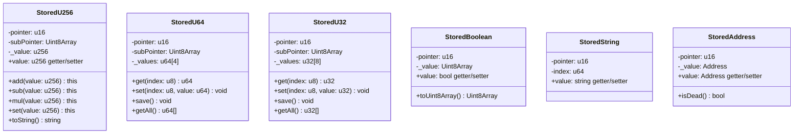

# Stored Primitives

Stored primitives are typed wrappers for single values that persist on-chain. They handle storage reading, writing, and caching automatically.

## Overview

```typescript
import {
    StoredU256,
    StoredU64,
    StoredU32,
    StoredBoolean,
    StoredString,
    StoredAddress,
    Blockchain,
    EMPTY_POINTER,
} from '@btc-vision/btc-runtime/runtime';
import { u256 } from '@btc-vision/as-bignum/assembly';

// Allocate storage pointer
private counterPointer: u16 = Blockchain.nextPointer;

// Create stored value with default
private counter: StoredU256 = new StoredU256(this.counterPointer, EMPTY_POINTER);

// Read and write
const current = this.counter.value;      // Read
this.counter.value = newValue;            // Write
```

## Class Hierarchy

The stored primitives are standalone final classes (not inheriting from a common base):



## Available Types

| Type | Value Type | Size | Description |
|------|------------|------|-------------|
| `StoredU256` | `u256` | 32 bytes | 256-bit unsigned integer |
| `StoredU64` | `u64[4]` | 32 bytes | Stores 4 u64 values in one slot |
| `StoredU32` | `u32[8]` | 32 bytes | Stores 8 u32 values in one slot |
| `StoredBoolean` | `bool` | 32 bytes | Boolean value |
| `StoredString` | `string` | Variable | UTF-8 string (max 65,535 bytes) |
| `StoredAddress` | `Address` | 32 bytes | Address value |

> **Note:** `StoredU64` and `StoredU32` are packed storage types that store multiple values in a single 256-bit storage slot. Use `get(index)` and `set(index, value)` to access individual values, then call `save()` to persist changes.

## Storage Key Generation

Each stored primitive computes its storage key using `SHA256(pointer || subPointer)`. See [Pointers](../core-concepts/pointers.md#encodepointer-function-flow) for the detailed flow diagram.

## Usage

### StoredU256

```typescript
// Declaration
private balancePointer: u16 = Blockchain.nextPointer;
private _balance: StoredU256 = new StoredU256(this.balancePointer, EMPTY_POINTER);

// Read
const balance: u256 = this._balance.value;

// Write
this._balance.value = newBalance;

// Arithmetic
this._balance.value = SafeMath.add(this._balance.value, amount);
```

### StoredBoolean

```typescript
// Declaration
private pausedPointer: u16 = Blockchain.nextPointer;
private _paused: StoredBoolean = new StoredBoolean(this.pausedPointer, false);

// Read
if (this._paused.value) {
    throw new Revert('Contract is paused');
}

// Write
this._paused.value = true;
```

### StoredString

```typescript
// Declaration
private namePointer: u16 = Blockchain.nextPointer;
private _name: StoredString = new StoredString(this.namePointer, 0);

// Write (typically in onDeployment)
this._name.value = 'My Token';

// Read
const name: string = this._name.value;
```

### StoredAddress

```typescript
// Declaration - takes only pointer (default value is Address.zero())
private ownerPointer: u16 = Blockchain.nextPointer;
private _owner: StoredAddress = new StoredAddress(this.ownerPointer);

// Write
this._owner.value = Blockchain.tx.origin;

// Read
const owner: Address = this._owner.value;

// Check if address is zero (Note: isDead() in StoredAddress actually checks for zero address)
if (this._owner.isDead()) {
    throw new Revert('Owner not set');
}

// Alternative: use isZero() on the Address instance directly
if (this._owner.value.isZero()) {
    throw new Revert('Owner not set');
}

// Compare
if (!Blockchain.tx.sender.equals(this._owner.value)) {
    throw new Revert('Not owner');
}
```

## Storage Behavior

### Lazy Loading (Value Read Flow)

Values are loaded from storage on first access. The read flow follows this pattern:


```typescript
// First access triggers storage read
const balance = this._balance.value;  // Reads from storage

// Subsequent accesses use cached value
const balance2 = this._balance.value; // Uses cache (no storage read)
```

### Automatic Commit (Value Write Flow)

Changes are committed to storage automatically following this flow:


```typescript
// Write value
this._balance.value = newBalance;  // Marks as dirty

// Value is committed at transaction end
// (or immediately in some implementations)
```

### Manual Commit Control

For advanced use cases:

```typescript
// Some stored types support NoCommit for read-only access
const value = this._balance.valueNoCommit;  // Read without triggering commit

// Useful for view functions that shouldn't modify storage
```

## Initialization

### Default Values

Always provide a meaningful default:

```typescript
// Good: Zero/empty defaults
private counter: StoredU256 = new StoredU256(ptr, EMPTY_POINTER);
private name: StoredString = new StoredString(ptr, 0);
private paused: StoredBoolean = new StoredBoolean(ptr, false);
private owner: StoredAddress = new StoredAddress(ptr);  // Default is Address.zero()

// The default is returned when storage slot is empty (never written)
```

### Setting Initial Values

Set values in `onDeployment`:

```typescript
public override onDeployment(calldata: Calldata): void {
    // Set initial values
    this._name.value = calldata.readString();
    this._symbol.value = calldata.readString();
    this._totalSupply.value = calldata.readU256();
    this._owner.value = Blockchain.tx.origin;
}
```

## Solidity vs OPNet Comparison

### Quick Reference Table

| Solidity | OPNet | Default Value |
|----------|-------|---------------|
| `uint256 public value;` | `StoredU256` | `u256.Zero` |
| `uint64[4] packed;` | `StoredU64` | `[0, 0, 0, 0]` |
| `uint32[8] packed;` | `StoredU32` | `[0, 0, 0, 0, 0, 0, 0, 0]` |
| `string public name;` | `StoredString` | `""` |
| `bool public paused;` | `StoredBoolean` | `false` |
| `address public owner;` | `StoredAddress` | `Address.zero()` |

> **Note:** `StoredU64` and `StoredU32` pack multiple values into a single storage slot for efficiency. For single-value storage, use `StoredU256` with appropriate conversions.

### Operations Comparison

| Operation | Solidity | OPNet |
|-----------|----------|-------|
| Declare state variable | `uint256 public value;` | `private _value: StoredU256 = new StoredU256(ptr, EMPTY_POINTER);` |
| Read value | `value` or `this.value` | `this._value.value` |
| Write value | `value = newValue;` | `this._value.value = newValue;` |
| Increment | `value++;` | `this._value.value = SafeMath.add(this._value.value, u256.One);` |
| Decrement | `value--;` | `this._value.value = SafeMath.sub(this._value.value, u256.One);` |
| Add amount | `value += amount;` | `this._value.value = SafeMath.add(this._value.value, amount);` |
| Check zero | `value == 0` | `this._value.value.isZero()` |
| Compare | `value > other` | `this._value.value > other` |
| Set in constructor | `value = initial;` | Use `onDeployment()` |
| Public getter | Automatic | Must define manually |

### Declaration Patterns

| Solidity Pattern | OPNet Equivalent |
|------------------|------------------|
| `uint256 public totalSupply;` | `private totalSupplyPtr: u16 = Blockchain.nextPointer;`<br>`private _totalSupply: StoredU256 = new StoredU256(this.totalSupplyPtr, EMPTY_POINTER);` |
| `string public name = "Token";` | `private namePtr: u16 = Blockchain.nextPointer;`<br>`private _name: StoredString = new StoredString(this.namePtr, 0);`<br>Then in `onDeployment`: `this._name.value = "Token";` |
| `bool public paused = false;` | `private pausedPtr: u16 = Blockchain.nextPointer;`<br>`private _paused: StoredBoolean = new StoredBoolean(this.pausedPtr, false);` |
| `address public owner;` | `private ownerPtr: u16 = Blockchain.nextPointer;`<br>`private _owner: StoredAddress = new StoredAddress(this.ownerPtr);` |

For complete token examples using stored primitives, see [Basic Token Example](../examples/basic-token.md).

## Side-by-Side Code Examples

### Counter Contract

**Solidity:**
```solidity
contract Counter {
    uint256 public count;

    function increment() external {
        count++;
    }

    function decrement() external {
        require(count > 0, "Cannot go below zero");
        count--;
    }

    function add(uint256 amount) external {
        count += amount;
    }

    function reset() external {
        count = 0;
    }
}
```

**OPNet:**
```typescript
@final
export class Counter extends OP_NET {
    private countPointer: u16 = Blockchain.nextPointer;
    private _count: StoredU256 = new StoredU256(this.countPointer, EMPTY_POINTER);

    public increment(_calldata: Calldata): BytesWriter {
        this._count.value = SafeMath.add(this._count.value, u256.One);
        return new BytesWriter(0);
    }

    public decrement(_calldata: Calldata): BytesWriter {
        if (this._count.value.isZero()) {
            throw new Revert('Cannot go below zero');
        }
        this._count.value = SafeMath.sub(this._count.value, u256.One);
        return new BytesWriter(0);
    }

    public add(calldata: Calldata): BytesWriter {
        const amount = calldata.readU256();
        this._count.value = SafeMath.add(this._count.value, amount);
        return new BytesWriter(0);
    }

    public reset(_calldata: Calldata): BytesWriter {
        this._count.value = u256.Zero;
        return new BytesWriter(0);
    }

    public count(_calldata: Calldata): BytesWriter {
        const writer = new BytesWriter(32);
        writer.writeU256(this._count.value);
        return writer;
    }
}
```

### Ownable Contract

**Solidity:**
```solidity
contract Ownable {
    address public owner;
    bool public paused;

    modifier onlyOwner() {
        require(msg.sender == owner, "Not owner");
        _;
    }

    constructor() {
        owner = msg.sender;
    }

    function transferOwnership(address newOwner) external onlyOwner {
        require(newOwner != address(0), "Invalid address");
        owner = newOwner;
    }

    function pause() external onlyOwner {
        paused = true;
    }

    function unpause() external onlyOwner {
        paused = false;
    }
}
```

**OPNet:**
```typescript
@final
export class Ownable extends OP_NET {
    private ownerPointer: u16 = Blockchain.nextPointer;
    private pausedPointer: u16 = Blockchain.nextPointer;

    private _owner: StoredAddress = new StoredAddress(this.ownerPointer);
    private _paused: StoredBoolean = new StoredBoolean(this.pausedPointer, false);

    public override onDeployment(_calldata: Calldata): void {
        this._owner.value = Blockchain.tx.origin;
    }

    private onlyOwner(): void {
        if (!Blockchain.tx.sender.equals(this._owner.value)) {
            throw new Revert('Not owner');
        }
    }

    public transferOwnership(calldata: Calldata): BytesWriter {
        this.onlyOwner();
        const newOwner = calldata.readAddress();
        if (newOwner.equals(Address.zero())) {
            throw new Revert('Invalid address');
        }
        this._owner.value = newOwner;
        return new BytesWriter(0);
    }

    public pause(_calldata: Calldata): BytesWriter {
        this.onlyOwner();
        this._paused.value = true;
        return new BytesWriter(0);
    }

    public unpause(_calldata: Calldata): BytesWriter {
        this.onlyOwner();
        this._paused.value = false;
        return new BytesWriter(0);
    }

    public owner(_calldata: Calldata): BytesWriter {
        const writer = new BytesWriter(32);
        writer.writeAddress(this._owner.value);
        return writer;
    }

    public paused(_calldata: Calldata): BytesWriter {
        const writer = new BytesWriter(1);
        writer.writeBoolean(this._paused.value);
        return writer;
    }
}
```

## Patterns

### Read-Modify-Write

```typescript
// Increment counter
public increment(_calldata: Calldata): BytesWriter {
    const current = this._counter.value;
    this._counter.value = SafeMath.add(current, u256.One);
    return new BytesWriter(0);
}

// Toggle boolean
public togglePause(_calldata: Calldata): BytesWriter {
    this.onlyDeployer(Blockchain.tx.sender);
    this._paused.value = !this._paused.value;
    return new BytesWriter(0);
}
```

### Conditional Updates

```typescript
public setOwner(calldata: Calldata): BytesWriter {
    this.onlyDeployer(Blockchain.tx.sender);

    const newOwner = calldata.readAddress();

    // Validate before writing
    if (newOwner.equals(Address.zero())) {
        throw new Revert('Invalid owner');
    }

    // Only write if different
    if (!newOwner.equals(this._owner.value)) {
        this._owner.value = newOwner;
        this.emitEvent(new OwnershipTransferred(this._owner.value, newOwner));
    }

    return new BytesWriter(0);
}
```

### View Functions

```typescript
// Return stored value
public totalSupply(_calldata: Calldata): BytesWriter {
    const writer = new BytesWriter(32);
    writer.writeU256(this._totalSupply.value);
    return writer;
}

// Return multiple values
public getInfo(_calldata: Calldata): BytesWriter {
    const writer = new BytesWriter(256);
    writer.writeString(this._name.value);
    writer.writeString(this._symbol.value);
    writer.writeU256(this._totalSupply.value);
    writer.writeU8(this._decimals.value);
    return writer;
}
```

## Best Practices

### 1. Initialize All Storage

```typescript
// Always set initial values in onDeployment
public override onDeployment(calldata: Calldata): void {
    this._name.value = 'Token';
    this._symbol.value = 'TKN';
    this._decimals.value = 18;
    this._owner.value = Blockchain.tx.origin;
}
```

### 2. Use Meaningful Defaults

```typescript
// Good: EMPTY_POINTER for uninitialized u256 values
private counter: StoredU256 = new StoredU256(ptr, EMPTY_POINTER);

// Note: Set initial values in onDeployment if needed
// this._counter.value = u256.fromU64(100);
```

### 3. Validate Before Writing

```typescript
public setLimit(calldata: Calldata): BytesWriter {
    const newLimit = calldata.readU256();

    // Validate
    if (newLimit.isZero()) {
        throw new Revert('Limit cannot be zero');
    }

    if (newLimit > u256.fromU64(1000000)) {
        throw new Revert('Limit too high');
    }

    // Then write
    this._limit.value = newLimit;
    return new BytesWriter(0);
}
```

### 4. Cache Reads in Loops

```typescript
// Bad: Multiple storage reads
for (let i = 0; i < count; i++) {
    if (amount > this._balance.value) {  // Storage read each iteration
        // ...
    }
}

// Good: Cache the value
const balance = this._balance.value;  // One storage read
for (let i = 0; i < count; i++) {
    if (amount > balance) {
        // ...
    }
}
```

---

**Navigation:**
- Previous: [BytesWriter/Reader](../types/bytes-writer-reader.md)
- Next: [Stored Arrays](./stored-arrays.md)
