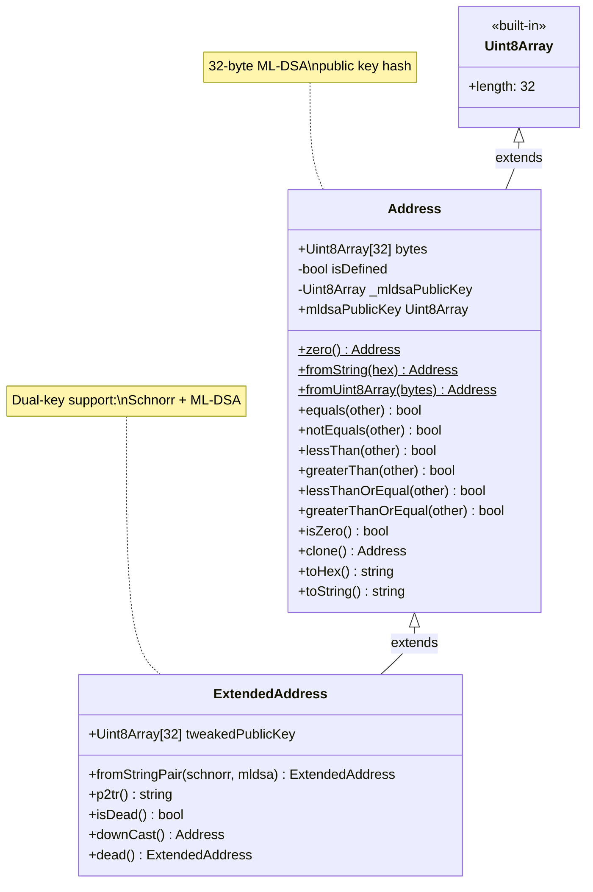
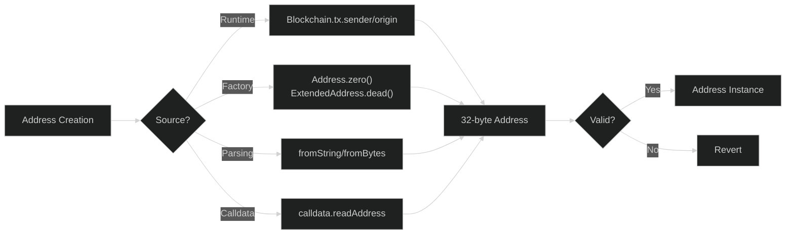
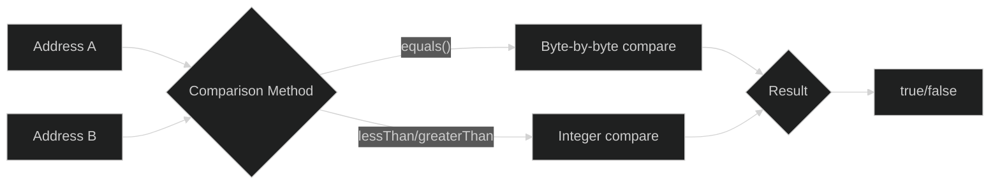
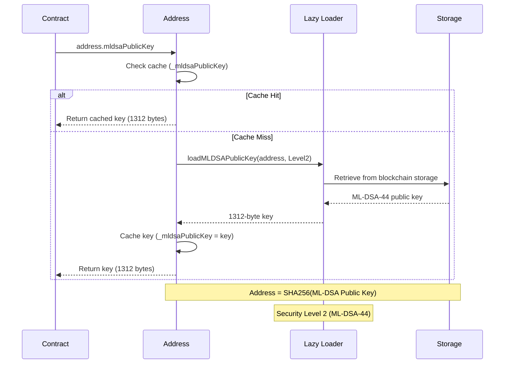
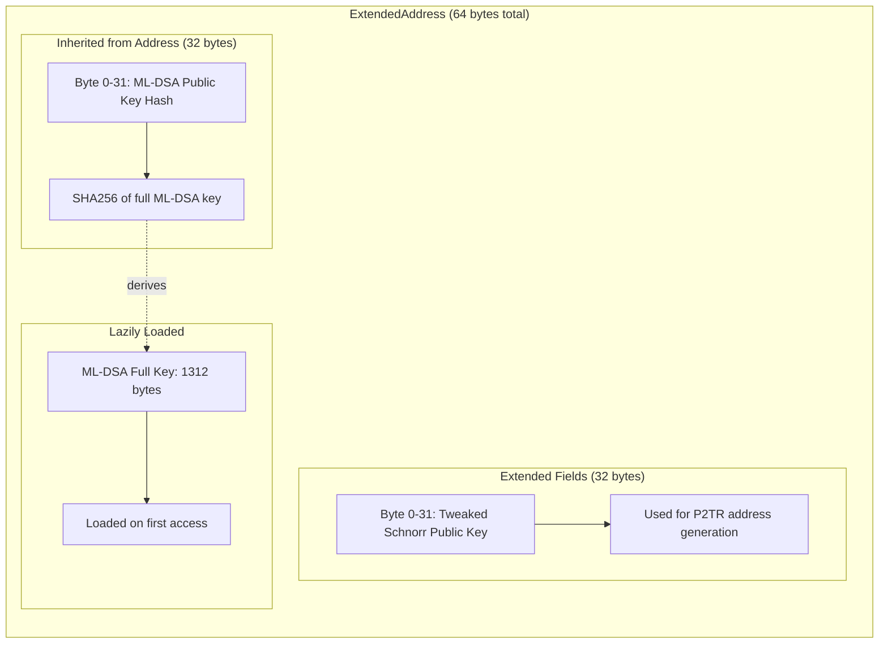

# Address Type

The `Address` type represents a 32-byte Bitcoin/OPNet address. It provides methods for creating, comparing, and serializing addresses.

## Overview

```typescript
import { Address, Blockchain } from '@btc-vision/btc-runtime/runtime';

// Get current sender
const sender: Address = Blockchain.tx.sender;

// Create zero address
const zero: Address = Address.zero();

// Compare addresses
if (sender.equals(zero)) {
    throw new Revert('Invalid sender');
}
```

### Address Type Architecture



## Creating Addresses

### Address Creation Flow



### From Runtime

```typescript
// Current transaction sender
const sender: Address = Blockchain.tx.sender;

// Original transaction signer
const origin: Address = Blockchain.tx.origin;

// This contract's address
const self: Address = Blockchain.contract.address;

// Contract deployer
const deployer: Address = Blockchain.contract.deployer;
```

### Special Addresses

```typescript
// Zero address (all zeros)
const zero: Address = Address.zero();
// Equivalent to address(0) in Solidity

// Note: For dead/burn addresses, use ExtendedAddress.dead()
// See ExtendedAddress section below
```

### From Bytes

```typescript
// From Uint8Array (32 bytes) - uses efficient memory copy
const bytes = new Uint8Array(32);
bytes[31] = 0x01;
const addr = Address.fromUint8Array(bytes);

// From u8[] array (32 bytes)
const byteArray: u8[] = new Array<u8>(32);
byteArray[31] = 0x01;
const addr2 = new Address(byteArray);

// From hex string
const addr3 = Address.fromString('0x' + '00'.repeat(32));
```

### From Calldata

```typescript
public myMethod(calldata: Calldata): BytesWriter {
    // Read address from calldata (32 bytes)
    const recipient: Address = calldata.readAddress();

    // ...
}
```

## Comparing Addresses

### Address Comparison Methods



### Equality

```typescript
const addr1 = Blockchain.tx.sender;
const addr2 = Blockchain.tx.origin;

// Using equals()
if (addr1.equals(addr2)) {
    // Same address
}

// Using == operator
if (addr1 == addr2) {
    // Same address
}

// Not equal
if (!addr1.equals(Address.zero())) {
    // Not zero address
}
```

### Common Checks

```typescript
// Check for zero address
private validateAddress(addr: Address): void {
    if (addr.equals(Address.zero())) {
        throw new Revert('Cannot be zero address');
    }
}

// Check if sender is deployer
private onlyDeployer(): void {
    if (!Blockchain.tx.sender.equals(Blockchain.contract.deployer)) {
        throw new Revert('Not deployer');
    }
}

// Check if two addresses are the same
private preventSelfTransfer(from: Address, to: Address): void {
    if (from.equals(to)) {
        throw new Revert('Cannot transfer to self');
    }
}
```

## Serialization

### To Bytes

```typescript
const addr: Address = Blockchain.tx.sender;

// Address extends Uint8Array, so it can be used directly as bytes
// Access the underlying buffer
const bytes: ArrayBuffer = addr.buffer;

// Get hex string representation
const hexString: string = addr.toHex();

// Clone the address
const cloned: Address = addr.clone();
```

### With BytesWriter

```typescript
const writer = new BytesWriter(64);

// Write address (32 bytes)
writer.writeAddress(sender);
writer.writeAddress(recipient);
```

### From BytesReader

```typescript
const reader = new BytesReader(data);

// Read address (32 bytes)
const sender: Address = reader.readAddress();
```

## Address Size

OPNet addresses are **32 bytes**, compared to Ethereum's 20 bytes:

| Platform | Address Size | Format |
|----------|-------------|--------|
| Ethereum | 20 bytes | 0x + 40 hex chars |
| OPNet | 32 bytes | 64 hex chars |

```typescript
// Full 32-byte address (Address extends Uint8Array)
const addr: Address = Blockchain.tx.sender;
assert(addr.length === 32);
```

## Storage with Addresses

### Storing Addresses

```typescript
import { StoredAddress } from '@btc-vision/btc-runtime/runtime';

// Store a single address
private ownerPointer: u16 = Blockchain.nextPointer;
private _owner: StoredAddress;

constructor() {
    super();
    this._owner = new StoredAddress(this.ownerPointer);
}

// Set/get
this._owner.value = newOwner;
const owner: Address = this._owner.value;
```

### Address Mappings

```typescript
import { AddressMemoryMap } from '@btc-vision/btc-runtime/runtime';

// mapping(address => uint256)
private balancesPointer: u16 = Blockchain.nextPointer;
private balances: AddressMemoryMap;

constructor() {
    super();
    this.balances = new AddressMemoryMap(this.balancesPointer);
}

// Usage
const balance: u256 = this.balances.get(userAddress);
this.balances.set(userAddress, newBalance);
```

## ML-DSA Public Key Access

Every `Address` in OPNet can access its ML-DSA (quantum-resistant) public key directly:

```typescript
const sender: Address = Blockchain.tx.sender;

// Get the ML-DSA public key (1312 bytes for ML-DSA-44)
const mldsaKey: Uint8Array = sender.mldsaPublicKey;

// Key is lazily loaded and cached
const sameKey: Uint8Array = sender.mldsaPublicKey;  // Returns cached key
```

### ML-DSA Key Loading Sequence



**Key points:**
- The address itself is the SHA256 hash of the ML-DSA public key
- The full public key is loaded on-demand from the blockchain
- No custom storage needed - the runtime handles this

See [Quantum Resistance](../advanced/quantum-resistance.md) for signature verification details.

## Extended Address

`ExtendedAddress` supports dual-key addresses (Schnorr + ML-DSA) for the quantum transition:

```typescript
import { ExtendedAddress } from '@btc-vision/btc-runtime/runtime';

// Create from both key components
const extAddr = ExtendedAddress.fromStringPair(
    '0x' + 'aa'.repeat(32),  // Tweaked Schnorr key (for taproot)
    '0x' + 'bb'.repeat(32)   // ML-DSA key hash
);

// Access Schnorr tweaked key (32 bytes)
const schnorrKey: Uint8Array = extAddr.tweakedPublicKey;

// Access ML-DSA public key (inherited from Address)
const mldsaKey: Uint8Array = extAddr.mldsaPublicKey;

// Generate Bitcoin P2TR address
const p2trAddress: string = extAddr.p2tr();  // "bc1p..." or "tb1p..."

// Downcast to base Address
const addr: Address = extAddr.downCast();
```

### ExtendedAddress Memory Layout



### Dead Address

The dead address is derived from the Bitcoin genesis block (block 0) public key:
- **Genesis block public key**: `04678afdb0fe5548271967f1a67130b7105cd6a828e03909a67962e0ea1f61deb649f6bc3f4cef38c4f35504e51ec112de5c384df7ba0b8d578a4c702b6bf11d5f`
- **Resulting hash**: `284ae4acdb32a99ba3ebfa66a91ddb41a7b7a1d2fef415399922cd8a04485c02`

This address is commonly used as a burn address or null recipient in contracts.

```typescript
// Dead address for burns (derived from Bitcoin block 0 pubkey)
const dead: ExtendedAddress = ExtendedAddress.dead();

// Check if address is dead
if (extAddr.isDead()) {
    // Funds are being burned
}

// Also available via Blockchain singleton
const deadAddr: ExtendedAddress = Blockchain.DEAD_ADDRESS;
```

**Note:** The `Address` base class does NOT have a `dead()` method. Only `ExtendedAddress` provides the dead address functionality.

See [Quantum Resistance](../advanced/quantum-resistance.md) for details.

## Solidity vs OPNet Comparison

### Address Type Comparison Table

| Feature | Solidity | OPNet |
|---------|----------|-------|
| **Type name** | `address` | `Address` |
| **Size** | 20 bytes (160 bits) | 32 bytes (256 bits) |
| **Format** | `0x` + 40 hex chars | 64 hex chars |
| **Zero address** | `address(0)` | `Address.zero()` |
| **Dead/burn address** | `0x000...dEaD` | `ExtendedAddress.dead()` (Bitcoin block 0 pubkey hash) |
| **Payable variant** | `address payable` | N/A (different model) |
| **Current sender** | `msg.sender` | `Blockchain.tx.sender` |
| **Original signer** | `tx.origin` | `Blockchain.tx.origin` |
| **Contract address** | `address(this)` | `Blockchain.contract.address` |
| **Deployer** | N/A (use constructor arg) | `Blockchain.contract.deployer` |
| **Equality check** | `addr1 == addr2` | `addr1.equals(addr2)` |
| **Zero check** | `addr == address(0)` | `addr.isZero()` or `addr.equals(Address.zero())` |
| **From bytes** | `address(bytes20(data))` | `Address.fromUint8Array(data)` |
| **To bytes** | `abi.encodePacked(addr)` | `addr` (extends Uint8Array) |
| **Checksum** | EIP-55 mixed-case | N/A |
| **Quantum-resistant key** | N/A | `addr.mldsaPublicKey` (1312 bytes) |

### Side-by-Side Code Examples

#### Getting Addresses

```solidity
// Solidity
address sender = msg.sender;
address origin = tx.origin;
address self = address(this);
```

```typescript
// OPNet
const sender: Address = Blockchain.tx.sender;
const origin: Address = Blockchain.tx.origin;
const self: Address = Blockchain.contract.address;
```

#### Zero Address Checks

```solidity
// Solidity
require(to != address(0), "Cannot send to zero address");
```

```typescript
// OPNet
if (to.equals(Address.zero())) {
    throw new Revert('Cannot send to zero address');
}
// Or using isZero()
if (to.isZero()) {
    throw new Revert('Cannot send to zero address');
}
```

#### Address Comparison

```solidity
// Solidity
require(msg.sender == owner, "Not owner");
require(from != to, "Cannot transfer to self");
```

```typescript
// OPNet
if (!Blockchain.tx.sender.equals(owner)) {
    throw new Revert('Not owner');
}
if (from.equals(to)) {
    throw new Revert('Cannot transfer to self');
}
```

#### Storing Owner Address

```solidity
// Solidity
address public owner;

constructor() {
    owner = msg.sender;
}

modifier onlyOwner() {
    require(msg.sender == owner, "Not owner");
    _;
}

function transferOwnership(address newOwner) public onlyOwner {
    require(newOwner != address(0), "Invalid address");
    owner = newOwner;
}
```

```typescript
// OPNet
private ownerPointer: u16 = Blockchain.nextPointer;
private _owner: StoredAddress;

constructor() {
    super();
    this._owner = new StoredAddress(this.ownerPointer);
}

public override onDeployment(_calldata: Calldata): void {
    this._owner.value = Blockchain.tx.origin;
}

private onlyOwner(): void {
    if (!Blockchain.tx.sender.equals(this._owner.value)) {
        throw new Revert('Not owner');
    }
}

public transferOwnership(calldata: Calldata): BytesWriter {
    this.onlyOwner();
    const newOwner = calldata.readAddress();
    if (newOwner.equals(Address.zero())) {
        throw new Revert('Invalid address');
    }
    this._owner.value = newOwner;
    return new BytesWriter(0);
}
```

#### Balance Mappings

```solidity
// Solidity
mapping(address => uint256) public balances;

function balanceOf(address account) public view returns (uint256) {
    return balances[account];
}
```

```typescript
// OPNet
private balancesPointer: u16 = Blockchain.nextPointer;
private balances: AddressMemoryMap;

constructor() {
    super();
    this.balances = new AddressMemoryMap(this.balancesPointer);
}

public balanceOf(calldata: Calldata): BytesWriter {
    const account = calldata.readAddress();
    const balance: u256 = this.balances.get(account);

    const writer = new BytesWriter(32);
    writer.writeU256(balance);
    return writer;
}
```

#### Sending Value (Key Difference)

```solidity
// Solidity - Native ETH transfers
address payable recipient = payable(to);
recipient.transfer(amount);          // Reverts on failure
bool success = recipient.send(amount); // Returns false on failure
(bool ok, ) = recipient.call{value: amount}(""); // Low-level call
```

```typescript
// OPNet - No native value transfers on addresses
// Bitcoin UTXO model is fundamentally different
// Token transfers are done via contract calls instead:
this._transfer(from, to, amount);  // Internal token transfer logic
```

### Key Differences Explained

| Aspect | Solidity/Ethereum | OPNet/Bitcoin |
|--------|-------------------|---------------|
| **Address derivation** | Keccak256 hash of public key (last 20 bytes) | SHA256 of ML-DSA public key (32 bytes) |
| **Native currency** | ETH handled via `payable` | Bitcoin UTXOs handled separately |
| **Transfer mechanism** | `addr.transfer()`, `addr.send()`, `addr.call()` | Contract method calls only |
| **Balance query** | `addr.balance` (native ETH) | N/A for native; use contract mappings for tokens |
| **Code size** | `addr.code.length` | N/A |
| **Code hash** | `addr.codehash` | N/A |
| **Quantum resistance** | None | ML-DSA public key accessible via `mldsaPublicKey` |

## Common Patterns

### Transfer Validation

```typescript
public transfer(calldata: Calldata): BytesWriter {
    const to = calldata.readAddress();
    const amount = calldata.readU256();

    // Validate recipient
    if (to.equals(Address.zero())) {
        throw new Revert('Cannot transfer to zero address');
    }

    // Prevent self-transfer (optional)
    if (to.equals(Blockchain.tx.sender)) {
        throw new Revert('Cannot transfer to self');
    }

    // ... execute transfer
}
```

### Access Control

```typescript
// Store owner/admin
private ownerPointer: u16 = Blockchain.nextPointer;
private _owner: StoredAddress;

constructor() {
    super();
    this._owner = new StoredAddress(this.ownerPointer);
}

public override onDeployment(calldata: Calldata): void {
    this._owner.value = Blockchain.tx.origin;
}

private onlyOwner(): void {
    if (!Blockchain.tx.sender.equals(this._owner.value)) {
        throw new Revert('Not owner');
    }
}

public transferOwnership(calldata: Calldata): BytesWriter {
    this.onlyOwner();

    const newOwner = calldata.readAddress();
    if (newOwner.equals(Address.zero())) {
        throw new Revert('New owner is zero address');
    }

    this._owner.value = newOwner;
    return new BytesWriter(0);
}
```

### Address as Map Key

```typescript
// Using address as map key
private userDataPointer: u16 = Blockchain.nextPointer;
private userData: AddressMemoryMap;

constructor() {
    super();
    this.userData = new AddressMemoryMap(this.userDataPointer);
}

// Store data by address
public setUserData(calldata: Calldata): BytesWriter {
    const data = calldata.readU256();
    this.userData.set(Blockchain.tx.sender, data);
    return new BytesWriter(0);
}

// Get data by address
public getUserData(calldata: Calldata): BytesWriter {
    const user = calldata.readAddress();
    const data: u256 = this.userData.get(user);

    const writer = new BytesWriter(32);
    writer.writeU256(data);
    return writer;
}
```

## API Reference

### Static Methods

| Method | Returns | Description |
|--------|---------|-------------|
| `Address.zero()` | `Address` | All-zero address (cloned from constant) |
| `Address.fromString(hex)` | `Address` | Create from hex string (with or without 0x prefix) |
| `Address.fromUint8Array(bytes)` | `Address` | Create from Uint8Array using direct memory copy |

### Instance Methods

| Method | Returns | Description |
|--------|---------|-------------|
| `equals(other)` | `bool` | Compare addresses (operator `==`) |
| `notEquals(other)` | `bool` | Check inequality (operator `!=`) |
| `lessThan(other)` | `bool` | Compare as big-endian integers (operator `<`) |
| `greaterThan(other)` | `bool` | Compare as big-endian integers (operator `>`) |
| `lessThanOrEqual(other)` | `bool` | Compare addresses (operator `<=`) |
| `greaterThanOrEqual(other)` | `bool` | Compare addresses (operator `>=`) |
| `isZero()` | `bool` | Check if zero address |
| `clone()` | `Address` | Create a deep copy |
| `toHex()` | `string` | Convert to hex string (no 0x prefix) |
| `toString()` | `string` | Same as toHex() |

### Instance Properties

| Property | Type | Description |
|----------|------|-------------|
| `mldsaPublicKey` | `Uint8Array` | ML-DSA public key (lazily loaded, 1312 bytes) |

### ExtendedAddress Static Methods

| Method | Returns | Description |
|--------|---------|-------------|
| `ExtendedAddress.dead()` | `ExtendedAddress` | Bitcoin block 0 pubkey-derived burn address |
| `ExtendedAddress.zero()` | `ExtendedAddress` | All-zero address (cloned from constant) |
| `ExtendedAddress.fromStringPair(schnorr, mldsa)` | `ExtendedAddress` | Create from two hex strings |
| `ExtendedAddress.fromUint8Array(bytes)` | `ExtendedAddress` | Create from 64-byte array |
| `ExtendedAddress.toCSV(address, blocks)` | `string` | Generate CSV timelocked P2WSH address |
| `ExtendedAddress.p2wpkh(address)` | `string` | Generate P2WPKH address |

### ExtendedAddress Instance Methods

| Method | Returns | Description |
|--------|---------|-------------|
| `p2tr()` | `string` | Generate P2TR (taproot) address |
| `isDead()` | `bool` | Check if this is the dead address |
| `isZero()` | `bool` | Check if ML-DSA key hash is all zeros |
| `downCast()` | `Address` | Cast to base Address type |
| `clone()` | `ExtendedAddress` | Create a deep copy |
| `toString()` | `string` | Returns P2TR address (overrides base) |

### ExtendedAddress Properties

| Property | Type | Description |
|----------|------|-------------|
| `tweakedPublicKey` | `Uint8Array` | Schnorr tweaked key (32 bytes) |
| `mldsaPublicKey` | `Uint8Array` | ML-DSA public key (inherited, 1312 bytes) |

---

**Navigation:**
- Previous: [ReentrancyGuard](../contracts/reentrancy-guard.md)
- Next: [SafeMath](./safe-math.md)
