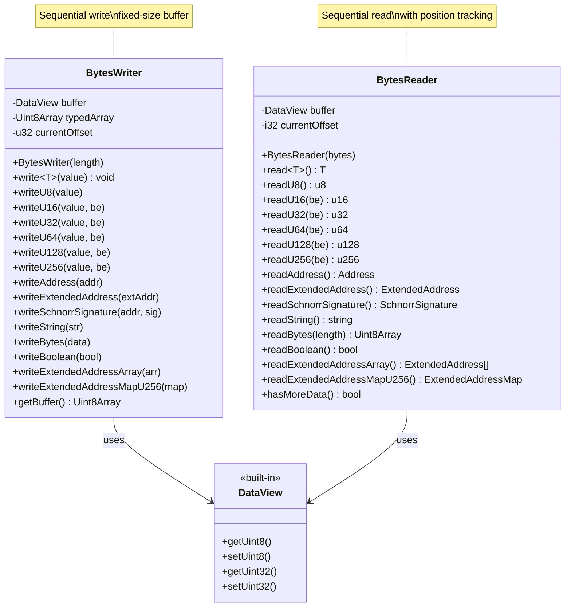
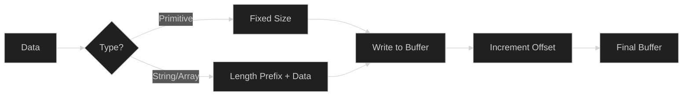
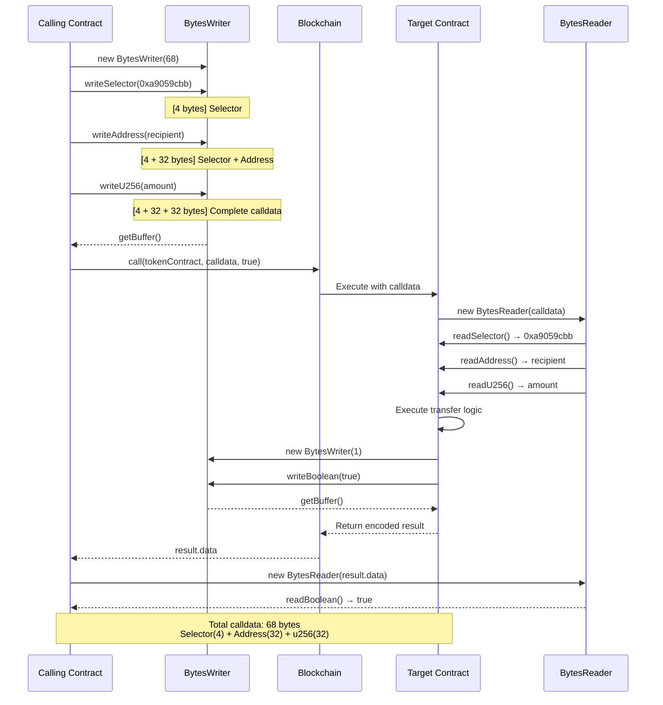
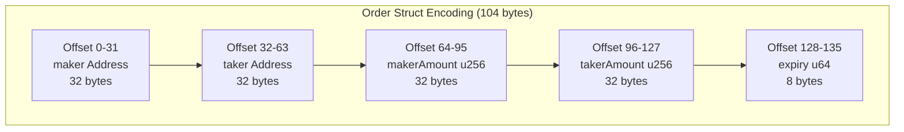

# BytesWriter and BytesReader

`BytesWriter` and `BytesReader` handle binary serialization and deserialization. They're used for encoding return values, event data, and cross-contract communication.

## BytesWriter

### Overview

```typescript
import { BytesWriter, Address } from '@btc-vision/btc-runtime/runtime';
import { u256 } from '@btc-vision/as-bignum/assembly';

// Create writer with initial capacity
const writer = new BytesWriter(64);

// Write data
writer.writeAddress(recipient);
writer.writeU256(amount);
writer.writeBoolean(true);

// Get encoded bytes
const data: Uint8Array = writer.getBuffer();
```

### BytesWriter/Reader Architecture



### Creating a BytesWriter

```typescript
// With initial capacity (recommended - buffer does NOT auto-grow)
const writer = new BytesWriter(128);

// Note: Buffer does NOT grow dynamically - will throw Revert if exceeded
// Always pre-calculate required size or use generous initial capacity
```

### Writing Primitives

```typescript
// Boolean
writer.writeBoolean(true);   // 1 byte

// Unsigned integers
writer.writeU8(255);         // 1 byte
writer.writeU16(65535);      // 2 bytes
writer.writeU32(4294967295); // 4 bytes
writer.writeU64(value);      // 8 bytes
writer.writeU128(value);     // 16 bytes
writer.writeU256(value);     // 32 bytes

// Signed integers
writer.writeI8(-128);
writer.writeI16(-32768);
writer.writeI32(-2147483648);
writer.writeI64(value);
```

### Writing Complex Types

```typescript
// Address (32 bytes)
writer.writeAddress(address);

// ExtendedAddress (64 bytes: 32 tweaked key + 32 ML-DSA key hash)
writer.writeExtendedAddress(extendedAddress);

// Schnorr signature with signer address (128 bytes total)
writer.writeSchnorrSignature(signerAddress, signature);

// String without length prefix
writer.writeString('Hello, World!');

// String with u32 length prefix
writer.writeStringWithLength('Hello, World!');

// Bytes without length prefix
writer.writeBytes(data);

// Bytes with u32 length prefix
writer.writeBytesWithLength(data);

// Selector (4 bytes, big-endian)
writer.writeSelector(selector);
```

### Generic Write Method

The `write<T>()` method automatically selects the correct write method based on the type:

```typescript
// Automatically dispatches to the correct write method
writer.write<u64>(12345);                    // writeU64
writer.write<u256>(amount);                  // writeU256
writer.write<bool>(true);                    // writeBoolean
writer.write<Address>(addr);                 // writeAddress
writer.write<ExtendedAddress>(extAddr);      // writeExtendedAddress
writer.write<string>('hello');               // writeStringWithLength

// Supported types:
// - Primitives: bool, u8, u16, u32, u64, i8, i16, i32, i64
// - Big numbers: u128, u256, i128
// - Complex: Address, ExtendedAddress, Selector, string, Uint8Array
```

### Writing Arrays

All array methods use a u16 length prefix (max 65535 elements):

```typescript
// Address array (u16 length prefix + addresses)
writer.writeAddressArray(addresses);

// ExtendedAddress array (u16 length prefix + 64-byte addresses)
writer.writeExtendedAddressArray(extendedAddresses);

// Numeric arrays (u16 length prefix + values)
writer.writeU8Array(u8Values);
writer.writeU16Array(u16Values);
writer.writeU32Array(u32Values);
writer.writeU64Array(u64Values);
writer.writeU128Array(u128Values);
writer.writeU256Array(u256Values);

// Array of variable-length buffers (u16 count, then u32 length + data for each)
writer.writeArrayOfBuffer(buffers);

// AddressMap<u256> (u16 count, then address + u256 pairs)
writer.writeAddressMapU256(addressMap);

// ExtendedAddressMap<u256> (u16 count, then 64-byte address + u256 pairs)
writer.writeExtendedAddressMapU256(extendedAddressMap);
```

### Getting Results

```typescript
// Get the full buffer
const buffer: Uint8Array = writer.getBuffer();

// Get current write offset (bytes written so far)
const offset: u32 = writer.getOffset();

// Get total buffer capacity
const capacity: u32 = writer.bufferLength();

// Convert to BytesReader for reading
const reader: BytesReader = writer.toBytesReader();
```

## BytesReader

### Overview

```typescript
import { BytesReader, Address } from '@btc-vision/btc-runtime/runtime';
import { u256 } from '@btc-vision/as-bignum/assembly';

// Create reader from buffer
const reader = new BytesReader(data);

// Read data in same order it was written
const recipient: Address = reader.readAddress();
const amount: u256 = reader.readU256();
const flag: bool = reader.readBoolean();
```

### Creating a BytesReader

```typescript
// From Uint8Array
const reader = new BytesReader(buffer);

// From BytesWriter
const reader = writer.toBytesReader();
```

### Reading Primitives

```typescript
// Boolean
const flag: bool = reader.readBoolean();

// Unsigned integers
const u8val: u8 = reader.readU8();
const u16val: u16 = reader.readU16();
const u32val: u32 = reader.readU32();
const u64val: u64 = reader.readU64();
const u128val: u128 = reader.readU128();
const u256val: u256 = reader.readU256();

// Signed integers
const i8val: i8 = reader.readI8();
const i16val: i16 = reader.readI16();
const i32val: i32 = reader.readI32();
const i64val: i64 = reader.readI64();
```

### Reading Complex Types

```typescript
// Address (32 bytes)
const addr: Address = reader.readAddress();

// ExtendedAddress (64 bytes: 32 tweaked key + 32 ML-DSA key hash)
const extAddr: ExtendedAddress = reader.readExtendedAddress();

// Schnorr signature with signer address (128 bytes)
const schnorrSig: SchnorrSignature = reader.readSchnorrSignature();
const signer: ExtendedAddress = schnorrSig.address;
const signature: Uint8Array = schnorrSig.signature;

// String with known length (bytes read, zeroStop = true)
const name: string = reader.readString(32);  // reads up to 32 bytes, stops at null

// String with u32 length prefix
const name2: string = reader.readStringWithLength();

// Bytes with known length
const data: Uint8Array = reader.readBytes(64);

// Bytes with u32 length prefix
const data2: Uint8Array = reader.readBytesWithLength();

// Selector (4 bytes, big-endian)
const selector: Selector = reader.readSelector();
```

### Generic Read Method

The `read<T>()` method automatically selects the correct read method based on the type:

```typescript
// Automatically dispatches to the correct read method
const num: u64 = reader.read<u64>();              // readU64
const amount: u256 = reader.read<u256>();         // readU256
const flag: bool = reader.read<bool>();           // readBoolean
const addr: Address = reader.read<Address>();     // readAddress
const extAddr: ExtendedAddress = reader.read<ExtendedAddress>();  // readExtendedAddress
const text: string = reader.read<string>();       // readStringWithLength

// Supported types:
// - Primitives: bool, u8, u16, u32, u64, i8, i16, i32, i64
// - Big numbers: u128, u256, i128
// - Complex: Address, ExtendedAddress, Selector, string
```

### Reading Arrays

All array methods expect a u16 length prefix:

```typescript
// Address array
const addresses: Address[] = reader.readAddressArray();

// ExtendedAddress array (64 bytes each)
const extAddresses: ExtendedAddress[] = reader.readExtendedAddressArray();

// Numeric arrays
const u8Values: u8[] = reader.readU8Array();
const u16Values: u16[] = reader.readU16Array();
const u32Values: u32[] = reader.readU32Array();
const u64Values: u64[] = reader.readU64Array();
const u128Values: u128[] = reader.readU128Array();
const u256Values: u256[] = reader.readU256Array();

// Array of variable-length buffers
const buffers: Uint8Array[] = reader.readArrayOfBuffer();

// AddressMap<u256>
const addressMap: AddressMap<u256> = reader.readAddressMapU256();

// ExtendedAddressMap<u256> (64-byte addresses as keys)
const extAddressMap: ExtendedAddressMap<u256> = reader.readExtendedAddressMapU256();
```

### Position Management

```typescript
// Get current read offset
const offset: i32 = reader.getOffset();

// Set read position (must be within buffer bounds)
reader.setOffset(32);

// Get total buffer length
const total: i32 = reader.byteLength;

// Verify enough bytes remain for next read
reader.verifyEnd(offset + 32);  // Throws Revert if not enough bytes
```

## Data Format

### Encoding Summary

| Type | Size | Format |
|------|------|--------|
| `bool` | 1 | 0 or 1 |
| `u8`/`i8` | 1 | Raw byte |
| `u16`/`i16` | 2 | Big-endian (default) |
| `u32`/`i32` | 4 | Big-endian (default) |
| `u64`/`i64` | 8 | Big-endian (default) |
| `u128`/`i128` | 16 | Big-endian (default) |
| `u256` | 32 | Big-endian (default) |
| `Address` | 32 | Raw bytes |
| `ExtendedAddress` | 64 | 32 bytes tweaked key + 32 bytes ML-DSA key hash |
| `SchnorrSignature` | 128 | 64 bytes ExtendedAddress + 64 bytes signature |
| `Selector` | 4 | Big-endian (u32) |
| `string` | 4 + n | Length prefix (u32 BE) + UTF-8 |
| `bytes` | 4 + n | Length prefix (u32 BE) + raw |
| `arrays` | 2 + n | Length prefix (u16 BE) + elements |

**Note:** All multi-byte integers default to big-endian. Pass `be = false` for little-endian:
```typescript
writer.writeU32(value, false);  // Little-endian
reader.readU32(false);          // Little-endian
```

### Data Encoding Flow



### String Encoding Example

```
"Hello" encoded:
| 05 00 00 00 | 48 65 6c 6c 6f |
| length=5    | "Hello" UTF-8  |
```

### Array Encoding Example

```
[1, 2, 3] as u256 encoded:
| 03 00 00 00 | 01 00...00 | 02 00...00 | 03 00...00 |
| length=3    | 1 (32 bytes)| 2 (32 bytes)| 3 (32 bytes)|
```

## Common Patterns

### Return Values

```typescript
// Simple return
public getValue(_calldata: Calldata): BytesWriter {
    const writer = new BytesWriter(32);
    writer.writeU256(this._value.value);
    return writer;
}

// Multiple return values
public getState(_calldata: Calldata): BytesWriter {
    const writer = new BytesWriter(96);
    writer.writeU256(this._value1.value);
    writer.writeU256(this._value2.value);
    writer.writeAddress(this._owner.value);
    return writer;
}

// No return
public setState(calldata: Calldata): BytesWriter {
    // ... do work ...
    return new BytesWriter(0);  // Empty response
}
```

### Event Encoding

```typescript
export class SwapEvent extends NetEvent {
    constructor(
        public readonly user: Address,
        public readonly tokenIn: Address,
        public readonly tokenOut: Address,
        public readonly amountIn: u256,
        public readonly amountOut: u256
    ) {
        super('Swap');
    }

    protected override encodeData(writer: BytesWriter): void {
        writer.writeAddress(this.user);
        writer.writeAddress(this.tokenIn);
        writer.writeAddress(this.tokenOut);
        writer.writeU256(this.amountIn);
        writer.writeU256(this.amountOut);
    }
}
```

### Cross-Contract Call Data

```typescript
// Define method selectors (sha256 first 4 bytes of method signature)
const TRANSFER_SELECTOR: u32 = 0xa9059cbb;  // transfer(address,uint256)

// Encode call to another contract
private encodeTransfer(to: Address, amount: u256): Uint8Array {
    const writer = new BytesWriter(68);
    writer.writeSelector(TRANSFER_SELECTOR);
    writer.writeAddress(to);
    writer.writeU256(amount);
    return writer.getBuffer();
}

// Make the call
const calldata = this.encodeTransfer(recipient, tokenAmount);
const result = Blockchain.call(tokenContract, calldata, true);

// Decode result
if (result.success) {
    const reader = new BytesReader(result.data);
    const success: bool = reader.readBoolean();
}
```

### Cross-Contract Call Sequence



### Struct-like Encoding

```typescript
// Define a struct-like type
class Order {
    maker: Address;
    taker: Address;
    makerAmount: u256;
    takerAmount: u256;
    expiry: u64;
}

// Encode a "struct"
private encodeOrder(
    maker: Address,
    taker: Address,
    makerAmount: u256,
    takerAmount: u256,
    expiry: u64
): Uint8Array {
    const writer = new BytesWriter(104);
    writer.writeAddress(maker);
    writer.writeAddress(taker);
    writer.writeU256(makerAmount);
    writer.writeU256(takerAmount);
    writer.writeU64(expiry);
    return writer.getBuffer();
}

// Decode a "struct"
private decodeOrder(data: Uint8Array): Order {
    const reader = new BytesReader(data);
    const order = new Order();
    order.maker = reader.readAddress();
    order.taker = reader.readAddress();
    order.makerAmount = reader.readU256();
    order.takerAmount = reader.readU256();
    order.expiry = reader.readU64();
    return order;
}
```

### Struct Encoding Memory Layout



## Size Limits

### Array Limits

Maximum array length: **65,535 elements**

```typescript
// Writing large arrays
if (items.length > 65535) {
    throw new Revert('Array too large');
}
writer.writeU256Array(items);
```

### Event Size Limit

Maximum event data: **352 bytes**

```typescript
protected override encodeData(writer: BytesWriter): void {
    // Calculate total size
    // 32 + 32 + 32 + 32 + 8 = 136 bytes - OK
    writer.writeAddress(this.addr1);     // 32
    writer.writeAddress(this.addr2);     // 32
    writer.writeU256(this.amount1);      // 32
    writer.writeU256(this.amount2);      // 32
    writer.writeU64(this.timestamp);     // 8
}
```

## Solidity vs OPNet Comparison

### Encoding/Decoding Comparison Table

| Feature | Solidity | OPNet |
|---------|----------|-------|
| **Encode function** | `abi.encode(...)` | `BytesWriter` methods |
| **Decode function** | `abi.decode(data, (types))` | `BytesReader` methods |
| **Packed encoding** | `abi.encodePacked(...)` | Default behavior (no padding) |
| **Encode with selector** | `abi.encodeWithSelector(sel, ...)` | `writer.writeSelector(sel); writer.write...()` |
| **Encode with signature** | `abi.encodeWithSignature(sig, ...)` | Manual selector + params |
| **Byte order** | Big-endian | Big-endian (default) |
| **Padding** | 32-byte aligned | No padding (native sizes) |
| **Return encoding** | Automatic | Manual via BytesWriter |

### Type Encoding Comparison

| Solidity Encoding | OPNet Encoding |
|-------------------|----------------|
| `abi.encode(uint256)` | `writer.writeU256(value)` |
| `abi.encode(uint128)` | `writer.writeU128(value)` |
| `abi.encode(uint64)` | `writer.writeU64(value)` |
| `abi.encode(uint32)` | `writer.writeU32(value)` |
| `abi.encode(uint16)` | `writer.writeU16(value)` |
| `abi.encode(uint8)` | `writer.writeU8(value)` |
| `abi.encode(bool)` | `writer.writeBoolean(value)` |
| `abi.encode(address)` | `writer.writeAddress(addr)` |
| `abi.encode(bytes32)` | `writer.writeBytes(data)` |
| `abi.encode(string)` | `writer.writeString(str)` |
| `abi.encode(bytes)` | `writer.writeBytes(data)` |
| `abi.encode(address[])` | `writer.writeAddressArray(addrs)` |
| `abi.encode(uint256[])` | `writer.writeU256Array(values)` |

### Side-by-Side Code Examples

#### Basic Encoding

```solidity
// Solidity
bytes memory data = abi.encode(recipient, amount);
bytes memory packed = abi.encodePacked(recipient, amount);
```

```typescript
// OPNet
const writer = new BytesWriter(64);  // 32 + 32 bytes
writer.writeAddress(recipient);
writer.writeU256(amount);
const data: Uint8Array = writer.getBuffer();
// OPNet encoding is similar to encodePacked (no padding)
```

#### Basic Decoding

```solidity
// Solidity
(address to, uint256 amount) = abi.decode(data, (address, uint256));
```

```typescript
// OPNet
const reader = new BytesReader(data);
const to: Address = reader.readAddress();
const amount: u256 = reader.readU256();
```

#### Encoding Multiple Values

```solidity
// Solidity
function encodeTransferData(
    address from,
    address to,
    uint256 amount,
    string memory memo
) public pure returns (bytes memory) {
    return abi.encode(from, to, amount, memo);
}
```

```typescript
// OPNet
function encodeTransferData(
    from: Address,
    to: Address,
    amount: u256,
    memo: string
): Uint8Array {
    // Calculate size: 32 + 32 + 32 + (4 + memo.length)
    const writer = new BytesWriter(100 + memo.length);
    writer.writeAddress(from);
    writer.writeAddress(to);
    writer.writeU256(amount);
    writer.writeString(memo);
    return writer.getBuffer();
}
```

#### Encoding with Function Selector

```solidity
// Solidity
bytes4 selector = bytes4(keccak256("transfer(address,uint256)"));
bytes memory callData = abi.encodeWithSelector(selector, to, amount);
// Or
bytes memory callData = abi.encodeWithSignature("transfer(address,uint256)", to, amount);
```

```typescript
// OPNet
const TRANSFER_SELECTOR: Selector = Selector.from("transfer(address,uint256)");
const writer = new BytesWriter(68);  // 4 + 32 + 32
writer.writeSelector(TRANSFER_SELECTOR);
writer.writeAddress(to);
writer.writeU256(amount);
const callData: Uint8Array = writer.getBuffer();
```

#### Return Value Encoding

```solidity
// Solidity - Automatic return encoding
function getInfo() public view returns (address, uint256, bool) {
    return (owner, balance, isActive);
}

// ABI automatically encodes the return tuple
```

```typescript
// OPNet - Manual return encoding
public getInfo(_calldata: Calldata): BytesWriter {
    const writer = new BytesWriter(65);  // 32 + 32 + 1
    writer.writeAddress(this._owner.value);
    writer.writeU256(this._balance.value);
    writer.writeBoolean(this._isActive.value);
    return writer;
}
```

#### Decoding Return Values

```solidity
// Solidity
(bool success, bytes memory returnData) = target.call(callData);
if (success) {
    (address addr, uint256 amount) = abi.decode(returnData, (address, uint256));
}
```

```typescript
// OPNet
const result = Blockchain.call(target, callData, true);
if (result.success) {
    const reader = new BytesReader(result.data);
    const addr: Address = reader.readAddress();
    const amount: u256 = reader.readU256();
}
```

#### Encoding Structs

```solidity
// Solidity
struct Order {
    address maker;
    address taker;
    uint256 makerAmount;
    uint256 takerAmount;
    uint64 expiry;
}

function encodeOrder(Order memory order) public pure returns (bytes memory) {
    return abi.encode(order.maker, order.taker, order.makerAmount, order.takerAmount, order.expiry);
}
```

```typescript
// OPNet
class Order {
    maker: Address;
    taker: Address;
    makerAmount: u256;
    takerAmount: u256;
    expiry: u64;
}

function encodeOrder(order: Order): Uint8Array {
    const writer = new BytesWriter(136);  // 32+32+32+32+8
    writer.writeAddress(order.maker);
    writer.writeAddress(order.taker);
    writer.writeU256(order.makerAmount);
    writer.writeU256(order.takerAmount);
    writer.writeU64(order.expiry);
    return writer.getBuffer();
}
```

#### Event Data Encoding

```solidity
// Solidity - Events are indexed/non-indexed
event Transfer(address indexed from, address indexed to, uint256 amount);

function _transfer(address from, address to, uint256 amount) internal {
    // ... transfer logic
    emit Transfer(from, to, amount);  // Automatic encoding
}
```

```typescript
// OPNet - Custom event class with manual encoding
export class TransferEvent extends NetEvent {
    constructor(
        public readonly from: Address,
        public readonly to: Address,
        public readonly amount: u256
    ) {
        super('Transfer');
    }

    protected override encodeData(writer: BytesWriter): void {
        writer.writeAddress(this.from);
        writer.writeAddress(this.to);
        writer.writeU256(this.amount);
    }
}

// Usage
this.emitEvent(new TransferEvent(from, to, amount));
```

#### Low-Level Bytes Manipulation

```solidity
// Solidity
function extractSelector(bytes calldata data) public pure returns (bytes4) {
    return bytes4(data[:4]);
}

function extractAddress(bytes calldata data, uint offset) public pure returns (address) {
    return abi.decode(data[offset:offset+32], (address));
}
```

```typescript
// OPNet
function extractSelector(data: Uint8Array): Selector {
    const reader = new BytesReader(data);
    return reader.readSelector();
}

function extractAddress(data: Uint8Array, offset: u32): Address {
    const reader = new BytesReader(data);
    // Skip to offset by reading and discarding bytes
    for (let i: u32 = 0; i < offset; i++) {
        reader.readU8();
    }
    return reader.readAddress();
}
```

### Size Comparison (Encoding Overhead)

| Data | Solidity abi.encode | Solidity encodePacked | OPNet |
|------|---------------------|----------------------|-------|
| `bool` | 32 bytes | 1 byte | 1 byte |
| `uint8` | 32 bytes | 1 byte | 1 byte |
| `uint16` | 32 bytes | 2 bytes | 2 bytes |
| `uint32` | 32 bytes | 4 bytes | 4 bytes |
| `uint64` | 32 bytes | 8 bytes | 8 bytes |
| `uint128` | 32 bytes | 16 bytes | 16 bytes |
| `uint256` | 32 bytes | 32 bytes | 32 bytes |
| `address` | 32 bytes | 20 bytes | 32 bytes |
| `(addr, u256, bool)` | 96 bytes | 53 bytes | 65 bytes |

### Key Differences Summary

| Aspect | Solidity | OPNet |
|--------|----------|-------|
| **Encoding approach** | `abi.encode()` function | BytesWriter object methods |
| **Decoding approach** | `abi.decode()` with type tuple | BytesReader sequential reads |
| **Packed encoding** | `abi.encodePacked()` (separate) | Default (always packed) |
| **Selector encoding** | `abi.encodeWithSelector()` | `writeSelector()` + params |
| **Dynamic sizing** | Automatic | Pre-calculate or auto-grow |
| **Return values** | Automatic encoding | Manual BytesWriter construction |
| **Error on overflow** | Reverts | Reverts |
| **Endianness** | Big-endian | Big-endian (default) |

### Migration Patterns

#### From Solidity `abi.encode`

```solidity
// Solidity
bytes memory encoded = abi.encode(addr, amount, flag);
```

```typescript
// OPNet equivalent
const writer = new BytesWriter(65);  // 32 + 32 + 1
writer.writeAddress(addr);
writer.writeU256(amount);
writer.writeBoolean(flag);
const encoded = writer.getBuffer();
```

#### From Solidity `abi.decode`

```solidity
// Solidity
(address addr, uint256 amount, bool flag) = abi.decode(data, (address, uint256, bool));
```

```typescript
// OPNet equivalent
const reader = new BytesReader(data);
const addr = reader.readAddress();
const amount = reader.readU256();
const flag = reader.readBoolean();
```

#### From Solidity `abi.encodeWithSelector`

```solidity
// Solidity
bytes memory data = abi.encodeWithSelector(
    IERC20.transfer.selector,
    recipient,
    amount
);
```

```typescript
// OPNet equivalent
const TRANSFER_SELECTOR: Selector = Selector.from("transfer(address,uint256)");
const writer = new BytesWriter(68);
writer.writeSelector(TRANSFER_SELECTOR);
writer.writeAddress(recipient);
writer.writeU256(amount);
const data = writer.getBuffer();
```

## Best Practices

### 1. Pre-calculate Capacity

```typescript
// Calculate required size
const size = 32 + 32 + 4;  // address + u256 + u32
const writer = new BytesWriter(size);

// Better than growing the buffer
```

### 2. Consistent Order

```typescript
// Always read in the same order as written
// Document the order clearly

/**
 * Encoded format:
 * - to: Address (32 bytes)
 * - amount: u256 (32 bytes)
 * - data: bytes (4 + n bytes)
 */
```

### 3. Validate Before Reading

```typescript
// Check if enough data remains
if (reader.remaining < 32) {
    throw new Revert('Insufficient data');
}
const value = reader.readU256();
```

### 4. Handle Variable-Length Data Last

```typescript
// Fixed-size fields first
writer.writeAddress(addr);
writer.writeU256(amount);
writer.writeU64(timestamp);

// Variable-size fields last
writer.writeString(message);
writer.writeBytes(data);
```

---

**Navigation:**
- Previous: [Calldata](./calldata.md)
- Next: [Stored Primitives](../storage/stored-primitives.md)
