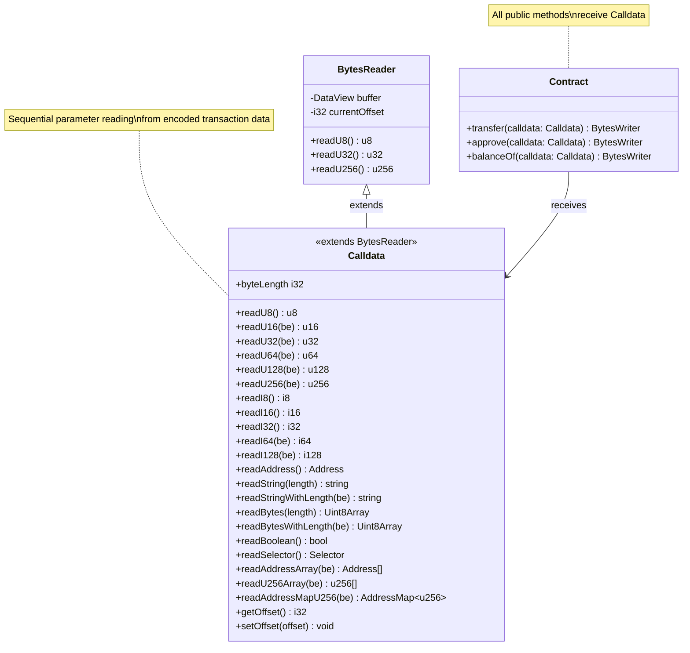
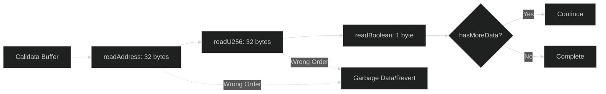
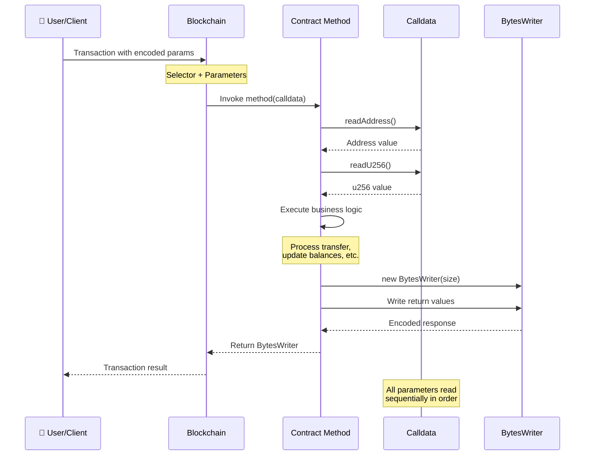

# Calldata

The `Calldata` type handles parsing of input parameters passed to contract methods. It provides methods to read various data types in sequence.

## Overview

```typescript
import { Calldata, Address, BytesWriter } from '@btc-vision/btc-runtime/runtime';
import { u256 } from '@btc-vision/as-bignum/assembly';

public transfer(calldata: Calldata): BytesWriter {
    // Read parameters in order
    const to: Address = calldata.readAddress();
    const amount: u256 = calldata.readU256();

    // ... process transfer

    return new BytesWriter(0);
}
```

### Calldata Architecture



## Reading Data

### Primitive Types

```typescript
// Boolean (1 byte)
const flag: bool = calldata.readBoolean();

// Unsigned integers
const u8val: u8 = calldata.readU8();
const u16val: u16 = calldata.readU16();
const u32val: u32 = calldata.readU32();
const u64val: u64 = calldata.readU64();
const u128val: u128 = calldata.readU128();
const u256val: u256 = calldata.readU256();

// Signed integers
const i8val: i8 = calldata.readI8();
const i16val: i16 = calldata.readI16();
const i32val: i32 = calldata.readI32();
const i64val: i64 = calldata.readI64();
```

### Complex Types

```typescript
// Address (32 bytes)
const addr: Address = calldata.readAddress();

// String with u32 length prefix
const name: string = calldata.readStringWithLength();

// String with known length (stops at null byte)
const fixedName: string = calldata.readString(32);

// Bytes with u32 length prefix
const data: Uint8Array = calldata.readBytesWithLength();

// Bytes with known length
const fixedData: Uint8Array = calldata.readBytes(64);

// Selector (4 bytes, big-endian)
const selector: Selector = calldata.readSelector();
```

### Arrays

All array methods expect a u16 length prefix (max 65535 elements):

```typescript
// Array of addresses
const addresses: Address[] = calldata.readAddressArray();

// Numeric arrays
const u8Values: u8[] = calldata.readU8Array();
const u16Values: u16[] = calldata.readU16Array();
const u32Values: u32[] = calldata.readU32Array();
const u64Values: u64[] = calldata.readU64Array();
const u128Values: u128[] = calldata.readU128Array();
const u256Values: u256[] = calldata.readU256Array();

// Array of variable-length buffers
const buffers: Uint8Array[] = calldata.readArrayOfBuffer();
```

### Maps

```typescript
// Address -> u256 mapping
const map: AddressMap<u256> = calldata.readAddressMapU256();

// Usage
const keys = map.keys();
for (let i = 0; i < keys.length; i++) {
    const address = keys[i];
    const value = map.get(address);
    // Process...
}
```

## Read Order

**IMPORTANT:** Data must be read in the exact order it was written.

```typescript
// Correct order
public myMethod(calldata: Calldata): BytesWriter {
    const address = calldata.readAddress();  // First
    const amount = calldata.readU256();       // Second
    const flag = calldata.readBoolean();      // Third
    // ...
}

// Wrong order will read garbage!
public myMethod(calldata: Calldata): BytesWriter {
    const amount = calldata.readU256();       // WRONG!
    const address = calldata.readAddress();   // WRONG!
    const flag = calldata.readBoolean();
}
```

### Sequential Read Flow



## Data Encoding

### Encoding Format

```
| Field 1 | Field 2 | Field 3 | ... |
|---------|---------|---------|-----|
```

Each field is encoded according to its type:

| Type | Encoding |
|------|----------|
| `bool` | 1 byte (0 or 1) |
| `u8` | 1 byte |
| `u16` | 2 bytes (big-endian, default) |
| `u32` | 4 bytes (big-endian, default) |
| `u64` | 8 bytes (big-endian, default) |
| `u128` | 16 bytes (big-endian, default) |
| `u256` | 32 bytes (big-endian, default) |
| `Address` | 32 bytes |
| `Selector` | 4 bytes (big-endian u32) |
| `string` | 4-byte length (u32 BE) + UTF-8 bytes |
| `bytes` | 4-byte length (u32 BE) + raw bytes |
| `arrays` | 2-byte length (u16 BE) + elements |

### String Encoding (with length prefix)

```
| Length (4 bytes, BE) | UTF-8 Content |
|----------------------|---------------|
| 0x00 0x00 0x00 0x0B  | "Hello World" |
```

### Array Encoding

Arrays use a u16 length prefix (max 65535 elements):

```
| Length (2 bytes, BE) | Element 1 | Element 2 | ... |
|----------------------|-----------|-----------|-----|
```

## Solidity vs OPNet Comparison

### Calldata Decoding Comparison Table

| Feature | Solidity | OPNet |
|---------|----------|-------|
| **Parameter access** | Automatic (named parameters) | Manual sequential reading |
| **Decode function** | `abi.decode(data, (T1, T2))` | `calldata.readT1(); calldata.readT2();` |
| **Type safety** | Compile-time | Runtime |
| **Read order** | Any order (named) | Must match encoding order |
| **Error on insufficient data** | Reverts | Reverts |
| **Dynamic types** | ABI-encoded with offset | Length-prefixed inline |
| **Memory location** | `calldata`, `memory` keywords | Always sequential buffer |

### Type-by-Type Decoding Comparison

| Solidity Decoding | OPNet Decoding |
|-------------------|----------------|
| `abi.decode(data, (uint256))` | `calldata.readU256()` |
| `abi.decode(data, (uint128))` | `calldata.readU128()` |
| `abi.decode(data, (uint64))` | `calldata.readU64()` |
| `abi.decode(data, (uint32))` | `calldata.readU32()` |
| `abi.decode(data, (uint16))` | `calldata.readU16()` |
| `abi.decode(data, (uint8))` | `calldata.readU8()` |
| `abi.decode(data, (int256))` | N/A (use u256 with sign handling) |
| `abi.decode(data, (bool))` | `calldata.readBoolean()` |
| `abi.decode(data, (address))` | `calldata.readAddress()` |
| `abi.decode(data, (bytes32))` | `calldata.readBytes()` (length-prefixed) |
| `abi.decode(data, (string))` | `calldata.readString()` |
| `abi.decode(data, (bytes))` | `calldata.readBytes()` |
| `abi.decode(data, (address[]))` | `calldata.readAddressArray()` |
| `abi.decode(data, (uint256[]))` | `calldata.readU256Array()` |

### Side-by-Side Code Examples

#### Simple Function Parameters

```solidity
// Solidity - Parameters decoded automatically
function transfer(address to, uint256 amount) public returns (bool) {
    // 'to' and 'amount' are immediately available
    _transfer(msg.sender, to, amount);
    return true;
}
```

```typescript
// OPNet - Parameters read sequentially
public transfer(calldata: Calldata): BytesWriter {
    // Must read in exact order they were encoded
    const to: Address = calldata.readAddress();
    const amount: u256 = calldata.readU256();

    this._transfer(Blockchain.tx.sender, to, amount);

    const writer = new BytesWriter(1);
    writer.writeBoolean(true);
    return writer;
}
```

#### Multiple Parameters

```solidity
// Solidity
function transferFrom(
    address from,
    address to,
    uint256 amount
) public returns (bool) {
    _spendAllowance(from, msg.sender, amount);
    _transfer(from, to, amount);
    return true;
}
```

```typescript
// OPNet
public transferFrom(calldata: Calldata): BytesWriter {
    const from: Address = calldata.readAddress();
    const to: Address = calldata.readAddress();
    const amount: u256 = calldata.readU256();

    this._spendAllowance(from, Blockchain.tx.sender, amount);
    this._transfer(from, to, amount);

    const writer = new BytesWriter(1);
    writer.writeBoolean(true);
    return writer;
}
```

#### Decoding Complex Types

```solidity
// Solidity - Decoding from raw bytes
function decodeTransfer(bytes calldata data) public pure returns (address, uint256) {
    (address to, uint256 amount) = abi.decode(data, (address, uint256));
    return (to, amount);
}

// Or with explicit offset
function decodeWithOffset(bytes calldata data) public pure {
    address to = abi.decode(data[0:32], (address));
    uint256 amount = abi.decode(data[32:64], (uint256));
}
```

```typescript
// OPNet - Sequential reading handles offset automatically
public decodeTransfer(calldata: Calldata): BytesWriter {
    const to: Address = calldata.readAddress();      // Reads bytes 0-31
    const amount: u256 = calldata.readU256();        // Reads bytes 32-63

    const writer = new BytesWriter(64);
    writer.writeAddress(to);
    writer.writeU256(amount);
    return writer;
}
```

#### String and Bytes Handling

```solidity
// Solidity
function setName(string calldata name) public {
    require(bytes(name).length > 0, "Empty name");
    _name = name;
}

function processData(bytes calldata data) public {
    require(data.length >= 4, "Too short");
    // Process data...
}
```

```typescript
// OPNet
public setName(calldata: Calldata): BytesWriter {
    const name: string = calldata.readString();  // Length-prefixed
    if (name.length == 0) {
        throw new Revert('Empty name');
    }
    this._name.value = name;
    return new BytesWriter(0);
}

public processData(calldata: Calldata): BytesWriter {
    const data: Uint8Array = calldata.readBytes();  // Length-prefixed
    if (data.length < 4) {
        throw new Revert('Too short');
    }
    // Process data...
    return new BytesWriter(0);
}
```

#### Array Parameters

```solidity
// Solidity
function batchTransfer(
    address[] calldata recipients,
    uint256[] calldata amounts
) public {
    require(recipients.length == amounts.length, "Length mismatch");
    for (uint i = 0; i < recipients.length; i++) {
        _transfer(msg.sender, recipients[i], amounts[i]);
    }
}
```

```typescript
// OPNet
public batchTransfer(calldata: Calldata): BytesWriter {
    const recipients: Address[] = calldata.readAddressArray();
    const amounts: u256[] = calldata.readU256Array();

    if (recipients.length != amounts.length) {
        throw new Revert('Length mismatch');
    }

    for (let i = 0; i < recipients.length; i++) {
        this._transfer(Blockchain.tx.sender, recipients[i], amounts[i]);
    }

    return new BytesWriter(0);
}
```

#### Optional/Variable Parameters

```solidity
// Solidity - Using bytes for optional data
function safeTransferFrom(
    address from,
    address to,
    uint256 tokenId,
    bytes calldata data
) public {
    _transfer(from, to, tokenId);
    if (data.length > 0) {
        // Call onERC721Received
    }
}
```

```typescript
// OPNet - Check for remaining data
public safeTransferFrom(calldata: Calldata): BytesWriter {
    const from: Address = calldata.readAddress();
    const to: Address = calldata.readAddress();
    const tokenId: u256 = calldata.readU256();

    // Check if optional data is present by comparing offset to total length
    let data: Uint8Array = new Uint8Array(0);
    if (calldata.getOffset() < calldata.byteLength) {
        data = calldata.readBytesWithLength();  // Read length-prefixed bytes
    }

    this._transfer(from, to, tokenId);
    if (data.length > 0) {
        // Handle callback
    }

    return new BytesWriter(0);
}
```

### Encoding Format Differences

| Aspect | Solidity ABI | OPNet |
|--------|--------------|-------|
| **Byte order** | Big-endian | Big-endian (default) |
| **Address padding** | Left-padded to 32 bytes | 32 bytes (native size) |
| **Dynamic offset** | Pointer + data section | Inline length prefix |
| **String encoding** | Offset + length + data | 4-byte u32 length + UTF-8 |
| **Array encoding** | Offset + length + elements | 2-byte u16 length + elements |
| **Boolean** | 32 bytes (padded) | 1 byte |
| **uint8-uint248** | 32 bytes (padded) | Native size |

### Encoding Size Comparison

| Type | Solidity ABI Size | OPNet Size |
|------|-------------------|------------|
| `bool` | 32 bytes | 1 byte |
| `uint8` | 32 bytes | 1 byte |
| `uint16` | 32 bytes | 2 bytes |
| `uint32` | 32 bytes | 4 bytes |
| `uint64` | 32 bytes | 8 bytes |
| `uint128` | 32 bytes | 16 bytes |
| `uint256` | 32 bytes | 32 bytes |
| `address` | 32 bytes | 32 bytes |
| `string "Hello"` | 96 bytes (offset+len+data) | 9 bytes (len+data) |

### Key Differences Summary

| Solidity | OPNet |
|----------|-------|
| Named parameters in function signature | Single `Calldata` parameter |
| Automatic ABI decoding | Manual `read*()` methods |
| Can access parameters in any order | Must read in sequential order |
| Type info in function signature | Type determined by read method |
| `calldata` keyword optimization | All calldata is read-only by default |
| `msg.data` for raw bytes | Calldata object wraps the buffer |

## Common Patterns

### Method Call Flow



### Single Value Methods

```typescript
// balanceOf(address)
public balanceOf(calldata: Calldata): BytesWriter {
    const account = calldata.readAddress();
    const balance = this.balances.get(account);

    const writer = new BytesWriter(32);
    writer.writeU256(balance);
    return writer;
}
```

### Multi-Parameter Methods

```typescript
// transferFrom(from, to, amount)
public transferFrom(calldata: Calldata): BytesWriter {
    const from = calldata.readAddress();
    const to = calldata.readAddress();
    const amount = calldata.readU256();

    this._transfer(from, to, amount);
    return new BytesWriter(0);
}
```

### Optional Parameters

```typescript
// Method with optional data field
public safeTransfer(calldata: Calldata): BytesWriter {
    const to = calldata.readAddress();
    const tokenId = calldata.readU256();

    // Check if there's more data by comparing offset to total length
    let data: Uint8Array = new Uint8Array(0);
    if (calldata.getOffset() < calldata.byteLength) {
        data = calldata.readBytesWithLength();  // Read length-prefixed bytes
    }

    this._safeTransfer(Blockchain.tx.sender, to, tokenId, data);
    return new BytesWriter(0);
}
```

### Batch Operations

```typescript
// Airdrop to multiple addresses
public airdrop(calldata: Calldata): BytesWriter {
    const recipients = calldata.readAddressMapU256();
    const addresses = recipients.keys();

    for (let i = 0; i < addresses.length; i++) {
        const addr = addresses[i];
        const amount = recipients.get(addr);
        this._mint(addr, amount);
    }

    return new BytesWriter(0);
}
```

## Error Handling

### Insufficient Data

```typescript
// If calldata doesn't have enough bytes, read will fail
public myMethod(calldata: Calldata): BytesWriter {
    // If only 32 bytes provided...
    const addr = calldata.readAddress();   // OK (32 bytes)
    const amount = calldata.readU256();     // FAILS! No more data
}
```

### Validation

```typescript
public myMethod(calldata: Calldata): BytesWriter {
    const to = calldata.readAddress();
    const amount = calldata.readU256();

    // Validate after reading
    if (to.equals(Address.zero())) {
        throw new Revert('Invalid recipient');
    }

    if (amount.isZero()) {
        throw new Revert('Amount is zero');
    }

    // ... proceed
}
```

## Deployment Calldata

The `onDeployment` method receives initialization parameters:

```typescript
public override onDeployment(calldata: Calldata): void {
    // Read deployment parameters
    const name = calldata.readString();
    const symbol = calldata.readString();
    const maxSupply = calldata.readU256();
    const decimals = calldata.readU8();

    // Initialize contract
    this._name.value = name;
    this._symbol.value = symbol;
    this._maxSupply.value = maxSupply;
    this._decimals.value = decimals;
}
```

### Deployment Parameter Flow


## Best Practices

### 1. Document Parameter Order

```typescript
/**
 * Transfer tokens to recipient.
 * @param calldata Contains:
 *   - to: Address (32 bytes) - Recipient address
 *   - amount: u256 (32 bytes) - Amount to transfer
 */
public transfer(calldata: Calldata): BytesWriter {
    const to = calldata.readAddress();
    const amount = calldata.readU256();
    // ...
}
```

### 2. Validate Early

```typescript
public mint(calldata: Calldata): BytesWriter {
    // Read all parameters first
    const to = calldata.readAddress();
    const amount = calldata.readU256();

    // Then validate
    this.onlyDeployer(Blockchain.tx.sender);

    if (to.equals(Address.zero())) {
        throw new Revert('Cannot mint to zero address');
    }

    if (amount.isZero()) {
        throw new Revert('Amount must be positive');
    }

    // Then execute
    this._mint(to, amount);
    return new BytesWriter(0);
}
```

### 3. Handle Arrays Carefully

```typescript
public batchTransfer(calldata: Calldata): BytesWriter {
    const recipients = calldata.readAddressArray();
    const amounts = calldata.readU256Array();

    // Validate array lengths match
    if (recipients.length !== amounts.length) {
        throw new Revert('Array length mismatch');
    }

    // Limit array size to prevent DoS attacks
    if (recipients.length > 100) {
        throw new Revert('Too many recipients');
    }

    for (let i = 0; i < recipients.length; i++) {
        this._transfer(Blockchain.tx.sender, recipients[i], amounts[i]);
    }

    return new BytesWriter(0);
}
```

---

**Navigation:**
- Previous: [SafeMath](./safe-math.md)
- Next: [BytesWriter/Reader](./bytes-writer-reader.md)
